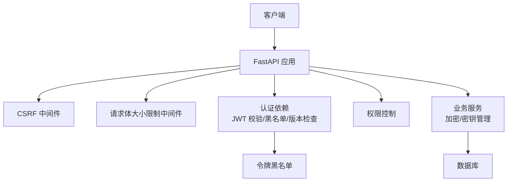
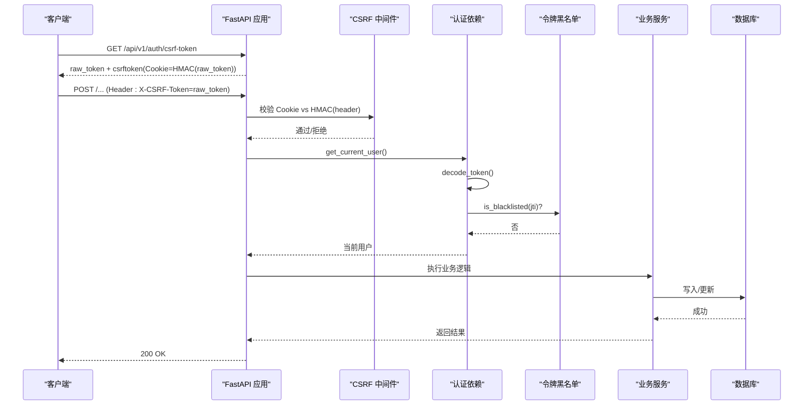
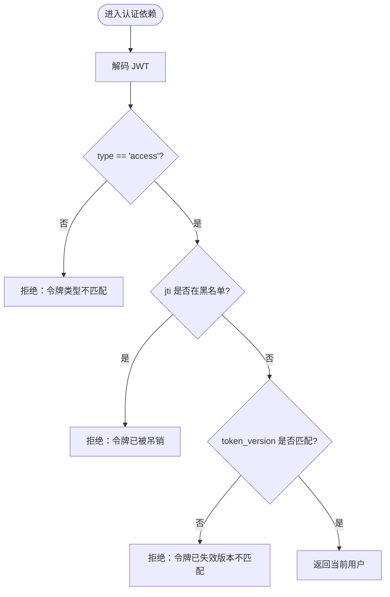
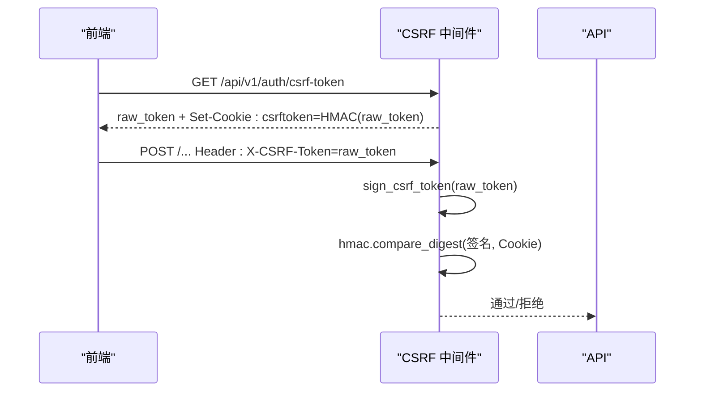
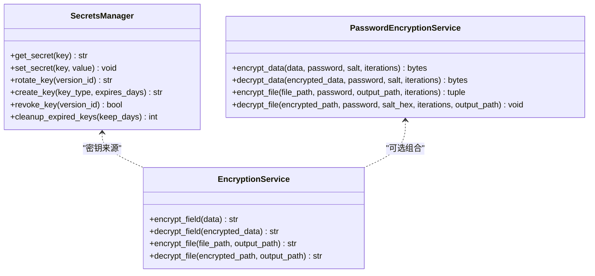
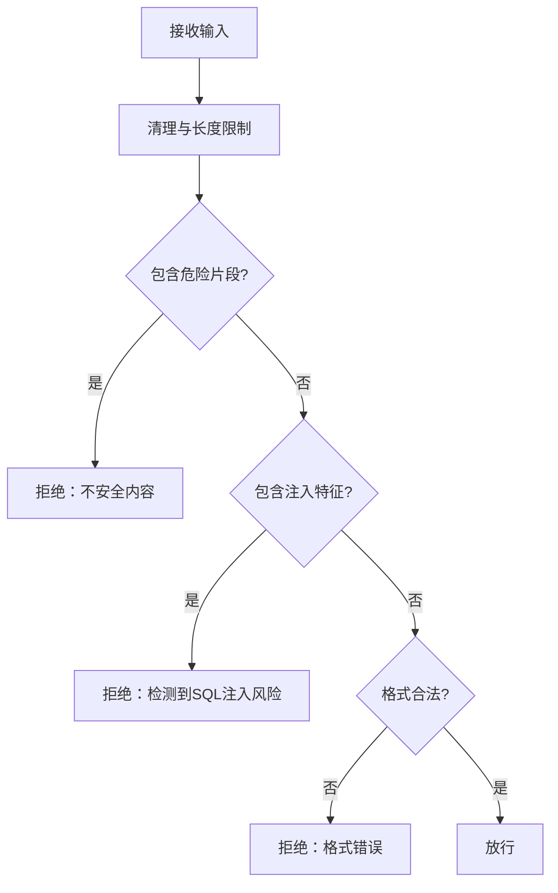
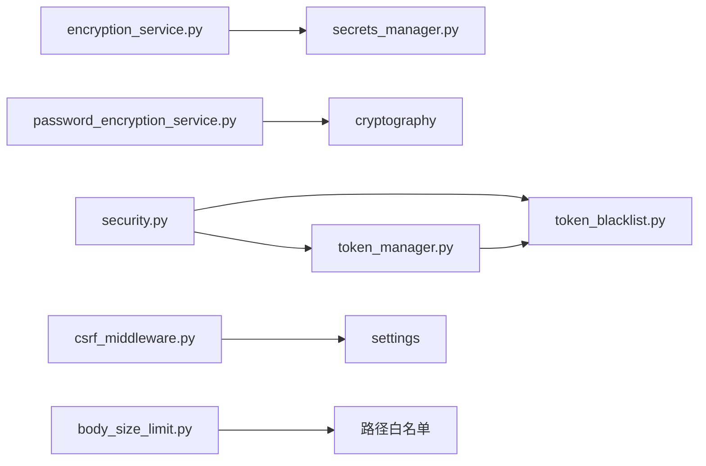

# 安全模式与反模式

<cite>
**本文引用的文件**
- [backend/app/core/security.py](file://backend/app/core/security.py)
- [backend/app/core/token_blacklist.py](file://backend/app/core/token_blacklist.py)
- [backend/app/core/token_manager.py](file://backend/app/core/token_manager.py)
- [backend/app/middleware/csrf_middleware.py](file://backend/app/middleware/csrf_middleware.py)
- [backend/app/services/password_encryption_service.py](file://backend/app/services/password_encryption_service.py)
- [backend/app/services/encryption_service.py](file://backend/app/services/encryption_service.py)
- [backend/app/services/secrets_manager.py](file://backend/app/services/secrets_manager.py)
- [backend/app/utils/input_validator.py](file://backend/app/utils/input_validator.py)
- [backend/app/middleware/body_size_limit.py](file://backend/app/middleware/body_size_limit.py)
</cite>

## 目录
1. [简介](#简介)
2. [项目结构](#项目结构)
3. [核心组件](#核心组件)
4. [架构总览](#架构总览)
5. [详细组件分析](#详细组件分析)
6. [依赖关系分析](#依赖关系分析)
7. [性能考量](#性能考量)
8. [故障排查指南](#故障排查指南)
9. [结论](#结论)
10. [附录](#附录)

## 简介
本指南面向“乡村振兴系统”的安全设计与实现，聚焦安全模式与反模式的识别、迁移与重构。内容覆盖认证授权、数据加密、会话管理、输入验证四大主题，结合仓库中的实际代码，给出适用场景、实现要点、注意事项与最佳实践，并提供从反模式到正模式的迁移路径与重构建议。

## 项目结构
本项目后端采用分层架构：API 层通过 FastAPI 暴露接口；中间件层提供 CSRF、请求体大小限制等横切能力；核心安全模块负责 JWT、密码哈希、速率限制与安全头；服务层封装加密、密钥管理等业务能力；工具层提供输入校验等通用能力。

**图表来源**
- [backend/app/core/security.py:243-336](file://backend/app/core/security.py#L243-L336)
- [backend/app/middleware/csrf_middleware.py:177-284](file://backend/app/middleware/csrf_middleware.py#L177-L284)
- [backend/app/middleware/body_size_limit.py:48-79](file://backend/app/middleware/body_size_limit.py#L48-L79)
- [backend/app/core/token_blacklist.py:27-70](file://backend/app/core/token_blacklist.py#L27-L70)

**章节来源**
- [backend/app/core/security.py:243-336](file://backend/app/core/security.py#L243-L336)
- [backend/app/middleware/csrf_middleware.py:177-284](file://backend/app/middleware/csrf_middleware.py#L177-L284)
- [backend/app/middleware/body_size_limit.py:48-79](file://backend/app/middleware/body_size_limit.py#L48-L79)

## 核心组件
- 认证与授权：基于 JWT 的访问令牌与刷新令牌，配合黑名单与 token_version 强制下线机制；角色与管理员权限校验。
- 会话管理：CSRF 保护（HMAC 签名增强）、请求体大小限制、安全响应头注入。
- 数据加密：PII 字段确定性加密（AES-SIV）、数据包与字段级 Fernet 加密、基于密码的 PBKDF2+Fernet 加密。
- 输入验证：XSS/SQL 注入检测、格式校验、必填字段校验。
- 密钥管理：运行时密钥存储、密钥轮换与撤销、持久化策略。

**章节来源**
- [backend/app/core/security.py:61-108](file://backend/app/core/security.py#L61-L108)
- [backend/app/core/security.py:210-235](file://backend/app/core/security.py#L210-L235)
- [backend/app/core/token_manager.py:64-127](file://backend/app/core/token_manager.py#L64-L127)
- [backend/app/core/token_blacklist.py:27-70](file://backend/app/core/token_blacklist.py#L27-L70)
- [backend/app/middleware/csrf_middleware.py:65-101](file://backend/app/middleware/csrf_middleware.py#L65-L101)
- [backend/app/services/encryption_service.py:181-224](file://backend/app/services/encryption_service.py#L181-L224)
- [backend/app/services/password_encryption_service.py:46-63](file://backend/app/services/password_encryption_service.py#L46-L63)
- [backend/app/utils/input_validator.py:12-71](file://backend/app/utils/input_validator.py#L12-L71)

## 架构总览
下图展示一次受保护的写请求在系统中的流转：前端获取 CSRF token，携带签名后的 cookie 与原始 token 头发起变更请求；中间件进行 CSRF 校验；随后进入认证依赖，完成 JWT 解码、黑名单与版本检查；最终到达业务服务执行操作并落库。

**图表来源**
- [backend/app/middleware/csrf_middleware.py:177-284](file://backend/app/middleware/csrf_middleware.py#L177-L284)
- [backend/app/core/security.py:243-336](file://backend/app/core/security.py#L243-L336)
- [backend/app/core/token_blacklist.py:60-70](file://backend/app/core/token_blacklist.py#L60-L70)

## 详细组件分析

### 认证与授权模式
- 模式要点
  - 使用 JWT access/refresh 双令牌，短生命周期 access 用于鉴权，长生命周期 refresh 用于续期。
  - 强制下线：token_version 不匹配或黑名单命中即拒绝。
  - 管理员权限：require_admin 依赖工厂统一拦截。
- 关键流程
  - 创建令牌对：生成 jti、exp、type 等声明，编码为 JWT。
  - 校验令牌：解码、类型校验、黑名单检查、版本检查。
  - 刷新令牌：校验 refresh，吊销旧 refresh，签发新 pair。
- 反模式与修复
  - 反模式：仅校验签名不过期/黑名单；允许 refresh 充当 access；忽略 token_version。
  - 修复：统一在认证依赖中执行类型、黑名单、版本三重校验；刷新时吊销旧 refresh。
- 适用场景
  - 前后端分离、无状态鉴权、需要可吊销与会话集中管控的场景。

**图表来源**
- [backend/app/core/security.py:243-336](file://backend/app/core/security.py#L243-L336)
- [backend/app/core/token_manager.py:135-169](file://backend/app/core/token_manager.py#L135-L169)
- [backend/app/core/token_blacklist.py:60-70](file://backend/app/core/token_blacklist.py#L60-L70)

**章节来源**
- [backend/app/core/security.py:210-235](file://backend/app/core/security.py#L210-L235)
- [backend/app/core/security.py:243-336](file://backend/app/core/security.py#L243-L336)
- [backend/app/core/token_manager.py:64-127](file://backend/app/core/token_manager.py#L64-L127)
- [backend/app/core/token_manager.py:135-169](file://backend/app/core/token_manager.py#L135-L169)
- [backend/app/core/token_manager.py:176-210](file://backend/app/core/token_manager.py#L176-L210)
- [backend/app/core/token_blacklist.py:27-70](file://backend/app/core/token_blacklist.py#L27-L70)

### 会话管理与 CSRF 防护
- 模式要点
  - Double Submit Cookie + HMAC 签名：Cookie 存放 HMAC(raw_token)，Header 携带 raw_token，服务端常量时间比较。
  - Token 过期窗口：内嵌时间戳，超过阈值拒绝。
  - 豁免路径与方法：GET/HEAD/OPTIONS 及安全入口放行。
- 反模式与修复
  - 反模式：仅同源检查、明文比对、未做过期校验。
  - 修复：启用 HMAC 签名、严格过期判定、最小化豁免范围。
- 适用场景
  - 浏览器端跨站请求防护，尤其涉及状态变更的写操作。

**图表来源**
- [backend/app/middleware/csrf_middleware.py:65-101](file://backend/app/middleware/csrf_middleware.py#L65-L101)
- [backend/app/middleware/csrf_middleware.py:177-284](file://backend/app/middleware/csrf_middleware.py#L177-L284)

**章节来源**
- [backend/app/middleware/csrf_middleware.py:177-284](file://backend/app/middleware/csrf_middleware.py#L177-L284)

### 数据加密模式
- PII 字段透明加密（AES-SIV）
  - 确定性加密：同一明文恒得同一密文，支持等值查询。
  - 标记前缀：enc.v1: 便于迁移回填与读取侧识别。
  - 密钥来源：ENCRYPTION_KEY 或运行时密钥存储。
- 数据包与字段级加密（Fernet）
  - 优先使用配置密钥，否则加载/生成并持久化到运行时密钥存储。
  - 提供字段级加解密与文件包加解密能力。
- 基于密码的加密（PBKDF2+Fernet）
  - 从用户密码派生密钥，适合“凭口令解密”的场景（如导出包）。
- 反模式与修复
  - 反模式：硬编码密钥、明文存储敏感字段、弱算法或无盐。
  - 修复：使用 AES-SIV/Fernet/PBKDF2，密钥外部化与轮换，标记兼容历史数据。

**图表来源**
- [backend/app/services/secrets_manager.py:13-193](file://backend/app/services/secrets_manager.py#L13-L193)
- [backend/app/services/encryption_service.py:12-175](file://backend/app/services/encryption_service.py#L12-L175)
- [backend/app/services/password_encryption_service.py:23-206](file://backend/app/services/password_encryption_service.py#L23-L206)

**章节来源**
- [backend/app/services/encryption_service.py:181-224](file://backend/app/services/encryption_service.py#L181-L224)
- [backend/app/services/password_encryption_service.py:46-63](file://backend/app/services/password_encryption_service.py#L46-L63)
- [backend/app/services/secrets_manager.py:71-108](file://backend/app/services/secrets_manager.py#L71-L108)

### 输入验证模式
- 模式要点
  - XSS 防护：正则检测危险片段并拒绝。
  - SQL 注入防护：常见危险关键字与注释符号检测。
  - 格式校验：邮箱、手机号、身份证号、文件扩展名与大小、数值范围、必填字段。
- 反模式与修复
  - 反模式：直接拼接 SQL、信任前端输入、无长度限制。
  - 修复：统一使用输入验证器，白名单校验，长度与类型约束。

**图表来源**
- [backend/app/utils/input_validator.py:31-71](file://backend/app/utils/input_validator.py#L31-L71)

**章节来源**
- [backend/app/utils/input_validator.py:12-124](file://backend/app/utils/input_validator.py#L12-L124)

### 速率限制与请求体限制
- 速率限制
  - 内存滑动窗口，默认 60 次/分钟，键唯一且必填，缺失 key 或 request 时拒绝。
  - 定期清理过期键，防止内存泄漏。
- 请求体大小限制
  - 非 multipart 请求默认 10MB 上限，特定路径放宽以支持批量导入/上传。
- 反模式与修复
  - 反模式：无速率限制导致暴力破解；无大小限制导致 DoS。
  - 修复：启用限流与大小限制，合理设置豁免路径。

**章节来源**
- [backend/app/core/security.py:419-488](file://backend/app/core/security.py#L419-L488)
- [backend/app/middleware/body_size_limit.py:48-79](file://backend/app/middleware/body_size_limit.py#L48-L79)

## 依赖关系分析
- 认证链路依赖
  - security.get_current_user 依赖 token 解码、黑名单、数据库用户查询与审计上下文。
  - token_manager.validate_token/revoke_token 依赖黑名单与数据库持久化。
- 加密链路依赖
  - encryption_service._get_cipher 依赖配置与运行时密钥存储。
  - password_encryption_service 依赖 PBKDF2 与 Fernet。
- 中间件依赖
  - CSRF 中间件依赖 HMAC 签名与配置开关。
  - 请求体大小限制中间件依赖 Content-Type 与路径白名单。

**图表来源**
- [backend/app/core/security.py:243-336](file://backend/app/core/security.py#L243-L336)
- [backend/app/core/token_manager.py:135-169](file://backend/app/core/token_manager.py#L135-L169)
- [backend/app/services/encryption_service.py:181-224](file://backend/app/services/encryption_service.py#L181-L224)
- [backend/app/middleware/csrf_middleware.py:177-284](file://backend/app/middleware/csrf_middleware.py#L177-L284)
- [backend/app/middleware/body_size_limit.py:48-79](file://backend/app/middleware/body_size_limit.py#L48-L79)

**章节来源**
- [backend/app/core/security.py:243-336](file://backend/app/core/security.py#L243-L336)
- [backend/app/core/token_manager.py:135-169](file://backend/app/core/token_manager.py#L135-L169)
- [backend/app/services/encryption_service.py:181-224](file://backend/app/services/encryption_service.py#L181-L224)
- [backend/app/middleware/csrf_middleware.py:177-284](file://backend/app/middleware/csrf_middleware.py#L177-L284)
- [backend/app/middleware/body_size_limit.py:48-79](file://backend/app/middleware/body_size_limit.py#L48-L79)

## 性能考量
- JWT 解码与黑名单检查在每次请求触发，应确保黑名单查询高效（内存+数据库持久化）。
- 密码哈希使用 bcrypt，注意长度截断避免异常；在高并发登录场景下需评估成本。
- 速率限制使用内存滑动窗口，需定期清理过期键以避免内存增长。
- 加密操作（AES-SIV、Fernet）CPU 密集，建议缓存 cipher 实例与密钥，减少重复初始化。

[本节为通用指导，不直接分析具体文件]

## 故障排查指南
- 认证失败
  - 现象：401 未认证/无效令牌/令牌类型不匹配/令牌已失效。
  - 排查：检查 Authorization 头、JWT 签名与算法、黑名单、token_version。
  - 参考：认证依赖与令牌校验逻辑。
- CSRF 验证失败
  - 现象：403 CSRF 验证失败/过期。
  - 排查：确认是否调用获取 token 接口、Cookie 与 Header 是否成对出现、是否启用 CSRF。
  - 参考：CSRF 中间件流程。
- 加密失败
  - 现象：解密失败/密钥初始化失败。
  - 排查：ENCRYPTION_KEY 是否存在、运行时密钥存储是否可读写、密钥是否轮换。
  - 参考：加密服务密钥获取逻辑。
- 请求被拒
  - 现象：413 请求体过大/400 输入非法。
  - 排查：Content-Length、路径是否在豁免列表、输入是否符合校验规则。
  - 参考：请求体大小限制与输入验证器。

**章节来源**
- [backend/app/core/security.py:243-336](file://backend/app/core/security.py#L243-L336)
- [backend/app/middleware/csrf_middleware.py:177-284](file://backend/app/middleware/csrf_middleware.py#L177-L284)
- [backend/app/services/encryption_service.py:181-224](file://backend/app/services/encryption_service.py#L181-L224)
- [backend/app/middleware/body_size_limit.py:48-79](file://backend/app/middleware/body_size_limit.py#L48-L79)
- [backend/app/utils/input_validator.py:31-71](file://backend/app/utils/input_validator.py#L31-L71)

## 结论
本项目在认证授权、会话管理、数据加密与输入验证方面形成了较为完整的安全基线。通过 JWT 双令牌、黑名单与版本控制实现强会话管理；通过 HMAC 增强的 CSRF 防护提升写操作安全性；通过 AES-SIV 与 Fernet 提供灵活的数据加密方案；通过统一的输入验证器降低注入与 XSS 风险。建议在持续迭代中坚持密钥外部化、最小权限原则与可观测性建设，逐步消除遗留反模式。

[本节为总结性内容，不直接分析具体文件]

## 附录

### 反模式到正模式迁移清单
- 硬编码密钥 → 使用环境变量/运行时密钥存储，支持轮换与撤销。
  - 参考：[secrets_manager.py:25-50](file://backend/app/services/secrets_manager.py#L25-L50)、[encryption_service.py:181-224](file://backend/app/services/encryption_service.py#L181-L224)
- 明文存储密码 → 使用 bcrypt 哈希，长度截断兼容。
  - 参考：[security.py:122-148](file://backend/app/core/security.py#L122-L148)
- 不安全的直接对象引用 → 引入 RBAC 与数据权限校验，禁止直接使用 ID 访问资源。
  - 参考：[security.py:350-371](file://backend/app/core/security.py#L350-371)
- 缺乏访问控制 → 统一通过依赖注入进行鉴权，禁用匿名写操作。
  - 参考：[security.py:339-371](file://backend/app/core/security.py#L339-371)
- 缺少 CSRF 保护 → 启用 HMAC 签名流程，严格过期与豁免策略。
  - 参考：[csrf_middleware.py:177-284](file://backend/app/middleware/csrf_middleware.py#L177-284)
- 无速率限制/大小限制 → 启用限流与请求体大小限制，合理豁免路径。
  - 参考：[security.py:419-488](file://backend/app/core/security.py#L419-488)、[body_size_limit.py:48-79](file://backend/app/middleware/body_size_limit.py#L48-79)

[本节为迁移建议汇总，不直接分析具体文件]