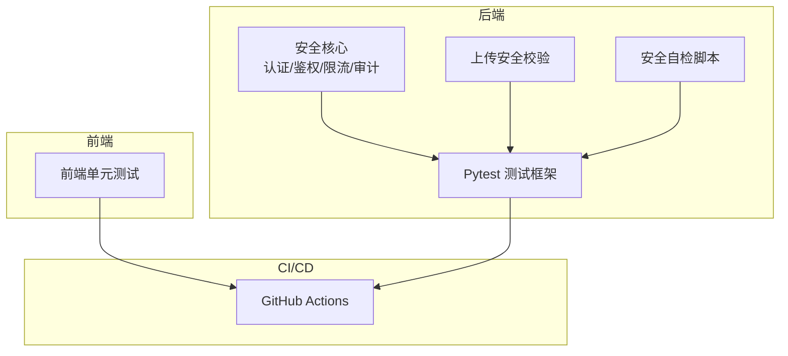
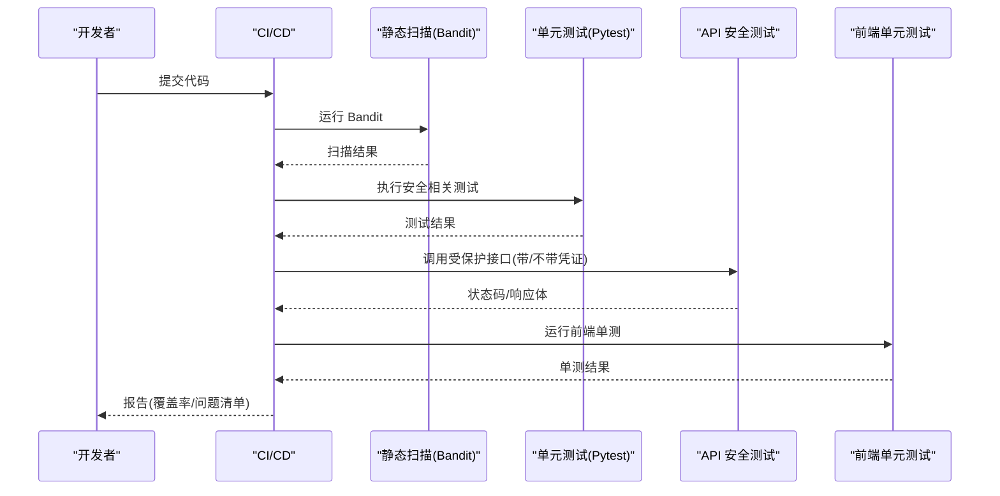
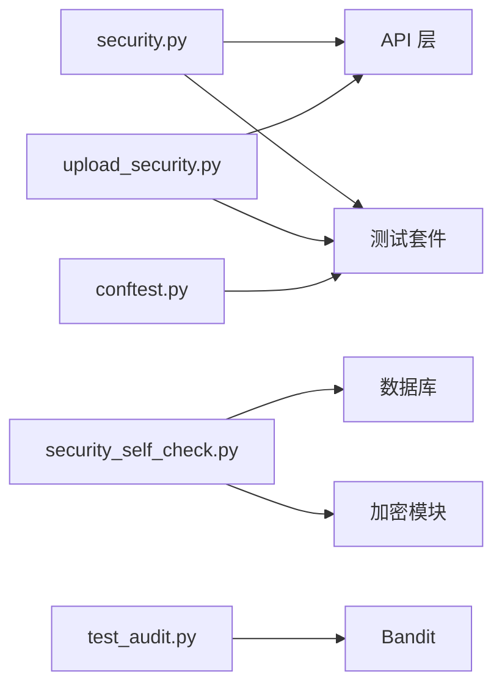

# 安全测试策略

<cite>
**本文引用的文件**
- [backend/app/core/security.py](file://backend/app/core/security.py)
- [backend/app/core/upload_security.py](file://backend/app/core/upload_security.py)
- [backend/scripts/security_self_check.py](file://backend/scripts/security_self_check.py)
- [backend/tests/security/test_audit.py](file://backend/tests/security/test_audit.py)
- [backend/tests/security/test_data_isolation.py](file://backend/tests/security/test_data_isolation.py)
- [backend/pytest.ini](file://backend/pytest.ini)
- [backend/tests/conftest.py](file://backend/tests/conftest.py)
- [backend/.bandit](file://backend/.bandit)
- [backend/scripts/deep_scan.py](file://backend/scripts/deep_scan.py)
- [backend/tests/unit/test_system_zero_trust_api.py](file://backend/tests/unit/test_system_zero_trust_api.py)
- [frontend/tests/unit/views/system/SystemViewsBatch.test.ts](file://frontend/tests/unit/views/system/SystemViewsBatch.test.ts)
- [frontend/tests/unit/views/system/ZeroTrust.test.ts](file://frontend/tests/unit/views/system/ZeroTrust.test.ts)
- [README.md](file://README.md)
</cite>

## 目录
1. [引言](#引言)
2. [项目结构](#项目结构)
3. [核心组件](#核心组件)
4. [架构总览](#架构总览)
5. [详细组件分析](#详细组件分析)
6. [依赖关系分析](#依赖关系分析)
7. [性能考虑](#性能考虑)
8. [故障排查指南](#故障排查指南)
9. [结论](#结论)
10. [附录](#附录)

## 引言
本方案面向“军事乡村振兴管理系统”的安全测试，目标是建立可落地、可度量、可持续回归的安全测试体系。内容覆盖渗透测试（OWASP Top 10、API安全、前端安全）、模糊测试（输入边界、异常输入、内存安全）、安全回归测试（用例库与自动化集成），以及安全测试环境搭建（数据准备、漏洞模拟、报告生成）和常见漏洞的测试用例与验证方法。

## 项目结构
本项目在前后端均具备完善的安全相关能力与测试基础设施：
- 后端安全能力集中在 core 模块（认证鉴权、速率限制、安全头、审计日志等），上传安全校验独立成模块；提供安全自检脚本与静态扫描配置。
- 测试体系基于 pytest，包含单元、集成与安全专项测试；通过 conftest 提供隔离的数据库、上传目录与认证夹具，保障测试稳定性与可重复性。
- 前端单元测试覆盖零信任页面与系统视图，Mock API 响应以验证交互逻辑。
- CI/CD 流水线集成 PR 检查、夜间全量测试与覆盖率门禁。

**图表来源**
- [backend/app/core/security.py:1-713](file://backend/app/core/security.py#L1-L713)
- [backend/app/core/upload_security.py:1-195](file://backend/app/core/upload_security.py#L1-L195)
- [backend/scripts/security_self_check.py:1-183](file://backend/scripts/security_self_check.py#L1-L183)
- [backend/pytest.ini:1-39](file://backend/pytest.ini#L1-L39)
- [frontend/tests/unit/views/system/SystemViewsBatch.test.ts:92-125](file://frontend/tests/unit/views/system/SystemViewsBatch.test.ts#L92-L125)
- [README.md:146-153](file://README.md#L146-L153)

**章节来源**
- [backend/app/core/security.py:1-713](file://backend/app/core/security.py#L1-L713)
- [backend/app/core/upload_security.py:1-195](file://backend/app/core/upload_security.py#L1-L195)
- [backend/scripts/security_self_check.py:1-183](file://backend/scripts/security_self_check.py#L1-L183)
- [backend/pytest.ini:1-39](file://backend/pytest.ini#L1-L39)
- [backend/tests/conftest.py:1-737](file://backend/tests/conftest.py#L1-L737)
- [frontend/tests/unit/views/system/SystemViewsBatch.test.ts:92-125](file://frontend/tests/unit/views/system/SystemViewsBatch.test.ts#L92-L125)
- [README.md:146-153](file://README.md#L146-L153)

## 核心组件
- 认证与鉴权：JWT 签发/校验、令牌吊销、角色权限控制、敏感字段脱敏、密码策略。
- 速率限制：滑动窗口限流，防暴力破解与资源耗尽。
- 上传安全：扩展名白名单、MIME 类型校验、文件大小限制、恶意内容检测、文件名清洗。
- 安全中间件：安全响应头注入、缓存控制。
- 审计日志：写操作归因、失败回滚保护。
- 安全自检：配置、数据库、加密、审计、文件系统等多维度健康检查。
- 静态扫描：Bandit 规则集与跳过项，结合 pytest 执行。

**章节来源**
- [backend/app/core/security.py:1-713](file://backend/app/core/security.py#L1-L713)
- [backend/app/core/upload_security.py:1-195](file://backend/app/core/upload_security.py#L1-L195)
- [backend/scripts/security_self_check.py:1-183](file://backend/scripts/security_self_check.py#L1-L183)
- [backend/.bandit:1-14](file://backend/.bandit#L1-L14)
- [backend/tests/security/test_audit.py:1-41](file://backend/tests/security/test_audit.py#L1-L41)

## 架构总览
安全测试贯穿“代码—接口—前端—CI”的全链路：
- 代码层：静态扫描（Bandit）、安全自检脚本、单元测试覆盖关键路径。
- 接口层：API 安全测试（认证、授权、参数校验、速率限制、上传安全）。
- 前端层：单元测试验证零信任评估、系统视图渲染与交互。
- 持续集成：PR 检查与夜间全量测试，输出覆盖率与 JUnit 报告。

**图表来源**
- [backend/tests/security/test_audit.py:1-41](file://backend/tests/security/test_audit.py#L1-L41)
- [backend/pytest.ini:1-39](file://backend/pytest.ini#L1-L39)
- [backend/tests/conftest.py:393-501](file://backend/tests/conftest.py#L393-L501)
- [frontend/tests/unit/views/system/ZeroTrust.test.ts:244-279](file://frontend/tests/unit/views/system/ZeroTrust.test.ts#L244-L279)
- [README.md:146-153](file://README.md#L146-L153)

## 详细组件分析

### 渗透测试实施方案（OWASP Top 10、API 安全、前端安全）
- OWASP Top 10 映射到现有能力与测试：
  - A01 破坏访问控制：通过未认证/越权请求验证 401/403 行为；使用 conftest 提供的不同角色夹具进行鉴权断言。
  - A02 加密失效：校验 HTTPS 传输、JWT 算法与密钥管理、敏感字段脱敏。
  - A03 注入：SQL 注入防护（ORM 参数化）、XSS 防护（输入清洗、安全头）。
  - A04 不安全设计：最小权限原则、数据隔离（组织级多租户）。
  - A05 安全配置缺陷：安全自检脚本检查 SECRET_KEY、CSRF、速率限制、WAL、外键约束等。
  - A06 脆弱组件：依赖与镜像扫描（SBOM）、Bandit 规则集。
  - A07 身份识别与认证失败：密码策略、令牌吊销、版本校验、登录失败计数。
  - A08 软件与数据完整性：上传安全校验（扩展名、MIME、大小、内容签名）。
  - A09 日志记录与监控不足：审计日志写入与回滚保护。
  - A10 服务端请求伪造：严格来源 IP 获取策略，不轻信代理头。

- API 安全测试要点：
  - 认证缺失返回 401；非管理员访问受限资源返回 403。
  - 参数校验：长度、格式、允许字符集；非法输入应拒绝并返回错误码。
  - 速率限制：高频请求应被限流。
  - 上传安全：仅允许白名单扩展与 MIME，禁止可执行与脚本特征。

- 前端安全测试要点：
  - 零信任评估页面正确渲染分数、等级与安全建议。
  - 系统视图加载与展示正常，Mock API 响应符合预期。

**章节来源**
- [backend/tests/security/test_data_isolation.py:1-41](file://backend/tests/security/test_data_is isolation.py#L1-L41)
- [backend/app/core/security.py:524-590](file://backend/app/core/security.py#L524-L590)
- [backend/app/core/security.py:598-702](file://backend/app/core/security.py#L598-L702)
- [backend/app/core/upload_security.py:57-127](file://backend/app/core/upload_security.py#L57-L127)
- [backend/tests/unit/test_system_zero_trust_api.py:35-66](file://backend/tests/unit/test_system_zero_trust_api.py#L35-L66)
- [frontend/tests/unit/views/system/ZeroTrust.test.ts:244-279](file://frontend/tests/unit/views/system/ZeroTrust.test.ts#L244-L279)
- [frontend/tests/unit/views/system/SystemViewsBatch.test.ts:92-125](file://frontend/tests/unit/views/system/SystemViewsBatch.test.ts#L92-L125)

### 模糊测试实现方案（输入边界、异常输入、内存安全）
- 输入边界测试：
  - 字符串长度上下界、空值、超长输入、特殊字符与编码异常。
  - 数值范围、负数、溢出、除零场景。
  - JSON/XML 结构畸形、嵌套过深、循环引用。
- 异常输入处理：
  - 非法类型、缺失必填字段、枚举越界、时间戳非法。
  - 并发与竞态条件下的输入一致性。
- 内存安全测试：
  - 大对象上传、超大请求体、内存泄漏检测（长时间压测后内存曲线）。
  - 第三方库兼容性与异常路径（如 bcrypt/passlib 补丁）。

实施建议：
- 使用 Pytest + Hypothesis 或自定义 fuzz 驱动对核心服务层与 API 进行随机/结构化输入生成。
- 针对上传模块进行二进制内容探测与魔数校验。
- 结合速率限制与超时控制，避免资源耗尽。

**章节来源**
- [backend/app/core/upload_security.py:130-195](file://backend/app/core/upload_security.py#L130-L195)
- [backend/app/core/security.py:21-52](file://backend/app/core/security.py#L21-L52)
- [backend/tests/unit/test_data_validator_service.py:766-831](file://backend/tests/unit/test_data_validator_service.py#L766-L831)

### 安全回归测试设计原则（用例库建设、自动化集成）
- 用例库建设：
  - 按 OWASP Top 10 分类维护用例，覆盖认证、授权、注入、XSS、CSRF、上传、日志等。
  - 每个用例包含前置条件、输入、期望结果、风险等级与修复建议。
- 自动化集成：
  - 将安全用例纳入 pytest 标记（security），在 PR 与夜间构建中执行。
  - 结合 Bandit 扫描与覆盖率门禁，确保新增代码无高危问题且覆盖关键路径。
  - 前端单测与后端 API 测试统一在 CI 中串联执行。

**章节来源**
- [backend/pytest.ini:7-17](file://backend/pytest.ini#L7-L17)
- [backend/tests/security/test_audit.py:14-41](file://backend/tests/security/test_audit.py#L14-L41)
- [backend/.bandit:1-14](file://backend/.bandit#L1-L14)
- [README.md:146-153](file://README.md#L146-L153)

### 安全测试环境搭建指南（数据准备、漏洞模拟、报告生成）
- 数据准备：
  - 使用 conftest 提供的隔离数据库与上传目录，避免污染真实环境。
  - 预置多角色用户与组织数据，便于权限与隔离测试。
- 漏洞模拟环境：
  - 启用弱口令、关闭 CSRF、禁用速率限制等开关用于测试，生产默认开启。
  - 使用 Mock 注入异常（如数据库回滚失败）验证健壮性。
- 报告生成：
  - 使用 pytest 输出 JUnit 报告与覆盖率；Bandit 输出 JSON 结果。
  - 安全自检脚本汇总配置、数据库、加密、审计、文件系统检查结果。

**章节来源**
- [backend/tests/conftest.py:14-23](file://backend/tests/conftest.py#L14-L23)
- [backend/tests/conftest.py:393-501](file://backend/tests/conftest.py#L393-L501)
- [backend/scripts/security_self_check.py:46-177](file://backend/scripts/security_self_check.py#L46-L177)
- [backend/tests/security/test_audit.py:23-36](file://backend/tests/security/test_audit.py#L23-L36)

### 常见安全漏洞的测试用例与验证方法
- SQL 注入：
  - 构造 UNION SELECT、DROP TABLE、注释注入等输入，验证 ORM 参数化与输入清洗。
- XSS：
  - 注入 <script>、事件处理器、HTML 实体，验证输出转义与安全头。
- 越权访问：
  - 未认证访问返回 401；普通用户访问管理员接口返回 403。
- 上传漏洞：
  - 上传 .exe/.sh/.py 等危险扩展，验证白名单与 MIME 校验。
- 会话劫持：
  - 篡改 JWT、过期令牌、吊销令牌，验证解码与黑名单机制。
- 信息泄露：
  - 检查日志是否脱敏敏感字段，响应头是否包含多余信息。

**章节来源**
- [backend/app/core/security.py:379-411](file://backend/app/core/security.py#L379-L411)
- [backend/app/core/security.py:694-712](file://backend/app/core/security.py#L694-L712)
- [backend/app/core/upload_security.py:19-50](file://backend/app/core/upload_security.py#L19-L50)
- [backend/tests/unit/test_system_zero_trust_api.py:44-66](file://backend/tests/unit/test_system_zero_trust_api.py#L44-L66)

## 依赖关系分析
安全能力与测试之间的依赖关系如下：
- security.py 提供认证、鉴权、限流、审计等核心能力，被 API 与测试广泛依赖。
- upload_security.py 为上传入口提供安全校验，被导入至相关服务与测试。
- security_self_check.py 依赖配置、数据库、加密模块，用于运行时安全检查。
- test_audit.py 依赖 Bandit 与 pytest，执行静态扫描与合规断言。
- conftest.py 提供测试夹具与环境隔离，支撑所有后端测试稳定运行。

**图表来源**
- [backend/app/core/security.py:1-713](file://backend/app/core/security.py#L1-L713)
- [backend/app/core/upload_security.py:1-195](file://backend/app/core/upload_security.py#L1-L195)
- [backend/scripts/security_self_check.py:1-183](file://backend/scripts/security_self_check.py#L1-L183)
- [backend/tests/security/test_audit.py:1-41](file://backend/tests/security/test_audit.py#L1-L41)
- [backend/tests/conftest.py:1-737](file://backend/tests/conftest.py#L1-L737)

**章节来源**
- [backend/app/core/security.py:1-713](file://backend/app/core/security.py#L1-L713)
- [backend/app/core/upload_security.py:1-195](file://backend/app/core/upload_security.py#L1-L195)
- [backend/scripts/security_self_check.py:1-183](file://backend/scripts/security_self_check.py#L1-L183)
- [backend/tests/security/test_audit.py:1-41](file://backend/tests/security/test_audit.py#L1-L41)
- [backend/tests/conftest.py:1-737](file://backend/tests/conftest.py#L1-L737)

## 性能考虑
- 速率限制采用滑动窗口与周期性清理，避免内存泄漏；测试中需确保 key 与 request 传入，防止静默放行。
- 上传安全校验在早期阶段拦截大文件与恶意内容，减少后续处理开销。
- 审计日志写入失败时回滚并记录警告，不影响主流程但需关注日志质量。
- 前端单测使用 Mock API，避免网络延迟影响执行效率。

[本节为通用指导，无需具体文件分析]

## 故障排查指南
- 认证失败：
  - 检查 JWT 解码与黑名单校验；确认 token 类型与版本匹配。
- 上传失败：
  - 核对扩展名与 MIME 白名单；检查文件大小与内容魔数。
- 审计日志缺失：
  - 检查数据库连接与回滚逻辑；确认审计写入路径与权限。
- 静态扫描告警：
  - 根据 Bandit 规则定位问题；必要时调整规则或修复代码。

**章节来源**
- [backend/app/core/security.py:228-336](file://backend/app/core/security.py#L228-L336)
- [backend/app/core/upload_security.py:57-127](file://backend/app/core/upload_security.py#L57-L127)
- [backend/app/core/security.py:644-687](file://backend/app/core/security.py#L644-L687)
- [backend/tests/security/test_audit.py:14-41](file://backend/tests/security/test_audit.py#L14-L41)

## 结论
本方案基于现有安全能力与测试基础设施，构建了覆盖渗透测试、模糊测试与安全回归的完整体系。通过静态扫描、自动化测试与环境隔离，确保系统在开发、集成与发布各阶段均具备可度量的安全保障。建议持续完善用例库、强化前端安全测试与 CI 门禁，形成闭环的质量保障机制。

[本节为总结，无需具体文件分析]

## 附录
- 常用命令：
  - 运行安全相关测试：pytest -m security -v
  - 执行 Bandit 扫描：python -m bandit -r app/ -ll -f json -s B101,B110
  - 运行安全自检：python backend/scripts/security_self_check.py
- 参考文档：
  - CI/CD 流水线说明与任务定义
  - 前端单测 Mock 配置与断言示例

**章节来源**
- [backend/pytest.ini:7-17](file://backend/pytest.ini#L7-L17)
- [backend/tests/security/test_audit.py:23-36](file://backend/tests/security/test_audit.py#L23-L36)
- [backend/scripts/security_self_check.py:180-183](file://backend/scripts/security_self_check.py#L180-L183)
- [README.md:146-153](file://README.md#L146-L153)
- [frontend/tests/unit/views/system/SystemViewsBatch.test.ts:92-125](file://frontend/tests/unit/views/system/SystemViewsBatch.test.ts#L92-L125)