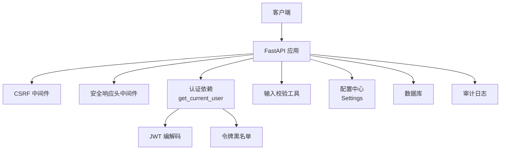
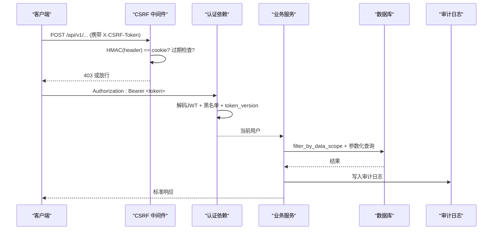
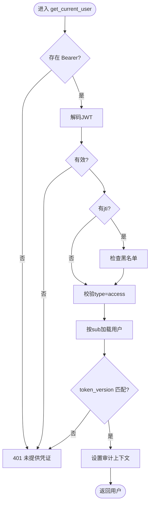
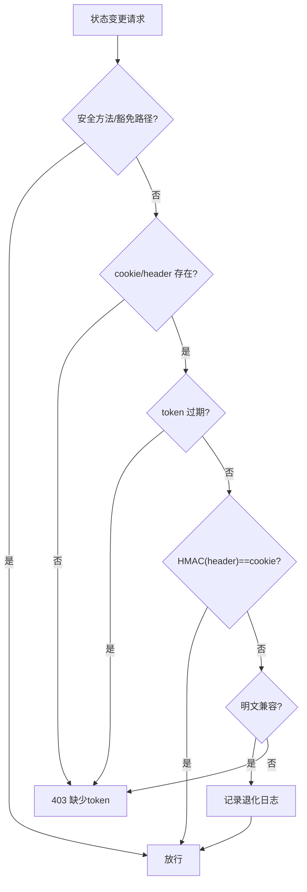
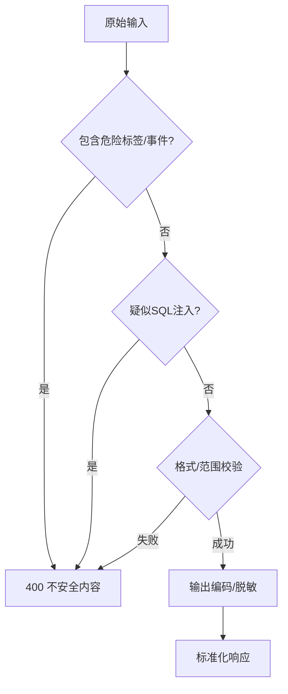
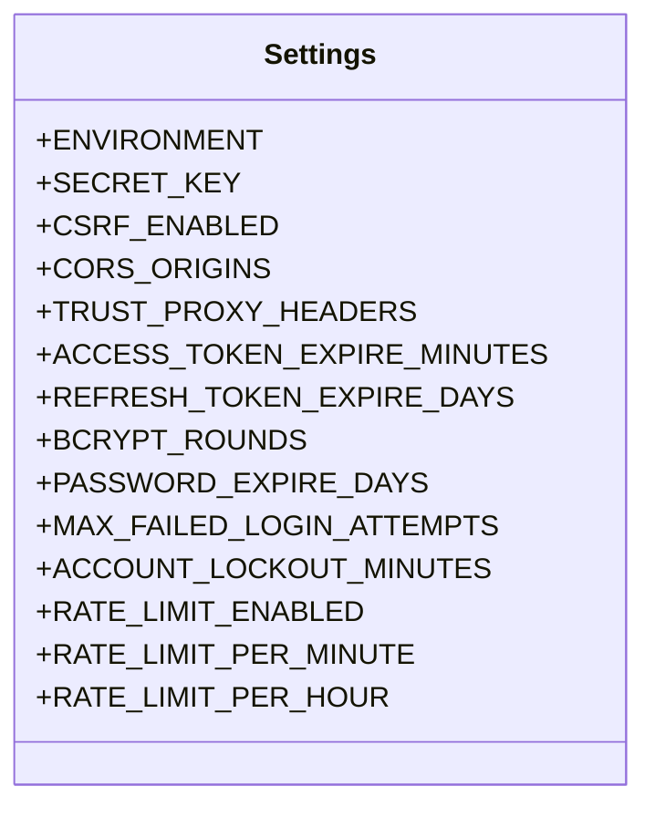
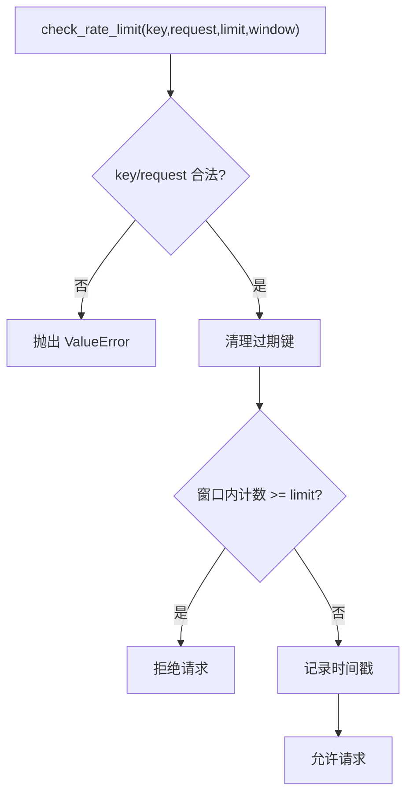
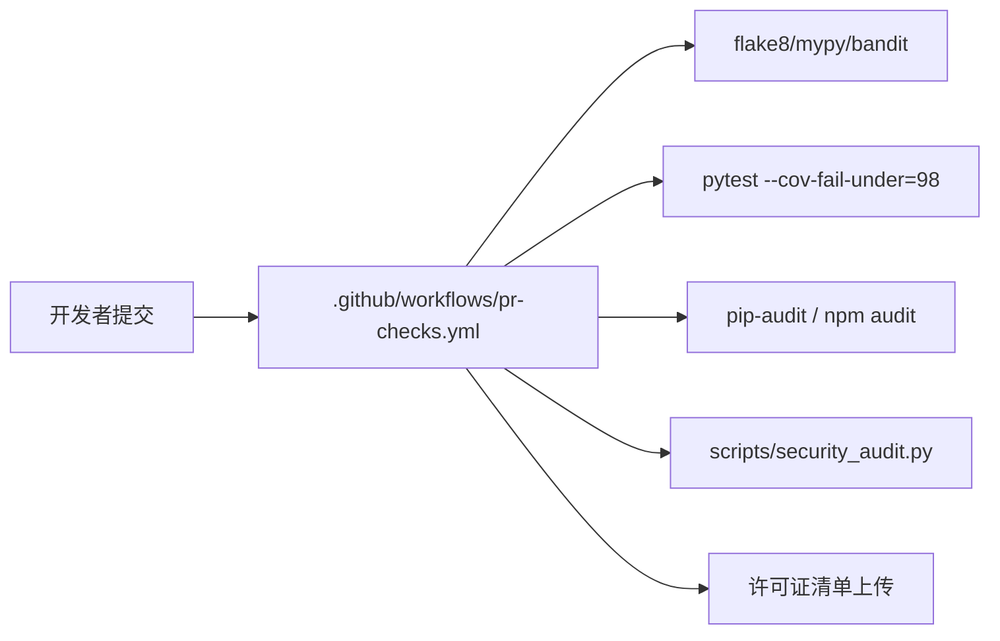
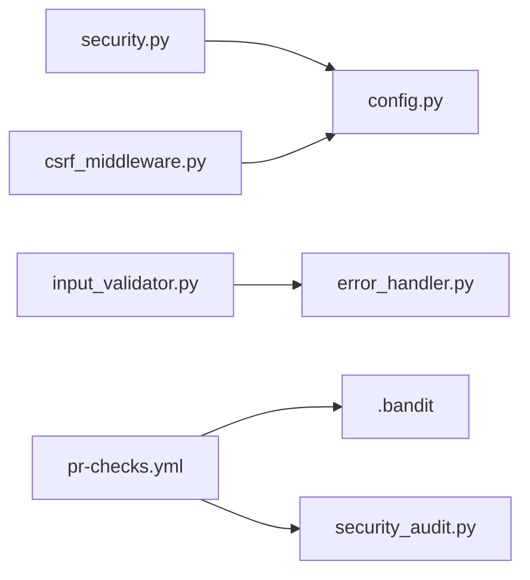

# 安全编码最佳实践

<cite>
**本文引用的文件**
- [backend/app/core/security.py](file://backend/app/core/security.py)
- [backend/app/core/config.py](file://backend/app/core/config.py)
- [backend/app/middleware/csrf_middleware.py](file://backend/app/middleware/csrf_middleware.py)
- [backend/app/utils/input_validator.py](file://backend/app/utils/input_validator.py)
- [backend/.bandit](file://backend/.bandit)
- [.github/workflows/pr-checks.yml](file://.github/workflows/pr-checks.yml)
- [scripts/security_audit.py](file://scripts/security_audit.py)
- [backend/tests/security/test_audit.py](file://backend/tests/security/test_audit.py)
- [backend/scripts/deep_scan.py](file://backend/scripts/deep_scan.py)
- [docs/03-开发文档/04-安全文档/安全加固.md](file://docs/03-开发文档/04-安全文档/安全加固.md)
- [AGENTS.md](file://AGENTS.md)
</cite>

## 目录
1. [简介](#简介)
2. [项目结构](#项目结构)
3. [核心组件](#核心组件)
4. [架构总览](#架构总览)
5. [详细组件分析](#详细组件分析)
6. [依赖关系分析](#依赖关系分析)
7. [性能与安全考量](#性能与安全考量)
8. [故障排查指南](#故障排查指南)
9. [结论](#结论)
10. [附录](#附录)

## 简介
本指导面向研发与测试团队，围绕输入验证、输出编码、错误处理、安全配置、代码审查流程、安全测试策略以及持续安全监控，提供可落地的最佳实践。内容基于仓库中现有实现（认证鉴权、CSRF、速率限制、输入校验、静态扫描、CI门禁等），确保建议与代码一致且可直接执行。

## 项目结构
本项目在后端集中实现了安全能力：
- 认证与授权：JWT、黑名单、角色校验、令牌版本控制
- 防护中间件：CSRF、安全响应头、请求体大小限制、审计上下文
- 输入与输出：统一输入校验、日志脱敏、敏感字段保护
- 配置管理：密钥生成与持久化、CORS白名单、加密开关、代理信任策略
- 安全扫描与门禁：Bandit、pip-audit/npm audit、综合脚本审计、覆盖率门禁

**图示来源**
- [backend/app/core/security.py:243-336](file://backend/app/core/security.py#L243-L336)
- [backend/app/middleware/csrf_middleware.py:177-284](file://backend/app/middleware/csrf_middleware.py#L177-L284)
- [backend/app/core/config.py:54-160](file://backend/app/core/config.py#L54-L160)

**章节来源**
- [backend/app/core/security.py:243-336](file://backend/app/core/security.py#L243-L336)
- [backend/app/middleware/csrf_middleware.py:177-284](file://backend/app/middleware/csrf_middleware.py#L177-L284)
- [backend/app/core/config.py:54-160](file://backend/app/core/config.py#L54-L160)

## 核心组件
- 认证与令牌：JWT 签发/校验、黑名单校验、token_version 强制下线、类型校验
- CSRF 保护：HMAC 签名模式、过期检测、豁免路径、可信代理透传
- 输入校验：XSS/SQL注入模式匹配、格式校验、必填字段校验
- 配置与密钥：运行时密钥生成与持久化、生产环境强制关闭 SQL 回显、CORS 白名单
- 安全扫描与门禁：Bandit 规则集、依赖漏洞扫描、综合审计脚本、覆盖率门禁

**章节来源**
- [backend/app/core/security.py:210-336](file://backend/app/core/security.py#L210-L336)
- [backend/app/middleware/csrf_middleware.py:65-125](file://backend/app/middleware/csrf_middleware.py#L65-L125)
- [backend/app/utils/input_validator.py:12-124](file://backend/app/utils/input_validator.py#L12-L124)
- [backend/app/core/config.py:296-383](file://backend/app/core/config.py#L296-L383)
- [backend/.bandit:1-14](file://backend/.bandit#L1-L14)
- [.github/workflows/pr-checks.yml:84-134](file://.github/workflows/pr-checks.yml#L84-L134)

## 架构总览
下图展示一次受保护的写请求从进入网关到落库的完整安全链路：CSRF 校验、认证鉴权、数据权限过滤、事务提交与审计记录。

**图示来源**
- [backend/app/middleware/csrf_middleware.py:177-284](file://backend/app/middleware/csrf_middleware.py#L177-L284)
- [backend/app/core/security.py:243-336](file://backend/app/core/security.py#L243-L336)
- [scripts/security_audit.py:189-237](file://scripts/security_audit.py#L189-L237)

## 详细组件分析

### 认证与令牌（JWT、黑名单、版本控制）
- 令牌签发/校验：统一使用 HS256，支持 access/refresh 类型区分；解码失败返回空并记录调试日志
- 黑名单校验：通过 jti 判断是否已吊销
- 版本控制：当用户 token_version > 0 时，缺失或版本不匹配的令牌将被拒绝
- 审计归因：将当前用户 ID 写入上下文变量，供后续审计事件使用

**图示来源**
- [backend/app/core/security.py:243-336](file://backend/app/core/security.py#L243-L336)

**章节来源**
- [backend/app/core/security.py:210-336](file://backend/app/core/security.py#L210-L336)

### CSRF 保护（HMAC 签名、过期、豁免）
- 双提交 Cookie 增强：Cookie 为 HMAC-SHA256(raw_token)，Header 携带 raw_token，服务端常量时间比较
- 过期检测：token 内嵌时间戳，超过阈值拒绝
- 豁免路径：登录、注册、健康检查、文档等
- 可信代理：仅在配置可信直连 IP 时才透传 X-Forwarded-For

**图示来源**
- [backend/app/middleware/csrf_middleware.py:65-125](file://backend/app/middleware/csrf_middleware.py#L65-L125)
- [backend/app/middleware/csrf_middleware.py:177-284](file://backend/app/middleware/csrf_middleware.py#L177-L284)

**章节来源**
- [backend/app/middleware/csrf_middleware.py:65-125](file://backend/app/middleware/csrf_middleware.py#L65-L125)
- [backend/app/middleware/csrf_middleware.py:177-284](file://backend/app/middleware/csrf_middleware.py#L177-L284)

### 输入校验与输出编码
- 输入校验：XSS/SQL注入模式匹配、邮箱/手机/身份证格式校验、文件大小与扩展名校验、必填字段校验
- 输出编码：统一响应构建器，避免直接暴露异常细节
- 日志脱敏：敏感字段识别与替换，防止日志泄露

**图示来源**
- [backend/app/utils/input_validator.py:12-124](file://backend/app/utils/input_validator.py#L12-L124)
- [backend/app/core/error_handler.py:38-108](file://backend/app/core/error_handler.py#L38-L108)

**章节来源**
- [backend/app/utils/input_validator.py:12-124](file://backend/app/utils/input_validator.py#L12-L124)
- [backend/app/core/error_handler.py:38-108](file://backend/app/core/error_handler.py#L38-L108)

### 安全配置与密钥管理
- 运行时密钥：SECRET_KEY/CSRF_SECRET_KEY 为空时自动生成并持久化，避免硬编码
- 生产安全基线：强制关闭 DB_ECHO；ENCRYPTION_KEY 自动从运行时存储加载或生成
- CORS 白名单：按环境严格限制，生产禁止 localhost/通配符
- 代理信任：默认不信任代理头，需显式开启

**图示来源**
- [backend/app/core/config.py:54-160](file://backend/app/core/config.py#L54-L160)
- [backend/app/core/config.py:296-383](file://backend/app/core/config.py#L296-L383)

**章节来源**
- [backend/app/core/config.py:54-160](file://backend/app/core/config.py#L54-L160)
- [backend/app/core/config.py:296-383](file://backend/app/core/config.py#L296-L383)

### 速率限制与防暴力破解
- 内存滑动窗口：默认 60次/分钟，键必须显式传入，缺失抛错（fail-closed）
- 渐进惩罚：对高频失败接口可结合锁定时长指数增长（参考加固文档）
- 客户端 IP：默认取 TCP 对端地址，不信任 X-Forwarded-For（除非可信代理）

**图示来源**
- [backend/app/core/security.py:439-488](file://backend/app/core/security.py#L439-L488)

**章节来源**
- [backend/app/core/security.py:439-488](file://backend/app/core/security.py#L439-L488)

### 安全开发生命周期（SDLC）集成
- 代码阶段：flake8/mypy/bandit 在 PR 阶段运行；覆盖率门禁 98%
- 依赖阶段：pip-audit 与 npm audit 扫描第三方漏洞；生成 SBOM
- 质量门禁：软删除过滤、版本号一致性、菜单对齐、综合安全审计脚本
- 回归测试：Bandit 高严重项为零；所有查询走 ORM 参数化；密钥文件权限校验

**图示来源**
- [.github/workflows/pr-checks.yml:16-134](file://.github/workflows/pr-checks.yml#L16-L134)
- [scripts/security_audit.py:1-301](file://scripts/security_audit.py#L1-L301)

**章节来源**
- [.github/workflows/pr-checks.yml:16-134](file://.github/workflows/pr-checks.yml#L16-L134)
- [scripts/security_audit.py:1-301](file://scripts/security_audit.py#L1-L301)

## 依赖关系分析
- 认证模块依赖配置中心获取密钥与算法；CSRF 中间件依赖配置决定是否启用及密钥来源
- 输入校验与错误处理器被 API 层广泛复用，形成统一的边界防护
- 安全扫描脚本与 CI 工作流共同构成“左移”防线，提前发现风险

**图示来源**
- [backend/app/core/security.py:210-336](file://backend/app/core/security.py#L210-L336)
- [backend/app/middleware/csrf_middleware.py:177-284](file://backend/app/middleware/csrf_middleware.py#L177-L284)
- [backend/app/utils/input_validator.py:12-124](file://backend/app/utils/input_validator.py#L12-L124)
- [backend/app/core/error_handler.py:38-108](file://backend/app/core/error_handler.py#L38-L108)
- [.github/workflows/pr-checks.yml:68-134](file://.github/workflows/pr-checks.yml#L68-L134)
- [backend/.bandit:1-14](file://backend/.bandit#L1-L14)
- [scripts/security_audit.py:1-301](file://scripts/security_audit.py#L1-L301)

**章节来源**
- [backend/app/core/security.py:210-336](file://backend/app/core/security.py#L210-L336)
- [backend/app/middleware/csrf_middleware.py:177-284](file://backend/app/middleware/csrf_middleware.py#L177-L284)
- [backend/app/utils/input_validator.py:12-124](file://backend/app/utils/input_validator.py#L12-L124)
- [backend/app/core/error_handler.py:38-108](file://backend/app/core/error_handler.py#L38-L108)
- [.github/workflows/pr-checks.yml:68-134](file://.github/workflows/pr-checks.yml#L68-L134)
- [backend/.bandit:1-14](file://backend/.bandit#L1-L14)
- [scripts/security_audit.py:1-301](file://scripts/security_audit.py#L1-L301)

## 性能与安全考量
- 令牌有效期：访问令牌默认 8 小时，配合 token_version 可快速失效会话
- 密码强度：bcrypt rounds 至少 12；密码策略要求长度、复杂度与弱口令检查
- 连接池：SQLite WAL 模式与合理 pool_size/max_overflow 提升并发稳定性
- 速率限制：内存滑动窗口减少外部依赖；定期清理过期键防止内存泄漏
- 日志与回显：生产环境强制关闭 DB_ECHO，避免敏感信息落入日志

**章节来源**
- [backend/app/core/config.py:126-160](file://backend/app/core/config.py#L126-L160)
- [backend/app/core/config.py:296-383](file://backend/app/core/config.py#L296-L383)
- [backend/app/core/security.py:524-590](file://backend/app/core/security.py#L524-L590)
- [backend/app/core/security.py:439-488](file://backend/app/core/security.py#L439-L488)

## 故障排查指南
- 认证失败：检查 JWT 解码、黑名单、token_version 与 type 字段
- CSRF 失败：确认前端先获取 token，再携带 X-CSRF-Token；检查豁免路径与过期逻辑
- 输入校验报错：定位具体校验点（XSS/SQL注入/格式/必填）
- 配置问题：核对 SECRET_KEY/CSRF_SECRET_KEY 是否已生成；生产环境是否误开启 DB_ECHO
- 扫描告警：根据 bandit 规则与综合审计脚本输出定位违规位置

**章节来源**
- [backend/app/core/security.py:243-336](file://backend/app/core/security.py#L243-L336)
- [backend/app/middleware/csrf_middleware.py:177-284](file://backend/app/middleware/csrf_middleware.py#L177-L284)
- [backend/app/utils/input_validator.py:12-124](file://backend/app/utils/input_validator.py#L12-L124)
- [backend/app/core/config.py:296-383](file://backend/app/core/config.py#L296-L383)
- [backend/tests/security/test_audit.py:14-52](file://backend/tests/security/test_audit.py#L14-L52)

## 结论
本项目在认证鉴权、CSRF、输入校验、配置与密钥管理、静态扫描与 CI 门禁等方面具备完善的安全基线。建议在新增功能时遵循以下原则：
- 所有外部输入必须经过统一校验，禁止拼接原生 SQL
- 所有写操作必须纳入审计日志与数据权限过滤
- 敏感配置一律通过运行时密钥机制管理，禁止硬编码
- 保持 CI 门禁通过（覆盖率、Bandit、依赖漏洞、综合审计）

## 附录
- 常见反模式与修复建议
  - 绕过认证：始终通过 get_current_user 获取用户，不要自建校验路径
  - 明文传输：启用 HTTPS，设置安全响应头（X-Content-Type-Options、Referrer-Policy 等）
  - 过度权限：列表/写操作必须使用数据权限过滤与 ok_list 封装
  - 日志泄露：使用脱敏工具，禁止在 detail 中输出异常对象
  - 弱口令：遵循 PasswordPolicy 策略，拒绝弱前缀与包含用户名
  - 未限流：关键接口启用速率限制，失败次数过多应锁定
  - 未审计：写操作必须调用 write_work_log
  - 裸提交：使用 safe_commit，禁止裸 db.commit()
  - 跨组织删除：必须带 filter/filter_by_data_scope
  - 未参数化：全部使用 ORM 或 text 参数化

- 安全测试策略
  - 渗透测试：针对登录、重置、导入导出、备份等高危路径进行黑盒验证
  - 模糊测试：对输入校验边界值、超长字符串、非法字符进行覆盖
  - 安全回归：每次变更触发 Bandit、依赖扫描、综合审计与覆盖率门禁

- SDLC 与持续监控
  - 左移：PR 阶段执行 lint/type/safety/audit
  - 右控：部署后持续监控异常、慢查询、审计日志与告警
  - 合规：SBOM 归档，许可证白名单审查

**章节来源**
- [AGENTS.md:493-506](file://AGENTS.md#L493-L506)
- [docs/03-开发文档/04-安全文档/安全加固.md:1-800](file://docs/03-开发文档/04-安全文档/安全加固.md#L1-L800)
- [backend/scripts/deep_scan.py:127-160](file://backend/scripts/deep_scan.py#L127-L160)
- [backend/tests/security/test_audit.py:14-52](file://backend/tests/security/test_audit.py#L14-L52)
- [.github/workflows/pr-checks.yml:68-134](file://.github/workflows/pr-checks.yml#L68-L134)