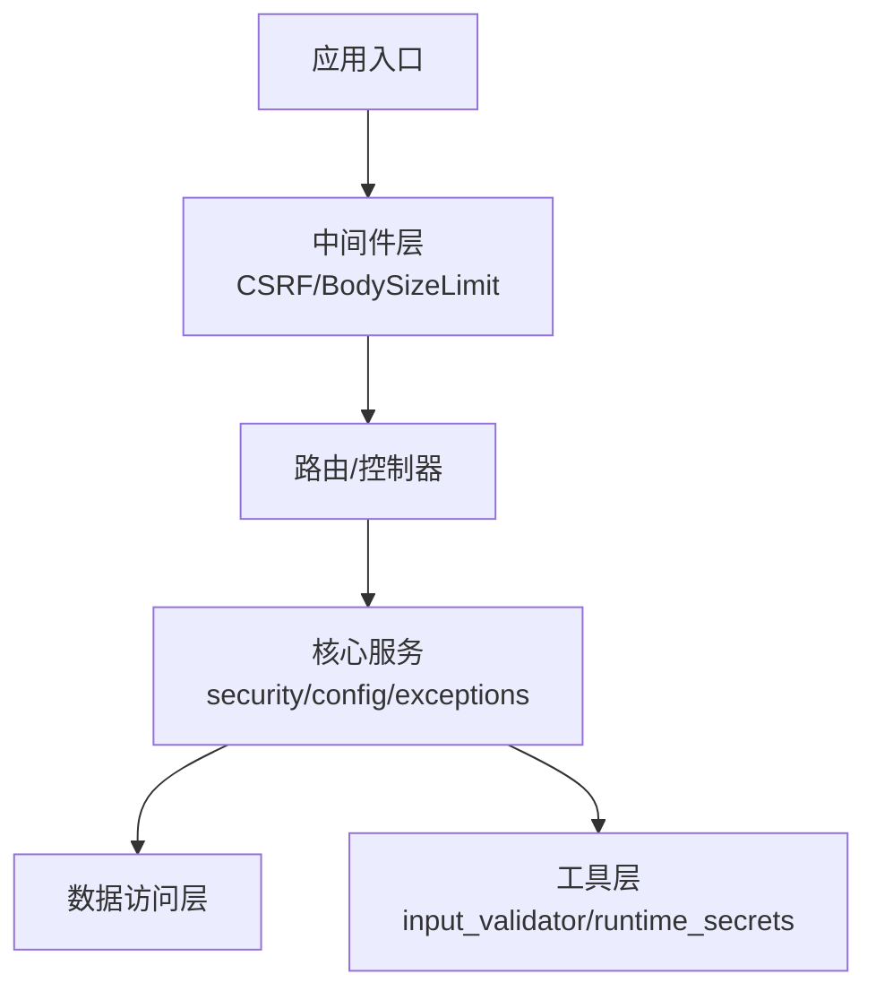
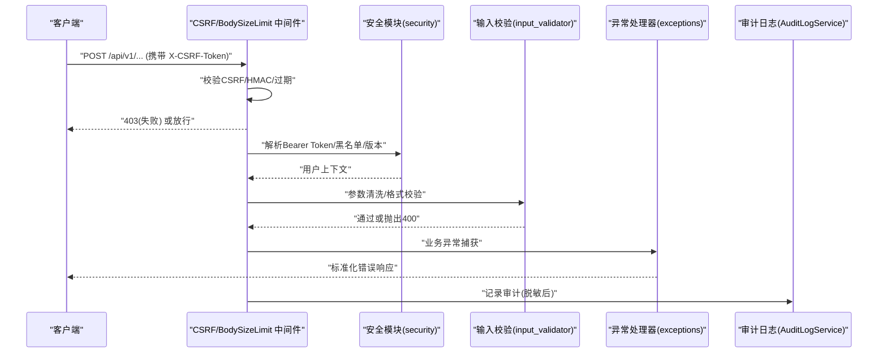
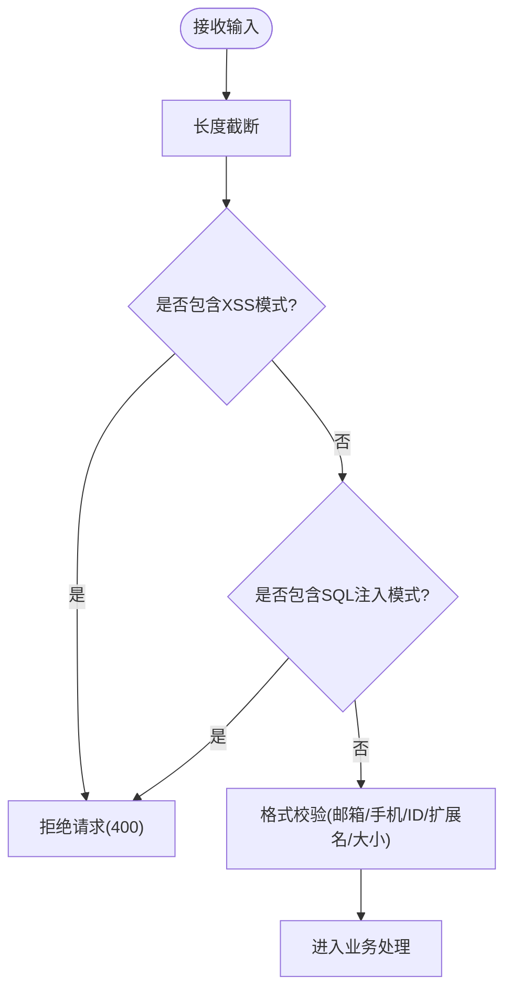
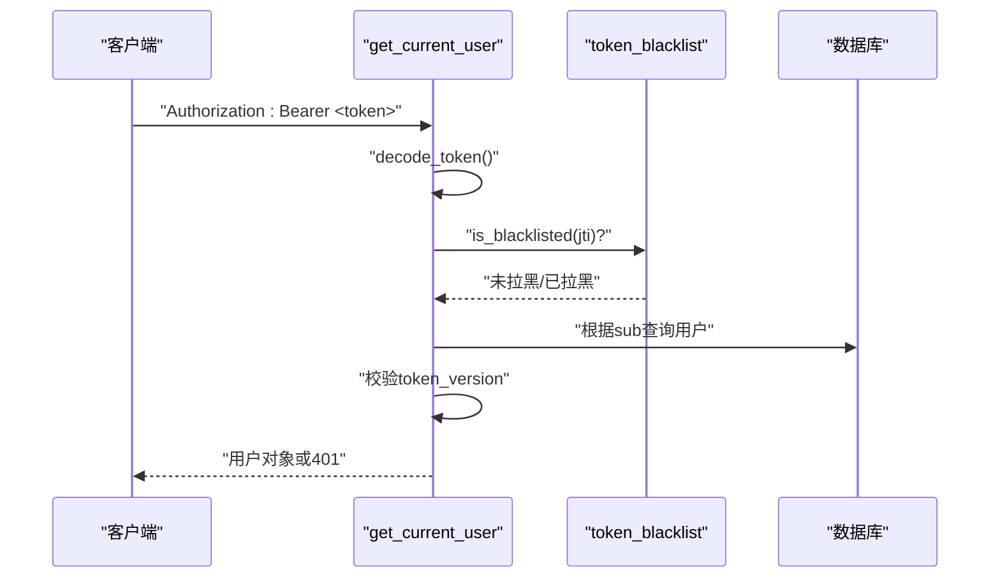
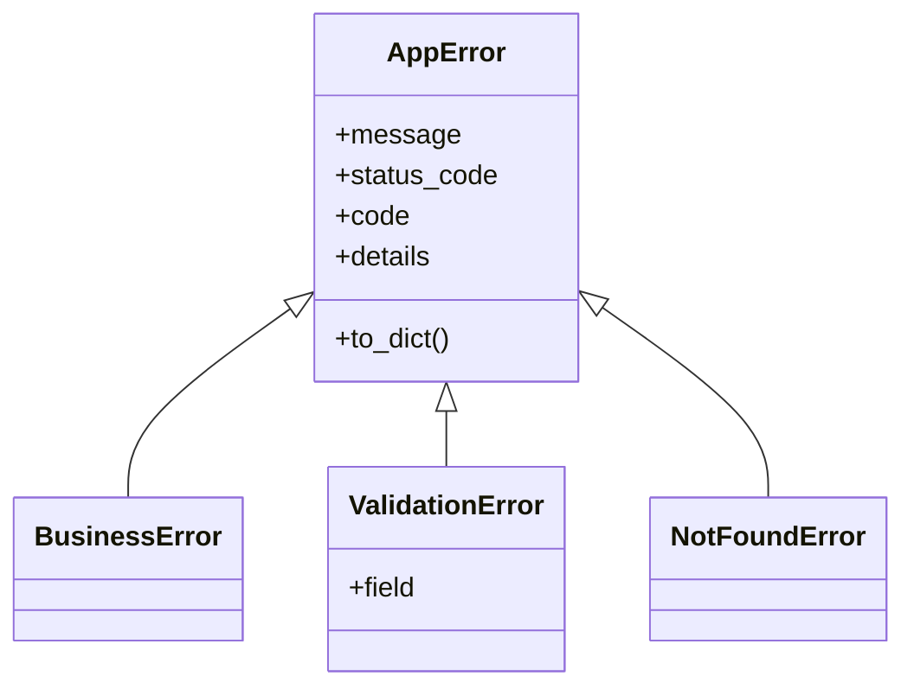
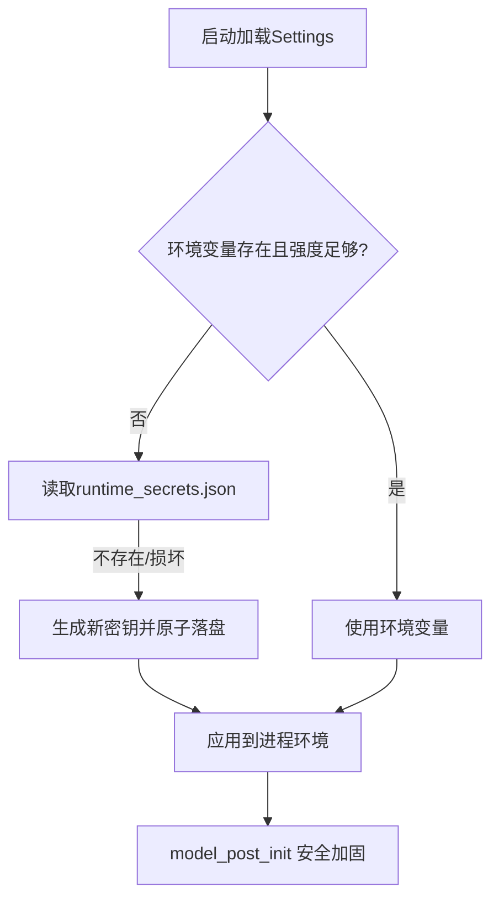
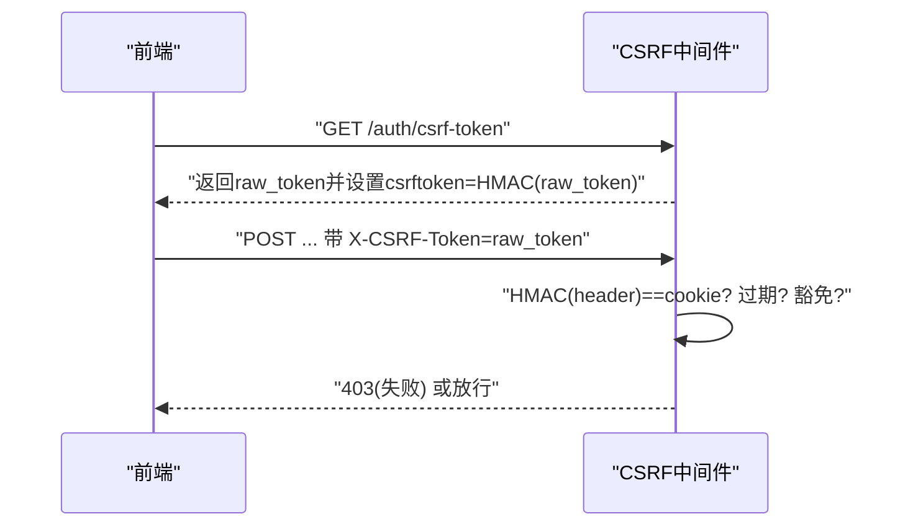
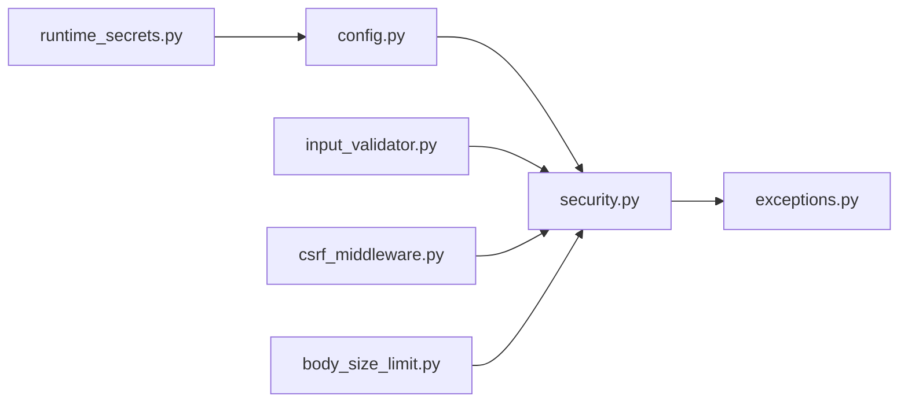

# 安全编码规范

<cite>
**本文引用的文件**
- [backend/app/core/security.py](file://backend/app/core/security.py)
- [backend/app/core/config.py](file://backend/app/core/config.py)
- [backend/app/core/exceptions.py](file://backend/app/core/exceptions.py)
- [backend/app/utils/input_validator.py](file://backend/app/utils/input_validator.py)
- [backend/app/middleware/csrf_middleware.py](file://backend/app/middleware/csrf_middleware.py)
- [backend/app/middleware/body_size_limit.py](file://backend/app/middleware/body_size_limit.py)
- [backend/app/utils/runtime_secrets.py](file://backend/app/utils/runtime_secrets.py)
</cite>

## 目录
1. [简介](#简介)
2. [项目结构](#项目结构)
3. [核心组件](#核心组件)
4. [架构总览](#架构总览)
5. [详细组件分析](#详细组件分析)
6. [依赖关系分析](#依赖关系分析)
7. [性能与安全权衡](#性能与安全权衡)
8. [故障排查指南](#故障排查指南)
9. [结论](#结论)
10. [附录：前后端统一安全编码清单](#附录：前后端统一安全编码清单)

## 简介
本规范面向后端与前端开发者，围绕输入验证、输出编码、错误处理、配置与密钥管理、CORS/CSRF等关键安全面，提供可落地的最佳实践、反模式识别与修复建议。文档基于仓库中现有实现进行提炼，确保与代码一致并可执行。

## 项目结构
本项目在后端采用分层组织：核心安全能力集中在 core 层（认证、令牌、密码策略、安全头），中间件层提供 CSRF、请求体大小限制等横切防护，utils 层提供输入校验、运行时密钥管理等通用能力；配置集中由 Settings 管理环境变量与默认值。

**图表来源**
- [backend/app/middleware/csrf_middleware.py:177-284](file://backend/app/middleware/csrf_middleware.py#L177-L284)
- [backend/app/middleware/body_size_limit.py:48-79](file://backend/app/middleware/body_size_limit.py#L48-L79)
- [backend/app/core/security.py:243-336](file://backend/app/core/security.py#L243-L336)
- [backend/app/core/config.py:54-160](file://backend/app/core/config.py#L54-L160)
- [backend/app/utils/input_validator.py:12-71](file://backend/app/utils/input_validator.py#L12-L71)
- [backend/app/utils/runtime_secrets.py:20-93](file://backend/app/utils/runtime_secrets.py#L20-L93)

**章节来源**
- [backend/app/core/config.py:54-160](file://backend/app/core/config.py#L54-L160)
- [backend/app/middleware/csrf_middleware.py:177-284](file://backend/app/middleware/csrf_middleware.py#L177-L284)
- [backend/app/middleware/body_size_limit.py:48-79](file://backend/app/middleware/body_size_limit.py#L48-L79)

## 核心组件
- 认证与令牌：JWT 签发/校验、黑名单与版本控制、角色权限检查、速率限制、客户端 IP 获取。
- 输入与输出安全：XSS/SQL注入检测、字符串清理、长度限制、格式校验。
- 错误处理：统一异常体系、全局异常处理器、敏感信息脱敏。
- 配置与密钥：环境变量加载、运行时密钥生成与持久化、加密密钥兜底、生产环境强制安全降级。
- 中间件：CSRF（HMAC 签名+过期）、请求体大小限制、安全响应头。

**章节来源**
- [backend/app/core/security.py:120-336](file://backend/app/core/security.py#L120-L336)
- [backend/app/utils/input_validator.py:12-71](file://backend/app/utils/input_validator.py#L12-L71)
- [backend/app/core/exceptions.py:11-145](file://backend/app/core/exceptions.py#L11-L145)
- [backend/app/core/config.py:54-160](file://backend/app/core/config.py#L54-L160)
- [backend/app/utils/runtime_secrets.py:20-93](file://backend/app/utils/runtime_secrets.py#L20-L93)
- [backend/app/middleware/csrf_middleware.py:65-124](file://backend/app/middleware/csrf_middleware.py#L65-L124)
- [backend/app/middleware/body_size_limit.py:48-79](file://backend/app/middleware/body_size_limit.py#L48-L79)

## 架构总览
下图展示一次受保护 API 请求的安全路径：从中间件到认证、输入校验、业务处理、错误处理与审计日志。

**图表来源**
- [backend/app/middleware/csrf_middleware.py:177-284](file://backend/app/middleware/csrf_middleware.py#L177-L284)
- [backend/app/core/security.py:243-336](file://backend/app/core/security.py#L243-L336)
- [backend/app/utils/input_validator.py:31-71](file://backend/app/utils/input_validator.py#L31-L71)
- [backend/app/core/exceptions.py:123-145](file://backend/app/core/exceptions.py#L123-L145)
- [backend/app/core/security.py:644-687](file://backend/app/core/security.py#L644-L687)

## 详细组件分析

### 输入验证与输出编码
- XSS 防护：对输入进行危险模式匹配并拒绝，必要时转义输出。
- SQL 注入防护：在入口处检测高危模式，结合参数化查询（ORM）避免拼接。
- 长度与格式：统一最大长度限制，邮箱/手机/身份证/文件类型/大小校验。
- 输出编码：服务端渲染场景需对特殊字符进行转义；API 返回 JSON 时避免直接拼接 HTML。

**图表来源**
- [backend/app/utils/input_validator.py:31-71](file://backend/app/utils/input_validator.py#L31-L71)
- [backend/app/utils/input_validator.py:74-124](file://backend/app/utils/input_validator.py#L74-L124)

**章节来源**
- [backend/app/utils/input_validator.py:12-124](file://backend/app/utils/input_validator.py#L12-L124)

### 认证与会话安全
- JWT 签发/解码：使用 HS256 算法，设置 access/refresh 过期时间，type 字段区分用途。
- 令牌吊销与版本：支持黑名单与 token_version 强制下线，fail-closed 策略。
- 角色与权限：内置管理员检查依赖，未激活账户拒绝访问。
- 速率限制：内存滑动窗口限流，防暴力破解与滥用。
- 客户端 IP：默认不信任代理头，仅在可信反向代理下启用。

**图表来源**
- [backend/app/core/security.py:210-235](file://backend/app/core/security.py#L210-L235)
- [backend/app/core/security.py:243-336](file://backend/app/core/security.py#L243-L336)

**章节来源**
- [backend/app/core/security.py:120-336](file://backend/app/core/security.py#L120-L336)

### 错误处理与安全日志
- 统一异常：AppError/BusinessError/ValidationError/NotFoundError 等，提供标准响应体。
- 全局异常处理器：将未知异常转为 500，避免堆栈泄露。
- 敏感信息脱敏：日志写入前对敏感键/值进行替换，防止凭据泄露。
- 审计日志：记录操作人、资源、IP、元数据，写入失败不影响主流程。

**图表来源**
- [backend/app/core/exceptions.py:11-145](file://backend/app/core/exceptions.py#L11-L145)

**章节来源**
- [backend/app/core/exceptions.py:11-145](file://backend/app/core/exceptions.py#L11-L145)
- [backend/app/core/security.py:180-203](file://backend/app/core/security.py#L180-L203)
- [backend/app/core/security.py:644-687](file://backend/app/core/security.py#L644-L687)

### 配置与密钥管理
- 环境变量优先：SECRET_KEY、CSRF_SECRET_KEY、数据库连接、CORS、CSRF、速率限制等均可通过环境变量覆盖。
- 运行时密钥：若缺失则自动生成并原子落盘，保证跨重启稳定；弱密钥会被忽略并重新生成。
- 生产安全基线：强制关闭 DB_ECHO，自动填充 ENCRYPTION_KEY，严格 CORS/CSRF 默认策略。
- 路径安全：动态计算数据/缓存/上传/导出/日志目录，避免相对路径导致写权限问题。

**图表来源**
- [backend/app/utils/runtime_secrets.py:20-93](file://backend/app/utils/runtime_secrets.py#L20-L93)
- [backend/app/core/config.py:296-364](file://backend/app/core/config.py#L296-L364)

**章节来源**
- [backend/app/core/config.py:54-160](file://backend/app/core/config.py#L54-L160)
- [backend/app/core/config.py:296-364](file://backend/app/core/config.py#L296-L364)
- [backend/app/utils/runtime_secrets.py:20-93](file://backend/app/utils/runtime_secrets.py#L20-L93)

### CSRF 与 CORS
- CSRF：HMAC 签名增强，Cookie 存签名，Header 存原始 token；支持过期检测与旧版明文兼容；豁免列表明确；可信代理透传真实 IP。
- CORS：默认仅允许本机与开发端口；方法/头白名单；凭证允许；生产建议收紧源。

**图表来源**
- [backend/app/middleware/csrf_middleware.py:65-124](file://backend/app/middleware/csrf_middleware.py#L65-L124)
- [backend/app/middleware/csrf_middleware.py:177-284](file://backend/app/middleware/csrf_middleware.py#L177-L284)

**章节来源**
- [backend/app/middleware/csrf_middleware.py:177-284](file://backend/app/middleware/csrf_middleware.py#L177-L284)
- [backend/app/core/config.py:136-155](file://backend/app/core/config.py#L136-L155)

### 请求体大小限制与上传安全
- 非 multipart 请求默认限制 10MB，防止超大 JSON 攻击。
- 特定路径（导入/导出/批量/备份）放宽限制以支持大负载。
- 文件上传由端点级 MAX_FILE_SIZE 与 ALLOWED_FILE_TYPES 控制。

**章节来源**
- [backend/app/middleware/body_size_limit.py:48-79](file://backend/app/middleware/body_size_limit.py#L48-L79)
- [backend/app/core/config.py:170-176](file://backend/app/core/config.py#L170-L176)

## 依赖关系分析
- security 依赖 config（读取 SECRET_KEY、ALGORITHM、CORS、CSRF、速率限制等）。
- exceptions 提供统一异常与处理器，被各层捕获并转换为标准响应。
- input_validator 为各接口提供前置校验，减少非法输入进入业务层。
- csrf_middleware 与 body_size_limit 作为横切中间件，先于路由执行。
- runtime_secrets 保障密钥可用，被 config 与 security 间接使用。

**图表来源**
- [backend/app/core/config.py:54-160](file://backend/app/core/config.py#L54-L160)
- [backend/app/core/security.py:210-336](file://backend/app/core/security.py#L210-L336)
- [backend/app/core/exceptions.py:123-145](file://backend/app/core/exceptions.py#L123-L145)
- [backend/app/utils/input_validator.py:31-71](file://backend/app/utils/input_validator.py#L31-L71)
- [backend/app/middleware/csrf_middleware.py:177-284](file://backend/app/middleware/csrf_middleware.py#L177-L284)
- [backend/app/middleware/body_size_limit.py:48-79](file://backend/app/middleware/body_size_limit.py#L48-L79)
- [backend/app/utils/runtime_secrets.py:20-93](file://backend/app/utils/runtime_secrets.py#L20-L93)

**章节来源**
- [backend/app/core/config.py:54-160](file://backend/app/core/config.py#L54-L160)
- [backend/app/core/security.py:210-336](file://backend/app/core/security.py#L210-L336)
- [backend/app/core/exceptions.py:123-145](file://backend/app/core/exceptions.py#L123-L145)
- [backend/app/utils/input_validator.py:31-71](file://backend/app/utils/input_validator.py#L31-L71)
- [backend/app/middleware/csrf_middleware.py:177-284](file://backend/app/middleware/csrf_middleware.py#L177-L284)
- [backend/app/middleware/body_size_limit.py:48-79](file://backend/app/middleware/body_size_limit.py#L48-L79)
- [backend/app/utils/runtime_secrets.py:20-93](file://backend/app/utils/runtime_secrets.py#L20-L93)

## 性能与安全权衡
- 速率限制：内存滑动窗口在高并发下需注意清理周期与锁竞争；当前实现定期清理过期键，降低内存占用。
- CSRF HMAC：常量时间比较避免时序攻击，开销可控。
- 输入校验：正则匹配在短文本上开销低；长文本应先截断再校验。
- 日志脱敏：深拷贝与模式匹配有额外 CPU/内存成本，建议在审计日志入口集中处理。

[本节为通用指导，不直接分析具体文件]

## 故障排查指南
- 登录失败/令牌无效：检查 JWT 解码、黑名单、token_version 是否匹配；确认 ACCESS_TOKEN_EXPIRE_MINUTES/REFRESH_TOKEN_EXPIRE_DAYS。
- CSRF 失败：确认前端已调用获取 token 接口并在状态变更请求携带 X-CSRF-Token；检查 cookie 与 header 的 HMAC 一致性；查看豁免路径与过期时间。
- 请求体过大：确认是否为 multipart 或位于大型负载路径；调整 BodySizeLimit 阈值或路径白名单。
- 日志泄露风险：确认 sanitize_log_data 已应用于审计日志；生产环境 DB_ECHO 必须关闭。
- 密钥问题：检查 runtime_secrets.json 是否存在且可读；环境变量长度是否满足最小强度要求。

**章节来源**
- [backend/app/core/security.py:210-336](file://backend/app/core/security.py#L210-L336)
- [backend/app/middleware/csrf_middleware.py:177-284](file://backend/app/middleware/csrf_middleware.py#L177-L284)
- [backend/app/middleware/body_size_limit.py:48-79](file://backend/app/middleware/body_size_limit.py#L48-L79)
- [backend/app/core/config.py:296-364](file://backend/app/core/config.py#L296-L364)
- [backend/app/utils/runtime_secrets.py:20-93](file://backend/app/utils/runtime_secrets.py#L20-L93)

## 结论
本规范基于仓库现有实现，明确了输入验证、输出编码、错误处理、配置与密钥管理、CSRF/CORS 等关键安全面的落地方式。遵循上述实践可有效降低 SQL 注入、XSS、会话劫持、越权、信息泄露等常见安全风险。建议在新增功能时同步引入对应安全检查点，并通过自动化测试覆盖关键路径。

[本节为总结性内容，不直接分析具体文件]

## 附录：前后端统一安全编码清单
- 输入验证
  - 所有用户输入必须经过白名单校验与长度限制；禁止直接拼接 SQL。
  - 对富文本输出进行转义或使用安全的富文本库。
- 认证与会话
  - 使用 HTTPS；Token 设置合理过期；登出/改密时强制失效（黑名单/版本号）。
  - 敏感操作二次确认与验证码。
- 错误处理
  - 对外只返回必要错误信息；内部记录完整上下文但不含敏感数据。
  - 统一错误码与消息，便于前端提示与监控。
- 配置与密钥
  - 密钥一律通过环境变量或运行时密钥文件管理；禁止硬编码。
  - 生产环境关闭调试开关、关闭 SQL 回显、收紧 CORS。
- CSRF/CORS
  - 状态变更请求必须携带有效 CSRF token；CORS 仅允许受信源。
- 上传与下载
  - 限制文件大小与类型；服务端校验 MIME；存储路径隔离与随机命名。
- 日志与审计
  - 脱敏后再记录；保留操作者、时间、IP、资源标识；定期归档与清理。

[本节为通用清单，不直接分析具体文件]