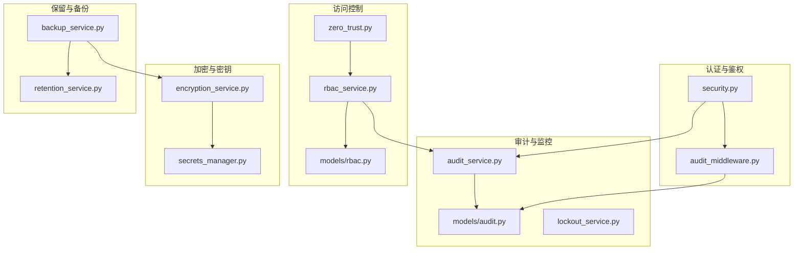
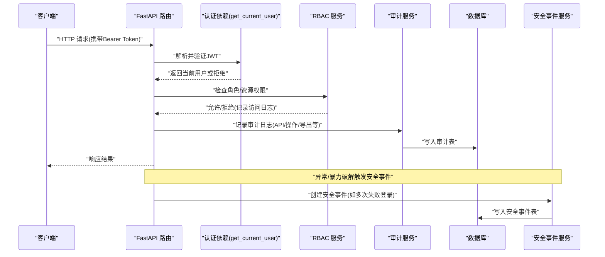
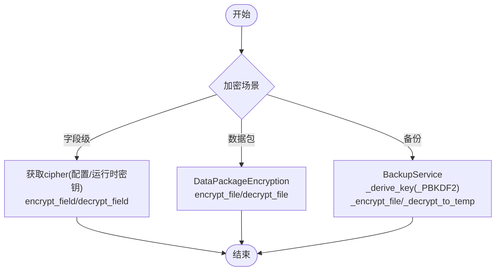
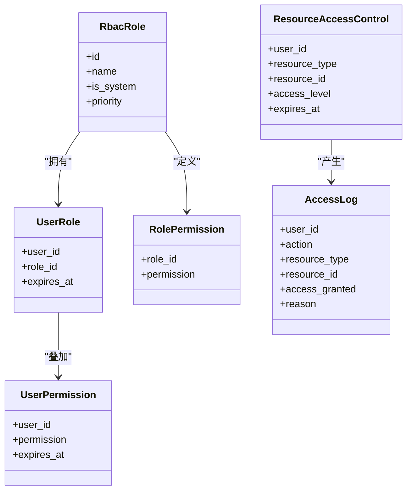
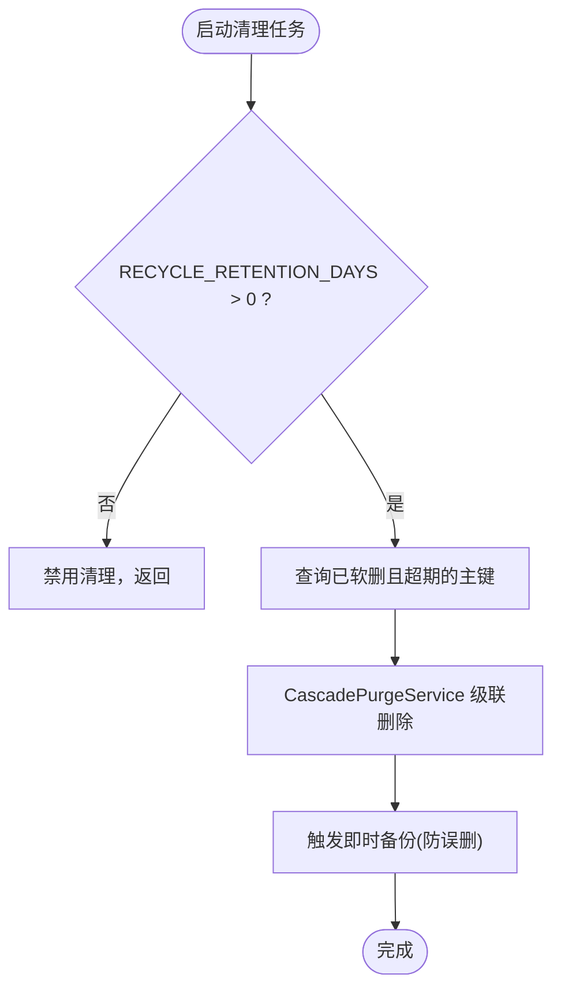
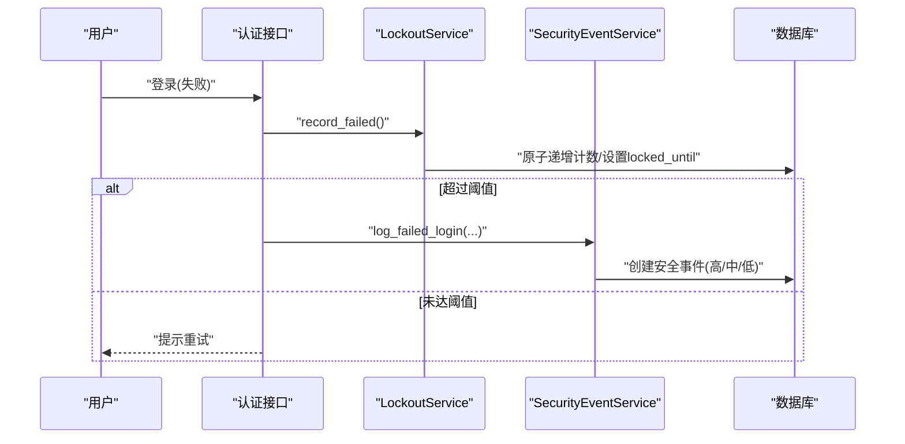
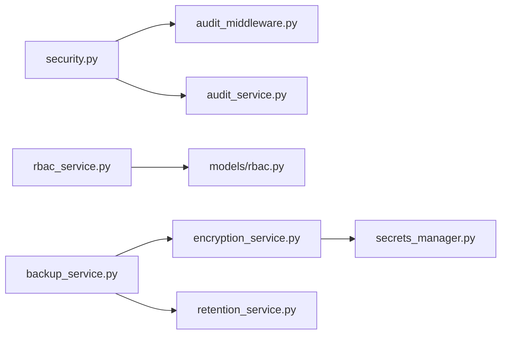

# 审计安全管理

<cite>
**本文引用的文件**
- [backend/app/core/security.py](file://backend/app/core/security.py)
- [backend/app/services/audit_service.py](file://backend/app/services/audit_service.py)
- [backend/app/models/audit.py](file://backend/app/models/audit.py)
- [backend/app/core/audit_middleware.py](file://backend/app/core/audit_middleware.py)
- [backend/app/services/secrets_manager.py](file://backend/app/services/secrets_manager.py)
- [backend/app/services/encryption_service.py](file://backend/app/services/encryption_service.py)
- [backend/app/services/retention_service.py](file://backend/app/services/retention_service.py)
- [backend/app/services/backup_service.py](file://backend/app/services/backup_service.py)
- [backend/app/services/rbac_service.py](file://backend/app/services/rbac_service.py)
- [backend/app/models/rbac.py](file://backend/app/models/rbac.py)
- [backend/app/api/v1/system/zero_trust.py](file://backend/app/api/v1/system/zero_trust.py)
- [backend/app/services/lockout_service.py](file://backend/app/services/lockout_service.py)
</cite>

## 目录
1. [简介](#简介)
2. [项目结构](#项目结构)
3. [核心组件](#核心组件)
4. [架构总览](#架构总览)
5. [详细组件分析](#详细组件分析)
6. [依赖关系分析](#依赖关系分析)
7. [性能与安全考量](#性能与安全考量)
8. [故障排查指南](#故障排查指南)
9. [结论](#结论)
10. [附录](#附录)

## 简介
本文件面向“审计安全管理”能力，覆盖日志加密（传输与存储）、密钥管理、访问控制策略（RBAC、细粒度授权、临时权限与撤销）、日志保留与归档备份恢复、安全监控（异常检测、暴力破解防护、会话管理与事件响应），并给出最佳实践与合规建议。内容基于后端代码实现进行说明，便于运维与开发对齐落地。

## 项目结构
围绕审计安全的关键模块分布如下：
- 认证与鉴权：JWT、密码策略、速率限制、安全头中间件
- 审计记录：请求级审计中间件、审计服务、审计模型
- 访问控制：RBAC 模型与服务、资源级访问控制、机器码权限
- 加密与密钥：数据字段加密、数据包加密、密钥管理服务
- 保留与备份：回收站清理、备份与恢复（含加密）
- 安全监控：安全事件服务、登录失败计数与锁定、零信任策略配置

图表来源
- [backend/app/core/security.py:210-336](file://backend/app/core/security.py#L210-L336)
- [backend/app/core/audit_middleware.py:11-109](file://backend/app/core/audit_middleware.py#L11-L109)
- [backend/app/services/audit_service.py:58-106](file://backend/app/services/audit_service.py#L58-L106)
- [backend/app/models/audit.py:53-125](file://backend/app/models/audit.py#L53-L125)
- [backend/app/services/rbac_service.py:716-745](file://backend/app/services/rbac_service.py#L716-L745)
- [backend/app/models/rbac.py:163-218](file://backend/app/models/rbac.py#L163-L218)
- [backend/app/services/encryption_service.py:12-175](file://backend/app/services/encryption_service.py#L12-L175)
- [backend/app/services/secrets_manager.py:13-193](file://backend/app/services/secrets_manager.py#L13-L193)
- [backend/app/services/retention_service.py:25-84](file://backend/app/services/retention_service.py#L25-L84)
- [backend/app/services/backup_service.py:141-213](file://backend/app/services/backup_service.py#L141-L213)

章节来源
- [backend/app/core/security.py:210-336](file://backend/app/core/security.py#L210-L336)
- [backend/app/core/audit_middleware.py:11-109](file://backend/app/core/audit_middleware.py#L11-L109)
- [backend/app/services/audit_service.py:58-106](file://backend/app/services/audit_service.py#L58-L106)
- [backend/app/models/audit.py:53-125](file://backend/app/models/audit.py#L53-L125)
- [backend/app/services/rbac_service.py:716-745](file://backend/app/services/rbac_service.py#L716-L745)
- [backend/app/models/rbac.py:163-218](file://backend/app/models/rbac.py#L163-L218)
- [backend/app/services/encryption_service.py:12-175](file://backend/app/services/encryption_service.py#L12-L175)
- [backend/app/services/secrets_manager.py:13-193](file://backend/app/services/secrets_manager.py#L13-L193)
- [backend/app/services/retention_service.py:25-84](file://backend/app/services/retention_service.py#L25-L84)
- [backend/app/services/backup_service.py:141-213](file://backend/app/services/backup_service.py#L141-L213)

## 核心组件
- 认证与令牌：JWT 签发/校验、黑名单校验、版本化令牌、密码哈希与策略、速率限制、安全响应头
- 审计记录：API 访问日志、操作审计日志、导出日志、登录尝试记录、安全事件
- 访问控制：角色-权限、用户直接权限、资源级访问控制、机器码功能权限
- 加密与密钥：字段级加密、数据包加密、密钥轮换与过期清理、持久化密钥存储
- 保留与备份：软删超期自动物理清除、备份压缩与可选 AES/Fernet 加密、恢复一致性保障
- 安全监控：暴力破解防护、账户锁定、会话超时策略、敏感操作审计、事件解决流程

章节来源
- [backend/app/core/security.py:120-173](file://backend/app/core/security.py#L120-L173)
- [backend/app/core/security.py:210-336](file://backend/app/core/security.py#L210-L336)
- [backend/app/core/security.py:414-510](file://backend/app/core/security.py#L414-L510)
- [backend/app/core/audit_middleware.py:11-109](file://backend/app/core/audit_middleware.py#L11-L109)
- [backend/app/services/audit_service.py:58-106](file://backend/app/services/audit_service.py#L58-L106)
- [backend/app/models/audit.py:19-51](file://backend/app/models/audit.py#L19-L51)
- [backend/app/models/rbac.py:31-218](file://backend/app/models/rbac.py#L31-L218)
- [backend/app/services/encryption_service.py:12-175](file://backend/app/services/encryption_service.py#L12-L175)
- [backend/app/services/secrets_manager.py:13-193](file://backend/app/services/secrets_manager.py#L13-L193)
- [backend/app/services/retention_service.py:25-84](file://backend/app/services/retention_service.py#L25-L84)
- [backend/app/services/backup_service.py:141-213](file://backend/app/services/backup_service.py#L141-L213)
- [backend/app/services/lockout_service.py:25-159](file://backend/app/services/lockout_service.py#L25-L159)

## 架构总览
下图展示从请求进入、认证鉴权、审计记录到安全事件处理的整体链路。

图表来源
- [backend/app/core/security.py:243-336](file://backend/app/core/security.py#L243-L336)
- [backend/app/services/rbac_service.py:716-745](file://backend/app/services/rbac_service.py#L716-L745)
- [backend/app/core/audit_middleware.py:11-109](file://backend/app/core/audit_middleware.py#L11-L109)
- [backend/app/services/audit_service.py:58-106](file://backend/app/services/audit_service.py#L58-L106)
- [backend/app/services/audit_service.py:379-453](file://backend/app/services/audit_service.py#L379-L453)

## 详细组件分析

### 日志加密机制（传输层与存储层）
- 传输层加密
  - 通过安全响应头强制启用 HSTS，并在中间件中注入安全头，降低中间人攻击风险。
  - 生产部署应配合 HTTPS/TLS 终止于反向代理或网关。
- 存储层加密
  - 字段级加密：使用 Fernet（对称加密）对敏感字段进行加解密，密钥优先从配置读取，否则从运行时密钥存储加载或生成并持久化。
  - 数据包加密：支持对打包文件进行加密/解密，采用 Fernet 格式，便于离线交换与归档。
  - 备份加密：备份包可选择 AES-256（Fernet）加密，使用 PBKDF2 派生密钥，带盐值与标记头，恢复时先解密再解压。
- 密钥管理
  - SecretsManager 提供密钥的创建、轮换、撤销与过期清理；默认密钥持久化在本地路径，避免重启丢失。
  - 加密服务缓存 cipher 实例，减少重复初始化开销。
- 算法选择
  - 对称加密：Fernet（基于 AES-128-CBC + HMAC-SHA256）。
  - 密钥派生：PBKDF2-HMAC-SHA256，固定迭代次数与随机盐。
  - 密码哈希：bcrypt（经 passlib 封装），并对长密码做截断兼容。

图表来源
- [backend/app/services/encryption_service.py:181-261](file://backend/app/services/encryption_service.py#L181-L261)
- [backend/app/services/encryption_service.py:12-175](file://backend/app/services/encryption_service.py#L12-L175)
- [backend/app/services/backup_service.py:141-213](file://backend/app/services/backup_service.py#L141-L213)
- [backend/app/services/secrets_manager.py:25-50](file://backend/app/services/secrets_manager.py#L25-L50)

章节来源
- [backend/app/core/security.py:598-702](file://backend/app/core/security.py#L598-L702)
- [backend/app/services/encryption_service.py:181-261](file://backend/app/services/encryption_service.py#L181-L261)
- [backend/app/services/encryption_service.py:12-175](file://backend/app/services/encryption_service.py#L12-L175)
- [backend/app/services/backup_service.py:141-213](file://backend/app/services/backup_service.py#L141-L213)
- [backend/app/services/secrets_manager.py:25-50](file://backend/app/services/secrets_manager.py#L25-L50)

### 访问控制策略（RBAC、细粒度授权、临时权限与撤销）
- 基于角色的权限控制
  - 角色、用户-角色关联、角色-权限关联、用户直接权限、资源访问控制、机器码权限等多维模型。
  - RBAC 服务在访问决策后记录访问日志（包含是否授权与原因）。
- 细粒度操作授权
  - 资源类型+资源ID+访问级别（read/write/delete）实现对象级授权。
  - 结合数据范围适配器与统一数据范围策略，实现组织/下级数据隔离。
- 临时权限授予
  - 用户-角色与资源访问均支持 expires_at 字段，用于临时授权与到期自动失效。
- 权限撤销机制
  - 可通过停用/撤销密钥版本、吊销令牌（黑名单）、更新 token_version 强制下线等方式实现即时撤销。
  - RBAC 中可调整角色优先级与状态，影响最终授权判定。

图表来源
- [backend/app/models/rbac.py:31-218](file://backend/app/models/rbac.py#L31-L218)
- [backend/app/services/rbac_service.py:716-745](file://backend/app/services/rbac_service.py#L716-L745)

章节来源
- [backend/app/models/rbac.py:31-218](file://backend/app/models/rbac.py#L31-L218)
- [backend/app/services/rbac_service.py:716-745](file://backend/app/services/rbac_service.py#L716-L745)
- [backend/app/core/security.py:243-336](file://backend/app/core/security.py#L243-L336)

### 日志保留策略（自动清理、归档、备份恢复、销毁）
- 自动清理规则
  - 回收站保留期策略：按 RECYCLE_RETENTION_DAYS 阈值，定期物理清除超期的软删除记录，并触发即时备份作为兜底。
- 归档策略
  - 备份服务支持全量/增量（清单驱动）、压缩、完整性校验（必须包含数据库文件）、可选加密。
  - 备份记录以 SystemConfig 键形式保存，支持按数量或天数清理旧备份。
- 备份恢复
  - 恢复前创建数据库与上传目录快照；恢复后执行 PRAGMA integrity_check 确保库健康；失败则回滚到快照。
  - 支持解密恢复：若检测到加密标记，需密码解密至临时文件后再解压。
- 数据销毁流程
  - 清理旧备份时同步删除磁盘文件与数据库记录；回收站清理通过级联服务删除子表数据。

图表来源
- [backend/app/services/retention_service.py:25-84](file://backend/app/services/retention_service.py#L25-L84)
- [backend/app/services/backup_service.py:676-736](file://backend/app/services/backup_service.py#L676-L736)
- [backend/app/services/backup_service.py:558-600](file://backend/app/services/backup_service.py#L558-L600)

章节来源
- [backend/app/services/retention_service.py:25-84](file://backend/app/services/retention_service.py#L25-L84)
- [backend/app/services/backup_service.py:319-395](file://backend/app/services/backup_service.py#L319-L395)
- [backend/app/services/backup_service.py:558-600](file://backend/app/services/backup_service.py#L558-L600)
- [backend/app/services/backup_service.py:676-736](file://backend/app/services/backup_service.py#L676-L736)

### 安全监控（异常检测、暴力破解防护、会话管理、事件响应）
- 异常访问检测
  - 审计中间件记录每次请求的方法、路径、状态码、耗时与用户身份；审计服务提供统计与查询接口。
- 暴力破解防护
  - 登录失败计数与账户锁定：达到阈值自动锁定一段时间；支持批量解锁过期账户与管理员强制解锁。
  - 安全事件服务根据失败次数动态提升严重级别（低/中/高），并生成安全事件。
- 会话管理
  - JWT 令牌类型校验、黑名单校验、token_version 版本化强制下线；中间件设置安全头；支持空闲/绝对超时策略（零信任配置）。
- 安全事件响应
  - 提供事件查询、统计与“解决”接口，记录解决人与备注，形成闭环。

图表来源
- [backend/app/services/lockout_service.py:105-159](file://backend/app/services/lockout_service.py#L105-L159)
- [backend/app/services/audit_service.py:411-453](file://backend/app/services/audit_service.py#L411-L453)
- [backend/app/core/security.py:243-336](file://backend/app/core/security.py#L243-L336)
- [backend/app/api/v1/system/zero_trust.py:166-215](file://backend/app/api/v1/system/zero_trust.py#L166-L215)

章节来源
- [backend/app/core/audit_middleware.py:11-109](file://backend/app/core/audit_middleware.py#L11-L109)
- [backend/app/services/audit_service.py:411-453](file://backend/app/services/audit_service.py#L411-L453)
- [backend/app/services/lockout_service.py:25-159](file://backend/app/services/lockout_service.py#L25-L159)
- [backend/app/api/v1/system/zero_trust.py:166-215](file://backend/app/api/v1/system/zero_trust.py#L166-L215)

## 依赖关系分析
- 认证依赖
  - get_current_user 依赖 JWT 解码、黑名单、用户版本校验，并将当前用户写入审计上下文。
- 审计依赖
  - AuditMiddleware 独立 session 落库，失败不阻塞业务；AuditService 统一封装各类审计写入。
- 访问控制依赖
  - RBAC 服务依赖 RBAC 模型，并在访问决策后记录访问日志。
- 加密依赖
  - 加密服务依赖配置与运行时密钥存储；备份服务依赖加密工具与 SQLite 一致性快照。
- 保留与备份依赖
  - 回收站清理依赖级联删除服务与即时备份触发器。

图表来源
- [backend/app/core/security.py:243-336](file://backend/app/core/security.py#L243-L336)
- [backend/app/core/audit_middleware.py:11-109](file://backend/app/core/audit_middleware.py#L11-L109)
- [backend/app/services/rbac_service.py:716-745](file://backend/app/services/rbac_service.py#L716-L745)
- [backend/app/models/rbac.py:31-218](file://backend/app/models/rbac.py#L31-L218)
- [backend/app/services/encryption_service.py:181-261](file://backend/app/services/encryption_service.py#L181-L261)
- [backend/app/services/secrets_manager.py:13-193](file://backend/app/services/secrets_manager.py#L13-L193)
- [backend/app/services/backup_service.py:141-213](file://backend/app/services/backup_service.py#L141-L213)
- [backend/app/services/retention_service.py:25-84](file://backend/app/services/retention_service.py#L25-L84)

章节来源
- [backend/app/core/security.py:243-336](file://backend/app/core/security.py#L243-L336)
- [backend/app/core/audit_middleware.py:11-109](file://backend/app/core/audit_middleware.py#L11-L109)
- [backend/app/services/rbac_service.py:716-745](file://backend/app/services/rbac_service.py#L716-L745)
- [backend/app/models/rbac.py:31-218](file://backend/app/models/rbac.py#L31-L218)
- [backend/app/services/encryption_service.py:181-261](file://backend/app/services/encryption_service.py#L181-L261)
- [backend/app/services/secrets_manager.py:13-193](file://backend/app/services/secrets_manager.py#L13-L193)
- [backend/app/services/backup_service.py:141-213](file://backend/app/services/backup_service.py#L141-L213)
- [backend/app/services/retention_service.py:25-84](file://backend/app/services/retention_service.py#L25-L84)

## 性能与安全考量
- 性能
  - 审计落库使用独立短会话，失败仅告警，不影响主流程。
  - 加密服务缓存 cipher 实例，减少重复初始化。
  - 备份使用 SQLite Backup API 生成一致性快照，避免 WAL 不一致导致的恢复问题。
- 安全
  - 严格输入清洗与 SQL 注入模式检测；速率限制防止滥用。
  - 安全头强制启用，HSTS、X-Frame-Options、Referrer-Policy 等。
  - 备份恢复前后进行完整性校验，失败即中止，避免损坏库被启用。
  - 账户锁定与暴力破解防护，结合安全事件分级与解决闭环。

[本节为通用指导，无需特定文件引用]

## 故障排查指南
- 认证失败
  - 检查 JWT 签名密钥与算法配置；确认令牌未被加入黑名单或版本不匹配。
- 审计日志缺失
  - 检查审计中间件是否注册；确认数据库连接与写权限；查看警告日志中关于落库失败的记录。
- 备份失败
  - 检查磁盘空间预检；确认备份包包含数据库文件；若为加密备份，核对密码与盐值。
- 恢复失败
  - 查看恢复后的完整性检查结果；必要时回滚到快照；检查上传目录解压路径安全性。
- 账户锁定
  - 检查锁定阈值与锁定时长；使用批量解锁清理过期锁定；管理员账户强制解锁保护。

章节来源
- [backend/app/core/security.py:243-336](file://backend/app/core/security.py#L243-L336)
- [backend/app/core/audit_middleware.py:80-109](file://backend/app/core/audit_middleware.py#L80-L109)
- [backend/app/services/backup_service.py:319-395](file://backend/app/services/backup_service.py#L319-L395)
- [backend/app/services/backup_service.py:558-600](file://backend/app/services/backup_service.py#L558-L600)
- [backend/app/services/lockout_service.py:171-219](file://backend/app/services/lockout_service.py#L171-L219)

## 结论
本系统围绕审计安全构建了完整的防护体系：传输与存储双重加密、完善的密钥生命周期管理、细粒度的 RBAC 与资源级授权、严格的日志保留与备份恢复机制，以及针对暴力破解与会话的安全监控与事件响应。建议在生产环境中结合 HTTPS、最小权限原则、定期密钥轮换与演练恢复流程，以满足合规与稳定性要求。

[本节为总结性内容，无需特定文件引用]

## 附录
- 关键配置项参考
  - 令牌过期：ACCESS_TOKEN_EXPIRE_MINUTES、REFRESH_TOKEN_DAYS
  - 密码策略：最小长度、复杂度、弱口令黑名单
  - 速率限制：窗口大小与最大请求数
  - 保留策略：RECYCLE_RETENTION_DAYS
  - 备份策略：压缩级别、是否包含上传、保留数量/天数
  - 零信任策略：会话超时、IP 白名单、敏感操作审计开关
- 合规建议
  - 传输加密：强制 HTTPS/HSTS
  - 存储加密：敏感字段与备份包加密
  - 访问控制：最小权限、临时授权、及时撤销
  - 审计留痕：完整记录、不可篡改、可检索
  - 事件响应：分级告警、闭环解决、定期复盘

[本节为通用指导，无需特定文件引用]