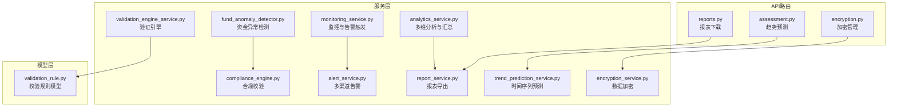
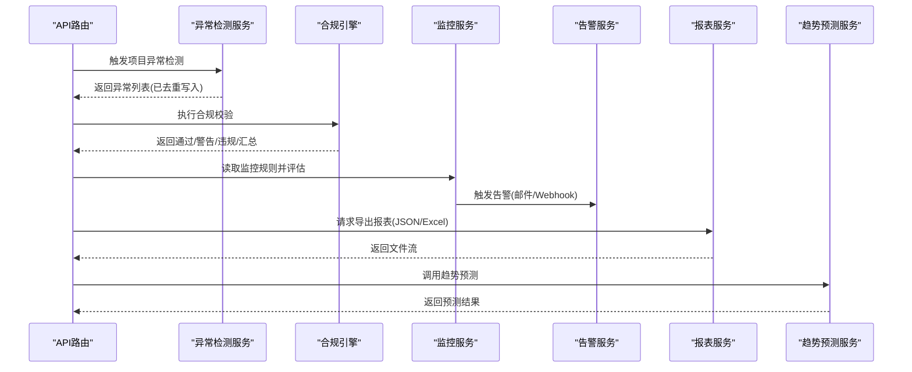
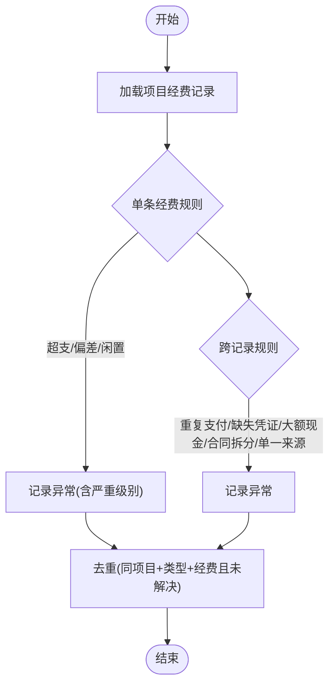
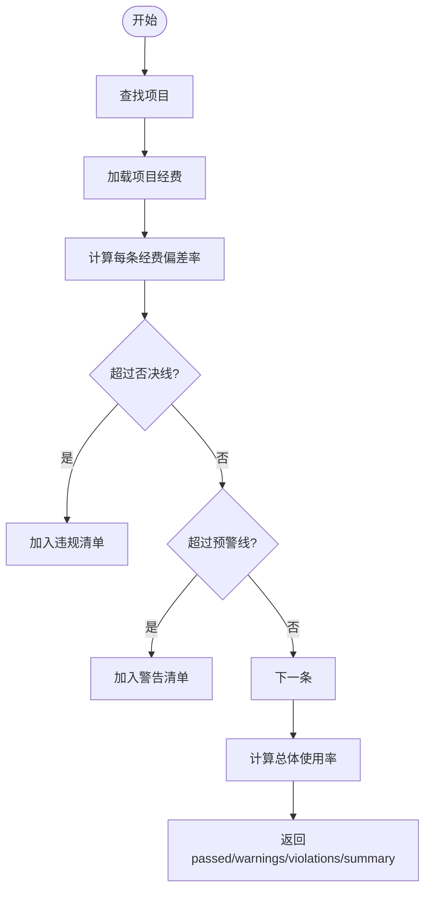
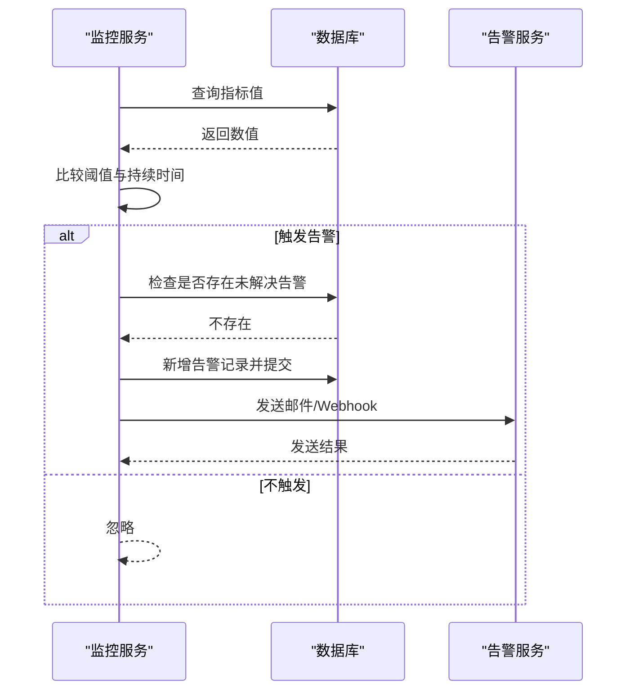
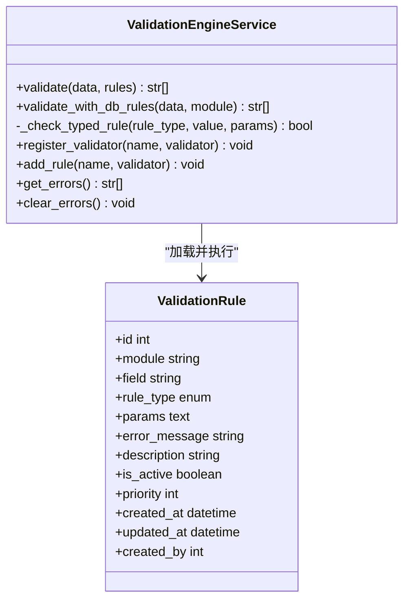
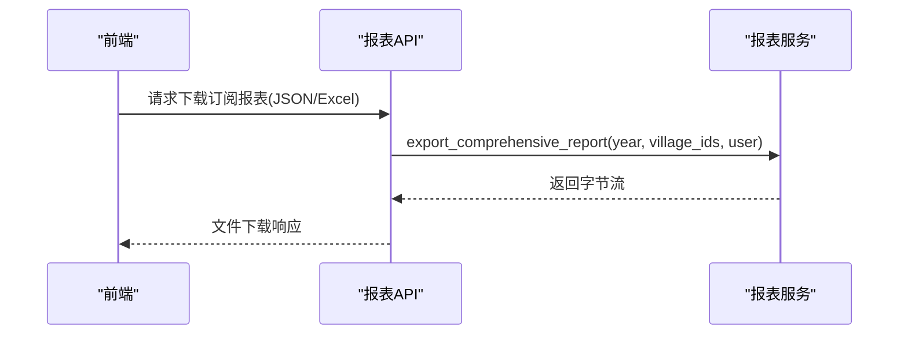
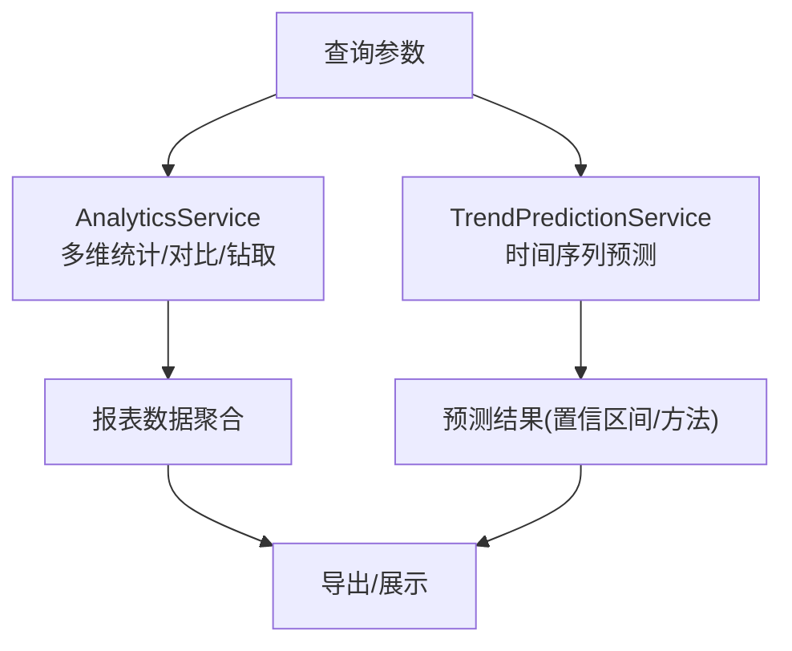
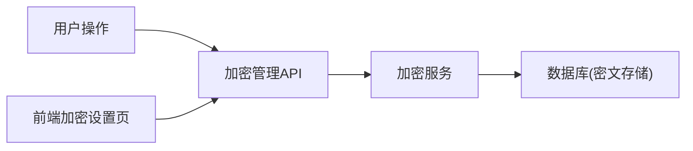
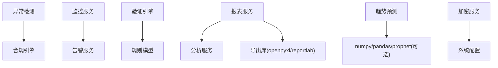

# 审计数据分析

<cite>
**本文引用的文件**
- [backend/app/services/fund_anomaly_detector.py](file://backend/app/services/fund_anomaly_detector.py)
- [backend/app/services/compliance_engine.py](file://backend/app/services/compliance_engine.py)
- [backend/app/services/monitoring_service.py](file://backend/app/services/monitoring_service.py)
- [backend/app/services/alert_service.py](file://backend/app/services/alert_service.py)
- [backend/app/services/validation_engine_service.py](file://backend/app/services/validation_engine_service.py)
- [backend/app/models/validation_rule.py](file://backend/app/models/validation_rule.py)
- [backend/app/services/analytics_service.py](file://backend/app/services/analytics_service.py)
- [backend/app/services/report_service.py](file://backend/app/services/report_service.py)
- [backend/app/api/v1/data/data/reports.py](file://backend/app/api/v1/data/data/reports.py)
- [backend/app/services/ai/trend_prediction_service.py](file://backend/app/services/ai/trend_prediction_service.py)
- [backend/app/api/v1/assessment.py](file://backend/app/api/v1/assessment.py)
- [backend/app/services/encryption_service.py](file://backend/app/services/encryption_service.py)
- [backend/app/api/v1/encryption.py](file://backend/app/api/v1/encryption.py)
- [frontend/src/views/system/EncryptionSettings.vue](file://frontend/src/views/system/EncryptionSettings.vue)
</cite>

## 目录
1. [简介](#简介)
2. [项目结构](#项目结构)
3. [核心组件](#核心组件)
4. [架构总览](#架构总览)
5. [详细组件分析](#详细组件分析)
6. [依赖关系分析](#依赖关系分析)
7. [性能考虑](#性能考虑)
8. [故障排查指南](#故障排查指南)
9. [结论](#结论)
10. [附录](#附录)

## 简介
本文件面向“审计数据分析”功能，覆盖异常检测、合规性检查、报表生成与分析查询接口四大能力，并给出数据安全与隐私合规措施。文档既提供使用视角的说明，也包含代码级实现要点与流程图示，帮助读者快速理解系统如何识别异常、评估合规、生成报表并进行趋势预测与多维分析。

## 项目结构
后端围绕服务层组织：异常检测（资金异常）、合规引擎、监控与告警、验证引擎、数据分析与报表导出、趋势预测、加密与安全等模块；前端提供规则管理与加密设置界面。数据通过API路由暴露，服务层负责业务逻辑，模型层定义持久化结构。

**图表来源**
- [backend/app/api/v1/data/data/reports.py:731-761](file://backend/app/api/v1/data/data/reports.py#L731-L761)
- [backend/app/api/v1/assessment.py:288-320](file://backend/app/api/v1/assessment.py#L288-L320)
- [backend/app/api/v1/encryption.py:1-42](file://backend/app/api/v1/encryption.py#L1-L42)
- [backend/app/services/fund_anomaly_detector.py:35-147](file://backend/app/services/fund_anomaly_detector.py#L35-L147)
- [backend/app/services/compliance_engine.py:23-109](file://backend/app/services/compliance_engine.py#L23-L109)
- [backend/app/services/monitoring_service.py:290-311](file://backend/app/services/monitoring_service.py#L290-L311)
- [backend/app/services/alert_service.py:20-111](file://backend/app/services/alert_service.py#L20-L111)
- [backend/app/services/validation_engine_service.py:26-217](file://backend/app/services/validation_engine_service.py#L26-L217)
- [backend/app/models/validation_rule.py:15-55](file://backend/app/models/validation_rule.py#L15-L55)
- [backend/app/services/analytics_service.py:22-703](file://backend/app/services/analytics_service.py#L22-L703)
- [backend/app/services/report_service.py:18-357](file://backend/app/services/report_service.py#L18-L357)
- [backend/app/services/ai/trend_prediction_service.py:30-347](file://backend/app/services/ai/trend_prediction_service.py#L30-L347)
- [backend/app/services/encryption_service.py:104-162](file://backend/app/services/encryption_service.py#L104-L162)

**章节来源**
- [backend/app/api/v1/data/data/reports.py:731-761](file://backend/app/api/v1/data/data/reports.py#L731-L761)
- [backend/app/services/report_service.py:18-357](file://backend/app/services/report_service.py#L18-L357)
- [backend/app/services/analytics_service.py:22-703](file://backend/app/services/analytics_service.py#L22-L703)

## 核心组件
- 异常检测：基于规则的经费异常识别（超支、偏差、闲置、重复支付、缺失凭证、大额现金、合同拆分、单一来源等），并写入异常记录去重存储。
- 合规检查：按预算偏差阈值（预警线/否决线）进行合规判定，输出警告与违规清单及汇总指标。
- 实时告警：监控服务按规则扫描指标，触发告警后通过邮件或Webhook通知。
- 验证引擎：支持必填、范围、正则、枚举、长度、正数/非负数等规则，可从数据库加载动态规则执行。
- 报表生成：Excel/PDF/JSON多格式导出，支持订阅式定时报表与下载。
- 分析查询：多维度统计、对比分析、钻取、筛选与汇总；趋势预测支持Prophet/移动平均/线性回归。
- 数据安全：数据包加密、数据库加密配置与管理、PII字段透明加密策略。

**章节来源**
- [backend/app/services/fund_anomaly_detector.py:35-147](file://backend/app/services/fund_anomaly_detector.py#L35-L147)
- [backend/app/services/compliance_engine.py:23-109](file://backend/app/services/compliance_engine.py#L23-L109)
- [backend/app/services/monitoring_service.py:290-311](file://backend/app/services/monitoring_service.py#L290-L311)
- [backend/app/services/alert_service.py:20-111](file://backend/app/services/alert_service.py#L20-L111)
- [backend/app/services/validation_engine_service.py:26-217](file://backend/app/services/validation_engine_service.py#L26-L217)
- [backend/app/services/report_service.py:18-357](file://backend/app/services/report_service.py#L18-L357)
- [backend/app/services/analytics_service.py:22-703](file://backend/app/services/analytics_service.py#L22-L703)
- [backend/app/services/ai/trend_prediction_service.py:30-347](file://backend/app/services/ai/trend_prediction_service.py#L30-L347)
- [backend/app/services/encryption_service.py:104-162](file://backend/app/services/encryption_service.py#L104-L162)

## 架构总览
审计数据分析由“数据采集→规则/模型处理→结果存储→可视化/导出→告警通知”构成。异常检测与合规检查在数据入库或定期任务中运行；监控服务周期性评估指标并触发告警；报表服务聚合分析数据并导出；趋势预测为决策提供前瞻信息；加密与安全贯穿数据生命周期。

**图表来源**
- [backend/app/services/fund_anomaly_detector.py:35-147](file://backend/app/services/fund_anomaly_detector.py#L35-L147)
- [backend/app/services/compliance_engine.py:23-109](file://backend/app/services/compliance_engine.py#L23-L109)
- [backend/app/services/monitoring_service.py:290-311](file://backend/app/services/monitoring_service.py#L290-L311)
- [backend/app/services/alert_service.py:20-111](file://backend/app/services/alert_service.py#L20-L111)
- [backend/app/api/v1/data/data/reports.py:731-761](file://backend/app/api/v1/data/data/reports.py#L731-L761)
- [backend/app/services/ai/trend_prediction_service.py:30-347](file://backend/app/services/ai/trend_prediction_service.py#L30-L347)

## 详细组件分析

### 异常检测（基于规则）
- 检测维度：超支、进度-支付偏差、闲置资金、重复支付、缺失凭证、大额现金、合同拆分、单一来源等。
- 执行流程：获取项目关联经费记录→逐项规则检查→跨记录规则检查→去重写入异常表。
- 严重级别：根据阈值区分警告与危险等级。

**图表来源**
- [backend/app/services/fund_anomaly_detector.py:35-147](file://backend/app/services/fund_anomaly_detector.py#L35-L147)

**章节来源**
- [backend/app/services/fund_anomaly_detector.py:35-147](file://backend/app/services/fund_anomaly_detector.py#L35-L147)

### 合规性检查（法规规则配置与自动评估）
- 规则配置：预警线与否决线阈值（如偏差率10%/15%）。
- 自动评估：计算各经费偏差率与整体使用率，输出警告与违规清单。
- 报告生成：返回是否通过、警告/违规列表与汇总指标（项目名、总预算、总使用、使用率、经费数量）。

**图表来源**
- [backend/app/services/compliance_engine.py:23-109](file://backend/app/services/compliance_engine.py#L23-L109)

**章节来源**
- [backend/app/services/compliance_engine.py:23-109](file://backend/app/services/compliance_engine.py#L23-L109)

### 实时告警机制（监控与多渠道通知）
- 监控规则：按指标类型、阈值、持续时间评估。
- 触发告警：若存在未解决的同类告警则跳过，否则创建新告警并异步发送通知。
- 通知渠道：邮件（SMTP）与Webhook（通用/钉钉/企业微信）。

**图表来源**
- [backend/app/services/monitoring_service.py:290-311](file://backend/app/services/monitoring_service.py#L290-L311)
- [backend/app/services/alert_service.py:20-111](file://backend/app/services/alert_service.py#L20-L111)

**章节来源**
- [backend/app/services/monitoring_service.py:290-311](file://backend/app/services/monitoring_service.py#L290-L311)
- [backend/app/services/alert_service.py:20-111](file://backend/app/services/alert_service.py#L20-L111)

### 验证引擎（规则配置与执行）
- 规则类型：必填、范围、正则、枚举、长度、正数、非负数等。
- 执行方式：内存规则或从数据库加载动态规则（按优先级排序）。
- 结果：返回错误列表，便于前端提示与阻断提交。

**图表来源**
- [backend/app/services/validation_engine_service.py:26-217](file://backend/app/services/validation_engine_service.py#L26-L217)
- [backend/app/models/validation_rule.py:15-55](file://backend/app/models/validation_rule.py#L15-L55)

**章节来源**
- [backend/app/services/validation_engine_service.py:26-217](file://backend/app/services/validation_engine_service.py#L26-L217)
- [backend/app/models/validation_rule.py:15-55](file://backend/app/models/validation_rule.py#L15-L55)

### 报表生成功能（模板、调度、导出、可视化）
- 自定义报表：综合报表、村庄资金报表、政策执行报表等。
- 定时订阅：用户可创建订阅（名称、类型、频率、发送时间、邮箱、输出格式等），支持启用/停用。
- 多格式导出：Excel、PDF、JSON；支持流式下载与文件名生成。
- 可视化展示：前端页面集成报表下载与预览。

**图表来源**
- [backend/app/api/v1/data/data/reports.py:731-761](file://backend/app/api/v1/data/data/reports.py#L731-L761)
- [backend/app/services/report_service.py:135-165](file://backend/app/services/report_service.py#L135-L165)

**章节来源**
- [backend/app/api/v1/data/data/reports.py:731-761](file://backend/app/api/v1/data/data/reports.py#L731-L761)
- [backend/app/services/report_service.py:18-357](file://backend/app/services/report_service.py#L18-L357)

### 分析查询接口（多维统计、趋势预测、关联挖掘）
- 多维统计：仪表盘概览、帮扶村分析、资金趋势、绩效指标、对比分析（省份/梯队）。
- 趋势预测：支持Prophet（可选）、移动平均、线性回归；提供收入/人口趋势预测。
- 关联挖掘：通过对比与钻取接口发现区域/层级间差异与热点。

**图表来源**
- [backend/app/services/analytics_service.py:22-703](file://backend/app/services/analytics_service.py#L22-L703)
- [backend/app/services/ai/trend_prediction_service.py:30-347](file://backend/app/services/ai/trend_prediction_service.py#L30-L347)
- [backend/app/api/v1/assessment.py:288-320](file://backend/app/api/v1/assessment.py#L288-L320)

**章节来源**
- [backend/app/services/analytics_service.py:22-703](file://backend/app/services/analytics_service.py#L22-L703)
- [backend/app/services/ai/trend_prediction_service.py:30-347](file://backend/app/services/ai/trend_prediction_service.py#L30-L347)
- [backend/app/api/v1/assessment.py:288-320](file://backend/app/api/v1/assessment.py#L288-L320)

### 数据安全与隐私合规
- 数据包加密：提供加密/解密工具，支持文件与数据包的加密封装与密钥管理。
- 数据库加密：提供初始化、修改密码、禁用加密等管理接口；前端提供可视化配置页面。
- PII透明加密：采用确定性加密（AES-SIV）对敏感字段进行透明读写，保障等值查询不变；迁移脚本幂等回填。

**图表来源**
- [backend/app/services/encryption_service.py:104-162](file://backend/app/services/encryption_service.py#L104-L162)
- [backend/app/api/v1/encryption.py:1-42](file://backend/app/api/v1/encryption.py#L1-L42)
- [frontend/src/views/system/EncryptionSettings.vue:1-382](file://frontend/src/views/system/EncryptionSettings.vue#L1-L382)

**章节来源**
- [backend/app/services/encryption_service.py:104-162](file://backend/app/services/encryption_service.py#L104-L162)
- [backend/app/api/v1/encryption.py:1-42](file://backend/app/api/v1/encryption.py#L1-L42)
- [frontend/src/views/system/EncryptionSettings.vue:1-382](file://frontend/src/views/system/EncryptionSettings.vue#L1-L382)

## 依赖关系分析
- 异常检测依赖经费与项目模型，结果写入异常记录；合规引擎依赖项目与经费数据；监控服务依赖规则与指标；告警服务依赖邮件与Webhook配置；验证引擎依赖规则模型；报表服务依赖分析服务与导出库；趋势预测依赖时间序列库；加密服务依赖加密算法与配置。
- 耦合点：API路由与服务层解耦良好；服务层之间通过明确接口交互；外部依赖（邮件、Webhook、Excel/PDF库）具备降级与容错。

**图表来源**
- [backend/app/services/fund_anomaly_detector.py:35-147](file://backend/app/services/fund_anomaly_detector.py#L35-L147)
- [backend/app/services/compliance_engine.py:23-109](file://backend/app/services/compliance_engine.py#L23-L109)
- [backend/app/services/monitoring_service.py:290-311](file://backend/app/services/monitoring_service.py#L290-L311)
- [backend/app/services/alert_service.py:20-111](file://backend/app/services/alert_service.py#L20-L111)
- [backend/app/services/validation_engine_service.py:26-217](file://backend/app/services/validation_engine_service.py#L26-L217)
- [backend/app/models/validation_rule.py:15-55](file://backend/app/models/validation_rule.py#L15-L55)
- [backend/app/services/report_service.py:18-357](file://backend/app/services/report_service.py#L18-L357)
- [backend/app/services/analytics_service.py:22-703](file://backend/app/services/analytics_service.py#L22-L703)
- [backend/app/services/ai/trend_prediction_service.py:30-347](file://backend/app/services/ai/trend_prediction_service.py#L30-L347)
- [backend/app/services/encryption_service.py:104-162](file://backend/app/services/encryption_service.py#L104-L162)

**章节来源**
- [backend/app/services/report_service.py:18-357](file://backend/app/services/report_service.py#L18-L357)
- [backend/app/services/analytics_service.py:22-703](file://backend/app/services/analytics_service.py#L22-L703)
- [backend/app/services/ai/trend_prediction_service.py:30-347](file://backend/app/services/ai/trend_prediction_service.py#L30-L347)

## 性能考虑
- 异常检测与合规检查：批量加载经费数据，避免N+1查询；去重写入减少冗余。
- 监控与告警：异步发送通知，避免阻塞主流程；对无事件循环场景做兼容。
- 报表导出：限制PDF行数，避免大报表导致内存压力；Excel列宽自适应提升可读性。
- 趋势预测：Prophet超时保护回退到线性回归；移动平均窗口自适应数据长度。
- 数据权限：统一数据范围过滤，减少越权与无效数据扫描。

[本节为通用性能建议，无需特定文件引用]

## 故障排查指南
- 告警发送失败：检查SMTP配置与Webhook地址；查看日志中的错误信息；确认未解决告警是否已存在以避免重复。
- 报表导出为空：确认数据源查询是否返回结果；检查openpyxl/reportlab是否可用；查看导出过程中的异常日志。
- 验证规则不生效：确认规则是否启用、优先级是否正确；检查字段名与规则类型匹配；查看数据库规则加载日志。
- 加密功能异常：核对加密状态与算法；确认密钥配置；在前端页面查看初始化时间与最后更新时间；必要时重新初始化或更换密钥。

**章节来源**
- [backend/app/services/monitoring_service.py:290-311](file://backend/app/services/monitoring_service.py#L290-L311)
- [backend/app/services/alert_service.py:20-111](file://backend/app/services/alert_service.py#L20-L111)
- [backend/app/services/report_service.py:18-357](file://backend/app/services/report_service.py#L18-L357)
- [backend/app/services/validation_engine_service.py:26-217](file://backend/app/services/validation_engine_service.py#L26-L217)
- [backend/app/services/encryption_service.py:104-162](file://backend/app/services/encryption_service.py#L104-L162)

## 结论
本系统构建了完整的审计数据分析闭环：以规则驱动的异常检测与合规评估为基础，结合监控与多渠道告警实现实时风险感知；通过多维分析与趋势预测支撑决策；报表导出满足多样化呈现需求；数据安全与隐私合规贯穿全流程。建议在生产环境中完善监控指标、优化大数据量导出与预测性能，并持续迭代规则与模型以提升准确性与时效性。

[本节为总结性内容，无需特定文件引用]

## 附录
- 关键API路径参考：
  - 报表下载：/api/v1/data/reports/{id}/download?format=json|excel
  - 趋势预测：/api/v1/assessment（线性回归预测）
  - 加密管理：/api/v1/encryption（初始化/变更密码/禁用）
- 前端入口：
  - 规则管理：dataVerify/RulesManagement.vue
  - 加密设置：system/EncryptionSettings.vue

[本节为补充信息，无需特定文件引用]