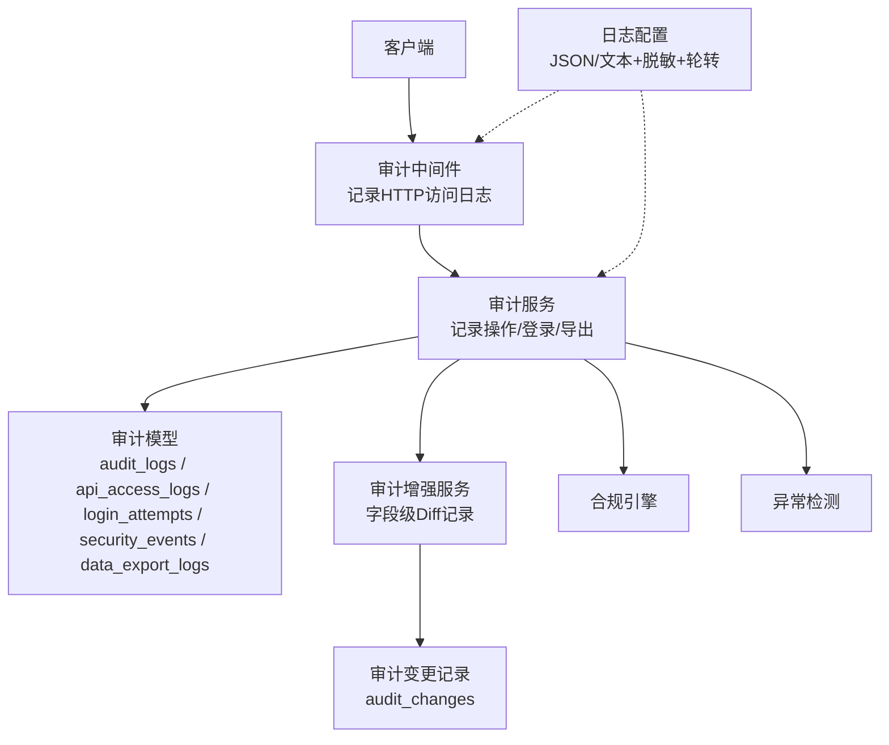
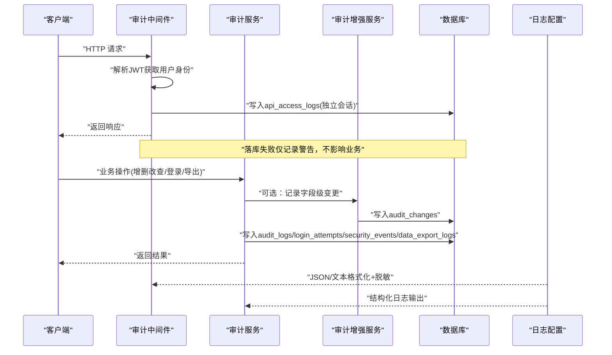
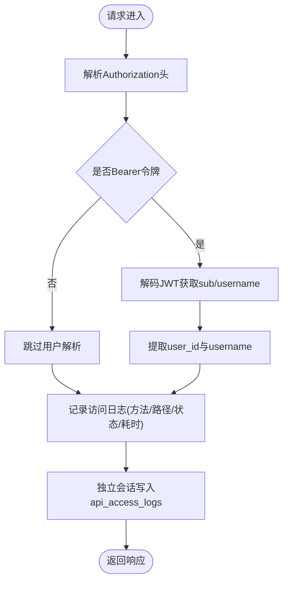
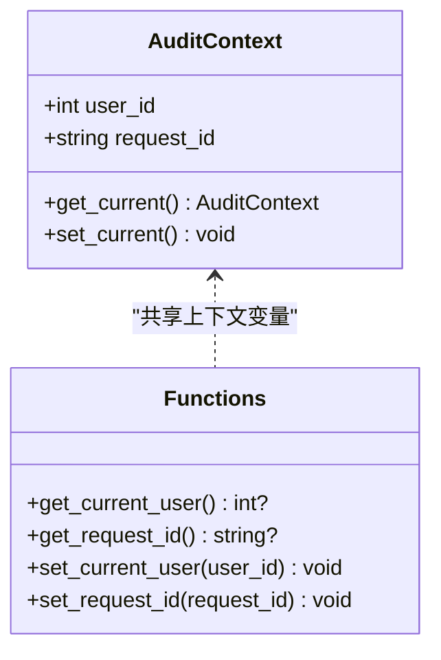
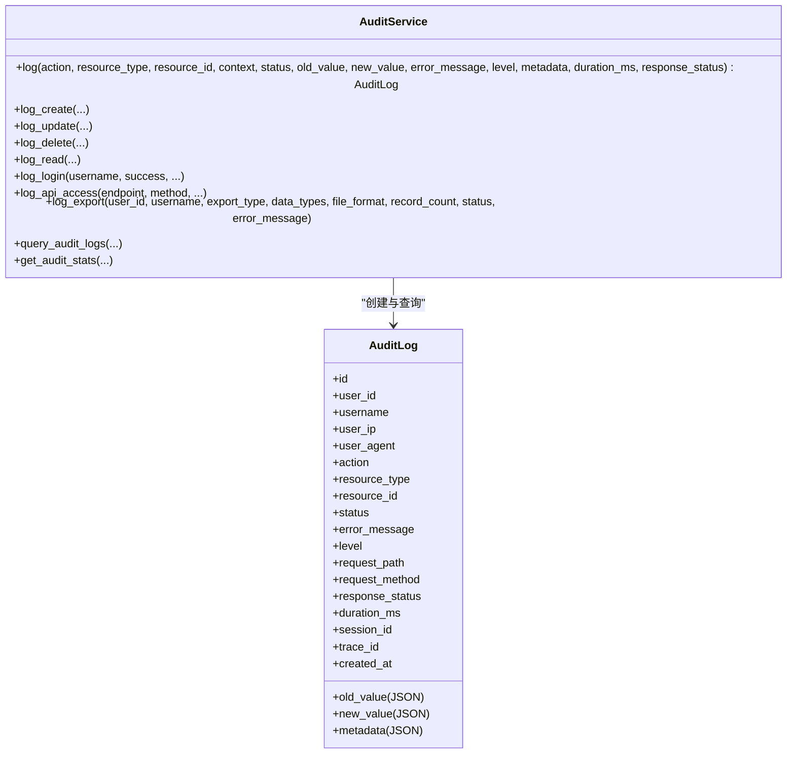
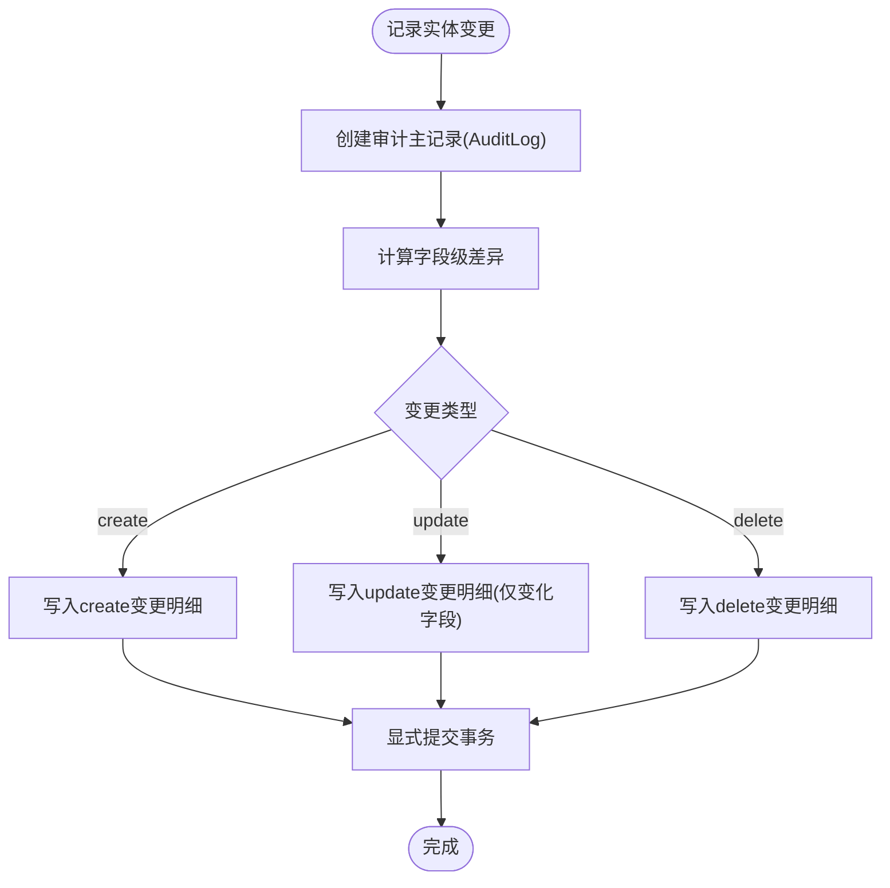
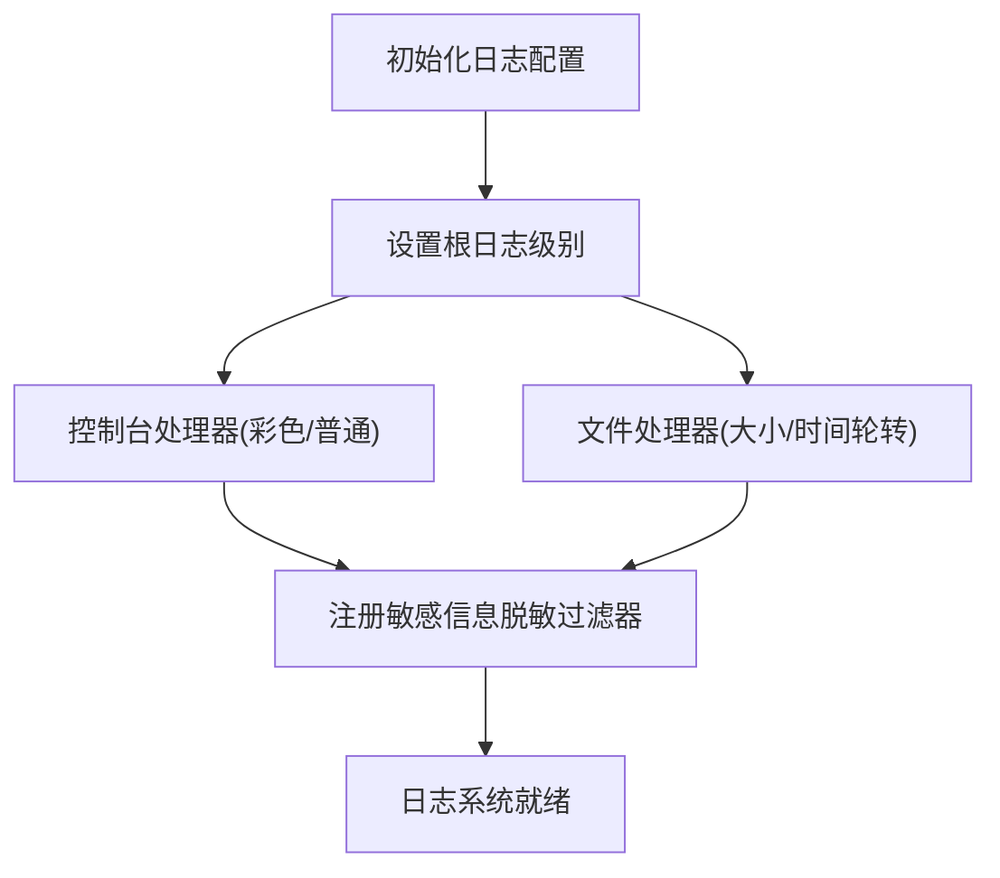
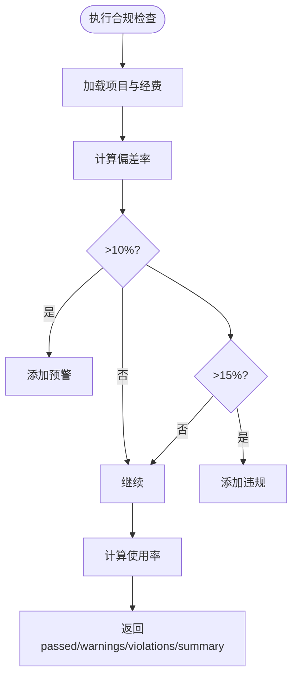
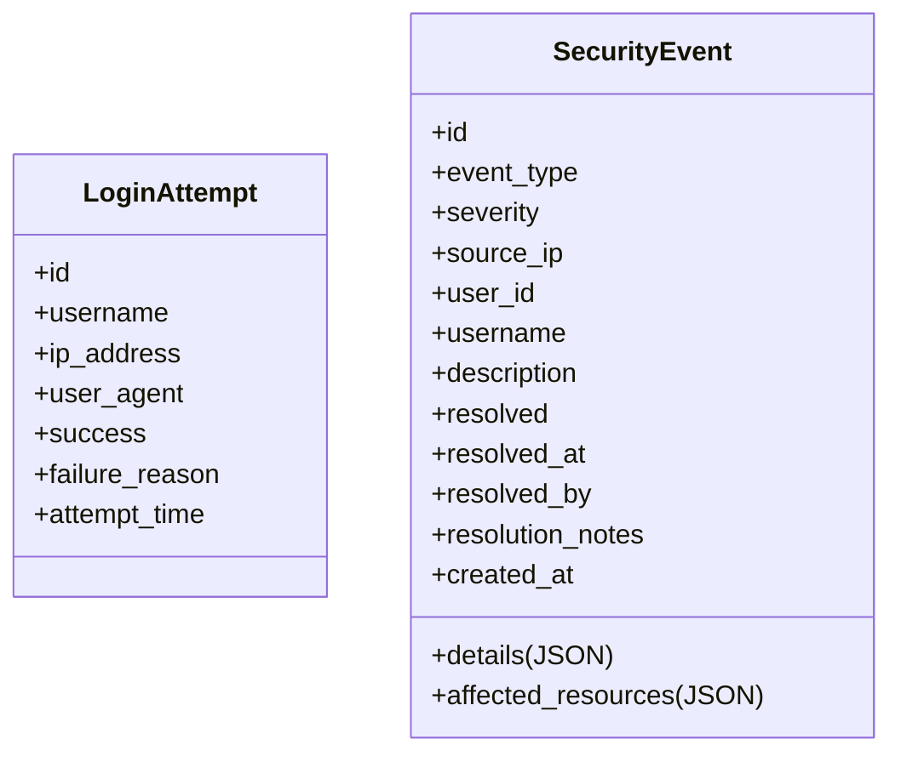
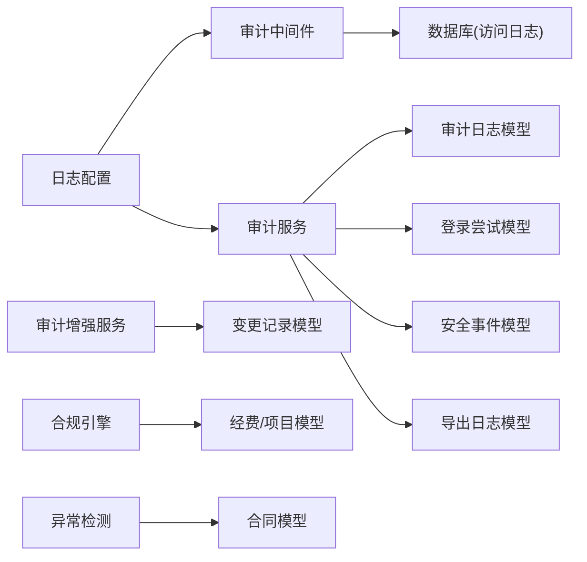

# 审计日志系统

<cite>
**本文引用的文件**
- [backend/app/core/audit_middleware.py](file://backend/app/core/audit_middleware.py)
- [backend/app/middleware/audit_context.py](file://backend/app/middleware/audit_context.py)
- [backend/app/services/audit_service.py](file://backend/app/services/audit_service.py)
- [backend/app/models/audit.py](file://backend/app/models/audit.py)
- [backend/app/models/audit_change.py](file://backend/app/models/audit_change.py)
- [backend/app/services/audit_enhancement_service.py](file://backend/app/services/audit_enhancement_service.py)
- [backend/app/core/logging_config.py](file://backend/app/core/logging_config.py)
- [backend/app/services/compliance_engine.py](file://backend/app/services/compliance_engine.py)
- [backend/app/services/fund_anomaly_detector.py](file://backend/app/services/fund_anomaly_detector.py)
- [backend/app/services/retention_service.py](file://backend/app/services/retention_service.py)
- [frontend/src/utils/logger.ts](file://frontend/src/utils/logger.ts)
</cite>

## 目录
1. [简介](#简介)
2. [项目结构](#项目结构)
3. [核心组件](#核心组件)
4. [架构总览](#架构总览)
5. [详细组件分析](#详细组件分析)
6. [依赖关系分析](#依赖关系分析)
7. [性能考量](#性能考量)
8. [故障排查指南](#故障排查指南)
9. [结论](#结论)
10. [附录](#附录)

## 简介
本文件为审计日志系统的完整记录与分析文档，覆盖以下目标：
- 操作审计机制：用户行为追踪、数据变更记录与敏感操作监控。
- 日志收集架构：结构化日志格式、日志级别分类与异步写入策略。
- 审计数据分析：异常检测、合规性检查与报表生成。
- 日志安全管理：脱敏、访问控制与保留策略。
- 故障排查与安全事件响应流程。

## 项目结构
后端围绕“中间件采集 + 服务层落库 + 模型持久化”的三层设计实现审计能力；前端提供统一的日志工具用于调试与导出。关键路径如下：
- 请求级审计：通过中间件捕获 HTTP 请求元信息并落库到访问日志表。
- 业务级审计：通过审计服务统一记录操作、登录、导出等事件，支持字段级变更历史。
- 安全事件：集中记录安全事件（如暴力破解）及状态流转。
- 日志基础设施：统一配置 JSON/文本输出、轮转与敏感信息脱敏。
- 分析与合规：异常检测与合规校验引擎，结合审计数据进行风险识别与报告。

图表来源
- [backend/app/core/audit_middleware.py:11-44](file://backend/app/core/audit_middleware.py#L11-L44)
- [backend/app/services/audit_service.py:58-106](file://backend/app/services/audit_service.py#L58-L106)
- [backend/app/models/audit.py:53-205](file://backend/app/models/audit.py#L53-L205)
- [backend/app/services/audit_enhancement_service.py:20-77](file://backend/app/services/audit_enhancement_service.py#L20-L77)
- [backend/app/core/logging_config.py:161-253](file://backend/app/core/logging_config.py#L161-L253)

章节来源
- [backend/app/core/audit_middleware.py:11-44](file://backend/app/core/audit_middleware.py#L11-L44)
- [backend/app/services/audit_service.py:58-106](file://backend/app/services/audit_service.py#L58-L106)
- [backend/app/models/audit.py:53-205](file://backend/app/models/audit.py#L53-L205)
- [backend/app/services/audit_enhancement_service.py:20-77](file://backend/app/services/audit_enhancement_service.py#L20-L77)
- [backend/app/core/logging_config.py:161-253](file://backend/app/core/logging_config.py#L161-L253)

## 核心组件
- 审计中间件：提取用户身份、记录请求方法/路径/状态码/耗时，并将访问日志独立事务落库，失败不破坏业务。
- 审计上下文：基于上下文变量维护当前请求的用户ID与请求ID，便于跨层传递。
- 审计服务：统一封装创建/读取/更新/删除/登录/导出等审计记录，提供查询与统计接口。
- 审计增强服务：对关键实体进行字段级变更 Diff 留痕，确保调用方事务提交后仍保留审计轨迹。
- 日志配置：统一初始化 JSON/文本格式化、按大小或时间轮转、敏感信息脱敏过滤器。
- 合规引擎与异常检测：经费偏差预警/否决线检测、单一来源采购与拆分合同等异常识别。
- 保留策略：软删资源清理策略示例，体现可配置的保留期与回滚备份机制。

章节来源
- [backend/app/core/audit_middleware.py:11-109](file://backend/app/core/audit_middleware.py#L11-L109)
- [backend/app/middleware/audit_context.py:15-58](file://backend/app/middleware/audit_context.py#L15-L58)
- [backend/app/services/audit_service.py:58-376](file://backend/app/services/audit_service.py#L58-L376)
- [backend/app/services/audit_enhancement_service.py:20-215](file://backend/app/services/audit_enhancement_service.py#L20-L215)
- [backend/app/core/logging_config.py:75-253](file://backend/app/core/logging_config.py#L75-L253)
- [backend/app/services/compliance_engine.py:23-109](file://backend/app/services/compliance_engine.py#L23-L109)
- [backend/app/services/fund_anomaly_detector.py:292-332](file://backend/app/services/fund_anomaly_detector.py#L292-L332)
- [backend/app/services/retention_service.py:25-84](file://backend/app/services/retention_service.py#L25-L84)

## 架构总览
审计系统采用“采集—处理—存储—分析”的分层架构：
- 采集层：中间件在请求生命周期内捕获访问信息；业务代码通过审计服务记录操作与变更。
- 处理层：审计增强服务计算字段级差异；合规引擎与异常检测对数据进行规则判断。
- 存储层：多张审计相关表分别承载不同维度数据，配合索引优化查询。
- 分析层：统计聚合、报表数据与前端展示联动。

图表来源
- [backend/app/core/audit_middleware.py:18-44](file://backend/app/core/audit_middleware.py#L18-L44)
- [backend/app/services/audit_service.py:62-106](file://backend/app/services/audit_service.py#L62-L106)
- [backend/app/services/audit_enhancement_service.py:49-77](file://backend/app/services/audit_enhancement_service.py#L49-L77)
- [backend/app/core/logging_config.py:161-253](file://backend/app/core/logging_config.py#L161-L253)

## 详细组件分析

### 审计中间件（HTTP访问日志）
- 功能要点：
  - 从 Authorization 头解析 JWT，提取 user_id 与 username。
  - 记录请求方法、路径、状态码、耗时，并写入 api_access_logs。
  - 使用独立短会话落库，失败仅记录 WARNING，不中断业务。
- 错误处理：
  - JWT 解析失败视为未认证请求，继续放行。
  - 落库异常被捕获并降级为警告日志。

图表来源
- [backend/app/core/audit_middleware.py:18-109](file://backend/app/core/audit_middleware.py#L18-L109)

章节来源
- [backend/app/core/audit_middleware.py:18-109](file://backend/app/core/audit_middleware.py#L18-L109)

### 审计上下文（跨层传递）
- 功能要点：
  - 使用 ContextVar 保存当前请求的用户ID与请求ID。
  - 提供设置与获取方法，便于各层无侵入地获取上下文。
- 使用场景：
  - 在中间件或鉴权阶段设置上下文，后续审计服务可直接读取。

图表来源
- [backend/app/middleware/audit_context.py:15-58](file://backend/app/middleware/audit_context.py#L15-L58)

章节来源
- [backend/app/middleware/audit_context.py:15-58](file://backend/app/middleware/audit_context.py#L15-L58)

### 审计服务（操作审计与统计）
- 功能要点：
  - 统一记录 create/read/update/delete/login/export 等操作。
  - 支持登录成功/失败记录，并关联安全事件。
  - 提供审计日志查询与统计接口（按动作、状态、级别、用户等）。
- 数据结构：
  - 使用 AuditAction/AuditLevel/AuditStatus 枚举规范动作与级别。
  - 将上下文信息（用户、IP、UA、会话、追踪ID、请求路径与方法）纳入审计记录。

图表来源
- [backend/app/services/audit_service.py:58-376](file://backend/app/services/audit_service.py#L58-L376)
- [backend/app/models/audit.py:53-96](file://backend/app/models/audit.py#L53-L96)

章节来源
- [backend/app/services/audit_service.py:58-376](file://backend/app/services/audit_service.py#L58-L376)
- [backend/app/models/audit.py:53-96](file://backend/app/models/audit.py#L53-L96)

### 审计增强服务（字段级变更历史）
- 功能要点：
  - 一键记录实体变更：创建审计主记录 + 字段级 Diff 明细。
  - 支持 create/update/delete 三种变更类型，自动过滤 id/时间戳等无关字段。
  - 显式提交审计变更，避免依赖调用方事务导致静默丢失。
- 数据结构：
  - audit_changes 表记录每个字段的旧值与新值，以及变更类型。

图表来源
- [backend/app/services/audit_enhancement_service.py:49-146](file://backend/app/services/audit_enhancement_service.py#L49-L146)
- [backend/app/models/audit_change.py:13-33](file://backend/app/models/audit_change.py#L13-L33)

章节来源
- [backend/app/services/audit_enhancement_service.py:49-146](file://backend/app/services/audit_enhancement_service.py#L49-L146)
- [backend/app/models/audit_change.py:13-33](file://backend/app/models/audit_change.py#L13-L33)

### 日志基础设施（结构化、级别与轮转）
- 结构化日志：
  - JSON 行格式包含时间戳、级别、模块、函数、行号与消息，便于机器解析。
- 日志级别：
  - DEBUG/INFO/WARNING/ERROR/CRITICAL，控制台根据 TTY 决定是否着色。
- 轮转策略：
  - 按大小轮转（RotatingFileHandler）或按时间轮转（TimedRotatingFileHandler），Windows 下重试避免 WinError 32。
- 敏感信息脱敏：
  - 正则替换身份证号、手机号、邮箱与常见密钥键值对，防止敏感数据落入日志。

图表来源
- [backend/app/core/logging_config.py:161-253](file://backend/app/core/logging_config.py#L161-L253)
- [backend/app/core/logging_config.py:75-119](file://backend/app/core/logging_config.py#L75-L119)

章节来源
- [backend/app/core/logging_config.py:75-253](file://backend/app/core/logging_config.py#L75-L253)

### 合规性检查与异常检测
- 合规引擎：
  - 经费偏差率超过 10% 触发预警，超过 15% 触发否决。
  - 计算使用率与汇总指标，供前端展示与审计分析。
- 异常检测：
  - 单一来源采购检测：同一项目所有合同指向同一供应商时标记异常。
  - 拆分合同检测：总金额接近阈值且疑似拆分时标记异常。

图表来源
- [backend/app/services/compliance_engine.py:23-109](file://backend/app/services/compliance_engine.py#L23-L109)
- [backend/app/services/fund_anomaly_detector.py:292-332](file://backend/app/services/fund_anomaly_detector.py#L292-L332)

章节来源
- [backend/app/services/compliance_engine.py:23-109](file://backend/app/services/compliance_engine.py#L23-L109)
- [backend/app/services/fund_anomaly_detector.py:292-332](file://backend/app/services/fund_anomaly_detector.py#L292-L332)

### 安全事件与登录尝试
- 登录尝试：
  - 记录用户名、IP、UA、成功与否与失败原因，建立索引以支持快速查询。
- 安全事件：
  - 根据失败次数动态判定严重级别（低/中/高），生成事件并支持解决与备注。

图表来源
- [backend/app/models/audit.py:128-145](file://backend/app/models/audit.py#L128-L145)
- [backend/app/models/audit.py:98-126](file://backend/app/models/audit.py#L98-L126)

章节来源
- [backend/app/models/audit.py:98-145](file://backend/app/models/audit.py#L98-L145)

### 数据导出审计
- 记录导出类型、数据类型、文件格式、记录数、文件大小、文件路径与状态。
- 同时写入通用审计日志，便于统一检索与统计。

章节来源
- [backend/app/models/audit.py:178-205](file://backend/app/models/audit.py#L178-L205)
- [backend/app/services/audit_service.py:231-273](file://backend/app/services/audit_service.py#L231-L273)

### 前端日志工具
- 提供 warn/error/fatal 等方法，生产环境也输出到控制台。
- 支持日志导出为 JSON，便于问题定位与上报。

章节来源
- [frontend/src/utils/logger.ts:54-93](file://frontend/src/utils/logger.ts#L54-L93)

## 依赖关系分析
- 中间件依赖：
  - 解析 JWT 与配置，落库使用独立会话，避免影响业务事务。
- 服务依赖：
  - 审计服务依赖审计模型与事务工具；增强服务依赖变更记录模型。
- 日志依赖：
  - 统一由日志配置模块初始化，所有 handler 均附加脱敏过滤器。
- 分析依赖：
  - 合规引擎与异常检测依赖业务模型（经费、项目、合同等）。

图表来源
- [backend/app/core/audit_middleware.py:18-109](file://backend/app/core/audit_middleware.py#L18-L109)
- [backend/app/services/audit_service.py:58-376](file://backend/app/services/audit_service.py#L58-L376)
- [backend/app/services/audit_enhancement_service.py:49-146](file://backend/app/services/audit_enhancement_service.py#L49-L146)
- [backend/app/core/logging_config.py:161-253](file://backend/app/core/logging_config.py#L161-L253)
- [backend/app/services/compliance_engine.py:23-109](file://backend/app/services/compliance_engine.py#L23-L109)
- [backend/app/services/fund_anomaly_detector.py:292-332](file://backend/app/services/fund_anomaly_detector.py#L292-L332)

章节来源
- [backend/app/core/audit_middleware.py:18-109](file://backend/app/core/audit_middleware.py#L18-L109)
- [backend/app/services/audit_service.py:58-376](file://backend/app/services/audit_service.py#L58-L376)
- [backend/app/services/audit_enhancement_service.py:49-146](file://backend/app/services/audit_enhancement_service.py#L49-L146)
- [backend/app/core/logging_config.py:161-253](file://backend/app/core/logging_config.py#L161-L253)
- [backend/app/services/compliance_engine.py:23-109](file://backend/app/services/compliance_engine.py#L23-L109)
- [backend/app/services/fund_anomaly_detector.py:292-332](file://backend/app/services/fund_anomaly_detector.py#L292-L332)

## 性能考量
- 访问日志写入：
  - 使用独立会话与 safe_commit，失败降级为警告，避免阻塞请求。
  - 建议在高并发场景考虑批量缓冲或采样写入以降低热点。
- 审计日志写入：
  - 审计增强服务显式提交，确保审计轨迹不随业务事务回滚而丢失。
- 日志轮转：
  - Windows 下重试机制减少因句柄占用导致的轮转失败。
- 查询性能：
  - 审计模型定义多组索引（用户、动作、时间、资源等），提升常用查询效率。

[本节为通用指导，无需特定文件引用]

## 故障排查指南
- 访问日志未写入：
  - 检查中间件是否启用、JWT 解析是否成功、数据库连接是否正常。
  - 关注 WARNING 日志中的落库失败信息。
- 审计日志缺失：
  - 确认业务代码是否调用审计服务；增强服务是否显式提交。
  - 检查审计模型索引与查询条件是否正确。
- 日志文件无法轮转：
  - 观察 SafeRotating/TimedRotating 的重试与 stderr 输出。
  - 检查文件权限与防病毒软件占用。
- 敏感信息泄露：
  - 确认已启用脱敏过滤器；检查 SQL echo、异常栈与请求体是否包含敏感内容。
- 合规/异常检测误报：
  - 核对阈值配置与数据来源；查看合规引擎与异常检测的详细输出。

章节来源
- [backend/app/core/audit_middleware.py:79-109](file://backend/app/core/audit_middleware.py#L79-L109)
- [backend/app/services/audit_enhancement_service.py:143-146](file://backend/app/services/audit_enhancement_service.py#L143-L146)
- [backend/app/core/logging_config.py:21-73](file://backend/app/core/logging_config.py#L21-L73)
- [backend/app/core/logging_config.py:75-119](file://backend/app/core/logging_config.py#L75-L119)
- [backend/app/services/compliance_engine.py:101-109](file://backend/app/services/compliance_engine.py#L101-L109)
- [backend/app/services/fund_anomaly_detector.py:292-332](file://backend/app/services/fund_anomaly_detector.py#L292-L332)

## 结论
该审计日志系统通过中间件与服务层协同，实现了完整的操作审计、数据变更记录与敏感操作监控；借助结构化日志与脱敏机制保障日志质量与安全；合规引擎与异常检测为数据分析提供了基础能力；保留策略与轮转机制确保长期运行的稳定性。建议在大规模部署中进一步优化访问日志写入策略（批量/采样），并结合保留期调度实现大表治理。

[本节为总结，无需特定文件引用]

## 附录
- 审计模型字段说明：
  - audit_logs：操作审计主表，包含用户、资源、动作、状态、级别、请求信息与元数据。
  - api_access_logs：HTTP 访问日志，包含端点、方法、状态码、耗时、IP、UA与会话。
  - login_attempts：登录尝试记录，支持失败原因与时间索引。
  - security_events：安全事件记录，支持严重级别、详情、受影响资源与解决状态。
  - data_export_logs：数据导出审计，包含导出类型、数据范围、文件格式与结果。
  - audit_changes：字段级变更记录，关联审计主记录，记录旧值与新值。

章节来源
- [backend/app/models/audit.py:53-205](file://backend/app/models/audit.py#L53-L205)
- [backend/app/models/audit_change.py:13-33](file://backend/app/models/audit_change.py#L13-L33)