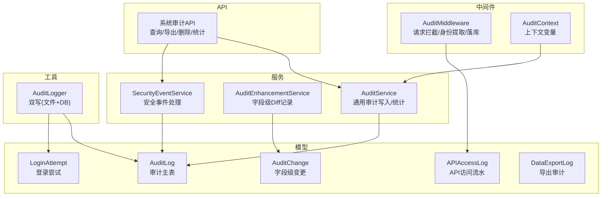
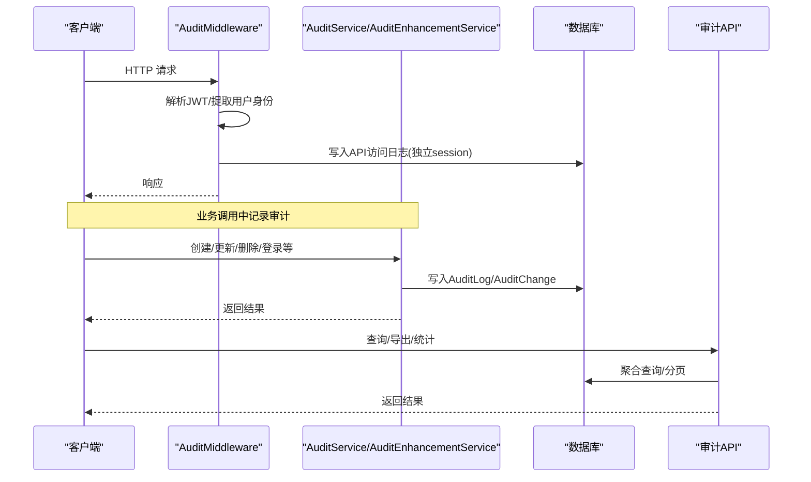
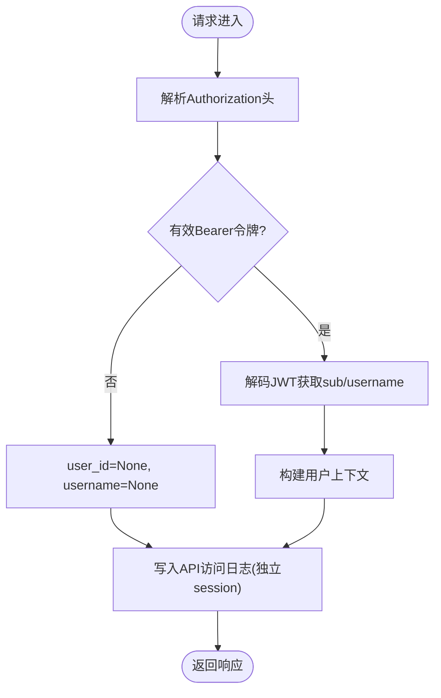
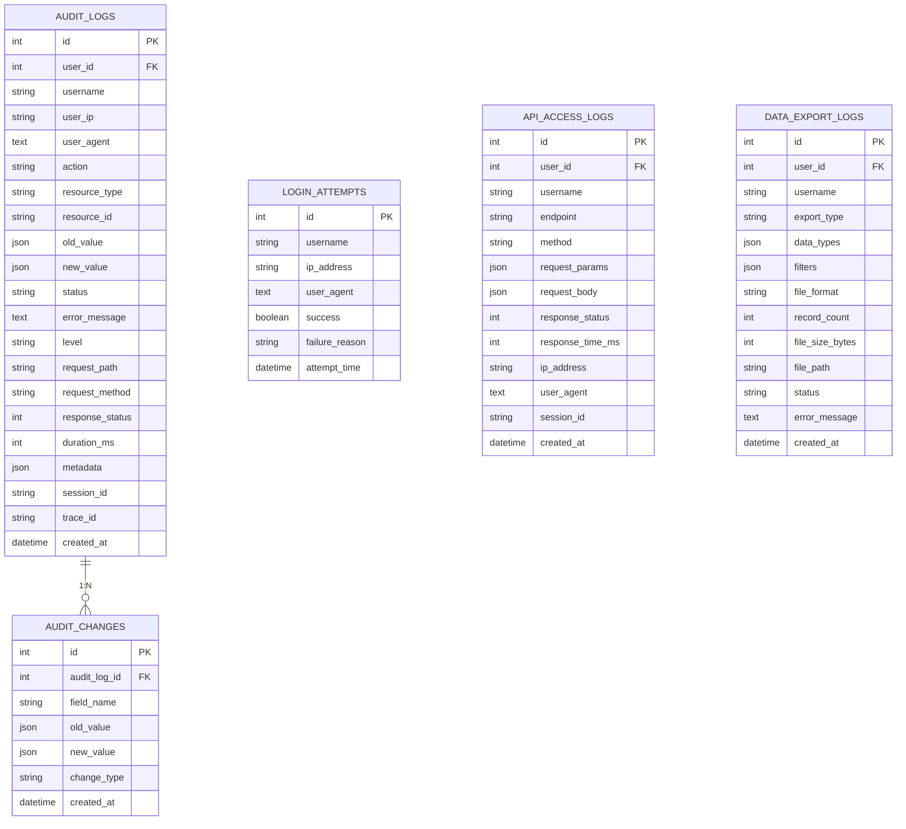
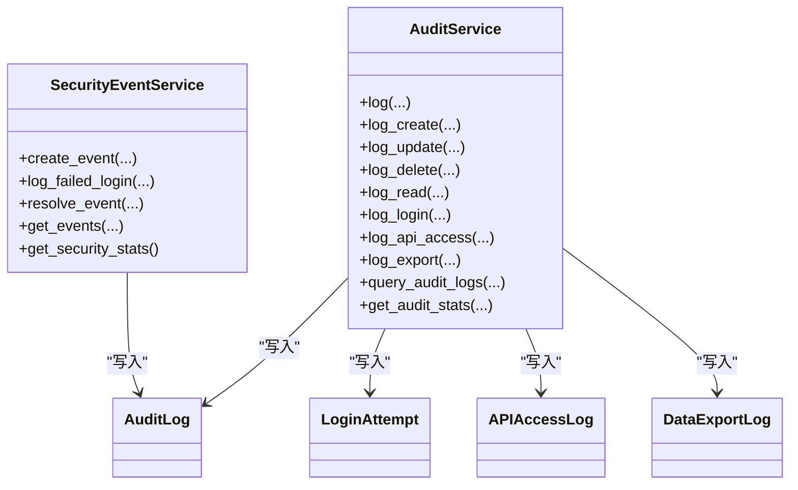
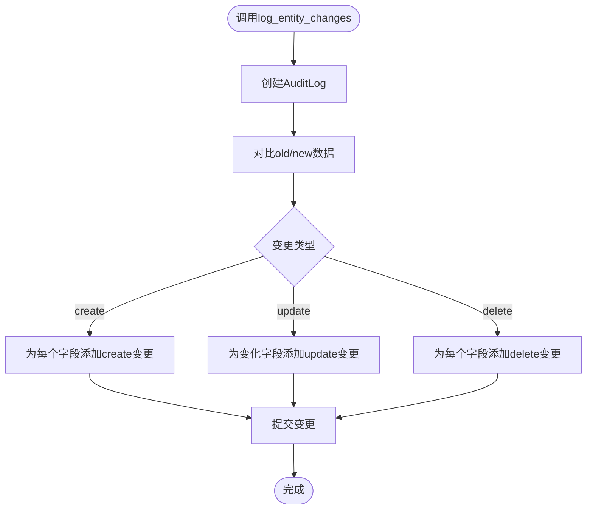
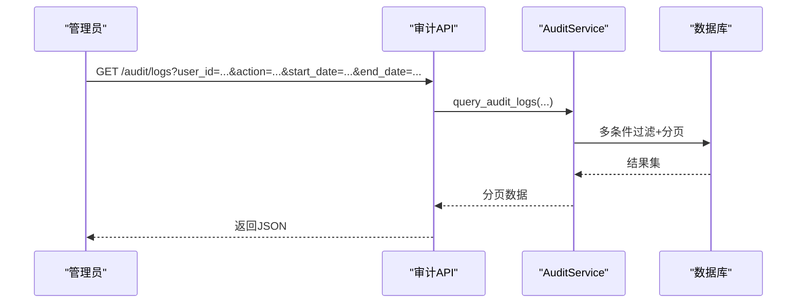
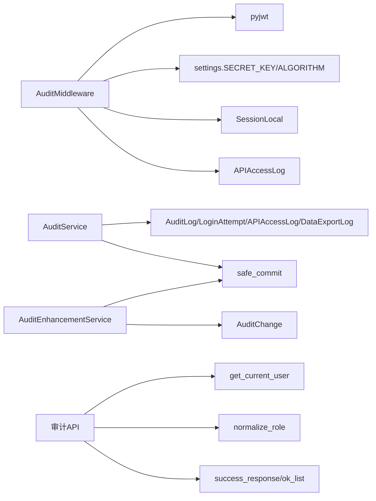

# 操作审计记录

<cite>
**本文引用的文件**
- [backend/app/core/audit_middleware.py](file://backend/app/core/audit_middleware.py)
- [backend/app/middleware/audit_context.py](file://backend/app/middleware/audit_context.py)
- [backend/app/models/audit.py](file://backend/app/models/audit.py)
- [backend/app/models/audit_change.py](file://backend/app/models/audit_change.py)
- [backend/app/services/audit_service.py](file://backend/app/services/audit_service.py)
- [backend/app/services/audit_enhancement_service.py](file://backend/app/services/audit_enhancement_service.py)
- [backend/app/utils/audit_logger.py](file://backend/app/utils/audit_logger.py)
- [backend/app/api/v1/system/audit.py](file://backend/app/api/v1/system/audit.py)
</cite>

## 目录
1. [简介](#简介)
2. [项目结构](#项目结构)
3. [核心组件](#核心组件)
4. [架构总览](#架构总览)
5. [详细组件分析](#详细组件分析)
6. [依赖关系分析](#依赖关系分析)
7. [性能与优化](#性能与优化)
8. [故障排查指南](#故障排查指南)
9. [结论](#结论)
10. [附录：API 使用与查询示例](#附录api-使用与查询示例)

## 简介
本技术文档围绕“操作审计记录”能力，系统性说明用户行为追踪机制（登录登出、数据访问审计、CRUD 跟踪、敏感操作监控），审计中间件的实现原理（请求拦截、上下文捕获、异步日志写入、性能优化策略），审计数据的结构化存储格式（操作类型分类、时间戳精度、IP 地址记录、用户会话关联），以及审计查询接口使用方法（条件筛选、时间范围查询、操作统计）。同时涵盖安全保护措施与合规性要求。

## 项目结构
后端审计相关代码主要分布在以下模块：
- 中间件层：请求拦截、用户身份提取、API 访问落库
- 模型层：审计主表、字段级变更表、登录尝试表、API 访问表、导出日志表等
- 服务层：统一审计写入、增强型字段级差异记录、安全事件处理
- 工具层：双写审计日志（文件 + 数据库）
- API 层：审计日志查询、导出、删除、统计、安全事件管理

图表来源
- [backend/app/core/audit_middleware.py:11-109](file://backend/app/core/audit_middleware.py#L11-L109)
- [backend/app/middleware/audit_context.py:15-58](file://backend/app/middleware/audit_context.py#L15-L58)
- [backend/app/services/audit_service.py:23-376](file://backend/app/services/audit_service.py#L23-L376)
- [backend/app/services/audit_enhancement_service.py:20-215](file://backend/app/services/audit_enhancement_service.py#L20-L215)
- [backend/app/models/audit.py:19-205](file://backend/app/models/audit.py#L19-L205)
- [backend/app/models/audit_change.py:13-33](file://backend/app/models/audit_change.py#L13-L33)
- [backend/app/utils/audit_logger.py:60-297](file://backend/app/utils/audit_logger.py#L60-L297)
- [backend/app/api/v1/system/audit.py:19-615](file://backend/app/api/v1/system/audit.py#L19-L615)

章节来源
- [backend/app/core/audit_middleware.py:11-109](file://backend/app/core/audit_middleware.py#L11-L109)
- [backend/app/models/audit.py:19-205](file://backend/app/models/audit.py#L19-L205)
- [backend/app/services/audit_service.py:23-376](file://backend/app/services/audit_service.py#L23-L376)
- [backend/app/api/v1/system/audit.py:19-615](file://backend/app/api/v1/system/audit.py#L19-L615)

## 核心组件
- 审计中间件：拦截 HTTP 请求，解析 JWT 获取用户身份，记录方法、路径、状态码、耗时，并独立事务写入 API 访问日志。
- 审计服务：提供统一的审计写入接口，支持 CRUD、登录登出、API 访问、导出等；提供分页查询与多维统计。
- 审计增强服务：对关键实体进行字段级 Diff 留痕，生成 AuditChange 明细。
- 审计工具：将审计事件同时写入应用日志与数据库，确保可归档与可检索。
- 审计 API：提供管理员权限的审计日志查询、导出、删除、统计与安全事件管理。

章节来源
- [backend/app/core/audit_middleware.py:11-109](file://backend/app/core/audit_middleware.py#L11-L109)
- [backend/app/services/audit_service.py:58-376](file://backend/app/services/audit_service.py#L58-L376)
- [backend/app/services/audit_enhancement_service.py:20-215](file://backend/app/services/audit_enhancement_service.py#L20-L215)
- [backend/app/utils/audit_logger.py:60-297](file://backend/app/utils/audit_logger.py#L60-L297)
- [backend/app/api/v1/system/audit.py:19-615](file://backend/app/api/v1/system/audit.py#L19-L615)

## 架构总览
审计链路从请求进入开始，经中间件捕获上下文并落库；业务逻辑通过服务层记录审计事件；增强服务在关键变更时记录字段级差异；API 层暴露查询与导出能力。

图表来源
- [backend/app/core/audit_middleware.py:18-44](file://backend/app/core/audit_middleware.py#L18-L44)
- [backend/app/services/audit_service.py:62-106](file://backend/app/services/audit_service.py#L62-L106)
- [backend/app/services/audit_enhancement_service.py:49-77](file://backend/app/services/audit_enhancement_service.py#L49-L77)
- [backend/app/api/v1/system/audit.py:339-406](file://backend/app/api/v1/system/audit.py#L339-L406)

## 详细组件分析

### 审计中间件（请求拦截与API访问审计）
- 职责：
  - 记录请求方法、路径、响应状态码、耗时。
  - 从 Authorization 头解析 JWT，提取 user_id 与 username。
  - 使用独立短 session 将本次访问写入 api_access_logs，失败仅记录警告，不破坏业务请求。
- 关键点：
  - 使用 BaseHTTPMiddleware 包装请求生命周期。
  - 独立 SessionLocal 避免与业务事务耦合。
  - 异常捕获保证健壮性。

图表来源
- [backend/app/core/audit_middleware.py:18-109](file://backend/app/core/audit_middleware.py#L18-L109)

章节来源
- [backend/app/core/audit_middleware.py:11-109](file://backend/app/core/audit_middleware.py#L11-L109)

### 审计上下文（跨层传递）
- 使用 ContextVar 维护当前请求的用户ID与请求ID，便于后续审计写入携带上下文信息。
- 提供设置与获取当前上下文的便捷函数。

章节来源
- [backend/app/middleware/audit_context.py:15-58](file://backend/app/middleware/audit_context.py#L15-L58)

### 审计数据模型（结构化存储）
- 审计主表 audit_logs：
  - 关键字段：user_id、username、user_ip、user_agent、action、resource_type、resource_id、old_value/new_value、status、level、request_path、request_method、response_status、duration_ms、metadata、session_id、trace_id、created_at。
  - 索引：按用户+动作、时间戳、资源等多维度加速查询。
- 字段级变更表 audit_changes：
  - 记录字段名、旧值、新值、变更类型(create/update/delete)，关联到审计主表。
- 登录尝试表 login_attempts：
  - 记录用户名、IP、UA、成功与否、失败原因、尝试时间。
- API 访问日志表 api_access_logs：
  - 记录 endpoint、method、参数、响应状态、耗时、IP、UA、session_id、时间。
- 导出日志表 data_export_logs：
  - 记录导出类型、数据类型、过滤器、文件格式、记录数、文件大小、文件路径、状态、错误信息。

图表来源
- [backend/app/models/audit.py:53-205](file://backend/app/models/audit.py#L53-L205)
- [backend/app/models/audit_change.py:13-33](file://backend/app/models/audit_change.py#L13-L33)

章节来源
- [backend/app/models/audit.py:19-205](file://backend/app/models/audit.py#L19-L205)
- [backend/app/models/audit_change.py:13-33](file://backend/app/models/audit_change.py#L13-L33)

### 审计服务（写入与查询）
- 通用写入：
  - log() 支持 action、resource、context、status、level、元数据、耗时、响应状态等。
  - 快捷方法：log_create/log_update/log_delete/log_read/log_login/log_api_access/log_export。
- 查询与统计：
  - query_audit_logs() 支持按用户、动作、资源类型、时间范围、状态、级别分页查询。
  - get_audit_stats() 返回按动作/状态/级别分组计数、活跃用户、最近活动、今日操作数等。
- 安全事件：
  - SecurityEventService 提供事件创建、失败登录检测与分级、事件解决与查询统计。

图表来源
- [backend/app/services/audit_service.py:23-510](file://backend/app/services/audit_service.py#L23-L510)

章节来源
- [backend/app/services/audit_service.py:58-376](file://backend/app/services/audit_service.py#L58-L376)
- [backend/app/services/audit_service.py:379-510](file://backend/app/services/audit_service.py#L379-L510)

### 审计增强服务（字段级差异记录）
- 一键记录实体变更：
  - log_entity_changes() 自动创建审计主记录并记录字段级差异。
- 变更记录：
  - record_changes() 对比 old/new 数据，生成 create/update/delete 类型的字段级变更。
  - 支持 key_fields 过滤只记录关键字段。
- 变更历史查询：
  - get_change_history() 按资源类型与ID返回最近变更历史，包含每个字段的旧值与新值。

图表来源
- [backend/app/services/audit_enhancement_service.py:49-146](file://backend/app/services/audit_enhancement_service.py#L49-L146)

章节来源
- [backend/app/services/audit_enhancement_service.py:20-215](file://backend/app/services/audit_enhancement_service.py#L20-L215)

### 审计工具（双写与敏感操作）
- 双写机制：
  - 将审计事件同时写入 Python 日志系统（app.log 中的 JSON 行）与数据库（audit_logs/login_attempts）。
- 敏感操作：
  - 提供 log_sensitive_operation()、log_permission_change() 等方法，标记为 CRITICAL 级别。
- 登录记录：
  - log_login() 同时记录成功/失败及失败原因。

章节来源
- [backend/app/utils/audit_logger.py:60-297](file://backend/app/utils/audit_logger.py#L60-L297)

### 审计API（查询、导出、删除、统计）
- 查询：
  - GET /audit/logs：支持 user_id、action、resource_type、status、level、start_date、end_date、分页。
  - GET /audit/logs/{log_id}：单条详情。
- 导出：
  - GET /audit/logs/export：支持 json/excel/csv 三种格式，限制最大5000条。
- 删除：
  - DELETE /audit/logs/batch：支持按 ids、actions/action、before_date 组合删除。
  - DELETE /audit/logs/{log_id}：删除单条。
- 统计：
  - GET /audit/stats：返回总体统计、按动作/状态/级别分组、活跃用户、最近活动等。
- 安全事件：
  - GET /audit/security/events：按 severity、event_type、resolved、时间范围分页查询。
  - POST /audit/security/events/{event_id}/resolve：标记事件已解决。
  - GET /audit/security/stats：安全事件统计。
- 登录尝试与API访问：
  - GET /audit/login-attempts：按用户名/IP/时间范围查询。
  - GET /audit/api-access：按用户/端点/时间范围查询。
  - GET /audit/exports：按用户/导出类型/时间范围查询。
  - GET /audit/user-activity/{user_id}：用户活动统计。

图表来源
- [backend/app/api/v1/system/audit.py:339-406](file://backend/app/api/v1/system/audit.py#L339-L406)
- [backend/app/services/audit_service.py:275-315](file://backend/app/services/audit_service.py#L275-L315)

章节来源
- [backend/app/api/v1/system/audit.py:80-615](file://backend/app/api/v1/system/audit.py#L80-L615)

## 依赖关系分析
- 中间件依赖：
  - 解析 JWT（pyjwt）、读取配置（SECRET_KEY、ALGORITHM）、数据库会话（SessionLocal）、审计模型（APIAccessLog）。
- 服务依赖：
  - 审计服务依赖审计模型（AuditLog、LoginAttempt、APIAccessLog、DataExportLog）与事务工具（safe_commit）。
  - 增强服务依赖审计主表与变更表，使用 safe_commit 确保变更持久化。
- API 依赖：
  - 路由依赖认证依赖（get_current_user）、角色归一化（normalize_role）、响应封装（success_response/ok_list）。

图表来源
- [backend/app/core/audit_middleware.py:46-77](file://backend/app/core/audit_middleware.py#L46-L77)
- [backend/app/services/audit_service.py:8-18](file://backend/app/services/audit_service.py#L8-L18)
- [backend/app/services/audit_enhancement_service.py:13-15](file://backend/app/services/audit_enhancement_service.py#L13-L15)
- [backend/app/api/v1/system/audit.py:9-15](file://backend/app/api/v1/system/audit.py#L9-L15)

章节来源
- [backend/app/core/audit_middleware.py:46-77](file://backend/app/core/audit_middleware.py#L46-L77)
- [backend/app/services/audit_service.py:8-18](file://backend/app/services/audit_service.py#L8-L18)
- [backend/app/services/audit_enhancement_service.py:13-15](file://backend/app/services/audit_enhancement_service.py#L13-L15)
- [backend/app/api/v1/system/audit.py:9-15](file://backend/app/api/v1/system/audit.py#L9-L15)

## 性能与优化
- 中间件落库隔离：
  - 使用独立短 session 写入 api_access_logs，避免与业务事务耦合；失败仅记录警告，不影响主流程。
- 批量与分页：
  - 查询接口均支持分页，限制 page_size 上限，防止大结果集拖垮系统。
- 导出限制：
  - 导出接口限制最多 5000 条，避免超大响应。
- 索引设计：
  - 审计主表与访问日志表针对常用查询维度建立索引（用户、动作、时间、资源等）。
- 异步与降级：
  - 审计写入失败降级为日志记录，保障可用性。
- 建议：
  - 在高并发场景下，可将审计写入改为消息队列异步落库，进一步降低请求延迟。
  - 定期归档历史审计数据，控制表规模。

[本节为通用性能讨论，不直接分析具体文件]

## 故障排查指南
- 中间件无法解析 JWT：
  - 检查 Authorization 头格式是否为 Bearer token；确认 SECRET_KEY 与 ALGORITHM 配置正确。
- API 访问日志未落库：
  - 查看 WARNING 日志是否出现“api_access_logs 落库失败”；检查数据库连接与权限。
- 审计日志未持久化：
  - 检查 AuditLogger._persist_to_db 的错误日志；确认数据库可用与事务提交正常。
- 批量删除误删风险：
  - 确保传入有效的 ids/actions/before_date；无过滤条件时不会执行删除。
- 导出失败：
  - Excel 导出依赖 openpyxl；若未安装会回退到 CSV；检查依赖安装情况。

章节来源
- [backend/app/core/audit_middleware.py:106-109](file://backend/app/core/audit_middleware.py#L106-L109)
- [backend/app/utils/audit_logger.py:171-184](file://backend/app/utils/audit_logger.py#L171-L184)
- [backend/app/api/v1/system/audit.py:121-141](file://backend/app/api/v1/system/audit.py#L121-L141)
- [backend/app/api/v1/system/audit.py:262-336](file://backend/app/api/v1/system/audit.py#L262-L336)

## 结论
该审计体系通过中间件、服务、模型与工具的协同，实现了完整的用户行为追踪与合规审计能力。其特点包括：
- 全面的审计覆盖：登录登出、CRUD、API 访问、导出、安全事件。
- 结构化存储：丰富的字段与索引，支持多维度查询与统计。
- 高可用与健壮性：独立事务、失败降级、不阻塞主流程。
- 可运维与可审计：双写机制、导出能力、管理员可控删除与备注。
建议在大规模部署中引入异步落库与数据归档策略，以进一步提升性能与可维护性。

[本节为总结性内容，不直接分析具体文件]

## 附录：API 使用与查询示例
- 查询审计日志：
  - GET /audit/logs?user_id=1&action=create&start_date=2026-01-01T00:00:00&end_date=2026-01-31T23:59:59&page=1&page_size=50
- 导出审计日志：
  - GET /audit/logs/export?action=export&format=excel
- 删除审计日志：
  - DELETE /audit/logs/batch {"ids":[1,2],"before_date":"2026-01-01T00:00:00"}
- 统计：
  - GET /audit/stats?start_date=2026-01-01T00:00:00&end_date=2026-01-31T23:59:59
- 安全事件：
  - GET /audit/security/events?severity=high&resolved=false&page=1&page_size=50
  - POST /audit/security/events/{event_id}/resolve?resolution_notes=已处理
- 登录尝试与API访问：
  - GET /audit/login-attempts?username=admin&start_date=2026-01-01T00:00:00
  - GET /audit/api-access?endpoint=/api/projects&start_date=2026-01-01T00:00:00

章节来源
- [backend/app/api/v1/system/audit.py:339-615](file://backend/app/api/v1/system/audit.py#L339-L615)