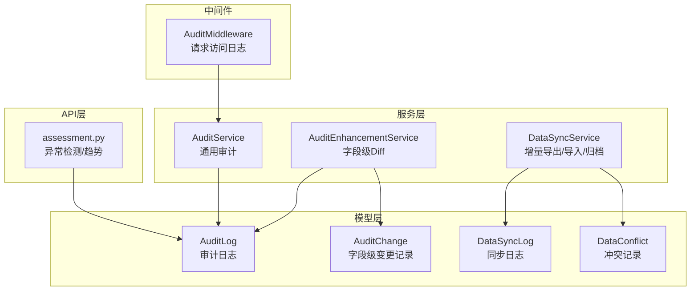
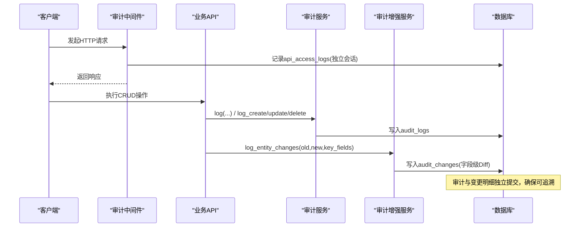
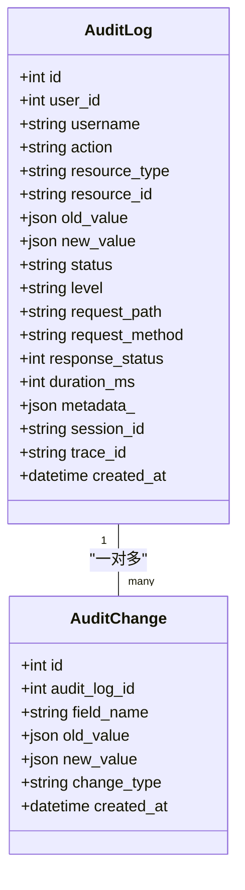
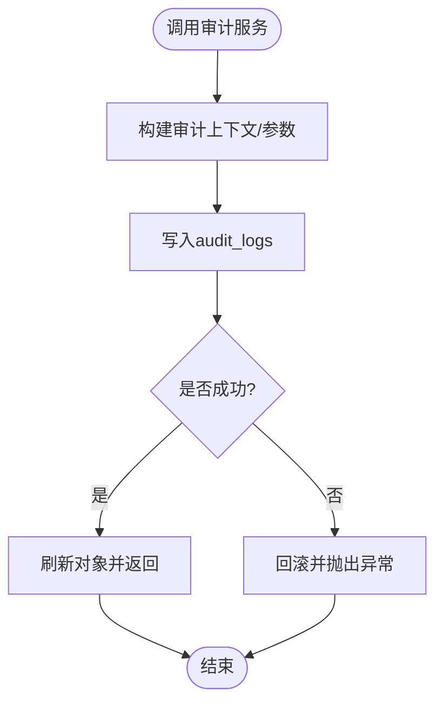
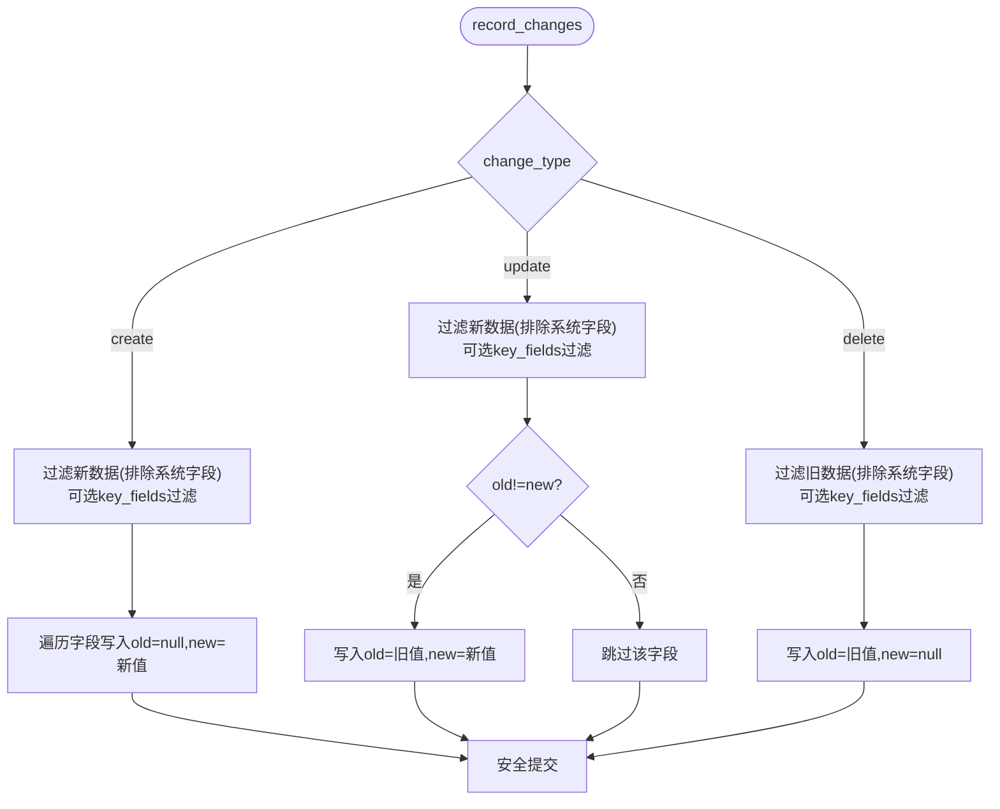
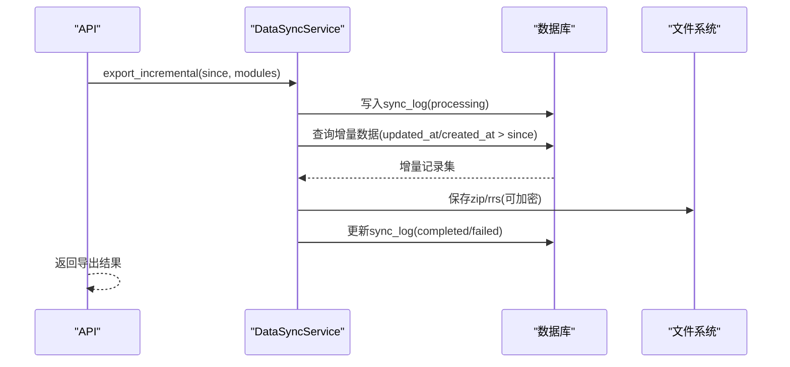
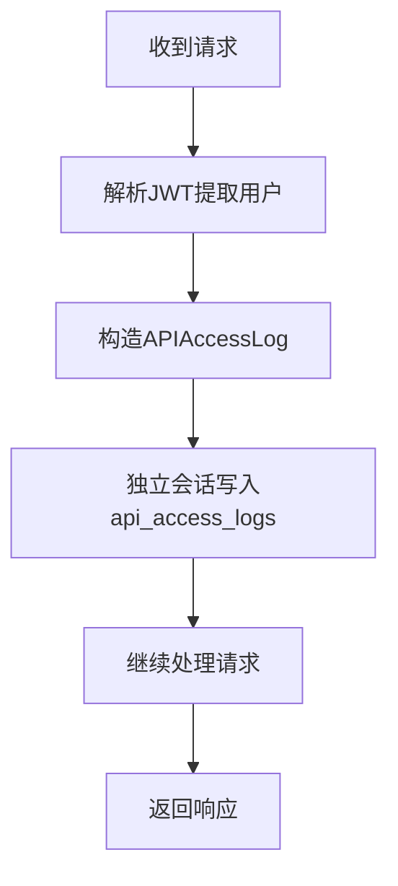
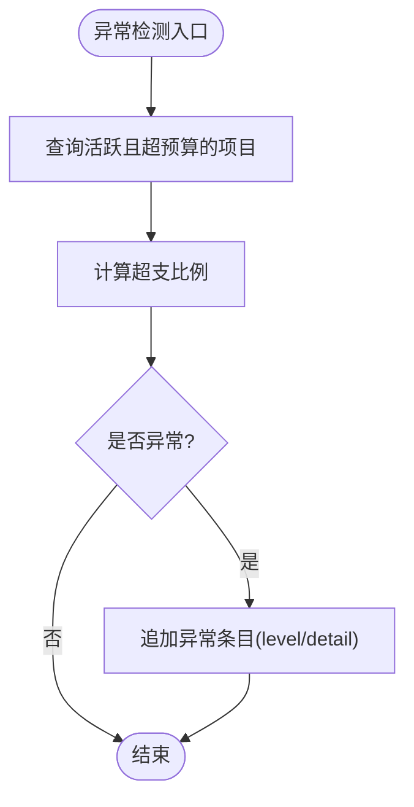
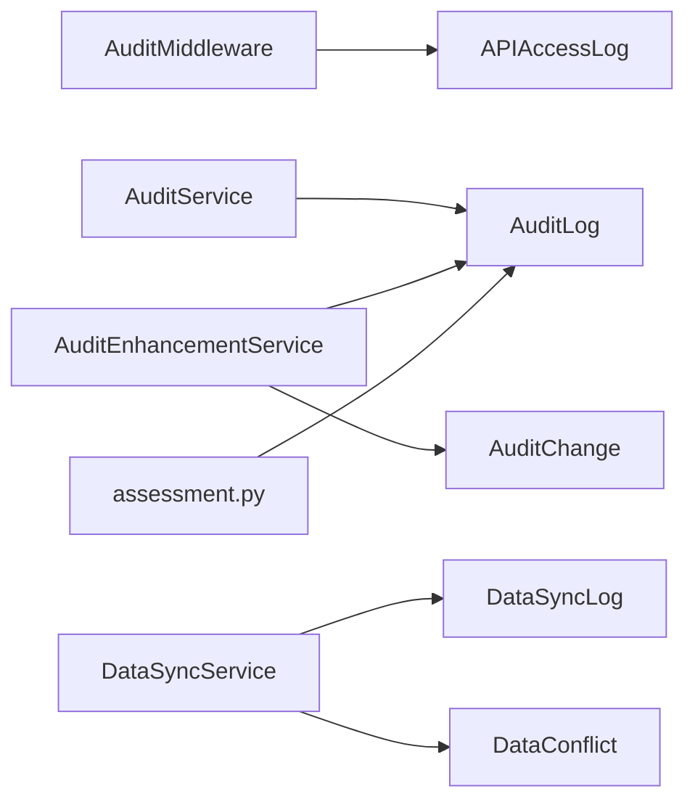

# 数据变更记录

<cite>
**本文引用的文件**
- [audit.py](file://backend/app/models/audit.py)
- [audit_change.py](file://backend/app/models/audit_change.py)
- [audit_service.py](file://backend/app/services/audit_service.py)
- [audit_enhancement_service.py](file://backend/app/services/audit_enhancement_service.py)
- [audit_middleware.py](file://backend/app/core/audit_middleware.py)
- [data_sync_service.py](file://backend/app/services/data_sync_service.py)
- [data_sync.py](file://backend/app/models/data_sync.py)
- [assessment.py](file://backend/app/api/v1/assessment.py)
</cite>

## 目录
1. [简介](#简介)
2. [项目结构](#项目结构)
3. [核心组件](#核心组件)
4. [架构总览](#架构总览)
5. [详细组件分析](#详细组件分析)
6. [依赖关系分析](#依赖关系分析)
7. [性能考量](#性能考量)
8. [故障排查指南](#故障排查指南)
9. [结论](#结论)
10. [附录](#附录)

## 简介
本技术文档围绕“数据变更记录”能力，系统阐述字段级变更检测、变更前后的值对比、变更原因记录与责任人追溯；深入说明变更捕获的实现原理（审计日志、字段级差异记录、增量导出与同步、批量处理优化）；解释变更历史的数据结构设计（主从表关系、版本控制、软删除与归档策略）；并提供变更查询与分析能力（时间线查看、影响范围分析、趋势统计、异常检测）。同时给出数据完整性保证与性能优化建议。

## 项目结构
本项目在后端采用分层设计：模型层定义审计与同步相关表；服务层提供审计记录、增强审计（字段级 Diff）、数据同步与归档等能力；中间件负责请求级访问日志落库；API 层暴露查询与分析接口。

**图表来源**
- [audit.py:53-95](file://backend/app/models/audit.py#L53-L95)
- [audit_change.py:13-29](file://backend/app/models/audit_change.py#L13-L29)
- [data_sync.py:8-72](file://backend/app/models/data_sync.py#L8-L72)
- [audit_service.py:58-106](file://backend/app/services/audit_service.py#L58-L106)
- [audit_enhancement_service.py:20-77](file://backend/app/services/audit_enhancement_service.py#L20-L77)
- [data_sync_service.py:87-233](file://backend/app/services/data_sync_service.py#L87-L233)
- [audit_middleware.py:11-44](file://backend/app/core/audit_middleware.py#L11-L44)
- [assessment.py:224-250](file://backend/app/api/v1/assessment.py#L224-L250)

**章节来源**
- [audit.py:53-95](file://backend/app/models/audit.py#L53-L95)
- [audit_change.py:13-29](file://backend/app/models/audit_change.py#L13-L29)
- [audit_service.py:58-106](file://backend/app/services/audit_service.py#L58-L106)
- [audit_enhancement_service.py:20-77](file://backend/app/services/audit_enhancement_service.py#L20-L77)
- [data_sync_service.py:87-233](file://backend/app/services/data_sync_service.py#L87-L233)
- [audit_middleware.py:11-44](file://backend/app/core/audit_middleware.py#L11-L44)
- [assessment.py:224-250](file://backend/app/api/v1/assessment.py#L224-L250)

## 核心组件
- 审计日志模型与枚举：统一动作、级别、状态，支持资源定位与上下文信息。
- 字段级变更记录模型：以主从表形式关联审计日志，记录每个字段的旧值与新值。
- 审计服务：封装通用审计写入、登录/导出等场景的审计记录与统计查询。
- 审计增强服务：提供一键记录实体变更（创建/更新/删除），自动计算字段级差异并持久化。
- 数据同步服务：实现增量导出、加密包导入、冲突记录与解决、归档到温/冷存储。
- 审计中间件：独立会话记录每次 HTTP 请求的访问日志，失败不破坏业务。
- API 异常检测：基于业务规则识别异常（如预算超支），为异常变更检测提供基础。

**章节来源**
- [audit.py:19-95](file://backend/app/models/audit.py#L19-L95)
- [audit_change.py:13-29](file://backend/app/models/audit_change.py#L13-L29)
- [audit_service.py:58-376](file://backend/app/services/audit_service.py#L58-L376)
- [audit_enhancement_service.py:20-215](file://backend/app/services/audit_enhancement_service.py#L20-L215)
- [data_sync_service.py:87-800](file://backend/app/services/data_sync_service.py#L87-L800)
- [audit_middleware.py:11-109](file://backend/app/core/audit_middleware.py#L11-L109)
- [assessment.py:224-250](file://backend/app/api/v1/assessment.py#L224-L250)

## 架构总览
整体流程分为三层：
- 采集层：中间件捕获请求访问日志；业务服务通过审计服务与增强服务记录操作与字段级变更。
- 处理层：增量导出/导入服务对数据进行差异提取、冲突处理与归档；审计增强服务进行字段级 Diff 计算。
- 展示与分析层：API 提供审计日志查询、统计、异常检测与趋势分析。

**图表来源**
- [audit_middleware.py:18-44](file://backend/app/core/audit_middleware.py#L18-L44)
- [audit_service.py:62-106](file://backend/app/services/audit_service.py#L62-L106)
- [audit_enhancement_service.py:50-77](file://backend/app/services/audit_enhancement_service.py#L50-L77)
- [audit.py:53-95](file://backend/app/models/audit.py#L53-L95)
- [audit_change.py:13-29](file://backend/app/models/audit_change.py#L13-L29)

## 详细组件分析

### 审计日志与字段级变更记录模型
- AuditLog：记录操作主体、目标资源、动作类型、结果状态、请求上下文、耗时、元数据等，具备多维度索引便于检索与统计。
- AuditChange：以 audit_log_id 外键关联，记录每个字段的 old_value/new_value/change_type，形成字段级变更明细。

**图表来源**
- [audit.py:53-95](file://backend/app/models/audit.py#L53-L95)
- [audit_change.py:13-29](file://backend/app/models/audit_change.py#L13-L29)

**章节来源**
- [audit.py:53-95](file://backend/app/models/audit.py#L53-L95)
- [audit_change.py:13-29](file://backend/app/models/audit_change.py#L13-L29)

### 审计服务（通用审计）
- 提供统一的 log/log_create/log_update/log_delete/log_read/log_login/log_api_access/log_export 等方法，封装审计记录的创建与提交。
- 提供审计日志分页查询与统计聚合（按动作、状态、级别、用户等），以及近期活动列表。

**图表来源**
- [audit_service.py:62-106](file://backend/app/services/audit_service.py#L62-L106)
- [audit_service.py:275-376](file://backend/app/services/audit_service.py#L275-L376)

**章节来源**
- [audit_service.py:62-106](file://backend/app/services/audit_service.py#L62-L106)
- [audit_service.py:275-376](file://backend/app/services/audit_service.py#L275-L376)

### 审计增强服务（字段级Diff）
- 一键记录实体变更：根据动作类型（create/update/delete）生成审计日志，并计算字段级差异写入 audit_changes。
- 差异计算：忽略 id/created_at/updated_at 等系统字段；可选 key_fields 限制仅记录关键字段；update 时仅记录发生变化的字段。
- 序列化：将 datetime 等类型序列化为 JSON 兼容格式，确保存储一致性。
- 变更历史查询：按 resource_type/resource_id 获取最近 N 条审计日志，并合并其字段级变更明细。

**图表来源**
- [audit_enhancement_service.py:79-145](file://backend/app/services/audit_enhancement_service.py#L79-L145)
- [audit_enhancement_service.py:147-158](file://backend/app/services/audit_enhancement_service.py#L147-L158)
- [audit_enhancement_service.py:160-215](file://backend/app/services/audit_enhancement_service.py#L160-L215)

**章节来源**
- [audit_enhancement_service.py:20-215](file://backend/app/services/audit_enhancement_service.py#L20-L215)

### 数据同步服务（增量与归档）
- 增量导出：基于 since 时间戳筛选 updated_at/created_at 变化记录，打包为 zip/rrs（可加密），记录 DataSyncLog。
- 导入与冲突：支持 skip/overwrite/merge/manual 策略；冲突记录入 DataConflict，并提供 resolve_conflict 接口。
- 归档策略：温存储标记 is_archived；冷存储导出为压缩文件；支持清理旧归档与恢复。

**图表来源**
- [data_sync_service.py:128-233](file://backend/app/services/data_sync_service.py#L128-L233)
- [data_sync_service.py:576-704](file://backend/app/services/data_sync_service.py#L576-L704)
- [data_sync_service.py:706-800](file://backend/app/services/data_sync_service.py#L706-L800)
- [data_sync.py:8-72](file://backend/app/models/data_sync.py#L8-L72)

**章节来源**
- [data_sync_service.py:128-233](file://backend/app/services/data_sync_service.py#L128-L233)
- [data_sync_service.py:576-704](file://backend/app/services/data_sync_service.py#L576-L704)
- [data_sync_service.py:706-800](file://backend/app/services/data_sync_service.py#L706-L800)
- [data_sync.py:8-72](file://backend/app/models/data_sync.py#L8-L72)

### 审计中间件（请求访问日志）
- 解析 JWT 提取用户身份，记录 endpoint/method/status/duration/user_agent/ip。
- 使用独立短会话写入 api_access_logs，失败仅记录警告，不影响业务请求。

**图表来源**
- [audit_middleware.py:18-44](file://backend/app/core/audit_middleware.py#L18-L44)
- [audit_middleware.py:46-109](file://backend/app/core/audit_middleware.py#L46-L109)

**章节来源**
- [audit_middleware.py:18-44](file://backend/app/core/audit_middleware.py#L18-L44)
- [audit_middleware.py:46-109](file://backend/app/core/audit_middleware.py#L46-L109)

### 异常检测与趋势分析（API）
- 异常检测：例如预算超支检测，结合业务规则识别异常项，输出告警级别与详情。
- 趋势预测：简单线性回归用于趋势分析（示例中预留扩展点）。

**图表来源**
- [assessment.py:224-250](file://backend/app/api/v1/assessment.py#L224-L250)

**章节来源**
- [assessment.py:224-250](file://backend/app/api/v1/assessment.py#L224-L250)

## 依赖关系分析
- 模型依赖：AuditChange 通过外键依赖 AuditLog；DataConflict 依赖 DataSyncLog。
- 服务依赖：AuditEnhancementService 依赖 AuditService 的日志写入；DataSyncService 依赖数据模型与加密包工具。
- 中间件依赖：AuditMiddleware 依赖 SessionLocal 与 APIAccessLog。
- API 依赖：assessment 模块依赖业务模型与权限过滤。

**图表来源**
- [audit_middleware.py:80-109](file://backend/app/core/audit_middleware.py#L80-L109)
- [audit_service.py:58-106](file://backend/app/services/audit_service.py#L58-L106)
- [audit_enhancement_service.py:20-77](file://backend/app/services/audit_enhancement_service.py#L20-L77)
- [data_sync_service.py:87-233](file://backend/app/services/data_sync_service.py#L87-L233)
- [assessment.py:224-250](file://backend/app/api/v1/assessment.py#L224-L250)

**章节来源**
- [audit_middleware.py:80-109](file://backend/app/core/audit_middleware.py#L80-L109)
- [audit_service.py:58-106](file://backend/app/services/audit_service.py#L58-L106)
- [audit_enhancement_service.py:20-77](file://backend/app/services/audit_enhancement_service.py#L20-L77)
- [data_sync_service.py:87-233](file://backend/app/services/data_sync_service.py#L87-L233)
- [assessment.py:224-250](file://backend/app/api/v1/assessment.py#L224-L250)

## 性能考量
- 索引优化：审计日志与变更表建立多维度索引（用户、动作、时间、资源），提升查询效率。
- 独立会话：中间件与审计写入使用独立会话，避免阻塞主事务。
- 增量导出：基于更新时间戳筛选，减少全量扫描；白名单校验防止注入。
- 批量处理：导入/更新按批次执行，降低单次负载；失败时回滚保证一致性。
- 归档策略：温/冷存储分离，减轻热数据压力；定期清理旧归档释放空间。

[本节为通用指导，无需特定文件引用]

## 故障排查指南
- 审计日志未落库：检查中间件独立会话提交逻辑与异常捕获；确认数据库连接可用。
- 字段级变更缺失：确认调用方传入 old/new 数据完整；检查 key_fields 过滤是否过严；确认序列化逻辑覆盖数据类型。
- 增量导出为空：验证 since 时间戳是否正确；检查 updated_at/created_at 字段是否存在与更新。
- 导入冲突过多：调整冲突解决策略；查看 DataConflict 明细并人工干预。
- 归档失败：检查温/冷存储路径权限；确认压缩与解压流程正常。

**章节来源**
- [audit_middleware.py:80-109](file://backend/app/core/audit_middleware.py#L80-L109)
- [audit_enhancement_service.py:79-145](file://backend/app/services/audit_enhancement_service.py#L79-L145)
- [data_sync_service.py:128-233](file://backend/app/services/data_sync_service.py#L128-L233)
- [data_sync_service.py:515-574](file://backend/app/services/data_sync_service.py#L515-L574)

## 结论
本方案通过“审计日志 + 字段级变更记录”的主从表设计，实现了细粒度的数据变更追踪与责任人追溯；结合增量导出与归档策略，兼顾了性能与可维护性；配合中间件与 API 的异常检测，形成了完整的变更闭环。建议在关键业务场景中启用字段级 Diff，并结合索引与批处理优化，确保高吞吐下的稳定性与可观测性。

[本节为总结，无需特定文件引用]

## 附录
- 变更历史查询：通过 resource_type/resource_id 获取最近 N 条审计日志及其字段级变更明细。
- 影响范围分析：基于资源 ID 关联的审计日志与变更明细，评估变更波及范围。
- 变更趋势统计：按动作、状态、级别聚合统计，结合时间窗口观察趋势。
- 异常变更检测：结合业务规则（如预算超支）识别异常，输出告警与详情。

[本节为概念性内容，无需特定文件引用]