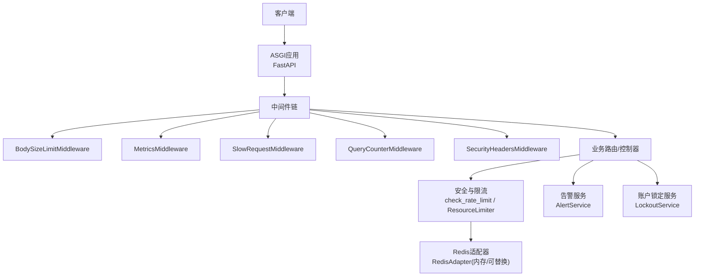
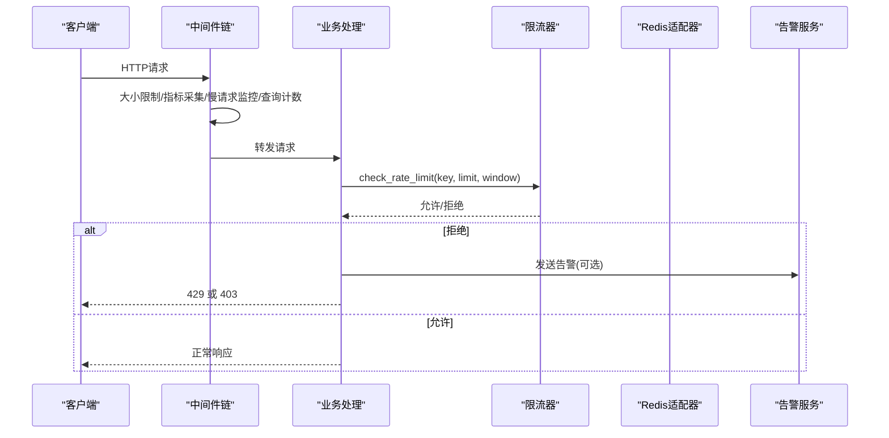
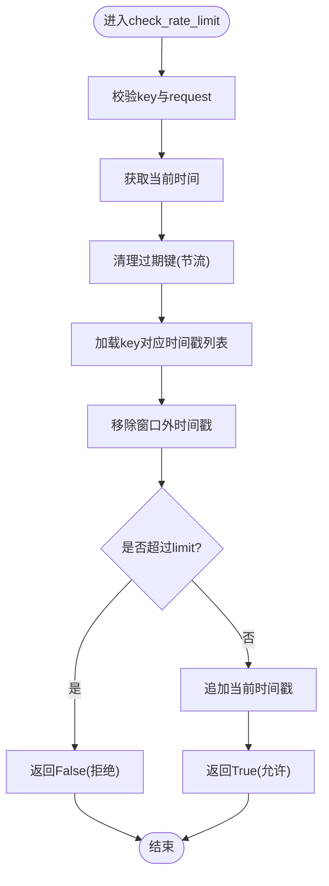
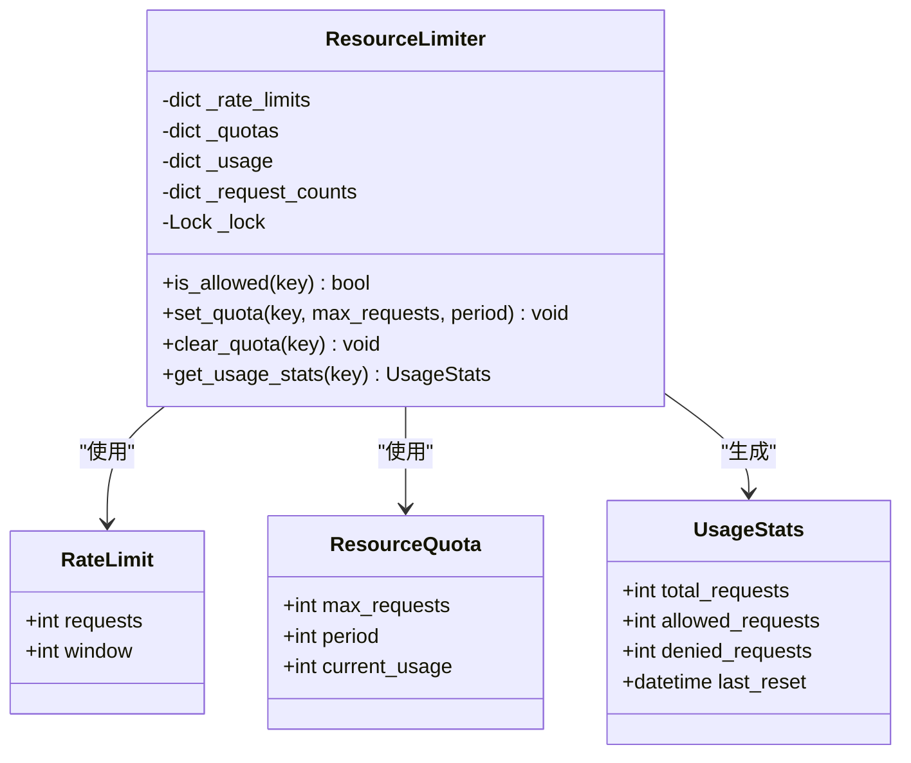
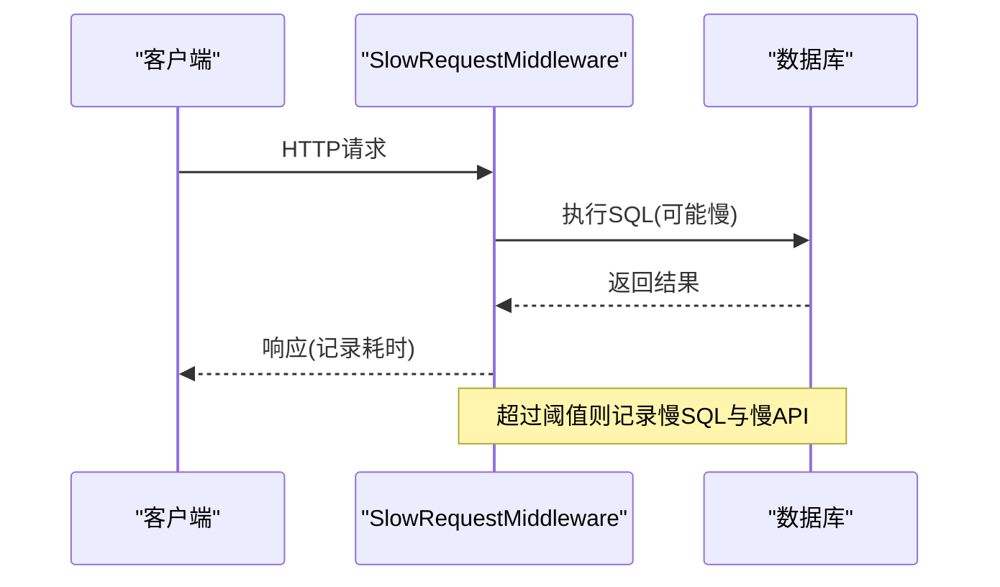
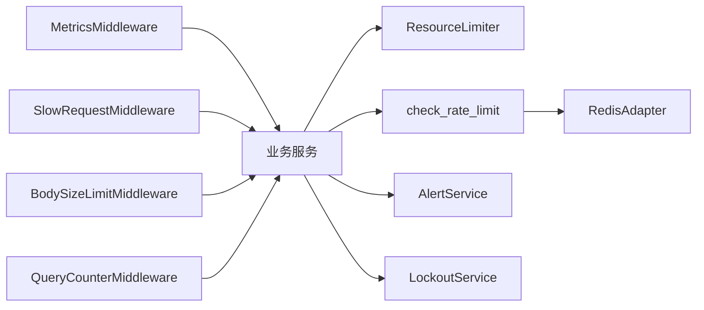

# API速率限制与DDoS防护

<cite>
**本文引用的文件**
- [security.py](file://backend/app/core/security.py)
- [resource_limiter.py](file://backend/app/services/resource_limiter.py)
- [slow_request_monitor.py](file://backend/app/middleware/slow_request_monitor.py)
- [metrics_middleware.py](file://backend/app/middleware/metrics_middleware.py)
- [body_size_limit.py](file://backend/app/middleware/body_size_limit.py)
- [query_counter.py](file://backend/app/middleware/query_counter.py)
- [redis_adapter.py](file://backend/app/core/redis_adapter.py)
- [alert_service.py](file://backend/app/services/alert_service.py)
- [lockout_service.py](file://backend/app/services/lockout_service.py)
- [安全加固.md](file://docs/03-开发文档/04-安全文档/安全加固.md)
</cite>

## 目录
1. [简介](#简介)
2. [项目结构](#项目结构)
3. [核心组件](#核心组件)
4. [架构总览](#架构总览)
5. [详细组件分析](#详细组件分析)
6. [依赖关系分析](#依赖关系分析)
7. [性能考量](#性能考量)
8. [故障排查指南](#故障排查指南)
9. [结论](#结论)
10. [附录：配置示例与差异化策略](#附录配置示例与差异化策略)

## 简介
本文件面向API速率限制与DDoS防护，结合仓库中现有实现，系统性说明：
- 速率限制算法：固定窗口、滑动窗口、令牌桶的适用场景与落地建议；当前代码已实现内存滑动窗口限流。
- 分布式限流策略：基于Redis计数器的思路与离线适配器的使用方式。
- DDoS防护机制：连接数限制、请求频率控制、恶意流量识别（设备指纹封禁等）。
- 慢请求监控：指标采集、异常检测、告警机制。
- 差异化限流策略：按端点、用户、IP维度的配置方法。
- 负载均衡与高可用下的限流方案：多实例共享状态与降级策略。
- 监控仪表板与故障排查：如何定位瓶颈与问题。

## 项目结构
与安全与限流相关的核心位置如下：
- 核心安全与限流：app/core/security.py（内置滑动窗口限流、客户端IP获取）、app/services/resource_limiter.py（进程内资源配额与限流服务）
- 中间件层：app/middleware/slow_request_monitor.py（慢请求/慢SQL记录）、app/middleware/metrics_middleware.py（指标采集）、app/middleware/body_size_limit.py（请求体大小限制）、app/middleware/query_counter.py（SQL查询计数）
- 分布式缓存适配：app/core/redis_adapter.py（离线内存适配器，便于扩展为真实Redis）
- 告警与服务：app/services/alert_service.py（邮件/Webhook告警）、app/services/lockout_service.py（账户锁定与失败计数）
- 设计参考：docs/03-开发文档/04-安全文档/安全加固.md（含Redis滑动窗口与渐进式惩罚的设计示例）

图表来源
- [security.py:414-488](file://backend/app/core/security.py#L414-L488)
- [resource_limiter.py:41-167](file://backend/app/services/resource_limiter.py#L41-L167)
- [slow_request_monitor.py:55-132](file://backend/app/middleware/slow_request_monitor.py#L55-L132)
- [metrics_middleware.py:132-177](file://backend/app/middleware/metrics_middleware.py#L132-L177)
- [body_size_limit.py:48-79](file://backend/app/middleware/body_size_limit.py#L48-L79)
- [query_counter.py:39-87](file://backend/app/middleware/query_counter.py#L39-L87)
- [redis_adapter.py:7-44](file://backend/app/core/redis_adapter.py#L7-L44)
- [alert_service.py:20-111](file://backend/app/services/alert_service.py#L20-L111)
- [lockout_service.py:25-106](file://backend/app/services/lockout_service.py#L25-L106)

章节来源
- [security.py:414-488](file://backend/app/core/security.py#L414-L488)
- [resource_limiter.py:41-167](file://backend/app/services/resource_limiter.py#L41-L167)
- [slow_request_monitor.py:55-132](file://backend/app/middleware/slow_request_monitor.py#L55-L132)
- [metrics_middleware.py:132-177](file://backend/app/middleware/metrics_middleware.py#L132-L177)
- [body_size_limit.py:48-79](file://backend/app/middleware/body_size_limit.py#L48-L79)
- [query_counter.py:39-87](file://backend/app/middleware/query_counter.py#L39-L87)
- [redis_adapter.py:7-44](file://backend/app/core/redis_adapter.py#L7-L44)
- [alert_service.py:20-111](file://backend/app/services/alert_service.py#L20-L111)
- [lockout_service.py:25-106](file://backend/app/services/lockout_service.py#L25-L106)

## 核心组件
- 内置滑动窗口限流器：提供线程安全的内存滑动窗口限流，支持key、limit、window参数，具备过期键清理与fail-closed安全约定。
- 资源配额与限流服务：以数据类描述RateLimit/ResourceQuota/UsageStats，提供进程内配额管理与统计。
- 慢请求与慢SQL监控：通过ASGI中间件与SQLAlchemy事件监听，记录慢请求与慢SQL并输出统计摘要。
- 指标采集中间件：收集请求计数、错误率、活跃请求、路径耗时TopN与慢请求列表。
- 请求体大小限制：对非multipart且非白名单路径的请求进行大小限制，防止超大JSON攻击。
- SQL查询计数：通过上下文变量桥接SQLAlchemy事件，统计每个请求的SQL数量并输出响应头。
- Redis适配器：提供离线内存适配器，便于在单机部署下运行，同时保留扩展至真实Redis的能力。
- 告警服务：支持邮件与Webhook告警，用于异常与阈值触发通知。
- 账户锁定服务：统一登录失败计数与锁定检查，避免重复逻辑与竞态条件。

章节来源
- [security.py:414-488](file://backend/app/core/security.py#L414-L488)
- [resource_limiter.py:41-167](file://backend/app/services/resource_limiter.py#L41-L167)
- [slow_request_monitor.py:55-132](file://backend/app/middleware/slow_request_monitor.py#L55-L132)
- [metrics_middleware.py:132-177](file://backend/app/middleware/metrics_middleware.py#L132-L177)
- [body_size_limit.py:48-79](file://backend/app/middleware/body_size_limit.py#L48-L79)
- [query_counter.py:39-87](file://backend/app/middleware/query_counter.py#L39-L87)
- [redis_adapter.py:7-44](file://backend/app/core/redis_adapter.py#L7-L44)
- [alert_service.py:20-111](file://backend/app/services/alert_service.py#L20-L111)
- [lockout_service.py:25-106](file://backend/app/services/lockout_service.py#L25-L106)

## 架构总览
系统采用多层中间件+服务的组合方式实现安全防护与限流：
- 入口层：请求进入ASGI应用后，依次经过大小限制、指标采集、慢请求监控、查询计数、安全头等中间件。
- 业务层：路由处理器调用安全与限流能力，依据key（如IP或用户ID）执行限流判断。
- 存储层：默认使用进程内内存数据结构；可通过Redis适配器切换为分布式存储，支撑多实例限流。
- 告警层：当触发阈值或异常时，通过告警服务发送邮件或Webhook通知。

图表来源
- [security.py:414-488](file://backend/app/core/security.py#L414-L488)
- [resource_limiter.py:41-167](file://backend/app/services/resource_limiter.py#L41-L167)
- [metrics_middleware.py:132-177](file://backend/app/middleware/metrics_middleware.py#L132-L177)
- [slow_request_monitor.py:55-132](file://backend/app/middleware/slow_request_monitor.py#L55-L132)
- [alert_service.py:20-111](file://backend/app/services/alert_service.py#L20-L111)

## 详细组件分析

### 内置滑动窗口限流器（内存）
- 算法要点：维护每个key的时间戳列表，每次请求前清理窗口外的时间戳，若窗口内请求数达到limit则拒绝。
- 安全约定：缺失key或request时抛出异常（fail-closed），避免静默放行。
- 性能特性：线程锁保护，周期性全局清理过期键，降低内存占用。
- 适用场景：单机或单进程部署；需要快速回退或无外部依赖时使用。

图表来源
- [security.py:414-488](file://backend/app/core/security.py#L414-L488)

章节来源
- [security.py:414-488](file://backend/app/core/security.py#L414-L488)

### 资源配额与限流服务（进程内）
- 数据结构：RateLimit（requests/window）、ResourceQuota（max_requests/period/current_usage）、UsageStats（total/allowed/denied/last_reset）。
- 功能：设置配额、检查是否允许、更新使用统计、清除配额。
- 并发：内部使用线程锁保证一致性。
- 用途：作为更细粒度的配额管理工具，可与业务模块结合实现不同维度限制。

图表来源
- [resource_limiter.py:14-167](file://backend/app/services/resource_limiter.py#L14-L167)

章节来源
- [resource_limiter.py:14-167](file://backend/app/services/resource_limiter.py#L14-L167)

### 慢请求监控系统
- 慢API监控：ASGI中间件记录超过阈值的API请求，包含方法、路径、状态码、耗时。
- 慢SQL监控：通过SQLAlchemy before/after cursor事件捕获慢查询，记录SQL片段与参数摘要。
- 统计接口：提供最近慢记录与聚合统计（平均值、峰值等）。
- 性能影响：环形缓冲区限制最大记录数，避免无限增长。

图表来源
- [slow_request_monitor.py:55-132](file://backend/app/middleware/slow_request_monitor.py#L55-L132)

章节来源
- [slow_request_monitor.py:55-132](file://backend/app/middleware/slow_request_monitor.py#L55-L132)

### 指标采集中间件
- 采集内容：请求计数、错误计数、活跃请求、平均耗时、Top端点、慢请求列表。
- 跳过路径：健康检查、指标端点、静态资源等。
- 线程安全：内部使用锁保护指标存储。
- 用途：为监控仪表板提供实时指标。

章节来源
- [metrics_middleware.py:132-177](file://backend/app/middleware/metrics_middleware.py#L132-L177)

### 请求体大小限制
- 策略：对非multipart且不在白名单路径的请求，若Content-Length超过阈值则拒绝（413）。
- 白名单：导入导出、批量操作、备份恢复等可能接收大体积数据的端点。
- 目的：防御超大JSON/恶意上传导致的资源耗尽。

章节来源
- [body_size_limit.py:48-79](file://backend/app/middleware/body_size_limit.py#L48-L79)

### SQL查询计数
- 机制：通过contextvar将SQLAlchemy事件计数与请求上下文关联，最终写入响应头X-Query-Count。
- 告警：超过阈值时记录警告日志，帮助发现N+1问题。
- 兼容：提供increment_query_count接口供旧调用方使用。

章节来源
- [query_counter.py:39-87](file://backend/app/middleware/query_counter.py#L39-L87)

### 分布式限流（Redis）
- 现状：提供Redis适配器（内存实现），可在单机部署下运行；可替换为真实Redis以支持多实例共享状态。
- 设计参考：安全文档中包含Redis滑动窗口与渐进式惩罚的实现思路，可作为升级方向。
- 建议：在高可用/负载均衡环境下，将限流键（如IP、用户ID）持久化到Redis，确保跨实例一致。

章节来源
- [redis_adapter.py:7-44](file://backend/app/core/redis_adapter.py#L7-L44)
- [安全加固.md:563-642](file://docs/03-开发文档/04-安全文档/安全加固.md#L563-L642)

### DDoS防护机制
- 连接数限制：通过指标中间件的活跃请求计数与慢请求监控，结合告警服务进行阈值告警。
- 请求频率控制：内置滑动窗口限流与资源配额服务，可按IP/用户/端点维度限制。
- 恶意流量识别：设备指纹封禁（测试覆盖显示被封禁设备返回403），结合请求体大小限制与慢请求监控识别异常模式。
- 账户锁定：登录失败次数递增与自动解锁，防止暴力破解。

章节来源
- [metrics_middleware.py:132-177](file://backend/app/middleware/metrics_middleware.py#L132-L177)
- [security.py:414-488](file://backend/app/core/security.py#L414-L488)
- [resource_limiter.py:41-167](file://backend/app/services/resource_limiter.py#L41-L167)
- [alert_service.py:20-111](file://backend/app/services/alert_service.py#L20-L111)
- [lockout_service.py:25-106](file://backend/app/services/lockout_service.py#L25-L106)

## 依赖关系分析
- 中间件依赖：MetricsMiddleware、SlowRequestMiddleware、BodySizeLimitMiddleware、QueryCounterMiddleware均围绕ASGI请求生命周期工作，彼此独立但共同构成防护链。
- 限流器依赖：check_rate_limit依赖线程锁与内存存储；ResourceLimiter提供进程内配额管理；Redis适配器可扩展为分布式存储。
- 告警依赖：AlertService依赖SMTP或HTTP Webhook，用于阈值触发后的通知。
- 锁定服务依赖：LockoutService使用数据库原子递增与事务提交，确保锁定状态一致性。

图表来源
- [metrics_middleware.py:132-177](file://backend/app/middleware/metrics_middleware.py#L132-L177)
- [slow_request_monitor.py:55-132](file://backend/app/middleware/slow_request_monitor.py#L55-L132)
- [body_size_limit.py:48-79](file://backend/app/middleware/body_size_limit.py#L48-L79)
- [query_counter.py:39-87](file://backend/app/middleware/query_counter.py#L39-L87)
- [resource_limiter.py:41-167](file://backend/app/services/resource_limiter.py#L41-L167)
- [security.py:414-488](file://backend/app/core/security.py#L414-L488)
- [redis_adapter.py:7-44](file://backend/app/core/redis_adapter.py#L7-L44)
- [alert_service.py:20-111](file://backend/app/services/alert_service.py#L20-L111)
- [lockout_service.py:25-106](file://backend/app/services/lockout_service.py#L25-L106)

章节来源
- [metrics_middleware.py:132-177](file://backend/app/middleware/metrics_middleware.py#L132-L177)
- [slow_request_monitor.py:55-132](file://backend/app/middleware/slow_request_monitor.py#L55-L132)
- [body_size_limit.py:48-79](file://backend/app/middleware/body_size_limit.py#L48-L79)
- [query_counter.py:39-87](file://backend/app/middleware/query_counter.py#L39-L87)
- [resource_limiter.py:41-167](file://backend/app/services/resource_limiter.py#L41-L167)
- [security.py:414-488](file://backend/app/core/security.py#L414-L488)
- [redis_adapter.py:7-44](file://backend/app/core/redis_adapter.py#L7-L44)
- [alert_service.py:20-111](file://backend/app/services/alert_service.py#L20-L111)
- [lockout_service.py:25-106](file://backend/app/services/lockout_service.py#L25-L106)

## 性能考量
- 内存占用：内置限流器定期清理过期键，慢请求与慢SQL使用环形缓冲区限制最大记录数，避免内存泄漏。
- 并发安全：关键路径使用线程锁保护，避免竞态条件。
- I/O开销：指标采集与日志记录尽量轻量，跳过健康检查与指标端点以减少干扰。
- 可扩展性：Redis适配器支持替换为真实Redis，便于横向扩展与多实例共享状态。
- 建议：在高负载场景下，优先启用指标与慢请求监控，结合告警服务动态调整限流阈值。

[本节为通用指导，不直接分析具体文件]

## 故障排查指南
- 限流误判：检查key是否正确（如IP或用户ID），确认request是否传入；查看check_rate_limit的异常抛出逻辑。
- 慢请求过多：通过慢请求监控与指标中间件定位Top端点与慢SQL，优化查询或增加索引。
- 请求体过大：检查BodySizeLimitMiddleware的白名单路径与阈值设置，必要时调整策略。
- 告警未送达：确认AlertService的SMTP或Webhook配置完整，查看日志中的错误信息。
- 账户锁定：检查LockoutService的失败计数与解锁逻辑，确认数据库事务提交成功。

章节来源
- [security.py:414-488](file://backend/app/core/security.py#L414-L488)
- [slow_request_monitor.py:55-132](file://backend/app/middleware/slow_request_monitor.py#L55-L132)
- [metrics_middleware.py:132-177](file://backend/app/middleware/metrics_middleware.py#L132-L177)
- [body_size_limit.py:48-79](file://backend/app/middleware/body_size_limit.py#L48-L79)
- [alert_service.py:20-111](file://backend/app/services/alert_service.py#L20-L111)
- [lockout_service.py:25-106](file://backend/app/services/lockout_service.py#L25-L106)

## 结论
本项目已实现基于内存的滑动窗口限流、慢请求监控、指标采集、请求体大小限制与SQL查询计数等核心能力，并通过Redis适配器预留分布式扩展空间。结合告警服务与账户锁定机制，形成较为完整的API速率限制与DDoS防护体系。建议在多实例部署中逐步迁移至Redis-based限流，并结合监控仪表板与告警策略实现动态调优。

[本节为总结，不直接分析具体文件]

## 附录：配置示例与差异化策略
- 固定窗口：适用于简单场景，如每分钟固定次数限制；可通过ResourceLimiter设置period与max_requests实现。
- 滑动窗口：当前内置实现，适合精确控制瞬时流量；可通过check_rate_limit的window与limit参数调整。
- 令牌桶：适合平滑突发流量；可在Redis适配器基础上实现，参考安全文档中的滑动窗口与渐进式惩罚设计。
- 差异化策略：
  - 按端点：对不同API设置不同limit与window（如登录接口更严格）。
  - 按用户：以用户ID为key，结合权限包或服务层逻辑实现分级限流。
  - 按IP：以客户端IP为key，结合代理头信任策略（TRUST_PROXY_HEADERS）获取真实IP。
- 负载均衡与高可用：
  - 多实例共享状态：使用Redis适配器替代内存存储，确保限流一致性。
  - 降级策略：当Redis不可用时，回退到内存限流或放宽限制，保障可用性。
  - 监控与告警：结合指标中间件与告警服务，实时监控QPS、错误率与慢请求。

章节来源
- [security.py:414-488](file://backend/app/core/security.py#L414-L488)
- [resource_limiter.py:41-167](file://backend/app/services/resource_limiter.py#L41-L167)
- [redis_adapter.py:7-44](file://backend/app/core/redis_adapter.py#L7-L44)
- [安全加固.md:563-642](file://docs/03-开发文档/04-安全文档/安全加固.md#L563-L642)