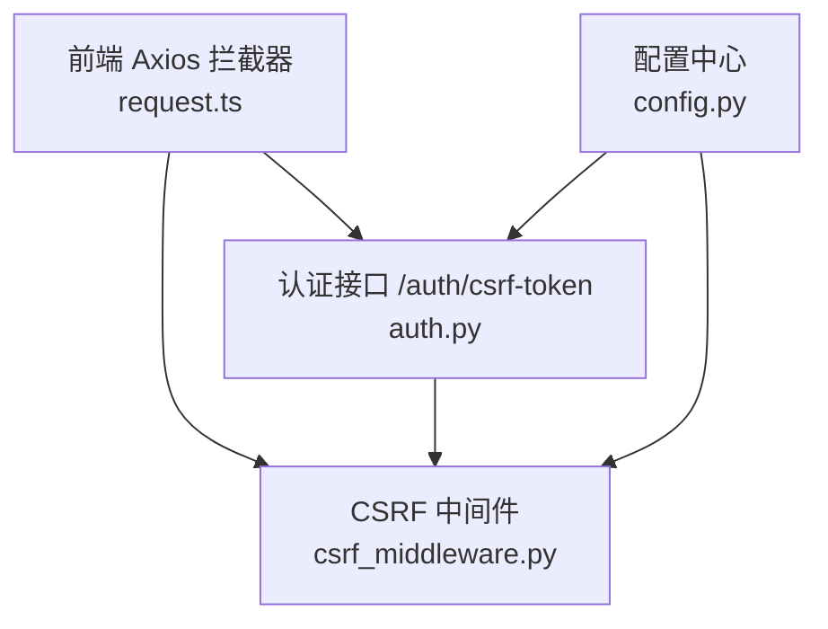
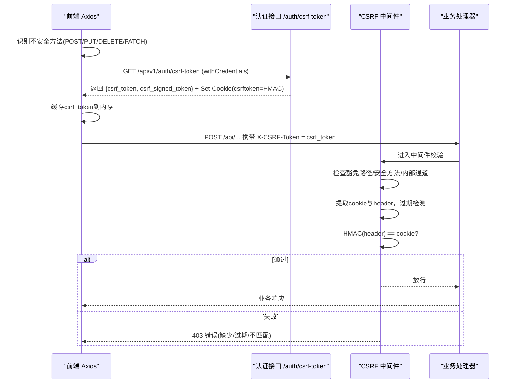
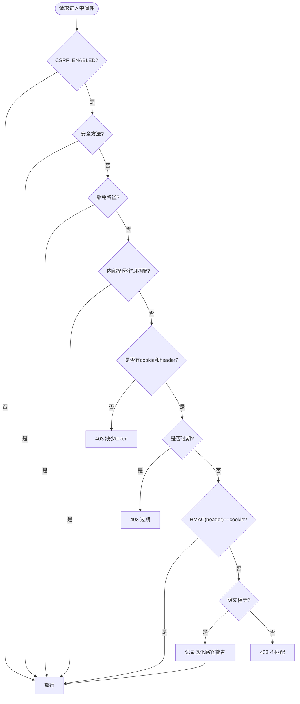
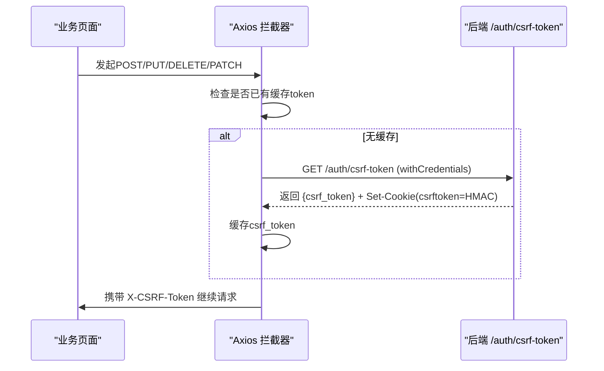
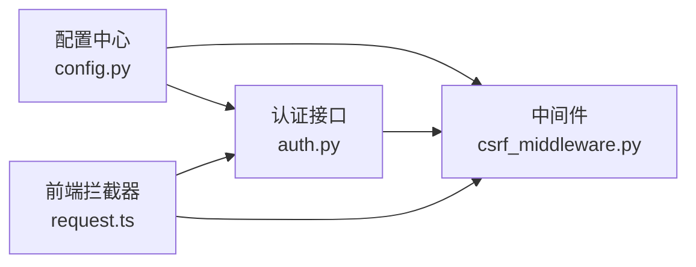

# CSRF跨站请求伪造防护

<cite>
**本文引用的文件**
- [backend/app/middleware/csrf_middleware.py](file://backend/app/middleware/csrf_middleware.py)
- [backend/app/api/v1/auth/auth.py](file://backend/app/api/v1/auth/auth.py)
- [backend/app/core/config.py](file://backend/app/core/config.py)
- [frontend/src/api/request.ts](file://frontend/src/api/request.ts)
- [backend/tests/unit/test_csrf_hmac_upgrade.py](file://backend/tests/unit/test_csrf_hmac_upgrade.py)
- [backend/tests/unit/test_middleware_ALL.py](file://backend/tests/unit/test_middleware_ALL.py)
- [backend/tests/unit/test_cov_final_csrf_middleware.py](file://backend/tests/unit/test_cov_final_csrf_middleware.py)
- [frontend/tests/unit/api/request.test.ts](file://frontend/tests/unit/api/request.test.ts)
- [frontend/tests/unit/api/requestNonTestEnv.test.ts](file://frontend/tests/unit/api/requestNonTestEnv.test.ts)
- [frontend/tests/unit/api/requestErrorHandling.test.ts](file://frontend/tests/unit/api/requestErrorHandling.test.ts)
</cite>

## 目录
1. [简介](#简介)
2. [项目结构](#项目结构)
3. [核心组件](#核心组件)
4. [架构总览](#架构总览)
5. [详细组件分析](#详细组件分析)
6. [依赖关系分析](#依赖关系分析)
7. [性能与安全考量](#性能与安全考量)
8. [故障排查指南](#故障排查指南)
9. [结论](#结论)
10. [附录：测试与调试](#附录测试与调试)

## 简介
本安全文档聚焦于CSRF（跨站请求伪造）防护，结合本仓库实现，系统性说明攻击原理、令牌机制、中间件校验流程、前端集成方案以及多场景策略。该实现采用“Double Submit Cookie + HMAC签名”的增强模式：服务端下发原始token与HMAC签名后的cookie，前端在后续写操作中将原始token放入请求头，服务端通过HMAC(header) == cookie进行常量时间比较验证，并支持旧版明文回退兼容与过期检测。

## 项目结构
与CSRF相关的关键位置如下：
- 后端中间件：负责拦截状态变更请求、校验CSRF token、返回统一错误响应
- 认证API：提供获取CSRF token的端点，设置带签名的Cookie
- 配置中心：集中管理CSRF开关、CORS允许头、密钥等
- 前端请求层：Axios拦截器自动注入X-CSRF-Token，懒加载获取token
- 测试用例：覆盖HMAC校验、过期处理、豁免路径、前端懒加载与并发去重等

**图表来源**
- [backend/app/middleware/csrf_middleware.py:177-284](file://backend/app/middleware/csrf_middleware.py#L177-L284)
- [backend/app/api/v1/auth/auth.py:692-747](file://backend/app/api/v1/auth/auth.py#L692-L747)
- [backend/app/core/config.py:146-154](file://backend/app/core/config.py#L146-L154)
- [frontend/src/api/request.ts:103-189](file://frontend/src/api/request.ts#L103-L189)

**章节来源**
- [backend/app/middleware/csrf_middleware.py:1-284](file://backend/app/middleware/csrf_middleware.py#L1-L284)
- [backend/app/api/v1/auth/auth.py:692-747](file://backend/app/api/v1/auth/auth.py#L692-L747)
- [backend/app/core/config.py:146-154](file://backend/app/core/config.py#L146-L154)
- [frontend/src/api/request.ts:103-189](file://frontend/src/api/request.ts#L103-L189)

## 核心组件
- CSRF中间件：实现请求拦截、豁免路径判断、过期检测、HMAC签名校验与明文回退兼容、异常响应
- 认证接口：生成原始token与签名版本，设置Cookie，限频保护
- 配置项：CSRF开关、CORS允许头包含X-CSRF-Token、密钥管理
- 前端拦截器：识别不安全方法，懒加载获取token，自动注入请求头，并发去重

**章节来源**
- [backend/app/middleware/csrf_middleware.py:65-132](file://backend/app/middleware/csrf_middleware.py#L65-L132)
- [backend/app/api/v1/auth/auth.py:692-747](file://backend/app/api/v1/auth/auth.py#L692-L747)
- [backend/app/core/config.py:146-154](file://backend/app/core/config.py#L146-L154)
- [frontend/src/api/request.ts:103-189](file://frontend/src/api/request.ts#L103-L189)

## 架构总览
CSRF防护的整体调用链如下：
- 前端发起POST/PUT/DELETE/PATCH时，Axios拦截器确保已获取CSRF token，并将其写入X-CSRF-Token请求头
- 后端中间件对非安全方法进行校验：检查是否豁免路径、是否携带token、是否过期、HMAC签名是否匹配
- 若校验失败，返回403；否则放行至业务处理器

**图表来源**
- [frontend/src/api/request.ts:103-189](file://frontend/src/api/request.ts#L103-L189)
- [backend/app/api/v1/auth/auth.py:692-747](file://backend/app/api/v1/auth/auth.py#L692-L747)
- [backend/app/middleware/csrf_middleware.py:177-284](file://backend/app/middleware/csrf_middleware.py#L177-L284)

## 详细组件分析

### 后端中间件：CSRFMiddleware
- 职责：拦截状态变更请求，执行CSRF校验，返回统一JSON错误
- 关键逻辑：
  - 安全方法（GET/HEAD/OPTIONS）直接放行
  - 豁免路径（如登录、健康检查、文档等）直接放行
  - 本机内部通道（X-Internal-Backup）可绕过CSRF校验
  - 缺失token或过期：返回403
  - 新流程：HMAC(header) == cookie（常量时间比较）
  - 旧流程兼容：明文相等则放行但记录警告日志
- 工具函数：
  - generate_csrf_token：生成{timestamp}.{random_hex}格式token
  - sign_csrf_token：使用HMAC-SHA256对原始token签名
  - _extract_timestamp/_token_expired：基于时间戳窗口判定过期
  - _is_path_exempt：路径前缀匹配豁免
  - get_client_ip：可信代理透传真实客户端IP

**图表来源**
- [backend/app/middleware/csrf_middleware.py:177-284](file://backend/app/middleware/csrf_middleware.py#L177-L284)

**章节来源**
- [backend/app/middleware/csrf_middleware.py:65-132](file://backend/app/middleware/csrf_middleware.py#L65-L132)
- [backend/app/middleware/csrf_middleware.py:177-284](file://backend/app/middleware/csrf_middleware.py#L177-L284)

### 认证接口：获取CSRF Token
- 端点：GET /api/v1/auth/csrf-token
- 行为：
  - 基于客户端IP进行速率限制（防止滥用）
  - 生成原始token与HMAC签名版本
  - 设置csrftoken Cookie为签名值（httponly=False以便前端读取），max_age为有效期
  - 响应体返回原始token与签名token
- 注意：CORS允许头包含X-CSRF-Token，确保跨域时可携带

**章节来源**
- [backend/app/api/v1/auth/auth.py:692-747](file://backend/app/api/v1/auth/auth.py#L692-L747)
- [backend/app/core/config.py:146-154](file://backend/app/core/config.py#L146-L154)

### 前端集成：Axios拦截器与Token管理
- 策略：
  - 仅对不安全方法（POST/PUT/DELETE/PATCH）注入X-CSRF-Token
  - 优先从Cookie读取csrftoken；若无则懒加载调用/auth/csrf-token获取
  - 并发去重：同一时刻仅发起一次网络请求获取token
  - 测试环境跳过自动获取，避免单测触发真实网络
- 实现要点：
  - 定义CSRF Cookie名、Header名、端点
  - 解析document.cookie获取token
  - 使用axios.get withCredentials=true获取token并缓存
  - 在请求拦截器中注入X-CSRF-Token

**图表来源**
- [frontend/src/api/request.ts:103-189](file://frontend/src/api/request.ts#L103-L189)
- [frontend/src/api/request.ts:165-204](file://frontend/src/api/request.ts#L165-L204)

**章节来源**
- [frontend/src/api/request.ts:103-189](file://frontend/src/api/request.ts#L103-L189)
- [frontend/src/api/request.ts:165-204](file://frontend/src/api/request.ts#L165-L204)

### 令牌生成、验证与刷新策略
- 生成：generate_csrf_token() 输出{timestamp}.{random_hex}，随机部分足够长度保证唯一性
- 签名：sign_csrf_token(token, secret_key) 使用HMAC-SHA256，密钥来自配置或回退到全局SECRET_KEY
- 验证：
  - 新流程：HMAC(header_value) == cookie_value（常量时间比较）
  - 旧流程：明文相等则放行但记录警告日志
- 过期：_token_expired(token) 基于内嵌时间戳与CSRF_TOKEN_EXPIRY窗口判定
- 刷新：前端懒加载获取，首次缺失时调用/auth/csrf-token；服务端对频繁请求限流

**章节来源**
- [backend/app/middleware/csrf_middleware.py:65-124](file://backend/app/middleware/csrf_middleware.py#L65-L124)
- [backend/app/api/v1/auth/auth.py:706-747](file://backend/app/api/v1/auth/auth.py#L706-L747)

### 中间件层的请求拦截、令牌校验与异常处理
- 请求拦截：
  - 安全方法直接放行
  - 豁免路径直接放行
  - 内部备份通道可绕过CSRF校验
- 令牌校验：
  - 缺失token：记录警告并返回403
  - 过期token：记录警告并返回403
  - HMAC不匹配：记录警告并返回403
- 异常处理：
  - 统一JSONResponse格式，包含code/message/data字段
  - 日志记录包含method/path/ip等信息便于审计

**章节来源**
- [backend/app/middleware/csrf_middleware.py:177-284](file://backend/app/middleware/csrf_middleware.py#L177-L284)

### 不同场景下的防护策略
- 单页应用(SPA)：
  - 使用Axios拦截器自动注入X-CSRF-Token
  - 懒加载获取token，避免首屏阻塞
  - 并发去重减少网络开销
- 传统表单提交：
  - 需在表单隐藏字段中携带原始token
  - 或在提交时动态设置X-CSRF-Token请求头
- 文件上传：
  - 同样视为状态变更，需携带有效CSRF token
  - 注意multipart/form-data下token传递方式
- 移动端与第三方集成：
  - 移动端WebView需允许Cookie与跨域凭据
  - 第三方系统调用需配置白名单并携带正确token
  - 考虑使用服务间密钥或内部通道（如X-Internal-Backup）

[本节为概念性说明，不直接引用具体代码]

## 依赖关系分析
- 中间件依赖配置中心获取CSRF开关与密钥
- 认证接口依赖中间件的token生成与签名函数
- 前端依赖后端提供的CSRF token端点与Cookie设置
- 测试用例覆盖HMAC校验、过期处理、豁免路径、前端懒加载等行为

**图表来源**
- [backend/app/core/config.py:146-154](file://backend/app/core/config.py#L146-L154)
- [backend/app/middleware/csrf_middleware.py:177-284](file://backend/app/middleware/csrf_middleware.py#L177-L284)
- [backend/app/api/v1/auth/auth.py:692-747](file://backend/app/api/v1/auth/auth.py#L692-L747)
- [frontend/src/api/request.ts:103-189](file://frontend/src/api/request.ts#L103-L189)

**章节来源**
- [backend/app/core/config.py:146-154](file://backend/app/core/config.py#L146-L154)
- [backend/app/middleware/csrf_middleware.py:177-284](file://backend/app/middleware/csrf_middleware.py#L177-L284)
- [backend/app/api/v1/auth/auth.py:692-747](file://backend/app/api/v1/auth/auth.py#L692-L747)
- [frontend/src/api/request.ts:103-189](file://frontend/src/api/request.ts#L103-L189)

## 性能与安全考量
- 性能：
  - 前端懒加载与并发去重减少不必要的网络请求
  - 常量时间比较避免时序攻击
  - 豁免路径减少无效校验
- 安全：
  - HMAC签名防止token篡改
  - 过期检测限制token生命周期
  - 速率限制防止CSRF token端点滥用
  - 内部通道密钥隔离敏感操作
  - 生产环境强制关闭SQL echo与敏感日志泄露

[本节为通用指导，不直接引用具体代码]

## 故障排查指南
- 常见问题：
  - 403缺少token：检查前端是否正确调用/auth/csrf-token并设置Cookie
  - 403过期：检查token时间戳是否在有效期内
  - 403不匹配：确认HMAC签名一致性与密钥配置
  - 跨域问题：确保CORS允许头包含X-CSRF-Token
- 调试技巧：
  - 查看后端日志中的CSRF警告信息
  - 使用浏览器开发者工具检查Cookie与请求头
  - 运行单元测试验证HMAC校验与过期处理

**章节来源**
- [backend/app/middleware/csrf_middleware.py:211-284](file://backend/app/middleware/csrf_middleware.py#L211-L284)
- [backend/tests/unit/test_csrf_hmac_upgrade.py:146-198](file://backend/tests/unit/test_csrf_hmac_upgrade.py#L146-L198)
- [frontend/tests/unit/api/request.test.ts:1043-1100](file://frontend/tests/unit/api/request.test.ts#L1043-L1100)

## 结论
本系统实现了基于Double Submit Cookie与HMAC签名的CSRF防护，具备过期检测、豁免路径、内部通道绕过、速率限制等能力。前端通过Axios拦截器自动注入token，简化集成复杂度。测试覆盖全面，确保功能稳定可靠。建议在生产环境保持CSRF启用，并定期审计密钥与配置。

[本节为总结性内容，不直接引用具体代码]

## 附录：测试与调试
- 后端测试：
  - HMAC校验通过/失败场景
  - 过期token拒绝
  - 明文回退兼容
  - 豁免路径验证
- 前端测试：
  - 懒加载获取token
  - 并发去重
  - Cookie读取与注入
  - 测试环境跳过网络请求

**章节来源**
- [backend/tests/unit/test_csrf_hmac_upgrade.py:146-198](file://backend/tests/unit/test_csrf_hmac_upgrade.py#L146-L198)
- [backend/tests/unit/test_middleware_ALL.py:408-443](file://backend/tests/unit/test_middleware_ALL.py#L408-L443)
- [backend/tests/unit/test_cov_final_csrf_middleware.py:11-48](file://backend/tests/unit/test_cov_final_csrf_middleware.py#L11-L48)
- [frontend/tests/unit/api/request.test.ts:1043-1100](file://frontend/tests/unit/api/request.test.ts#L1043-L1100)
- [frontend/tests/unit/api/requestNonTestEnv.test.ts:121-149](file://frontend/tests/unit/api/requestNonTestEnv.test.ts#L121-L149)
- [frontend/tests/unit/api/requestErrorHandling.test.ts:138-150](file://frontend/tests/unit/api/requestErrorHandling.test.ts#L138-L150)