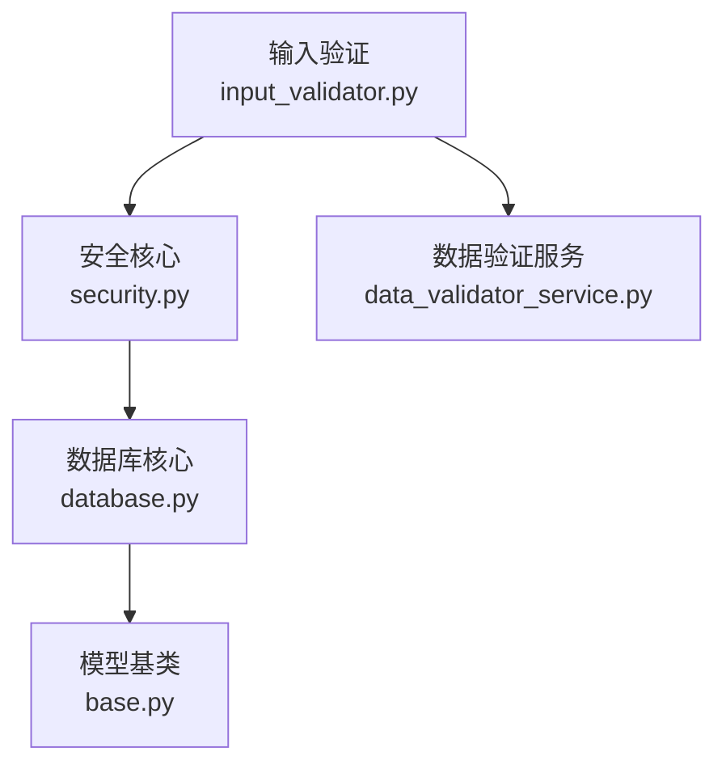
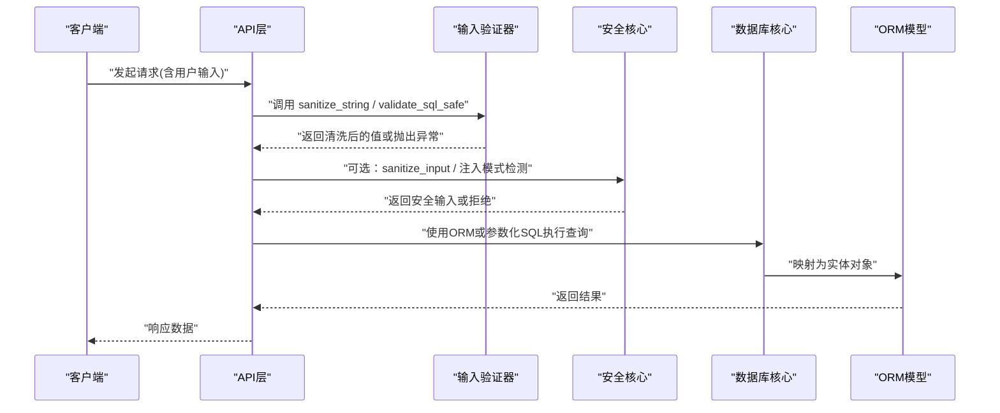
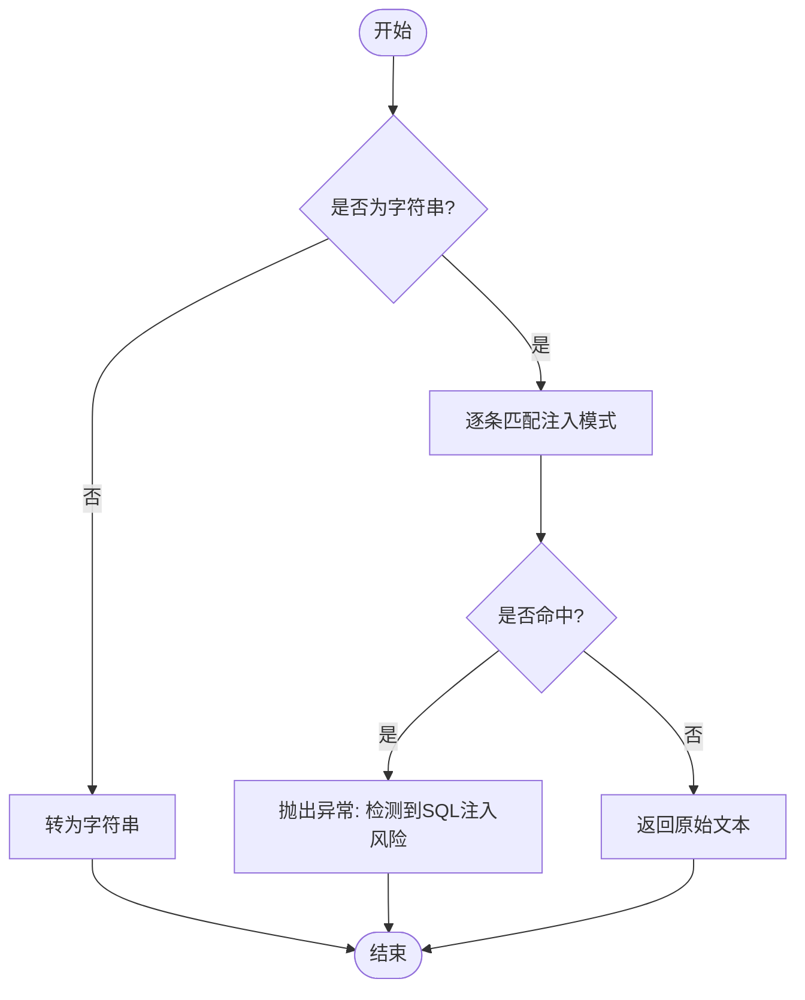
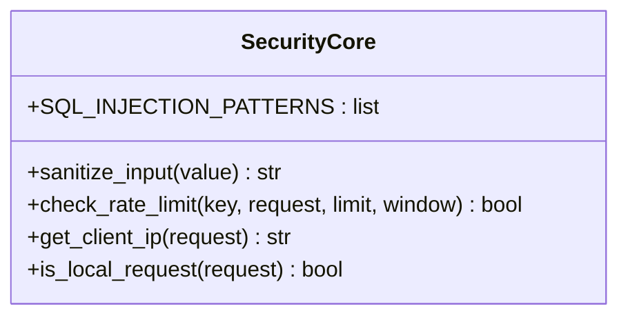
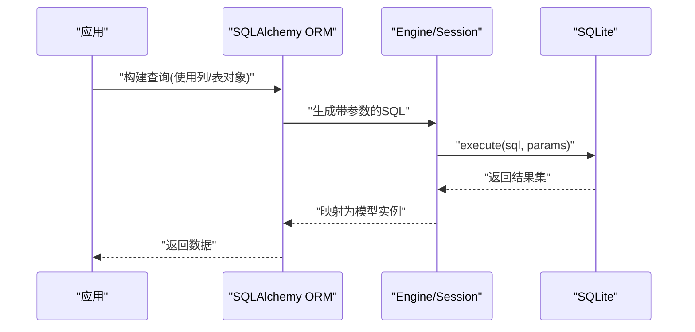
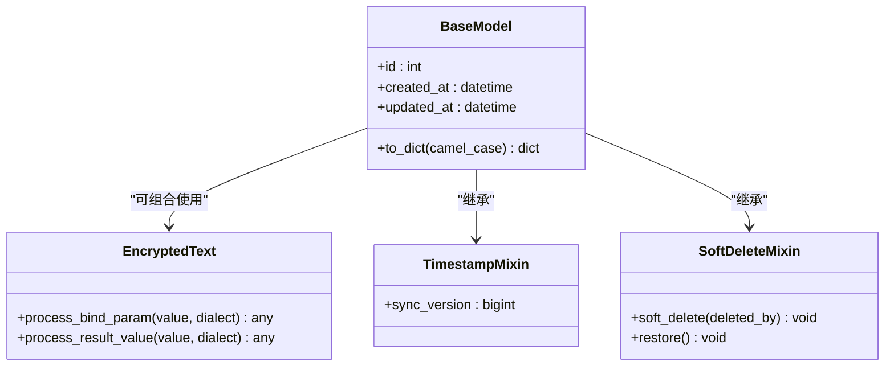
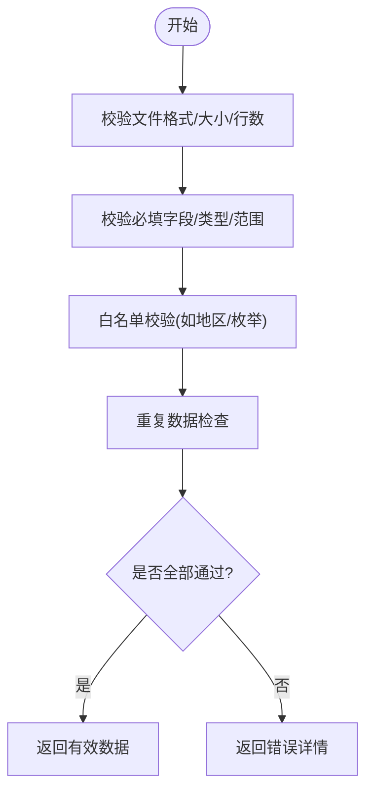
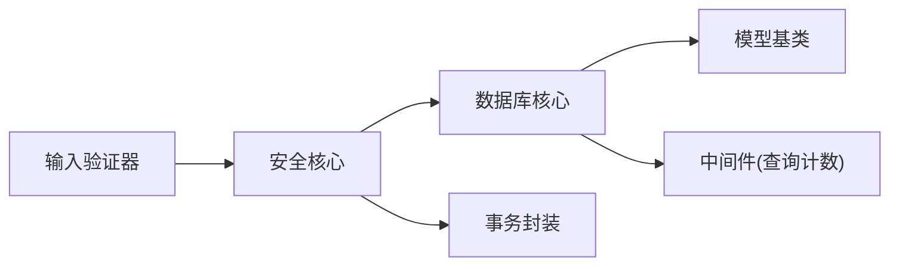

# SQL注入防护

<cite>
**本文引用的文件**
- [input_validator.py](file://backend/app/utils/input_validator.py)
- [security.py](file://backend/app/core/security.py)
- [database.py](file://backend/app/core/database.py)
- [base.py](file://backend/app/models/base.py)
- [data_validator_service.py](file://backend/app/services/data_validator_service.py)
</cite>

## 目录
1. [简介](#简介)
2. [项目结构](#项目结构)
3. [核心组件](#核心组件)
4. [架构总览](#架构总览)
5. [详细组件分析](#详细组件分析)
6. [依赖关系分析](#依赖关系分析)
7. [性能考虑](#性能考虑)
8. [故障排查指南](#故障排查指南)
9. [结论](#结论)
10. [附录](#附录)

## 简介
本技术文档聚焦于SQL注入防护，围绕参数化查询、输入验证与白名单机制展开，结合项目在SQLAlchemy ORM与原生SQL中的实践，系统阐述如何从“输入校验—构建查询—执行层”全链路阻断注入风险。文档同时给出典型场景（搜索、动态排序、条件过滤）的安全实现思路、测试要点与最佳实践。

## 项目结构
与安全相关的关键位置：
- 输入验证工具：提供XSS与SQL注入模式检测、格式校验等能力
- 安全核心模块：集中了SQL注入检测模式、输入清理、速率限制、审计日志等
- 数据库核心：ORM引擎配置、SQLite PRAGMA调优、连接事件钩子
- 模型基类：声明式基类、加密字段类型、软删除与版本混入
- 数据验证服务：面向导入/业务数据的结构化校验与清洗

**图表来源**
- [input_validator.py:12-71](file://backend/app/utils/input_validator.py#L12-L71)
- [security.py:379-411](file://backend/app/core/security.py#L379-L411)
- [database.py:70-157](file://backend/app/core/database.py#L70-L157)
- [base.py:23-45](file://backend/app/models/base.py#L23-L45)
- [data_validator_service.py:86-163](file://backend/app/services/data_validator_service.py#L86-L163)

**章节来源**
- [input_validator.py:12-71](file://backend/app/utils/input_validator.py#L12-L71)
- [security.py:379-411](file://backend/app/core/security.py#L379-L411)
- [database.py:70-157](file://backend/app/core/database.py#L70-L157)
- [base.py:23-45](file://backend/app/models/base.py#L23-L45)
- [data_validator_service.py:86-163](file://backend/app/services/data_validator_service.py#L86-L163)

## 核心组件
- 输入验证器：提供字符串清理、SQL注入模式匹配、邮箱/电话/身份证等格式校验
- 安全核心：集中SQL注入检测正则、输入清理函数、敏感信息脱敏、速率限制与审计
- 数据库核心：ORM引擎与Session管理、SQLite PRAGMA优化、连接事件监听
- 模型基类：声明式Base、加密文本类型（PII透明加解密）、时间戳与软删除混入
- 数据验证服务：批量数据校验、重复检查、字段类型转换与范围约束

**章节来源**
- [input_validator.py:12-124](file://backend/app/utils/input_validator.py#L12-L124)
- [security.py:379-411](file://backend/app/core/security.py#L379-L411)
- [database.py:70-157](file://backend/app/core/database.py#L70-L157)
- [base.py:23-45](file://backend/app/models/base.py#L23-L45)
- [data_validator_service.py:86-163](file://backend/app/services/data_validator_service.py#L86-L163)

## 架构总览
下图展示请求进入后，输入验证与安全核心如何协同，最终通过ORM或参数化SQL访问数据库的完整流程。

**图表来源**
- [input_validator.py:31-71](file://backend/app/utils/input_validator.py#L31-L71)
- [security.py:379-411](file://backend/app/core/security.py#L379-L411)
- [database.py:174-186](file://backend/app/core/database.py#L174-L186)
- [base.py:19-20](file://backend/app/models/base.py#L19-L20)

## 详细组件分析

### 输入验证器（SQL注入检测算法）
- 关键字过滤：基于正则匹配常见SQL关键字组合（如UNION SELECT、DROP TABLE等），大小写不敏感
- 语法片段检测：识别注释符、块注释、危险语句片段
- 逻辑注入特征：识别OR/AND注入常用模式
- 输出策略：命中任一规则即拒绝并返回错误；未命中则放行

**图表来源**
- [input_validator.py:24-71](file://backend/app/utils/input_validator.py#L24-L71)

**章节来源**
- [input_validator.py:24-71](file://backend/app/utils/input_validator.py#L24-L71)

### 安全核心（SQL注入检测与输入清理）
- 注入检测模式：覆盖UNION SELECT、DROP/ALTER TABLE、INSERT INTO、DELETE FROM、UPDATE SET、EXEC/EXECUTE、注释与尾部分号等
- 输入清理：移除分号、注释、单引号转义等危险字符
- 附加能力：敏感字段脱敏、速率限制、审计日志记录

**图表来源**
- [security.py:379-411](file://backend/app/core/security.py#L379-L411)
- [security.py:439-516](file://backend/app/core/security.py#L439-L516)

**章节来源**
- [security.py:379-411](file://backend/app/core/security.py#L379-L411)
- [security.py:439-516](file://backend/app/core/security.py#L439-L516)

### 数据库核心（参数化查询与ORM防注入）
- ORM防注入：通过SQLAlchemy的声明式模型与查询构造器，所有用户输入以绑定参数形式传入，避免拼接SQL
- 原生SQL参数化：当必须使用原生SQL时，应使用参数占位符与execute的参数列表，禁止字符串拼接
- SQLite PRAGMA：启用WAL、外键约束、超时与缓存优化，提升并发与稳定性
- 连接事件：在连接建立时自动执行PRAGMA，确保环境一致

**图表来源**
- [database.py:55-67](file://backend/app/core/database.py#L55-L67)
- [database.py:78-157](file://backend/app/core/database.py#L78-L157)
- [base.py:19-20](file://backend/app/models/base.py#L19-L20)

**章节来源**
- [database.py:55-67](file://backend/app/core/database.py#L55-L67)
- [database.py:78-157](file://backend/app/core/database.py#L78-L157)
- [base.py:19-20](file://backend/app/models/base.py#L19-L20)

### 模型基类（PII透明加密与ORM基础）
- 加密文本类型：写入时透明加密、读取时透明解密，降低明文泄露风险
- 时间戳与软删除：统一审计与合规要求
- 版本混入：支持乐观锁与增量同步

**图表来源**
- [base.py:23-45](file://backend/app/models/base.py#L23-L45)
- [base.py:66-106](file://backend/app/models/base.py#L66-L106)
- [base.py:109-147](file://backend/app/models/base.py#L109-L147)
- [base.py:158-185](file://backend/app/models/base.py#L158-L185)

**章节来源**
- [base.py:23-45](file://backend/app/models/base.py#L23-L45)
- [base.py:66-106](file://backend/app/models/base.py#L66-L106)
- [base.py:109-147](file://backend/app/models/base.py#L109-L147)
- [base.py:158-185](file://backend/app/models/base.py#L158-L185)

### 数据验证服务（结构化校验与白名单）
- 文件与行数限制：防止超大文件与海量数据导入
- 必填字段与类型校验：强制业务字段完整性与类型正确性
- 白名单校验：如地区枚举、数值范围等，减少非法值进入下游
- 重复检查：保障数据唯一性

**图表来源**
- [data_validator_service.py:165-216](file://backend/app/services/data_validator_service.py#L165-L216)
- [data_validator_service.py:218-302](file://backend/app/services/data_validator_service.py#L218-L302)
- [data_validator_service.py:304-339](file://backend/app/services/data_validator_service.py#L304-L339)

**章节来源**
- [data_validator_service.py:165-216](file://backend/app/services/data_validator_service.py#L165-L216)
- [data_validator_service.py:218-302](file://backend/app/services/data_validator_service.py#L218-L302)
- [data_validator_service.py:304-339](file://backend/app/services/data_validator_service.py#L304-L339)

## 依赖关系分析
- 输入验证器依赖FastAPI异常类型用于快速失败
- 安全核心依赖事务提交封装进行审计日志落库
- 数据库核心依赖配置模块与中间件进行SQL计数与性能调优
- 模型基类依赖加密模块对PII字段透明加解密

**图表来源**
- [input_validator.py:9-10](file://backend/app/utils/input_validator.py#L9-L10)
- [security.py:417-418](file://backend/app/core/security.py#L417-L418)
- [database.py:70-76](file://backend/app/core/database.py#L70-L76)
- [base.py:23-45](file://backend/app/models/base.py#L23-L45)

**章节来源**
- [input_validator.py:9-10](file://backend/app/utils/input_validator.py#L9-L10)
- [security.py:417-418](file://backend/app/core/security.py#L417-L418)
- [database.py:70-76](file://backend/app/core/database.py#L70-L76)
- [base.py:23-45](file://backend/app/models/base.py#L23-L45)

## 性能考虑
- 使用ORM与参数化查询避免SQL拼接带来的解析开销与安全风险
- SQLite开启WAL与合理PRAGMA设置，提高并发读写性能
- 输入验证采用轻量正则匹配，避免复杂解析造成延迟
- 大数据导入使用协调器与队列串行化，避免长事务阻塞

[本节为通用指导，无需特定文件引用]

## 故障排查指南
- 若接口频繁报“检测到SQL注入风险”，请检查输入验证器的正则规则是否过于严格，必要时放宽或细化匹配
- 若出现数据库锁定或慢查询，检查SQLite PRAGMA配置与事务长度，必要时拆分长事务
- 审计日志写入失败不影响主流程，但需关注日志告警，定位潜在问题
- 对于加密字段查询，确认驱动支持SQLCipher且密钥文件存在且正确

**章节来源**
- [input_validator.py:55-71](file://backend/app/utils/input_validator.py#L55-L71)
- [security.py:644-687](file://backend/app/core/security.py#L644-L687)
- [database.py:78-157](file://backend/app/core/database.py#L78-L157)

## 结论
本项目通过“输入验证+安全核心+ORM参数化+结构化数据校验”的多层防护体系，有效抵御SQL注入攻击。建议在实际开发中坚持以下原则：
- 始终优先使用ORM与参数化查询
- 对用户输入进行严格的格式与白名单校验
- 对敏感字段采用透明加密存储
- 对高风险操作实施速率限制与审计追踪
- 持续完善测试用例，覆盖边界与恶意输入场景

[本节为总结性内容，无需特定文件引用]

## 附录

### 典型场景的安全实现要点
- 搜索查询
  - 使用ORM的filter与like表达式，将用户输入作为参数传入
  - 先经输入验证器与注入检测，再进入查询构建
  - 参考路径：[输入验证:31-71](file://backend/app/utils/input_validator.py#L31-L71)、[安全核心注入检测:379-411](file://backend/app/core/security.py#L379-L411)
- 动态排序
  - 仅允许白名单内的字段名与排序方向
  - 将用户输入与白名单比对后再拼接到order_by
  - 参考路径：[数据验证服务白名单思想:102-134](file://backend/app/services/data_validator_service.py#L102-L134)
- 条件过滤
  - 使用ORM的where条件，参数化传入用户输入
  - 对枚举型字段进行白名单校验
  - 参考路径：[数据验证服务范围校验:127-134](file://backend/app/services/data_validator_service.py#L127-L134)

### 测试要点与最佳实践
- 单元测试
  - 覆盖输入验证器的各类注入模式与合法输入
  - 验证ORM查询不会拼接用户输入到SQL字符串
  - 验证白名单校验能拒绝非法字段/值
  - 参考路径：[输入验证器:12-124](file://backend/app/utils/input_validator.py#L12-L124)、[数据验证服务:86-163](file://backend/app/services/data_validator_service.py#L86-L163)
- 集成测试
  - 模拟恶意输入，断言接口返回错误而非执行危险SQL
  - 验证审计日志记录与速率限制生效
  - 参考路径：[安全核心:439-516](file://backend/app/core/security.py#L439-516)
- 最佳实践
  - 永远不要拼接用户输入到SQL字符串
  - 对所有外部输入进行最小化信任假设
  - 对敏感数据进行加密存储与脱敏输出
  - 对关键操作进行审计与限流

[本节为通用指导，无需特定文件引用]