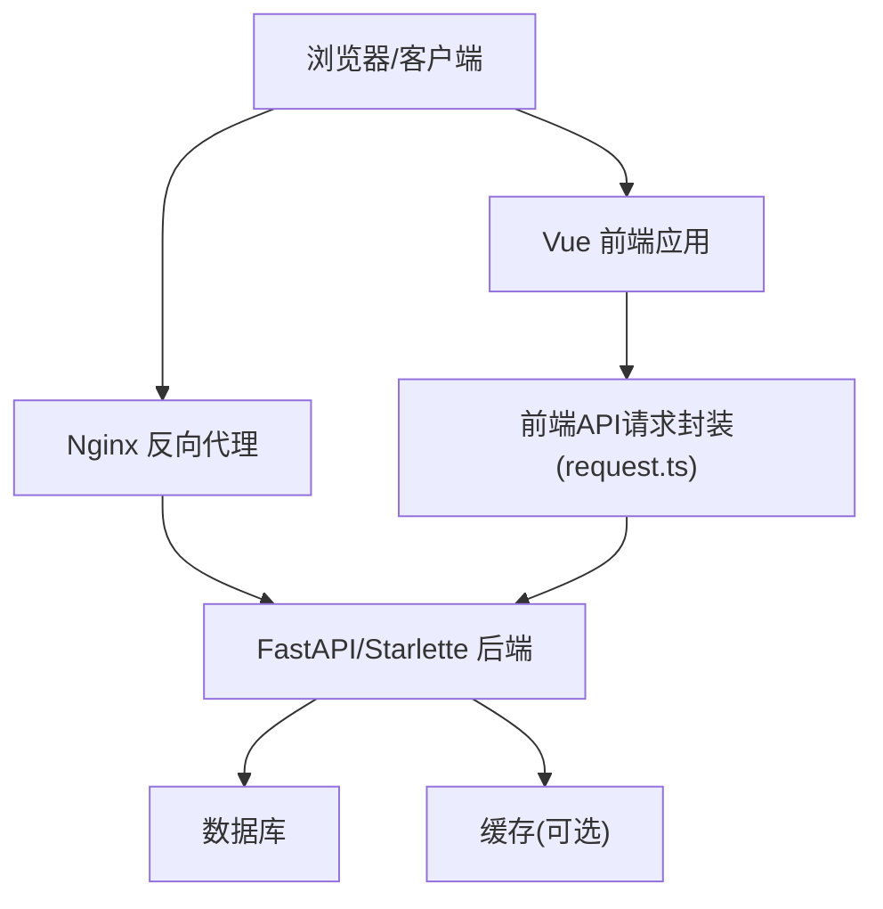
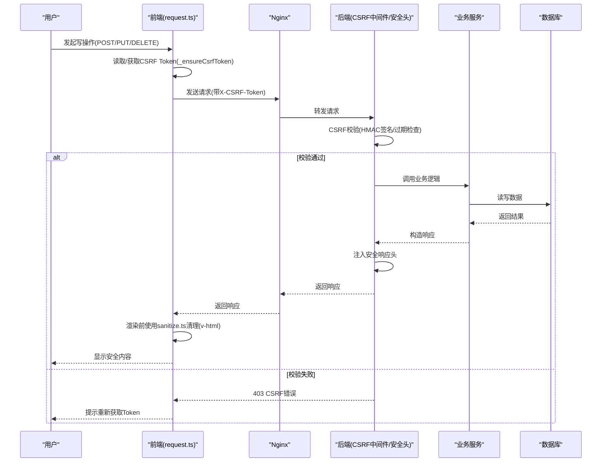
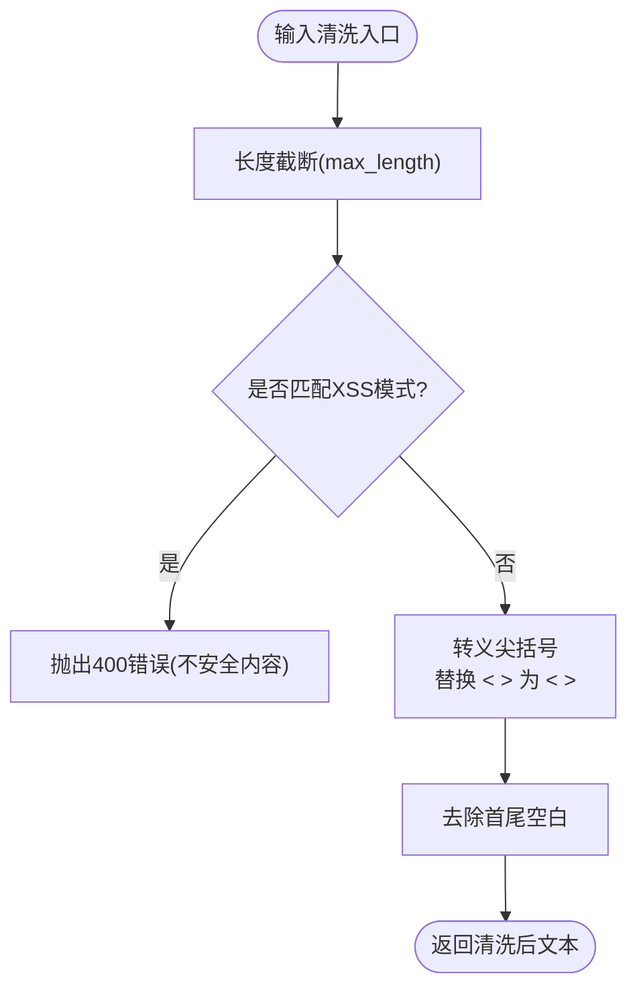
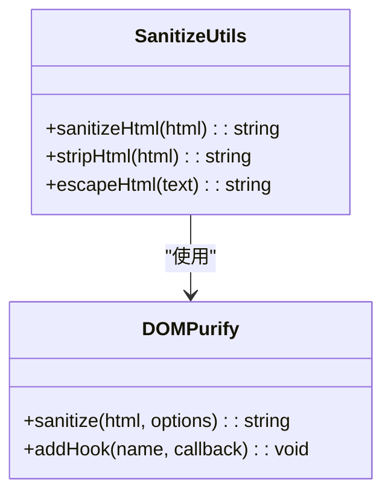
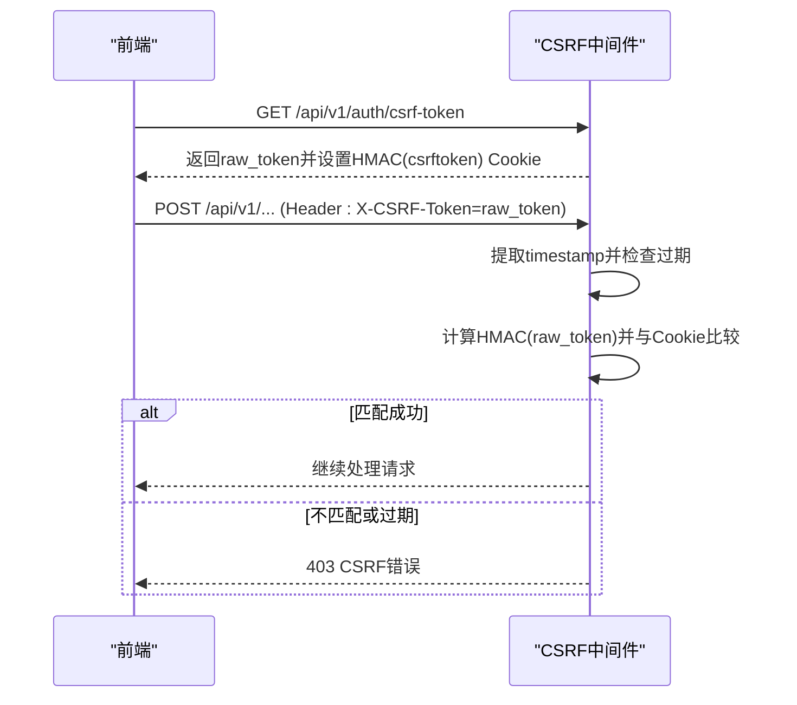
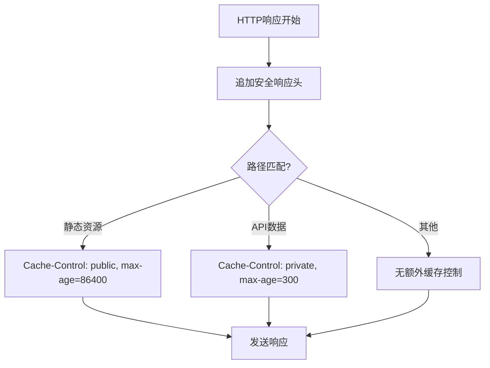
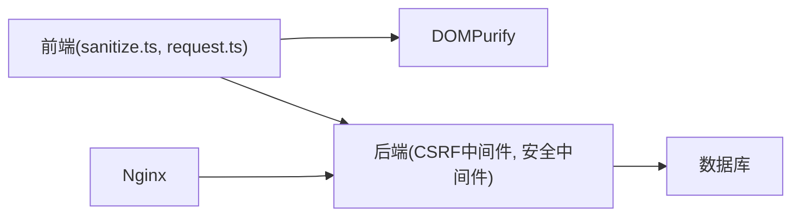

# XSS跨站脚本攻击防护

<cite>
**本文引用的文件**
- [backend/app/core/security.py](file://backend/app/core/security.py)
- [backend/app/utils/input_validator.py](file://backend/app/utils/input_validator.py)
- [frontend/src/utils/sanitize.ts](file://frontend/src/utils/sanitize.ts)
- [frontend/src/api/request.ts](file://frontend/src/api/request.ts)
- [backend/app/middleware/csrf_middleware.py](file://backend/app/middleware/csrf_middleware.py)
- [nginx/nginx.conf](file://nginx/nginx.conf)
- [scripts/security_audit.py](file://scripts/security_audit.py)
- [backend/tests/unit/test_input_validator_utils.py](file://backend/tests/unit/test_input_validator_utils.py)
- [frontend/tests/unit/sanitize.test.ts](file://frontend/tests/unit/sanitize.test.ts)
- [frontend/tests/unit/views/policies/Search.test.ts](file://frontend/tests/unit/views/policies/Search.test.ts)
- [backend/tests/unit/api/test_policy_preview_xss.py](file://backend/tests/unit/api/test_policy_preview_xss.py)
</cite>

## 目录
1. [简介](#简介)
2. [项目结构](#项目结构)
3. [核心组件](#核心组件)
4. [架构总览](#架构总览)
5. [详细组件分析](#详细组件分析)
6. [依赖关系分析](#依赖关系分析)
7. [性能与可用性考虑](#性能与可用性考虑)
8. [故障排查指南](#故障排查指南)
9. [结论](#结论)
10. [附录](#附录)

## 简介
本安全文档聚焦于XSS（跨站脚本）攻击的防护，覆盖攻击类型、危害性、后端输入清洗、前端输出编码、内容安全策略（CSP）配置与实施，以及富文本编辑器、用户评论、API响应等场景的具体实现示例。同时给出安全扫描工具集成与漏洞检测建议，帮助在开发与CI流程中持续保障安全性。

## 项目结构
本项目采用前后端分离架构：
- 后端基于FastAPI/Starlette，提供安全中间件、输入校验、CSRF保护与安全响应头注入。
- 前端基于Vue生态，使用DOMPurify进行HTML清理，统一封装请求以自动携带CSRF Token。
- Nginx作为反向代理，集中管理静态资源与基础安全头。
- 脚本层提供综合安全审计能力，辅助CI门禁。

**图表来源**
- [nginx/nginx.conf:1-36](file://nginx/nginx.conf#L1-L36)
- [backend/app/core/security.py:598-636](file://backend/app/core/security.py#L598-L636)
- [frontend/src/api/request.ts:124-164](file://frontend/src/api/request.ts#L124-L164)

**章节来源**
- [nginx/nginx.conf:1-36](file://nginx/nginx.conf#L1-L36)
- [backend/app/core/security.py:598-636](file://backend/app/core/security.py#L598-L636)
- [frontend/src/api/request.ts:124-164](file://frontend/src/api/request.ts#L124-L164)

## 核心组件
- 后端输入验证与清洗：InputValidator 提供XSS模式匹配、SQL注入检测、长度限制与尖括号转义；security模块提供通用sanitize_input与速率限制、IP获取等。
- 前端内容清理：sanitize.ts 基于DOMPurify实现白名单标签与属性过滤、危险协议拦截、外部链接安全属性增强，并提供stripHtml与escapeHtml工具。
- CSRF保护：csrf_middleware.py 实现HMAC签名Double Submit Cookie，支持过期检测与降级兼容。
- 安全响应头：SecurityHeadersMiddleware 注入X-Content-Type-Options、X-Frame-Options、X-XSS-Protection、Referrer-Policy等，并设置Cache-Control。
- 安全审计脚本：scripts/security_audit.py 提供多项代码级安全检查，用于CI门禁。

**章节来源**
- [backend/app/utils/input_validator.py:12-52](file://backend/app/utils/input_validator.py#L12-L52)
- [backend/app/core/security.py:394-411](file://backend/app/core/security.py#L394-L411)
- [frontend/src/utils/sanitize.ts:10-96](file://frontend/src/utils/sanitize.ts#L10-L96)
- [backend/app/middleware/csrf_middleware.py:65-124](file://backend/app/middleware/csrf_middleware.py#L65-L124)
- [backend/app/core/security.py:598-636](file://backend/app/core/security.py#L598-L636)
- [scripts/security_audit.py:45-237](file://scripts/security_audit.py#L45-L237)

## 架构总览
下图展示从请求进入Nginx到后端处理、再到前端渲染的完整安全链路，包括CSRF校验、输入清洗、输出编码与安全头注入。

**图表来源**
- [frontend/src/api/request.ts:124-164](file://frontend/src/api/request.ts#L124-L164)
- [backend/app/middleware/csrf_middleware.py:177-284](file://backend/app/middleware/csrf_middleware.py#L177-L284)
- [backend/app/core/security.py:598-636](file://backend/app/core/security.py#L598-L636)
- [frontend/src/utils/sanitize.ts:86-96](file://frontend/src/utils/sanitize.ts#L86-L96)

## 详细组件分析

### 后端输入清洗与XSS防护
- InputValidator.sanitize_string：对输入进行长度截断、XSS模式匹配（script、javascript:、on*事件、iframe/object/embed等），命中则直接拒绝；否则将尖括号转义为实体并去除首尾空白。
- security.sanitize_input：通用输入清理，移除常见SQL注入字符（单引号、分号、注释符等）。
- 测试覆盖：单元测试验证了XSS模式触发拒绝、尖括号转义、正常文本放行等行为。

**图表来源**
- [backend/app/utils/input_validator.py:31-52](file://backend/app/utils/input_validator.py#L31-L52)
- [backend/tests/unit/test_input_validator_utils.py:17-67](file://backend/tests/unit/test_input_validator_utils.py#L17-L67)

**章节来源**
- [backend/app/utils/input_validator.py:12-52](file://backend/app/utils/input_validator.py#L12-L52)
- [backend/app/core/security.py:394-411](file://backend/app/core/security.py#L394-L411)
- [backend/tests/unit/test_input_validator_utils.py:17-67](file://backend/tests/unit/test_input_validator_utils.py#L17-L67)

### 前端输出编码与富文本安全
- sanitize.ts 使用DOMPurify进行HTML清理，定义允许标签与属性白名单，禁用data属性；通过afterSanitizeAttributes钩子拦截危险URI协议（javascript:/vbscript:/data:/file:），并为外链添加rel="noopener noreferrer"与target="_blank"。
- stripHtml：移除所有标签，仅保留纯文本，避免innerHTML XSS风险。
- escapeHtml：对& < > " '进行实体转义，确保模板插值安全。
- 测试覆盖：验证允许标签保留、危险标签移除、onclick事件移除、javascript:链接移除、特殊字符转义等。

**图表来源**
- [frontend/src/utils/sanitize.ts:8-96](file://frontend/src/utils/sanitize.ts#L8-L96)
- [frontend/tests/unit/sanitize.test.ts:5-41](file://frontend/tests/unit/sanitize.test.ts#L5-L41)

**章节来源**
- [frontend/src/utils/sanitize.ts:10-127](file://frontend/src/utils/sanitize.ts#L10-L127)
- [frontend/tests/unit/sanitize.test.ts:5-41](file://frontend/tests/unit/sanitize.test.ts#L5-L41)

### CSRF保护机制
- Double Submit Cookie + HMAC签名：服务器生成raw_token，设置csrftoken Cookie为HMAC(raw_token)，前端在X-CSRF-Token头中携带raw_token；服务端计算HMAC(header)并与cookie比较。
- 过期检测：token格式包含时间戳{ts}.{random}，超过CSRF_TOKEN_EXPIRY即拒绝。
- 豁免路径与方法：GET/HEAD/OPTIONS放行；部分路径如登录、健康检查等豁免。
- 前端集成：request.ts的_ensureCsrfToken优先从Cookie读取，缺失时懒加载获取，并在非安全方法请求时附加X-CSRF-Token头。

**图表来源**
- [backend/app/middleware/csrf_middleware.py:65-124](file://backend/app/middleware/csrf_middleware.py#L65-L124)
- [backend/app/middleware/csrf_middleware.py:177-284](file://backend/app/middleware/csrf_middleware.py#L177-L284)
- [frontend/src/api/request.ts:124-164](file://frontend/src/api/request.ts#L124-L164)

**章节来源**
- [backend/app/middleware/csrf_middleware.py:33-56](file://backend/app/middleware/csrf_middleware.py#L33-L56)
- [backend/app/middleware/csrf_middleware.py:65-124](file://backend/app/middleware/csrf_middleware.py#L65-L124)
- [backend/app/middleware/csrf_middleware.py:177-284](file://backend/app/middleware/csrf_middleware.py#L177-L284)
- [frontend/src/api/request.ts:124-164](file://frontend/src/api/request.ts#L124-L164)

### 安全响应头与CSP
- SecurityHeadersMiddleware注入以下头部：
  - X-Content-Type-Options: nosniff
  - X-Frame-Options: DENY
  - X-XSS-Protection: 1; mode=block
  - Referrer-Policy: strict-origin-when-cross-origin
  - Strict-Transport-Security: max-age=31536000; includeSubDomains
  - Content-Security-Policy: default-src 'self'
  - Permissions-Policy: camera=(), microphone=(), geolocation()
- Cache-Control按路径差异化设置，静态资源可缓存，变更数据短期私有缓存。
- CSP当前为严格默认源，如需引入第三方脚本需扩展script-src指令并结合nonce或哈希值。

**图表来源**
- [backend/app/core/security.py:598-636](file://backend/app/core/security.py#L598-L636)
- [backend/app/core/security.py:694-702](file://backend/app/core/security.py#L694-L702)

**章节来源**
- [backend/app/core/security.py:598-636](file://backend/app/core/security.py#L598-L636)
- [backend/app/core/security.py:694-702](file://backend/app/core/security.py#L694-L702)

### 富文本编辑器、用户评论与API响应清理示例
- 富文本编辑器：在v-html渲染前调用sanitizeHtml，仅允许白名单标签与属性，拦截危险协议，外链增加安全属性。
- 用户评论：后端输入经InputValidator.sanitize_string清洗，前端再经sanitizeHtml二次净化，确保即使后端放宽策略，前端仍有兜底。
- API响应数据：预览接口对标题与内容进行转义，防止未转义的HTML直达响应体；测试验证<script>与被转义。

**章节来源**
- [frontend/src/utils/sanitize.ts:86-96](file://frontend/src/utils/sanitize.ts#L86-L96)
- [backend/app/utils/input_validator.py:31-52](file://backend/app/utils/input_validator.py#L31-L52)
- [backend/tests/unit/api/test_policy_preview_xss.py:48-82](file://backend/tests/unit/api/test_policy_preview_xss.py#L48-L82)

### 安全扫描工具集成与漏洞检测
- scripts/security_audit.py：在CI中执行，检查裸db.commit()、跨组织批量删除、列表端点未使用ok_list()、写操作缺少write_work_log、组织模型查询缺少filter_by_data_scope等。
- 结合pre-commit与GitHub Actions，可在提交与合并前自动运行，阻断高风险变更。

**章节来源**
- [scripts/security_audit.py:45-237](file://scripts/security_audit.py#L45-L237)

## 依赖关系分析
- 前端依赖DOMPurify进行HTML清理，并通过request.ts统一管理CSRF Token获取与请求头注入。
- 后端依赖CSRF中间件进行状态变更请求校验，依赖安全中间件注入响应头。
- Nginx作为反向代理，集中配置gzip、日志与静态资源缓存策略。

**图表来源**
- [frontend/src/utils/sanitize.ts:8-96](file://frontend/src/utils/sanitize.ts#L8-L96)
- [frontend/src/api/request.ts:124-164](file://frontend/src/api/request.ts#L124-L164)
- [backend/app/middleware/csrf_middleware.py:177-284](file://backend/app/middleware/csrf_middleware.py#L177-L284)
- [backend/app/core/security.py:598-636](file://backend/app/core/security.py#L598-L636)
- [nginx/nginx.conf:1-36](file://nginx/nginx.conf#L1-L36)

**章节来源**
- [frontend/src/utils/sanitize.ts:8-96](file://frontend/src/utils/sanitize.ts#L8-L96)
- [frontend/src/api/request.ts:124-164](file://frontend/src/api/request.ts#L124-L164)
- [backend/app/middleware/csrf_middleware.py:177-284](file://backend/app/middleware/csrf_middleware.py#L177-L284)
- [backend/app/core/security.py:598-636](file://backend/app/core/security.py#L598-L636)
- [nginx/nginx.conf:1-36](file://nginx/nginx.conf#L1-L36)

## 性能与可用性考虑
- 输入清洗与输出编码应在最小必要范围内执行，避免过度正则匹配导致延迟。
- DOMPurify配置应精简白名单，减少解析开销。
- CSRF Token懒加载与并发去重可减少不必要网络请求。
- 安全响应头与缓存策略按路径差异化，平衡安全与性能。

[本节为通用指导，无需特定文件引用]

## 故障排查指南
- CSRF验证失败：检查前端是否正确获取并携带X-CSRF-Token；确认Cookie名称与Header名称一致；查看服务端日志中的CSRF警告信息。
- 富文本渲染异常：确认sanitizeHtml已应用于v-html；检查白名单是否遗漏必要标签；验证危险协议是否被正确拦截。
- 预览接口XSS泄露：确认后端对标题与内容进行转义；检查测试用例是否覆盖<script>与等载荷。

**章节来源**
- [backend/app/middleware/csrf_middleware.py:211-284](file://backend/app/middleware/csrf_middleware.py#L211-L284)
- [frontend/src/utils/sanitize.ts:86-96](file://frontend/src/utils/sanitize.ts#L86-L96)
- [backend/tests/unit/api/test_policy_preview_xss.py:48-82](file://backend/tests/unit/api/test_policy_preview_xss.py#L48-L82)

## 结论
本项目在后端输入清洗、前端输出编码、CSRF保护与安全响应头方面具备较完善的基础设施。建议在生产环境中进一步细化CSP策略（如script-src指令、nonce与哈希值），并持续集成安全扫描工具，确保新增功能与变更符合安全基线。

[本节为总结性内容，无需特定文件引用]

## 附录
- XSS攻击类型与危害：
  - 存储型：恶意脚本持久化至服务器，影响所有访问者。
  - 反射型：恶意脚本随请求参数反射回页面，需诱导点击。
  - DOM型：前端脚本直接操作DOM注入恶意代码，绕过后端过滤。
- 防护要点：
  - 后端：输入验证与清洗、SQL注入防护、敏感字段脱敏。
  - 前端：白名单清理、实体转义、避免v-html滥用。
  - 传输层：CSRF保护、安全响应头、CSP。
  - 运维：安全扫描、日志审计、CI门禁。

[本节为概念性内容，无需特定文件引用]