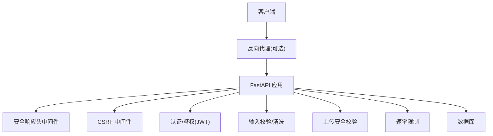
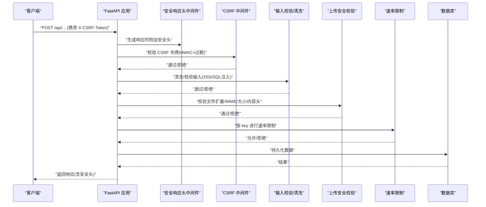
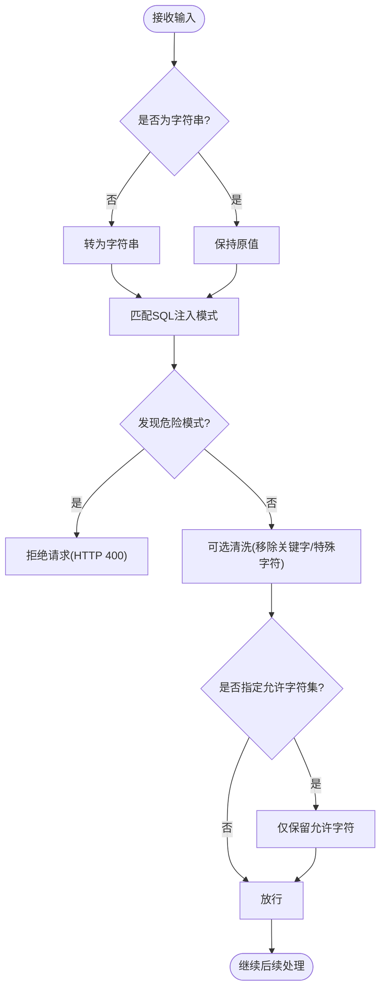
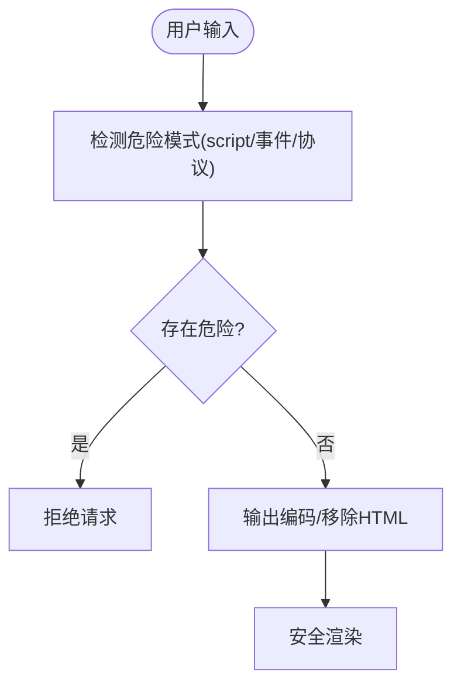
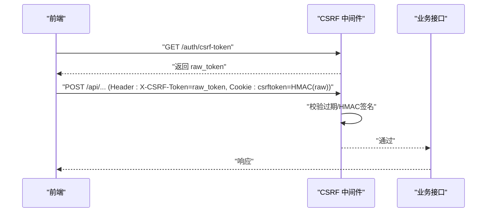
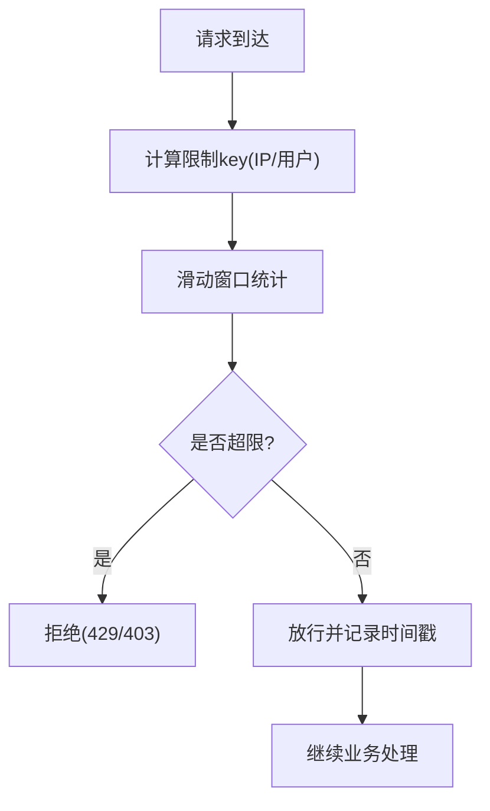
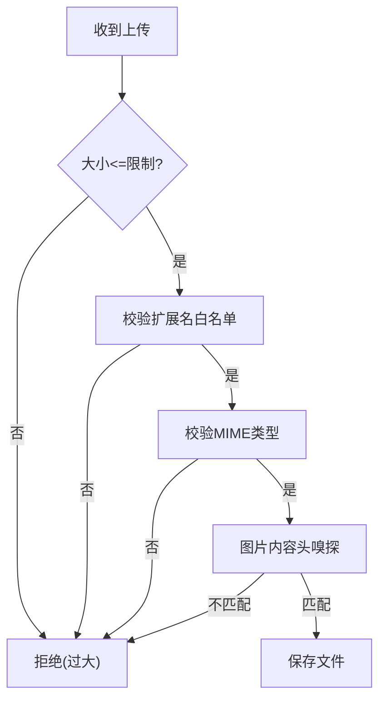
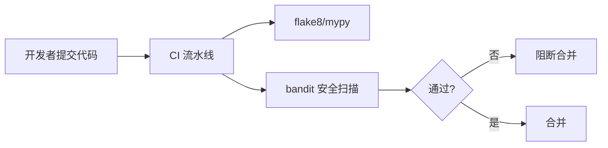
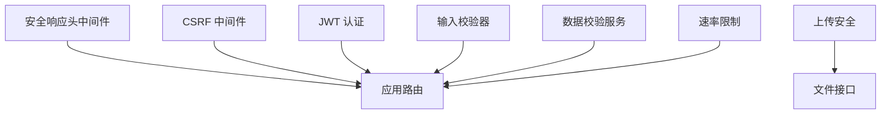

# 攻击防护策略

<cite>
**本文引用的文件**
- [backend/app/core/security.py](file://backend/app/core/security.py)
- [backend/app/middleware/csrf_middleware.py](file://backend/app/middleware/csrf_middleware.py)
- [backend/app/utils/input_validator.py](file://backend/app/utils/input_validator.py)
- [backend/app/services/data_validator_service.py](file://backend/app/services/data_validator_service.py)
- [backend/app/core/upload_security.py](file://backend/app/core/upload_security.py)
- [backend/app/api/v1/files.py](file://backend/app/api/v1/files.py)
- [backend/app/services/resource_limiter.py](file://backend/app/services/resource_limiter.py)
- [backend/.bandit](file://backend/.bandit)
- [.github/workflows/pr-checks.yml](file://.github/workflows/pr-checks.yml)
- [backend/tests/security/test_audit.py](file://backend/tests/security/test_audit.py)
- [backend/tests/unit/test_input_validator_utils.py](file://backend/tests/unit/test_input_validator_utils.py)
- [backend/tests/unit/test_data_validator_service.py](file://backend/tests/unit/test_data_validator_service.py)
- [backend/tests/unit/test_csrf_hmac_upgrade.py](file://backend/tests/unit/test_csrf_hmac_upgrade.py)
- [frontend/src/views/policies/Edit.vue](file://frontend/src/views/policies/Edit.vue)
</cite>

## 目录
1. [简介](#简介)
2. [项目结构](#项目结构)
3. [核心组件](#核心组件)
4. [架构总览](#架构总览)
5. [详细组件分析](#详细组件分析)
6. [依赖关系分析](#依赖关系分析)
7. [性能与安全权衡](#性能与安全权衡)
8. [故障排查指南](#故障排查指南)
9. [结论](#结论)
10. [附录](#附录)

## 简介
本文件面向“攻击防护策略”，围绕 SQL 注入、XSS、CSRF、API 速率限制、DDoS/暴力破解防护、上传安全与扫描工具集成等主题，结合仓库中的后端中间件、输入校验、资源限制器与安全审计脚本，给出可落地的防护方案与最佳实践。文档以代码级实现为依据，提供流程图与时序图帮助理解关键路径。

## 项目结构
本项目在安全方面采用分层防御：
- 请求入口层：安全响应头中间件统一设置浏览器安全策略（如 X-Content-Type-Options、X-Frame-Options、Referrer-Policy）。
- 认证与授权层：JWT 签发/校验、黑名单检查、角色权限控制。
- 输入与输出层：输入清洗与模式匹配（SQL/XSS）、输出编码与白名单。
- 业务服务层：数据校验服务（长度、格式、字符集、SQL/XSS 清理）、上传安全校验（扩展名、MIME、内容嗅探）。
- 访问控制层：CSRF 保护（HMAC 签名 + 过期检测）、速率限制（滑动窗口）。
- 运维与合规：Bandit 静态扫描、CI 门禁、审计日志记录。

**图表来源**
- [backend/app/core/security.py:598-636](file://backend/app/core/security.py#L598-L636)
- [backend/app/middleware/csrf_middleware.py:177-284](file://backend/app/middleware/csrf_middleware.py#L177-L284)
- [backend/app/utils/input_validator.py:12-71](file://backend/app/utils/input_validator.py#L12-L71)
- [backend/app/core/upload_security.py:19-127](file://backend/app/core/upload_security.py#L19-L127)
- [backend/app/services/resource_limiter.py:41-171](file://backend/app/services/resource_limiter.py#L41-L171)

**章节来源**
- [backend/app/core/security.py:598-636](file://backend/app/core/security.py#L598-L636)
- [backend/app/middleware/csrf_middleware.py:177-284](file://backend/app/middleware/csrf_middleware.py#L177-L284)
- [backend/app/utils/input_validator.py:12-71](file://backend/app/utils/input_validator.py#L12-L71)
- [backend/app/core/upload_security.py:19-127](file://backend/app/core/upload_security.py#L19-L127)
- [backend/app/services/resource_limiter.py:41-171](file://backend/app/services/resource_limiter.py#L41-L171)

## 核心组件
- 安全响应头中间件：为所有 HTTP 响应附加安全相关头部，并针对不同路径设置合理的缓存策略。
- CSRF 中间件：基于 Double Submit Cookie + HMAC 签名验证，支持 token 过期检测与旧版明文兼容回退。
- 输入校验器：针对 XSS 与 SQL 注入的模式匹配与清洗；提供邮箱、手机号、身份证号等格式校验。
- 数据校验服务：更丰富的清洗能力（HTML 移除、SQL 关键字/特殊字符移除、允许字符集过滤）与组合验证。
- 上传安全：扩展名白名单、MIME 类型校验、文件大小限制、内容头嗅探防绕过。
- 速率限制：内存滑动窗口限流，支持按 key 配置配额与统计。
- 安全扫描与门禁：Bandit 规则配置、CI 中执行 flake8/mypy/bandit 门禁。

**章节来源**
- [backend/app/core/security.py:598-636](file://backend/app/core/security.py#L598-L636)
- [backend/app/middleware/csrf_middleware.py:177-284](file://backend/app/middleware/csrf_middleware.py#L177-L284)
- [backend/app/utils/input_validator.py:12-71](file://backend/app/utils/input_validator.py#L12-L71)
- [backend/app/services/data_validator_service.py:1000-1149](file://backend/app/services/data_validator_service.py#L1000-L1149)
- [backend/app/core/upload_security.py:19-127](file://backend/app/core/upload_security.py#L19-L127)
- [backend/app/services/resource_limiter.py:41-171](file://backend/app/services/resource_limiter.py#L41-L171)
- [backend/.bandit:1-14](file://backend/.bandit#L1-L14)
- [.github/workflows/pr-checks.yml:68-82](file://.github/workflows/pr-checks.yml#L68-L82)

## 架构总览
下图展示一次写请求的安全处理流程：从进入应用、安全头注入、CSRF 校验、输入校验、上传校验到最终写入数据库。

**图表来源**
- [backend/app/core/security.py:598-636](file://backend/app/core/security.py#L598-L636)
- [backend/app/middleware/csrf_middleware.py:177-284](file://backend/app/middleware/csrf_middleware.py#L177-L284)
- [backend/app/utils/input_validator.py:12-71](file://backend/app/utils/input_validator.py#L12-L71)
- [backend/app/core/upload_security.py:19-127](file://backend/app/core/upload_security.py#L19-L127)
- [backend/app/services/resource_limiter.py:41-171](file://backend/app/services/resource_limiter.py#L41-L171)

## 详细组件分析

### SQL 注入防护
- 参数化查询优先：使用 ORM 或参数化语句，避免字符串拼接。
- 输入校验与清洗：
  - 输入校验器对常见 SQL 注入模式进行匹配并拒绝。
  - 数据校验服务支持移除 SQL 关键字与特殊字符，并可限定允许字符集。
- 白名单机制：对排序字段、列名等动态部分使用白名单校验。
- 审计与测试：单元测试覆盖 UNION/SELECT/DROP/注释/布尔注入等场景。

**图表来源**
- [backend/app/utils/input_validator.py:12-71](file://backend/app/utils/input_validator.py#L12-L71)
- [backend/app/services/data_validator_service.py:1000-1149](file://backend/app/services/data_validator_service.py#L1000-L1149)

**章节来源**
- [backend/app/utils/input_validator.py:12-71](file://backend/app/utils/input_validator.py#L12-L71)
- [backend/app/services/data_validator_service.py:1000-1149](file://backend/app/services/data_validator_service.py#L1000-L1149)
- [backend/tests/unit/test_input_validator_utils.py:70-114](file://backend/tests/unit/test_input_validator_utils.py#L70-L114)
- [backend/tests/unit/test_data_validator_service.py:776-831](file://backend/tests/unit/test_data_validator_service.py#L776-L831)

### XSS 跨站脚本攻击防护
- 输入侧：
  - 输入校验器对 script、javascript:、事件处理器、iframe/object/embed 等危险模式进行匹配并拒绝。
  - 数据校验服务支持移除 HTML 标签与实体解码后再清理。
- 输出侧：
  - 前端对片段进行转义，确保恶意标签不会作为高亮标记渲染。
  - 安全响应头启用 X-XSS-Protection 与 Referrer-Policy。
- 建议：
  - 对所有用户可控输出进行上下文相关的编码（HTML/JS/CSS/URL）。
  - 结合 CSP（可通过安全常量或网关配置）限制脚本来源。

**图表来源**
- [backend/app/utils/input_validator.py:12-52](file://backend/app/utils/input_validator.py#L12-L52)
- [backend/app/services/data_validator_service.py:1000-1051](file://backend/app/services/data_validator_service.py#L1000-L1051)
- [backend/app/core/security.py:598-636](file://backend/app/core/security.py#L598-L636)
- [frontend/src/views/policies/Edit.vue:344-376](file://frontend/src/views/policies/Edit.vue#L344-L376)

**章节来源**
- [backend/app/utils/input_validator.py:12-52](file://backend/app/utils/input_validator.py#L12-L52)
- [backend/app/services/data_validator_service.py:1000-1051](file://backend/app/services/data_validator_service.py#L1000-L1051)
- [backend/app/core/security.py:598-636](file://backend/app/core/security.py#L598-L636)
- [frontend/src/views/policies/Edit.vue:344-376](file://frontend/src/views/policies/Edit.vue#L344-L376)

### CSRF 跨站请求伪造防护
- 双提交 Cookie + HMAC 签名：
  - 前端获取 raw_token，服务端设置 Cookie = HMAC(raw_token)，请求头携带 raw_token。
  - 服务端用 hmac.compare_digest 比较 HMAC(header) 与 cookie，防止时序攻击。
- 过期检测：token 内嵌时间戳，超过阈值即拒绝。
- 兼容回退：旧版明文比对仍允许但记录警告日志，推动升级。
- 豁免路径：健康检查、登录注册、文档等无需 CSRF。

**图表来源**
- [backend/app/middleware/csrf_middleware.py:65-124](file://backend/app/middleware/csrf_middleware.py#L65-L124)
- [backend/app/middleware/csrf_middleware.py:177-284](file://backend/app/middleware/csrf_middleware.py#L177-L284)
- [backend/tests/unit/test_csrf_hmac_upgrade.py:51-198](file://backend/tests/unit/test_csrf_hmac_upgrade.py#L51-L198)

**章节来源**
- [backend/app/middleware/csrf_middleware.py:65-124](file://backend/app/middleware/csrf_middleware.py#L65-L124)
- [backend/app/middleware/csrf_middleware.py:177-284](file://backend/app/middleware/csrf_middleware.py#L177-L284)
- [backend/tests/unit/test_csrf_hmac_upgrade.py:51-198](file://backend/tests/unit/test_csrf_hmac_upgrade.py#L51-L198)

### API 速率限制与 DDoS/暴力破解防护
- 速率限制：
  - 内置滑动窗口算法，默认 60 次/分钟，可按 key（IP/用户名）配置。
  - 周期性清理过期键，防止内存泄漏。
  - 缺失 key/request 时严格失败（fail-closed），避免静默放行。
- 暴力破解防护：
  - 结合认证失败计数与锁定策略（参考审计服务对失败登录的分级记录）。
  - 配合 CSRF 与输入校验，降低自动化攻击面。
- DDoS 缓解：
  - 在网关/反向代理层做连接数与请求频率限制。
  - 应用层通过速率限制与资源配额保护核心接口。

**图表来源**
- [backend/app/services/resource_limiter.py:41-171](file://backend/app/services/resource_limiter.py#L41-L171)
- [backend/app/core/security.py:419-488](file://backend/app/core/security.py#L419-L488)
- [backend/tests/unit/test_cov_final_security.py:64-83](file://backend/tests/unit/test_cov_final_security.py#L64-L83)

**章节来源**
- [backend/app/services/resource_limiter.py:41-171](file://backend/app/services/resource_limiter.py#L41-L171)
- [backend/app/core/security.py:419-488](file://backend/app/core/security.py#L419-L488)
- [backend/tests/unit/test_cov_final_security.py:64-83](file://backend/tests/unit/test_cov_final_security.py#L64-L83)

### 上传安全
- 扩展名白名单：仅允许已知安全的扩展名集合。
- MIME 类型校验：拒绝不在允许列表的 MIME。
- 文件大小限制：默认最大 50MB，超出则拒绝。
- 内容嗅探：图片扩展名需匹配真实文件头，防止改名绕过。
- 前端对齐：前端上传前校验类型与大小，并保证 CSRF 就绪。

**图表来源**
- [backend/app/core/upload_security.py:19-127](file://backend/app/core/upload_security.py#L19-L127)
- [backend/app/api/v1/files.py:47-83](file://backend/app/api/v1/files.py#L47-L83)
- [frontend/src/views/policies/Edit.vue:344-376](file://frontend/src/views/policies/Edit.vue#L344-L376)

**章节来源**
- [backend/app/core/upload_security.py:19-127](file://backend/app/core/upload_security.py#L19-L127)
- [backend/app/api/v1/files.py:47-83](file://backend/app/api/v1/files.py#L47-L83)
- [frontend/src/views/policies/Edit.vue:344-376](file://frontend/src/views/policies/Edit.vue#L344-L376)

### 安全扫描与漏洞检测
- Bandit 静态扫描：
  - 配置文件定义排除目录与规则集，级别包含 LOW/MEDIUM/HIGH。
  - CI 中执行 bandit 作为门禁，阻断高危问题。
- 自定义审计脚本：
  - 扫描写操作端点是否记录工作日志、查询是否使用数据范围过滤、敏感字段是否加密等。
- 测试保障：
  - 安全审计测试断言无 HIGH 严重性问题，并验证 ORM 参数化使用。

**图表来源**
- [backend/.bandit:1-14](file://backend/.bandit#L1-L14)
- [.github/workflows/pr-checks.yml:68-82](file://.github/workflows/pr-checks.yml#L68-L82)
- [backend/tests/security/test_audit.py:11-41](file://backend/tests/security/test_audit.py#L11-L41)
- [scripts/archive/audit_security.py:194-240](file://scripts/archive/audit_security.py#L194-L240)

**章节来源**
- [backend/.bandit:1-14](file://backend/.bandit#L1-L14)
- [.github/workflows/pr-checks.yml:68-82](file://.github/workflows/pr-checks.yml#L68-L82)
- [backend/tests/security/test_audit.py:11-41](file://backend/tests/security/test_audit.py#L11-L41)
- [scripts/archive/audit_security.py:194-240](file://scripts/archive/audit_security.py#L194-L240)

## 依赖关系分析
- 安全中间件与认证：
  - 安全响应头中间件与 JWT 认证相互独立，分别负责响应头与身份校验。
- 输入校验与数据服务：
  - 输入校验器提供基础模式匹配；数据校验服务提供更强的清洗与组合验证。
- CSRF 与速率限制：
  - CSRF 中间件位于路由之前，速率限制可在具体接口或全局中间件中调用。
- 上传安全：
  - 上传接口依赖扩展名、MIME、大小与内容嗅探校验，前后端保持一致策略。

**图表来源**
- [backend/app/core/security.py:598-636](file://backend/app/core/security.py#L598-L636)
- [backend/app/middleware/csrf_middleware.py:177-284](file://backend/app/middleware/csrf_middleware.py#L177-L284)
- [backend/app/utils/input_validator.py:12-71](file://backend/app/utils/input_validator.py#L12-L71)
- [backend/app/services/data_validator_service.py:1000-1149](file://backend/app/services/data_validator_service.py#L1000-L1149)
- [backend/app/core/upload_security.py:19-127](file://backend/app/core/upload_security.py#L19-L127)
- [backend/app/services/resource_limiter.py:41-171](file://backend/app/services/resource_limiter.py#L41-L171)

**章节来源**
- [backend/app/core/security.py:598-636](file://backend/app/core/security.py#L598-L636)
- [backend/app/middleware/csrf_middleware.py:177-284](file://backend/app/middleware/csrf_middleware.py#L177-L284)
- [backend/app/utils/input_validator.py:12-71](file://backend/app/utils/input_validator.py#L12-L71)
- [backend/app/services/data_validator_service.py:1000-1149](file://backend/app/services/data_validator_service.py#L1000-L1149)
- [backend/app/core/upload_security.py:19-127](file://backend/app/core/upload_security.py#L19-L127)
- [backend/app/services/resource_limiter.py:41-171](file://backend/app/services/resource_limiter.py#L41-L171)

## 性能与安全权衡
- 输入清洗与模式匹配会带来额外 CPU 开销，建议在高频接口使用轻量校验，复杂清洗下沉至服务层。
- 速率限制使用内存存储，需定期清理过期键以避免内存增长（已实现周期性清理）。
- CSRF HMAC 校验为常量时间比较，安全性高且开销低。
- 上传内容嗅探会增加 I/O 与解析成本，建议仅在必要时启用。

[本节为通用指导，不直接分析具体文件]

## 故障排查指南
- CSRF 验证失败：
  - 检查是否缺少 X-CSRF-Token 或 csrftoken Cookie。
  - 确认 token 未过期（内嵌时间戳）。
  - 若为旧版明文比对，查看警告日志并升级前端流程。
- 输入校验拒绝：
  - 检查是否命中 XSS/SQL 注入模式。
  - 如需放宽，调整允许字符集或清洗策略。
- 上传被拒：
  - 核对扩展名、MIME、大小与内容头是否匹配。
- 速率限制触发：
  - 检查 key 是否正确（IP/用户名），调整 limit/window。
  - 观察统计信息，定位异常流量。

**章节来源**
- [backend/app/middleware/csrf_middleware.py:211-284](file://backend/app/middleware/csrf_middleware.py#L211-L284)
- [backend/app/utils/input_validator.py:12-71](file://backend/app/utils/input_validator.py#L12-L71)
- [backend/app/core/upload_security.py:87-127](file://backend/app/core/upload_security.py#L87-L127)
- [backend/app/services/resource_limiter.py:65-171](file://backend/app/services/resource_limiter.py#L65-L171)

## 结论
本项目在多个层面构建了完整的攻击防护体系：通过安全响应头、CSRF HMAC 校验、输入/输出清洗、上传安全校验、速率限制与静态扫描门禁，有效降低了 SQL 注入、XSS、CSRF、暴力破解与恶意上传的风险。建议在生产环境中结合网关层进一步加固（如 WAF、DDoS 防护），并持续运行安全扫描与渗透测试，确保安全基线持续达标。

[本节为总结性内容，不直接分析具体文件]

## 附录
- 安全常量与策略：
  - 安全响应头字典包含 HSTS、CSP、Referrer-Policy、Permissions-Policy 等。
  - 密码策略包含长度、复杂度、弱口令黑名单与用户名包含检查。
- 审计与监控：
  - 审计日志服务记录操作行为，支持按资源与用户维度检索。
  - 安全事件服务记录失败登录、未授权访问等事件，便于告警与处置。

**章节来源**
- [backend/app/core/security.py:693-712](file://backend/app/core/security.py#L693-L712)
- [backend/app/core/security.py:524-590](file://backend/app/core/security.py#L524-L590)
- [backend/app/core/security.py:644-687](file://backend/app/core/security.py#L644-L687)