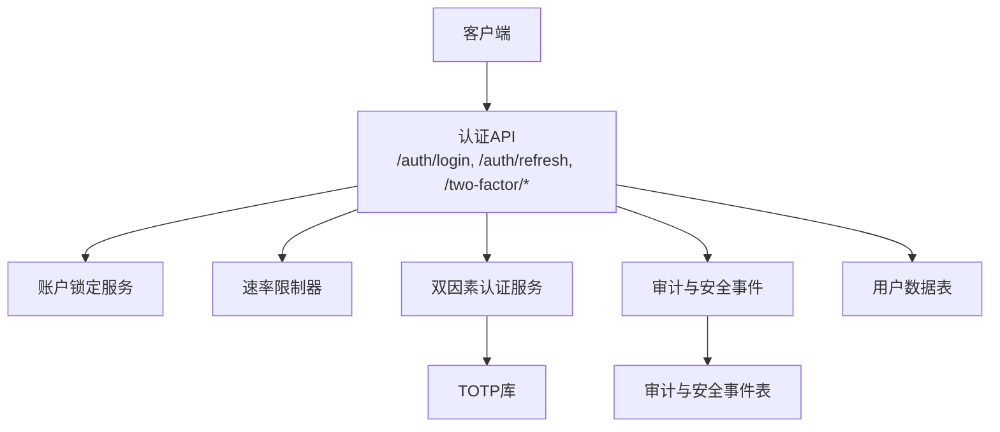
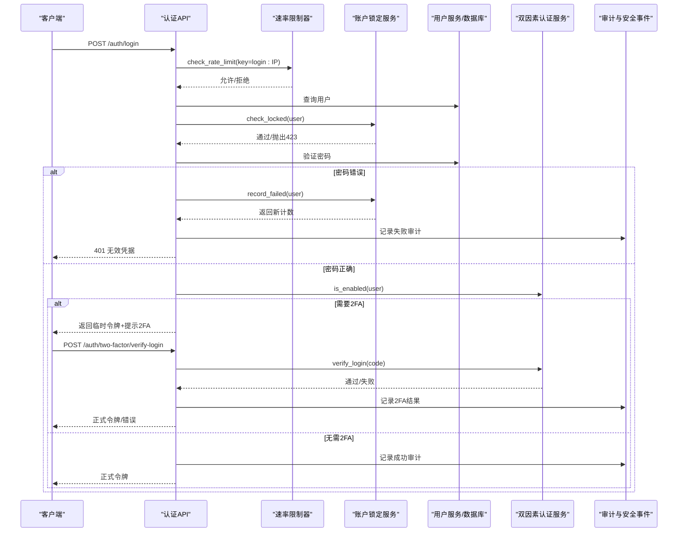
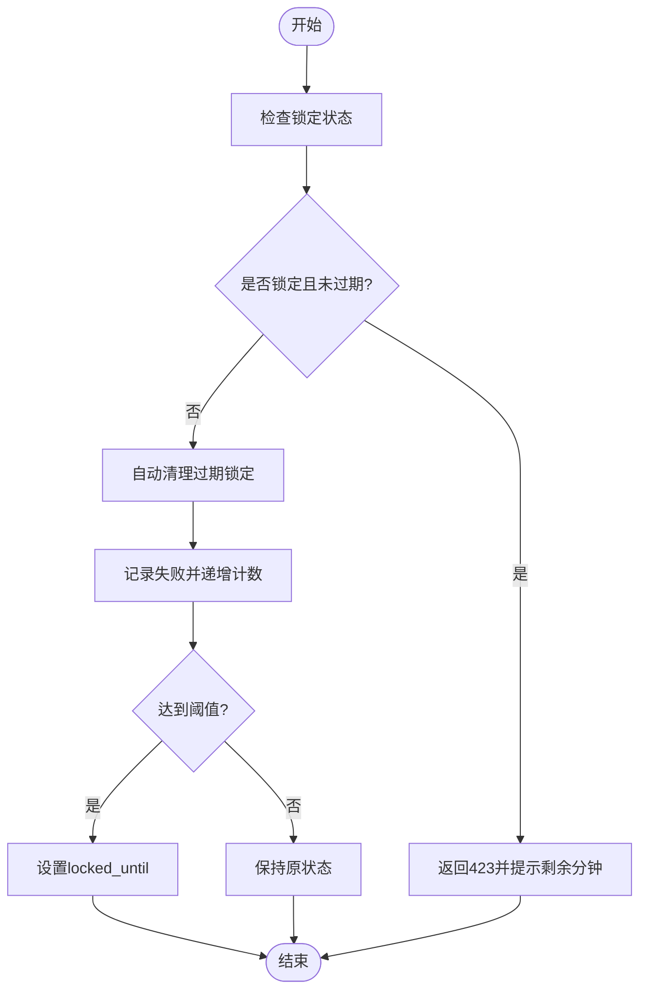
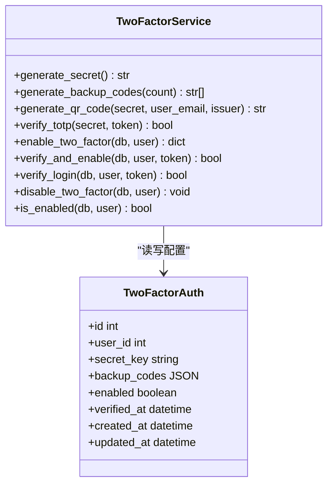
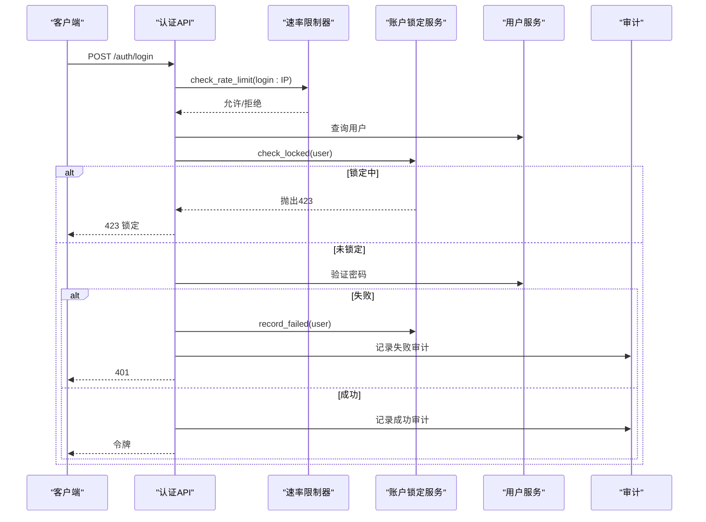
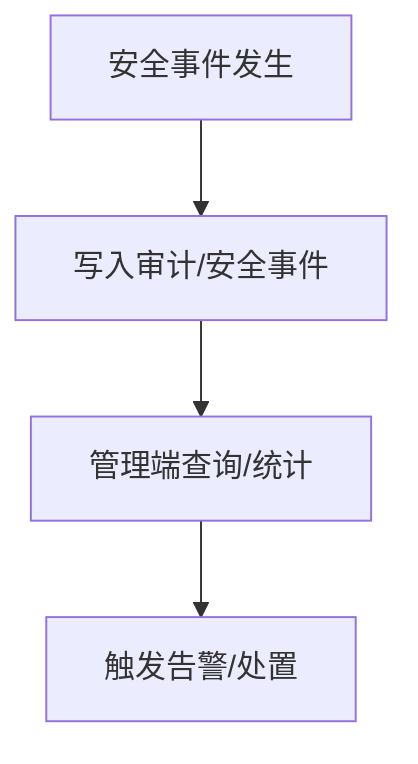
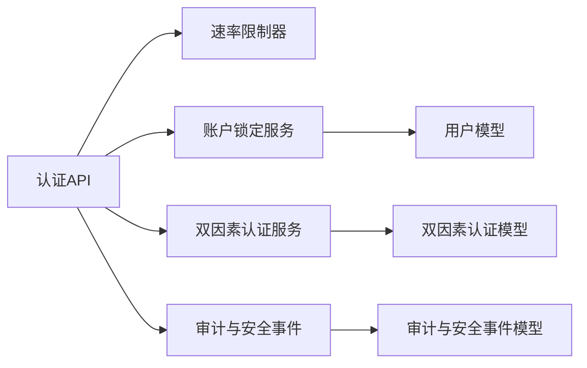

# 暴力破解防护

<cite>
**本文引用的文件**
- [backend/app/services/lockout_service.py](file://backend/app/services/lockout_service.py)
- [backend/app/api/v1/auth/auth.py](file://backend/app/api/v1/auth/auth.py)
- [backend/app/core/security.py](file://backend/app/core/security.py)
- [backend/app/models/user.py](file://backend/app/models/user.py)
- [backend/app/services/two_factor_service.py](file://backend/app/services/two_factor_service.py)
- [backend/app/models/two_factor_auth.py](file://backend/app/models/two_factor_auth.py)
- [backend/app/api/v1/system/audit.py](file://backend/app/api/v1/system/audit.py)
- [backend/app/models/audit.py](file://backend/app/models/audit.py)
- [backend/app/api/v1/system/zero_trust.py](file://backend/app/api/v1/system/zero_trust.py)
</cite>

## 目录
1. [简介](#简介)
2. [项目结构](#项目结构)
3. [核心组件](#核心组件)
4. [架构总览](#架构总览)
5. [详细组件分析](#详细组件分析)
6. [依赖关系分析](#依赖关系分析)
7. [性能与可扩展性](#性能与可扩展性)
8. [故障排查指南](#故障排查指南)
9. [结论](#结论)
10. [附录：配置与集成示例](#附录配置与集成示例)

## 简介
本安全文档面向“暴力破解防护”，覆盖攻击原理、账户锁定机制、多因素认证（MFA）、验证码与人机验证、API访问控制、审计日志与异常检测，以及应急响应与恢复流程。文档基于仓库中现有实现进行说明，并提供可操作的防护配置建议与流程图示，帮助读者在本地或生产环境中正确部署和调优。

## 项目结构
与安全相关的关键模块分布如下：
- 认证与登录流程：后端 API 位于 auth 路由，包含登录、刷新令牌、双因素认证校验等。
- 账户锁定服务：统一封装失败计数、锁定时间策略、过期清理与批量解锁。
- 速率限制与输入清洗：内置滑动窗口限流、IP来源判定、密码策略与敏感信息脱敏。
- 多因素认证：TOTP密钥生成、二维码生成、备用码机制与启用/禁用流程。
- 审计与安全事件：审计日志模型、安全事件记录与查询接口。
- 零信任策略：密码强度策略、登录失败锁定策略等。

**图表来源**
- [backend/app/api/v1/auth/auth.py:101-287](file://backend/app/api/v1/auth/auth.py#L101-L287)
- [backend/app/services/lockout_service.py:25-168](file://backend/app/services/lockout_service.py#L25-L168)
- [backend/app/core/security.py:439-488](file://backend/app/core/security.py#L439-L488)
- [backend/app/services/two_factor_service.py:23-251](file://backend/app/services/two_factor_service.py#L23-L251)
- [backend/app/models/audit.py:65-101](file://backend/app/models/audit.py#L65-L101)

**章节来源**
- [backend/app/api/v1/auth/auth.py:101-287](file://backend/app/api/v1/auth/auth.py#L101-L287)
- [backend/app/services/lockout_service.py:25-168](file://backend/app/services/lockout_service.py#L25-L168)
- [backend/app/core/security.py:439-488](file://backend/app/core/security.py#L439-L488)
- [backend/app/services/two_factor_service.py:23-251](file://backend/app/services/two_factor_service.py#L23-L251)
- [backend/app/models/audit.py:65-101](file://backend/app/models/audit.py#L65-L101)

## 核心组件
- 账户锁定服务：提供检查锁定、原子递增失败次数、自动清理过期锁定、批量解锁等功能。
- 认证API：登录、刷新令牌、双因素认证校验，集成速率限制、机器码绑定、审计日志。
- 速率限制器：滑动窗口算法，按IP维度限制登录、注册、刷新频率。
- 双因素认证：TOTP密钥生成、二维码生成、备用码、启用/禁用与登录校验。
- 审计与安全事件：记录登录成功/失败、安全事件级别与类型，提供统计与查询接口。
- 零信任策略：密码强度策略、登录失败锁定策略等。

**章节来源**
- [backend/app/services/lockout_service.py:25-168](file://backend/app/services/lockout_service.py#L25-L168)
- [backend/app/api/v1/auth/auth.py:101-287](file://backend/app/api/v1/auth/auth.py#L101-L287)
- [backend/app/core/security.py:439-488](file://backend/app/core/security.py#L439-L488)
- [backend/app/services/two_factor_service.py:23-251](file://backend/app/services/two_factor_service.py#L23-L251)
- [backend/app/api/v1/system/audit.py:389-432](file://backend/app/api/v1/system/audit.py#L389-L432)
- [backend/app/api/v1/system/zero_trust.py:144-168](file://backend/app/api/v1/system/zero_trust.py#L144-L168)

## 架构总览
下图展示从客户端到后端的认证与防护链路，包括速率限制、账户锁定、双因素认证、审计与安全事件。

**图表来源**
- [backend/app/api/v1/auth/auth.py:101-287](file://backend/app/api/v1/auth/auth.py#L101-L287)
- [backend/app/api/v1/auth/auth.py:290-444](file://backend/app/api/v1/auth/auth.py#L290-L444)
- [backend/app/services/lockout_service.py:46-168](file://backend/app/services/lockout_service.py#L46-L168)
- [backend/app/services/two_factor_service.py:180-215](file://backend/app/services/two_factor_service.py#L180-L215)
- [backend/app/core/security.py:439-488](file://backend/app/core/security.py#L439-L488)

## 详细组件分析

### 账户锁定机制
- 失败次数统计：使用原子SQL更新（COALESCE+CASE+RETURNING）递增失败计数，避免并发丢失更新。
- 锁定时间策略：达到阈值时设置locked_until为当前时间+锁定时长；未达阈值则保持原状态。
- 解锁流程：check_locked在锁定未过期时返回423；已过期则自动清理并重置计数；启动时批量解锁过期账户，并强制解锁admin以防误锁。

**图表来源**
- [backend/app/services/lockout_service.py:46-168](file://backend/app/services/lockout_service.py#L46-L168)

**章节来源**
- [backend/app/services/lockout_service.py:46-168](file://backend/app/services/lockout_service.py#L46-L168)
- [backend/app/models/user.py:78-83](file://backend/app/models/user.py#L78-L83)

### 多因素认证（MFA）
- TOTP：支持生成密钥、二维码、验证令牌（含时间窗口），并支持备用码。
- 启用流程：生成密钥与备用码，加密存储，生成二维码供用户扫码启用；验证通过后标记启用。
- 登录校验：若用户启用2FA，登录成功后返回临时令牌；二次验证通过后签发正式令牌。

**图表来源**
- [backend/app/services/two_factor_service.py:23-251](file://backend/app/services/two_factor_service.py#L23-L251)
- [backend/app/models/two_factor_auth.py:13-39](file://backend/app/models/two_factor_auth.py#L13-L39)

**章节来源**
- [backend/app/services/two_factor_service.py:23-251](file://backend/app/services/two_factor_service.py#L23-L251)
- [backend/app/models/two_factor_auth.py:13-39](file://backend/app/models/two_factor_auth.py#L13-L39)
- [backend/app/api/v1/auth/auth.py:202-219](file://backend/app/api/v1/auth/auth.py#L202-L219)
- [backend/app/api/v1/auth/auth.py:290-444](file://backend/app/api/v1/auth/auth.py#L290-L444)

### 验证码与人机验证（CAPTCHA）
- 当前仓库未实现图形验证码或第三方人机验证集成。建议在登录、注册、密码重置等高风险接口前引入CAPTCHA，以阻止自动化脚本。
- 推荐方案：
  - 图形验证码：在服务端生成随机字符图片，校验时比对会话中的验证码。
  - 人机验证：接入第三方服务（如reCAPTCHA、Cloudflare Turnstile），在前端嵌入验证控件，在后端校验token。
  - 智能风控：结合设备指纹、行为分析、IP信誉评分，动态触发验证码或额外验证。

[本节为概念性内容，不直接分析具体文件]

### 登录接口保护
- 速率限制：登录接口同一IP每分钟最多5次尝试；注册接口每分钟最多3次；刷新令牌每分钟最多10次。
- 账户锁定：连续失败达到阈值后锁定账户，返回423并提示剩余时间。
- 机器码绑定：登录成功后校验机器码，防止跨机器登录。
- 审计日志：每次登录成功/失败均记录审计日志，便于追踪与分析。

**图表来源**
- [backend/app/api/v1/auth/auth.py:101-287](file://backend/app/api/v1/auth/auth.py#L101-L287)
- [backend/app/core/security.py:439-488](file://backend/app/core/security.py#L439-L488)
- [backend/app/services/lockout_service.py:46-168](file://backend/app/services/lockout_service.py#L46-L168)

**章节来源**
- [backend/app/api/v1/auth/auth.py:101-287](file://backend/app/api/v1/auth/auth.py#L101-L287)
- [backend/app/core/security.py:439-488](file://backend/app/core/security.py#L439-L488)
- [backend/app/services/lockout_service.py:46-168](file://backend/app/services/lockout_service.py#L46-L168)

### 注册流程防护
- 速率限制：注册接口同一IP每分钟最多3次尝试。
- 用户名与密码策略：用户名长度与格式校验；密码复杂度要求（长度、大小写、数字、特殊字符）。
- 通行码校验：注册需携带管理员提供的通行码，服务端验证后方可创建用户。

**章节来源**
- [backend/app/api/v1/auth/auth.py:750-800](file://backend/app/api/v1/auth/auth.py#L750-L800)
- [backend/app/core/security.py:524-590](file://backend/app/core/security.py#L524-L590)

### API访问控制
- 令牌鉴权：所有受保护接口需携带有效access_token，服务端校验JWT签名、黑名单、版本一致性。
- 角色权限：部分接口要求管理员角色，未授权返回403。
- CSRF保护：获取CSRF token并在后续状态变更请求中携带，防止跨站请求伪造。

**章节来源**
- [backend/app/core/security.py:243-347](file://backend/app/core/security.py#L243-L347)
- [backend/app/api/v1/auth/auth.py:692-747](file://backend/app/api/v1/auth/auth.py#L692-L747)

### 安全审计日志与异常行为检测
- 审计日志：记录用户操作、登录成功/失败、资源访问等，包含用户ID、IP、User-Agent、请求路径、响应状态等。
- 安全事件：记录未授权访问、多次失败登录、暴力破解尝试等，支持按严重级别筛选与分页查询。
- 统计接口：提供审计统计与安全事件查询接口，便于监控与告警。

**图表来源**
- [backend/app/models/audit.py:65-101](file://backend/app/models/audit.py#L65-L101)
- [backend/app/api/v1/system/audit.py:389-432](file://backend/app/api/v1/system/audit.py#L389-L432)

**章节来源**
- [backend/app/models/audit.py:65-101](file://backend/app/models/audit.py#L65-L101)
- [backend/app/api/v1/system/audit.py:389-432](file://backend/app/api/v1/system/audit.py#L389-L432)

## 依赖关系分析
- 认证API依赖：
  - 速率限制器：用于登录、注册、刷新令牌的频率控制。
  - 账户锁定服务：用于失败计数与锁定状态管理。
  - 双因素认证服务：用于启用、验证与登录校验。
  - 审计服务：用于记录登录成功/失败与安全事件。
- 数据模型依赖：
  - 用户模型：包含失败计数、锁定截止时间、Token版本等字段。
  - 双因素认证模型：存储加密的TOTP密钥与备用码。
  - 审计与安全事件模型：记录审计日志与安全事件。

**图表来源**
- [backend/app/api/v1/auth/auth.py:101-287](file://backend/app/api/v1/auth/auth.py#L101-L287)
- [backend/app/services/lockout_service.py:25-168](file://backend/app/services/lockout_service.py#L25-L168)
- [backend/app/services/two_factor_service.py:23-251](file://backend/app/services/two_factor_service.py#L23-L251)
- [backend/app/models/user.py:78-83](file://backend/app/models/user.py#L78-L83)
- [backend/app/models/two_factor_auth.py:13-39](file://backend/app/models/two_factor_auth.py#L13-L39)
- [backend/app/models/audit.py:65-101](file://backend/app/models/audit.py#L65-L101)

**章节来源**
- [backend/app/api/v1/auth/auth.py:101-287](file://backend/app/api/v1/auth/auth.py#L101-L287)
- [backend/app/services/lockout_service.py:25-168](file://backend/app/services/lockout_service.py#L25-L168)
- [backend/app/services/two_factor_service.py:23-251](file://backend/app/services/two_factor_service.py#L23-L251)
- [backend/app/models/user.py:78-83](file://backend/app/models/user.py#L78-L83)
- [backend/app/models/two_factor_auth.py:13-39](file://backend/app/models/two_factor_auth.py#L13-L39)
- [backend/app/models/audit.py:65-101](file://backend/app/models/audit.py#L65-L101)

## 性能与可扩展性
- 原子更新：账户锁定使用单条SQL更新，减少并发竞争与锁开销。
- 内存限流：滑动窗口算法在进程内维护时间戳列表，定期清理过期键，避免内存泄漏。
- 延迟导入：二维码生成等重依赖模块延迟导入，降低启动与测试开销。
- 扩展建议：
  - 将内存限流迁移至Redis，支持分布式部署下的统一限流。
  - 引入异步任务队列处理审计日志与安全事件，降低主流程延迟。
  - 对高频接口增加缓存层，减少数据库压力。

[本节为通用指导，不直接分析具体文件]

## 故障排查指南
- 登录被锁定：检查账户锁定时间与失败计数，确认是否达到阈值；查看审计日志定位失败原因。
- 2FA验证失败：确认TOTP密钥与备用码是否正确；检查时间同步与时间窗口设置。
- 速率限制触发：检查IP请求频率，调整限流参数或优化客户端重试逻辑。
- 审计日志缺失：确认审计服务是否正常写入；检查数据库连接与事务提交。

**章节来源**
- [backend/app/services/lockout_service.py:46-168](file://backend/app/services/lockout_service.py#L46-L168)
- [backend/app/services/two_factor_service.py:180-215](file://backend/app/services/two_factor_service.py#L180-L215)
- [backend/app/core/security.py:439-488](file://backend/app/core/security.py#L439-L488)
- [backend/app/api/v1/system/audit.py:389-432](file://backend/app/api/v1/system/audit.py#L389-L432)

## 结论
本项目已实现较为完善的暴力破解防护机制，包括账户锁定、速率限制、多因素认证、审计日志与安全事件。建议在生产环境中结合CAPTCHA与智能风控进一步提升安全性，并通过监控与告警及时发现异常行为。同时，应定期审查配置与策略，确保符合业务需求与安全标准。

[本节为总结性内容，不直接分析具体文件]

## 附录：配置与集成示例
- 登录接口保护：
  - 启用速率限制：登录接口同一IP每分钟最多5次尝试。
  - 账户锁定：连续失败达到阈值后锁定账户，返回423。
  - 审计日志：记录登录成功/失败，便于追踪与分析。
- 注册流程防护：
  - 速率限制：注册接口同一IP每分钟最多3次尝试。
  - 用户名与密码策略：用户名长度与格式校验；密码复杂度要求。
  - 通行码校验：注册需携带管理员提供的通行码。
- API访问控制：
  - 令牌鉴权：所有受保护接口需携带有效access_token。
  - 角色权限：部分接口要求管理员角色。
  - CSRF保护：获取CSRF token并在后续状态变更请求中携带。

**章节来源**
- [backend/app/api/v1/auth/auth.py:101-287](file://backend/app/api/v1/auth/auth.py#L101-L287)
- [backend/app/api/v1/auth/auth.py:750-800](file://backend/app/api/v1/auth/auth.py#L750-L800)
- [backend/app/core/security.py:243-347](file://backend/app/core/security.py#L243-L347)
- [backend/app/core/security.py:524-590](file://backend/app/core/security.py#L524-L590)