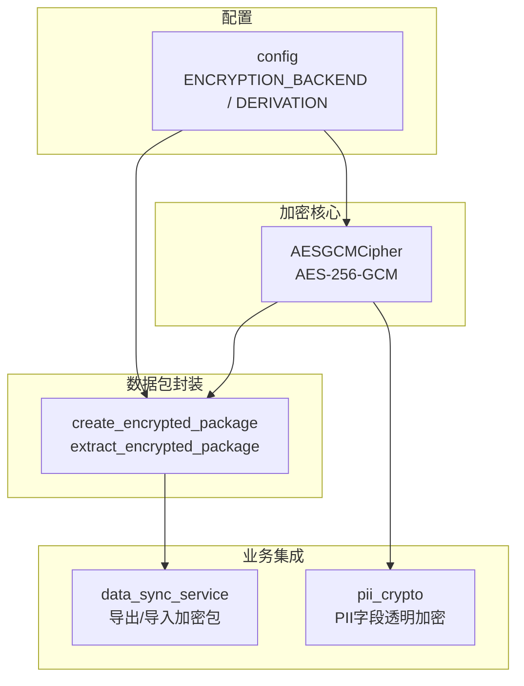
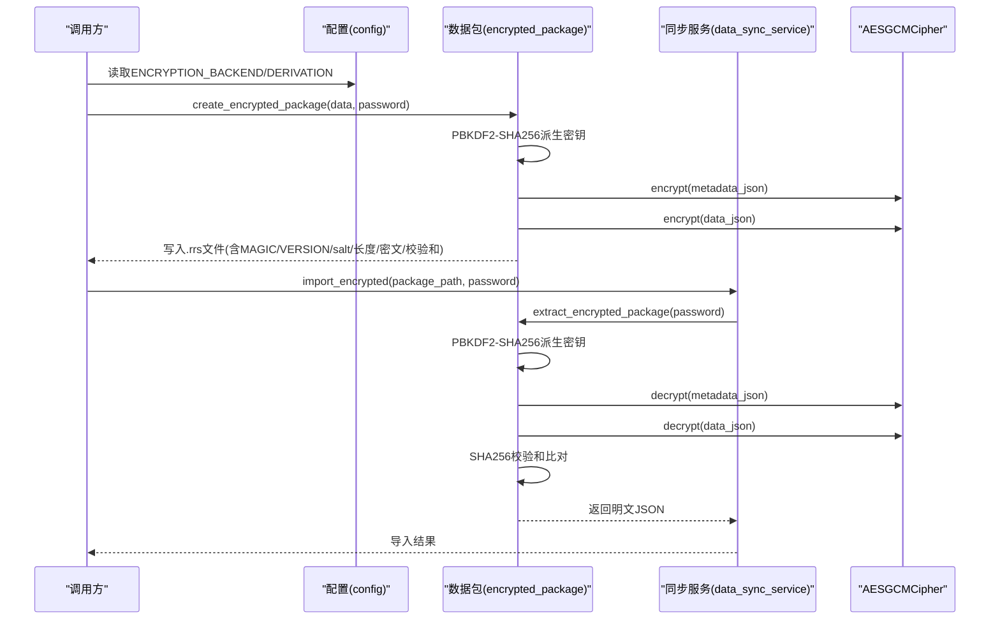
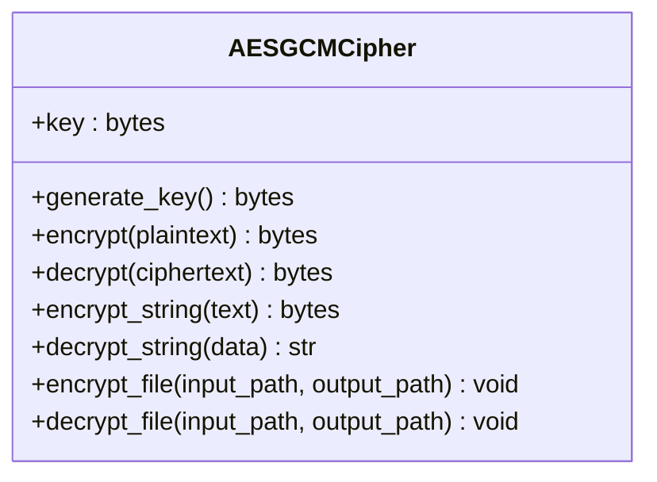
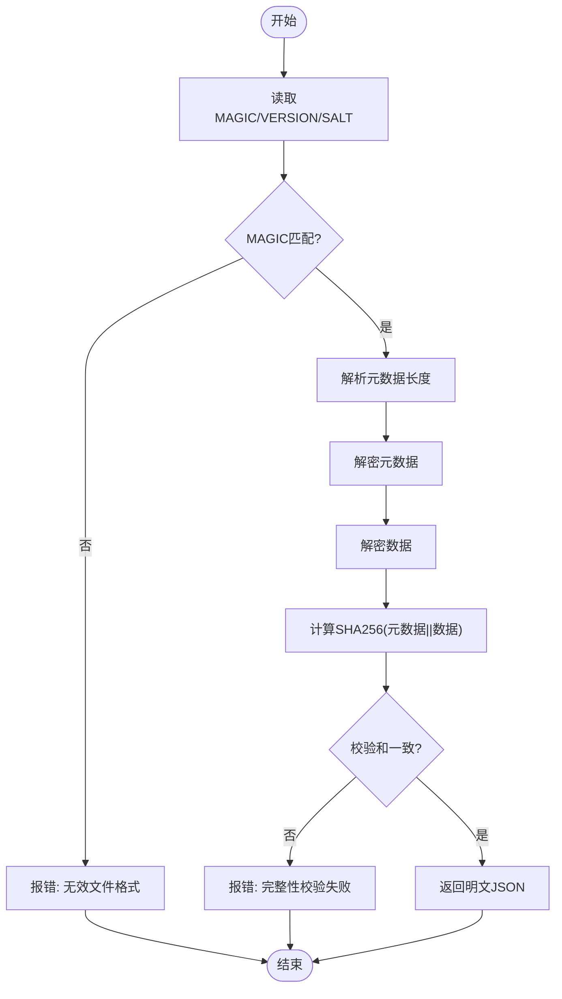
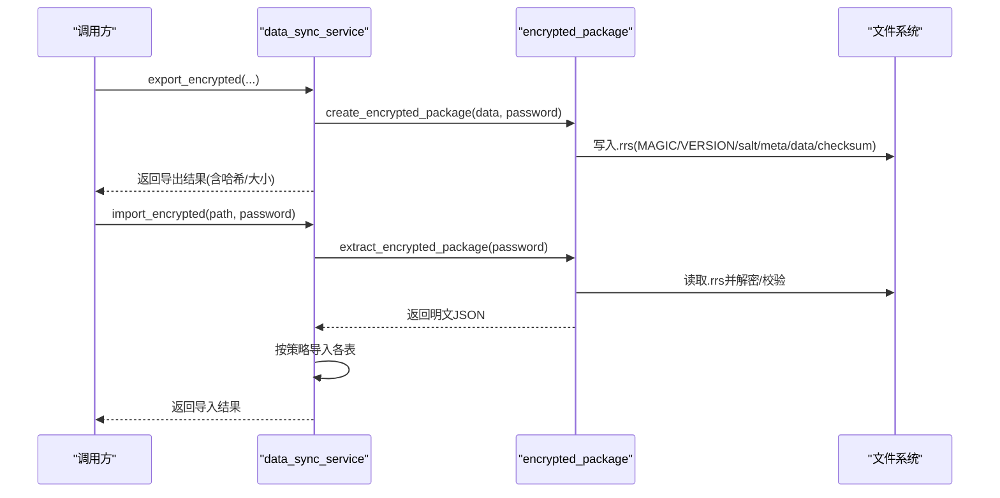
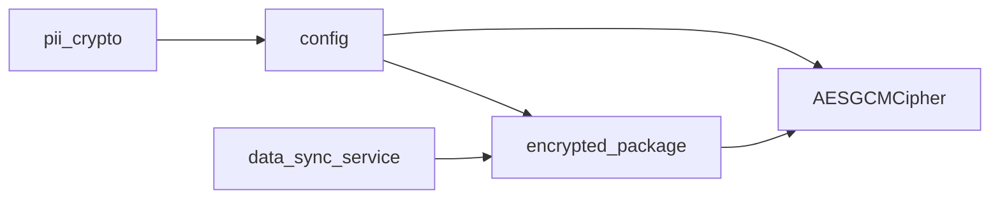

# AES-GCM加密实现

<cite>
**本文引用的文件**
- [backend/app/services/aes_gcm_cipher.py](file://backend/app/services/aes_gcm_cipher.py)
- [backend/tests/unit/test_aes_gcm_cipher.py](file://backend/tests/unit/test_aes_gcm_cipher.py)
- [backend/app/services/encrypted_package.py](file://backend/app/services/encrypted_package.py)
- [backend/app/core/config.py](file://backend/app/core/config.py)
- [backend/app/services/data_sync_service.py](file://backend/app/services/data_sync_service.py)
- [backend/app/core/pii_crypto.py](file://backend/app/core/pii_crypto.py)
</cite>

## 目录
1. [简介](#简介)
2. [项目结构](#项目结构)
3. [核心组件](#核心组件)
4. [架构总览](#架构总览)
5. [详细组件分析](#详细组件分析)
6. [依赖关系分析](#依赖关系分析)
7. [性能与内存管理](#性能与内存管理)
8. [故障排查指南](#故障排查指南)
9. [结论](#结论)
10. [附录：配置与安全建议](#附录配置与安全建议)

## 简介
本技术文档围绕项目中基于AES-256-GCM的认证加密实现，系统阐述算法选型原因、在数据传输安全中的应用场景、GCM模式的认证特性（完整性验证与防重放）、密钥派生、初始化向量（nonce）管理、关联数据（AAD）处理，以及完整的加解密流程示例、错误处理与恢复策略。同时提供性能优化建议、内存管理最佳实践和安全配置指导。

## 项目结构
本项目在后端服务中实现了以AES-256-GCM为核心的认证加密能力，并通过数据包封装、PBKDF2密钥派生、PII字段透明加密等模块形成完整的数据保护方案。关键位置如下：
- 基础加密器：AES-256-GCM封装类
- 数据包封装：离线加密包格式（.rrs），含元数据、密文与完整性校验
- 同步服务：导出/导入加密数据包
- 配置中心：加密后端选择、密钥派生方式等
- PII字段加密：确定性加密（AESSIV）用于可查询敏感字段

图表来源
- [backend/app/services/aes_gcm_cipher.py:13-82](file://backend/app/services/aes_gcm_cipher.py#L13-L82)
- [backend/app/services/encrypted_package.py:26-119](file://backend/app/services/encrypted_package.py#L26-L119)
- [backend/app/services/data_sync_service.py:646-814](file://backend/app/services/data_sync_service.py#L646-L814)
- [backend/app/core/config.py:88-93](file://backend/app/core/config.py#L88-L93)
- [backend/app/core/pii_crypto.py:30-87](file://backend/app/core/pii_crypto.py#L30-L87)

章节来源
- [backend/app/services/aes_gcm_cipher.py:13-82](file://backend/app/services/aes_gcm_cipher.py#L13-L82)
- [backend/app/services/encrypted_package.py:26-119](file://backend/app/services/encrypted_package.py#L26-L119)
- [backend/app/services/data_sync_service.py:646-814](file://backend/app/services/data_sync_service.py#L646-L814)
- [backend/app/core/config.py:88-93](file://backend/app/core/config.py#L88-L93)
- [backend/app/core/pii_crypto.py:30-87](file://backend/app/core/pii_crypto.py#L30-L87)

## 核心组件
- AESGCMCipher：提供AES-256-GCM加解密、随机nonce生成、字符串与文件便捷方法。输出格式为[12字节nonce][密文+16字节认证标签]。
- encrypted_package：定义离线加密包格式（.rrs），使用PBKDF2-SHA256从密码派生密钥，结合AES-256-GCM对元数据与数据进行加密，并在明文层计算SHA256校验和以实现完整性校验。
- data_sync_service：负责导出为加密包与导入解密包，记录日志并支持合并策略。
- config：提供加密后端选择（aes256推荐）与密钥派生方式（pbkdf2或raw）。
- pii_crypto：针对PII字段的确定性加密（AESSIV），通过关联数据绑定上下文，便于等值查询。

章节来源
- [backend/app/services/aes_gcm_cipher.py:13-82](file://backend/app/services/aes_gcm_cipher.py#L13-L82)
- [backend/app/services/encrypted_package.py:26-119](file://backend/app/services/encrypted_package.py#L26-L119)
- [backend/app/services/data_sync_service.py:646-814](file://backend/app/services/data_sync_service.py#L646-L814)
- [backend/app/core/config.py:88-93](file://backend/app/core/config.py#L88-L93)
- [backend/app/core/pii_crypto.py:30-87](file://backend/app/core/pii_crypto.py#L30-L87)

## 架构总览
下图展示从配置到加解密的调用链路与数据流：

图表来源
- [backend/app/core/config.py:88-93](file://backend/app/core/config.py#L88-L93)
- [backend/app/services/encrypted_package.py:26-119](file://backend/app/services/encrypted_package.py#L26-L119)
- [backend/app/services/data_sync_service.py:646-814](file://backend/app/services/data_sync_service.py#L646-L814)
- [backend/app/services/aes_gcm_cipher.py:13-82](file://backend/app/services/aes_gcm_cipher.py#L13-L82)

## 详细组件分析

### AESGCMCipher（AES-256-GCM加解密器）
- 设计要点
  - 每次加密生成随机12字节nonce，确保相同明文多次加密得到不同密文，防止重放攻击。
  - 输出格式固定为[12B nonce][ciphertext + 16B tag]，便于解析与传输。
  - 解密时自动验证GCM认证标签，失败抛出异常并转换为明确的业务错误。
  - 提供字符串与文件便捷方法，简化上层调用。
- 复杂度与性能
  - 时间复杂度O(n)，空间复杂度O(n)，n为明文长度；适合流式或分块处理的扩展。
- 错误处理
  - 过短密文直接拒绝；InvalidTag被捕获并转为ValueError，提示“密钥错误或数据被篡改”。
- 测试覆盖
  - 单元测试覆盖随机性、空数据、大文件、篡改检测、错误密钥等边界情况。

图表来源
- [backend/app/services/aes_gcm_cipher.py:13-82](file://backend/app/services/aes_gcm_cipher.py#L13-L82)

章节来源
- [backend/app/services/aes_gcm_cipher.py:13-82](file://backend/app/services/aes_gcm_cipher.py#L13-L82)
- [backend/tests/unit/test_aes_gcm_cipher.py:24-159](file://backend/tests/unit/test_aes_gcm_cipher.py#L24-L159)

### 离线加密包（.rrs）
- 格式说明
  - 头部：MAGIC(4B)、VERSION(3B)、salt(16B)
  - 元数据：长度(4B)+加密后的metadata_json
  - 数据：加密后的data_json
  - 尾部：SHA256校验和(32B)，对metadata_json与data_json拼接后计算
- 密钥派生
  - 使用PBKDF2-SHA256，迭代次数600,000，从password与salt派生32字节密钥，再交由AESGCMCipher进行加解密。
- 完整性与防篡改
  - 解密后重新计算SHA256并与存储的校验和比对，不一致则拒绝。
- 使用场景
  - 多机U盘物理拷贝同步，支持密码保护与完整性校验。

图表来源
- [backend/app/services/encrypted_package.py:26-119](file://backend/app/services/encrypted_package.py#L26-L119)

章节来源
- [backend/app/services/encrypted_package.py:26-119](file://backend/app/services/encrypted_package.py#L26-L119)

### 数据同步服务（导出/导入加密包）
- 导出流程
  - 组装元数据与导出数据，调用create_encrypted_package生成.rrs文件，记录哈希与大小。
- 导入流程
  - 读取.rrs文件，调用extract_encrypted_package解密并校验，按表导入数据，支持skip/overwrite/merge策略，记录日志。
- 错误处理
  - 文件不存在、解密失败、完整性校验失败均抛出明确错误，并记录日志。

图表来源
- [backend/app/services/data_sync_service.py:646-814](file://backend/app/services/data_sync_service.py#L646-L814)
- [backend/app/services/encrypted_package.py:26-119](file://backend/app/services/encrypted_package.py#L26-L119)

章节来源
- [backend/app/services/data_sync_service.py:646-814](file://backend/app/services/data_sync_service.py#L646-L814)
- [backend/app/services/encrypted_package.py:26-119](file://backend/app/services/encrypted_package.py#L26-L119)

### PII字段透明加密（AESSIV）
- 设计目标
  - 确定性加密：同一明文恒得同一密文，支持等值查询（WHERE phone = :v）。
  - 关联数据绑定：使用固定上下文b"pii-field"作为AAD，增强安全性。
  - 标记前缀：enc.v1:标识已加密值，兼容历史明文。
- 密钥来源
  - 优先使用显式配置的ENCRYPTION_KEY，否则从运行时密钥存储加载或自动生成，缓存于进程内。
- 适用场景
  - 需要等值查询的敏感字段（如手机号、身份证号），权衡泄漏面（暴露等值关系）与可用性。

章节来源
- [backend/app/core/pii_crypto.py:30-87](file://backend/app/core/pii_crypto.py#L30-L87)

## 依赖关系分析
- AESGCMCipher依赖底层cryptography库的AESGCM实现，提供认证加密能力。
- encrypted_package依赖PBKDF2HMAC进行密钥派生，并使用SHA256做完整性校验。
- data_sync_service依赖encrypted_package完成打包与解包，并记录审计日志。
- config提供全局加密后端与派生策略，影响上层行为。
- pii_crypto独立于GCM路径，采用AESSIV实现确定性加密。

图表来源
- [backend/app/core/config.py:88-93](file://backend/app/core/config.py#L88-L93)
- [backend/app/services/aes_gcm_cipher.py:13-82](file://backend/app/services/aes_gcm_cipher.py#L13-L82)
- [backend/app/services/encrypted_package.py:26-119](file://backend/app/services/encrypted_package.py#L26-L119)
- [backend/app/services/data_sync_service.py:646-814](file://backend/app/services/data_sync_service.py#L646-L814)
- [backend/app/core/pii_crypto.py:30-87](file://backend/app/core/pii_crypto.py#L30-L87)

章节来源
- [backend/app/core/config.py:88-93](file://backend/app/core/config.py#L88-L93)
- [backend/app/services/aes_gcm_cipher.py:13-82](file://backend/app/services/aes_gcm_cipher.py#L13-L82)
- [backend/app/services/encrypted_package.py:26-119](file://backend/app/services/encrypted_package.py#L26-L119)
- [backend/app/services/data_sync_service.py:646-814](file://backend/app/services/data_sync_service.py#L646-L814)
- [backend/app/core/pii_crypto.py:30-87](file://backend/app/core/pii_crypto.py#L30-L87)

## 性能与内存管理
- 算法选择与性能
  - AES-256-GCM硬件加速友好，认证与加密并行，吞吐高；适合大数据量导出/导入。
  - PBKDF2迭代次数较高（600,000），提升暴力破解成本，但会增加首次解密开销；建议在离线同步场景使用。
- 内存管理
  - 当前实现一次性读取文件内容到内存，适用于中小文件；对于超大文件建议分块读写与流式处理以降低峰值内存。
  - 避免重复创建cipher实例，可在服务生命周期内复用（注意线程安全）。
- I/O优化
  - 导出时先序列化JSON再加密，减少IO次数；导入时先解密再解析，降低CPU与IO抖动。
- 并发与缓存
  - 在高并发场景下，考虑对cipher实例进行池化或每线程单例，避免锁竞争。
  - 对频繁访问的配置项（如密钥派生参数）进行缓存。

[本节为通用性能建议，不直接分析具体代码文件]

## 故障排查指南
- 常见错误与定位
  - “密文太短”：输入不符合[12B nonce][ct+tag]格式，检查上游是否截断或损坏。
  - “解密失败：密钥错误或数据被篡改”：GCM标签验证失败，核对密码、salt与密钥派生一致性。
  - “完整性校验失败：数据可能被篡改”：SHA256校验和不匹配，检查存储介质或传输过程是否被修改。
  - “不支持的版本/无效的文件格式”：.rrs头部不匹配，确认版本与MAGIC。
- 恢复策略
  - 若校验失败，优先从备份恢复原始.rrs文件；若仅元数据损坏，尝试只修复数据部分。
  - 对于导入失败，记录失败表与行级错误，支持重试与跳过策略。
- 日志与审计
  - 导出/导入操作均记录日志，包含包名、哈希、大小、时间戳与错误详情，便于追溯。

章节来源
- [backend/app/services/aes_gcm_cipher.py:46-59](file://backend/app/services/aes_gcm_cipher.py#L46-L59)
- [backend/app/services/encrypted_package.py:85-119](file://backend/app/services/encrypted_package.py#L85-L119)
- [backend/app/services/data_sync_service.py:706-814](file://backend/app/services/data_sync_service.py#L706-L814)

## 结论
本项目以AES-256-GCM为核心，构建了从基础加解密到离线数据包封装、再到业务集成的完整数据安全链路。通过随机nonce、GCM认证标签与PBKDF2密钥派生，提供了强机密性与完整性保障；配合PII字段确定性加密，满足等值查询需求。整体方案兼顾安全性与可用性，具备清晰的错误处理与审计能力。在生产环境中，建议结合硬件加速、流式处理与密钥轮换策略，进一步提升性能与安全性。

[本节为总结性内容，不直接分析具体代码文件]

## 附录：配置与安全建议
- 加密后端选择
  - 推荐使用aes256（AES-256-GCM），默认开启；旧版兼容fernet可根据迁移需要保留。
- 密钥派生方式
  - 推荐pbkdf2（PBKDF2-SHA256，迭代次数可调），提高抗暴力破解能力；raw模式仅用于内部受控环境。
- 密钥管理
  - 生产环境应通过安全渠道分发主密钥或启用运行时密钥存储；定期轮换并记录版本。
- 传输安全
  - 网络传输需结合TLS；本地离线同步使用.rrs格式并携带完整性校验。
- 合规与基线
  - 遵循最小权限原则，限制对密钥与敏感数据的访问；启用CSRF与速率限制等安全基线。

章节来源
- [backend/app/core/config.py:88-93](file://backend/app/core/config.py#L88-L93)