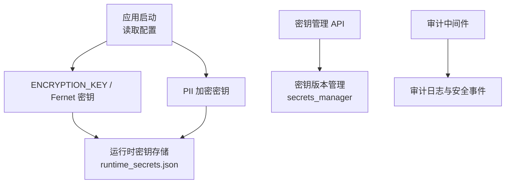
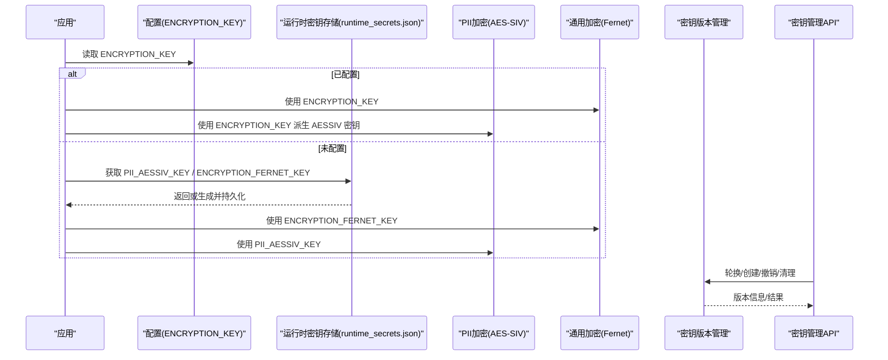
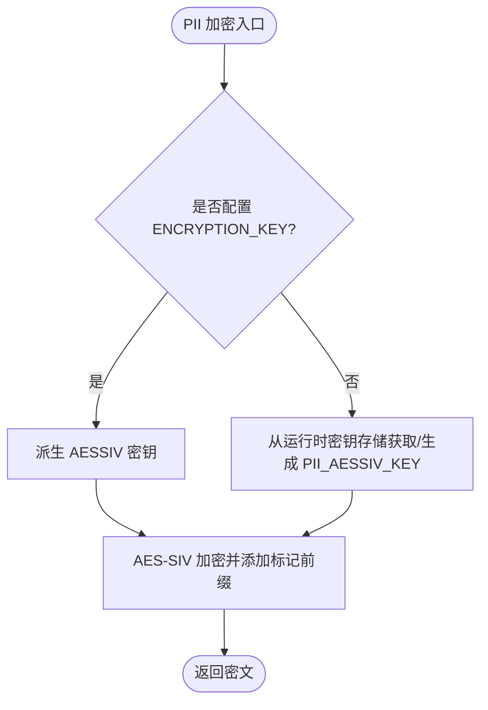
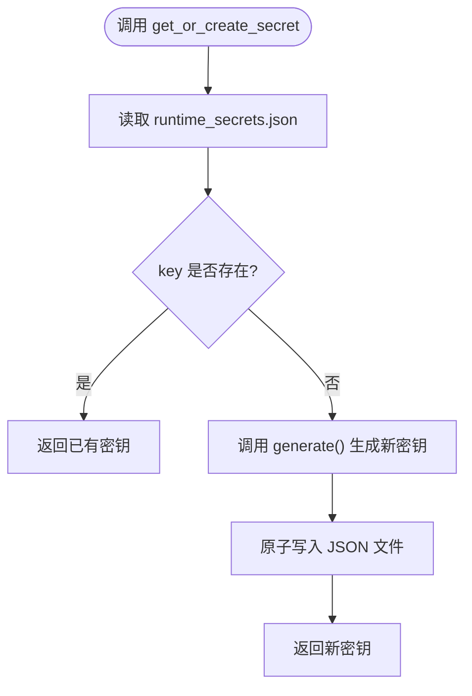
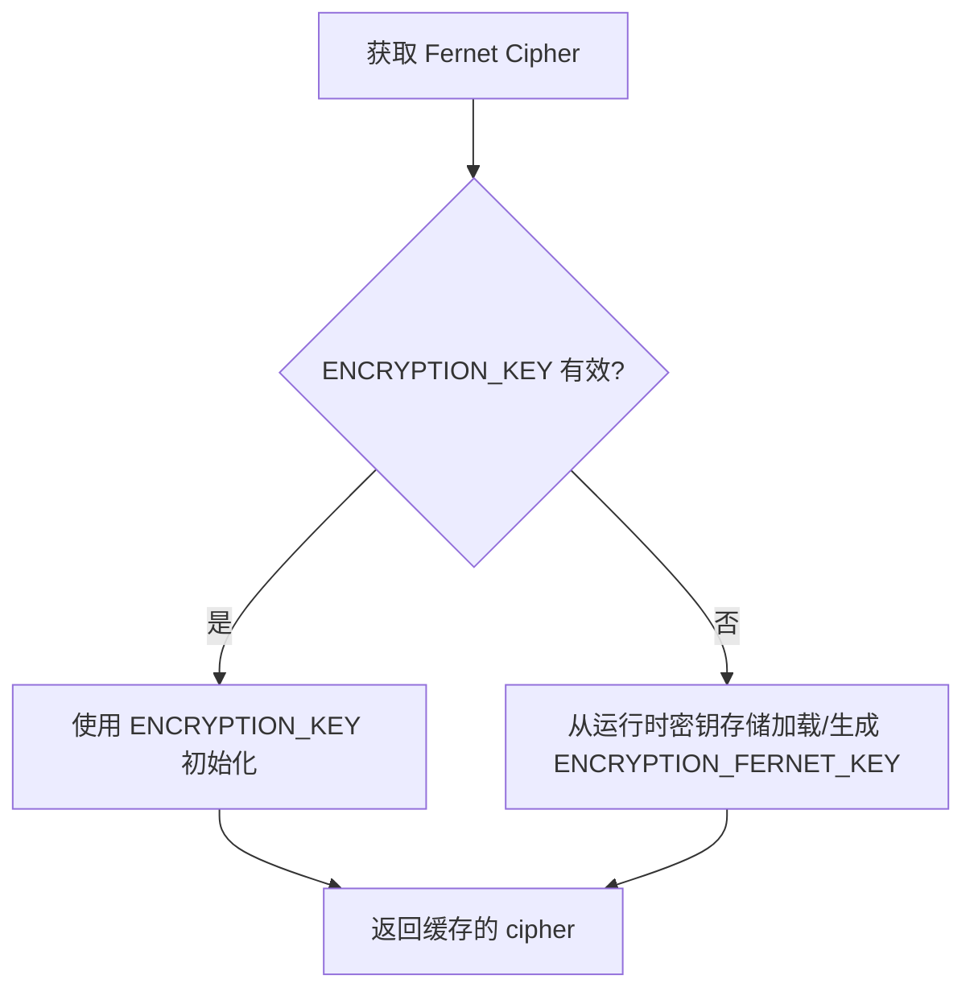
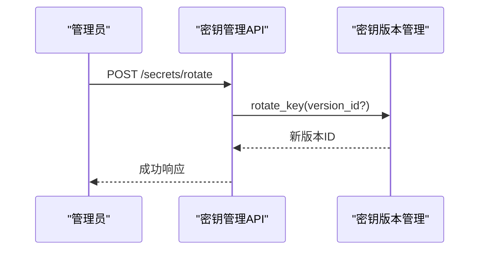
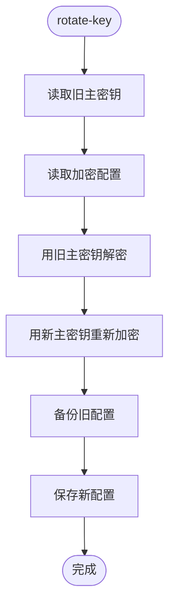
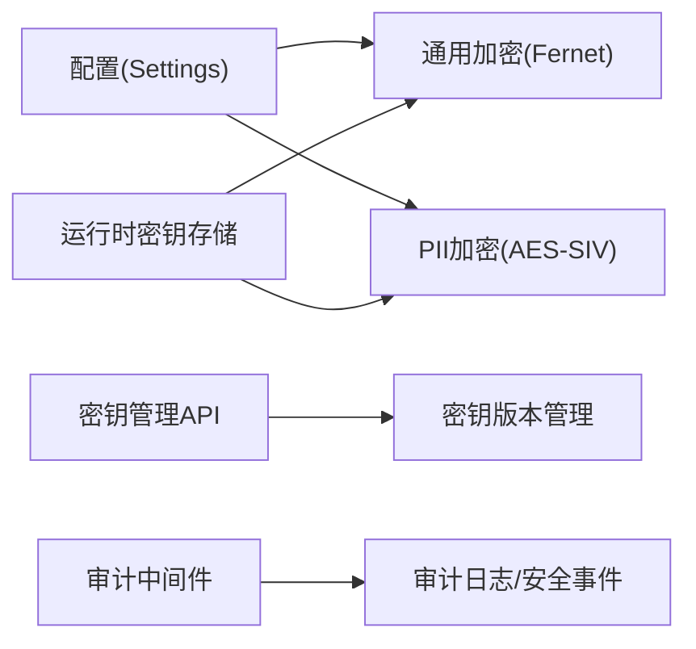

# 密钥管理策略

<cite>
**本文引用的文件**
- [backend/app/core/pii_crypto.py](file://backend/app/core/pii_crypto.py)
- [backend/app/utils/runtime_secrets.py](file://backend/app/utils/runtime_secrets.py)
- [backend/app/services/encryption_service.py](file://backend/app/services/encryption_service.py)
- [backend/app/services/secrets_manager.py](file://backend/app/services/secrets_manager.py)
- [backend/app/api/v1/monitoring/secrets.py](file://backend/app/api/v1/monitoring/secrets.py)
- [backend/scripts/manage_keys.py](file://backend/scripts/manage_keys.py)
- [backend/app/core/config.py](file://backend/app/core/config.py)
- [backend/app/core/audit_middleware.py](file://backend/app/core/audit_middleware.py)
- [backend/app/models/audit.py](file://backend/app/models/audit.py)
</cite>

## 目录
1. [简介](#简介)
2. [项目结构](#项目结构)
3. [核心组件](#核心组件)
4. [架构总览](#架构总览)
5. [详细组件分析](#详细组件分析)
6. [依赖关系分析](#依赖关系分析)
7. [性能考虑](#性能考虑)
8. [故障排查指南](#故障排查指南)
9. [结论](#结论)
10. [附录](#附录)

## 简介
本安全文档围绕系统内“密钥全生命周期管理”展开，覆盖密钥生成、存储、轮换与销毁；重点说明 ENCRYPTION_KEY 与 PII_AESSIV_KEY 两种密钥来源的处理逻辑，以及多机离线同步部署的密钥一致性要求；阐述运行时密钥存储机制（runtime_secrets.json）的访问控制；提供密钥轮换的最佳实践（平滑迁移与业务连续性保障）；并给出密钥泄露应急响应流程与审计日志记录方案。

## 项目结构
与密钥管理相关的代码主要分布在以下模块：
- 配置与运行时密钥：app/core/config.py、app/utils/runtime_secrets.py
- PII 字段加密：app/core/pii_crypto.py
- 通用数据加密服务：app/services/encryption_service.py
- 密钥版本管理与运维 API：app/services/secrets_manager.py、app/api/v1/monitoring/secrets.py
- 配置级主密钥工具：backend/scripts/manage_keys.py
- 审计与事件：app/core/audit_middleware.py、app/models/audit.py

图表来源
- [backend/app/core/config.py:75-93](file://backend/app/core/config.py#L75-L93)
- [backend/app/utils/runtime_secrets.py:20-134](file://backend/app/utils/runtime_secrets.py#L20-L134)
- [backend/app/core/pii_crypto.py:30-57](file://backend/app/core/pii_crypto.py#L30-L57)
- [backend/app/services/encryption_service.py:181-224](file://backend/app/services/encryption_service.py#L181-L224)
- [backend/app/services/secrets_manager.py:13-108](file://backend/app/services/secrets_manager.py#L13-L108)
- [backend/app/api/v1/monitoring/secrets.py:23-111](file://backend/app/api/v1/monitoring/secrets.py#L23-L111)
- [backend/app/core/audit_middleware.py:11-109](file://backend/app/core/audit_middleware.py#L11-L109)

章节来源
- [backend/app/core/config.py:75-93](file://backend/app/core/config.py#L75-L93)
- [backend/app/utils/runtime_secrets.py:20-134](file://backend/app/utils/runtime_secrets.py#L20-L134)
- [backend/app/core/pii_crypto.py:30-57](file://backend/app/core/pii_crypto.py#L30-L57)
- [backend/app/services/encryption_service.py:181-224](file://backend/app/services/encryption_service.py#L181-L224)
- [backend/app/services/secrets_manager.py:13-108](file://backend/app/services/secrets_manager.py#L13-L108)
- [backend/app/api/v1/monitoring/secrets.py:23-111](file://backend/app/api/v1/monitoring/secrets.py#L23-L111)
- [backend/app/core/audit_middleware.py:11-109](file://backend/app/core/audit_middleware.py#L11-L109)

## 核心组件
- 运行时密钥存储（runtime_secrets.json）
  - 负责 SECRET_KEY、CSRF_SECRET_KEY 等运行期密钥的自动生成与持久化，支持原子写入与权限限制。
  - 提供 get_or_create_secret(key, generate) 以按需生成并持久化任意密钥（如 PII_AESSIV_KEY、ENCRYPTION_FERNET_KEY）。
- PII 加密（AES-SIV）
  - 优先使用显式 ENCRYPTION_KEY（SHA-512 派生 64 字节 AESSIV 密钥），否则回退到运行时密钥存储中的 PII_AESSIV_KEY。
  - 密文带标记前缀，便于兼容历史明文；解密失败时原样返回并记录错误日志。
- 通用数据加密服务（Fernet）
  - 优先级：ENCRYPTION_KEY → runtime_secrets.json 中的 ENCRYPTION_FERNET_KEY → 自动创建并持久化。
- 密钥版本管理（secrets_manager）
  - 提供密钥创建、轮换、撤销、过期清理与状态查询能力，并通过管理员鉴权的 API 暴露。
- 配置级主密钥工具（manage_keys.py）
  - 用于生成/轮换/验证配置文件的主密钥，支持对敏感环境变量进行加密存储与再加密。

章节来源
- [backend/app/utils/runtime_secrets.py:20-134](file://backend/app/utils/runtime_secrets.py#L20-L134)
- [backend/app/core/pii_crypto.py:30-57](file://backend/app/core/pii_crypto.py#L30-L57)
- [backend/app/services/encryption_service.py:181-224](file://backend/app/services/encryption_service.py#L181-L224)
- [backend/app/services/secrets_manager.py:13-108](file://backend/app/services/secrets_manager.py#L13-L108)
- [backend/scripts/manage_keys.py:28-239](file://backend/scripts/manage_keys.py#L28-L239)

## 架构总览
下图展示了密钥在系统中的来源、流转与使用路径，包括 PII 加密与通用数据加密两条主线，以及密钥版本管理的运维面。

图表来源
- [backend/app/core/pii_crypto.py:30-57](file://backend/app/core/pii_crypto.py#L30-L57)
- [backend/app/services/encryption_service.py:181-224](file://backend/app/services/encryption_service.py#L181-L224)
- [backend/app/utils/runtime_secrets.py:95-134](file://backend/app/utils/runtime_secrets.py#L95-L134)
- [backend/app/api/v1/monitoring/secrets.py:23-111](file://backend/app/api/v1/monitoring/secrets.py#L23-L111)
- [backend/app/services/secrets_manager.py:71-108](file://backend/app/services/secrets_manager.py#L71-L108)

## 详细组件分析

### 组件一：PII 加密与密钥来源（AES-SIV）
- 密钥来源优先级
  - 首选：ENCRYPTION_KEY（通过 SHA-512 派生 64 字节 AESSIV 密钥）
  - 回退：从运行时密钥存储加载 PII_AESSIV_KEY（若不存在则生成并持久化）
- 多机离线同步部署的一致性要求
  - 若需跨机互导含 PII 的数据，必须确保所有机器配置相同的 ENCRYPTION_KEY；否则不同机器生成的 PII_AESSIV_KEY 不一致会导致无法互相解密。
- 加密/解密行为
  - 密文带标记前缀，便于识别与兼容历史明文；解密失败记录错误日志并原样返回，避免破坏业务流程。

图表来源
- [backend/app/core/pii_crypto.py:30-57](file://backend/app/core/pii_crypto.py#L30-L57)
- [backend/app/utils/runtime_secrets.py:95-134](file://backend/app/utils/runtime_secrets.py#L95-L134)

章节来源
- [backend/app/core/pii_crypto.py:30-57](file://backend/app/core/pii_crypto.py#L30-L57)
- [backend/app/utils/runtime_secrets.py:95-134](file://backend/app/utils/runtime_secrets.py#L95-L134)

### 组件二：运行时密钥存储（runtime_secrets.json）
- 功能要点
  - ensure_runtime_secrets：保证 SECRET_KEY、CSRF_SECRET_KEY 可用；若缺失则生成并原子落盘，同时注入环境变量。
  - get_or_create_secret：按 key 名获取或生成并持久化任意密钥（如 PII_AESSIV_KEY、ENCRYPTION_FERNET_KEY）。
  - 原子写入与权限控制：非 Windows 平台将文件权限设置为仅所有者可读写。
- 访问控制建议
  - 生产环境应限制该文件的文件系统权限为最小必要范围；结合进程权限与备份策略保护。

图表来源
- [backend/app/utils/runtime_secrets.py:95-134](file://backend/app/utils/runtime_secrets.py#L95-L134)
- [backend/app/utils/runtime_secrets.py:145-179](file://backend/app/utils/runtime_secrets.py#L145-L179)

章节来源
- [backend/app/utils/runtime_secrets.py:20-134](file://backend/app/utils/runtime_secrets.py#L20-L134)
- [backend/app/utils/runtime_secrets.py:145-179](file://backend/app/utils/runtime_secrets.py#L145-L179)

### 组件三：通用数据加密服务（Fernet）
- 密钥优先级
  - 优先使用 ENCRYPTION_KEY；若不可用则从运行时密钥存储加载 ENCRYPTION_FERNET_KEY；仍不可用时自动生成并持久化。
- 用途
  - 数据包/字段级别的对称加密；与 PII 加密相互独立，适用于更广泛的场景。

图表来源
- [backend/app/services/encryption_service.py:181-224](file://backend/app/services/encryption_service.py#L181-L224)

章节来源
- [backend/app/services/encryption_service.py:181-224](file://backend/app/services/encryption_service.py#L181-L224)

### 组件四：密钥版本管理与运维 API
- 能力
  - 列表、创建、轮换、撤销、清理过期密钥，以及查询密钥状态。
  - 所有操作需管理员鉴权。
- 典型流程
  - 轮换：生成新版本密钥，停用旧版本（或指定版本），保持至少一个活跃版本。
  - 清理：移除超过保留期的非活跃版本，释放内存与元数据。

图表来源
- [backend/app/api/v1/monitoring/secrets.py:35-48](file://backend/app/api/v1/monitoring/secrets.py#L35-L48)
- [backend/app/services/secrets_manager.py:71-108](file://backend/app/services/secrets_manager.py#L71-L108)

章节来源
- [backend/app/api/v1/monitoring/secrets.py:23-111](file://backend/app/api/v1/monitoring/secrets.py#L23-L111)
- [backend/app/services/secrets_manager.py:13-108](file://backend/app/services/secrets_manager.py#L13-L108)

### 组件五：配置级主密钥工具（manage_keys.py）
- 功能
  - 生成主密钥、加密/解密配置文件、执行密钥轮换（重新加密配置项）。
- 适用场景
  - 当启用 USE_ENCRYPTED_SECRETS 时，使用主密钥对敏感配置进行加密存储与轮换。

图表来源
- [backend/scripts/manage_keys.py:178-239](file://backend/scripts/manage_keys.py#L178-L239)

章节来源
- [backend/scripts/manage_keys.py:28-239](file://backend/scripts/manage_keys.py#L28-L239)

## 依赖关系分析
- 配置层
  - Settings 定义 ENCRYPTION_KEY、ENCRYPTION_BACKEND、ENCRYPTION_KEY_DERIVATION 等开关与参数。
- 运行时密钥
  - runtime_secrets.json 作为持久化载体，被 PII 加密与通用加密服务共同依赖。
- 加密实现
  - PII 加密使用 AES-SIV；通用加密使用 Fernet（AES-128-CBC）。
- 运维面
  - secrets_manager 提供密钥版本管理；API 层提供受控入口。
- 审计面
  - 审计中间件记录请求访问日志；安全事件模型支持安全事件追踪。

图表来源
- [backend/app/core/config.py:75-93](file://backend/app/core/config.py#L75-L93)
- [backend/app/utils/runtime_secrets.py:95-134](file://backend/app/utils/runtime_secrets.py#L95-L134)
- [backend/app/services/encryption_service.py:181-224](file://backend/app/services/encryption_service.py#L181-L224)
- [backend/app/core/pii_crypto.py:30-57](file://backend/app/core/pii_crypto.py#L30-L57)
- [backend/app/api/v1/monitoring/secrets.py:23-111](file://backend/app/api/v1/monitoring/secrets.py#L23-L111)
- [backend/app/core/audit_middleware.py:11-109](file://backend/app/core/audit_middleware.py#L11-L109)
- [backend/app/models/audit.py:65-101](file://backend/app/models/audit.py#L65-L101)

章节来源
- [backend/app/core/config.py:75-93](file://backend/app/core/config.py#L75-L93)
- [backend/app/utils/runtime_secrets.py:95-134](file://backend/app/utils/runtime_secrets.py#L95-L134)
- [backend/app/services/encryption_service.py:181-224](file://backend/app/services/encryption_service.py#L181-L224)
- [backend/app/core/pii_crypto.py:30-57](file://backend/app/core/pii_crypto.py#L30-L57)
- [backend/app/api/v1/monitoring/secrets.py:23-111](file://backend/app/api/v1/monitoring/secrets.py#L23-L111)
- [backend/app/core/audit_middleware.py:11-109](file://backend/app/core/audit_middleware.py#L11-L109)
- [backend/app/models/audit.py:65-101](file://backend/app/models/audit.py#L65-L101)

## 性能考虑
- 密钥缓存
  - PII 加密对 AESSIV 密钥进行进程内缓存，减少重复计算。
  - 通用加密服务对 Fernet cipher 实例进行缓存，降低初始化开销。
- I/O 影响
  - 运行时密钥存储采用原子写入，避免并发写冲突；但频繁写入可能带来磁盘压力，建议仅在密钥变更时触发。
- 解密失败处理
  - PII 解密失败会记录错误日志并返回原值，避免阻塞业务；但需关注异常频率，及时定位密钥不匹配问题。

[本节为通用性能指导，无需特定文件引用]

## 故障排查指南
- 启动阶段
  - 若 ENCRYPTION_KEY 为空且无法读写运行时密钥存储，PII 加密将抛出运行时错误；检查文件权限与磁盘空间。
  - 若运行时密钥文件损坏或无读取权限，将回退到进程内密钥并记录警告。
- 运行时
  - 解密失败：检查密钥是否一致（多机部署需统一 ENCRYPTION_KEY），或确认 PII_AESSIV_KEY/ENCRYPTION_FERNET_KEY 是否被意外替换。
  - 密钥版本管理：若轮换后出现解密失败，确认是否仍有活跃版本；必要时撤销错误版本并恢复至上一稳定版本。
- 审计与告警
  - 审计中间件落库失败不影响业务，但会记录 WARNING；若频繁失败，检查数据库连接与权限。
  - 安全事件可通过审计接口查询，辅助定位异常访问与攻击迹象。

章节来源
- [backend/app/core/pii_crypto.py:50-57](file://backend/app/core/pii_crypto.py#L50-L57)
- [backend/app/utils/runtime_secrets.py:53-93](file://backend/app/utils/runtime_secrets.py#L53-L93)
- [backend/app/services/encryption_service.py:206-224](file://backend/app/services/encryption_service.py#L206-L224)
- [backend/app/core/audit_middleware.py:80-109](file://backend/app/core/audit_middleware.py#L80-L109)

## 结论
本系统实现了分层、可回退的密钥管理机制：
- PII 加密优先使用显式 ENCRYPTION_KEY，确保多机离线同步时的密文一致性；单机场景下自动持久化 PII_AESSIV_KEY。
- 通用数据加密服务同样具备 ENCRYPTION_KEY 与运行时密钥存储的回退能力，保障业务连续性。
- 密钥版本管理提供完整的轮换、撤销与清理能力，配合管理员鉴权 API 满足合规与可审计要求。
- 运行时密钥存储采用原子写入与最小权限原则，提升安全性与稳定性。
- 审计中间件与安全事件模型为密钥相关操作提供可追溯性，支撑应急响应与合规审计。

[本节为总结性内容，无需特定文件引用]

## 附录

### 密钥全生命周期最佳实践
- 生成
  - 生产环境优先配置 ENCRYPTION_KEY；如需跨机共享 PII 密文，务必在所有节点保持一致。
  - 未配置时由运行时密钥存储自动生成并持久化 PII_AESSIV_KEY 与 ENCRYPTION_FERNET_KEY。
- 存储
  - 运行时密钥文件限制最小权限；备份时纳入机密资产保护范围。
  - 启用 USE_ENCRYPTED_SECRETS 时，主密钥文件严格管控访问。
- 轮换
  - 使用密钥管理 API 执行平滑轮换：先创建新版本，再逐步切换依赖方，最后停用旧版本。
  - 配置级主密钥轮换使用 manage_keys.py 的 rotate-key 命令，先备份后替换。
- 销毁
  - 定期清理过期密钥版本；对不再使用的密钥进行撤销并从内存中清除。
  - 删除运行时密钥文件需谨慎，确保有可靠备份与恢复流程。

[本节为通用实践指导，无需特定文件引用]

### 密钥泄露应急响应流程
- 检测与评估
  - 通过审计日志与安全事件接口检索异常访问与可疑操作。
- 隔离与止损
  - 立即撤销受影响密钥版本；必要时暂停相关服务。
- 修复与恢复
  - 生成新密钥并更新配置；对受影响数据进行重新加密（如可行）。
  - 校验各节点密钥一致性，确保服务恢复正常。
- 复盘与加固
  - 完善访问控制与审计策略；加强密钥保管与轮换纪律。

[本节为通用应急流程，无需特定文件引用]

### 审计日志记录方案
- 访问审计
  - 审计中间件记录每次请求的方法、路径、状态码、耗时与用户身份，并落库到审计表。
- 安全事件
  - 安全事件模型支持记录事件类型、严重级别、受影响资源与处理状态，便于追踪与统计。
- 查询与报表
  - 通过审计接口获取统计数据与安全事件列表，支持按时间、级别、类型筛选。

章节来源
- [backend/app/core/audit_middleware.py:11-109](file://backend/app/core/audit_middleware.py#L11-L109)
- [backend/app/models/audit.py:65-101](file://backend/app/models/audit.py#L65-L101)