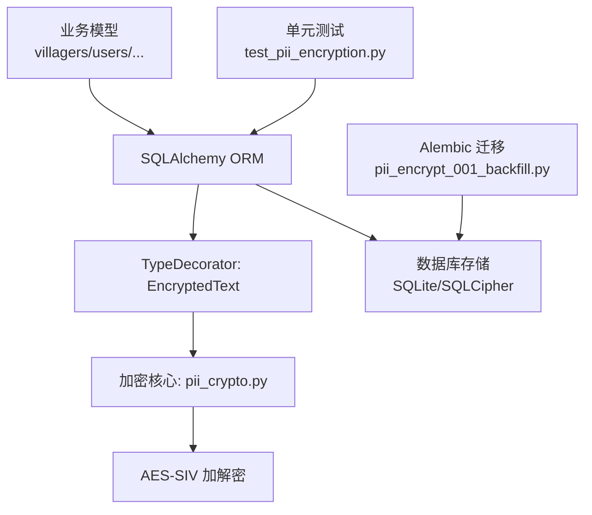
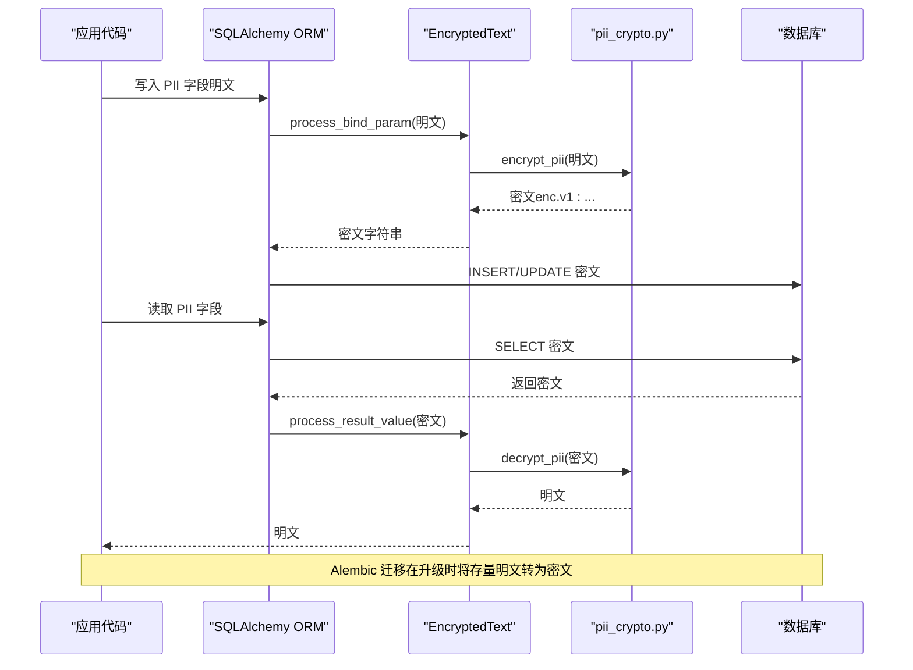
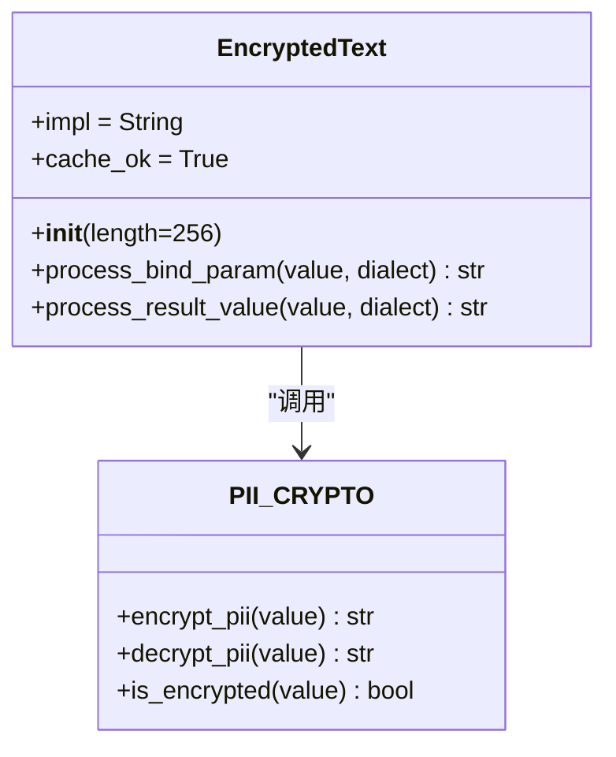
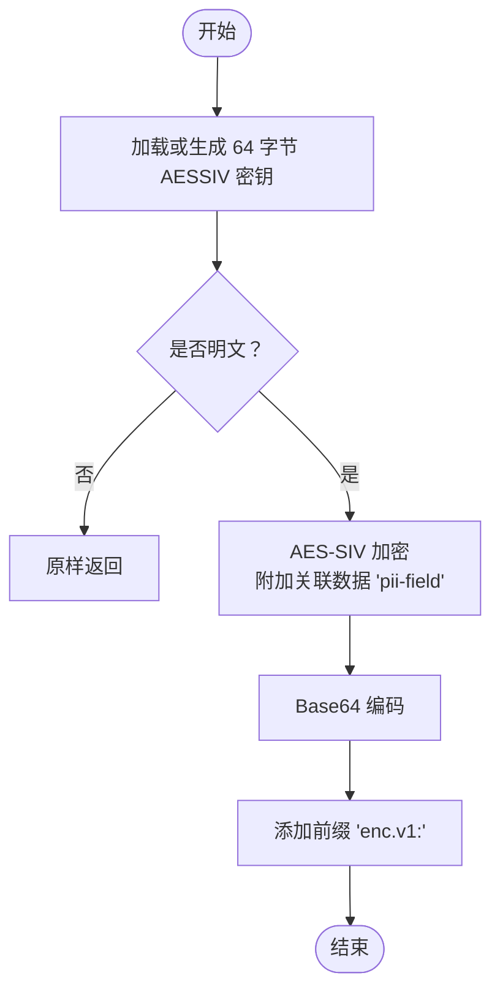
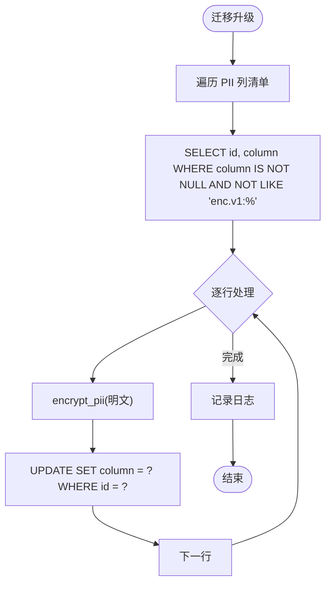
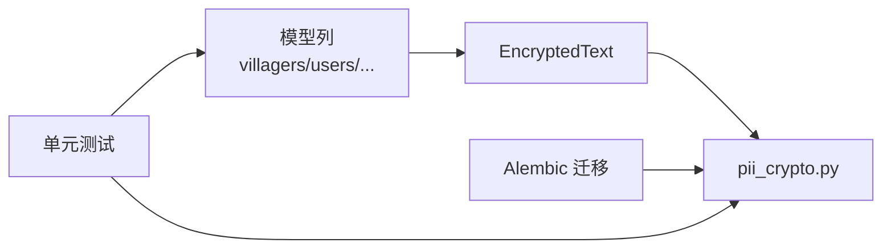

# 敏感信息保护

<cite>
**本文引用的文件**
- [backend/app/core/pii_crypto.py](file://backend/app/core/pii_crypto.py)
- [backend/app/models/base.py](file://backend/app/models/base.py)
- [backend/alembic/versions/pii_encrypt_001_backfill.py](file://backend/alembic/versions/pii_encrypt_001_backfill.py)
- [backend/app/models/village.py](file://backend/app/models/village.py)
- [backend/app/models/user.py](file://backend/app/models/user.py)
- [backend/tests/unit/test_pii_encryption.py](file://backend/tests/unit/test_pii_encryption.py)
</cite>

## 目录
1. [简介](#简介)
2. [项目结构](#项目结构)
3. [核心组件](#核心组件)
4. [架构总览](#架构总览)
5. [详细组件分析](#详细组件分析)
6. [依赖关系分析](#依赖关系分析)
7. [性能考量](#性能考量)
8. [故障排查指南](#故障排查指南)
9. [结论](#结论)
10. [附录：字段级加密最佳实践与使用模式](#附录字段级加密最佳实践与使用模式)

## 简介
本技术文档聚焦于系统内个人身份信息（PII）的透明加密机制。该方案基于 SQLAlchemy 的 TypeDecorator，在 ORM 层对 PII 字段进行“写入即加密、读取即解密”的无缝集成；采用确定性 AES-SIV 算法，使等值查询可直接命中密文索引，无需改写业务 SQL。同时通过密文标记前缀 enc.v1: 实现迁移回填与历史明文兼容，并提供数据完整性验证与防篡改能力。

## 项目结构
与 PII 透明加密相关的代码主要分布在以下位置：
- 加密核心：backend/app/core/pii_crypto.py
- ORM 类型装饰器：backend/app/models/base.py（EncryptedText）
- 存量数据迁移：backend/alembic/versions/pii_encrypt_001_backfill.py
- 已应用加密的模型列：backend/app/models/village.py、backend/app/models/user.py
- 验收测试：backend/tests/unit/test_pii_encryption.py

图表来源
- [backend/app/models/base.py:23-45](file://backend/app/models/base.py#L23-L45)
- [backend/app/core/pii_crypto.py:30-87](file://backend/app/core/pii_crypto.py#L30-L87)
- [backend/alembic/versions/pii_encrypt_001_backfill.py:26-57](file://backend/alembic/versions/pii_encrypt_001_backfill.py#L26-L57)
- [backend/tests/unit/test_pii_encryption.py:36-130](file://backend/tests/unit/test_pii_encryption.py#L36-L130)

章节来源
- [backend/app/models/base.py:23-45](file://backend/app/models/base.py#L23-L45)
- [backend/app/core/pii_crypto.py:30-87](file://backend/app/core/pii_crypto.py#L30-L87)
- [backend/alembic/versions/pii_encrypt_001_backfill.py:26-57](file://backend/alembic/versions/pii_encrypt_001_backfill.py#L26-L57)
- [backend/tests/unit/test_pii_encryption.py:36-130](file://backend/tests/unit/test_pii_encryption.py#L36-L130)

## 核心组件
- 加密核心模块（pii_crypto.py）
  - 提供确定性 AES-SIV 加解密函数 encrypt_pii、decrypt_pii，以及 is_encrypted 判断。
  - 密钥来源优先级：显式 ENCRYPTION_KEY（SHA-512 派生 64 字节 AESSIV 密钥）或运行时密钥存储持久化的 PII_AESSIV_KEY。
  - 关联数据（associated data）固定为 "pii-field"，用于增强完整性校验与防篡改。
- ORM 类型装饰器（EncryptedText）
  - 继承自 String，重写 process_bind_param 与 process_result_value，实现写入加密、读取解密的透明处理。
  - 支持历史明文行原样透出，避免迁移期间报错。
- Alembic 迁移（pii_encrypt_001_backfill.py）
  - 将存量明文 PII 字段就地加密为带 enc.v1: 前缀的密文，幂等且可断点重跑。
  - 提供 downgrade 回退逻辑，失败时保留密文不破坏数据。
- 已应用加密的模型列
  - villagers.id_card、villagers.phone
  - users.phone
  - organizations/projects/rural_works/rural_tasks/schools.contact_phone

章节来源
- [backend/app/core/pii_crypto.py:30-87](file://backend/app/core/pii_crypto.py#L30-L87)
- [backend/app/models/base.py:23-45](file://backend/app/models/base.py#L23-L45)
- [backend/alembic/versions/pii_encrypt_001_backfill.py:26-57](file://backend/alembic/versions/pii_encrypt_001_backfill.py#L26-L57)
- [backend/app/models/village.py:86-90](file://backend/app/models/village.py#L86-L90)
- [backend/app/models/user.py:37-49](file://backend/app/models/user.py#L37-L49)

## 架构总览
下图展示了从 ORM 写入到数据库落盘，再到 ORM 读取的完整流程，以及 Alembic 迁移对存量数据的回填过程。

图表来源
- [backend/app/models/base.py:37-45](file://backend/app/models/base.py#L37-L45)
- [backend/app/core/pii_crypto.py:70-87](file://backend/app/core/pii_crypto.py#L70-L87)
- [backend/alembic/versions/pii_encrypt_001_backfill.py:41-57](file://backend/alembic/versions/pii_encrypt_001_backfill.py#L41-L57)

## 详细组件分析

### 组件A：EncryptedText 类型装饰器
EncryptedText 是 SQLAlchemy 的 TypeDecorator，负责在 ORM 层对 PII 字段进行透明加解密：
- 写入阶段：调用 encrypt_pii，将明文转换为带 enc.v1: 前缀的密文。
- 读取阶段：调用 decrypt_pii，将密文还原为明文；若未标记或解密失败，则原样返回，保证兼容性。

图表来源
- [backend/app/models/base.py:23-45](file://backend/app/models/base.py#L23-L45)
- [backend/app/core/pii_crypto.py:66-87](file://backend/app/core/pii_crypto.py#L66-L87)

章节来源
- [backend/app/models/base.py:23-45](file://backend/app/models/base.py#L23-L45)

### 组件B：AES-SIV 确定性加密与密钥管理
- 确定性加密：同一明文恒得同一密文，使得 WHERE phone = :v 查询经绑定参数加密后可直接命中密文索引，无需额外哈希列或查询改写。
- 密钥来源：
  - 优先使用显式配置的 ENCRYPTION_KEY，并通过 SHA-512 派生 64 字节 AESSIV 密钥。
  - 若未配置，则从运行时密钥存储加载或生成 PII_AESSIV_KEY，并缓存以避免重复计算。
- 关联数据：固定为 "pii-field"，用于增强完整性校验与防篡改。

图表来源
- [backend/app/core/pii_crypto.py:30-75](file://backend/app/core/pii_crypto.py#L30-L75)

章节来源
- [backend/app/core/pii_crypto.py:30-75](file://backend/app/core/pii_crypto.py#L30-L75)

### 组件C：Alembic 存量回填迁移
迁移脚本遍历所有需要加密的 PII 列，将存量明文就地加密为 enc.v1: 标记密文：
- 幂等设计：跳过已加密值，支持断点重跑。
- 降级回退：downgrade 将密文解密回明文，失败时保留密文不破坏数据。
- 清单一致性：迁移中的表/列清单与模型中 EncryptedText 列保持一致，防止漂移。

图表来源
- [backend/alembic/versions/pii_encrypt_001_backfill.py:26-57](file://backend/alembic/versions/pii_encrypt_001_backfill.py#L26-L57)

章节来源
- [backend/alembic/versions/pii_encrypt_001_backfill.py:26-57](file://backend/alembic/versions/pii_encrypt_001_backfill.py#L26-L57)

### 组件D：已应用加密的模型列
以下模型列已使用 EncryptedText 进行透明加密：
- villagers.id_card、villagers.phone
- users.phone
- organizations/projects/rural_works/rural_tasks/schools.contact_phone

这些列在写入时自动加密，读取时自动解密，业务代码无需感知加密细节。

章节来源
- [backend/app/models/village.py:86-90](file://backend/app/models/village.py#L86-L90)
- [backend/app/models/user.py:37-49](file://backend/app/models/user.py#L37-L49)

## 依赖关系分析
- EncryptedText 依赖 pii_crypto 的加密/解密函数。
- Alembic 迁移依赖 pii_crypto 的加密函数进行存量数据回填。
- 模型列通过 EncryptedText 间接依赖加密核心。
- 单元测试覆盖端到端行为：写入密文、读取明文、等值查询命中、DB 文件无明文、历史明文兼容。

图表来源
- [backend/app/models/base.py:23-45](file://backend/app/models/base.py#L23-L45)
- [backend/app/core/pii_crypto.py:30-87](file://backend/app/core/pii_crypto.py#L30-L87)
- [backend/alembic/versions/pii_encrypt_001_backfill.py:26-57](file://backend/alembic/versions/pii_encrypt_001_backfill.py#L26-L57)
- [backend/tests/unit/test_pii_encryption.py:36-130](file://backend/tests/unit/test_pii_encryption.py#L36-L130)

章节来源
- [backend/app/models/base.py:23-45](file://backend/app/models/base.py#L23-L45)
- [backend/app/core/pii_crypto.py:30-87](file://backend/app/core/pii_crypto.py#L30-L87)
- [backend/alembic/versions/pii_encrypt_001_backfill.py:26-57](file://backend/alembic/versions/pii_encrypt_001_backfill.py#L26-L57)
- [backend/tests/unit/test_pii_encryption.py:36-130](file://backend/tests/unit/test_pii_encryption.py#L36-L130)

## 性能考量
- 确定性 AES-SIV 使等值查询可直接命中密文索引，无需额外哈希列或查询改写，降低查询成本。
- 密钥缓存避免重复派生，提升加解密性能。
- SQLite 不强制 VARCHAR 长度，密文长度（≤55 字符）无需调整列宽，减少迁移复杂度。
- 已知限制：data_sync 裸 SQL 跨异密钥机器同步时 PII 列显示密文，需后续优化同步管道。

[本节为通用性能讨论，不直接分析具体文件]

## 故障排查指南
- 解密失败：当密文损坏或密钥不匹配时，decrypt_pii 会记录错误日志并原样返回密文，便于定位问题。
- 历史明文兼容：未标记的历史明文行在读取时原样透出，不会二次加密，确保平滑过渡。
- 迁移幂等：迁移脚本跳过已加密值，支持断点重跑，避免重复处理。
- 单元测试覆盖：包括往返加密、等值查询命中、DB 文件无明文、历史明文兼容、迁移清单一致性等场景。

章节来源
- [backend/app/core/pii_crypto.py:78-87](file://backend/app/core/pii_crypto.py#L78-L87)
- [backend/tests/unit/test_pii_encryption.py:99-130](file://backend/tests/unit/test_pii_encryption.py#L99-L130)

## 结论
本方案通过 TypeDecorator 与确定性 AES-SIV 加密，实现了 PII 字段的透明加密与等值查询优化，兼顾安全性与性能。密文标记前缀 enc.v1: 确保了迁移兼容性与历史数据平滑过渡。结合 Alembic 迁移与单元测试，提供了完整的生命周期管理与质量保障。

[本节为总结性内容，不直接分析具体文件]

## 附录：字段级加密最佳实践与使用模式
- 字段定义：在模型中使用 EncryptedText 声明 PII 字段，例如 villagers.id_card、users.phone。
- 写入数据：直接赋值明文，ORM 会自动加密后落库。
- 查询优化：使用等值查询 WHERE phone = :v，绑定参数会被加密，直接命中密文索引。
- 读取数据：ORM 自动解密，业务代码获取明文。
- 迁移策略：执行 Alembic 迁移将存量明文转为密文，确保数据一致性。
- 密钥管理：生产环境建议配置显式 ENCRYPTION_KEY，确保多机离线同步时密文可互导。
- 安全边界：确定性加密暴露等值关系（同号可识别），但不暴露明文；适用于无范围查询需求的 PII 字段。

章节来源
- [backend/app/models/village.py:86-90](file://backend/app/models/village.py#L86-L90)
- [backend/app/models/user.py:37-49](file://backend/app/models/user.py#L37-L49)
- [backend/alembic/versions/pii_encrypt_001_backfill.py:26-57](file://backend/alembic/versions/pii_encrypt_001_backfill.py#L26-L57)
- [backend/tests/unit/test_pii_encryption.py:74-84](file://backend/tests/unit/test_pii_encryption.py#L74-L84)