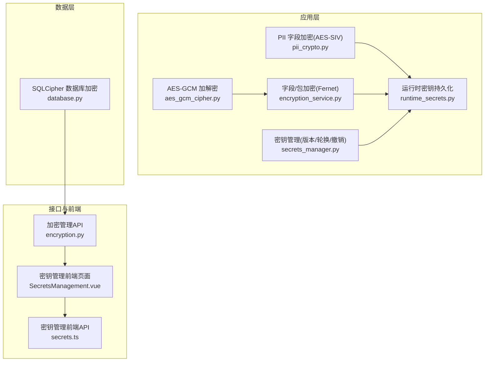
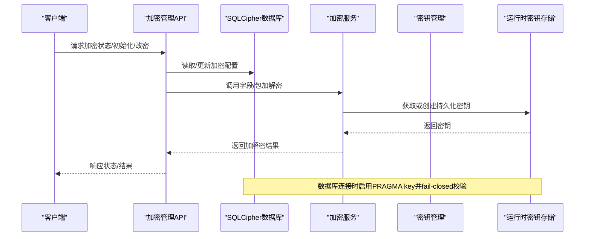
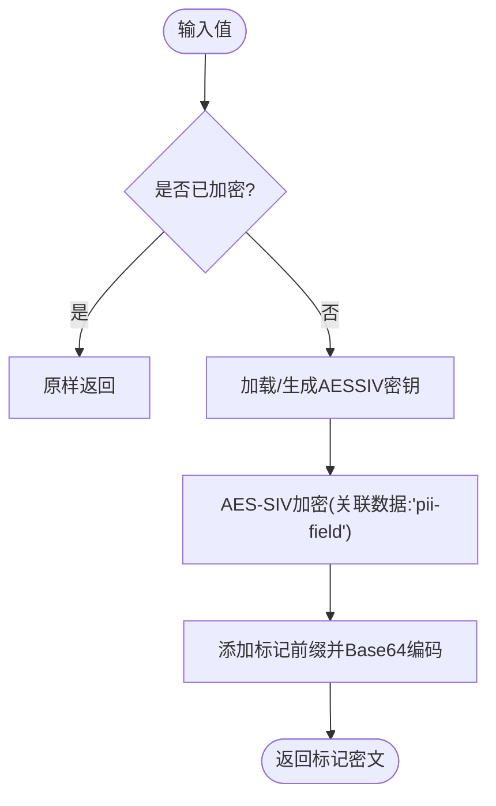
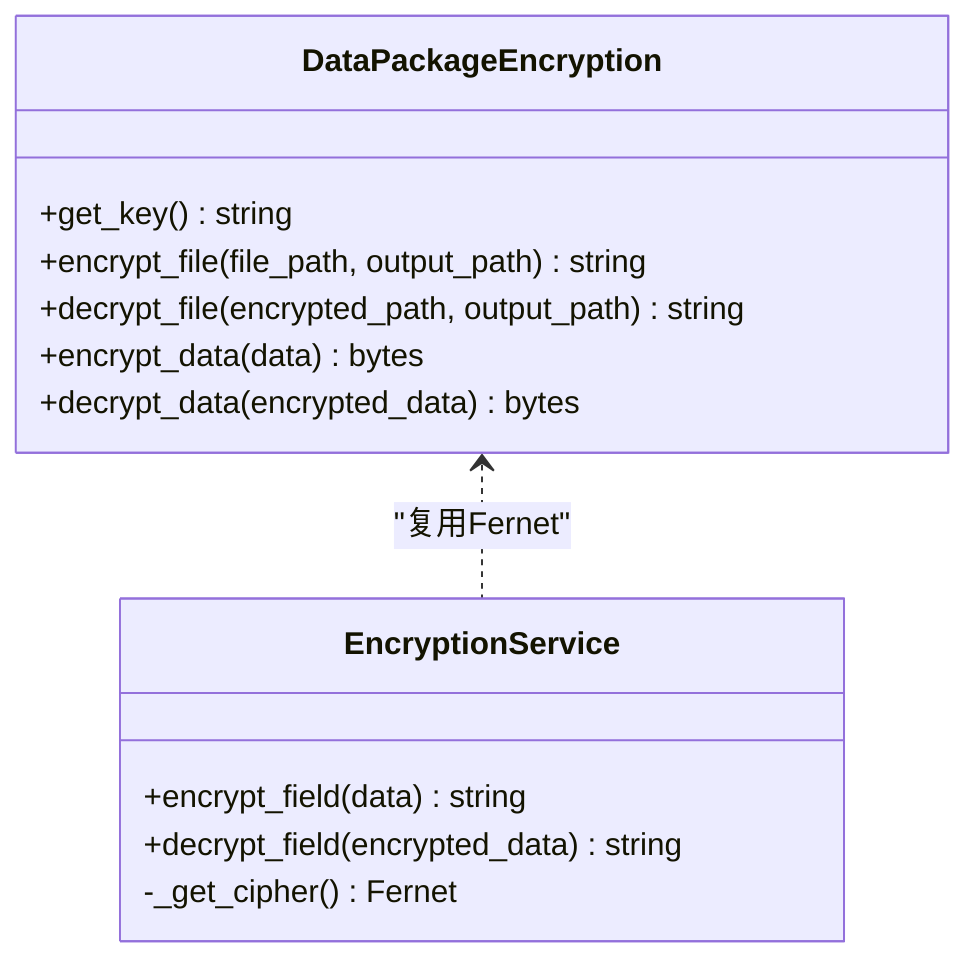
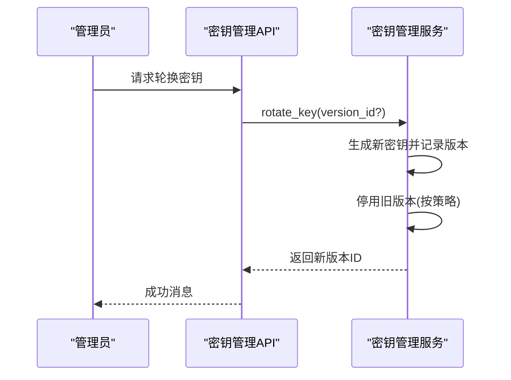
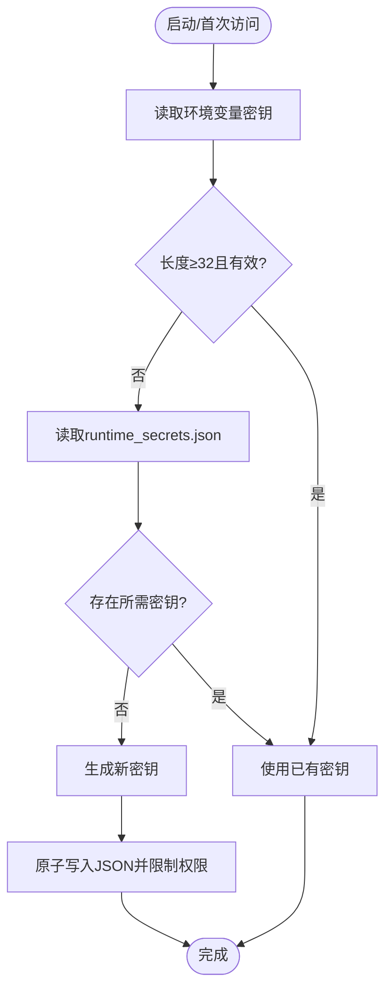
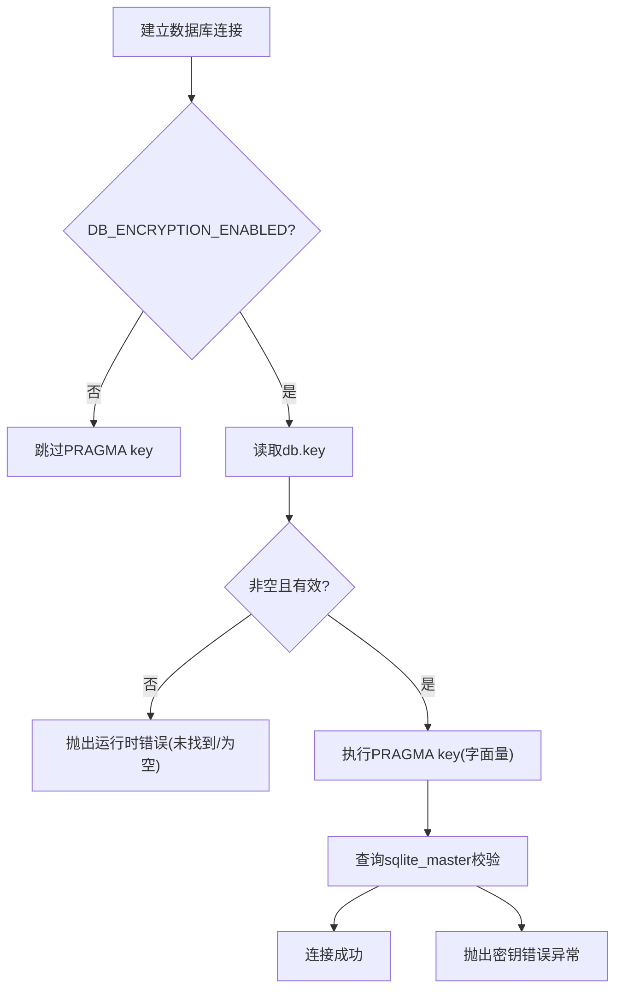
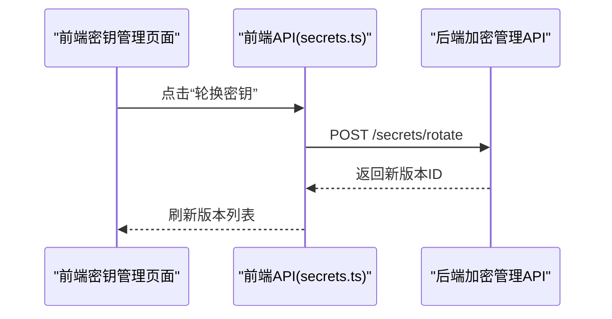
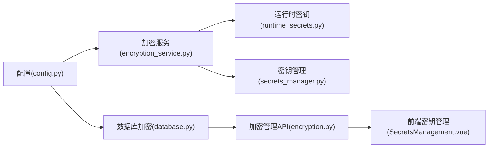

# 数据加密方案

<cite>
**本文引用的文件**
- [aes_gcm_cipher.py](file://backend/app/services/aes_gcm_cipher.py)
- [pii_crypto.py](file://backend/app/core/pii_crypto.py)
- [encryption_service.py](file://backend/app/services/encryption_service.py)
- [secrets_manager.py](file://backend/app/services/secrets_manager.py)
- [runtime_secrets.py](file://backend/app/utils/runtime_secrets.py)
- [config.py](file://backend/app/core/config.py)
- [database.py](file://backend/app/core/database.py)
- [encryption.py](file://backend/app/api/v1/encryption.py)
- [test_aes_gcm_cipher.py](file://backend/tests/unit/test_aes_gcm_cipher.py)
- [test_encryption_service_complete.py](file://backend/tests/unit/test_encryption_service_complete.py)
- [test_database_core.py](file://backend/tests/unit/test_database_core.py)
- [SecretsManagement.vue](file://frontend/src/views/system/SecretsManagement.vue)
- [secrets.ts](file://frontend/src/api/secrets.ts)
</cite>

## 目录
1. [简介](#简介)
2. [项目结构](#项目结构)
3. [核心组件](#核心组件)
4. [架构总览](#架构总览)
5. [详细组件分析](#详细组件分析)
6. [依赖关系分析](#依赖关系分析)
7. [性能考虑](#性能考虑)
8. [故障排查指南](#故障排查指南)
9. [结论](#结论)
10. [附录](#附录)

## 简介
本安全文档面向“帮扶管理信息系统”的数据加密方案，覆盖敏感信息保护策略、PII 字段级加密与查询兼容、AES-GCM 高安全离线加密、密钥全生命周期管理（生成、轮换、存储、销毁）、传输层加密与前端脱敏展示，以及性能优化与最佳实践。方案采用分层防御：数据库层（SQLCipher）+ 应用层（AES-SIV/AES-GCM/Fernet）+ 前端脱敏 + 运维侧密钥管理 API，确保静态数据、传输数据与应用内处理数据均得到充分保护。

## 项目结构
后端加密相关能力主要分布在以下模块：
- 应用层通用加密服务：提供 Fernet 字段加解密与数据包加解密
- PII 字段透明加密：基于 AES-SIV 的确定性加密，支持等值查询零改写
- 高安全离线加密：基于 AES-256-GCM 的 AEAD 加解密，带完整性校验
- 密钥管理服务：密钥版本化、轮换、撤销、清理
- 运行时密钥持久化：自动创建并原子落盘，限制权限
- 数据库加密：SQLCipher 连接时启用 PRAGMA key，fail-closed 校验
- 系统配置与 API：数据库加密初始化/修改密码/禁用状态查询
- 前端密钥管理界面：密钥创建、轮换、过期清理、版本列表



**图示来源**
- [aes_gcm_cipher.py:1-82](file://backend/app/services/aes_gcm_cipher.py#L1-L82)
- [pii_crypto.py:1-94](file://backend/app/core/pii_crypto.py#L1-L94)
- [encryption_service.py:1-261](file://backend/app/services/encryption_service.py#L1-L261)
- [secrets_manager.py:1-193](file://backend/app/services/secrets_manager.py#L1-L193)
- [runtime_secrets.py:1-179](file://backend/app/utils/runtime_secrets.py#L1-L179)
- [database.py:110-131](file://backend/app/core/database.py#L110-L131)
- [encryption.py:1-196](file://backend/app/api/v1/encryption.py#L1-L196)
- [SecretsManagement.vue:42-67](file://frontend/src/views/system/SecretsManagement.vue#L42-L67)
- [secrets.ts:1-57](file://frontend/src/api/secrets.ts#L1-L57)

**章节来源**
- [config.py:75-94](file://backend/app/core/config.py#L75-L94)
- [database.py:110-131](file://backend/app/core/database.py#L110-L131)

## 核心组件
- AES-256-GCM 加解密器：提供随机 nonce 的 AEAD 加密，密文包含认证标签，用于高安全离线场景与文件/大对象加密。
- PII 字段透明加密：基于 AES-SIV 的确定性加密，同一明文恒得同一密文，配合 TypeDecorator 实现等值查询零改写；密文以标记前缀识别，兼容历史明文。
- 字段/包加密服务：基于 Fernet 的对称加密，提供字段级与数据包级加解密，支持密钥从环境变量或运行时密钥存储加载。
- 密钥管理服务：支持密钥版本化、轮换、撤销、过期清理，便于合规审计与风险控制。
- 运行时密钥持久化：自动生成并原子写入 JSON，非 Windows 平台限制文件权限为 0o600，避免越权读取。
- SQLCipher 数据库加密：连接时设置 PRAGMA key，并进行 fail-closed 校验，防止“假加密”。

**章节来源**
- [aes_gcm_cipher.py:13-82](file://backend/app/services/aes_gcm_cipher.py#L13-L82)
- [pii_crypto.py:1-94](file://backend/app/core/pii_crypto.py#L1-L94)
- [encryption_service.py:12-261](file://backend/app/services/encryption_service.py#L12-L261)
- [secrets_manager.py:13-193](file://backend/app/services/secrets_manager.py#L13-L193)
- [runtime_secrets.py:20-179](file://backend/app/utils/runtime_secrets.py#L20-L179)
- [database.py:110-131](file://backend/app/core/database.py#L110-L131)

## 架构总览
整体架构遵循“纵深防御”原则：
- 静态数据：数据库层使用 SQLCipher 进行整库加密；PII 字段在应用层使用 AES-SIV 确定性加密，既保护静态数据又支持等值查询。
- 传输数据：通过 HTTPS/TLS 保障传输安全；系统策略中强制最小加密级别与完整性校验动作。
- 应用内处理：对敏感字段与数据包使用 Fernet/AES-GCM 进行加解密；密钥由运行时密钥存储或配置注入，支持轮换与撤销。
- 前端展示：对敏感信息进行脱敏显示，降低泄露面。



**图示来源**
- [encryption.py:67-196](file://backend/app/api/v1/encryption.py#L67-L196)
- [database.py:110-131](file://backend/app/core/database.py#L110-L131)
- [encryption_service.py:171-261](file://backend/app/services/encryption_service.py#L171-L261)
- [runtime_secrets.py:95-179](file://backend/app/utils/runtime_secrets.py#L95-L179)

## 详细组件分析

### AES-256-GCM 加解密器
- 设计要点：每次加密使用随机 12 字节 nonce，密文格式为 [nonce][ciphertext+tag]；解密时验证认证标签，篡改或错误密钥将抛出异常。
- 适用场景：高安全离线加密、文件与大对象加密、需要完整性校验的场景。
- 性能特征：AEAD 一次性计算 tag，适合流式或分块处理；测试覆盖空串、大数据、不同输出、篡改拒绝、错误密钥拒绝等边界。

```mermaid
flowchart TD
Start(["加密入口"]) --> GenNonce["生成随机12字节nonce"]
GenNonce --> AEADEncrypt["AES-GCM加密(无A附加数据)"]
AEADEncrypt --> AppendTag["拼接nonce与密文+tag"]
AppendTag --> End(["返回密文"])
StartD(["解密入口"]) --> CheckLen{"长度>=28?"}
CheckLen -- 否 --> ErrShort["抛出'密文太短'"]
CheckLen -- 是 --> Split["拆分nonce与密文+tag"]
Split --> AEADD Decrypt["AES-GCM解密并验证tag"]
AEADD Decrypt --> Ok["返回明文"]
AEADD Decrypt --> ErrTag["抛出'密钥错误或数据被篡改'"]
```

**图示来源**
- [aes_gcm_cipher.py:36-59](file://backend/app/services/aes_gcm_cipher.py#L36-L59)

**章节来源**
- [aes_gcm_cipher.py:13-82](file://backend/app/services/aes_gcm_cipher.py#L13-L82)
- [test_aes_gcm_cipher.py:47-114](file://backend/tests/unit/test_aes_gcm_cipher.py#L47-L114)

### PII 字段透明加密（AES-SIV）
- 设计要点：确定性加密（同明文恒同密文），结合 TypeDecorator 使既有 WHERE 绑定参数直接命中密文，无需改写查询；密文以标记前缀标识，兼容历史明文行。
- 密钥来源：优先使用显式配置的 ENCRYPTION_KEY（SHA-512 派生 64 字节 AESSIV 密钥），否则从运行时密钥存储加载 PII_AESSIV_KEY；多机离线同步需一致配置。
- 安全性权衡：确定性加密暴露等值关系，但不暴露明文；适用于身份证、电话等无范围查询需求的字段。



**图示来源**
- [pii_crypto.py:30-87](file://backend/app/core/pii_crypto.py#L30-L87)

**章节来源**
- [pii_crypto.py:1-94](file://backend/app/core/pii_crypto.py#L1-L94)

### 字段/包加密服务（Fernet）
- 功能：提供字段级与数据包级加解密；支持从环境变量或运行时密钥存储加载密钥，具备缓存机制提升性能。
- 密钥优先级：ENCRYPTION_KEY > 运行时密钥存储中的持久化密钥 > 新生成并持久化。
- 适用场景：通用字段加密、导出/导入数据包加密、临时敏感数据处理。



**图示来源**
- [encryption_service.py:12-176](file://backend/app/services/encryption_service.py#L12-L176)
- [encryption_service.py:177-261](file://backend/app/services/encryption_service.py#L177-L261)

**章节来源**
- [encryption_service.py:12-261](file://backend/app/services/encryption_service.py#L12-L261)
- [test_encryption_service_complete.py:195-233](file://backend/tests/unit/test_encryption_service_complete.py#L195-L233)

### 密钥管理服务（版本化与轮换）
- 能力：密钥版本列表、轮换（可指定停用旧版本或全部其他版本）、撤销、过期清理；默认初始化为活跃版本。
- 存储：内存中维护密钥与版本元数据；可通过外部持久化扩展。
- 适用场景：合规审计、风险隔离、灰度轮换、到期清理。



**图示来源**
- [secrets_manager.py:67-108](file://backend/app/services/secrets_manager.py#L67-L108)

**章节来源**
- [secrets_manager.py:13-193](file://backend/app/services/secrets_manager.py#L13-L193)
- [test_secrets_manager_full.py:66-114](file://backend/tests/unit/test_secrets_manager_full.py#L66-L114)

### 运行时密钥持久化
- 能力：自动检测缺失弱密钥并重新生成；原子写入 JSON 并在非 Windows 平台限制权限为 0o600；支持任意键值的 get_or_create_secret。
- 适用场景：开发/安装包异常启动时的密钥兜底；跨重启保持加密密钥可用。



**图示来源**
- [runtime_secrets.py:20-93](file://backend/app/utils/runtime_secrets.py#L20-L93)
- [runtime_secrets.py:95-179](file://backend/app/utils/runtime_secrets.py#L95-L179)

**章节来源**
- [runtime_secrets.py:20-179](file://backend/app/utils/runtime_secrets.py#L20-L179)

### 数据库加密（SQLCipher）
- 行为：当启用数据库加密时，连接首条语句执行 PRAGMA key（字面量），随后主动查询 schema 以 fail-fast 校验密钥正确性；若密钥文件缺失或为空则拒绝启动。
- 防护：防止普通 sqlite3 静默忽略 PRAGMA key 造成的“假加密”，确保真实加密生效。



**图示来源**
- [database.py:110-131](file://backend/app/core/database.py#L110-L131)
- [test_database_core.py:121-202](file://backend/tests/unit/test_database_core.py#L121-L202)

**章节来源**
- [database.py:110-131](file://backend/app/core/database.py#L110-L131)
- [test_database_core.py:121-202](file://backend/tests/unit/test_database_core.py#L121-L202)

### 加密管理 API 与前端
- API：提供数据库加密初始化、修改密码、状态查询、禁用等功能；所有操作需管理员鉴权并记录工作日志。
- 前端：提供密钥管理界面，支持创建密钥、轮换、清理过期密钥、查看版本列表；通过统一 API 调用后端。



**图示来源**
- [encryption.py:67-196](file://backend/app/api/v1/encryption.py#L67-L196)
- [SecretsManagement.vue:42-67](file://frontend/src/views/system/SecretsManagement.vue#L42-L67)
- [secrets.ts:46-57](file://frontend/src/api/secrets.ts#L46-L57)

**章节来源**
- [encryption.py:1-196](file://backend/app/api/v1/encryption.py#L1-L196)
- [SecretsManagement.vue:42-67](file://frontend/src/views/system/SecretsManagement.vue#L42-L67)
- [secrets.ts:1-57](file://frontend/src/api/secrets.ts#L1-L57)

## 依赖关系分析
- 加密算法依赖：AES-GCM、AES-SIV、Fernet（基于 AES-CBC/HMAC）。
- 配置与环境：通过 Settings 集中管理加密后端、密钥派生方式、数据库加密开关与密钥路径。
- 运行时依赖：运行时密钥存储用于持久化密钥；数据库驱动探测与 PRAGMA 控制。
- 前后端契约：前端通过统一 API 调用密钥管理与加密状态，保证一致性与可观测性。



**图示来源**
- [config.py:75-94](file://backend/app/core/config.py#L75-L94)
- [encryption_service.py:171-261](file://backend/app/services/encryption_service.py#L171-L261)
- [database.py:110-131](file://backend/app/core/database.py#L110-L131)
- [encryption.py:1-196](file://backend/app/api/v1/encryption.py#L1-L196)
- [SecretsManagement.vue:42-67](file://frontend/src/views/system/SecretsManagement.vue#L42-L67)

**章节来源**
- [config.py:75-94](file://backend/app/core/config.py#L75-L94)

## 性能考虑
- 选择合适算法：
  - 字段级高频读写：优先使用 Fernet（低开销、易缓存）；PII 等值查询场景使用 AES-SIV 确定性加密以避免查询改写成本。
  - 高安全离线/大对象：使用 AES-GCM，利用其 AEAD 特性一次计算完整性校验。
- 密钥缓存：加密服务内部缓存 cipher 实例，减少重复初始化开销。
- 数据库层：SQLCipher 启用后首条查询会触发 schema 探测，建议预热连接池以减少冷启动延迟。
- 批量处理：对大批量字段加密/解密建议分批处理并结合异步任务队列，避免阻塞主线程。
- 日志与监控：记录密钥加载失败、解密失败等关键事件，便于定位性能瓶颈与安全事件。

[本节为通用指导，不直接分析具体文件]

## 故障排查指南
- 解密失败（密钥错误或数据损坏）：
  - 检查 AES-GCM 解密密文长度与 tag 验证；确认密钥一致性与 nonce 唯一性。
  - 参考测试用例覆盖的边界情况：短密文、篡改数据、错误密钥。
- PII 字段解密失败：
  - 确认密文是否带有标记前缀；检查关联数据（AAD）是否一致；查看日志中的解密失败原因。
- 数据库加密异常：
  - 检查 db.key 是否存在且非空；确认 SQLCipher 驱动可用；观察连接建立时的 PRAGMA key 执行与 schema 探测结果。
- 密钥管理问题：
  - 核对密钥版本状态（活跃/停用/撤销）；检查过期清理策略是否符合预期；确认运行时密钥文件权限与可读性。

**章节来源**
- [test_aes_gcm_cipher.py:78-96](file://backend/tests/unit/test_aes_gcm_cipher.py#L78-L96)
- [pii_crypto.py:78-87](file://backend/app/core/pii_crypto.py#L78-L87)
- [database.py:110-131](file://backend/app/core/database.py#L110-L131)
- [runtime_secrets.py:145-179](file://backend/app/utils/runtime_secrets.py#L145-L179)

## 结论
本方案通过多层加密与密钥管理实现了静态数据、传输数据与应用内处理的全面保护。AES-SIV 确定性加密兼顾了查询效率与安全性；AES-GCM 提供了高安全离线加密与完整性校验；Fernet 满足通用字段与数据包加密需求；SQLCipher 确保数据库文件不可读；密钥管理支持版本化、轮换与清理；前端脱敏进一步降低泄露面。建议在生产环境严格配置 ENCRYPTION_KEY、启用数据库加密、定期轮换密钥，并结合监控与审计持续优化。

[本节为总结性内容，不直接分析具体文件]

## 附录
- 配置项说明（节选）：
  - USE_ENCRYPTED_SECRETS：是否启用加密配置存储
  - SECRETS_FILE_PATH：加密配置文件路径
  - MASTER_KEY_PATH：主密钥路径
  - DB_ENCRYPTION_ENABLED：是否启用数据库加密
  - DB_ENCRYPTION_KEY_PATH：数据库加密密钥文件路径
  - ENCRYPTION_KEY：字段加密密钥（留空时使用运行时密钥存储）
  - ENCRYPTION_BACKEND：加密后端（aes256/fernet）
  - ENCRYPTION_KEY_DERIVATION：密钥派生方式（pbkdf2/raw）

**章节来源**
- [config.py:75-94](file://backend/app/core/config.py#L75-L94)