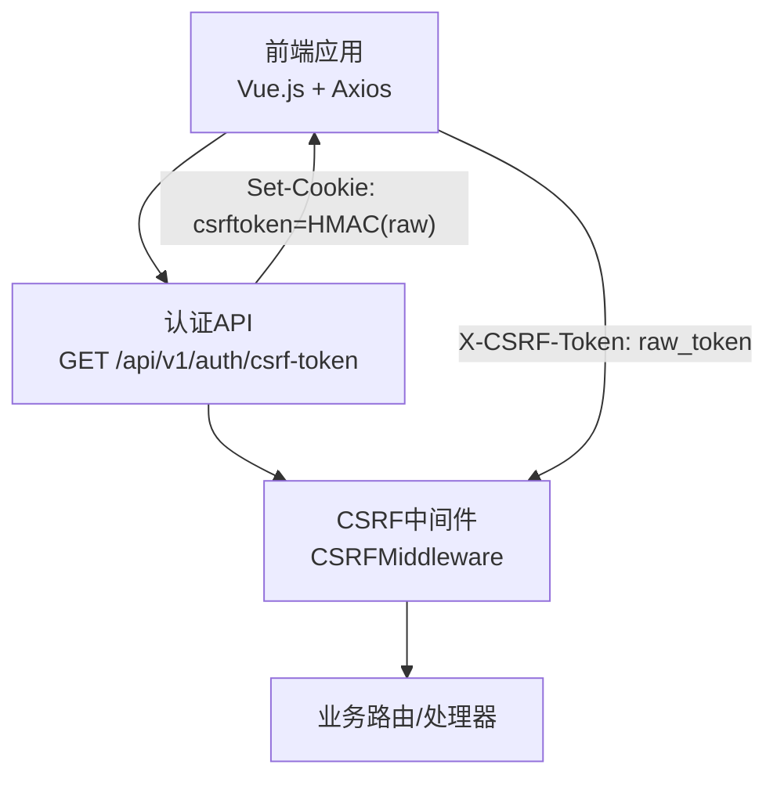
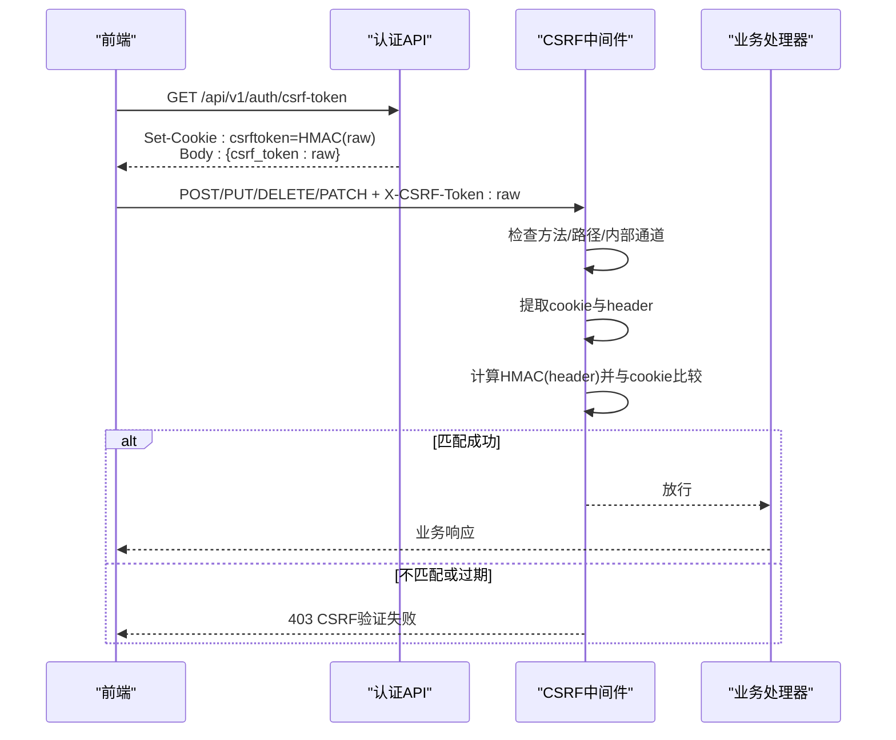
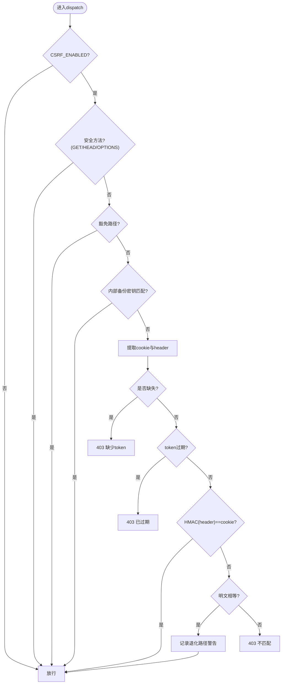
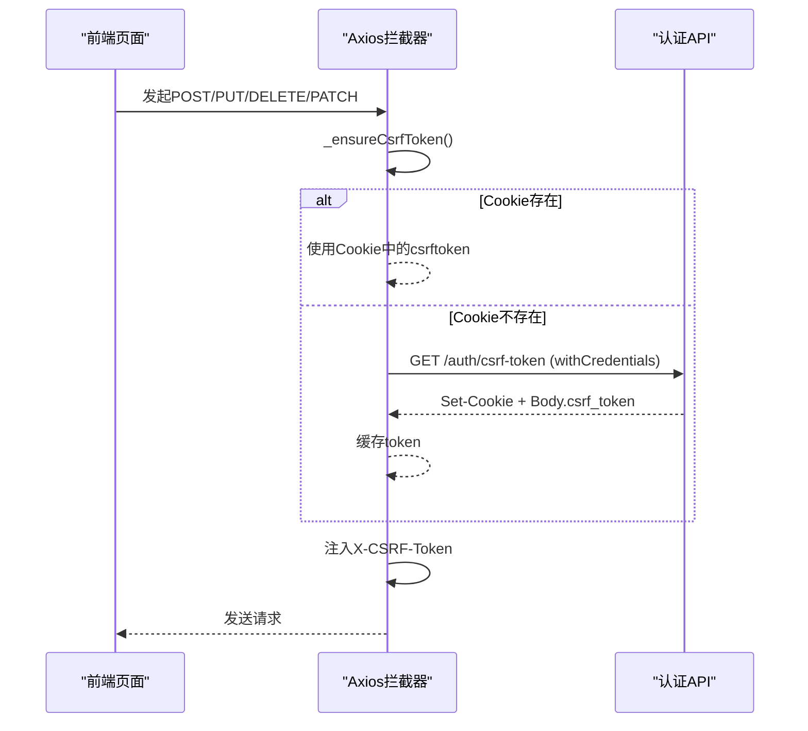
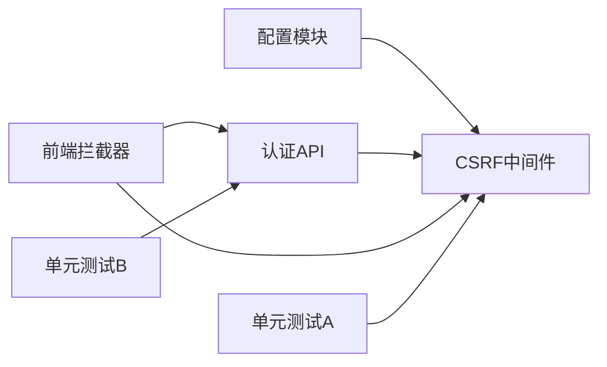

# CSRF防护机制

<cite>
**本文引用的文件**
- [backend/app/middleware/csrf_middleware.py](file://backend/app/middleware/csrf_middleware.py)
- [backend/app/api/v1/auth/auth.py](file://backend/app/api/v1/auth/auth.py)
- [backend/app/core/config.py](file://backend/app/core/config.py)
- [frontend/src/api/request.ts](file://frontend/src/api/request.ts)
- [frontend/src/composables/useUploadHeaders.ts](file://frontend/src/composables/useUploadHeaders.ts)
- [backend/tests/unit/test_cov_final_csrf_middleware.py](file://backend/tests/unit/test_cov_final_csrf_middleware.py)
- [backend/tests/unit/test_middleware_ALL.py](file://backend/tests/unit/test_middleware_ALL.py)
- [backend/tests/unit/test_csrf_hmac_upgrade.py](file://backend/tests/unit/test_csrf_hmac_upgrade.py)
</cite>

## 目录
1. [简介](#简介)
2. [项目结构](#项目结构)
3. [核心组件](#核心组件)
4. [架构总览](#架构总览)
5. [详细组件分析](#详细组件分析)
6. [依赖关系分析](#依赖关系分析)
7. [性能与安全考量](#性能与安全考量)
8. [故障排查指南](#故障排查指南)
9. [结论](#结论)
10. [附录：前端集成与部署配置](#附录前端集成与部署配置)

## 简介
本文件面向CSRF（跨站请求伪造）防护的完整实现，覆盖攻击原理、危害、令牌生成/验证/存储、中间件流程、前端集成与多环境部署最佳实践。系统采用“Double Submit Cookie + HMAC签名”的增强方案：服务端在响应中设置Cookie为HMAC(raw_token)，前端在X-CSRF-Token请求头携带raw_token；服务端通过常量时间比较HMAC(header)与cookie值完成校验，并支持旧版明文兼容与过期检测。

## 项目结构
与CSRF相关的代码主要分布在后端中间件、认证API、配置模块以及前端请求拦截器与上传工具中：
- 后端中间件：统一拦截状态变更请求，执行CSRF校验
- 认证API：提供获取CSRF token的接口，设置Cookie
- 配置：控制是否启用CSRF、密钥来源、CORS允许头等
- 前端：自动为不安全方法回填X-CSRF-Token，处理懒加载与重试

**图表来源**
- [backend/app/api/v1/auth/auth.py:692-747](file://backend/app/api/v1/auth/auth.py#L692-L747)
- [backend/app/middleware/csrf_middleware.py:177-284](file://backend/app/middleware/csrf_middleware.py#L177-L284)

**章节来源**
- [backend/app/middleware/csrf_middleware.py:1-284](file://backend/app/middleware/csrf_middleware.py#L1-L284)
- [backend/app/api/v1/auth/auth.py:692-747](file://backend/app/api/v1/auth/auth.py#L692-L747)
- [backend/app/core/config.py:140-155](file://backend/app/core/config.py#L140-L155)
- [frontend/src/api/request.ts:103-190](file://frontend/src/api/request.ts#L103-L190)

## 核心组件
- CSRF中间件：负责请求拦截、豁免路径判断、安全方法放行、HMAC签名校验、过期检测、错误响应与日志记录
- 认证API：生成原始token与HMAC签名token，设置Cookie，返回给前端
- 配置模块：开关CSRF、CORS头允许、密钥管理（CSRF_SECRET_KEY回退到SECRET_KEY）
- 前端拦截器：对POST/PUT/DELETE/PATCH自动注入X-CSRF-Token，懒加载获取token，失败时由响应拦截器处理

**章节来源**
- [backend/app/middleware/csrf_middleware.py:65-125](file://backend/app/middleware/csrf_middleware.py#L65-L125)
- [backend/app/api/v1/auth/auth.py:692-747](file://backend/app/api/v1/auth/auth.py#L692-L747)
- [backend/app/core/config.py:146-155](file://backend/app/core/config.py#L146-L155)
- [frontend/src/api/request.ts:103-190](file://frontend/src/api/request.ts#L103-L190)

## 架构总览
CSRF防护采用“双提交Cookie + HMAC签名”模式，结合过期检测与豁免策略，确保状态变更请求的安全性。

**图表来源**
- [backend/app/api/v1/auth/auth.py:692-747](file://backend/app/api/v1/auth/auth.py#L692-L747)
- [backend/app/middleware/csrf_middleware.py:189-284](file://backend/app/middleware/csrf_middleware.py#L189-L284)

## 详细组件分析

### CSRF中间件（CSRFMiddleware）
- 请求拦截：仅对非安全方法（POST/PUT/DELETE/PATCH）进行校验
- 豁免路径：如健康检查、文档、登录注册等路径跳过校验
- 内部通道豁免：当存在INTERNAL_BACKUP_KEY且请求头匹配时直接放行
- 令牌校验：
  - 新流程：HMAC(header_value) == cookie_value（常量时间比较）
  - 旧流程兼容：若cookie与header明文相同则放行并记录警告日志
  - 过期检测：token格式为{timestamp}.{random}，超过CSRF_TOKEN_EXPIRY拒绝
- 错误处理：缺少token、过期、不匹配均返回403并附带友好消息

**图表来源**
- [backend/app/middleware/csrf_middleware.py:189-284](file://backend/app/middleware/csrf_middleware.py#L189-L284)

**章节来源**
- [backend/app/middleware/csrf_middleware.py:177-284](file://backend/app/middleware/csrf_middleware.py#L177-L284)
- [backend/tests/unit/test_cov_final_csrf_middleware.py:11-48](file://backend/tests/unit/test_cov_final_csrf_middleware.py#L11-L48)
- [backend/tests/unit/test_middleware_ALL.py:408-443](file://backend/tests/unit/test_middleware_ALL.py#L408-L443)

### 认证API（获取CSRF Token）
- 速率限制：按IP限制获取频率，防止滥用
- 生成与签名：生成原始token与HMAC签名token
- 设置Cookie：将签名版本写入csrftoken Cookie，max_age与CSRF_TOKEN_EXPIRY一致，SameSite=Strict，生产环境secure=true
- 返回数据：同时返回原始token与签名token供前端使用

**章节来源**
- [backend/app/api/v1/auth/auth.py:692-747](file://backend/app/api/v1/auth/auth.py#L692-L747)

### 配置与密钥管理
- 开关：CSRF_ENABLED默认开启，可通过环境变量关闭（调试场景）
- 密钥：CSRF_SECRET_KEY留空时回退到SECRET_KEY；支持从加密文件加载
- CORS：允许X-CSRF-Token头，便于跨域场景下前端携带

**章节来源**
- [backend/app/core/config.py:146-155](file://backend/app/core/config.py#L146-L155)
- [backend/app/core/config.py:243-299](file://backend/app/core/config.py#L243-L299)

### 前端集成（Vue.js + Axios）
- 自动注入：对POST/PUT/DELETE/PATCH自动读取csrftoken Cookie或懒加载获取，并注入X-CSRF-Token
- 懒加载：首次需要时调用/auth/csrf-token，避免不必要的网络开销
- 上传兼容：el-upload原生请求需手动携带Authorization与X-CSRF-Token
- 错误处理：403由响应拦截器统一处理，必要时触发重试或提示

**图表来源**
- [frontend/src/api/request.ts:103-190](file://frontend/src/api/request.ts#L103-L190)
- [frontend/src/composables/useUploadHeaders.ts:1-32](file://frontend/src/composables/useUploadHeaders.ts#L1-L32)

**章节来源**
- [frontend/src/api/request.ts:103-190](file://frontend/src/api/request.ts#L103-L190)
- [frontend/src/composables/useUploadHeaders.ts:1-32](file://frontend/src/composables/useUploadHeaders.ts#L1-L32)

## 依赖关系分析
- 中间件依赖配置模块以读取CSRF_ENABLED、CSRF_SECRET_KEY等
- 认证API依赖中间件的生成与签名函数
- 前端依赖后端提供的CSRF接口与Cookie策略
- 测试用例覆盖豁免路径、HMAC升级、内部通道等关键分支

**图表来源**
- [backend/app/core/config.py:146-155](file://backend/app/core/config.py#L146-L155)
- [backend/app/middleware/csrf_middleware.py:177-284](file://backend/app/middleware/csrf_middleware.py#L177-L284)
- [backend/app/api/v1/auth/auth.py:692-747](file://backend/app/api/v1/auth/auth.py#L692-L747)
- [frontend/src/api/request.ts:103-190](file://frontend/src/api/request.ts#L103-L190)
- [backend/tests/unit/test_middleware_ALL.py:408-443](file://backend/tests/unit/test_middleware_ALL.py#L408-L443)
- [backend/tests/unit/test_csrf_hmac_upgrade.py:128-198](file://backend/tests/unit/test_csrf_hmac_upgrade.py#L128-L198)

**章节来源**
- [backend/tests/unit/test_middleware_ALL.py:338-386](file://backend/tests/unit/test_middleware_ALL.py#L338-L386)
- [backend/tests/unit/test_csrf_hmac_upgrade.py:128-198](file://backend/tests/unit/test_csrf_hmac_upgrade.py#L128-L198)

## 性能与安全考量
- 性能
  - HMAC计算开销低，常量时间比较避免时序攻击
  - 懒加载CSRF token减少首屏网络开销
  - 豁免路径与内部通道减少不必要校验
- 安全
  - Double Submit Cookie + HMAC签名防篡改
  - SameSite=Strict与生产环境Secure Cookie提升安全性
  - 过期检测限制token生命周期
  - 速率限制防止CSRF token接口被滥用
  - 日志记录退化路径与失败原因便于审计

[本节为通用指导，无需特定文件引用]

## 故障排查指南
- 403 CSRF验证失败：检查是否先调用获取token接口，确认X-CSRF-Token是否正确注入
- 403 token已过期：重新获取token，注意max_age与CSRF_TOKEN_EXPIRY一致性
- 403 token不匹配：确认Cookie与Header均为同一会话，跨域需启用withCredentials
- 退化路径警告：前端未使用HMAC流程，建议升级至签名流程
- 内部通道绕过：确认INTERNAL_BACKUP_KEY配置正确，避免误用

**章节来源**
- [backend/app/middleware/csrf_middleware.py:211-284](file://backend/app/middleware/csrf_middleware.py#L211-L284)
- [backend/tests/unit/test_cov_final_csrf_middleware.py:11-48](file://backend/tests/unit/test_cov_final_csrf_middleware.py#L11-L48)

## 结论
本系统通过“Double Submit Cookie + HMAC签名”的CSRF防护机制，结合过期检测、豁免策略与前端自动注入，有效抵御跨站请求伪造攻击。配置灵活、兼容旧版、可观测性强，适合多种部署环境。建议在生产环境保持CSRF_ENABLED开启，并严格管理密钥与CORS策略。

[本节为总结性内容，无需特定文件引用]

## 附录：前端集成与部署配置

### 前端集成要点
- 确保所有状态变更请求携带X-CSRF-Token
- 使用axios拦截器自动注入，避免遗漏
- 对于el-upload等原生请求，手动附加Authorization与X-CSRF-Token
- 跨域场景务必启用withCredentials，保证Cookie传递

**章节来源**
- [frontend/src/api/request.ts:103-190](file://frontend/src/api/request.ts#L103-L190)
- [frontend/src/composables/useUploadHeaders.ts:1-32](file://frontend/src/composables/useUploadHeaders.ts#L1-L32)

### 部署与环境配置
- CSRF_ENABLED：默认开启，调试时可临时关闭
- CSRF_SECRET_KEY：留空时回退到SECRET_KEY；生产环境建议使用独立密钥
- CORS_ALLOW_HEADERS：包含X-CSRF-Token
- 生产环境：启用Secure Cookie与SameSite=Strict
- 代理透传：配置TRUSTED_PROXIES以信任反向代理，避免X-Forwarded-For伪造

**章节来源**
- [backend/app/core/config.py:146-155](file://backend/app/core/config.py#L146-L155)
- [backend/app/middleware/csrf_middleware.py:58-63](file://backend/app/middleware/csrf_middleware.py#L58-L63)