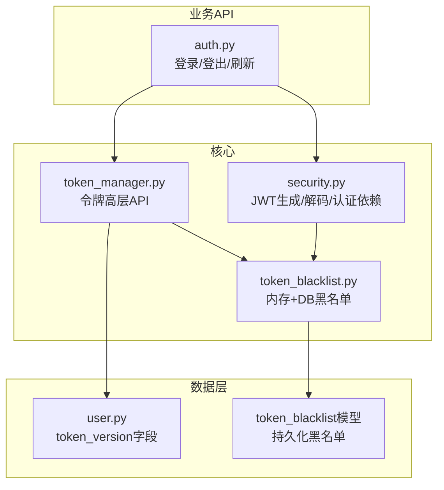
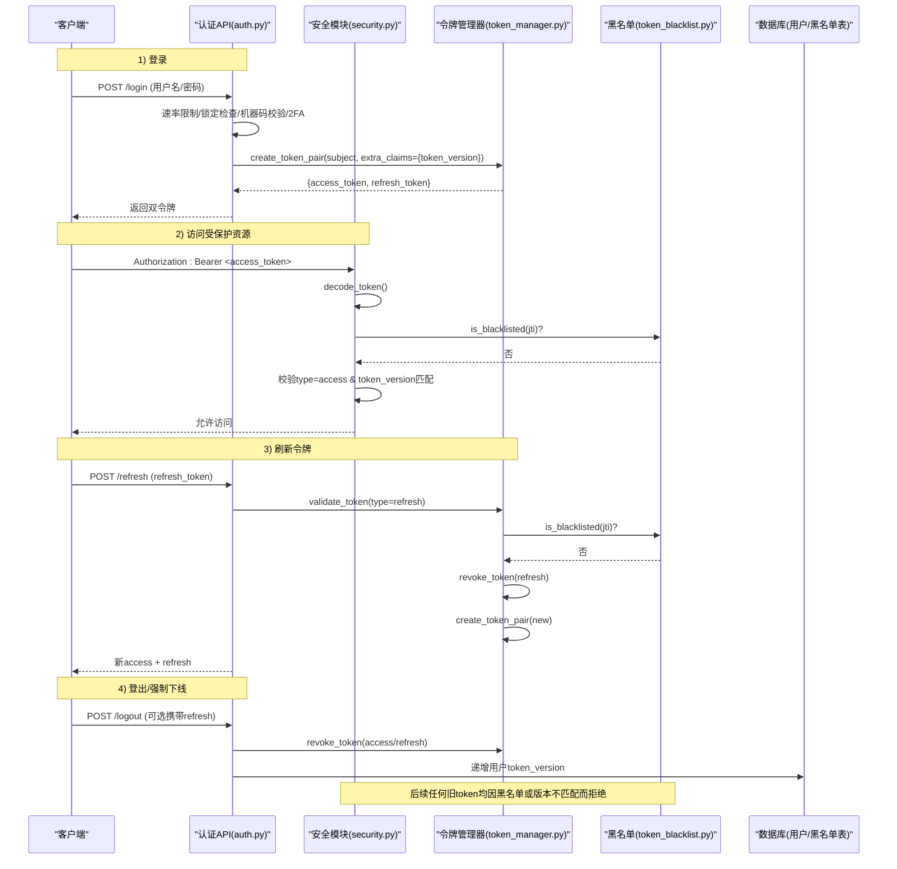
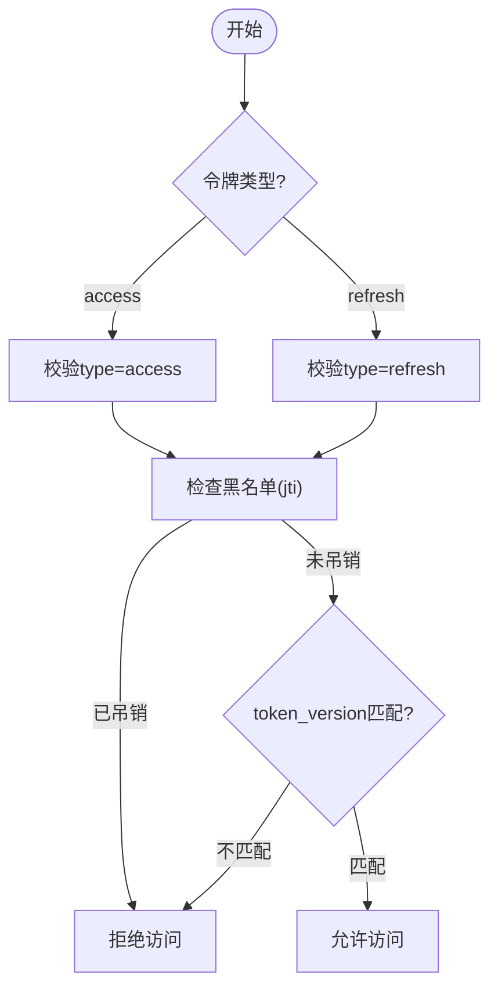
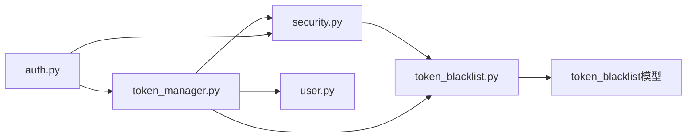

# JWT令牌管理

<cite>
**本文引用的文件**
- [security.py](file://backend/app/core/security.py)
- [token_manager.py](file://backend/app/core/token_manager.py)
- [token_blacklist.py](file://backend/app/core/token_blacklist.py)
- [token_blacklist模型](file://backend/app/models/token_blacklist.py)
- [认证API](file://backend/app/api/v1/auth/auth.py)
- [用户模型](file://backend/app/models/user.py)
- [迁移：添加token_version字段](file://backend/alembic/versions/token_version_001_add_token_version.py)
</cite>

## 目录
1. [简介](#简介)
2. [项目结构](#项目结构)
3. [核心组件](#核心组件)
4. [架构总览](#架构总览)
5. [详细组件分析](#详细组件分析)
6. [依赖关系分析](#依赖关系分析)
7. [性能与安全考量](#性能与安全考量)
8. [故障排查指南](#故障排查指南)
9. [结论](#结论)
10. [附录：常用操作示例路径](#附录常用操作示例路径)

## 简介
本技术文档围绕JWT令牌管理机制，系统阐述access token与refresh token的生成、验证、刷新与撤销生命周期；说明过期时间配置、安全存储策略；详解令牌黑名单机制（吊销、强制下线）的实现原理；并提供具体代码位置指引，展示如何正确使用JWT认证流程（获取、验证、刷新等）。同时涵盖令牌版本控制机制，支持批量吊销用户会话的安全特性。

## 项目结构
JWT相关能力分布在以下模块：
- 核心安全与JWT工具：生成/解码/校验、FastAPI依赖注入、速率限制、敏感信息脱敏等
- 令牌管理器：封装创建、验证、刷新、吊销的高层API
- 令牌黑名单：内存+数据库持久化的黑名单实现，支持自动清理与重启恢复
- 认证API：登录、登出、刷新、CSRF等接口
- 数据模型：用户表包含token_version字段，用于版本化吊销；黑名单表持久化被吊销的JTI

图表来源
- [security.py:210-235](file://backend/app/core/security.py#L210-L235)
- [token_manager.py:64-127](file://backend/app/core/token_manager.py#L64-L127)
- [token_blacklist.py:27-70](file://backend/app/core/token_blacklist.py#L27-L70)
- [认证API:101-287](file://backend/app/api/v1/auth/auth.py#L101-L287)
- [用户模型:78-83](file://backend/app/models/user.py#L78-L83)
- [token_blacklist模型:13-57](file://backend/app/models/token_blacklist.py#L13-L57)

章节来源
- [security.py:210-235](file://backend/app/core/security.py#L210-L235)
- [token_manager.py:64-127](file://backend/app/core/token_manager.py#L64-L127)
- [token_blacklist.py:27-70](file://backend/app/core/token_blacklist.py#L27-L70)
- [认证API:101-287](file://backend/app/api/v1/auth/auth.py#L101-L287)
- [用户模型:78-83](file://backend/app/models/user.py#L78-L83)
- [token_blacklist模型:13-57](file://backend/app/models/token_blacklist.py#L13-L57)

## 核心组件
- 安全模块（security.py）
  - 提供create_access_token/create_refresh_token/decode_token
  - FastAPI依赖get_current_user实现统一鉴权入口，含黑名单检查、类型校验、版本校验
  - 速率限制、IP提取、审计上下文注入
- 令牌管理器（token_manager.py）
  - create_token_pair：签发access + refresh双令牌，携带jti、type、exp、iat、token_version
  - validate_token：校验并检查黑名单、类型匹配
  - revoke_token：将JTI加入内存与数据库黑名单
  - refresh_access_token：基于refresh token轮换签发新对，旧refresh立即吊销
- 令牌黑名单（token_blacklist.py）
  - 内存集合维护已吊销JTI及过期时间，周期性清理
  - 启动时从数据库加载未过期记录，保证重启后仍有效
  - add_to_db持久化到token_blacklist表
- 认证API（auth.py）
  - /login：校验凭据、机器码绑定、2FA临时令牌、签发正式双令牌（带token_version）
  - /logout：吊销请求中的access/refresh，递增token_version使该用户所有现存JWT失效
  - /refresh：仅接受refresh token，校验后吊销旧refresh并签发新对
  - /csrf-token：获取CSRF token并设置Cookie

章节来源
- [security.py:210-336](file://backend/app/core/security.py#L210-L336)
- [token_manager.py:64-240](file://backend/app/core/token_manager.py#L64-L240)
- [token_blacklist.py:27-163](file://backend/app/core/token_blacklist.py#L27-L163)
- [认证API:101-690](file://backend/app/api/v1/auth/auth.py#L101-L690)

## 架构总览
下图展示了JWT在系统中的完整生命周期：登录签发、访问校验、刷新轮换、登出吊销与版本化强制下线。

图表来源
- [认证API:101-287](file://backend/app/api/v1/auth/auth.py#L101-L287)
- [认证API:570-690](file://backend/app/api/v1/auth/auth.py#L570-L690)
- [token_manager.py:64-240](file://backend/app/core/token_manager.py#L64-L240)
- [security.py:243-336](file://backend/app/core/security.py#L243-L336)
- [token_blacklist.py:27-163](file://backend/app/core/token_blacklist.py#L27-L163)

## 详细组件分析

### 令牌生成与过期时间配置
- access token
  - 默认过期时间由环境变量ACCESS_TOKEN_EXPIRE_MINUTES控制（默认480分钟）
  - 通过create_access_token或create_token_pair签发，包含exp、type=access、jti、iat、token_version
- refresh token
  - 默认过期时间由环境变量REFRESH_TOKEN_EXPIRE_DAYS控制（默认7或30天，取决于调用点）
  - 通过create_token_pair签发，包含exp、type=refresh、jti、iat、token_version
- 密钥与算法
  - SECRET_KEY与ALGORITHM来自配置或环境变量，确保签名一致性

章节来源
- [security.py:80-90](file://backend/app/core/security.py#L80-L90)
- [security.py:210-225](file://backend/app/core/security.py#L210-L225)
- [token_manager.py:85-127](file://backend/app/core/token_manager.py#L85-L127)

### 令牌验证与鉴权流程
- get_current_user作为统一鉴权入口
  - 解析Authorization头Bearer token
  - 解码并检查黑名单（按jti）
  - 校验type必须为access（兼容无type历史令牌放行）
  - 查询用户并校验token_version：若用户当前version>0且令牌缺失或版本不匹配，直接拒绝
  - 将当前用户ID写入审计上下文，便于写操作可追责
- validate_token（token_manager）
  - 解码并检查黑名单、类型匹配，返回payload或错误

章节来源
- [security.py:243-336](file://backend/app/core/security.py#L243-L336)
- [token_manager.py:135-168](file://backend/app/core/token_manager.py#L135-L168)

### 令牌刷新与轮换
- /refresh端点
  - 仅接受refresh token，进行速率限制
  - 校验refresh有效性（类型、黑名单、用户状态）
  - 吊销旧refresh（防止重放），签发新的access + refresh对
  - 新令牌携带最新token_version
- refresh_access_token（token_manager）
  - 内部复用validate_token与revoke_token，再create_token_pair

章节来源
- [认证API:594-690](file://backend/app/api/v1/auth/auth.py#L594-L690)
- [token_manager.py:218-240](file://backend/app/core/token_manager.py#L218-L240)

### 令牌吊销与黑名单机制
- 内存黑名单
  - 以jti为键存储过期时间戳，周期性清理过期条目
  - 并发安全：使用锁保护读写
- 数据库黑名单
  - 启动时从token_blacklist表加载未过期记录到内存
  - 吊销时将jti、原因、过期时间、用户ID写入数据库，保证重启后仍有效
- 吊销触发点
  - 登出：吊销请求中access/refresh，并递增用户token_version
  - 刷新：吊销旧refresh
  - 2FA临时令牌验证通过后吊销temp token
  - 管理员强制下线：通过递增token_version实现批量吊销

图表来源
- [security.py:266-323](file://backend/app/core/security.py#L266-L323)
- [token_manager.py:148-168](file://backend/app/core/token_manager.py#L148-L168)
- [token_blacklist.py:60-70](file://backend/app/core/token_blacklist.py#L60-L70)

章节来源
- [token_blacklist.py:27-163](file://backend/app/core/token_blacklist.py#L27-L163)
- [认证API:570-591](file://backend/app/api/v1/auth/auth.py#L570-L591)
- [token_blacklist模型:13-57](file://backend/app/models/token_blacklist.py#L13-L57)

### 令牌版本控制与批量吊销
- 用户表新增token_version字段，默认0
- 签发令牌时携带token_version
- 鉴权时比较令牌中的token_version与用户当前version：
  - 若用户version>0且令牌缺失或版本不同，拒绝访问
- 登出或管理员操作时递增token_version，使该用户所有现存JWT立即失效（包括未提交的refresh token）

章节来源
- [用户模型:78-83](file://backend/app/models/user.py#L78-L83)
- [用户模型:141-149](file://backend/app/models/user.py#L141-L149)
- [迁移：添加token_version字段:19-33](file://backend/alembic/versions/token_version_001_add_token_version.py#L19-L33)
- [认证API:508-522](file://backend/app/api/v1/auth/auth.py#L508-L522)
- [认证API:586-589](file://backend/app/api/v1/auth/auth.py#L586-L589)

### 安全存储策略
- 密钥管理
  - SECRET_KEY优先从配置读取，回退至环境变量，最终兜底生成临时密钥并记录严重日志（服务重启后所有JWT失效）
- 传输与存储建议
  - access token：前端内存存储，避免持久化到磁盘或localStorage
  - refresh token：建议HttpOnly Cookie或安全存储，减少XSS风险
  - 服务端：黑名单内存+数据库持久化，确保重启后仍生效
- 其他安全措施
  - 速率限制：登录、注册、刷新、CSRF均有频率限制
  - 账户锁定：连续失败达到阈值自动锁定
  - 机器码绑定：登录前校验设备授权
  - 审计日志：登录成功/失败、登出等操作记录

章节来源
- [security.py:65-88](file://backend/app/core/security.py#L65-L88)
- [认证API:36-53](file://backend/app/api/v1/auth/auth.py#L36-L53)
- [认证API:124-137](file://backend/app/api/v1/auth/auth.py#L124-L137)
- [认证API:608-620](file://backend/app/api/v1/auth/auth.py#L608-L620)

## 依赖关系分析
- security.py依赖token_blacklist进行黑名单检查
- token_manager.py依赖security.py获取密钥与算法，并调用token_blacklist进行吊销持久化
- 认证API依赖token_manager与security，组合完成登录、刷新、登出流程
- 数据模型提供token_version与黑名单持久化支撑

图表来源
- [security.py:266-336](file://backend/app/core/security.py#L266-L336)
- [token_manager.py:148-206](file://backend/app/core/token_manager.py#L148-L206)
- [认证API:101-690](file://backend/app/api/v1/auth/auth.py#L101-L690)
- [token_blacklist模型:13-57](file://backend/app/models/token_blacklist.py#L13-L57)

章节来源
- [security.py:266-336](file://backend/app/core/security.py#L266-L336)
- [token_manager.py:148-206](file://backend/app/core/token_manager.py#L148-L206)
- [认证API:101-690](file://backend/app/api/v1/auth/auth.py#L101-L690)
- [token_blacklist模型:13-57](file://backend/app/models/token_blacklist.py#L13-L57)

## 性能与安全考量
- 性能
  - 黑名单内存结构O(1)查找，定期清理过期条目，降低内存占用
  - 数据库黑名单仅在持久化时写入，读取走内存，启动时批量加载
  - 速率限制采用滑动窗口，避免高频攻击
- 安全
  - 统一鉴权入口强制黑名单与版本校验，防止绕过
  - refresh token轮换，旧refresh立即吊销，防重放
  - 密钥动态加载与兜底机制，避免硬编码泄露
  - 审计上下文注入，写操作可追踪到人

[本节为通用指导，无需特定文件引用]

## 故障排查指南
- 常见问题
  - 令牌无效或过期：检查exp、type、黑名单、token_version是否匹配
  - 刷新失败：确认传入的是refresh token，且未被吊销
  - 登出后仍可访问：确认黑名单生效、token_version已递增
- 定位方法
  - 查看鉴权入口的错误分支（401/403）
  - 检查黑名单内存与数据库记录
  - 核对环境变量与配置中的密钥、算法、过期时间
- 相关代码位置
  - 鉴权错误处理：[security.py:243-336](file://backend/app/core/security.py#L243-L336)
  - 黑名单检查与清理：[token_blacklist.py:60-126](file://backend/app/core/token_blacklist.py#L60-L126)
  - 刷新流程错误分支：[认证API:622-690](file://backend/app/api/v1/auth/auth.py#L622-L690)

章节来源
- [security.py:243-336](file://backend/app/core/security.py#L243-L336)
- [token_blacklist.py:60-126](file://backend/app/core/token_blacklist.py#L60-L126)
- [认证API:622-690](file://backend/app/api/v1/auth/auth.py#L622-L690)

## 结论
本项目实现了完整的JWT令牌生命周期管理：双令牌签发、严格校验、刷新轮换、黑名单吊销与版本化强制下线。通过内存+数据库的黑名单机制与token_version字段，既保证了高性能又具备强安全性，能够有效应对令牌泄露、会话劫持与批量吊销场景。建议在部署中合理配置过期时间与密钥，并在前端采用安全的令牌存储策略。

[本节为总结性内容，无需特定文件引用]

## 附录：常用操作示例路径
- 登录获取双令牌
  - 路径：[认证API:101-287](file://backend/app/api/v1/auth/auth.py#L101-L287)
- 刷新访问令牌
  - 路径：[认证API:594-690](file://backend/app/api/v1/auth/auth.py#L594-L690)
- 登出并强制下线（递增token_version）
  - 路径：[认证API:570-591](file://backend/app/api/v1/auth/auth.py#L570-L591)
- 鉴权依赖（统一入口）
  - 路径：[security.py:243-336](file://backend/app/core/security.py#L243-L336)
- 令牌生成与验证（高层API）
  - 路径：[token_manager.py:64-240](file://backend/app/core/token_manager.py#L64-L240)
- 黑名单持久化与加载
  - 路径：[token_blacklist.py:27-163](file://backend/app/core/token_blacklist.py#L27-L163)
- 用户token_version字段与属性
  - 路径：[用户模型:78-83](file://backend/app/models/user.py#L78-L83), [用户模型:141-149](file://backend/app/models/user.py#L141-L149)
- 迁移添加token_version
  - 路径：[迁移：添加token_version字段:19-33](file://backend/alembic/versions/token_version_001_add_token_version.py#L19-L33)