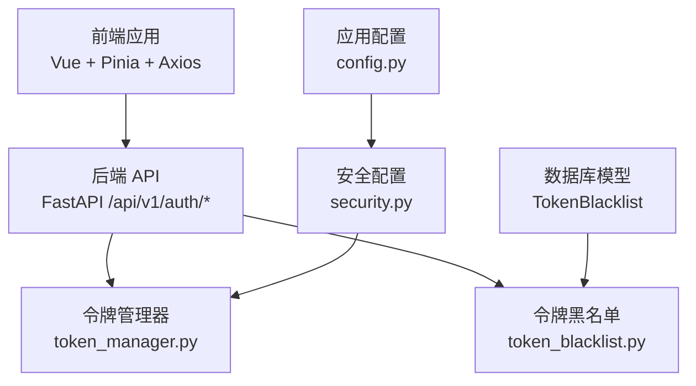
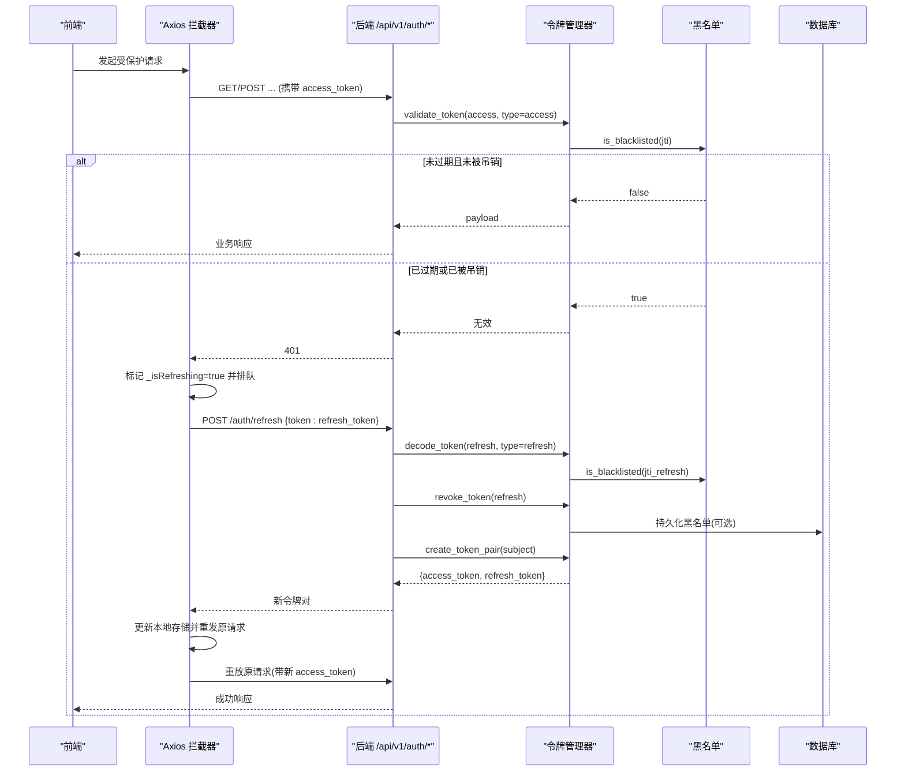
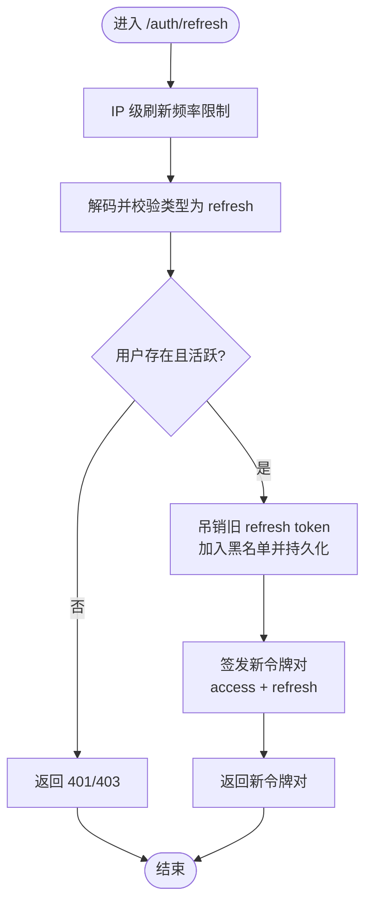
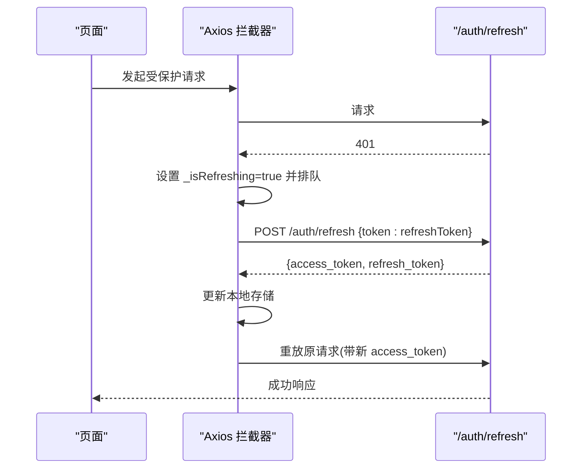
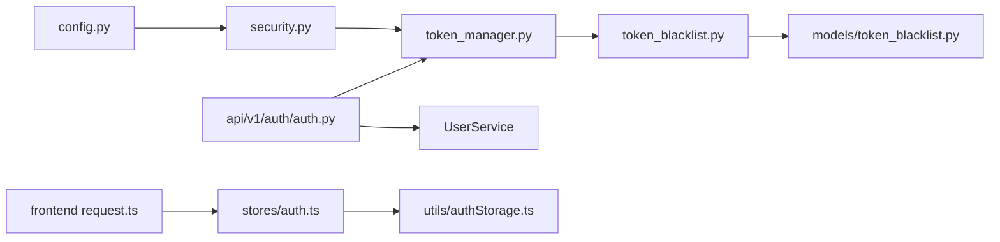

# 令牌刷新机制

<cite>
**本文引用的文件**
- [backend/app/core/token_manager.py](file://backend/app/core/token_manager.py)
- [backend/app/core/token_blacklist.py](file://backend/app/core/token_blacklist.py)
- [backend/app/models/token_blacklist.py](file://backend/app/models/token_blacklist.py)
- [backend/app/api/v1/auth/auth.py](file://backend/app/api/v1/auth/auth.py)
- [backend/app/core/security.py](file://backend/app/core/security.py)
- [backend/app/core/config.py](file://backend/app/core/config.py)
- [frontend/src/stores/auth.ts](file://frontend/src/stores/auth.ts)
- [frontend/src/utils/authStorage.ts](file://frontend/src/utils/authStorage.ts)
- [frontend/src/api/request.ts](file://frontend/src/api/request.ts)
</cite>

## 目录
1. [简介](#简介)
2. [项目结构](#项目结构)
3. [核心组件](#核心组件)
4. [架构总览](#架构总览)
5. [详细组件分析](#详细组件分析)
6. [依赖关系分析](#依赖关系分析)
7. [性能考虑](#性能考虑)
8. [故障排查指南](#故障排查指南)
9. [结论](#结论)
10. [附录](#附录)

## 简介
本技术文档聚焦于系统中的 JWT 令牌刷新机制，系统性说明 access token 与 refresh token 的区别、过期策略与安全考量；详述后端刷新流程（验证、吊销旧令牌、签发新令牌对）以及前端自动刷新逻辑；并给出错误处理与用户体验优化建议。

## 项目结构
本项目采用前后端分离架构：
- 后端基于 FastAPI，提供认证与令牌管理 API，使用 PyJWT 生成/校验 JWT，并通过内存黑名单 + 可选数据库持久化实现令牌的即时失效。
- 前端基于 Vue/Pinia，通过 Axios 拦截器在 401 时触发静默刷新，支持“记住登录”的持久化刷新令牌。

**图表来源**
- [backend/app/api/v1/auth/auth.py:600-690](file://backend/app/api/v1/auth/auth.py#L600-L690)
- [backend/app/core/token_manager.py:64-127](file://backend/app/core/token_manager.py#L64-L127)
- [backend/app/core/token_blacklist.py:27-70](file://backend/app/core/token_blacklist.py#L27-L70)
- [backend/app/models/token_blacklist.py:13-57](file://backend/app/models/token_blacklist.py#L13-L57)
- [backend/app/core/security.py:80-90](file://backend/app/core/security.py#L80-L90)
- [backend/app/core/config.py:126-131](file://backend/app/core/config.py#L126-L131)

**章节来源**
- [backend/app/api/v1/auth/auth.py:600-690](file://backend/app/api/v1/auth/auth.py#L600-L690)
- [backend/app/core/token_manager.py:64-127](file://backend/app/core/token_manager.py#L64-L127)
- [backend/app/core/token_blacklist.py:27-70](file://backend/app/core/token_blacklist.py#L27-L70)
- [backend/app/models/token_blacklist.py:13-57](file://backend/app/models/token_blacklist.py#L13-L57)
- [backend/app/core/security.py:80-90](file://backend/app/core/security.py#L80-L90)
- [backend/app/core/config.py:126-131](file://backend/app/core/config.py#L126-L131)

## 核心组件
- 令牌管理器（token_manager.py）：负责创建/access/refresh 令牌对、统一校验、吊销与刷新。
- 令牌黑名单（token_blacklist.py + models/token_blacklist.py）：内存黑名单 + 数据库持久化，确保登出/吊销后即刻失效。
- 认证接口（auth.py）：提供 /auth/refresh、/auth/logout 等端点，包含速率限制、类型校验、用户状态检查。
- 安全与配置（security.py、config.py）：定义密钥、算法、access/refresh 过期时间等。
- 前端存储与请求层（auth.ts、authStorage.ts、request.ts）：维护会话、自动刷新、并发控制与 CSRF 配合。

**章节来源**
- [backend/app/core/token_manager.py:135-240](file://backend/app/core/token_manager.py#L135-L240)
- [backend/app/core/token_blacklist.py:27-114](file://backend/app/core/token_blacklist.py#L27-L114)
- [backend/app/models/token_blacklist.py:13-57](file://backend/app/models/token_blacklist.py#L13-L57)
- [backend/app/api/v1/auth/auth.py:600-690](file://backend/app/api/v1/auth/auth.py#L600-L690)
- [backend/app/core/security.py:80-90](file://backend/app/core/security.py#L80-L90)
- [backend/app/core/config.py:126-131](file://backend/app/core/config.py#L126-L131)
- [frontend/src/stores/auth.ts:93-130](file://frontend/src/stores/auth.ts#L93-L130)
- [frontend/src/utils/authStorage.ts:54-165](file://frontend/src/utils/authStorage.ts#L54-L165)
- [frontend/src/api/request.ts:386-412](file://frontend/src/api/request.ts#L386-L412)

## 架构总览
下图展示了从前端发起受保护请求到后端鉴权、再到令牌刷新的完整链路。

**图表来源**
- [backend/app/api/v1/auth/auth.py:600-690](file://backend/app/api/v1/auth/auth.py#L600-L690)
- [backend/app/core/token_manager.py:135-240](file://backend/app/core/token_manager.py#L135-L240)
- [backend/app/core/token_blacklist.py:27-70](file://backend/app/core/token_blacklist.py#L27-L70)
- [backend/app/models/token_blacklist.py:13-57](file://backend/app/models/token_blacklist.py#L13-L57)
- [frontend/src/api/request.ts:386-412](file://frontend/src/api/request.ts#L386-L412)

## 详细组件分析

### Access Token 与 Refresh Token 的区别与使用场景
- Access Token
  - 用途：访问受保护资源（如查询数据、提交表单）。
  - 特点：短生命周期（默认 480 分钟），频繁使用，应仅用于鉴权。
  - 安全要点：必须通过 HTTPS 传输；服务端校验类型、jti、黑名单；不可当 refresh 用。
- Refresh Token
  - 用途：换取新的 access token（及轮换后的 refresh token）。
  - 特点：长生命周期（默认 30 天），仅在刷新接口使用，每次刷新会吊销旧 refresh token 并签发新对。
  - 安全要点：严格限制使用范围；刷新频率受限；存储需安全（sessionStorage 优先，必要时 localStorage 持久化）。

**章节来源**
- [backend/app/core/config.py:126-131](file://backend/app/core/config.py#L126-L131)
- [backend/app/core/token_manager.py:64-127](file://backend/app/core/token_manager.py#L64-L127)
- [backend/app/api/v1/auth/auth.py:622-652](file://backend/app/api/v1/auth/auth.py#L622-L652)
- [frontend/src/utils/authStorage.ts:54-165](file://frontend/src/utils/authStorage.ts#L54-L165)

### 令牌刷新流程（后端）
- 输入：请求体中的 refresh token。
- 步骤：
  1) 速率限制：按 IP 限流，防止暴力刷新。
  2) 解码并校验类型：仅接受 type=refresh 的令牌。
  3) 获取 subject（用户名），校验用户存在且活跃，检查账户锁定。
  4) 吊销旧 refresh token：加入内存黑名单并持久化至数据库。
  5) 签发新令牌对：包含新的 access 与 refresh token，附带 token_version。
  6) 返回新 access_token 与 refresh_token。

**图表来源**
- [backend/app/api/v1/auth/auth.py:600-690](file://backend/app/api/v1/auth/auth.py#L600-L690)
- [backend/app/core/token_manager.py:218-240](file://backend/app/core/token_manager.py#L218-L240)
- [backend/app/core/token_blacklist.py:27-70](file://backend/app/core/token_blacklist.py#L27-L70)

**章节来源**
- [backend/app/api/v1/auth/auth.py:600-690](file://backend/app/api/v1/auth/auth.py#L600-L690)
- [backend/app/core/token_manager.py:218-240](file://backend/app/core/token_manager.py#L218-L240)
- [backend/app/core/token_blacklist.py:27-70](file://backend/app/core/token_blacklist.py#L27-L70)

### 令牌刷新流程（前端自动刷新）
- 触发条件：Axios 响应拦截器收到 401。
- 行为：
  - 设置全局标志 _isRefreshing，避免并发重复刷新。
  - 将当前请求标记为可重试，并等待刷新完成。
  - 调用 /auth/refresh 接口（携带 CSRF token），成功后更新本地 access/refresh token。
  - 使用新 access token 重放原请求。
  - 若刷新失败，清空认证状态并提示重新登录。

**图表来源**
- [frontend/src/api/request.ts:386-412](file://frontend/src/api/request.ts#L386-L412)
- [frontend/tests/unit/api/requestErrorHandling.test.ts:403-486](file://frontend/tests/unit/api/requestErrorHandling.test.ts#L403-L486)

**章节来源**
- [frontend/src/api/request.ts:386-412](file://frontend/src/api/request.ts#L386-L412)
- [frontend/tests/unit/api/requestErrorHandling.test.ts:403-486](file://frontend/tests/unit/api/requestErrorHandling.test.ts#L403-L486)

### 令牌存储与“记住登录”
- 短期会话：sessionStorage 存放 access_token、user、refresh_token。
- 持久化（记住登录）：localStorage 存放 PERSIST_TOKEN、PERSIST_USER、PERSIST_REFRESH，使下次开机可免密自动续期。
- 登出：清除所有会话与持久化数据；同时尝试调用后端 /auth/logout 吊销令牌（网络失败不阻塞本地清理）。

**章节来源**
- [frontend/src/utils/authStorage.ts:54-165](file://frontend/src/utils/authStorage.ts#L54-L165)
- [frontend/src/stores/auth.ts:93-130](file://frontend/src/stores/auth.ts#L93-L130)

### 安全机制与防护措施
- 类型校验：validate_token 强制区分 access 与 refresh，禁止混用。
- 黑名单机制：内存黑名单 + 数据库持久化，确保登出/吊销立即生效。
- 刷新轮换：每次刷新吊销旧 refresh token，防止重放攻击。
- 速率限制：按 IP 限制刷新频率，降低暴力破解风险。
- CSRF 防护：刷新接口需携带 CSRF token，避免跨站伪造。
- 最小权限：access token 仅用于鉴权，refresh token 仅限刷新接口。

**章节来源**
- [backend/app/core/token_manager.py:135-169](file://backend/app/core/token_manager.py#L135-L169)
- [backend/app/core/token_blacklist.py:27-70](file://backend/app/core/token_blacklist.py#L27-L70)
- [backend/app/api/v1/auth/auth.py:600-690](file://backend/app/api/v1/auth/auth.py#L600-L690)
- [frontend/src/api/request.ts:386-412](file://frontend/src/api/request.ts#L386-L412)

### 错误处理与用户体验优化
- 后端：
  - 非法/过期/被吊销令牌返回 401/403，并记录日志。
  - 用户不存在或被禁用返回相应错误码。
  - 异常分支统一捕获，避免泄露敏感信息。
- 前端：
  - 401 时自动刷新，失败则清空认证并提示重新登录。
  - 刷新期间排队后续 401 请求，成功后统一重放，减少抖动。
  - 预取 CSRF token，避免首次状态变更请求失败。

**章节来源**
- [backend/app/api/v1/auth/auth.py:676-690](file://backend/app/api/v1/auth/auth.py#L676-L690)
- [frontend/src/api/request.ts:386-412](file://frontend/src/api/request.ts#L386-L412)
- [frontend/tests/unit/api/requestErrorHandling.test.ts:424-486](file://frontend/tests/unit/api/requestErrorHandling.test.ts#L424-L486)

## 依赖关系分析
- token_manager 依赖 security（密钥/算法）与 config（过期时间）。
- token_blacklist 依赖数据库模型 TokenBlacklist，并在启动时加载未过期的黑名单。
- auth API 依赖 token_manager 进行令牌操作，依赖 UserService 进行用户状态校验。
- 前端 request.ts 依赖 stores/auth.ts 与 utils/authStorage.ts 管理令牌与会话。

**图表来源**
- [backend/app/core/config.py:126-131](file://backend/app/core/config.py#L126-L131)
- [backend/app/core/security.py:80-90](file://backend/app/core/security.py#L80-L90)
- [backend/app/core/token_manager.py:64-127](file://backend/app/core/token_manager.py#L64-L127)
- [backend/app/core/token_blacklist.py:73-103](file://backend/app/core/token_blacklist.py#L73-L103)
- [backend/app/models/token_blacklist.py:13-57](file://backend/app/models/token_blacklist.py#L13-L57)
- [backend/app/api/v1/auth/auth.py:600-690](file://backend/app/api/v1/auth/auth.py#L600-L690)
- [frontend/src/api/request.ts:386-412](file://frontend/src/api/request.ts#L386-L412)
- [frontend/src/stores/auth.ts:93-130](file://frontend/src/stores/auth.ts#L93-L130)
- [frontend/src/utils/authStorage.ts:54-165](file://frontend/src/utils/authStorage.ts#L54-L165)

**章节来源**
- [backend/app/core/config.py:126-131](file://backend/app/core/config.py#L126-L131)
- [backend/app/core/security.py:80-90](file://backend/app/core/security.py#L80-L90)
- [backend/app/core/token_manager.py:64-127](file://backend/app/core/token_manager.py#L64-L127)
- [backend/app/core/token_blacklist.py:73-103](file://backend/app/core/token_blacklist.py#L73-L103)
- [backend/app/models/token_blacklist.py:13-57](file://backend/app/models/token_blacklist.py#L13-L57)
- [backend/app/api/v1/auth/auth.py:600-690](file://backend/app/api/v1/auth/auth.py#L600-L690)
- [frontend/src/api/request.ts:386-412](file://frontend/src/api/request.ts#L386-L412)
- [frontend/src/stores/auth.ts:93-130](file://frontend/src/stores/auth.ts#L93-L130)
- [frontend/src/utils/authStorage.ts:54-165](file://frontend/src/utils/authStorage.ts#L54-L165)

## 性能考虑
- 黑名单查询为 O(1) 哈希查找，定期清理过期条目，避免内存膨胀。
- 数据库黑名单写入为异步/后台操作，失败不影响主流程。
- 刷新接口按 IP 限流，避免高频刷新造成压力。
- 前端并发控制：_isRefreshing 标志与队列机制，减少重复刷新与抖动。

[本节为通用性能讨论，无需特定文件引用]

## 故障排查指南
- 刷新失败常见原因：
  - refresh token 已吊销或过期：检查黑名单与过期时间。
  - 用户被禁用或不存在：检查用户状态。
  - CSRF 缺失：确认前端携带 X-CSRF-Token。
  - 速率限制触发：检查刷新频率。
- 前端问题定位：
  - 401 后是否触发刷新：查看拦截器日志与 _isRefreshing 状态。
  - 刷新响应是否包含 access_token：检查后端返回结构。
  - 本地存储是否正确更新：检查 sessionStorage/localStorage。

**章节来源**
- [backend/app/api/v1/auth/auth.py:600-690](file://backend/app/api/v1/auth/auth.py#L600-L690)
- [backend/app/core/token_blacklist.py:27-70](file://backend/app/core/token_blacklist.py#L27-L70)
- [frontend/src/api/request.ts:386-412](file://frontend/src/api/request.ts#L386-L412)

## 结论
本系统实现了健壮的 JWT 令牌刷新机制：通过严格的类型校验、黑名单即时失效、刷新轮换与频率限制，有效防范重放与暴力攻击；前端具备自动刷新与并发控制能力，提升用户体验。建议在部署中合理配置 access/refresh 过期时间，并确保 CSRF 与限流策略生效。

[本节为总结性内容，无需特定文件引用]

## 附录
- 关键配置项
  - ACCESS_TOKEN_EXPIRE_MINUTES：access token 有效期（分钟）
  - REFRESH_TOKEN_EXPIRE_DAYS：refresh token 有效期（天）
  - SECRET_KEY/ALGORITHM：JWT 签名密钥与算法
  - CSRF_ENABLED：是否启用 CSRF 保护

**章节来源**
- [backend/app/core/config.py:126-131](file://backend/app/core/config.py#L126-L131)
- [backend/app/core/security.py:80-90](file://backend/app/core/security.py#L80-L90)