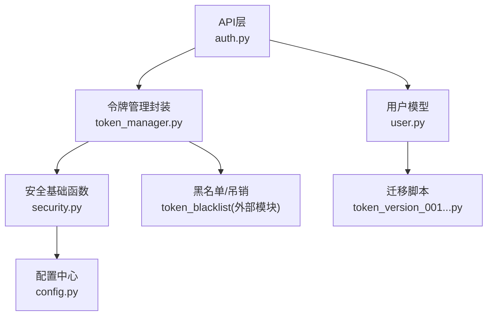
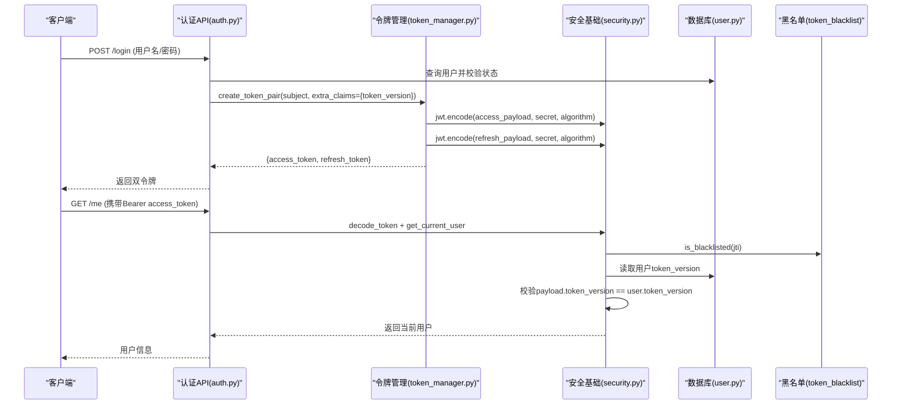
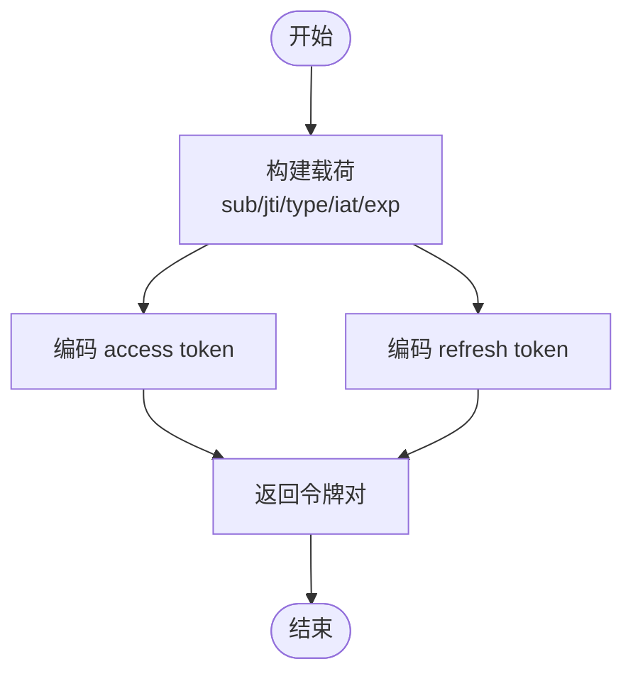
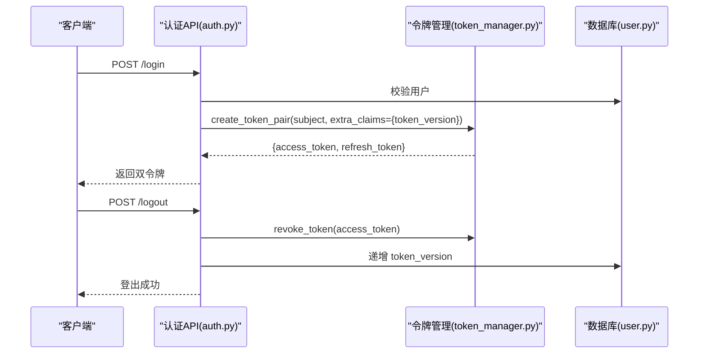
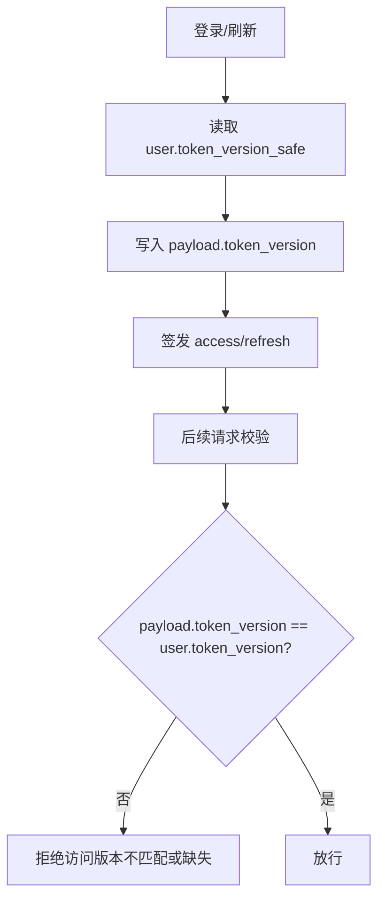
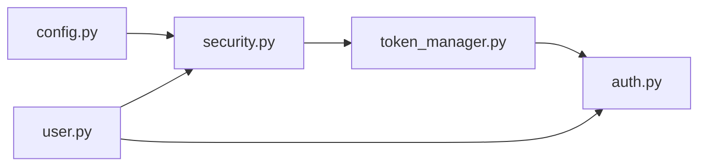

# 令牌生成机制

<cite>
**本文引用的文件**
- [security.py](file://backend/app/core/security.py)
- [token_manager.py](file://backend/app/core/token_manager.py)
- [auth.py](file://backend/app/api/v1/auth/auth.py)
- [config.py](file://backend/app/core/config.py)
- [user.py](file://backend/app/models/user.py)
- [token_version_001_add_token_version.py](file://backend/alembic/versions/token_version_001_add_token_version.py)
</cite>

## 目录
1. [简介](#简介)
2. [项目结构](#项目结构)
3. [核心组件](#核心组件)
4. [架构总览](#架构总览)
5. [详细组件分析](#详细组件分析)
6. [依赖关系分析](#依赖关系分析)
7. [性能考量](#性能考量)
8. [故障排查指南](#故障排查指南)
9. [结论](#结论)
10. [附录：使用示例与最佳实践](#附录使用示例与最佳实践)

## 简介
本技术文档聚焦于系统中的 JWT 令牌生成机制，覆盖 access token 与 refresh token 的生成流程、载荷结构、过期时间配置、加密算法选择、版本控制（token_version）策略，以及安全最佳实践与常见陷阱。文档以代码级实现为依据，提供流程图与时序图帮助理解数据流与控制流。

## 项目结构
JWT 相关能力主要分布在以下模块：
- 安全与基础 JWT 工具：core/security.py
- 高级令牌管理封装：core/token_manager.py
- 认证 API 入口与业务流程：api/v1/auth/auth.py
- 应用配置与安全参数：core/config.py
- 用户模型与 token_version 字段：models/user.py
- 数据库迁移（新增 token_version 列）：alembic/versions/token_version_001_add_token_version.py

**图表来源**
- [auth.py:56-60](file://backend/app/api/v1/auth/auth.py#L56-L60)
- [token_manager.py:64-127](file://backend/app/core/token_manager.py#L64-L127)
- [security.py:210-235](file://backend/app/core/security.py#L210-L235)
- [config.py:126-134](file://backend/app/core/config.py#L126-L134)
- [user.py:78-83](file://backend/app/models/user.py#L78-L83)
- [token_version_001_add_token_version.py:19-33](file://backend/alembic/versions/token_version_001_add_token_version.py#L19-L33)

**章节来源**
- [auth.py:56-60](file://backend/app/api/v1/auth/auth.py#L56-L60)
- [token_manager.py:64-127](file://backend/app/core/token_manager.py#L64-L127)
- [security.py:210-235](file://backend/app/core/security.py#L210-L235)
- [config.py:126-134](file://backend/app/core/config.py#L126-L134)
- [user.py:78-83](file://backend/app/models/user.py#L78-L83)
- [token_version_001_add_token_version.py:19-33](file://backend/alembic/versions/token_version_001_add_token_version.py#L19-L33)

## 核心组件
- security.py：提供 create_access_token、create_refresh_token、decode_token 等基础 JWT 操作；定义 SECRET_KEY、ALGORITHM、默认过期时间常量；实现 get_current_user 依赖，包含黑名单校验、类型校验、token_version 校验。
- token_manager.py：提供 create_token_pair、validate_token、revoke_token、refresh_access_token 等高阶方法；支持 JTI 唯一标识、黑名单持久化、刷新轮换；提供 TokenManager 单例兼容旧接口。
- auth.py：登录、双因素验证、登出、刷新等 API；在登录成功后签发带 token_version 的双令牌对；在登出时递增 token_version 使该用户所有现存令牌立即失效。
- config.py：集中管理 ACCESS_TOKEN_EXPIRE_MINUTES、REFRESH_TOKEN_EXPIRE_DAYS、SECRET_KEY、ALGORITHM 等安全参数。
- user.py：User 模型包含 token_version 字段及 token_version_safe 属性；提供 revoke_all_tokens 方法用于批量吊销。
- 迁移脚本：为 users 表添加 token_version 列，默认值为 0。

**章节来源**
- [security.py:210-235](file://backend/app/core/security.py#L210-L235)
- [token_manager.py:64-127](file://backend/app/core/token_manager.py#L64-L127)
- [auth.py:228-234](file://backend/app/api/v1/auth/auth.py#L228-L234)
- [config.py:126-134](file://backend/app/core/config.py#L126-L134)
- [user.py:78-83](file://backend/app/models/user.py#L78-L83)
- [token_version_001_add_token_version.py:19-33](file://backend/alembic/versions/token_version_001_add_token_version.py#L19-L33)

## 架构总览
下图展示从登录到签发双令牌、再到访问资源时的完整调用链，包括黑名单检查与 token_version 校验。

**图表来源**
- [auth.py:101-287](file://backend/app/api/v1/auth/auth.py#L101-L287)
- [token_manager.py:64-127](file://backend/app/core/token_manager.py#L64-L127)
- [security.py:228-336](file://backend/app/core/security.py#L228-L336)
- [user.py:78-83](file://backend/app/models/user.py#L78-L83)

## 详细组件分析

### 基础 JWT 函数（security.py）
- create_access_token(data, expires_delta=None)
  - 将传入 data 复制后追加 exp 与 type="access"，使用配置的 SECRET_KEY 与 ALGORITHM 编码。
  - 过期时间：若未显式传入 expires_delta，则使用 ACCESS_TOKEN_EXPIRE_MINUTES（默认 480 分钟）。
- create_refresh_token(data)
  - 将 data 复制后追加 exp 与 type="refresh"，使用相同密钥与算法编码。
  - 过期时间：REFRESH_TOKEN_EXPIRE_DAYS（默认 30 天）。
- decode_token(token)
  - 解码并返回 payload；捕获 InvalidTokenError 并记录调试日志。

这些函数是系统内最底层的 JWT 操作，被上层 token_manager 和 API 复用。

**章节来源**
- [security.py:210-235](file://backend/app/core/security.py#L210-L235)
- [config.py:126-134](file://backend/app/core/config.py#L126-L134)

### 令牌管理封装（token_manager.py）
- create_token_pair(subject, extra_claims=None, access_ttl_minutes=None, refresh_ttl_days=None)
  - 生成 access 与 refresh 两个 JWT，分别设置 iat、exp、type、jti（唯一ID），并将 extra_claims 合并入载荷。
  - 通过 _get_secret_key() 与 _get_algorithm() 获取统一的安全参数。
  - 返回包含 access_token、refresh_token、token_type、expires_in 的结构。
- validate_token(token, token_type="access")
  - 解码并校验黑名单（is_blacklisted）、类型匹配（type 字段）。
- revoke_token(token, reason="")
  - 解码（不验证 exp），提取 jti，加入黑名单并持久化到数据库，确保重启后仍有效。
- refresh_access_token(refresh_token)
  - 校验 refresh token，吊销旧 refresh token（轮换），签发新 pair。
- TokenManager 单例
  - 提供 create_access_token(subject, expires_delta=None) 向后兼容旧接口，内部委托 create_token_pair。

**图表来源**
- [token_manager.py:64-127](file://backend/app/core/token_manager.py#L64-L127)

**章节来源**
- [token_manager.py:64-127](file://backend/app/core/token_manager.py#L64-L127)
- [token_manager.py:135-168](file://backend/app/core/token_manager.py#L135-L168)
- [token_manager.py:176-210](file://backend/app/core/token_manager.py#L176-L210)
- [token_manager.py:218-240](file://backend/app/core/token_manager.py#L218-L240)
- [token_manager.py:247-283](file://backend/app/core/token_manager.py#L247-L283)

### 认证 API（auth.py）
- login
  - 速率限制、凭据校验、机器码绑定校验、2FA 临时令牌流程。
  - 成功登录后签发双令牌对，并在 extra_claims 中注入 token_version（来自 user.token_version_safe）。
- two_factor_verify_login
  - 验证 temp_token 与 TOTP，吊销 temp_token，签发正式双令牌对，同样注入 token_version。
- logout
  - 吊销请求中的 access/refresh token，递增用户 token_version 使该用户所有现存 JWT 立即失效。
- refresh
  - 仅接受 refresh_token，校验后吊销旧 refresh token，签发新的 pair，并注入最新 token_version。

**图表来源**
- [auth.py:101-287](file://backend/app/api/v1/auth/auth.py#L101-L287)
- [auth.py:570-591](file://backend/app/api/v1/auth/auth.py#L570-L591)
- [auth.py:594-689](file://backend/app/api/v1/auth/auth.py#L594-L689)
- [user.py:78-83](file://backend/app/models/user.py#L78-L83)

**章节来源**
- [auth.py:101-287](file://backend/app/api/v1/auth/auth.py#L101-L287)
- [auth.py:570-591](file://backend/app/api/v1/auth/auth.py#L570-L591)
- [auth.py:594-689](file://backend/app/api/v1/auth/auth.py#L594-L689)

### 版本控制机制（token_version）
- 数据库层：users 表新增 token_version 列（默认 0），用于标记用户会话版本。
- 签发侧：登录或刷新时，extra_claims 中包含 token_version = user.token_version_safe。
- 校验侧：get_current_user 中读取用户当前 token_version，与 payload 中的 token_version 比较；若缺失或不等，拒绝访问。
- 吊销侧：登出时递增 token_version，使该用户所有现存 JWT 立即失效。

**图表来源**
- [token_version_001_add_token_version.py:19-33](file://backend/alembic/versions/token_version_001_add_token_version.py#L19-L33)
- [auth.py:228-234](file://backend/app/api/v1/auth/auth.py#L228-L234)
- [auth.py:570-591](file://backend/app/api/v1/auth/auth.py#L570-L591)
- [security.py:306-323](file://backend/app/core/security.py#L306-L323)
- [user.py:78-83](file://backend/app/models/user.py#L78-L83)

**章节来源**
- [token_version_001_add_token_version.py:19-33](file://backend/alembic/versions/token_version_001_add_token_version.py#L19-L33)
- [auth.py:228-234](file://backend/app/api/v1/auth/auth.py#L228-L234)
- [auth.py:570-591](file://backend/app/api/v1/auth/auth.py#L570-L591)
- [security.py:306-323](file://backend/app/core/security.py#L306-L323)
- [user.py:78-83](file://backend/app/models/user.py#L78-L83)

## 依赖关系分析
- security.py 依赖 config.py 提供的 SECRET_KEY、ALGORITHM、ACCESS_TOKEN_EXPIRE_MINUTES、REFRESH_TOKEN_EXPIRE_DAYS。
- token_manager.py 依赖 security.py 的密钥与算法，并通过 token_blacklist 进行黑名单校验与持久化。
- auth.py 依赖 token_manager.py 进行令牌签发与吊销，依赖 user.py 获取 token_version。
- 整体耦合度适中：API 层通过 token_manager 抽象令牌操作，安全基础集中在 security.py，配置集中管理，便于维护与扩展。

**图表来源**
- [config.py:126-134](file://backend/app/core/config.py#L126-L134)
- [security.py:210-235](file://backend/app/core/security.py#L210-L235)
- [token_manager.py:64-127](file://backend/app/core/token_manager.py#L64-L127)
- [auth.py:228-234](file://backend/app/api/v1/auth/auth.py#L228-L234)
- [user.py:78-83](file://backend/app/models/user.py#L78-L83)

**章节来源**
- [config.py:126-134](file://backend/app/core/config.py#L126-L134)
- [security.py:210-235](file://backend/app/core/security.py#L210-L235)
- [token_manager.py:64-127](file://backend/app/core/token_manager.py#L64-L127)
- [auth.py:228-234](file://backend/app/api/v1/auth/auth.py#L228-L234)
- [user.py:78-83](file://backend/app/models/user.py#L78-L83)

## 性能考量
- 令牌签发：使用 PyJWT 的 jwt.encode，计算开销低；JTI 使用 uuid.uuid4().hex，生成速度快。
- 黑名单校验：is_blacklisted 可能涉及数据库或缓存查询，应结合缓存降低延迟。
- 刷新轮换：每次刷新都会吊销旧 refresh token 并签发新 pair，避免重放攻击，但需考虑并发场景下的幂等性。
- 版本校验：get_current_user 中读取用户 token_version 并进行比较，属于轻量级内存比较，性能影响可忽略。

[本节为通用指导，无需具体文件引用]

## 故障排查指南
- 令牌无效或过期
  - 检查 decode_token 是否抛出 InvalidTokenError；确认 SECRET_KEY 与 ALGORITHM 一致。
  - 确认 exp 是否已过期；必要时调整 ACCESS_TOKEN_EXPIRE_MINUTES。
- 令牌类型不匹配
  - 校验 type 字段是否为 "access" 或 "refresh"；确保 API 端点正确消费对应类型的令牌。
- 黑名单命中
  - 检查 revoke_token 是否成功执行；确认黑名单持久化是否生效。
- 版本不匹配或缺失
  - 确认登录/刷新时是否正确注入 token_version；检查用户 token_version 是否被递增。
  - 若 payload 缺少 token_version 且用户 token_version > 0，将被拒绝访问。

**章节来源**
- [security.py:228-336](file://backend/app/core/security.py#L228-L336)
- [token_manager.py:135-168](file://backend/app/core/token_manager.py#L135-L168)
- [token_manager.py:176-210](file://backend/app/core/token_manager.py#L176-L210)
- [auth.py:570-591](file://backend/app/api/v1/auth/auth.py#L570-L591)

## 结论
该系统实现了健壮的 JWT 令牌生成与管理体系：
- 使用 HS256 对称签名，密钥与算法集中配置，便于统一管理。
- 通过 JTI 与黑名单机制支持即时吊销；通过 token_version 实现用户级强制下线。
- 双令牌模式（access + refresh）配合刷新轮换，兼顾安全性与用户体验。
- 登录、双因素、登出、刷新等流程均围绕令牌生命周期设计，具备完善的错误处理与审计能力。

[本节为总结性内容，无需具体文件引用]

## 附录：使用示例与最佳实践

### 生成不同类型的 JWT 令牌
- 使用 security.create_access_token(data, expires_delta=None)
  - data 至少包含 sub（主体标识），可附加业务声明。
  - expires_delta 可选，未指定时使用 ACCESS_TOKEN_EXPIRE_MINUTES。
- 使用 security.create_refresh_token(data)
  - data 至少包含 sub，过期时间由 REFRESH_TOKEN_EXPIRE_DAYS 决定。
- 使用 token_manager.create_token_pair(subject, extra_claims=None, ...)
  - 推荐在登录/刷新流程中使用，自动注入 jti、type、iat、exp，并可附加额外声明。

参考路径：
- [security.py:210-235](file://backend/app/core/security.py#L210-L235)
- [token_manager.py:64-127](file://backend/app/core/token_manager.py#L64-L127)

### 自定义过期时间与附加声明
- 自定义 access token 过期时间：
  - 调用 token_manager.create_token_pair(subject, access_ttl_minutes=自定义分钟数, extra_claims={...})。
- 附加声明：
  - 在 extra_claims 中传入任意键值对，如权限、租户信息等；注意不要放入敏感信息。

参考路径：
- [token_manager.py:64-127](file://backend/app/core/token_manager.py#L64-L127)

### 安全最佳实践
- 密钥管理
  - 使用环境变量或运行时密钥文件配置 SECRET_KEY；避免硬编码。
  - 定期轮换密钥；轮换后所有现有令牌失效。
- 算法选择
  - 使用 HS256；如需非对称签名，可在配置中切换 ALGORITHM 并同步更新验证逻辑。
- 过期策略
  - access token 短生命周期（默认 480 分钟），refresh token 较长（默认 30 天）。
  - 结合 token_version 实现强制下线，缩短泄露窗口。
- 黑名单与吊销
  - 登出时吊销 access/refresh token；刷新时吊销旧 refresh token（轮换）。
  - 黑名单持久化至数据库，确保服务重启后仍有效。
- 版本控制
  - 登录/刷新时注入 token_version；校验失败立即拒绝。
  - 登出或敏感操作时递增 token_version，使该用户所有现存令牌失效。

参考路径：
- [config.py:126-134](file://backend/app/core/config.py#L126-L134)
- [security.py:228-336](file://backend/app/core/security.py#L228-L336)
- [token_manager.py:176-210](file://backend/app/core/token_manager.py#L176-L210)
- [auth.py:570-591](file://backend/app/api/v1/auth/auth.py#L570-L591)

### 常见陷阱避免
- 忘记注入 token_version：导致旧令牌无法被版本机制吊销。
- 混淆 access 与 refresh 类型：API 端点应严格校验 type 字段。
- 黑名单未持久化：服务重启后吊销失效，需确保数据库写入成功。
- 密钥不一致：服务端与客户端或不同实例间 SECRET_KEY 必须一致。
- 过期时间过短或过长：根据业务需求合理配置，平衡安全与体验。

参考路径：
- [security.py:306-323](file://backend/app/core/security.py#L306-L323)
- [token_manager.py:135-168](file://backend/app/core/token_manager.py#L135-L168)
- [auth.py:228-234](file://backend/app/api/v1/auth/auth.py#L228-L234)