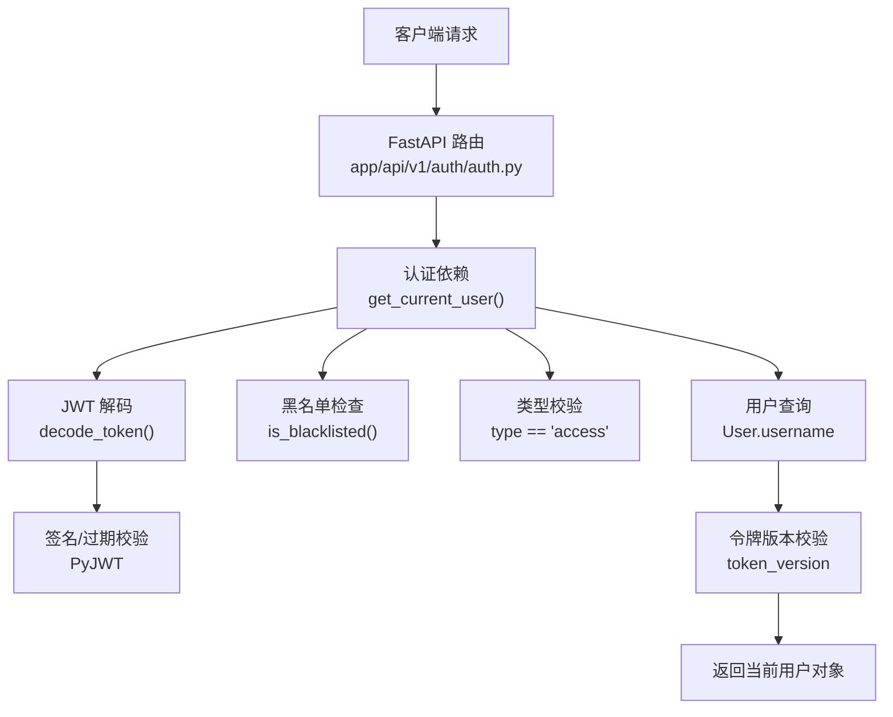
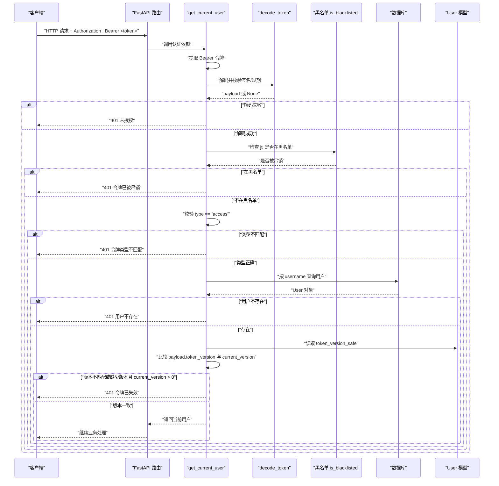
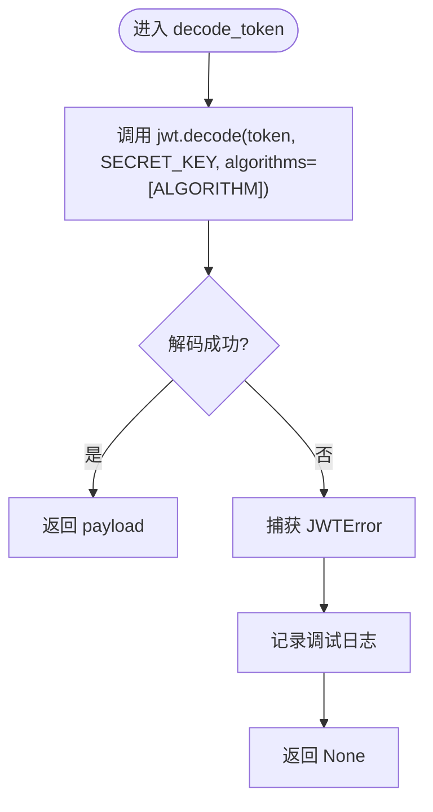
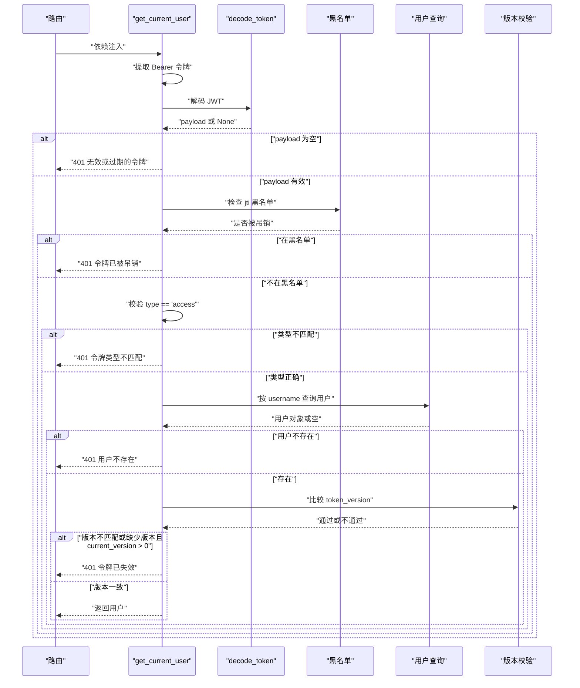
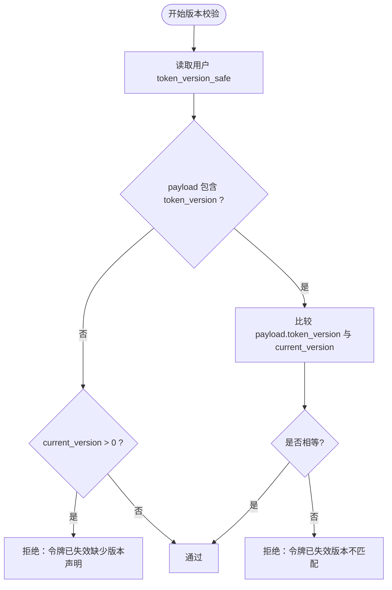
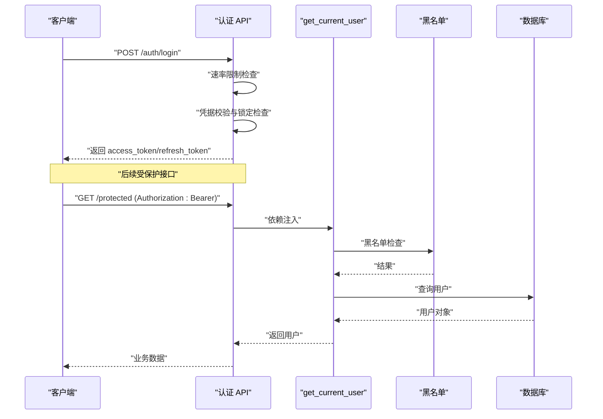
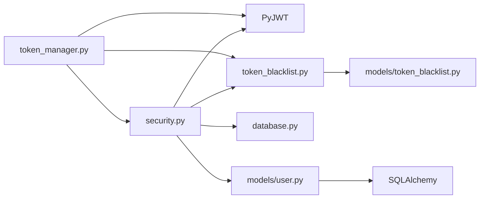

# 令牌验证流程

<cite>
**本文引用的文件**
- [security.py](file://backend/app/core/security.py)
- [token_blacklist.py](file://backend/app/core/token_blacklist.py)
- [token_manager.py](file://backend/app/core/token_manager.py)
- [user.py](file://backend/app/models/user.py)
- [auth.py](file://backend/app/api/v1/auth/auth.py)
</cite>

## 目录
1. [简介](#简介)
2. [项目结构](#项目结构)
3. [核心组件](#核心组件)
4. [架构总览](#架构总览)
5. [详细组件分析](#详细组件分析)
6. [依赖关系分析](#依赖关系分析)
7. [性能考虑](#性能考虑)
8. [故障排查指南](#故障排查指南)
9. [结论](#结论)
10. [附录](#附录)

## 简介
本文聚焦于后端 JWT 令牌验证流程，围绕以下目标展开：
- decode_token 函数的实现原理：令牌解码、签名校验、过期检查。
- get_current_user 依赖的完整验证流程：Bearer 提取、JWT 解码、黑名单检查、类型校验、用户查询、令牌版本校验与强制下线。
- 令牌版本验证机制：token_version 字段校验逻辑与“强制下线”的实现方式。
- FastAPI 路由中使用认证依赖的具体示例与错误处理。
- 安全考虑与性能优化建议。

## 项目结构
本项目的认证相关代码主要位于 backend/app/core 下的 security、token_blacklist、token_manager，以及 models.user 和 api.v1.auth 模块中。整体职责划分如下：
- security.py：提供 Bearer 提取、JWT 编解码、FastAPI 认证依赖（get_current_user）、密码策略与安全中间件等。
- token_blacklist.py：内存+可选数据库持久化的令牌黑名单管理。
- token_manager.py：高层令牌创建、验证、刷新、吊销封装。
- user.py：用户模型，包含 token_version 字段及便捷方法。
- auth.py：认证 API 路由，展示如何在业务层使用认证依赖。

图表来源
- [security.py:228-336](file://backend/app/core/security.py#L228-L336)
- [token_blacklist.py:60-70](file://backend/app/core/token_blacklist.py#L60-L70)
- [user.py:78-143](file://backend/app/models/user.py#L78-L143)
- [auth.py:101-200](file://backend/app/api/v1/auth/auth.py#L101-L200)

章节来源
- [security.py:228-336](file://backend/app/core/security.py#L228-L336)
- [token_blacklist.py:60-70](file://backend/app/core/token_blacklist.py#L60-L70)
- [user.py:78-143](file://backend/app/models/user.py#L78-L143)
- [auth.py:101-200](file://backend/app/api/v1/auth/auth.py#L101-L200)

## 核心组件
- decode_token：基于 PyJWT 对令牌进行解码与签名校验，自动检查过期时间；失败时记录日志并返回 None。
- get_current_user：FastAPI 依赖，负责从 Authorization 头提取 Bearer 令牌，调用 decode_token，执行黑名单检查、类型校验、用户查询与 token_version 校验，最终返回当前用户对象。
- token_blacklist：维护已吊销令牌的集合，支持内存存储与数据库持久化，提供 is_blacklisted 查询接口。
- token_manager：高层令牌操作（创建、验证、刷新、吊销），内部复用 security 与 blacklist。
- User 模型：包含 token_version 字段，提供 token_version_safe 属性与 revoke_all_tokens 方法以支持强制下线。

章节来源
- [security.py:228-336](file://backend/app/core/security.py#L228-L336)
- [token_blacklist.py:27-70](file://backend/app/core/token_blacklist.py#L27-L70)
- [token_manager.py:135-168](file://backend/app/core/token_manager.py#L135-L168)
- [user.py:78-143](file://backend/app/models/user.py#L78-L143)

## 架构总览
下图展示了从客户端请求到认证完成的端到端流程，包括 Bearer 提取、JWT 解码、黑名单检查、类型校验、用户查询与版本校验。

图表来源
- [security.py:243-336](file://backend/app/core/security.py#L243-L336)
- [token_blacklist.py:60-70](file://backend/app/core/token_blacklist.py#L60-L70)
- [user.py:78-143](file://backend/app/models/user.py#L78-L143)

## 详细组件分析

### decode_token 函数
- 功能：使用配置的密钥与算法对 JWT 进行解码，自动校验签名与过期时间。
- 行为：解码成功返回 payload；捕获 JWTError 并记录调试日志，返回 None。
- 关键点：
  - 使用 PyJWT 的 jwt.decode，传入 SECRET_KEY 与 algorithms=[ALGORITHM]。
  - 过期检查由库自动完成，无需额外逻辑。
  - 失败路径统一为 None，便于上层统一处理。

图表来源
- [security.py:228-235](file://backend/app/core/security.py#L228-L235)

章节来源
- [security.py:228-235](file://backend/app/core/security.py#L228-L235)

### get_current_user 依赖
- 功能：FastAPI 依赖，用于受保护路由的认证前置检查。
- 流程：
  - 从 HTTPAuthorizationCredentials 提取 Bearer 令牌。
  - 调用 decode_token 解码并校验签名/过期。
  - 若 payload 为空，返回 401。
  - 黑名单检查：若 payload.jti 存在且在黑名单中，返回 401。
  - 类型校验：若 payload.type 存在且不等于 "access"，返回 401。
  - 用户查询：根据 payload.sub（用户名）查询数据库中的用户。
  - 令牌版本校验：比较 payload.token_version 与用户 token_version_safe；若用户版本大于 0 而令牌缺少版本声明，或两者不一致，返回 401。
  - 审计归因：将当前用户 ID 写入上下文变量，供后续审计事件使用。
  - 返回用户对象。

图表来源
- [security.py:243-336](file://backend/app/core/security.py#L243-L336)
- [token_blacklist.py:60-70](file://backend/app/core/token_blacklist.py#L60-L70)
- [user.py:78-143](file://backend/app/models/user.py#L78-L143)

章节来源
- [security.py:243-336](file://backend/app/core/security.py#L243-L336)
- [token_blacklist.py:60-70](file://backend/app/core/token_blacklist.py#L60-L70)
- [user.py:78-143](file://backend/app/models/user.py#L78-L143)

### 令牌版本验证机制与强制下线
- 字段来源：User.token_version（默认 0），提供 token_version_safe 属性确保非空整数。
- 校验逻辑：
  - 若 payload 缺少 token_version 且用户 current_version > 0，拒绝访问（防止旧版或伪造令牌绕过）。
  - 若 payload 包含 token_version 但与 current_version 不一致，拒绝访问。
- 强制下线：
  - 调用 User.revoke_all_tokens 递增 token_version，使所有现有 JWT 立即失效。
  - 同时记录密码修改时间，增强安全性。

图表来源
- [security.py:306-323](file://backend/app/core/security.py#L306-L323)
- [user.py:78-143](file://backend/app/models/user.py#L78-L143)

章节来源
- [security.py:306-323](file://backend/app/core/security.py#L306-L323)
- [user.py:78-143](file://backend/app/models/user.py#L78-L143)

### FastAPI 路由中使用认证依赖的示例
- 登录接口：展示速率限制、凭据校验、账户锁定检查、机器码绑定验证等。
- 受保护接口：通过 Depends(get_current_user) 获取当前用户，并在业务逻辑中使用。
- 错误处理：统一抛出 HTTPException，携带状态码与详细信息，必要时设置 WWW-Authenticate 响应头。

图表来源
- [auth.py:101-200](file://backend/app/api/v1/auth/auth.py#L101-L200)
- [security.py:243-336](file://backend/app/core/security.py#L243-L336)
- [token_blacklist.py:60-70](file://backend/app/core/token_blacklist.py#L60-L70)

章节来源
- [auth.py:101-200](file://backend/app/api/v1/auth/auth.py#L101-L200)
- [security.py:243-336](file://backend/app/core/security.py#L243-L336)

## 依赖关系分析
- security.py 依赖：
  - PyJWT：用于令牌编码与解码。
  - fastapi.security.HTTPBearer：用于提取 Bearer 令牌。
  - app.core.token_blacklist.is_blacklisted：黑名单查询。
  - app.core.database.SessionLocal 与 app.models.user.User：延迟导入以避免循环依赖。
- token_blacklist.py 依赖：
  - 内存字典 _blacklist 与线程锁 _BLACKLIST_LOCK。
  - 可选数据库模型 TokenBlacklist 用于持久化。
- token_manager.py 依赖：
  - security.SECRET_KEY 与 ALGORITHM。
  - token_blacklist.add/is_blacklisted。
  - jwt 库进行解码与编码。
- user.py 依赖：
  - SQLAlchemy 列定义，包含 token_version 字段。
  - 提供 token_version_safe 与 revoke_all_tokens 方法。

图表来源
- [security.py:228-336](file://backend/app/core/security.py#L228-L336)
- [token_blacklist.py:27-103](file://backend/app/core/token_blacklist.py#L27-L103)
- [token_manager.py:135-168](file://backend/app/core/token_manager.py#L135-L168)
- [user.py:78-143](file://backend/app/models/user.py#L78-L143)

章节来源
- [security.py:228-336](file://backend/app/core/security.py#L228-L336)
- [token_blacklist.py:27-103](file://backend/app/core/token_blacklist.py#L27-L103)
- [token_manager.py:135-168](file://backend/app/core/token_manager.py#L135-L168)
- [user.py:78-143](file://backend/app/models/user.py#L78-L143)

## 性能考虑
- 延迟导入：在 get_current_user 中延迟导入 database 与 user 模型，避免启动时循环依赖与不必要的初始化开销。
- 内存黑名单：token_blacklist 使用内存字典存储，配合定期清理过期条目，减少数据库压力。
- 数据库查询：仅按 username 查询一次用户，尽量减少连接与事务开销。
- 令牌版本校验：在内存中进行整数比较，成本极低。
- 建议：
  - 在高并发场景下，可考虑将黑名单迁移至 Redis 以提升吞吐与一致性。
  - 对频繁调用的受保护接口，结合缓存策略减少重复的用户查询。
  - 合理配置 ACCESS_TOKEN_EXPIRE_MINUTES 与 REFRESH_TOKEN_EXPIRE_DAYS，平衡安全与用户体验。

[本节为通用指导，不直接分析具体文件]

## 故障排查指南
- 常见错误与定位：
  - 401 未授权：检查 Authorization 头是否正确传递 Bearer 令牌；确认 decode_token 是否返回 None（可能由于签名错误或过期）。
  - 401 令牌已被吊销：检查黑名单中是否存在对应 jti；确认登出或吊销流程是否成功写入内存与数据库。
  - 401 令牌类型不匹配：确认请求使用的是 access 令牌而非 refresh 或其他类型。
  - 401 用户不存在：确认 payload.sub 对应的用户是否存在于数据库。
  - 401 令牌已失效（版本不匹配或缺少版本）：检查用户 token_version 是否已递增；确认新令牌生成时是否包含正确的 token_version。
- 日志与监控：
  - 关注 security.py 中的调试日志，定位解码失败原因。
  - 关注 token_blacklist.py 的清理日志，确认过期条目是否正常移除。
  - 关注业务层的审计日志，追踪登录失败与强制下线事件。

章节来源
- [security.py:228-336](file://backend/app/core/security.py#L228-L336)
- [token_blacklist.py:117-125](file://backend/app/core/token_blacklist.py#L117-L125)
- [auth.py:101-200](file://backend/app/api/v1/auth/auth.py#L101-L200)

## 结论
本项目实现了完整的 JWT 令牌验证流程，涵盖解码、签名校验、过期检查、黑名单验证、类型校验、用户查询与令牌版本校验。通过 token_version 字段与 revoke_all_tokens 方法，系统支持“强制下线”能力，确保在敏感操作后能立即使旧令牌失效。get_current_user 作为统一的认证入口，提供了清晰、可扩展的安全保障。建议在高性能场景下进一步优化黑名单存储与用户查询缓存，以提升整体吞吐与稳定性。

[本节为总结性内容，不直接分析具体文件]

## 附录
- 安全最佳实践：
  - 始终在生产环境使用强随机密钥，避免硬编码。
  - 启用 HTTPS 传输，防止令牌泄露。
  - 定期轮换密钥与令牌有效期，降低风险窗口。
  - 对敏感字段进行脱敏与加密存储。
- 性能优化建议：
  - 使用连接池与索引优化数据库查询。
  - 引入分布式缓存（如 Redis）提升黑名单查询性能。
  - 对高频接口实施合理的限流与熔断策略。

[本节为通用指导，不直接分析具体文件]