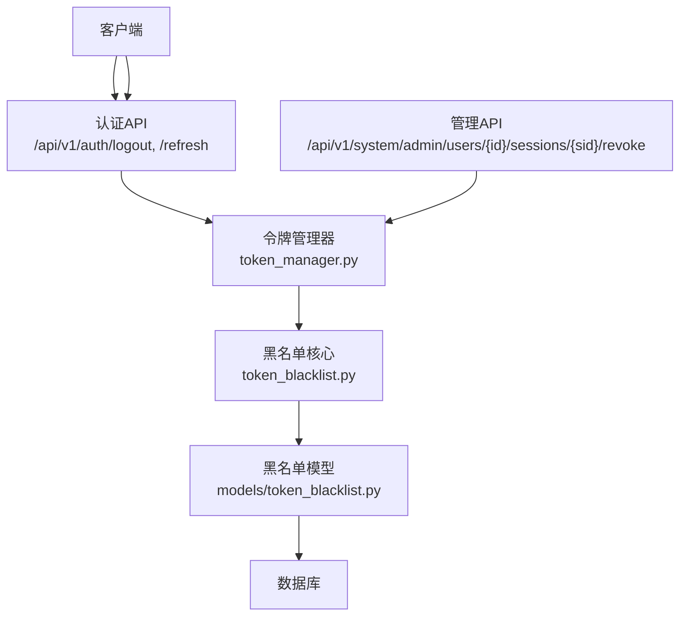
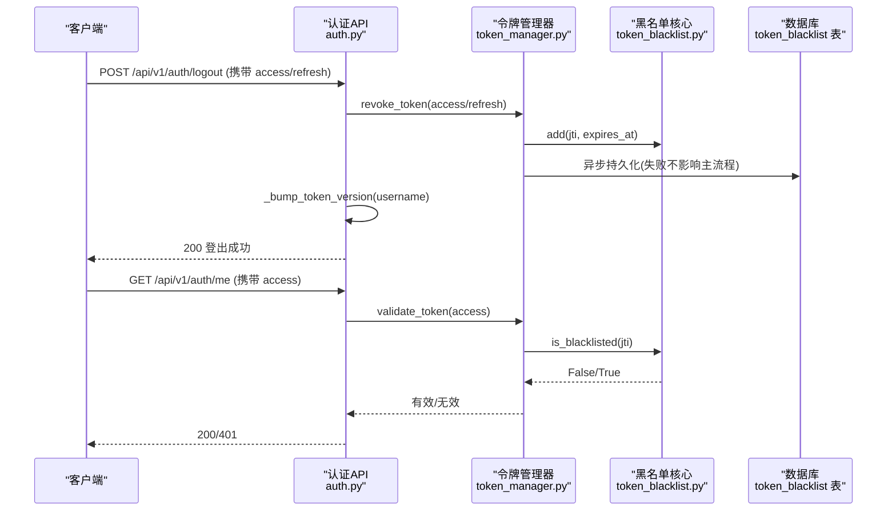
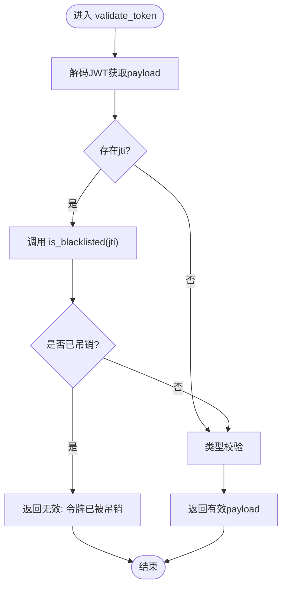
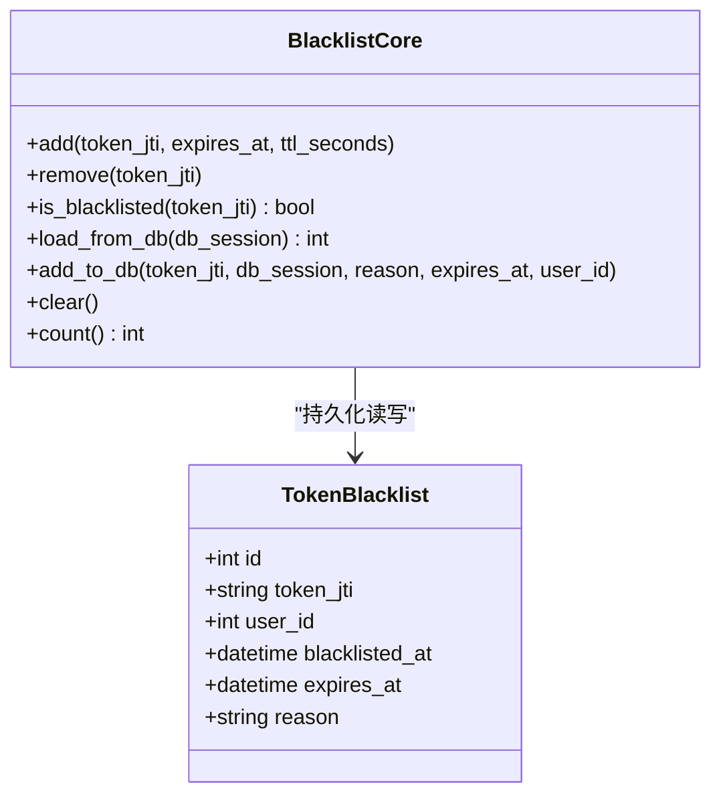
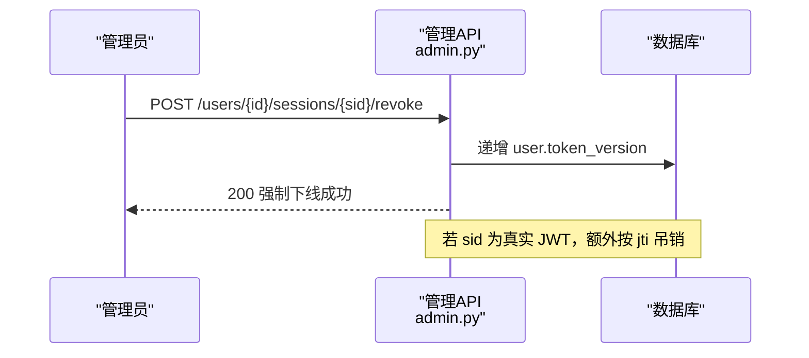
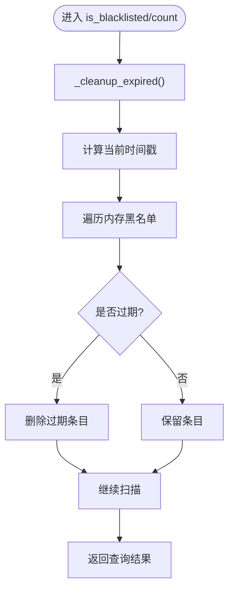
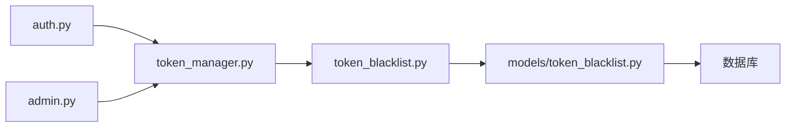

# 令牌黑名单机制

<cite>
**本文引用的文件**
- [backend/app/core/token_blacklist.py](file://backend/app/core/token_blacklist.py)
- [backend/app/models/token_blacklist.py](file://backend/app/models/token_blacklist.py)
- [backend/app/core/token_manager.py](file://backend/app/core/token_manager.py)
- [backend/app/api/v1/auth/auth.py](file://backend/app/api/v1/auth/auth.py)
- [backend/app/api/v1/system/admin.py](file://backend/app/api/v1/system/admin.py)
- [backend/alembic/versions/token_version_001_add_token_version.py](file://backend/alembic/versions/token_version_001_add_token_version.py)
- [backend/scripts/clear_token_blacklist.py](file://backend/scripts/clear_token_blacklist.py)
</cite>

## 目录
1. [简介](#简介)
2. [项目结构](#项目结构)
3. [核心组件](#核心组件)
4. [架构总览](#架构总览)
5. [详细组件分析](#详细组件分析)
6. [依赖关系分析](#依赖关系分析)
7. [性能考虑](#性能考虑)
8. [故障排查指南](#故障排查指南)
9. [结论](#结论)
10. [附录：代码示例路径](#附录代码示例路径)

## 简介
本技术文档围绕 JWT 令牌黑名单机制展开，系统性说明令牌吊销的实现原理、强制下线能力、持久化存储方案与索引优化、以及安全与性能策略。重点覆盖以下方面：
- is_blacklisted 的查询逻辑与内存清理机制
- 黑名单存储结构与数据库表设计
- 过期清理与数据生命周期管理
- 强制下线（批量吊销用户会话）的实现：token_version 递增、实时失效
- 单条吊销与用户级批量吊销的操作方法
- 安全性与性能优化建议

## 项目结构
本项目在认证鉴权链路中实现了“内存黑名单 + 数据库持久化”的双层机制，并通过 token_version 实现“用户级强制下线”。关键位置如下：
- 黑名单核心模块：backend/app/core/token_blacklist.py
- 黑名单数据模型：backend/app/models/token_blacklist.py
- 令牌签发/校验/吊销：backend/app/core/token_manager.py
- 登出与刷新接口：backend/app/api/v1/auth/auth.py
- 管理员强制下线接口：backend/app/api/v1/system/admin.py
- 用户表增加 token_version 字段迁移：backend/alembic/versions/token_version_001_add_token_version.py
- 运维脚本：backend/scripts/clear_token_blacklist.py

图表来源
- [backend/app/core/token_manager.py:135-168](file://backend/app/core/token_manager.py#L135-L168)
- [backend/app/core/token_blacklist.py:60-103](file://backend/app/core/token_blacklist.py#L60-L103)
- [backend/app/models/token_blacklist.py:13-57](file://backend/app/models/token_blacklist.py#L13-L57)
- [backend/app/api/v1/auth/auth.py:570-591](file://backend/app/api/v1/auth/auth.py#L570-L591)
- [backend/app/api/v1/system/admin.py:441-469](file://backend/app/api/v1/system/admin.py#L441-L469)

章节来源
- [backend/app/core/token_blacklist.py:1-163](file://backend/app/core/token_blacklist.py#L1-L163)
- [backend/app/models/token_blacklist.py:1-61](file://backend/app/models/token_blacklist.py#L1-L61)
- [backend/app/core/token_manager.py:1-283](file://backend/app/core/token_manager.py#L1-L283)
- [backend/app/api/v1/auth/auth.py:508-591](file://backend/app/api/v1/auth/auth.py#L508-L591)
- [backend/app/api/v1/system/admin.py:441-469](file://backend/app/api/v1/system/admin.py#L441-L469)
- [backend/alembic/versions/token_version_001_add_token_version.py:19-33](file://backend/alembic/versions/token_version_001_add_token_version.py#L19-L33)

## 核心组件
- 令牌管理器（token_manager.py）
  - 负责创建 access/refresh 令牌对、校验令牌、吊销令牌、刷新令牌。
  - 校验流程会调用黑名单检查，确保被吊销的令牌立即失效。
- 黑名单核心（token_blacklist.py）
  - 提供内存黑名单的增删查、过期清理、从数据库加载未过期条目、写入数据库等能力。
  - 使用线程锁保护并发访问，保证高并发下的正确性。
- 黑名单数据模型（models/token_blacklist.py）
  - 定义 token_blacklist 表结构，包含 jti、user_id、blacklisted_at、expires_at、reason 等字段，并建立复合索引以优化查询。
- 认证API（auth.py）
  - 登出接口：吊销当前请求携带的 access/refresh 令牌，并递增用户 token_version，使该用户所有现存令牌立即失效。
  - 刷新接口：校验旧 refresh 令牌后吊销并签发新令牌对，同时将 token_version 注入新令牌以便后续版本校验。
- 管理API（admin.py）
  - 强制下线接口：通过递增目标用户的 token_version 实现“批量吊销”，若传入真实 JWT 则额外按 jti 吊销。

章节来源
- [backend/app/core/token_manager.py:64-127](file://backend/app/core/token_manager.py#L64-L127)
- [backend/app/core/token_manager.py:135-168](file://backend/app/core/token_manager.py#L135-L168)
- [backend/app/core/token_manager.py:176-210](file://backend/app/core/token_manager.py#L176-L210)
- [backend/app/core/token_blacklist.py:27-70](file://backend/app/core/token_blacklist.py#L27-L70)
- [backend/app/models/token_blacklist.py:13-57](file://backend/app/models/token_blacklist.py#L13-L57)
- [backend/app/api/v1/auth/auth.py:570-591](file://backend/app/api/v1/auth/auth.py#L570-L591)
- [backend/app/api/v1/system/admin.py:441-469](file://backend/app/api/v1/system/admin.py#L441-L469)

## 架构总览
下图展示了令牌从签发到校验、再到吊销与强制下线的完整流程，包括内存黑名单与数据库持久化的协作方式。

图表来源
- [backend/app/api/v1/auth/auth.py:570-591](file://backend/app/api/v1/auth/auth.py#L570-L591)
- [backend/app/core/token_manager.py:135-168](file://backend/app/core/token_manager.py#L135-L168)
- [backend/app/core/token_manager.py:176-210](file://backend/app/core/token_manager.py#L176-L210)
- [backend/app/core/token_blacklist.py:60-103](file://backend/app/core/token_blacklist.py#L60-L103)
- [backend/app/models/token_blacklist.py:13-57](file://backend/app/models/token_blacklist.py#L13-L57)

## 详细组件分析

### 令牌校验与黑名单检查
- 校验入口：validate_token 解码 JWT，提取 jti，调用 is_blacklisted 进行黑名单检查；类型不匹配或黑名单命中均返回无效。
- 黑名单查询：is_blacklisted 先执行过期清理，再判断 jti 是否在内存集合中。
- 持久化：revoke_token 将 jti 加入内存黑名单，并后台持久化到数据库，失败不影响主流程。

图表来源
- [backend/app/core/token_manager.py:135-168](file://backend/app/core/token_manager.py#L135-L168)
- [backend/app/core/token_blacklist.py:60-70](file://backend/app/core/token_blacklist.py#L60-L70)

章节来源
- [backend/app/core/token_manager.py:135-168](file://backend/app/core/token_manager.py#L135-L168)
- [backend/app/core/token_blacklist.py:60-70](file://backend/app/core/token_blacklist.py#L60-L70)

### 黑名单存储结构与过期清理
- 内存结构：dict[token_jti, expiry_epoch]，每次添加或查询时触发过期清理，使用线程锁保护并发。
- 数据库结构：token_blacklist 表包含 jti（唯一）、user_id、blacklisted_at、expires_at、reason，并提供复合索引 idx_token_blacklist_user_time 与 idx_token_blacklist_expires。
- 加载策略：服务启动或需要时从数据库加载未过期的记录到内存，避免重启后黑名单丢失。

图表来源
- [backend/app/models/token_blacklist.py:13-57](file://backend/app/models/token_blacklist.py#L13-L57)
- [backend/app/core/token_blacklist.py:27-103](file://backend/app/core/token_blacklist.py#L27-L103)

章节来源
- [backend/app/models/token_blacklist.py:13-57](file://backend/app/models/token_blacklist.py#L13-L57)
- [backend/app/core/token_blacklist.py:27-126](file://backend/app/core/token_blacklist.py#L27-L126)

### 强制下线功能（批量吊销用户会话）
- 用户登出：logout 接口不仅吊销当前请求携带的令牌，还递增该用户的 token_version，使该用户所有现存 JWT（含其他设备/会话）立即失效。
- 管理员强制下线：admin 接口通过递增目标用户的 token_version 实现“批量吊销”，若 session_id 为真实 JWT，则额外按 jti 吊销。
- 刷新令牌：refresh 接口在签发新令牌时将 token_version 注入 payload，后续校验可结合版本策略进一步拦截旧版本令牌。

图表来源
- [backend/app/api/v1/system/admin.py:441-469](file://backend/app/api/v1/system/admin.py#L441-L469)
- [backend/app/api/v1/auth/auth.py:508-522](file://backend/app/api/v1/auth/auth.py#L508-L522)
- [backend/alembic/versions/token_version_001_add_token_version.py:19-33](file://backend/alembic/versions/token_version_001_add_token_version.py#L19-L33)

章节来源
- [backend/app/api/v1/auth/auth.py:508-522](file://backend/app/api/v1/auth/auth.py#L508-L522)
- [backend/app/api/v1/system/admin.py:441-469](file://backend/app/api/v1/system/admin.py#L441-L469)
- [backend/alembic/versions/token_version_001_add_token_version.py:19-33](file://backend/alembic/versions/token_version_001_add_token_version.py#L19-L33)

### 过期清理机制
- 内存清理：每次 is_blacklisted 或 count 调用前执行 _cleanup_expired，删除已过期的条目，避免内存膨胀。
- 数据库加载：load_from_db 仅加载未过期的记录到内存，确保重启后黑名单状态一致。
- 默认TTL：当未提供 expires_at 时，使用默认 TTL（如 86400 秒），保证黑名单条目不会无限期驻留。

图表来源
- [backend/app/core/token_blacklist.py:60-70](file://backend/app/core/token_blacklist.py#L60-L70)
- [backend/app/core/token_blacklist.py:117-126](file://backend/app/core/token_blacklist.py#L117-L126)

章节来源
- [backend/app/core/token_blacklist.py:60-70](file://backend/app/core/token_blacklist.py#L60-L70)
- [backend/app/core/token_blacklist.py:117-126](file://backend/app/core/token_blacklist.py#L117-L126)

### 持久化存储方案与索引优化
- 表结构设计：
  - token_jti：唯一且带索引，用于快速查找与去重。
  - user_id：带索引，便于按用户维度统计与清理。
  - blacklisted_at：带索引，支持按时间范围查询。
  - expires_at：带索引，支持过期清理与范围筛选。
  - reason：记录吊销原因，便于审计。
- 复合索引：
  - idx_token_blacklist_user_time：联合 user_id 与 blacklisted_at，优化用户维度的时间序列查询。
  - idx_token_blacklist_expires：优化过期清理与批量删除。
- 性能考虑：
  - 高频读取走内存，数据库主要用于持久化与恢复。
  - 过期清理在热路径上轻量执行，避免全表扫描。
  - 数据库写入采用事务提交，异常时回滚并记录日志。

章节来源
- [backend/app/models/token_blacklist.py:13-57](file://backend/app/models/token_blacklist.py#L13-L57)
- [backend/app/core/token_blacklist.py:73-103](file://backend/app/core/token_blacklist.py#L73-L103)
- [backend/app/core/token_blacklist.py:133-163](file://backend/app/core/token_blacklist.py#L133-L163)

### 安全与性能优化策略
- 安全性：
  - 统一校验出口：validate_token 作为唯一校验点，强制检查黑名单与令牌类型，防止绕过。
  - 强制下线：通过 token_version 递增实现“用户级批量吊销”，即使令牌未被显式加入黑名单也能立即失效。
  - 刷新轮换：refresh 接口吊销旧 refresh 令牌并签发新令牌对，降低重放风险。
- 性能：
  - 内存黑名单 + 数据库持久化：读路径低延迟，写路径异步化（失败不影响主流程）。
  - 过期清理：在热路径中增量清理，避免全量扫描。
  - 索引优化：针对高频查询字段建立索引，减少数据库压力。

章节来源
- [backend/app/core/token_manager.py:135-168](file://backend/app/core/token_manager.py#L135-L168)
- [backend/app/api/v1/auth/auth.py:570-591](file://backend/app/api/v1/auth/auth.py#L570-L591)
- [backend/app/api/v1/system/admin.py:441-469](file://backend/app/api/v1/system/admin.py#L441-L469)
- [backend/app/models/token_blacklist.py:13-57](file://backend/app/models/token_blacklist.py#L13-L57)

## 依赖关系分析
- token_manager 依赖 token_blacklist 进行黑名单检查与持久化。
- auth.py 与 admin.py 通过 token_manager 暴露登出、刷新、强制下线等能力。
- models/token_blacklist.py 提供数据库表映射，供 token_blacklist 持久化使用。
- alembic 迁移确保 users 表具备 token_version 字段，支撑强制下线。

图表来源
- [backend/app/api/v1/auth/auth.py:570-591](file://backend/app/api/v1/auth/auth.py#L570-L591)
- [backend/app/api/v1/system/admin.py:441-469](file://backend/app/api/v1/system/admin.py#L441-L469)
- [backend/app/core/token_manager.py:135-210](file://backend/app/core/token_manager.py#L135-L210)
- [backend/app/core/token_blacklist.py:60-163](file://backend/app/core/token_blacklist.py#L60-L163)
- [backend/app/models/token_blacklist.py:13-57](file://backend/app/models/token_blacklist.py#L13-L57)

章节来源
- [backend/app/core/token_manager.py:135-210](file://backend/app/core/token_manager.py#L135-L210)
- [backend/app/core/token_blacklist.py:60-163](file://backend/app/core/token_blacklist.py#L60-L163)
- [backend/app/models/token_blacklist.py:13-57](file://backend/app/models/token_blacklist.py#L13-L57)

## 性能考虑
- 读路径优化：is_blacklisted 使用内存字典 O(1) 查找，配合过期清理控制内存占用。
- 写路径优化：数据库写入失败不影响主流程，提升可用性。
- 索引优化：针对 jti、user_id、blacklisted_at、expires_at 建立索引，提高查询效率。
- 批量操作：强制下线通过 token_version 递增实现“批量吊销”，避免逐条黑名单写入。
- 监控与告警：建议在黑名单写入失败、数据库连接异常、过期清理耗时过长等场景增加监控指标。

[本节为通用性能指导，无需特定文件引用]

## 故障排查指南
- 常见问题：
  - 登出后仍可使用令牌：确认 validate_token 是否调用 is_blacklisted；确认 logout 是否递增 token_version。
  - 强制下线无效：确认 users 表是否存在 token_version 字段；确认 admin 接口是否正确递增。
  - 数据库黑名单写入失败：检查数据库连接与事务提交；查看日志中的异常信息。
- 工具与脚本：
  - clear_token_blacklist.py：用于清空内存黑名单，适用于紧急恢复场景。
- 定位步骤：
  - 检查 validate_token 与 is_blacklisted 的调用链。
  - 检查黑名单内存状态与数据库记录一致性。
  - 检查 token_version 字段值变化与后续请求的响应码。

章节来源
- [backend/scripts/clear_token_blacklist.py:12-23](file://backend/scripts/clear_token_blacklist.py#L12-L23)
- [backend/app/core/token_manager.py:135-168](file://backend/app/core/token_manager.py#L135-L168)
- [backend/app/api/v1/auth/auth.py:570-591](file://backend/app/api/v1/auth/auth.py#L570-L591)
- [backend/app/api/v1/system/admin.py:441-469](file://backend/app/api/v1/system/admin.py#L441-L469)

## 结论
本系统通过“内存黑名单 + 数据库持久化 + token_version 版本控制”的组合，实现了高效、可靠、可扩展的 JWT 令牌吊销与强制下线能力。其设计兼顾了安全性与性能，适合在生产环境中大规模部署。建议持续完善监控与告警，确保在高并发与异常场景下的稳定性。

[本节为总结性内容，无需特定文件引用]

## 附录：代码示例路径
以下为实现令牌吊销功能的代码示例路径（不包含具体代码内容）：
- 单条吊销（access/refresh 令牌）：
  - [backend/app/core/token_manager.py:176-210](file://backend/app/core/token_manager.py#L176-L210)
- 用户级批量吊销（强制下线）：
  - [backend/app/api/v1/system/admin.py:441-469](file://backend/app/api/v1/system/admin.py#L441-L469)
- 登出接口（吊销当前令牌 + 递增 token_version）：
  - [backend/app/api/v1/auth/auth.py:570-591](file://backend/app/api/v1/auth/auth.py#L570-L591)
- 黑名单查询与清理：
  - [backend/app/core/token_blacklist.py:60-126](file://backend/app/core/token_blacklist.py#L60-L126)
- 数据库表结构与索引：
  - [backend/app/models/token_blacklist.py:13-57](file://backend/app/models/token_blacklist.py#L13-L57)
- 用户表 token_version 字段迁移：
  - [backend/alembic/versions/token_version_001_add_token_version.py:19-33](file://backend/alembic/versions/token_version_001_add_token_version.py#L19-L33)
- 运维清理脚本：
  - [backend/scripts/clear_token_blacklist.py:12-23](file://backend/scripts/clear_token_blacklist.py#L12-L23)