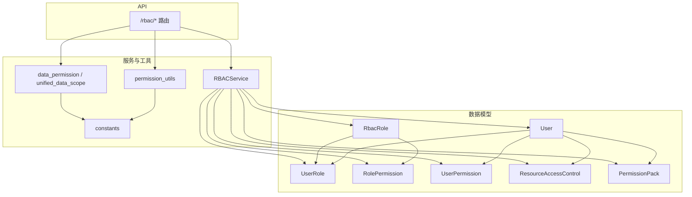
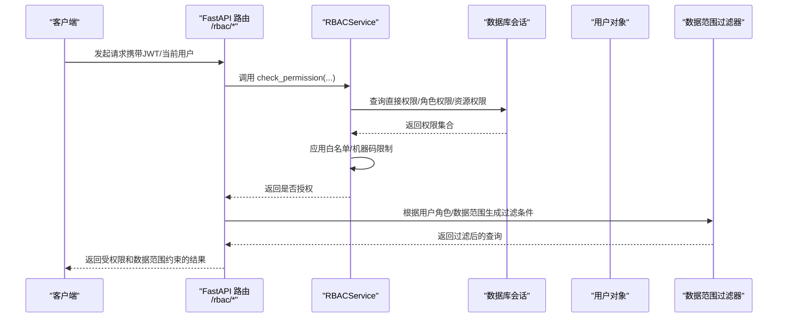
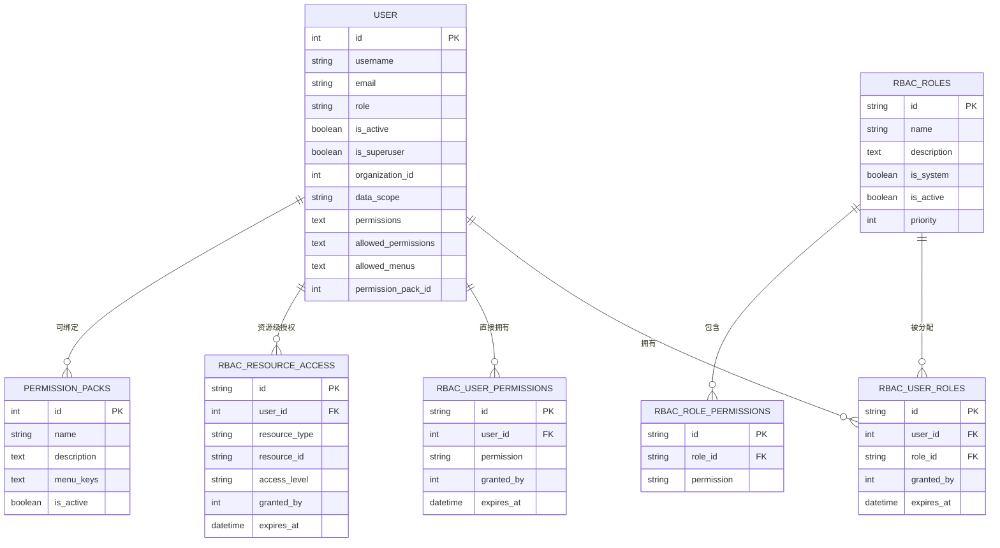
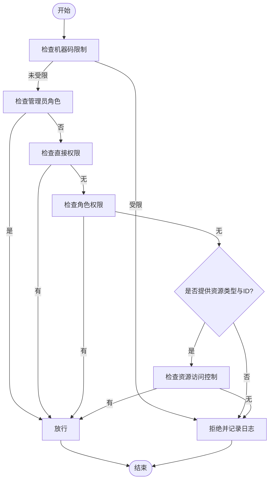
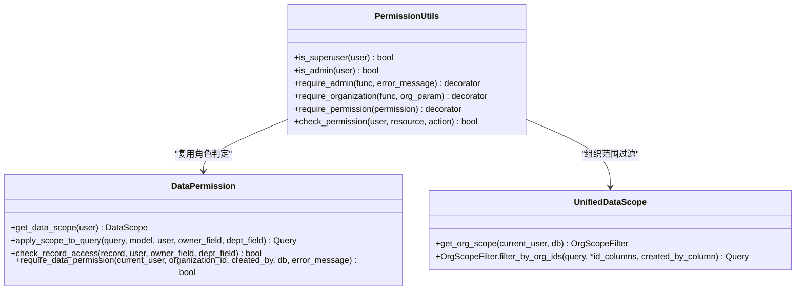
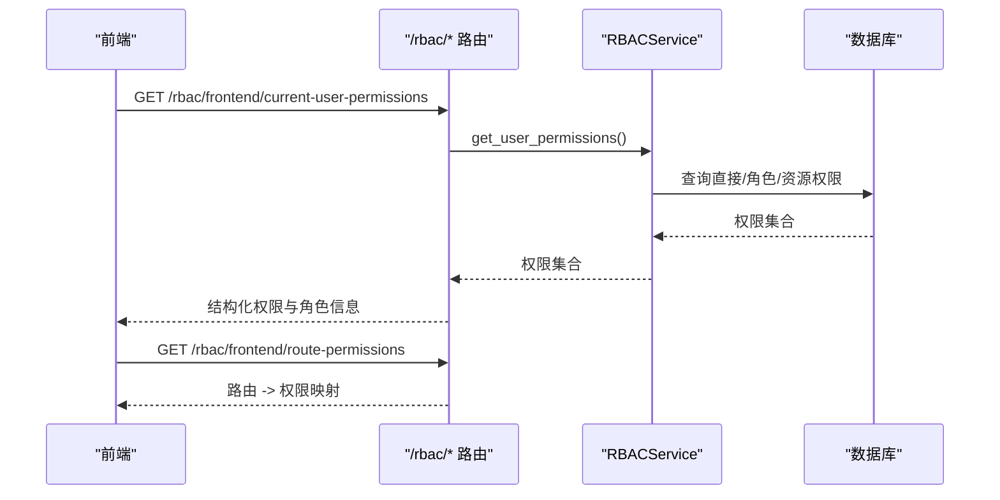
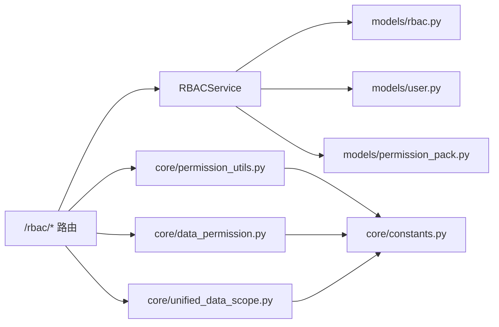

# RBAC权限控制系统

<cite>
**本文引用的文件**
- [backend/app/models/rbac.py](file://backend/app/models/rbac.py)
- [backend/app/models/user.py](file://backend/app/models/user.py)
- [backend/app/models/permission_pack.py](file://backend/app/models/permission_pack.py)
- [backend/app/core/constants.py](file://backend/app/core/constants.py)
- [backend/app/core/permission_utils.py](file://backend/app/core/permission_utils.py)
- [backend/app/core/data_permission.py](file://backend/app/core/data_permission.py)
- [backend/app/core/unified_data_scope.py](file://backend/app/core/unified_data_scope.py)
- [backend/app/services/rbac_service.py](file://backend/app/services/rbac_service.py)
- [backend/app/api/v1/auth/rbac.py](file://backend/app/api/v1/auth/rbac.py)
</cite>

## 目录
1. [简介](#简介)
2. [项目结构](#项目结构)
3. [核心组件](#核心组件)
4. [架构总览](#架构总览)
5. [详细组件分析](#详细组件分析)
6. [依赖关系分析](#依赖关系分析)
7. [性能考虑](#性能考虑)
8. [故障排查指南](#故障排查指南)
9. [结论](#结论)
10. [附录：配置示例与最佳实践](#附录：配置示例与最佳实践)

## 简介
本文件系统性地梳理并说明后端RBAC（基于角色的访问控制）权限体系，覆盖四级角色体系（超级管理员、管理员、普通用户、只读用户）、用户-角色-权限的层次结构与数据模型、细粒度权限控制（菜单、API、数据范围隔离）、以及请求级权限验证中间件与数据访问控制机制。文档同时给出常见权限场景与复杂组合的配置建议与最佳实践。

## 项目结构
RBAC相关代码主要分布在以下模块：
- 数据模型层：定义用户、角色、权限、资源访问控制、权限包等实体及关系
- 服务层：封装权限计算、分配、撤销、查询等核心业务逻辑
- 工具与常量：提供角色判定、组织归属、数据范围过滤等通用能力
- API层：暴露角色管理、权限检查、前端路由权限等接口

图表来源
- [backend/app/models/rbac.py:31-188](file://backend/app/models/rbac.py#L31-L188)
- [backend/app/models/user.py:26-85](file://backend/app/models/user.py#L26-L85)
- [backend/app/models/permission_pack.py:16-47](file://backend/app/models/permission_pack.py#L16-L47)
- [backend/app/services/rbac_service.py:104-320](file://backend/app/services/rbac_service.py#L104-L320)
- [backend/app/core/permission_utils.py:17-359](file://backend/app/core/permission_utils.py#L17-L359)
- [backend/app/core/data_permission.py:20-187](file://backend/app/core/data_permission.py#L20-L187)
- [backend/app/core/unified_data_scope.py:43-185](file://backend/app/core/unified_data_scope.py#L43-L185)
- [backend/app/api/v1/auth/rbac.py:85-524](file://backend/app/api/v1/auth/rbac.py#L85-L524)

章节来源
- [backend/app/models/rbac.py:31-188](file://backend/app/models/rbac.py#L31-L188)
- [backend/app/models/user.py:26-85](file://backend/app/models/user.py#L26-L85)
- [backend/app/models/permission_pack.py:16-47](file://backend/app/models/permission_pack.py#L16-L47)
- [backend/app/services/rbac_service.py:104-320](file://backend/app/services/rbac_service.py#L104-L320)
- [backend/app/core/permission_utils.py:17-359](file://backend/app/core/permission_utils.py#L17-L359)
- [backend/app/core/data_permission.py:20-187](file://backend/app/core/data_permission.py#L20-L187)
- [backend/app/core/unified_data_scope.py:43-185](file://backend/app/core/unified_data_scope.py#L43-L185)
- [backend/app/api/v1/auth/rbac.py:85-524](file://backend/app/api/v1/auth/rbac.py#L85-L524)

## 核心组件
- 四级角色体系与常量
  - 角色常量与归一化：超级管理员、管理员、普通用户、只读用户；历史角色值在入口处归一化
  - 管理员集合用于快速判断是否拥有系统级权限
- 用户模型与字段
  - role、is_superuser、organization_id、data_scope、permissions、allowed_permissions、allowed_menus、permission_pack_id 等字段支撑角色、权限、菜单与数据范围
- RBAC 数据模型
  - 角色、用户-角色关联、角色-权限关联、用户直接权限、资源访问控制、访问日志、机器码权限等
- 权限服务
  - 统一权限计算：直接权限 + 角色权限 + 资源权限，结合白名单与机器码限制
  - 批量授予/撤销、原子保存、角色分配/撤销、权限检查与审计日志
- 权限工具与数据范围
  - 管理员/超级管理员判定、组织归属获取、装饰器级权限校验
  - 数据范围：全部、本部门、仅本人；统一组织树范围过滤
- API 路由
  - 角色CRUD、用户权限查看、权限检查、前端路由权限映射等

章节来源
- [backend/app/core/constants.py:27-87](file://backend/app/core/constants.py#L27-L87)
- [backend/app/models/user.py:26-85](file://backend/app/models/user.py#L26-L85)
- [backend/app/models/rbac.py:31-188](file://backend/app/models/rbac.py#L31-L188)
- [backend/app/services/rbac_service.py:104-320](file://backend/app/services/rbac_service.py#L104-L320)
- [backend/app/core/permission_utils.py:17-359](file://backend/app/core/permission_utils.py#L17-L359)
- [backend/app/core/data_permission.py:20-187](file://backend/app/core/data_permission.py#L20-L187)
- [backend/app/core/unified_data_scope.py:43-185](file://backend/app/core/unified_data_scope.py#L43-L185)
- [backend/app/api/v1/auth/rbac.py:85-524](file://backend/app/api/v1/auth/rbac.py#L85-L524)

## 架构总览
下图展示从请求进入API到权限校验、数据范围过滤的整体流程，以及各组件之间的调用关系。

图表来源
- [backend/app/api/v1/auth/rbac.py:85-123](file://backend/app/api/v1/auth/rbac.py#L85-L123)
- [backend/app/services/rbac_service.py:133-222](file://backend/app/services/rbac_service.py#L133-L222)
- [backend/app/core/unified_data_scope.py:279-343](file://backend/app/core/unified_data_scope.py#L279-L343)

## 详细组件分析

### 数据模型与层次结构
- 用户与角色
  - 用户表包含基础信息、角色、组织、数据范围、权限列表、菜单白名单、权限包绑定等
  - 角色表支持系统内置标记、优先级、启用状态
  - 用户-角色关联支持授权人、过期时间
- 权限与资源
  - 角色-权限关联：将权限标识绑定到角色
  - 用户直接权限：针对特定用户的细粒度授权
  - 资源访问控制：按资源类型与ID进行读写删级别控制
  - 访问日志：记录每次权限检查的决策原因
  - 机器码权限：设备维度的功能限制
- 权限包
  - 预定义菜单key集合，可批量绑定给用户，作为菜单可见性的一种策略

图表来源
- [backend/app/models/user.py:26-85](file://backend/app/models/user.py#L26-L85)
- [backend/app/models/rbac.py:31-188](file://backend/app/models/rbac.py#L31-L188)
- [backend/app/models/permission_pack.py:16-47](file://backend/app/models/permission_pack.py#L16-L47)

章节来源
- [backend/app/models/user.py:26-85](file://backend/app/models/user.py#L26-L85)
- [backend/app/models/rbac.py:31-188](file://backend/app/models/rbac.py#L31-L188)
- [backend/app/models/permission_pack.py:16-47](file://backend/app/models/permission_pack.py#L16-L47)

### 权限计算与服务
- 权限计算顺序
  - 先检查机器码限制（若命中则拒绝）
  - 再检查管理员角色（通过则放行）
  - 然后检查用户直接权限
  - 接着检查角色权限
  - 最后检查资源级访问控制（当提供资源类型与ID时）
- 白名单与权限包
  - 若用户设置了白名单权限，最终有效权限为“角色+直接权限”与白名单的交集
  - 菜单解析优先级：用户级 allowed_menus > 绑定的启用中权限包 > 角色默认菜单
- 批量操作与事务
  - 批量授予/撤销、原子保存（删除旧权限+授予新权限）均使用事务边界保证一致性
- 审计日志
  - 每次权限检查都会记录用户、动作、资源、结果与原因

图表来源
- [backend/app/services/rbac_service.py:133-222](file://backend/app/services/rbac_service.py#L133-L222)
- [backend/app/services/rbac_service.py:237-320](file://backend/app/services/rbac_service.py#L237-L320)
- [backend/app/models/rbac.py:163-218](file://backend/app/models/rbac.py#L163-L218)

章节来源
- [backend/app/services/rbac_service.py:133-222](file://backend/app/services/rbac_service.py#L133-L222)
- [backend/app/services/rbac_service.py:237-320](file://backend/app/services/rbac_service.py#L237-L320)
- [backend/app/models/rbac.py:163-218](file://backend/app/models/rbac.py#L163-L218)

### 权限验证中间件与装饰器
- 管理员/超级管理员判定
  - 通过 is_admin/is_superuser 快速判断是否具备系统级权限
- 组织访问控制
  - require_organization 确保非管理员只能访问自己所属组织的数据
- 细粒度权限检查
  - require_permission 装饰器对资源:动作进行校验
  - check_permission 支持通配符匹配（如 *:*、*:read、village:*）
- 数据范围过滤
  - apply_scope_to_query/filter_by_data_scope 根据角色与数据范围自动附加SQL过滤条件
  - OrgScopeFilter 支持按组织树进行精确过滤

图表来源
- [backend/app/core/permission_utils.py:17-359](file://backend/app/core/permission_utils.py#L17-L359)
- [backend/app/core/data_permission.py:20-187](file://backend/app/core/data_permission.py#L20-L187)
- [backend/app/core/unified_data_scope.py:43-185](file://backend/app/core/unified_data_scope.py#L43-L185)
- [backend/app/core/unified_data_scope.py:191-343](file://backend/app/core/unified_data_scope.py#L191-L343)

章节来源
- [backend/app/core/permission_utils.py:17-359](file://backend/app/core/permission_utils.py#L17-L359)
- [backend/app/core/data_permission.py:20-187](file://backend/app/core/data_permission.py#L20-L187)
- [backend/app/core/unified_data_scope.py:43-185](file://backend/app/core/unified_data_scope.py#L43-L185)
- [backend/app/core/unified_data_scope.py:191-343](file://backend/app/core/unified_data_scope.py#L191-L343)

### API 路由与前端集成
- 权限检查接口
  - POST /rbac/check：传入权限标识与可选资源信息，返回是否授权
- 用户权限与角色查询
  - GET /rbac/user/{user_id}/permissions：返回用户所有权限
  - GET /rbac/user/{user_id}/roles：返回用户角色列表
- 角色管理
  - 创建/更新/删除角色，列出角色及其权限
- 权限分配
  - 分配/撤销角色，授予/撤销用户直接权限，原子保存权限集合
- 前端专用接口
  - /rbac/frontend/current-user-permissions：返回前端需要的结构化权限与角色信息
  - /rbac/frontend/route-permissions：返回路由到权限的映射，供前端路由守卫使用

图表来源
- [backend/app/api/v1/auth/rbac.py:85-123](file://backend/app/api/v1/auth/rbac.py#L85-L123)
- [backend/app/api/v1/auth/rbac.py:442-524](file://backend/app/api/v1/auth/rbac.py#L442-L524)
- [backend/app/services/rbac_service.py:237-320](file://backend/app/services/rbac_service.py#L237-L320)

章节来源
- [backend/app/api/v1/auth/rbac.py:85-123](file://backend/app/api/v1/auth/rbac.py#L85-L123)
- [backend/app/api/v1/auth/rbac.py:442-524](file://backend/app/api/v1/auth/rbac.py#L442-L524)
- [backend/app/services/rbac_service.py:237-320](file://backend/app/services/rbac_service.py#L237-L320)

## 依赖关系分析
- 低耦合高内聚
  - 模型层仅负责数据定义与关系；服务层专注权限计算与事务；工具层提供通用判定与过滤；API层编排调用
- 关键依赖链
  - API → RBACService → 模型（用户、角色、权限、资源访问控制）
  - API → 工具（权限判定、组织归属、数据范围）
  - 服务 → 常量（角色常量、管理员集合）
- 潜在循环依赖规避
  - 通过延迟导入与字符串引用注册关系，避免启动期循环导入

图表来源
- [backend/app/api/v1/auth/rbac.py:85-524](file://backend/app/api/v1/auth/rbac.py#L85-L524)
- [backend/app/services/rbac_service.py:104-320](file://backend/app/services/rbac_service.py#L104-L320)
- [backend/app/core/permission_utils.py:17-359](file://backend/app/core/permission_utils.py#L17-L359)
- [backend/app/core/data_permission.py:20-187](file://backend/app/core/data_permission.py#L20-L187)
- [backend/app/core/unified_data_scope.py:43-185](file://backend/app/core/unified_data_scope.py#L43-L185)
- [backend/app/core/constants.py:27-87](file://backend/app/core/constants.py#L27-L87)

章节来源
- [backend/app/api/v1/auth/rbac.py:85-524](file://backend/app/api/v1/auth/rbac.py#L85-L524)
- [backend/app/services/rbac_service.py:104-320](file://backend/app/services/rbac_service.py#L104-L320)
- [backend/app/core/permission_utils.py:17-359](file://backend/app/core/permission_utils.py#L17-L359)
- [backend/app/core/data_permission.py:20-187](file://backend/app/core/data_permission.py#L20-L187)
- [backend/app/core/unified_data_scope.py:43-185](file://backend/app/core/unified_data_scope.py#L43-L185)
- [backend/app/core/constants.py:27-87](file://backend/app/core/constants.py#L27-L87)

## 性能考虑
- 单次请求内缓存
  - 机器码限制权限在请求上下文内进行缓存，避免重复查询
- 批量操作优化
  - 批量授予/撤销采用预查询与批量INSERT/DELETE，减少往返次数
- 索引设计
  - 角色名称唯一索引、用户-角色联合索引、角色-权限联合索引、资源访问控制联合索引等提升查询效率
- 失败关闭策略
  - 数据范围过滤在缺少必要字段时回退为空集，避免越权泄露

章节来源
- [backend/app/services/rbac_service.py:224-235](file://backend/app/services/rbac_service.py#L224-L235)
- [backend/app/services/rbac_service.py:407-454](file://backend/app/services/rbac_service.py#L407-L454)
- [backend/app/models/rbac.py:31-188](file://backend/app/models/rbac.py#L31-L188)
- [backend/app/core/data_permission.py:120-130](file://backend/app/core/data_permission.py#L120-L130)

## 故障排查指南
- 常见问题定位
  - 权限不足：检查是否命中机器码限制、是否具备管理员角色、是否存在直接/角色/资源权限
  - 数据不可见：确认数据范围设置（all/org/org_children/self）与组织归属是否正确
  - 菜单不可见：核对 allowed_menus、权限包、角色默认菜单的优先级与内容
- 日志与审计
  - 通过访问日志查看权限检查的原因（管理员权限、直接权限、角色权限、资源权限、权限不足、机器码限制）
- 调试步骤
  - 使用 /rbac/check 接口验证具体权限
  - 使用 /rbac/user/{user_id}/permissions 查看用户实际权限集合
  - 使用 /rbac/frontend/current-user-permissions 检查前端可用权限结构

章节来源
- [backend/app/services/rbac_service.py:133-222](file://backend/app/services/rbac_service.py#L133-L222)
- [backend/app/api/v1/auth/rbac.py:85-123](file://backend/app/api/v1/auth/rbac.py#L85-L123)
- [backend/app/api/v1/auth/rbac.py:442-524](file://backend/app/api/v1/auth/rbac.py#L442-L524)

## 结论
本RBAC系统通过清晰的角色体系、灵活的用户-角色-权限模型、细粒度的API与资源级控制、以及稳健的数据范围过滤机制，实现了安全可控的权限管理。借助批量操作、请求级缓存与审计日志，系统在安全性与性能之间取得良好平衡。配合前端路由权限映射与菜单白名单，可满足多租户、多组织的复杂权限场景。

## 附录：配置示例与最佳实践
- 四级角色与权限继承
  - 超级管理员：拥有所有权限，跳过一切检查
  - 管理员：通常具备 admin:all 或等价权限，可跨组织访问本部门数据
  - 普通用户：具备基础读取与部分写入权限，数据范围通常为本人或本部门
  - 只读用户：仅具备读取权限，数据范围严格限定
- 菜单权限配置
  - 优先使用用户级 allowed_menus 进行精细化控制
  - 其次使用权限包批量绑定菜单key
  - 最后回退到角色默认菜单
- API接口权限
  - 使用 require_permission("resource:action") 装饰器进行接口级保护
  - 对于敏感操作，结合 require_organization 与数据范围过滤双重保障
- 数据范围隔离
  - 根据业务需要设置 data_scope（all/org/org_children/self）
  - 使用 apply_scope_to_query 或 filter_by_data_scope 自动附加SQL过滤
- 复杂权限组合
  - 白名单与角色权限取交集，确保最小授权原则
  - 机器码限制作为全局兜底，防止超范围功能使用
  - 原子保存权限集合，避免并发下的不一致

章节来源
- [backend/app/core/constants.py:27-87](file://backend/app/core/constants.py#L27-L87)
- [backend/app/models/user.py:63-77](file://backend/app/models/user.py#L63-L77)
- [backend/app/models/permission_pack.py:16-47](file://backend/app/models/permission_pack.py#L16-L47)
- [backend/app/core/permission_utils.py:272-359](file://backend/app/core/permission_utils.py#L272-L359)
- [backend/app/core/data_permission.py:54-187](file://backend/app/core/data_permission.py#L54-L187)
- [backend/app/core/unified_data_scope.py:279-343](file://backend/app/core/unified_data_scope.py#L279-L343)
- [backend/app/services/rbac_service.py:518-586](file://backend/app/services/rbac_service.py#L518-L586)