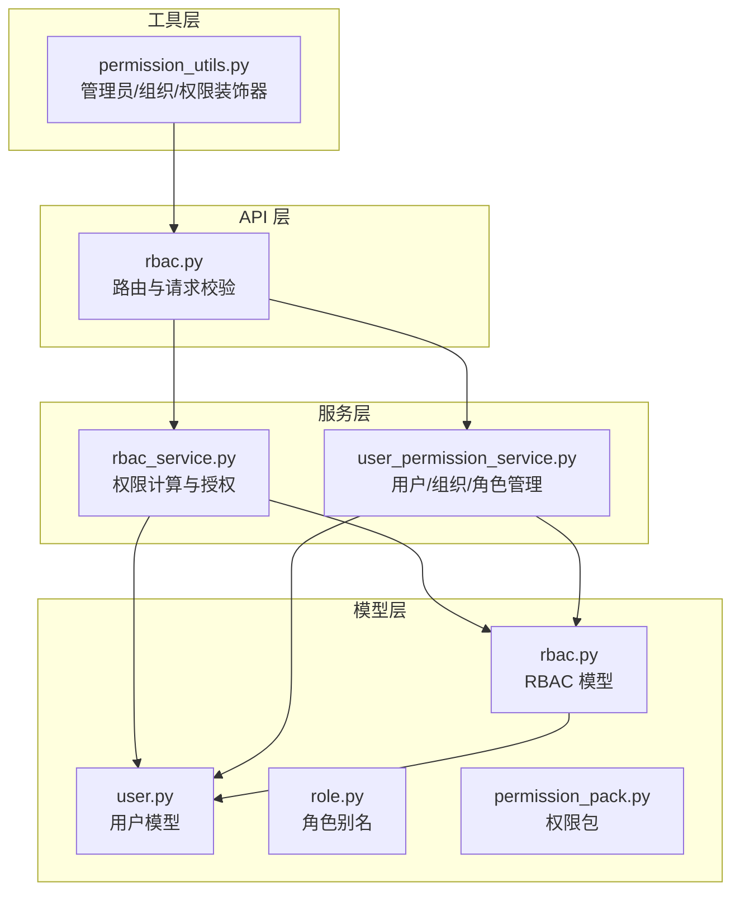
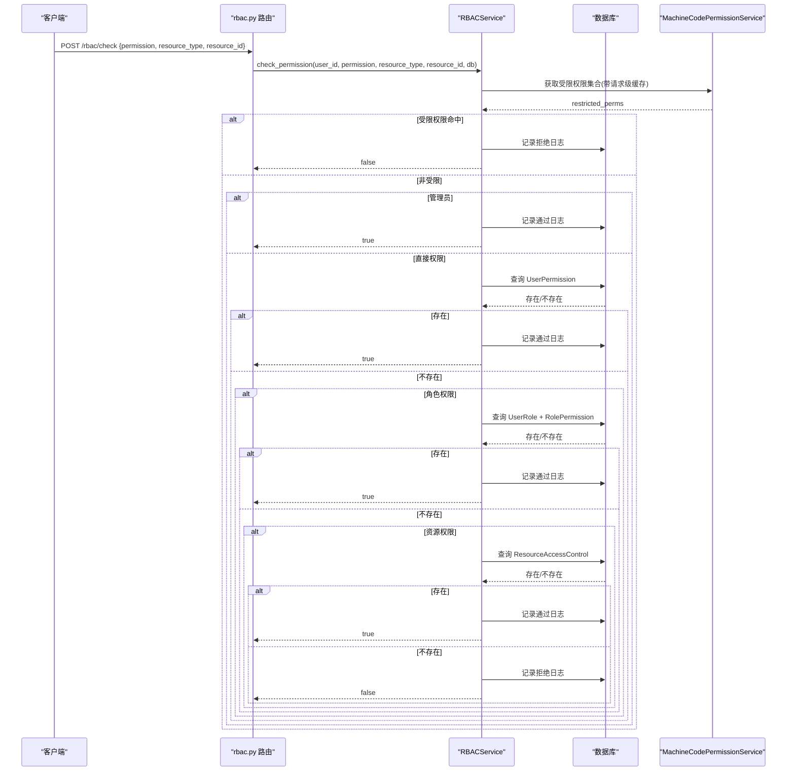
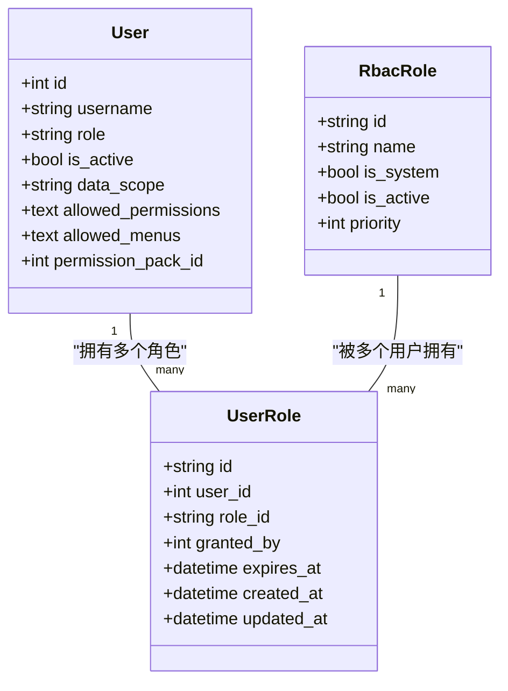
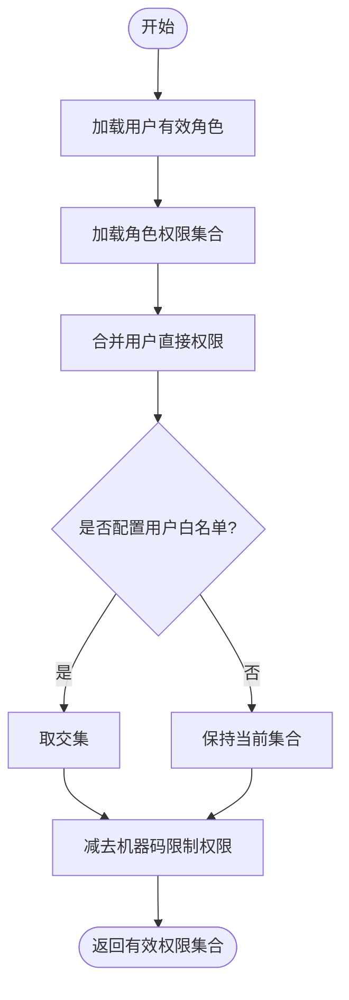
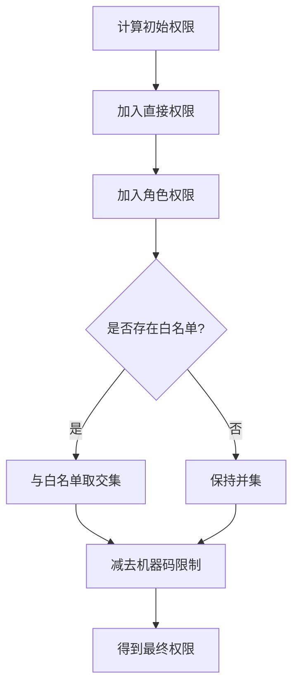
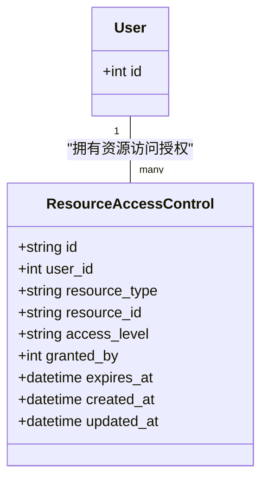
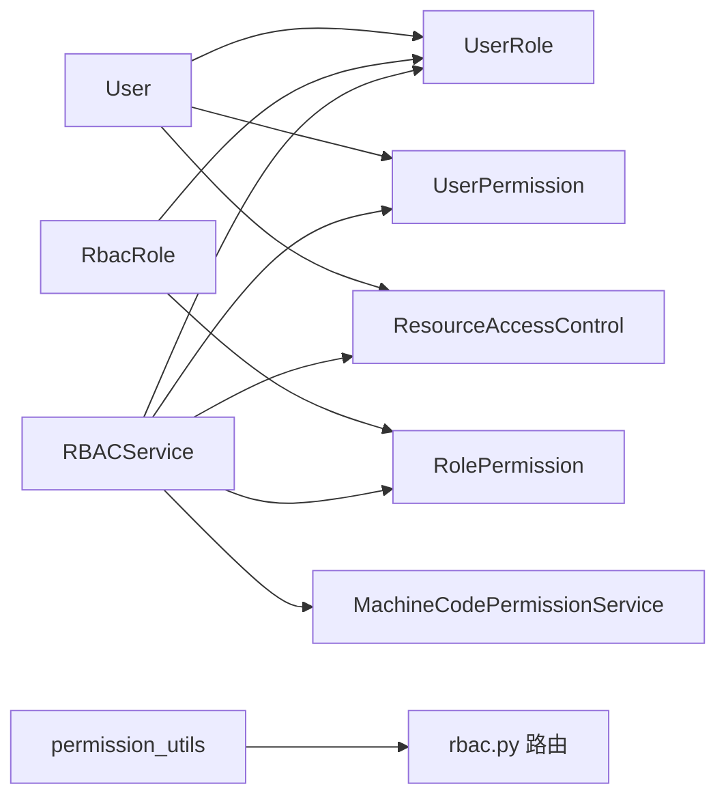

# 权限分配机制

<cite>
**本文引用的文件**
- [backend/app/models/rbac.py](file://backend/app/models/rbac.py)
- [backend/app/models/user.py](file://backend/app/models/user.py)
- [backend/app/models/role.py](file://backend/app/models/role.py)
- [backend/app/models/permission_pack.py](file://backend/app/models/permission_pack.py)
- [backend/app/services/rbac_service.py](file://backend/app/services/rbac_service.py)
- [backend/app/services/user_permission_service.py](file://backend/app/services/user_permission_service.py)
- [backend/app/core/permission_utils.py](file://backend/app/core/permission_utils.py)
- [backend/app/api/v1/auth/rbac.py](file://backend/app/api/v1/auth/rbac.py)
</cite>

## 目录
1. [简介](#简介)
2. [项目结构](#项目结构)
3. [核心组件](#核心组件)
4. [架构总览](#架构总览)
5. [详细组件分析](#详细组件分析)
6. [依赖关系分析](#依赖关系分析)
7. [性能考量](#性能考量)
8. [故障排查指南](#故障排查指南)
9. [结论](#结论)
10. [附录](#附录)

## 简介
本文件面向 RBAC（基于角色的访问控制）权限分配机制的实现，围绕以下目标展开：
- 用户与角色的多对多关联（UserRole 模型）及数据持久化策略
- 角色与权限的绑定机制（RolePermission 模型）与细粒度权限控制
- 用户直接权限（UserPermission 模型）的作用、使用场景与继承覆盖规则
- 资源访问控制（ResourceAccessControl 模型）的设计原理与基于资源的细粒度控制
- 最佳实践与常见问题解决方案，涵盖复杂权限组合与性能优化

## 项目结构
RBAC 相关代码主要分布在以下层次：
- 数据模型层：定义角色、用户-角色、角色-权限、用户直接权限、资源访问控制、访问日志等表结构
- 服务层：封装权限计算、授权/撤销、批量操作、机器码限制等核心业务逻辑
- 工具层：提供管理员判定、组织访问控制、通用权限检查装饰器
- API 层：暴露角色管理、权限分配、权限查询等接口，统一事务边界

**图表来源**
- [backend/app/api/v1/auth/rbac.py:1-524](file://backend/app/api/v1/auth/rbac.py#L1-L524)
- [backend/app/services/rbac_service.py:1-746](file://backend/app/services/rbac_service.py#L1-L746)
- [backend/app/services/user_permission_service.py:1-592](file://backend/app/services/user_permission_service.py#L1-L592)
- [backend/app/core/permission_utils.py:1-360](file://backend/app/core/permission_utils.py#L1-L360)
- [backend/app/models/rbac.py:1-263](file://backend/app/models/rbac.py#L1-L263)
- [backend/app/models/user.py:1-152](file://backend/app/models/user.py#L1-L152)
- [backend/app/models/role.py:1-11](file://backend/app/models/role.py#L1-L11)
- [backend/app/models/permission_pack.py:1-47](file://backend/app/models/permission_pack.py#L1-L47)

**章节来源**
- [backend/app/models/rbac.py:1-263](file://backend/app/models/rbac.py#L1-L263)
- [backend/app/models/user.py:1-152](file://backend/app/models/user.py#L1-L152)
- [backend/app/models/role.py:1-11](file://backend/app/models/role.py#L1-L11)
- [backend/app/models/permission_pack.py:1-47](file://backend/app/models/permission_pack.py#L1-L47)
- [backend/app/services/rbac_service.py:1-746](file://backend/app/services/rbac_service.py#L1-L746)
- [backend/app/services/user_permission_service.py:1-592](file://backend/app/services/user_permission_service.py#L1-L592)
- [backend/app/core/permission_utils.py:1-360](file://backend/app/core/permission_utils.py#L1-L360)
- [backend/app/api/v1/auth/rbac.py:1-524](file://backend/app/api/v1/auth/rbac.py#L1-L524)

## 核心组件
- RBAC 模型
  - RbacRole：角色实体，支持系统内置标记、启用状态、优先级
  - UserRole：用户与角色的多对多中间表，支持授权人、过期时间
  - RolePermission：角色到权限标识的映射
  - UserPermission：用户直接权限，支持授权人、过期时间
  - ResourceAccessControl：基于资源的访问控制（类型+ID+级别），支持过期时间
  - AccessLog：访问审计日志
- 服务层
  - RBACService：权限计算、授权/撤销、批量操作、机器码限制、资源访问检查、访问日志记录
  - UserPermissionService：用户-组织、角色分配、权限授予/撤销、数据范围控制
- 工具层
  - permission_utils：管理员判定、组织访问控制装饰器、通用权限检查装饰器
- API 层
  - rbac.py：角色 CRUD、权限分配、权限查询、前端权限适配

**章节来源**
- [backend/app/models/rbac.py:31-263](file://backend/app/models/rbac.py#L31-L263)
- [backend/app/services/rbac_service.py:104-746](file://backend/app/services/rbac_service.py#L104-L746)
- [backend/app/services/user_permission_service.py:21-592](file://backend/app/services/user_permission_service.py#L21-L592)
- [backend/app/core/permission_utils.py:17-360](file://backend/app/core/permission_utils.py#L17-L360)
- [backend/app/api/v1/auth/rbac.py:22-524](file://backend/app/api/v1/auth/rbac.py#L22-L524)

## 架构总览
权限判定流程遵循“机器码限制 > 管理员 > 直接权限 > 角色权限 > 资源权限”的优先级顺序，并在每次判定中记录访问日志。

**图表来源**
- [backend/app/api/v1/auth/rbac.py:85-105](file://backend/app/api/v1/auth/rbac.py#L85-L105)
- [backend/app/services/rbac_service.py:133-222](file://backend/app/services/rbac_service.py#L133-L222)
- [backend/app/services/rbac_service.py:224-235](file://backend/app/services/rbac_service.py#L224-L235)
- [backend/app/services/rbac_service.py:646-714](file://backend/app/services/rbac_service.py#L646-L714)
- [backend/app/services/rbac_service.py:716-742](file://backend/app/services/rbac_service.py#L716-L742)

## 详细组件分析

### 用户与角色的多对多关系（UserRole 模型）
- 设计要点
  - 通过 UserRole 表建立 users 与 rbac_roles 的多对多关系
  - 支持 granted_by（授权人）、expires_at（有效期）以支持临时授权与审计追踪
  - 索引优化：按 user_id、role_id 建立复合索引提升查询效率
- 数据持久化策略
  - 外键约束：删除用户或角色时级联删除关联
  - 时间戳：created_at、updated_at 自动维护
  - 在 RBACService.assign_role/revoke_role 中使用 flush 交由外层事务统一提交，保证一致性

**图表来源**
- [backend/app/models/user.py:26-85](file://backend/app/models/user.py#L26-L85)
- [backend/app/models/rbac.py:31-66](file://backend/app/models/rbac.py#L31-L66)
- [backend/app/models/rbac.py:81-108](file://backend/app/models/rbac.py#L81-L108)

**章节来源**
- [backend/app/models/rbac.py:81-108](file://backend/app/models/rbac.py#L81-L108)
- [backend/app/services/rbac_service.py:322-373](file://backend/app/services/rbac_service.py#L322-L373)
- [backend/app/services/user_permission_service.py:223-291](file://backend/app/services/user_permission_service.py#L223-L291)

### 角色与权限的绑定机制（RolePermission 模型）
- 设计要点
  - RolePermission 将角色与权限标识（如 user:read）进行绑定
  - 支持按角色维度进行权限聚合，便于批量授权与管理
- 细粒度权限控制
  - 权限枚举集中管理（Permission 类），便于分类与扩展
  - 角色权限参与最终权限计算，与直接权限合并后受白名单与机器码限制影响

**图表来源**
- [backend/app/services/rbac_service.py:256-320](file://backend/app/services/rbac_service.py#L256-L320)
- [backend/app/services/rbac_service.py:278-292](file://backend/app/services/rbac_service.py#L278-L292)
- [backend/app/services/rbac_service.py:298-312](file://backend/app/services/rbac_service.py#L298-L312)

**章节来源**
- [backend/app/models/rbac.py:110-135](file://backend/app/models/rbac.py#L110-L135)
- [backend/app/services/rbac_service.py:104-127](file://backend/app/services/rbac_service.py#L104-L127)
- [backend/app/services/rbac_service.py:256-320](file://backend/app/services/rbac_service.py#L256-L320)

### 用户直接权限（UserPermission 模型）
- 作用与使用场景
  - 用于对特定用户进行精细化授权，适用于临时授权、例外处理、跨角色共享能力
  - 支持 granted_by、expires_at，便于审计与时效控制
- 继承与覆盖规则
  - 权限计算顺序：机器码限制 > 管理员 > 直接权限 > 角色权限 > 资源权限
  - 若用户配置了 allowed_permissions（白名单），则最终权限为“直接权限 ∪ 角色权限”与白名单的交集
  - 再减去机器码限制的权限集合

**图表来源**
- [backend/app/services/rbac_service.py:256-320](file://backend/app/services/rbac_service.py#L256-L320)
- [backend/app/models/user.py:97-121](file://backend/app/models/user.py#L97-L121)

**章节来源**
- [backend/app/models/rbac.py:137-161](file://backend/app/models/rbac.py#L137-L161)
- [backend/app/services/rbac_service.py:375-454](file://backend/app/services/rbac_service.py#L375-L454)
- [backend/app/services/rbac_service.py:518-586](file://backend/app/services/rbac_service.py#L518-L586)
- [backend/app/models/user.py:97-121](file://backend/app/models/user.py#L97-L121)

### 资源访问控制（ResourceAccessControl 模型）
- 设计原理
  - 针对具体资源（resource_type + resource_id）授予访问级别（read/write/delete）
  - 支持 granted_by、expires_at，实现细粒度且有时效的资源授权
- 使用方式
  - 当用户无直接/角色权限时，仍可通过资源级授权获得访问能力
  - 在权限检查流程中作为最后兜底条件

**图表来源**
- [backend/app/models/rbac.py:163-189](file://backend/app/models/rbac.py#L163-L189)
- [backend/app/services/rbac_service.py:693-714](file://backend/app/services/rbac_service.py#L693-L714)

**章节来源**
- [backend/app/models/rbac.py:163-189](file://backend/app/models/rbac.py#L163-L189)
- [backend/app/services/rbac_service.py:198-210](file://backend/app/services/rbac_service.py#L198-L210)
- [backend/app/services/rbac_service.py:693-714](file://backend/app/services/rbac_service.py#L693-L714)

### 权限包（PermissionPack）与菜单可见性
- 权限包用于预定义一组菜单 key，批量绑定给普通用户，简化菜单可见性管理
- 菜单解析优先级：用户级 allowed_menus > 绑定的启用中权限包 > 角色默认菜单

**章节来源**
- [backend/app/models/permission_pack.py:1-47](file://backend/app/models/permission_pack.py#L1-L47)
- [backend/app/models/user.py:72-77](file://backend/app/models/user.py#L72-L77)

### API 与事务边界
- 所有写操作均通过 TransactionManager 包裹，确保原子性与一致性
- 提供角色管理、权限分配、权限查询、前端权限适配等接口

**章节来源**
- [backend/app/api/v1/auth/rbac.py:144-255](file://backend/app/api/v1/auth/rbac.py#L144-L255)
- [backend/app/api/v1/auth/rbac.py:288-405](file://backend/app/api/v1/auth/rbac.py#L288-L405)
- [backend/app/api/v1/auth/rbac.py:442-523](file://backend/app/api/v1/auth/rbac.py#L442-L523)

## 依赖关系分析
- 模型间依赖
  - UserRole 引用 User 与 RbacRole，形成多对多
  - RolePermission 引用 RbacRole，承载角色权限映射
  - UserPermission 引用 User，承载用户直接权限
  - ResourceAccessControl 引用 User，承载资源级授权
- 服务与工具依赖
  - RBACService 依赖 MachineCodePermissionService 获取机器码限制
  - permission_utils 提供管理员判定与组织访问控制装饰器
- API 与服务耦合
  - rbac.py 路由调用 RBACService 完成权限计算与授权操作

**图表来源**
- [backend/app/models/rbac.py:31-189](file://backend/app/models/rbac.py#L31-L189)
- [backend/app/services/rbac_service.py:18-27](file://backend/app/services/rbac_service.py#L18-L27)
- [backend/app/core/permission_utils.py:61-114](file://backend/app/core/permission_utils.py#L61-L114)
- [backend/app/api/v1/auth/rbac.py:14-21](file://backend/app/api/v1/auth/rbac.py#L14-L21)

**章节来源**
- [backend/app/models/rbac.py:31-189](file://backend/app/models/rbac.py#L31-L189)
- [backend/app/services/rbac_service.py:18-27](file://backend/app/services/rbac_service.py#L18-L27)
- [backend/app/core/permission_utils.py:61-114](file://backend/app/core/permission_utils.py#L61-L114)
- [backend/app/api/v1/auth/rbac.py:14-21](file://backend/app/api/v1/auth/rbac.py#L14-L21)

## 性能考量
- 索引优化
  - UserRole：user_id + role_id 复合索引
  - RolePermission：role_id + permission 复合索引
  - UserPermission：user_id + permission 复合索引
  - ResourceAccessControl：user_id + resource_type + resource_id 复合索引
  - AccessLog：user_id + action 复合索引
- 查询优化
  - 使用 distinct、join、in_ 批量操作减少 N+1 查询
  - 权限计算采用单次查询合并直接权限与角色权限
- 缓存策略
  - 请求级上下文变量缓存机器码限制权限，避免重复查询
- 事务与批处理
  - 批量授予/撤销权限使用 add_all/in_ 批量写入/删除
  - 原子保存权限（save_permissions）在单事务内完成删旧增新

**章节来源**
- [backend/app/models/rbac.py:35-38](file://backend/app/models/rbac.py#L35-L38)
- [backend/app/models/rbac.py:85-88](file://backend/app/models/rbac.py#L85-L88)
- [backend/app/models/rbac.py:114-117](file://backend/app/models/rbac.py#L114-L117)
- [backend/app/models/rbac.py:141-144](file://backend/app/models/rbac.py#L141-L144)
- [backend/app/models/rbac.py:167-170](file://backend/app/models/rbac.py#L167-L170)
- [backend/app/models/rbac.py:195-198](file://backend/app/models/rbac.py#L195-L198)
- [backend/app/services/rbac_service.py:224-235](file://backend/app/services/rbac_service.py#L224-L235)
- [backend/app/services/rbac_service.py:407-454](file://backend/app/services/rbac_service.py#L407-L454)
- [backend/app/services/rbac_service.py:486-516](file://backend/app/services/rbac_service.py#L486-L516)
- [backend/app/services/rbac_service.py:518-586](file://backend/app/services/rbac_service.py#L518-L586)

## 故障排查指南
- 权限不足
  - 检查是否命中机器码限制；查看受限权限集合
  - 确认是否为管理员；管理员拥有全部权限
  - 检查直接权限与角色权限是否生效（注意过期时间）
  - 检查资源级授权是否存在且未过期
- 白名单导致权限被裁剪
  - 若用户设置了 allowed_permissions，最终权限会与白名单取交集
- 事务问题
  - 写操作需通过 TransactionManager 包裹；确保 flush 由外层统一提交
- 日志定位
  - 通过 AccessLog 查看每次权限判定的结果与原因

**章节来源**
- [backend/app/services/rbac_service.py:133-222](file://backend/app/services/rbac_service.py#L133-L222)
- [backend/app/services/rbac_service.py:224-235](file://backend/app/services/rbac_service.py#L224-L235)
- [backend/app/services/rbac_service.py:256-320](file://backend/app/services/rbac_service.py#L256-L320)
- [backend/app/services/rbac_service.py:716-742](file://backend/app/services/rbac_service.py#L716-L742)

## 结论
本 RBAC 权限分配机制通过清晰的模型设计与分层服务实现了灵活且可扩展的权限控制：
- 多对多角色关联支持临时授权与审计
- 角色与权限绑定提供细粒度控制
- 用户直接权限满足例外与临时授权需求
- 资源级授权实现对象级细粒度控制
- 结合白名单与机器码限制，形成完整的权限计算链路与安全边界
- 通过索引、批处理与缓存优化性能，并通过事务保障一致性

## 附录
- 常用权限标识示例（来自 Permission 枚举）
  - 用户管理：user:read、user:write、user:delete、user:manage_roles
  - 帮扶村管理：village:read、village:write、village:delete、village:export
  - 政策管理：policy:read、policy:write、policy:delete、policy:publish
  - 备份管理：backup:create、backup:restore、backup:delete、backup:download
  - 系统管理：system:config、system:monitor、system:logs
  - 审计管理：audit:read、audit:export
  - 数据分析：analytics:read、analytics:export
  - 管理员权限：admin:all

**章节来源**
- [backend/app/services/rbac_service.py:52-99](file://backend/app/services/rbac_service.py#L52-L99)
- [backend/app/api/v1/auth/rbac.py:411-436](file://backend/app/api/v1/auth/rbac.py#L411-L436)