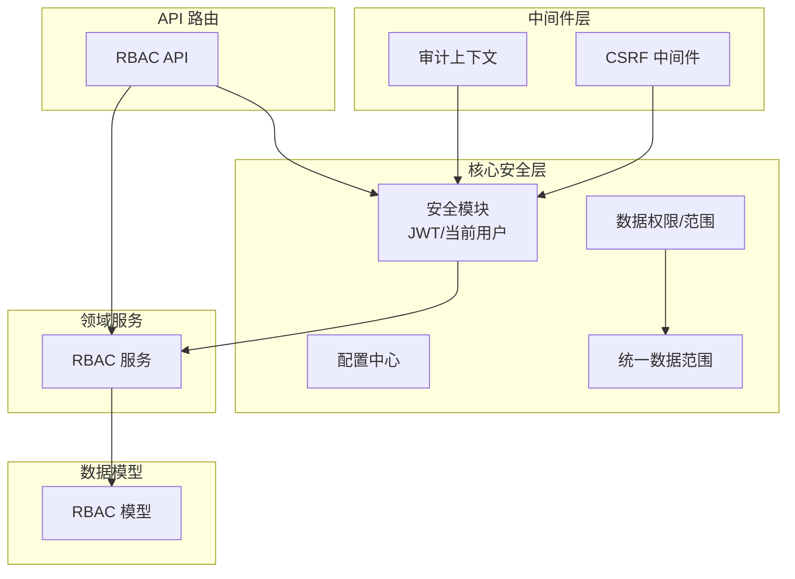
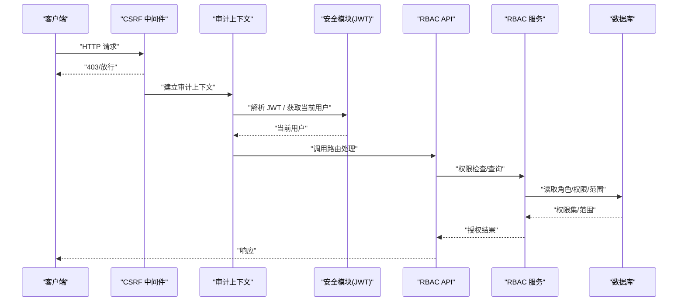
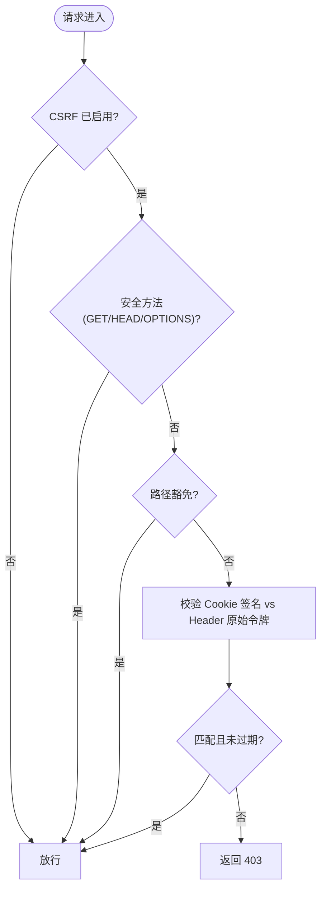
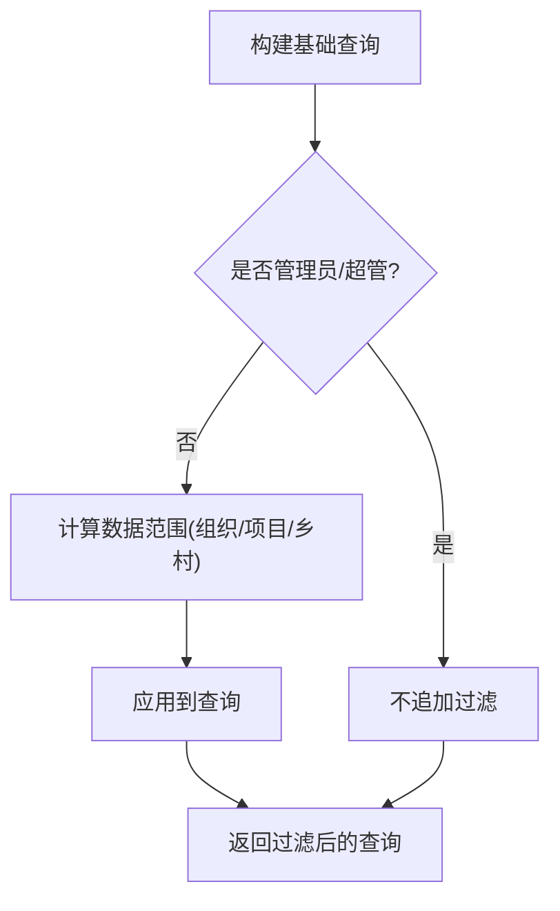
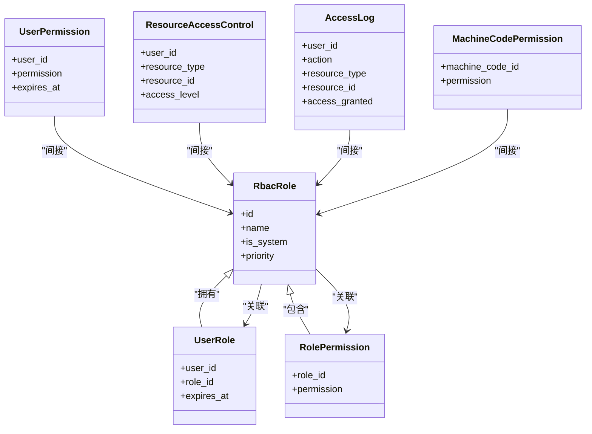
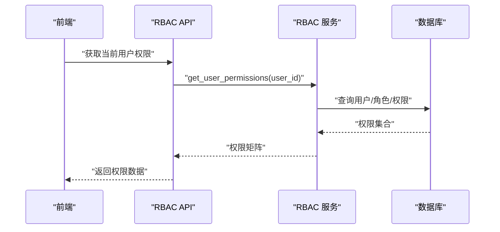
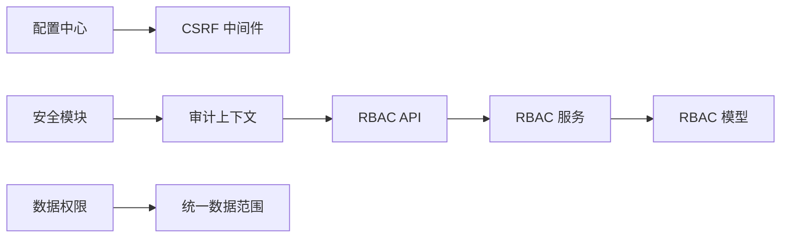

# 权限验证中间件

<cite>
**本文引用的文件**
- [app/core/security.py](file://backend/app/core/security.py)
- [app/core/config.py](file://backend/app/core/config.py)
- [app/middleware/csrf_middleware.py](file://backend/app/middleware/csrf_middleware.py)
- [app/middleware/audit_context.py](file://backend/app/middleware/audit_context.py)
- [app/core/data_permission.py](file://backend/app/core/data_permission.py)
- [app/core/unified_data_scope.py](file://backend/app/core/unified_data_scope.py)
- [app/models/rbac.py](file://backend/app/models/rbac.py)
- [app/services/rbac_service.py](file://backend/app/services/rbac_service.py)
- [app/api/v1/rbac.py](file://backend/app/api/v1/rbac.py)
- [backend/tests/unit/test_rbac_api_cov.py](file://backend/tests/unit/test_rbac_api_cov.py)
- [backend/tests/unit/test_csrf_hmac_upgrade.py](file://backend/tests/unit/test_csrf_hmac_upgrade.py)
- [backend/tests/unit/test_middleware_ALL.py](file://backend/tests/unit/test_middleware_ALL.py)
- [backend/tests/unit/test_security_data_isolation.py](file://backend/tests/unit/test_security_data_isolation.py)
</cite>

## 目录
1. [简介](#简介)
2. [项目结构](#项目结构)
3. [核心组件](#核心组件)
4. [架构总览](#架构总览)
5. [详细组件分析](#详细组件分析)
6. [依赖关系分析](#依赖关系分析)
7. [性能与缓存](#性能与缓存)
8. [故障排查指南](#故障排查指南)
9. [结论](#结论)
10. [附录：配置与扩展](#附录：配置与扩展)

## 简介
本技术文档围绕 RBAC 权限验证中间件，系统性说明请求级权限检查机制（JWT 解析、用户身份认证、权限校验）、数据范围隔离（组织/项目/乡村等多维访问控制）、中间件执行顺序与拦截机制（CSRF 防护、请求审计、安全检查），以及权限缓存策略与性能优化方案。同时提供配置与自定义扩展指南，覆盖常见安全场景与高级用法示例。

## 项目结构
后端采用 FastAPI 应用，安全与权限能力集中在 core 层，通用中间件位于 middleware 层，RBAC 模型与服务在 models 与 services 层，API 路由在 api/v1 下。测试用例覆盖了 CSRF、RBAC API、数据隔离等关键路径。

图表来源
- [app/middleware/csrf_middleware.py:1-200](file://backend/app/middleware/csrf_middleware.py#L1-L200)
- [app/core/security.py:1-200](file://backend/app/core/security.py#L1-L200)
- [app/core/data_permission.py:1-200](file://backend/app/core/data_permission.py#L1-L200)
- [app/core/unified_data_scope.py:1-200](file://backend/app/core/unified_data_scope.py#L1-L200)
- [app/models/rbac.py:1-263](file://backend/app/models/rbac.py#L1-L263)
- [app/services/rbac_service.py:1-500](file://backend/app/services/rbac_service.py#L1-L500)
- [app/api/v1/rbac.py:1-500](file://backend/app/api/v1/rbac.py#L1-L500)

章节来源
- [app/middleware/csrf_middleware.py:1-200](file://backend/app/middleware/csrf_middleware.py#L1-L200)
- [app/core/security.py:1-200](file://backend/app/core/security.py#L1-L200)
- [app/core/data_permission.py:1-200](file://backend/app/core/data_permission.py#L1-L200)
- [app/core/unified_data_scope.py:1-200](file://backend/app/core/unified_data_scope.py#L1-L200)
- [app/models/rbac.py:1-263](file://backend/app/models/rbac.py#L1-L263)
- [app/services/rbac_service.py:1-500](file://backend/app/services/rbac_service.py#L1-L500)
- [app/api/v1/rbac.py:1-500](file://backend/app/api/v1/rbac.py#L1-L500)

## 核心组件
- JWT 与当前用户解析：通过安全模块提供依赖注入，用于从请求中提取并验证 JWT，生成当前用户上下文。
- CSRF 防护：基于 HMAC 的令牌签名与过期校验，支持白名单路径与安全方法豁免。
- 审计上下文：为后续审计与日志记录提供请求级上下文（如请求 ID、当前用户）。
- 数据权限与范围：提供统一的查询过滤能力，按角色/组织/项目/乡村维度限制数据可见性。
- RBAC 模型与服务：定义角色、用户-角色、角色-权限、用户直接权限、资源访问控制、访问日志等实体，并提供授权、批量授予、受限权限查询等服务。
- RBAC API：暴露前端所需权限信息接口（如当前用户权限、路由权限、权限检查）。

章节来源
- [app/core/security.py:1-200](file://backend/app/core/security.py#L1-L200)
- [app/middleware/csrf_middleware.py:1-200](file://backend/app/middleware/csrf_middleware.py#L1-L200)
- [app/middleware/audit_context.py:1-200](file://backend/app/middleware/audit_context.py#L1-L200)
- [app/core/data_permission.py:1-200](file://backend/app/core/data_permission.py#L1-L200)
- [app/core/unified_data_scope.py:1-200](file://backend/app/core/unified_data_scope.py#L1-L200)
- [app/models/rbac.py:1-263](file://backend/app/models/rbac.py#L1-L263)
- [app/services/rbac_service.py:1-500](file://backend/app/services/rbac_service.py#L1-L500)
- [app/api/v1/rbac.py:1-500](file://backend/app/api/v1/rbac.py#L1-L500)

## 架构总览
请求进入后，依次经过 CSRF 中间件、审计上下文、安全依赖注入（JWT 解析与当前用户）、业务路由与 RBAC 服务、数据权限过滤，最终返回响应。

图表来源
- [app/middleware/csrf_middleware.py:1-200](file://backend/app/middleware/csrf_middleware.py#L1-L200)
- [app/middleware/audit_context.py:1-200](file://backend/app/middleware/audit_context.py#L1-L200)
- [app/core/security.py:1-200](file://backend/app/core/security.py#L1-L200)
- [app/api/v1/rbac.py:1-500](file://backend/app/api/v1/rbac.py#L1-L500)
- [app/services/rbac_service.py:1-500](file://backend/app/services/rbac_service.py#L1-L500)

## 详细组件分析

### JWT 解析与用户身份认证
- 依赖注入：通过安全模块提供的依赖函数，从请求头或 Cookie 中解析 JWT，校验签名与有效期，构造当前用户对象。
- 错误处理：无效或缺失令牌时抛出相应异常，由全局错误处理器统一返回。
- 使用方式：在路由参数中使用依赖注入获取当前用户，供后续权限判断与数据范围过滤使用。

章节来源
- [app/core/security.py:1-200](file://backend/app/core/security.py#L1-L200)

### CSRF 防护中间件
- 令牌生成与签名：生成带时间戳的随机令牌，并使用 HMAC 签名；支持回退到明文比对以兼容旧客户端。
- 校验流程：对非安全方法与未豁免路径进行校验，比较 Cookie 中的签名令牌与请求头中的原始令牌。
- 豁免策略：健康检查、获取 CSRF Token 等路径可配置豁免。
- 过期处理：令牌过期将拒绝请求。

图表来源
- [app/middleware/csrf_middleware.py:1-200](file://backend/app/middleware/csrf_middleware.py#L1-L200)

章节来源
- [app/middleware/csrf_middleware.py:1-200](file://backend/app/middleware/csrf_middleware.py#L1-L200)
- [backend/tests/unit/test_csrf_hmac_upgrade.py:128-198](file://backend/tests/unit/test_csrf_hmac_upgrade.py#L128-L198)
- [backend/tests/unit/test_middleware_ALL.py:338-443](file://backend/tests/unit/test_middleware_ALL.py#L338-L443)

### 审计上下文与请求审计
- 审计上下文：维护请求级上下文（如请求 ID、当前用户），便于后续审计与日志记录。
- 审计中间件：在请求生命周期内记录关键事件，结合 RBAC 访问日志实现可追溯性。

章节来源
- [app/middleware/audit_context.py:1-200](file://backend/app/middleware/audit_context.py#L1-L200)
- [app/core/audit_middleware.py:1-200](file://backend/app/core/audit_middleware.py#L1-L200)

### 数据范围隔离（组织/项目/乡村）
- 统一数据范围：整合两套历史数据范围系统，提供统一的查询过滤入口。
- 过滤逻辑：根据当前用户角色、组织树、项目归属、乡村关联等维度动态追加过滤条件，确保跨组织/项目/乡村的数据不可见。
- 管理员豁免：超级管理员或特定角色可跳过过滤。

图表来源
- [app/core/unified_data_scope.py:1-200](file://backend/app/core/unified_data_scope.py#L1-L200)
- [app/core/data_permission.py:1-200](file://backend/app/core/data_permission.py#L1-L200)

章节来源
- [app/core/unified_data_scope.py:1-200](file://backend/app/core/unified_data_scope.py#L1-L200)
- [app/core/data_permission.py:1-200](file://backend/app/core/data_permission.py#L1-L200)
- [backend/tests/unit/test_security_data_isolation.py:86-112](file://backend/tests/unit/test_security_data_isolation.py#L86-L112)

### RBAC 模型与服务
- 模型：角色、用户-角色、角色-权限、用户直接权限、资源访问控制、访问日志、机器码权限等。
- 服务：权限检查、批量授予、受限权限查询、权限包绑定等。
- 事务边界：服务调用方负责事务管理，保证一致性。

图表来源
- [app/models/rbac.py:1-263](file://backend/app/models/rbac.py#L1-L263)

章节来源
- [app/models/rbac.py:1-263](file://backend/app/models/rbac.py#L1-L263)
- [app/services/rbac_service.py:1-500](file://backend/app/services/rbac_service.py#L1-L500)

### RBAC API 与前端权限
- 权限检查接口：POST /api/v1/rbac/check，传入权限标识，返回是否允许。
- 前端权限接口：GET /api/v1/rbac/frontend/current-user-permissions，返回当前用户权限矩阵与角色名。
- 路由权限接口：GET /api/v1/rbac/frontend/route-permissions，返回路由与所需权限映射。

图表来源
- [app/api/v1/rbac.py:1-500](file://backend/app/api/v1/rbac.py#L1-L500)
- [app/services/rbac_service.py:1-500](file://backend/app/services/rbac_service.py#L1-L500)

章节来源
- [backend/tests/unit/test_rbac_api_cov.py:84-439](file://backend/tests/unit/test_rbac_api_cov.py#L84-L439)

## 依赖关系分析
- 中间件依赖：CSRF 中间件依赖配置中心开关与安全工具；审计上下文依赖安全模块获取当前用户。
- 服务依赖：RBAC 服务依赖数据库会话与 RBAC 模型；数据范围依赖统一数据范围与权限工具。
- API 依赖：RBAC API 依赖 RBAC 服务与安全模块。

图表来源
- [app/core/config.py:1-200](file://backend/app/core/config.py#L1-L200)
- [app/middleware/csrf_middleware.py:1-200](file://backend/app/middleware/csrf_middleware.py#L1-L200)
- [app/middleware/audit_context.py:1-200](file://backend/app/middleware/audit_context.py#L1-L200)
- [app/core/security.py:1-200](file://backend/app/core/security.py#L1-L200)
- [app/api/v1/rbac.py:1-500](file://backend/app/api/v1/rbac.py#L1-L500)
- [app/services/rbac_service.py:1-500](file://backend/app/services/rbac_service.py#L1-L500)
- [app/core/data_permission.py:1-200](file://backend/app/core/data_permission.py#L1-L200)
- [app/core/unified_data_scope.py:1-200](file://backend/app/core/unified_data_scope.py#L1-L200)

章节来源
- [app/core/config.py:1-200](file://backend/app/core/config.py#L1-L200)
- [app/middleware/csrf_middleware.py:1-200](file://backend/app/middleware/csrf_middleware.py#L1-L200)
- [app/middleware/audit_context.py:1-200](file://backend/app/middleware/audit_context.py#L1-L200)
- [app/core/security.py:1-200](file://backend/app/core/security.py#L1-L200)
- [app/api/v1/rbac.py:1-500](file://backend/app/api/v1/rbac.py#L1-L500)
- [app/services/rbac_service.py:1-500](file://backend/app/services/rbac_service.py#L1-L500)
- [app/core/data_permission.py:1-200](file://backend/app/core/data_permission.py#L1-L200)
- [app/core/unified_data_scope.py:1-200](file://backend/app/core/unified_data_scope.py#L1-L200)

## 性能与缓存
- 权限缓存建议：
  - 缓存键设计：基于 user_id、租户/组织域、角色集、最近更新时间，避免越权。
  - 失效策略：角色/权限变更时主动失效相关缓存；设置合理 TTL 与懒更新。
  - 存储介质：优先使用 Redis，支持分布式共享与原子操作。
- 查询优化：
  - 预取用户-角色-权限三元组，减少 N+1 查询。
  - 利用索引（如用户-权限、角色-权限）加速检索。
- 数据范围优化：
  - 将范围过滤下沉至 SQL 层，避免应用层过滤大数据集。
  - 对高频维度（组织、项目）建立复合索引。

[本节为通用性能建议，不直接分析具体文件]

## 故障排查指南
- CSRF 校验失败：
  - 确认 CSRF 已启用且路径未豁免；检查 Cookie 与请求头令牌是否一致且未过期。
  - 参考测试用例验证 HMAC 签名与明文回退行为。
- 权限检查失败：
  - 检查 JWT 是否有效、当前用户是否正确注入；确认 RBAC 服务返回的权限集合是否符合预期。
  - 通过 RBAC API 的权限检查接口定位问题。
- 数据范围异常：
  - 确认当前用户角色与组织/项目/乡村关联；检查统一数据范围是否被正确应用到查询。
  - 通过测试用例验证跨组织访问是否被拒绝。

章节来源
- [backend/tests/unit/test_csrf_hmac_upgrade.py:128-198](file://backend/tests/unit/test_csrf_hmac_upgrade.py#L128-L198)
- [backend/tests/unit/test_middleware_ALL.py:338-443](file://backend/tests/unit/test_middleware_ALL.py#L338-L443)
- [backend/tests/unit/test_rbac_api_cov.py:84-439](file://backend/tests/unit/test_rbac_api_cov.py#L84-L439)
- [backend/tests/unit/test_security_data_isolation.py:86-112](file://backend/tests/unit/test_security_data_isolation.py#L86-L112)

## 结论
本中间件体系以 JWT 为基础完成身份认证，结合 CSRF 防护与审计上下文保障请求安全；通过 RBAC 模型与服务实现细粒度权限控制，并以统一数据范围机制实现多维数据隔离。配合合理的缓存与查询优化策略，可在高并发场景下保持高性能与安全性。

[本节为总结性内容，不直接分析具体文件]

## 附录：配置与扩展
- 配置项
  - CSRF_ENABLED：启用/禁用 CSRF 防护。
  - CSRF_SECRET_KEY：HMAC 签名密钥；为空时回退到全局 SECRET_KEY。
  - 其他安全相关配置可通过配置中心集中管理。
- 扩展点
  - 自定义权限检查：在 RBAC 服务中扩展权限规则，或在路由层组合多个权限条件。
  - 数据范围扩展：在统一数据范围中新增维度（如区域、产品线）过滤逻辑。
  - 审计扩展：在审计上下文中增加更多请求级元数据（如设备指纹、地理位置）。
- 常见安全场景
  - 多租户隔离：基于组织 ID 强制数据范围过滤。
  - 临时授权：为用户直接权限设置过期时间，到期自动失效。
  - 敏感操作保护：对写操作强制 CSRF 校验与二次确认。

章节来源
- [app/core/config.py:1-200](file://backend/app/core/config.py#L1-L200)
- [app/middleware/csrf_middleware.py:1-200](file://backend/app/middleware/csrf_middleware.py#L1-L200)
- [app/services/rbac_service.py:1-500](file://backend/app/services/rbac_service.py#L1-L500)
- [app/core/unified_data_scope.py:1-200](file://backend/app/core/unified_data_scope.py#L1-L200)