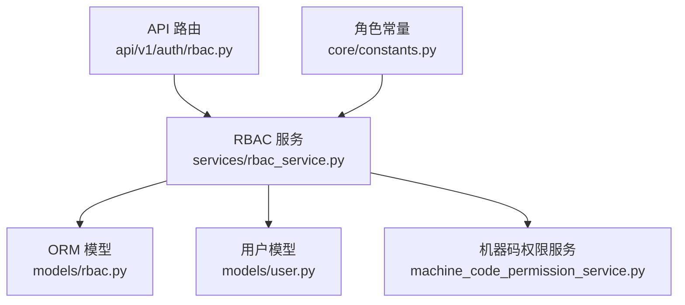
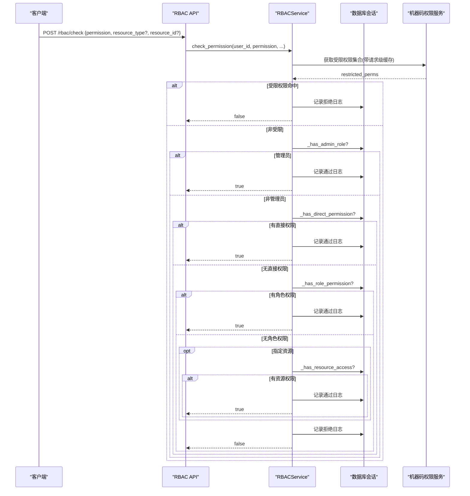
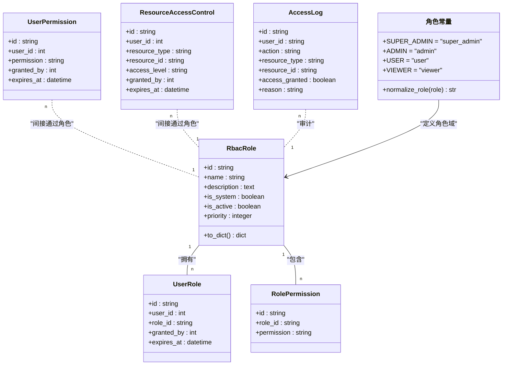
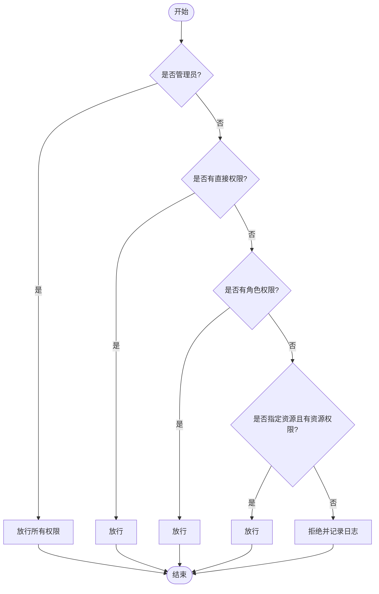
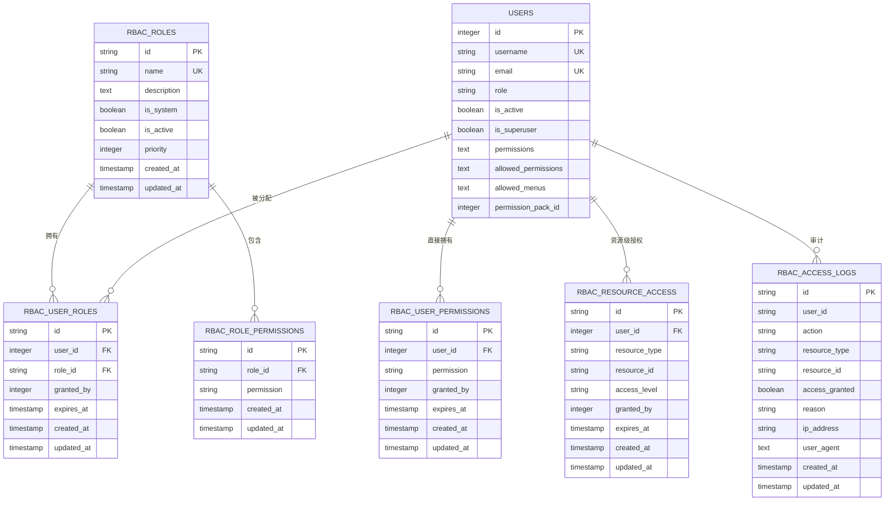
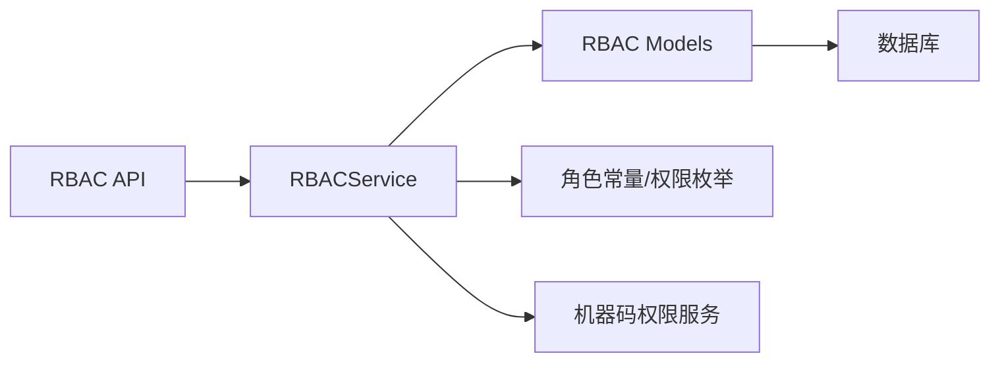

# 角色管理模块

<cite>
**本文引用的文件**
- [rbac.py](file://backend/app/models/rbac.py)
- [role.py](file://backend/app/models/role.py)
- [user.py](file://backend/app/models/user.py)
- [constants.py](file://backend/app/core/constants.py)
- [rbac_service.py](file://backend/app/services/rbac_service.py)
- [rbac_api.py](file://backend/app/api/v1/auth/rbac.py)
</cite>

## 目录
1. [简介](#简介)
2. [项目结构](#项目结构)
3. [核心组件](#核心组件)
4. [架构总览](#架构总览)
5. [详细组件分析](#详细组件分析)
6. [依赖关系分析](#依赖关系分析)
7. [性能考虑](#性能考虑)
8. [故障排查指南](#故障排查指南)
9. [结论](#结论)
10. [附录](#附录)

## 简介
本模块实现基于 RBAC（基于角色的访问控制）的角色与权限管理体系，支撑四级角色体系：超级管理员、管理员、普通用户、只读用户。系统通过“角色-权限”关联表进行细粒度授权，并结合用户直接权限、资源级访问控制以及机器码限制，形成完整的权限判定链路。同时提供角色与权限的 CRUD API，支持事务原子性操作与审计日志记录。

## 项目结构
RBAC 相关代码主要分布在以下位置：
- 数据模型：models/rbac.py、models/user.py、models/role.py
- 业务服务：services/rbac_service.py
- 接口层：api/v1/auth/rbac.py
- 常量与角色定义：core/constants.py

图表来源
- [rbac_api.py:1-524](file://backend/app/api/v1/auth/rbac.py#L1-L524)
- [rbac_service.py:1-746](file://backend/app/services/rbac_service.py#L1-L746)
- [rbac.py:1-263](file://backend/app/models/rbac.py#L1-L263)
- [user.py:1-152](file://backend/app/models/user.py#L1-L152)
- [constants.py:1-87](file://backend/app/core/constants.py#L1-L87)

章节来源
- [rbac_api.py:1-524](file://backend/app/api/v1/auth/rbac.py#L1-L524)
- [rbac_service.py:1-746](file://backend/app/services/rbac_service.py#L1-L746)
- [rbac.py:1-263](file://backend/app/models/rbac.py#L1-L263)
- [user.py:1-152](file://backend/app/models/user.py#L1-L152)
- [constants.py:1-87](file://backend/app/core/constants.py#L1-L87)

## 核心组件
- RbacRole：角色实体，包含名称、描述、是否系统内置、是否启用、优先级等字段，并维护与用户和权限的关联关系。
- UserRole：用户与角色的多对多中间表，支持授权人、过期时间等元数据。
- RolePermission：角色与权限标识的关联表，用于授予角色一组权限。
- UserPermission：用户直接权限表，支持授权人与过期时间。
- ResourceAccessControl：资源级访问控制，按资源类型与 ID 控制读写删级别。
- AccessLog：访问审计日志，记录每次权限检查的结果与原因。
- MachineCodePermission：机器码功能权限限制，可屏蔽特定权限。
- Permission 枚举：集中定义所有权限标识，便于统一管理与前端展示。
- RBACService：权限计算与角色/权限分配的核心服务，封装了权限检查、批量授予/撤销、角色分配、用户权限聚合等逻辑。
- API 路由：暴露角色与权限管理的 RESTful 接口，使用事务管理器保证一致性。

章节来源
- [rbac.py:31-263](file://backend/app/models/rbac.py#L31-L263)
- [rbac_service.py:52-746](file://backend/app/services/rbac_service.py#L52-L746)
- [rbac_api.py:28-524](file://backend/app/api/v1/auth/rbac.py#L28-L524)

## 架构总览
RBAC 权限判定流程遵循“机器码限制 → 管理员特权 → 直接权限 → 角色权限 → 资源权限”的顺序，并在每次检查时写入审计日志。

图表来源
- [rbac_service.py:133-222](file://backend/app/services/rbac_service.py#L133-L222)
- [rbac_service.py:224-320](file://backend/app/services/rbac_service.py#L224-L320)
- [rbac_service.py:646-741](file://backend/app/services/rbac_service.py#L646-L741)
- [rbac_api.py:85-105](file://backend/app/api/v1/auth/rbac.py#L85-L105)

## 详细组件分析

### 四级角色体系与继承关系
- 四级角色：超级管理员(super_admin)、管理员(admin)、普通用户(user)、只读用户(viewer)。
- 角色常量与归一化：在常量文件中定义了实用角色集合与历史角色归一化映射，确保旧值平滑迁移到新角色体系。
- 权限继承：系统通过“管理员特权”快速放行；普通用户通过“直接权限 + 角色权限 + 资源权限”叠加获得能力；只读用户通常仅具备读取类权限。
- 优先级机制：角色查询与排序支持 priority 字段，数字越小优先级越高，影响角色列表展示与潜在决策顺序。

图表来源
- [constants.py:27-87](file://backend/app/core/constants.py#L27-L87)
- [rbac.py:31-263](file://backend/app/models/rbac.py#L31-L263)

章节来源
- [constants.py:27-87](file://backend/app/core/constants.py#L27-L87)
- [rbac.py:31-263](file://backend/app/models/rbac.py#L31-L263)

### RbacRole 模型设计
- 核心字段：
  - id：主键（UUID）
  - name：唯一角色名
  - description：角色描述
  - is_system：是否系统内置角色（不可删除）
  - is_active：是否启用
  - priority：优先级（数值越小优先级越高）
  - created_at/updated_at：时间戳
- 关系：
  - users：与 UserRole 一对多
  - role_permissions：与 RolePermission 一对多
- to_dict：序列化输出常用字段

章节来源
- [rbac.py:31-79](file://backend/app/models/rbac.py#L31-L79)

### 角色 CRUD 接口
- 创建角色：POST /rbac/roles，需管理员权限，事务包裹，返回角色ID与消息。
- 列出角色：GET /rbac/roles，分页，按优先级升序与创建时间降序排序。
- 获取角色详情：GET /rbac/roles/{role_id}，附带该角色的权限列表。
- 更新角色：PUT /rbac/roles/{role_id}，支持修改基本信息与权限列表（先删后增）。
- 删除角色：DELETE /rbac/roles/{role_id}，系统内置角色禁止删除。
- 角色用户列表：GET /rbac/roles/{role_id}/users，查看绑定用户。

章节来源
- [rbac_api.py:144-283](file://backend/app/api/v1/auth/rbac.py#L144-L283)

### 权限分配机制
- 角色分配：POST /rbac/assign/role，将角色授予用户，支持过期时间。
- 撤销角色：DELETE /rbac/revoke/role，移除用户的角色。
- 直接权限授予：POST /rbac/grant/permission，批量授予用户直接权限。
- 直接权限撤销：POST /rbac/revoke/permission，批量撤销用户直接权限。
- 原子保存权限：POST /rbac/save-permissions，在一个事务内完成“撤销旧权限 + 授予新权限”，返回 granted/revoked/skipped。
- 权限列表：GET /rbac/permissions，返回全部权限枚举及分类。
- 前端专用：GET /rbac/frontend/current-user-permissions 与 /rbac/frontend/route-permissions，为前端提供权限与路由配置。

图表来源
- [rbac_service.py:133-222](file://backend/app/services/rbac_service.py#L133-L222)
- [rbac_service.py:237-320](file://backend/app/services/rbac_service.py#L237-L320)
- [rbac_service.py:646-741](file://backend/app/services/rbac_service.py#L646-L741)

章节来源
- [rbac_api.py:288-436](file://backend/app/api/v1/auth/rbac.py#L288-L436)
- [rbac_service.py:322-586](file://backend/app/services/rbac_service.py#L322-L586)

### 权限计算与白名单/机器码限制
- 权限聚合：
  - 直接权限：UserPermission 表中未过期的权限。
  - 角色权限：通过 UserRole 关联到 RbacRole，再关联 RolePermission，过滤已禁用角色与过期角色。
  - 管理员特权：若包含 admin:all，则直接返回全部权限。
  - 用户白名单：若用户设置了 allowed_permissions，则与当前权限取交集。
  - 机器码限制：从机器码权限服务获取受限权限集合，并从最终权限中剔除。
- 请求级缓存：为避免单次请求重复查询，使用 ContextVar 缓存受限权限集合。

章节来源
- [rbac_service.py:237-320](file://backend/app/services/rbac_service.py#L237-L320)
- [rbac_service.py:224-235](file://backend/app/services/rbac_service.py#L224-L235)
- [user.py:97-121](file://backend/app/models/user.py#L97-L121)

### 数据模型关系图

图表来源
- [rbac.py:31-263](file://backend/app/models/rbac.py#L31-L263)
- [user.py:26-152](file://backend/app/models/user.py#L26-L152)

## 依赖关系分析
- API 层依赖服务层：路由调用 RBACService 的方法执行具体逻辑。
- 服务层依赖模型层：通过 SQLAlchemy Session 操作 ORM 模型。
- 服务层依赖常量：使用 Permission 枚举与角色常量进行权限判断与展示。
- 服务层依赖外部服务：MachineCodePermissionService 提供机器码限制权限。
- 模型间关系：RbacRole 与 UserRole、RolePermission 建立强关联；User 与 RBAC_* 表通过外键约束。

图表来源
- [rbac_api.py:1-524](file://backend/app/api/v1/auth/rbac.py#L1-L524)
- [rbac_service.py:1-746](file://backend/app/services/rbac_service.py#L1-L746)
- [rbac.py:1-263](file://backend/app/models/rbac.py#L1-L263)
- [constants.py:1-87](file://backend/app/core/constants.py#L1-L87)

章节来源
- [rbac_api.py:1-524](file://backend/app/api/v1/auth/rbac.py#L1-L524)
- [rbac_service.py:1-746](file://backend/app/services/rbac_service.py#L1-L746)
- [rbac.py:1-263](file://backend/app/models/rbac.py#L1-L263)
- [constants.py:1-87](file://backend/app/core/constants.py#L1-L87)

## 性能考虑
- 权限计算优化：
  - 请求级缓存：使用 ContextVar 缓存受限权限集合，避免重复查询。
  - 批量操作：grant_permissions_batch、save_permissions 采用预查询与批量 INSERT/DELETE，减少数据库往返。
  - 索引优化：模型中为常见查询字段添加索引（如 user_id、role_id、permission），提升 JOIN 与过滤性能。
- 事务边界：API 层使用 TransactionManager 包裹写操作，确保一致性并减少锁竞争。
- 管理员特权短路：遇到 admin:all 直接返回全部权限，避免后续多次查询。

[本节为通用性能建议，不直接分析具体文件]

## 故障排查指南
- 权限不足：
  - 检查是否命中机器码限制权限集合。
  - 确认用户是否具备直接权限或角色权限。
  - 若涉及资源访问，检查 ResourceAccessControl 是否配置正确且未过期。
  - 查看 AccessLog 中的 reason 字段定位拒绝原因。
- 角色无法删除：
  - 系统内置角色（is_system=True）禁止删除，需改为非系统角色后再删除。
- 权限未生效：
  - 检查 UserRole.expires_at 与 UserPermission.expires_at 是否过期。
  - 检查 RbacRole.is_active 是否为 True。
  - 检查用户 allowed_permissions 白名单是否与期望权限一致。
- 批量操作结果异常：
  - 关注 save_permissions 返回的 revoked/granted/skipped 字段，确认差异集是否符合预期。

章节来源
- [rbac_service.py:133-222](file://backend/app/services/rbac_service.py#L133-L222)
- [rbac_service.py:716-741](file://backend/app/services/rbac_service.py#L716-L741)
- [rbac_api.py:239-255](file://backend/app/api/v1/auth/rbac.py#L239-L255)

## 结论
本模块以清晰的四层角色体系为基础，结合直接权限、角色权限、资源权限与机器码限制，构建了灵活且安全的权限控制系统。通过统一的权限枚举、事务化的 CRUD 接口与完善的审计日志，既满足复杂场景下的权限组合需求，又保证了系统的可维护性与可观测性。建议在新增角色与权限时遵循最小权限原则，充分利用白名单与过期机制，定期审查 AccessLog 以发现潜在风险。

[本节为总结性内容，不直接分析具体文件]

## 附录
- 常见角色场景示例：
  - 超级管理员：拥有 admin:all，可管理所有资源与系统配置。
  - 管理员：具备用户、组织、帮扶村、政策、备份等模块的读写权限，可分配角色与权限。
  - 普通用户：具备基础读取与部分写入权限，受白名单与机器码限制。
  - 只读用户：仅具备读取类权限，适合审计与报表查看。
- 复杂权限组合方案：
  - 使用角色承载通用权限，再通过直接权限微调个体差异。
  - 借助白名单限制用户可见菜单与可用权限，实现精细化控制。
  - 利用资源级访问控制针对特定数据进行细粒度授权。
  - 通过过期时间与机器码限制实现临时授权与安全加固。

[本节为概念性说明，不直接分析具体文件]