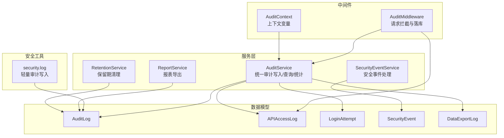
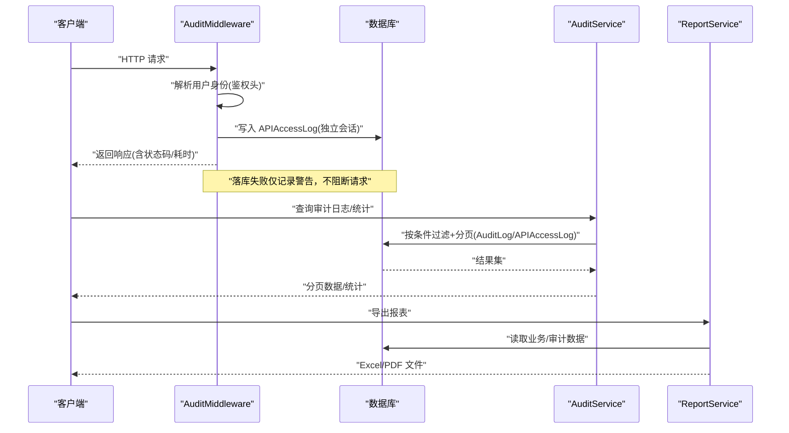
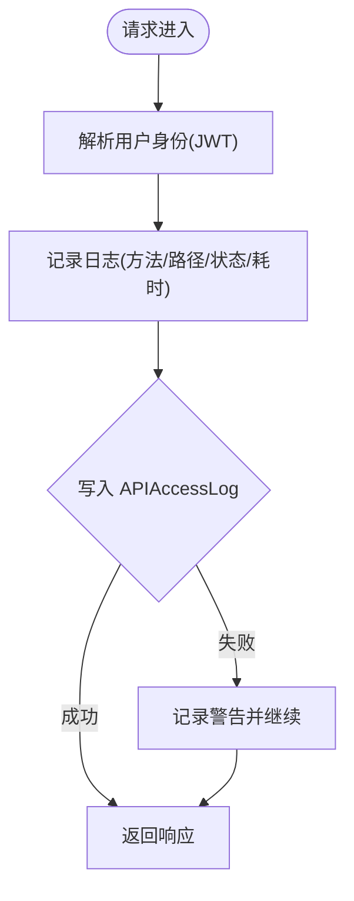
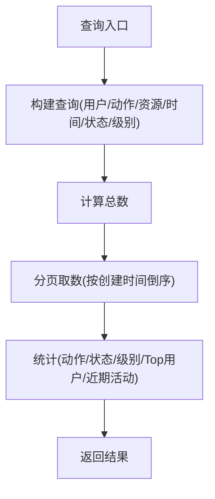
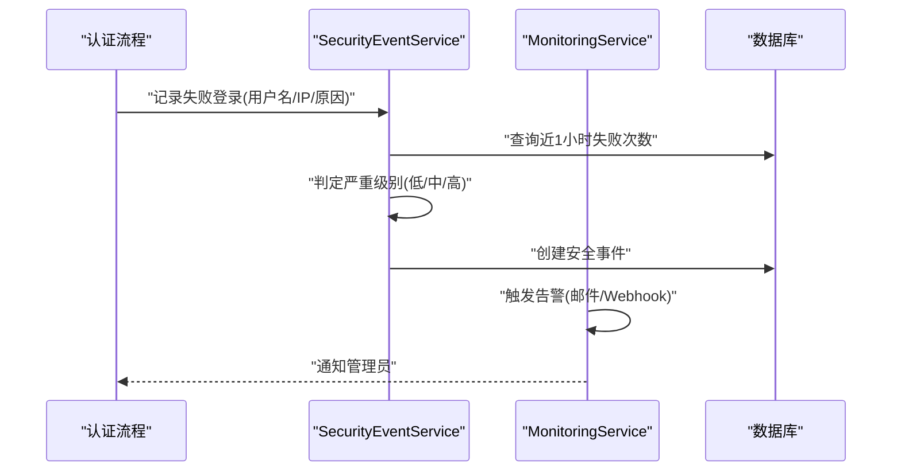
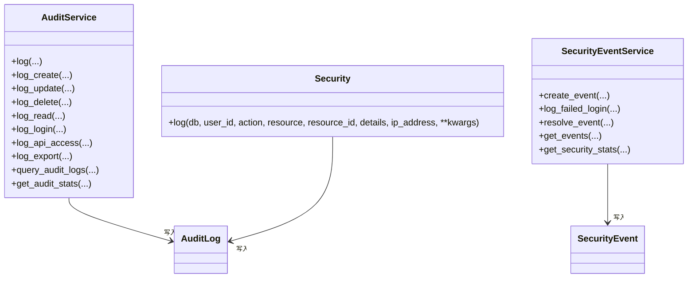
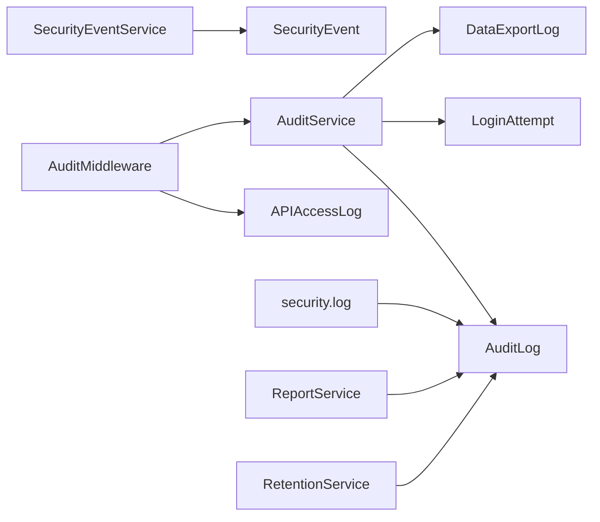

# 访问日志审计

<cite>
**本文引用的文件**
- [backend/app/models/audit.py](file://backend/app/models/audit.py)
- [backend/app/core/audit_middleware.py](file://backend/app/core/audit_middleware.py)
- [backend/app/middleware/audit_context.py](file://backend/app/middleware/audit_context.py)
- [backend/app/services/audit_service.py](file://backend/app/services/audit_service.py)
- [backend/app/core/security.py](file://backend/app/core/security.py)
- [backend/app/services/report_service.py](file://backend/app/services/report_service.py)
- [backend/app/services/retention_service.py](file://backend/app/services/retention_service.py)
</cite>

## 目录
1. [简介](#简介)
2. [项目结构](#项目结构)
3. [核心组件](#核心组件)
4. [架构总览](#架构总览)
5. [详细组件分析](#详细组件分析)
6. [依赖关系分析](#依赖关系分析)
7. [性能考虑](#性能考虑)
8. [故障排查指南](#故障排查指南)
9. [结论](#结论)
10. [附录](#附录)

## 简介
本实现文档围绕 RBAC 访问日志审计系统，系统性说明数据模型设计、自动采集机制、查询与分析能力、审计报表与异常检测、以及日志管理最佳实践。重点覆盖：
- AccessLog 相关模型（审计日志、API 访问日志、登录尝试、安全事件、导出日志）的数据结构设计
- 中间件拦截、日志格式化与异步落库策略
- 多维度检索（用户、时间、资源类型、状态、级别等）
- 审计报表生成与安全事件告警
- 保留期策略、性能优化与合规性要求

## 项目结构
审计相关代码主要分布在以下模块：
- 数据模型：定义审计日志、API 访问日志、登录尝试、安全事件、导出日志等表结构与索引
- 中间件：请求级审计中间件负责提取用户身份、记录 HTTP 访问指标并落库
- 服务层：提供统一的审计写入、查询、统计、安全事件处理与导出日志记录
- 工具与安全：通用安全方法中提供轻量审计写入入口
- 报表与保留期：报表导出服务与保留期清理服务支撑审计数据的归档与生命周期管理

**图表来源**
- [backend/app/core/audit_middleware.py:11-109](file://backend/app/core/audit_middleware.py#L11-L109)
- [backend/app/middleware/audit_context.py:15-58](file://backend/app/middleware/audit_context.py#L15-L58)
- [backend/app/services/audit_service.py:58-376](file://backend/app/services/audit_service.py#L58-L376)
- [backend/app/models/audit.py:53-205](file://backend/app/models/audit.py#L53-L205)
- [backend/app/core/security.py:650-686](file://backend/app/core/security.py#L650-L686)
- [backend/app/services/report_service.py:18-200](file://backend/app/services/report_service.py#L18-L200)
- [backend/app/services/retention_service.py:47-83](file://backend/app/services/retention_service.py#L47-L83)

**章节来源**
- [backend/app/models/audit.py:53-205](file://backend/app/models/audit.py#L53-L205)
- [backend/app/core/audit_middleware.py:11-109](file://backend/app/core/audit_middleware.py#L11-L109)
- [backend/app/middleware/audit_context.py:15-58](file://backend/app/middleware/audit_context.py#L15-L58)
- [backend/app/services/audit_service.py:58-376](file://backend/app/services/audit_service.py#L58-L376)
- [backend/app/core/security.py:650-686](file://backend/app/core/security.py#L650-L686)
- [backend/app/services/report_service.py:18-200](file://backend/app/services/report_service.py#L18-L200)
- [backend/app/services/retention_service.py:47-83](file://backend/app/services/retention_service.py#L47-L83)

## 核心组件
- 数据模型
  - AuditLog：核心审计日志，包含用户、动作、资源、状态、级别、请求路径、响应状态、耗时、元数据、会话与追踪标识、创建时间等字段，并提供多列索引以支持高效查询
  - APIAccessLog：独立存储每次 HTTP 请求的访问信息（端点、方法、参数、响应状态、耗时、IP、UA、会话）
  - LoginAttempt：登录尝试记录（用户名、IP、UA、成功与否、失败原因、尝试时间）
  - SecurityEvent：安全事件（事件类型、严重级别、来源 IP、用户、描述、详情、受影响资源、解决状态与备注）
  - DataExportLog：数据导出日志（导出类型、数据类型、过滤器、文件格式、记录数、文件大小、文件路径、状态、错误信息）
- 中间件
  - AuditMiddleware：在请求链路中记录方法、路径、状态码、耗时与认证用户，并将访问日志持久化到 api_access_logs；落库失败仅记录警告，不影响业务
  - AuditContext：使用 ContextVar 维护当前请求的用户 ID 与请求 ID，便于跨层传递审计上下文
- 服务层
  - AuditService：统一封装审计日志写入（CRUD、登录、API 访问、导出）、查询（按用户、动作、资源类型、时间范围、状态、级别分页）、统计（按动作/状态/级别聚合、活跃用户、近期活动）
  - SecurityEventService：安全事件创建、失败登录聚合告警、事件解决与查询统计
  - ReportService：报表导出（Excel/PDF），用于审计与业务数据可视化
  - RetentionService：保留期清理，按策略清理软删除或过期数据，保障大表规模可控
- 安全工具
  - security.log：轻量审计写入入口，将 action/resource/resource_id/details/ip_address 映射为 AuditLog 字段并落库

**章节来源**
- [backend/app/models/audit.py:19-205](file://backend/app/models/audit.py#L19-L205)
- [backend/app/core/audit_middleware.py:11-109](file://backend/app/core/audit_middleware.py#L11-L109)
- [backend/app/middleware/audit_context.py:15-58](file://backend/app/middleware/audit_context.py#L15-L58)
- [backend/app/services/audit_service.py:58-510](file://backend/app/services/audit_service.py#L58-L510)
- [backend/app/core/security.py:650-686](file://backend/app/core/security.py#L650-L686)
- [backend/app/services/report_service.py:18-200](file://backend/app/services/report_service.py#L18-L200)
- [backend/app/services/retention_service.py:47-83](file://backend/app/services/retention_service.py#L47-L83)

## 架构总览
下图展示从请求进入、中间件拦截、审计写入到查询与报表生成的整体流程。

**图表来源**
- [backend/app/core/audit_middleware.py:18-109](file://backend/app/core/audit_middleware.py#L18-L109)
- [backend/app/services/audit_service.py:275-376](file://backend/app/services/audit_service.py#L275-L376)
- [backend/app/services/report_service.py:27-133](file://backend/app/services/report_service.py#L27-L133)

## 详细组件分析

### 数据模型设计（AuditLog / APIAccessLog / LoginAttempt / SecurityEvent / DataExportLog）
- 关键字段与用途
  - AuditLog：user_id/username/user_ip/user_agent/action/resource_type/resource_id/old_value/new_value/status/error_message/level/request_path/request_method/response_status/duration_ms/metadata_/session_id/trace_id/created_at
  - APIAccessLog：user_id/username/endpoint/method/request_params/request_body/response_status/response_time_ms/ip_address/user_agent/session_id/created_at
  - LoginAttempt：username/ip_address/user_agent/success/failure_reason/attempt_time
  - SecurityEvent：event_type/severity/source_ip/user_id/username/description/details/affected_resources/resolved/resolved_at/resolved_by/resolution_notes/created_at
  - DataExportLog：user_id/username/export_type/data_types/filters/file_format/record_count/file_size_bytes/file_path/status/error_message/created_at
- 索引与查询优化
  - 针对 user_id、action、resource_type、resource_id、created_at、endpoint、severity 等建立索引，提升多维检索与聚合效率
- 复杂度与空间
  - 大表（如 audit_logs、api_access_logs）随时间增长，需配合保留期策略与索引优化控制查询成本

**章节来源**
- [backend/app/models/audit.py:53-205](file://backend/app/models/audit.py#L53-L205)

### 访问日志自动收集机制（中间件拦截、格式化、异步存储）
- 中间件拦截
  - 在请求前后记录方法、路径、状态码、耗时，并从 Authorization 头解析 JWT 获取用户身份（sub/username）
- 日志格式化
  - 将请求信息标准化为 APIAccessLog 字段（endpoint、method、response_status、response_time_ms、ip_address、user_agent、session_id）
- 异步/隔离存储
  - 使用独立短会话写入 api_access_logs，确保落库失败不会破坏业务事务；失败时仅记录 WARNING
- 上下文传递
  - 通过 AuditContext 维护当前请求的用户 ID 与请求 ID，供后续审计写入使用

**图表来源**
- [backend/app/core/audit_middleware.py:18-109](file://backend/app/core/audit_middleware.py#L18-L109)
- [backend/app/middleware/audit_context.py:15-58](file://backend/app/middleware/audit_context.py#L15-L58)

**章节来源**
- [backend/app/core/audit_middleware.py:18-109](file://backend/app/core/audit_middleware.py#L18-L109)
- [backend/app/middleware/audit_context.py:15-58](file://backend/app/middleware/audit_context.py#L15-L58)

### 日志查询与分析（多维度检索）
- 查询维度
  - 用户（user_id）、动作（action）、资源类型（resource_type）、时间范围（start_date/end_date）、状态（status）、级别（level）
- 分页与排序
  - 按 created_at 降序分页，返回 items、total、page、page_size
- 统计分析
  - 按动作/状态/级别聚合计数，Top 用户、近期活动、今日操作数、活跃用户数、失败操作数、警告数等

**图表来源**
- [backend/app/services/audit_service.py:275-376](file://backend/app/services/audit_service.py#L275-L376)

**章节来源**
- [backend/app/services/audit_service.py:275-376](file://backend/app/services/audit_service.py#L275-L376)

### 审计报表生成与异常检测（权限滥用识别与安全事件告警）
- 报表生成
  - ReportService 支持 Excel/PDF 导出，可基于查询参数生成综合报表，便于审计与业务分析
- 异常检测与告警
  - SecurityEventService 对失败登录进行聚合，依据阈值判定严重级别并创建安全事件
  - 监控服务支持邮件/Webhook 告警通知（配置收件人与 Webhook URL）
- 权限滥用识别
  - 结合审计日志中的动作与资源访问模式，配合安全事件与监控规则，识别异常行为（如频繁失败登录、越权访问等）

**图表来源**
- [backend/app/services/audit_service.py:411-442](file://backend/app/services/audit_service.py#L411-L442)
- [backend/app/services/monitoring_service.py:290-311](file://backend/app/services/monitoring_service.py#L290-L311)

**章节来源**
- [backend/app/services/report_service.py:27-133](file://backend/app/services/report_service.py#L27-L133)
- [backend/app/services/audit_service.py:411-442](file://backend/app/services/audit_service.py#L411-L442)
- [backend/app/services/monitoring_service.py:290-311](file://backend/app/services/monitoring_service.py#L290-L311)

### 审计写入与上下文（服务层与安全工具）
- AuditService 提供统一的审计写入接口，支持 CRUD、登录、API 访问、导出等场景，并附带上下文（用户、IP、UA、会话、追踪、请求路径、方法、耗时、响应状态）
- security.log 提供轻量写入入口，将业务友好字段映射为模型列名并落库，失败时回滚并记录警告

**图表来源**
- [backend/app/services/audit_service.py:58-376](file://backend/app/services/audit_service.py#L58-L376)
- [backend/app/core/security.py:650-686](file://backend/app/core/security.py#L650-L686)

**章节来源**
- [backend/app/services/audit_service.py:58-376](file://backend/app/services/audit_service.py#L58-L376)
- [backend/app/core/security.py:650-686](file://backend/app/core/security.py#L650-L686)

## 依赖关系分析
- 中间件依赖
  - AuditMiddleware 依赖 JWT 解析与数据库会话，写入 APIAccessLog；失败不阻断请求
- 服务层依赖
  - AuditService 依赖 SQLAlchemy Session 与模型；提供查询与统计
  - SecurityEventService 依赖 LoginAttempt 与 SecurityEvent 模型
  - ReportService 依赖外部库（openpyxl/reportlab）进行报表导出
  - RetentionService 执行保留期清理，必要时触发即时备份
- 安全工具依赖
  - security.log 直接写入 AuditLog，保证轻量审计写入

**图表来源**
- [backend/app/core/audit_middleware.py:18-109](file://backend/app/core/audit_middleware.py#L18-L109)
- [backend/app/services/audit_service.py:58-376](file://backend/app/services/audit_service.py#L58-L376)
- [backend/app/models/audit.py:53-205](file://backend/app/models/audit.py#L53-L205)
- [backend/app/core/security.py:650-686](file://backend/app/core/security.py#L650-L686)
- [backend/app/services/report_service.py:27-133](file://backend/app/services/report_service.py#L27-L133)
- [backend/app/services/retention_service.py:47-83](file://backend/app/services/retention_service.py#L47-L83)

**章节来源**
- [backend/app/core/audit_middleware.py:18-109](file://backend/app/core/audit_middleware.py#L18-L109)
- [backend/app/services/audit_service.py:58-376](file://backend/app/services/audit_service.py#L58-L376)
- [backend/app/models/audit.py:53-205](file://backend/app/models/audit.py#L53-L205)
- [backend/app/core/security.py:650-686](file://backend/app/core/security.py#L650-L686)
- [backend/app/services/report_service.py:27-133](file://backend/app/services/report_service.py#L27-L133)
- [backend/app/services/retention_service.py:47-83](file://backend/app/services/retention_service.py#L47-L83)

## 性能考虑
- 写入路径优化
  - APIAccessLog 使用独立短会话写入，避免阻塞主事务；失败降级为警告，确保可用性
  - 建议对高频写入采用批量缓冲或采样策略（例如按时间窗口聚合后批量插入），降低 SQLite 单写者热点压力
- 查询性能
  - 充分利用现有索引（user_id、action、resource_type、resource_id、created_at、endpoint、severity）
  - 分页查询限制 page_size，避免一次性加载大量数据
- 存储与保留期
  - 定期清理过期审计数据（参考保留期策略），防止大表膨胀影响性能
  - 对历史归档数据可迁移至冷存储或压缩归档

[本节为通用性能指导，无需特定文件引用]

## 故障排查指南
- 中间件落库失败
  - 现象：api_access_logs 写入失败，但请求正常返回
  - 排查：检查数据库连接与会话关闭逻辑；确认独立会话是否正确释放；查看 WARNING 日志定位具体错误
  - 参考：中间件捕获异常并记录警告，不阻断请求
- 审计写入失败
  - 现象：审计日志未写入或回滚
  - 排查：检查 safe_commit 与异常处理；确认字段映射正确（resource→resource_type、ip_address→user_ip、details→metadata_）
  - 参考：security.log 的异常回滚与警告记录
- 安全事件未触发
  - 现象：失败登录未生成安全事件或告警
  - 排查：检查失败登录计数阈值与严重级别判定；确认邮件/Webhook 配置是否生效
  - 参考：SecurityEventService 的失败登录聚合与 MonitoringService 的告警发送

**章节来源**
- [backend/app/core/audit_middleware.py:106-109](file://backend/app/core/audit_middleware.py#L106-L109)
- [backend/app/core/security.py:681-686](file://backend/app/core/security.py#L681-L686)
- [backend/app/services/audit_service.py:411-442](file://backend/app/services/audit_service.py#L411-L442)
- [backend/app/services/monitoring_service.py:290-311](file://backend/app/services/monitoring_service.py#L290-L311)

## 结论
本审计系统通过中间件与服务层协同，实现了完整的访问日志采集、存储、查询与统计能力，并结合安全事件与告警机制，支持权限滥用识别与安全事件处置。配合报表导出与保留期策略，满足合规性与运维需求。建议在高频写入场景引入批量缓冲或采样策略，进一步优化性能与稳定性。

[本节为总结性内容，无需特定文件引用]

## 附录
- 关键枚举与常量
  - AuditAction：create/read/update/delete/login/logout/login_failed/password_change/permission_change/export/import/api_call/file_upload/file_download/config_change/backup/restore
  - AuditLevel：debug/info/warning/error/critical
  - AuditStatus：success/failed/pending
- 常用查询示例（概念性）
  - 按用户与时间范围查询审计日志
  - 按资源类型与动作统计访问频次
  - 按严重级别筛选安全事件
- 合规性建议
  - 敏感信息脱敏（如密码、令牌）
  - 保留期策略明确（审计日志、登录尝试、API 访问日志等）
  - 审计不可篡改与完整性校验（建议结合数字签名或哈希链）

[本节为补充信息，无需特定文件引用]