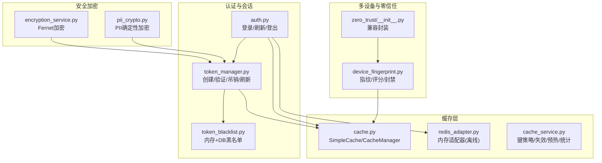
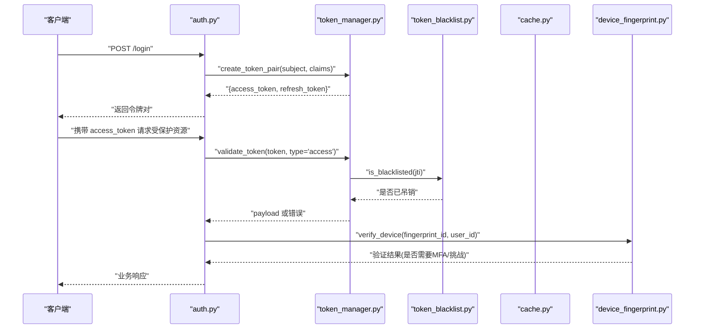
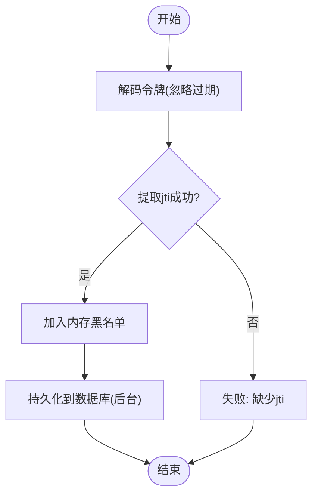
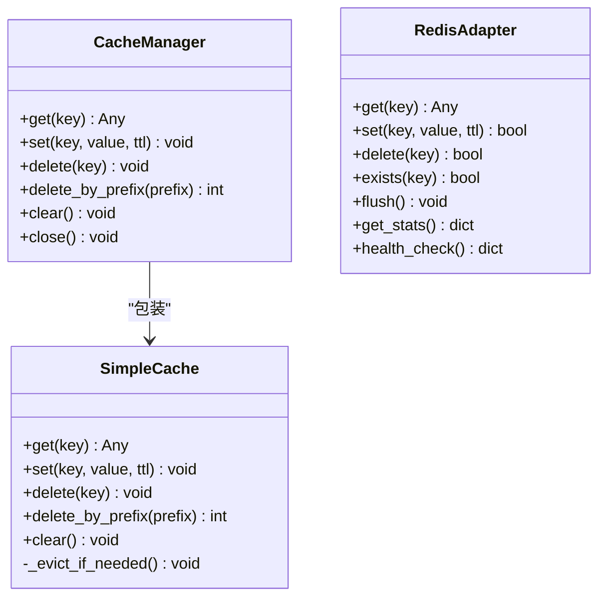
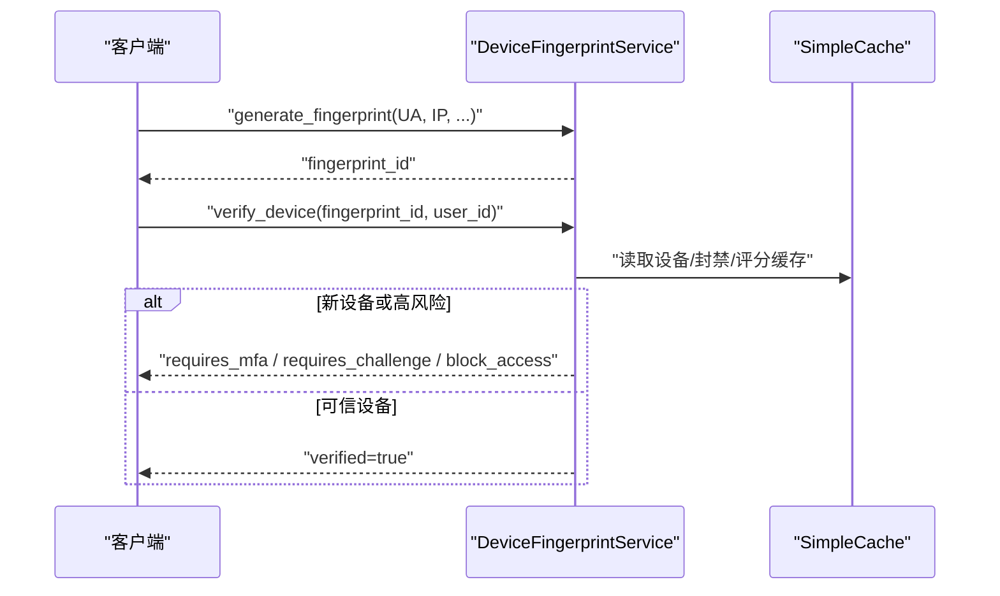
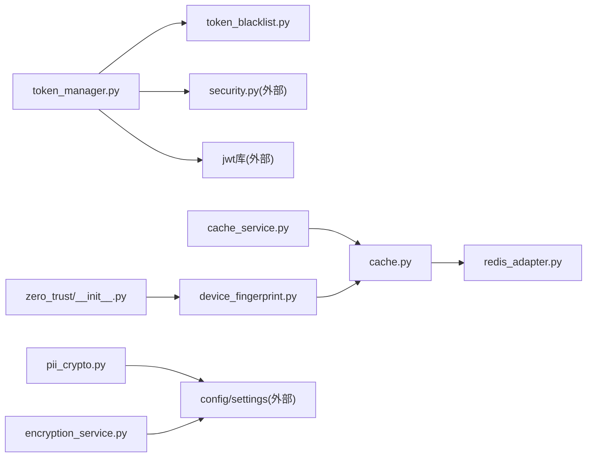

# 会话存储策略

<cite>
**本文引用的文件**
- [token_manager.py](file://backend/app/core/token_manager.py)
- [token_blacklist.py](file://backend/app/core/token_blacklist.py)
- [redis_adapter.py](file://backend/app/core/redis_adapter.py)
- [cache.py](file://backend/app/core/cache.py)
- [cache_service.py](file://backend/app/services/cache_service.py)
- [device_fingerprint.py](file://backend/app/services/zero_trust/device_fingerprint.py)
- [zero_trust/__init__.py](file://backend/app/services/zero_trust/__init__.py)
- [pii_crypto.py](file://backend/app/core/pii_crypto.py)
- [encryption_service.py](file://backend/app/services/encryption_service.py)
- [auth.py](file://backend/app/api/v1/auth/auth.py)
- [admin.py](file://backend/app/api/v1/system/admin.py)
</cite>

## 目录
1. [简介](#简介)
2. [项目结构](#项目结构)
3. [核心组件](#核心组件)
4. [架构总览](#架构总览)
5. [详细组件分析](#详细组件分析)
6. [依赖关系分析](#依赖关系分析)
7. [性能考量](#性能考量)
8. [故障排查指南](#故障排查指南)
9. [结论](#结论)
10. [附录：配置与调优建议](#附录：配置与调优建议)

## 简介
本技术文档围绕“会话存储策略”展开，聚焦于令牌（Token）生命周期管理、黑名单持久化、缓存与设备指纹识别等关键能力。系统采用无状态 JWT 作为会话载体，结合内存黑名单与数据库持久化实现可吊销的会话控制；通过内置内存缓存与可选 Redis 适配器提供高性能读路径；借助零信任设备指纹服务实现多设备登录支持、风险识别与冲突处理；并通过 PII 加密与通用数据加密服务保障敏感信息的安全存储。

## 项目结构
与会话存储相关的关键模块分布在后端 core 与 services 层：
- 令牌管理与吊销：token_manager、token_blacklist
- 缓存抽象与实现：cache（SimpleCache/CacheManager）、redis_adapter（离线内存适配）
- 业务级缓存服务：cache_service（键生成、失效、预热、统计）
- 多设备与零信任：device_fingerprint、zero_trust 封装
- 安全加密：pii_crypto（PII 字段确定性加密）、encryption_service（数据包/字段加密）
- API 集成点：auth（登录/刷新/登出）、admin（会话列表/吊销）

图表来源
- [auth.py:59-64](file://backend/app/api/v1/auth/auth.py#L59-L64)
- [token_manager.py:64-127](file://backend/app/core/token_manager.py#L64-L127)
- [token_blacklist.py:27-52](file://backend/app/core/token_blacklist.py#L27-L52)
- [cache.py:14-95](file://backend/app/core/cache.py#L14-L95)
- [redis_adapter.py:7-43](file://backend/app/core/redis_adapter.py#L7-L43)
- [cache_service.py:20-47](file://backend/app/services/cache_service.py#L20-L47)
- [device_fingerprint.py:68-152](file://backend/app/services/zero_trust/device_fingerprint.py#L68-L152)
- [zero_trust/__init__.py:26-99](file://backend/app/services/zero_trust/__init__.py#L26-L99)
- [pii_crypto.py:30-87](file://backend/app/core/pii_crypto.py#L30-L87)
- [encryption_service.py:181-224](file://backend/app/services/encryption_service.py#L181-L224)

章节来源
- [auth.py:59-64](file://backend/app/api/v1/auth/auth.py#L59-L64)
- [token_manager.py:64-127](file://backend/app/core/token_manager.py#L64-L127)
- [cache.py:14-95](file://backend/app/core/cache.py#L14-L95)
- [redis_adapter.py:7-43](file://backend/app/core/redis_adapter.py#L7-L43)
- [cache_service.py:20-47](file://backend/app/services/cache_service.py#L20-L47)
- [device_fingerprint.py:68-152](file://backend/app/services/zero_trust/device_fingerprint.py#L68-L152)
- [zero_trust/__init__.py:26-99](file://backend/app/services/zero_trust/__init__.py#L26-L99)
- [pii_crypto.py:30-87](file://backend/app/core/pii_crypto.py#L30-L87)
- [encryption_service.py:181-224](file://backend/app/services/encryption_service.py#L181-L224)

## 核心组件
- 令牌管理器（token_manager）
  - 负责创建 access/refresh 令牌对、校验类型与黑名单、吊销令牌、刷新令牌。
  - 使用 JWT 标准声明（sub/jti/type/exp/iat），JTI 用于唯一标识并支持吊销。
  - 支持从配置加载过期时间，默认访问令牌 TTL 为分钟级，刷新令牌为天数级。
- 黑名单（token_blacklist）
  - 内存集合维护已吊销 JTI，带过期清理与线程锁保护。
  - 可选数据库持久化，重启后仍可保持吊销状态。
- 缓存（cache + redis_adapter）
  - SimpleCache 提供线程安全、按 key TTL 的内存缓存与 LRU 淘汰。
  - CacheManager 提供异步风格接口。
  - redis_adapter 在离线部署时以进程内 dict 模拟 Redis 行为，便于统一接入。
- 业务缓存服务（cache_service）
  - 提供键前缀策略、失效模式、预热、统计等高级能力。
- 设备指纹与零信任（device_fingerprint + zero_trust）
  - 基于 UA/IP/平台/特征哈希生成稳定指纹，计算信任评分与风险等级。
  - 支持封禁、信任评分缓存、新设备强制二次验证等策略。
- 安全加密（pii_crypto + encryption_service）
  - PII 字段使用 AES-SIV 确定性加密，密文带标记前缀，兼容历史明文。
  - 通用数据包/字段使用 Fernet 对称加密，密钥可从配置或运行时密钥存储获取。

章节来源
- [token_manager.py:64-127](file://backend/app/core/token_manager.py#L64-L127)
- [token_blacklist.py:27-52](file://backend/app/core/token_blacklist.py#L27-L52)
- [cache.py:14-95](file://backend/app/core/cache.py#L14-L95)
- [redis_adapter.py:7-43](file://backend/app/core/redis_adapter.py#L7-L43)
- [cache_service.py:20-47](file://backend/app/services/cache_service.py#L20-L47)
- [device_fingerprint.py:68-152](file://backend/app/services/zero_trust/device_fingerprint.py#L68-L152)
- [zero_trust/__init__.py:26-99](file://backend/app/services/zero_trust/__init__.py#L26-L99)
- [pii_crypto.py:30-87](file://backend/app/core/pii_crypto.py#L30-L87)
- [encryption_service.py:181-224](file://backend/app/services/encryption_service.py#L181-L224)

## 架构总览
下图展示一次登录到鉴权的完整流程，包括令牌签发、黑名单检查、缓存与设备指纹评估。

图表来源
- [auth.py:59-64](file://backend/app/api/v1/auth/auth.py#L59-L64)
- [token_manager.py:135-168](file://backend/app/core/token_manager.py#L135-L168)
- [token_blacklist.py:60-70](file://backend/app/core/token_blacklist.py#L60-L70)
- [device_fingerprint.py:325-386](file://backend/app/services/zero_trust/device_fingerprint.py#L325-L386)

## 详细组件分析

### 令牌与黑名单（JWT + 吊销）
- 令牌结构
  - access/refresh 均包含 sub、jti、type、exp、iat；extra_claims 可扩展用户上下文。
  - 通过配置项控制 TTL，默认访问令牌分钟级、刷新令牌天级。
- 吊销机制
  - revoke_token 解码 token（忽略 exp）提取 jti，加入内存黑名单，并异步持久化至数据库。
  - validate_token 在解码后检查 jti 是否在黑名单中，命中则拒绝。
- 刷新流程
  - 使用有效 refresh 令牌调用 refresh_access_token，成功后吊销旧 refresh 并签发新令牌对。

图表来源
- [token_manager.py:176-210](file://backend/app/core/token_manager.py#L176-L210)
- [token_blacklist.py:27-52](file://backend/app/core/token_blacklist.py#L27-L52)

章节来源
- [token_manager.py:64-127](file://backend/app/core/token_manager.py#L64-L127)
- [token_manager.py:135-168](file://backend/app/core/token_manager.py#L135-L168)
- [token_manager.py:176-210](file://backend/app/core/token_manager.py#L176-L210)
- [token_blacklist.py:60-70](file://backend/app/core/token_blacklist.py#L60-L70)
- [token_blacklist.py:73-103](file://backend/app/core/token_blacklist.py#L73-L103)

### 缓存层（内存与Redis适配）
- SimpleCache
  - 线程安全字典存储，支持 per-key TTL、LRU 淘汰、前缀删除、统计命中/未命中。
- CacheManager
  - 提供 await 风格的 get/set/delete/clear，便于在异步上下文中使用。
- RedisAdapter（离线）
  - 以进程内 dict 模拟 Redis 的 get/set/delete/exists/flush/stats/health_check，保证离线部署一致性。

图表来源
- [cache.py:14-95](file://backend/app/core/cache.py#L14-L95)
- [redis_adapter.py:7-43](file://backend/app/core/redis_adapter.py#L7-L43)

章节来源
- [cache.py:14-95](file://backend/app/core/cache.py#L14-L95)
- [redis_adapter.py:7-43](file://backend/app/core/redis_adapter.py#L7-L43)

### 业务缓存服务（键策略/失效/预热）
- 键策略
  - 提供短/中/长/超长 TTL 常量与资源前缀（user:/village:/data:/api:/stats:）。
  - 支持自定义 key_builder/make_key，复杂参数通过 JSON 序列化后 MD5 生成稳定键。
- 失效与预热
  - invalidate_related_cache 支持按资源类型与 ID 批量失效（detail/list/stats）。
  - warm_up_cache 支持预加载热点数据到缓存。
- 统计
  - 记录 hits/misses/sets/deletes，便于观测缓存命中率与写入压力。

章节来源
- [cache_service.py:20-47](file://backend/app/services/cache_service.py#L20-L47)
- [cache_service.py:150-213](file://backend/app/services/cache_service.py#L150-L213)
- [cache_service.py:229-308](file://backend/app/services/cache_service.py#L229-L308)

### 多设备登录与零信任（设备指纹）
- 指纹生成
  - 基于 UA、IP、屏幕分辨率、平台、语言、Canvas/WebGL 哈希等组合生成稳定指纹 ID。
- 信任评分与风险等级
  - 初始评分 0.5，根据 UA 可疑模式、平台可信度、特征完整性调整。
  - 将评分映射为 low/medium/high/critical 风险等级。
- 设备验证流程
  - 新设备需额外验证（如 MFA），高风险设备触发挑战或阻断。
  - 支持封禁设备并设置原因，封禁状态短期缓存。
- 缓存优化
  - 设备信息与信任评分分别缓存，减少重复计算与 IO。

图表来源
- [device_fingerprint.py:98-152](file://backend/app/services/zero_trust/device_fingerprint.py#L98-L152)
- [device_fingerprint.py:325-386](file://backend/app/services/zero_trust/device_fingerprint.py#L325-L386)
- [zero_trust/__init__.py:41-99](file://backend/app/services/zero_trust/__init__.py#L41-L99)

章节来源
- [device_fingerprint.py:98-152](file://backend/app/services/zero_trust/device_fingerprint.py#L98-L152)
- [device_fingerprint.py:154-201](file://backend/app/services/zero_trust/device_fingerprint.py#L154-L201)
- [device_fingerprint.py:203-323](file://backend/app/services/zero_trust/device_fingerprint.py#L203-L323)
- [device_fingerprint.py:325-386](file://backend/app/services/zero_trust/device_fingerprint.py#L325-L386)
- [zero_trust/__init__.py:41-99](file://backend/app/services/zero_trust/__init__.py#L41-L99)

### 安全存储（PII 与通用加密）
- PII 字段加密
  - 使用 AES-SIV 确定性加密，密文带标记前缀 enc.v1:，便于兼容历史明文。
  - 密钥来源优先级：显式 ENCRYPTION_KEY 或运行时密钥存储持久化。
- 通用数据加密
  - 使用 Fernet 对称加密，密钥可从配置或运行时密钥存储获取，支持文件与字段级加解密。
- 应用建议
  - 会话载荷中避免存放明文敏感信息；如需存储，应使用 PII 加密或通用加密服务。
  - 密钥轮换需配合版本标记与迁移脚本，确保向后兼容。

章节来源
- [pii_crypto.py:30-87](file://backend/app/core/pii_crypto.py#L30-L87)
- [encryption_service.py:181-224](file://backend/app/services/encryption_service.py#L181-L224)
- [encryption_service.py:233-260](file://backend/app/services/encryption_service.py#L233-L260)

## 依赖关系分析
- 令牌与黑名单
  - token_manager 依赖 security（算法/密钥）、jwt 库、token_blacklist（内存+DB）。
  - token_blacklist 依赖数据库模型 TokenBlacklist（可选）。
- 缓存
  - cache_service 依赖 cache（SimpleCache/CacheManager）与 settings。
  - redis_adapter 提供离线内存实现，便于统一接入。
- 设备指纹
  - device_fingerprint 依赖 SimpleCache（同步）进行设备信息与评分缓存。
  - zero_trust 封装提供向后兼容方法供中间件/旧代码调用。
- 加密
  - pii_crypto 依赖 cryptography 与运行时密钥存储。
  - encryption_service 依赖 Fernet 与运行时密钥存储。

图表来源
- [token_manager.py:64-127](file://backend/app/core/token_manager.py#L64-L127)
- [token_blacklist.py:73-103](file://backend/app/core/token_blacklist.py#L73-L103)
- [cache_service.py:20-47](file://backend/app/services/cache_service.py#L20-L47)
- [cache.py:14-95](file://backend/app/core/cache.py#L14-L95)
- [redis_adapter.py:7-43](file://backend/app/core/redis_adapter.py#L7-L43)
- [device_fingerprint.py:203-235](file://backend/app/services/zero_trust/device_fingerprint.py#L203-L235)
- [zero_trust/__init__.py:26-99](file://backend/app/services/zero_trust/__init__.py#L26-L99)
- [pii_crypto.py:30-87](file://backend/app/core/pii_crypto.py#L30-L87)
- [encryption_service.py:181-224](file://backend/app/services/encryption_service.py#L181-L224)

章节来源
- [token_manager.py:64-127](file://backend/app/core/token_manager.py#L64-L127)
- [token_blacklist.py:73-103](file://backend/app/core/token_blacklist.py#L73-L103)
- [cache_service.py:20-47](file://backend/app/services/cache_service.py#L20-L47)
- [cache.py:14-95](file://backend/app/core/cache.py#L14-L95)
- [redis_adapter.py:7-43](file://backend/app/core/redis_adapter.py#L7-L43)
- [device_fingerprint.py:203-235](file://backend/app/services/zero_trust/device_fingerprint.py#L203-L235)
- [zero_trust/__init__.py:26-99](file://backend/app/services/zero_trust/__init__.py#L26-L99)
- [pii_crypto.py:30-87](file://backend/app/core/pii_crypto.py#L30-L87)
- [encryption_service.py:181-224](file://backend/app/services/encryption_service.py#L181-L224)

## 性能考量
- 令牌校验
  - 每次校验先查内存黑名单，O(1) 查找；数据库仅用于持久化，不阻塞主路径。
  - 建议在高并发场景下启用 LRU 缓存以减少重复解码与黑名单查询开销。
- 缓存策略
  - SimpleCache 使用线程锁与 LRU 淘汰，适合单机高吞吐；多机部署建议使用 Redis 替代 redis_adapter。
  - 合理设置 TTL，避免热键长期占用内存；使用 delete_by_prefix 批量清理。
- 设备指纹
  - 信任评分与设备信息缓存，降低重复计算；封禁列表短期缓存，快速阻断。
  - 指纹生成基于轻量哈希，CPU 开销低。
- 加密
  - PII 确定性加密支持等值查询，但会暴露相等关系；仅在必要字段使用。
  - Fernet 加密适合文件与字段级保护，注意密钥轮换成本。

[本节为通用性能讨论，不直接分析具体文件]

## 故障排查指南
- 令牌无效或被吊销
  - 现象：validate_token 返回“令牌已被吊销”。
  - 排查：检查 token_blacklist 内存与数据库是否存在对应 jti；确认 revoke_token 是否被正确调用。
  - 参考路径：[token_manager.py:135-168](file://backend/app/core/token_manager.py#L135-L168)、[token_blacklist.py:60-70](file://backend/app/core/token_blacklist.py#L60-L70)
- 刷新失败
  - 现象：refresh_access_token 返回错误。
  - 排查：确认 refresh 令牌类型与有效性；检查吊销逻辑是否正确执行。
  - 参考路径：[token_manager.py:218-240](file://backend/app/core/token_manager.py#L218-L240)
- 缓存未命中或异常
  - 现象：cache_service 统计 misses 升高或报错。
  - 排查：检查 TTL 设置、键生成策略、底层缓存实现（SimpleCache/redis_adapter）健康状态。
  - 参考路径：[cache_service.py:44-90](file://backend/app/services/cache_service.py#L44-L90)、[cache.py:14-95](file://backend/app/core/cache.py#L14-L95)
- 设备被封禁或高风险
  - 现象：verify_device 返回 block_access 或 requires_challenge。
  - 排查：检查封禁列表、信任评分更新逻辑、UA/平台特征是否符合预期。
  - 参考路径：[device_fingerprint.py:284-323](file://backend/app/services/zero_trust/device_fingerprint.py#L284-L323)、[device_fingerprint.py:325-386](file://backend/app/services/zero_trust/device_fingerprint.py#L325-L386)
- 加密失败
  - 现象：PII 解密失败或 Fernet 解密抛出异常。
  - 排查：确认密钥来源（ENCRYPTION_KEY 或运行时密钥存储）、密文标记前缀、数据完整性。
  - 参考路径：[pii_crypto.py:70-87](file://backend/app/core/pii_crypto.py#L70-L87)、[encryption_service.py:233-260](file://backend/app/services/encryption_service.py#L233-L260)

章节来源
- [token_manager.py:135-168](file://backend/app/core/token_manager.py#L135-L168)
- [token_manager.py:218-240](file://backend/app/core/token_manager.py#L218-L240)
- [cache_service.py:44-90](file://backend/app/services/cache_service.py#L44-L90)
- [cache.py:14-95](file://backend/app/core/cache.py#L14-L95)
- [device_fingerprint.py:284-323](file://backend/app/services/zero_trust/device_fingerprint.py#L284-L323)
- [device_fingerprint.py:325-386](file://backend/app/services/zero_trust/device_fingerprint.py#L325-L386)
- [pii_crypto.py:70-87](file://backend/app/core/pii_crypto.py#L70-L87)
- [encryption_service.py:233-260](file://backend/app/services/encryption_service.py#L233-L260)

## 结论
本系统采用 JWT 无状态会话设计，结合内存黑名单与数据库持久化实现强一致的吊销能力；通过 SimpleCache 与 Redis 适配器提供高性能缓存；利用设备指纹与零信任策略支撑多设备登录与风险管控；并以 PII 与通用加密保障敏感数据安全。整体架构兼顾安全性、可扩展性与运维友好性，适用于单机与分布式部署。

[本节为总结，不直接分析具体文件]

## 附录：配置与调优建议
- 令牌与黑名单
  - ACCESS_TOKEN_EXPIRE_MINUTES：建议设置为分钟级（如 60-480），平衡安全与用户体验。
  - REFRESH_TOKEN_EXPIRE_DAYS：建议设置为天数级（如 7-30），定期轮换提升安全性。
  - 黑名单持久化：生产环境务必启用数据库持久化，确保重启后吊销仍有效。
  - 参考路径：[token_manager.py:64-127](file://backend/app/core/token_manager.py#L64-L127)、[token_blacklist.py:73-103](file://backend/app/core/token_blacklist.py#L73-L103)
- 缓存
  - CACHE_MAX_SIZE：根据内存限制与热点数据规模调整，避免 OOM。
  - TTL：按数据新鲜度设置短/中/长 TTL，热点数据可更长。
  - 多机部署：替换 redis_adapter 为真实 Redis，提升一致性与扩展性。
  - 参考路径：[cache.py:14-95](file://backend/app/core/cache.py#L14-L95)、[redis_adapter.py:7-43](file://backend/app/core/redis_adapter.py#L7-L43)
- 设备指纹
  - 信任阈值：低风险可直接放行，中高风险要求 MFA 或挑战。
  - 封禁策略：封禁列表短期缓存，便于快速恢复与审计。
  - 参考路径：[device_fingerprint.py:154-201](file://backend/app/services/zero_trust/device_fingerprint.py#L154-L201)、[device_fingerprint.py:284-323](file://backend/app/services/zero_trust/device_fingerprint.py#L284-L323)
- 加密
  - PII 加密：优先使用确定性加密（AES-SIV），并确保密钥统一管理。
  - 通用加密：Fernet 密钥可通过环境变量或运行时密钥存储管理，支持轮换。
  - 参考路径：[pii_crypto.py:30-87](file://backend/app/core/pii_crypto.py#L30-L87)、[encryption_service.py:181-224](file://backend/app/services/encryption_service.py#L181-L224)

章节来源
- [token_manager.py:64-127](file://backend/app/core/token_manager.py#L64-L127)
- [token_blacklist.py:73-103](file://backend/app/core/token_blacklist.py#L73-L103)
- [cache.py:14-95](file://backend/app/core/cache.py#L14-L95)
- [redis_adapter.py:7-43](file://backend/app/core/redis_adapter.py#L7-L43)
- [device_fingerprint.py:154-201](file://backend/app/services/zero_trust/device_fingerprint.py#L154-L201)
- [device_fingerprint.py:284-323](file://backend/app/services/zero_trust/device_fingerprint.py#L284-L323)
- [pii_crypto.py:30-87](file://backend/app/core/pii_crypto.py#L30-L87)
- [encryption_service.py:181-224](file://backend/app/services/encryption_service.py#L181-L224)