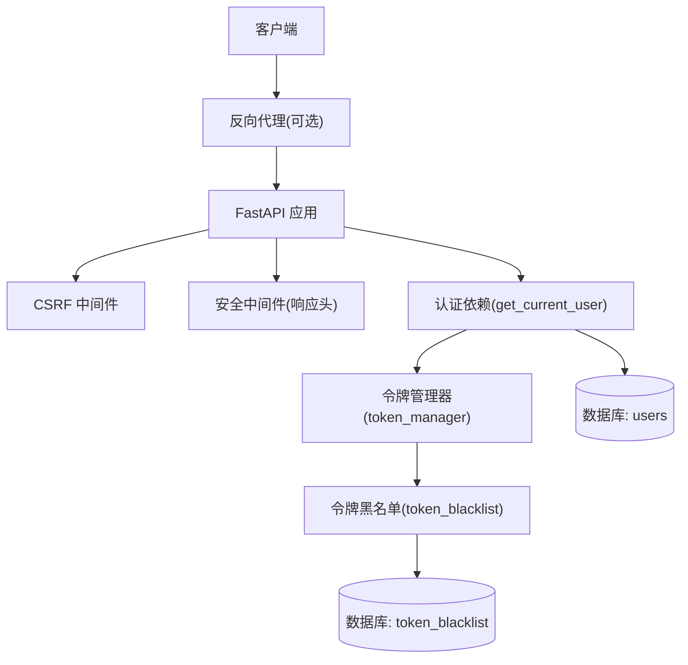
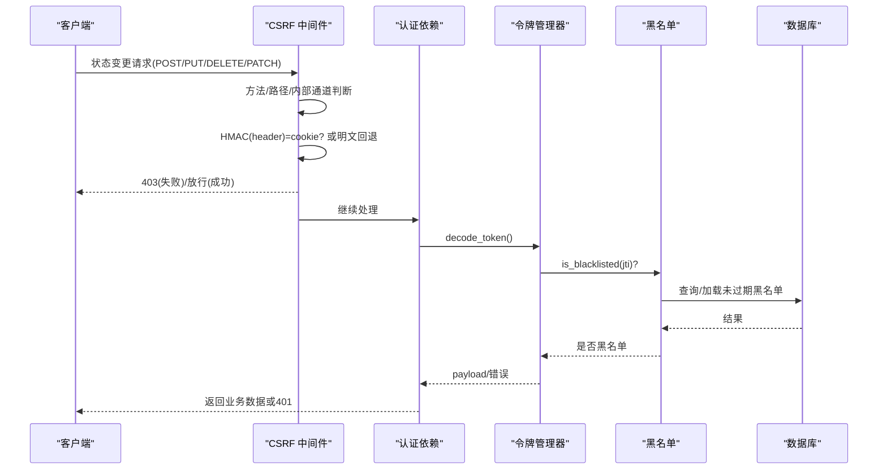
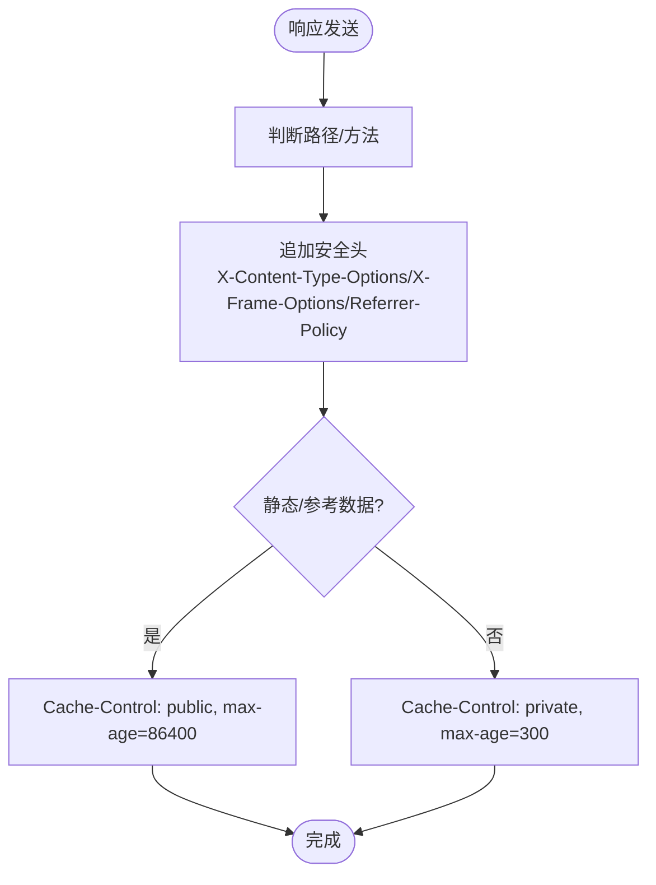
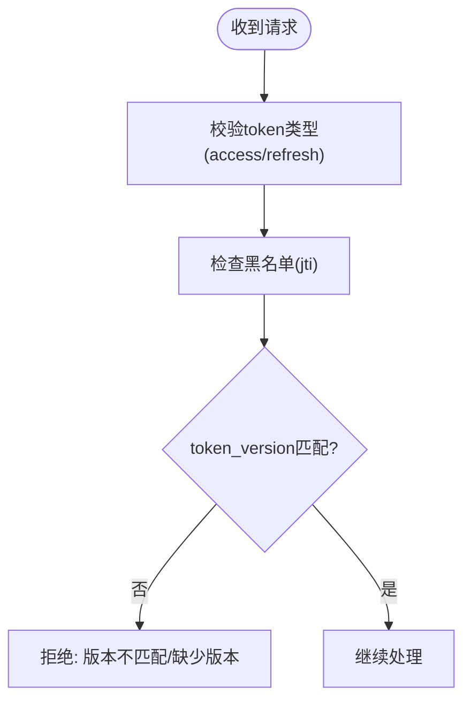
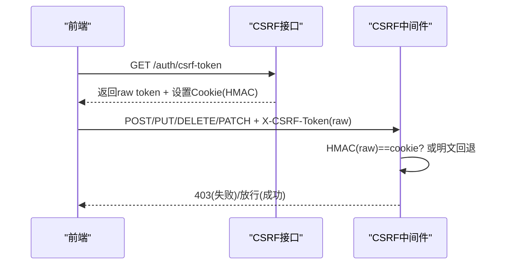
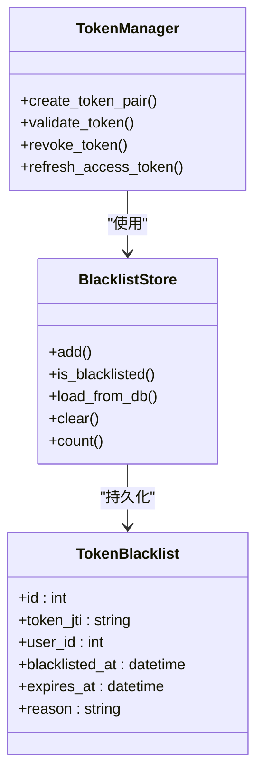
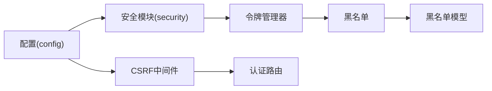

# 会话安全防护

<cite>
**本文引用的文件**
- [backend/app/core/security.py](file://backend/app/core/security.py)
- [backend/app/middleware/csrf_middleware.py](file://backend/app/middleware/csrf_middleware.py)
- [backend/app/core/token_blacklist.py](file://backend/app/core/token_blacklist.py)
- [backend/app/core/token_manager.py](file://backend/app/core/token_manager.py)
- [backend/app/models/token_blacklist.py](file://backend/app/models/token_blacklist.py)
- [backend/app/core/config.py](file://backend/app/core/config.py)
- [backend/app/api/v1/auth/auth.py](file://backend/app/api/v1/auth/auth.py)
</cite>

## 目录
1. [简介](#简介)
2. [项目结构](#项目结构)
3. [核心组件](#核心组件)
4. [架构总览](#架构总览)
5. [详细组件分析](#详细组件分析)
6. [依赖关系分析](#依赖关系分析)
7. [性能考虑](#性能考虑)
8. [故障排查指南](#故障排查指南)
9. [结论](#结论)
10. [附录](#附录)

## 简介
本安全文档聚焦于“会话安全防护”，围绕以下目标展开：
- 会话劫持防护：HTTPS 强制、Secure Cookie、SameSite 策略与安全响应头。
- 会话固定攻击防护：会话 ID 轮换、请求校验与来源检查。
- CSRF（跨站请求伪造）防护：令牌验证、同源策略、自定义头检查。
- 会话黑名单管理：令牌吊销、批量失效、实时同步。
- 会话安全审计：异常登录检测、地理位置验证、设备指纹分析等监控特性。
- 安全配置最佳实践与常见威胁应对方案。

## 项目结构
本项目在认证与会话安全方面采用分层设计：
- 安全中间件层：CSRF 保护、安全响应头等。
- 认证与授权层：JWT 签发/校验、用户上下文获取、权限控制。
- 令牌管理层：双 Token（access/refresh）、轮换、吊销。
- 黑名单持久化：内存+数据库的令牌黑名单，支持重启后恢复。
- 配置中心：统一的安全开关与参数（如 CSRF 开关、CORS、代理信任等）。

图表来源
- [backend/app/middleware/csrf_middleware.py:177-284](file://backend/app/middleware/csrf_middleware.py#L177-L284)
- [backend/app/core/security.py:598-636](file://backend/app/core/security.py#L598-L636)
- [backend/app/core/security.py:243-336](file://backend/app/core/security.py#L243-L336)
- [backend/app/core/token_manager.py:135-168](file://backend/app/core/token_manager.py#L135-L168)
- [backend/app/core/token_blacklist.py:60-70](file://backend/app/core/token_blacklist.py#L60-L70)
- [backend/app/models/token_blacklist.py:13-57](file://backend/app/models/token_blacklist.py#L13-L57)

章节来源
- [backend/app/core/security.py:598-702](file://backend/app/core/security.py#L598-L702)
- [backend/app/middleware/csrf_middleware.py:1-14](file://backend/app/middleware/csrf_middleware.py#L1-L14)
- [backend/app/core/config.py:126-154](file://backend/app/core/config.py#L126-L154)

## 核心组件
- 安全中间件与安全头：提供 X-Content-Type-Options、X-Frame-Options、Referrer-Policy 等；定义 HSTS、CSP、Permissions-Policy 常量。
- CSRF 中间件：HMAC 签名增强 Double Submit Cookie，过期检测，豁免路径，可信代理 IP 透传。
- 认证依赖：从 Bearer 提取 JWT，解码并校验类型、黑名单、token_version，写入审计上下文。
- 令牌管理：创建 access/refresh 对、校验、刷新（轮换）、吊销（加入黑名单并持久化）。
- 黑名单：内存集合 + 数据库持久化，启动时加载未过期条目，自动清理过期项。
- 配置：CSRF_ENABLED、CORS、TRUST_PROXY_HEADERS、速率限制、密码策略等。

章节来源
- [backend/app/core/security.py:598-702](file://backend/app/core/security.py#L598-L702)
- [backend/app/middleware/csrf_middleware.py:177-284](file://backend/app/middleware/csrf_middleware.py#L177-L284)
- [backend/app/core/security.py:243-336](file://backend/app/core/security.py#L243-L336)
- [backend/app/core/token_manager.py:64-127](file://backend/app/core/token_manager.py#L64-L127)
- [backend/app/core/token_blacklist.py:27-70](file://backend/app/core/token_blacklist.py#L27-L70)
- [backend/app/core/config.py:126-154](file://backend/app/core/config.py#L126-L154)

## 架构总览
下图展示一次受保护的 API 调用从进入应用到鉴权、CSRF 校验、黑名单检查的完整流程。

图表来源
- [backend/app/middleware/csrf_middleware.py:177-284](file://backend/app/middleware/csrf_middleware.py#L177-L284)
- [backend/app/core/security.py:243-336](file://backend/app/core/security.py#L243-L336)
- [backend/app/core/token_manager.py:135-168](file://backend/app/core/token_manager.py#L135-L168)
- [backend/app/core/token_blacklist.py:60-103](file://backend/app/core/token_blacklist.py#L60-L103)

## 详细组件分析

### 会话劫持防护（HTTPS 强制、Secure Cookie、SameSite、安全头）
- HTTPS 强制：通过 HSTS 响应头提示浏览器仅使用 HTTPS；生产环境建议由反向代理强制 HTTPS 跳转。
- Secure Cookie：CSRF Cookie 在生产且非本地请求时设置 secure；其他敏感 Cookie 也应遵循此原则。
- SameSite：CSRF Cookie 设置为 strict，降低跨站携带风险。
- 安全响应头：X-Content-Type-Options、X-Frame-Options、Referrer-Policy 等；常量中包含 HSTS、CSP、Permissions-Policy。
- CORS：严格限定允许源与方法，避免宽泛放行。

图表来源
- [backend/app/core/security.py:598-636](file://backend/app/core/security.py#L598-L636)
- [backend/app/core/security.py:694-702](file://backend/app/core/security.py#L694-L702)
- [backend/app/api/v1/auth/auth.py:731-738](file://backend/app/api/v1/auth/auth.py#L731-L738)

章节来源
- [backend/app/core/security.py:598-702](file://backend/app/core/security.py#L598-L702)
- [backend/app/api/v1/auth/auth.py:731-738](file://backend/app/api/v1/auth/auth.py#L731-L738)
- [backend/app/core/config.py:136-154](file://backend/app/core/config.py#L136-L154)

### 会话固定攻击防护（会话ID轮换、请求校验、来源检查）
- 会话 ID 轮换：每次刷新 access_token 都会生成新的 jti，旧 refresh_token 立即吊销，防止重放与固定。
- 请求校验：get_current_user 校验 token 类型、黑名单、token_version（支持强制下线所有会话）。
- 来源检查：基于 TRUST_PROXY_HEADERS 决定是否信任代理头；CSRF 中间件按可信代理透传真实 IP。

图表来源
- [backend/app/core/security.py:243-336](file://backend/app/core/security.py#L243-L336)
- [backend/app/core/token_manager.py:218-240](file://backend/app/core/token_manager.py#L218-L240)
- [backend/app/middleware/csrf_middleware.py:135-174](file://backend/app/middleware/csrf_middleware.py#L135-L174)

章节来源
- [backend/app/core/security.py:243-336](file://backend/app/core/security.py#L243-L336)
- [backend/app/core/token_manager.py:218-240](file://backend/app/core/token_manager.py#L218-L240)
- [backend/app/middleware/csrf_middleware.py:135-174](file://backend/app/middleware/csrf_middleware.py#L135-L174)

### CSRF（跨站请求伪造）防护实现
- 令牌获取：GET /api/v1/auth/csrf-token 返回 raw token 并在响应中设置 csrftoken Cookie（HMAC 签名版）。
- 令牌验证：状态变更请求需携带 X-CSRF-Token；中间件计算 HMAC(header) 并与 cookie 比较（常量时间比较）。
- 过期检测：token 内嵌时间戳，超过窗口即拒绝。
- 豁免路径：登录、注册、健康检查、文档等无需 CSRF。
- 可信代理：仅在配置可信代理时透传 X-Forwarded-For。

图表来源
- [backend/app/api/v1/auth/auth.py:692-747](file://backend/app/api/v1/auth/auth.py#L692-L747)
- [backend/app/middleware/csrf_middleware.py:65-124](file://backend/app/middleware/csrf_middleware.py#L65-L124)
- [backend/app/middleware/csrf_middleware.py:177-284](file://backend/app/middleware/csrf_middleware.py#L177-L284)

章节来源
- [backend/app/api/v1/auth/auth.py:692-747](file://backend/app/api/v1/auth/auth.py#L692-L747)
- [backend/app/middleware/csrf_middleware.py:177-284](file://backend/app/middleware/csrf_middleware.py#L177-L284)

### 会话黑名单管理（令牌吊销、批量失效、实时同步）
- 令牌吊销：revoke_token 将 jti 加入内存黑名单，并异步持久化到数据库，确保重启后仍有效。
- 批量失效：登出时递增 token_version，使该用户所有现存 JWT（含未提交的 refresh）立即失效。
- 实时同步：服务启动时从数据库加载未过期黑名单到内存，保证多实例一致性。

图表来源
- [backend/app/models/token_blacklist.py:13-57](file://backend/app/models/token_blacklist.py#L13-L57)
- [backend/app/core/token_manager.py:176-210](file://backend/app/core/token_manager.py#L176-L210)
- [backend/app/core/token_blacklist.py:27-103](file://backend/app/core/token_blacklist.py#L27-L103)

章节来源
- [backend/app/core/token_manager.py:176-210](file://backend/app/core/token_manager.py#L176-L210)
- [backend/app/core/token_blacklist.py:27-103](file://backend/app/core/token_blacklist.py#L27-L103)
- [backend/app/models/token_blacklist.py:13-57](file://backend/app/models/token_blacklist.py#L13-L57)

### 会话安全审计（异常登录、地理位置、设备指纹）
- 登录审计：记录登录成功/失败、IP、User-Agent、失败原因。
- 异常检测：结合速率限制与账户锁定（失败次数阈值），识别暴力破解。
- 地理位置与设备指纹：当前代码以 IP 与 UA 为主；如需地理定位与设备指纹，可在审计日志扩展字段中增加相关维度（例如通过第三方服务或前端采集后上报）。

章节来源
- [backend/app/api/v1/auth/auth.py:77-99](file://backend/app/api/v1/auth/auth.py#L77-L99)
- [backend/app/api/v1/auth/auth.py:124-179](file://backend/app/api/v1/auth/auth.py#L124-L179)
- [backend/app/core/security.py:491-516](file://backend/app/core/security.py#L491-L516)

## 依赖关系分析
- 认证依赖依赖令牌管理与黑名单，黑名单依赖数据库模型。
- CSRF 中间件依赖配置与安全头常量，同时与认证路由协作（CSRF 豁免登录/注册等）。
- 配置集中管理安全开关与策略，影响各模块行为。

图表来源
- [backend/app/core/config.py:126-154](file://backend/app/core/config.py#L126-L154)
- [backend/app/core/security.py:243-336](file://backend/app/core/security.py#L243-L336)
- [backend/app/middleware/csrf_middleware.py:177-284](file://backend/app/middleware/csrf_middleware.py#L177-L284)
- [backend/app/core/token_manager.py:135-168](file://backend/app/core/token_manager.py#L135-L168)
- [backend/app/models/token_blacklist.py:13-57](file://backend/app/models/token_blacklist.py#L13-L57)

章节来源
- [backend/app/core/config.py:126-154](file://backend/app/core/config.py#L126-L154)
- [backend/app/core/security.py:243-336](file://backend/app/core/security.py#L243-L336)
- [backend/app/middleware/csrf_middleware.py:177-284](file://backend/app/middleware/csrf_middleware.py#L177-L284)
- [backend/app/core/token_manager.py:135-168](file://backend/app/core/token_manager.py#L135-L168)
- [backend/app/models/token_blacklist.py:13-57](file://backend/app/models/token_blacklist.py#L13-L57)

## 性能考虑
- 黑名单清理：定期清理过期条目，避免内存泄漏。
- 数据库加载：启动时仅加载未过期黑名单，减少 IO。
- 速率限制：滑动窗口算法，周期性清理过期键。
- 常量时间比较：CSRF 使用 hmac.compare_digest，防时序攻击。

章节来源
- [backend/app/core/token_blacklist.py:117-125](file://backend/app/core/token_blacklist.py#L117-L125)
- [backend/app/core/token_blacklist.py:73-103](file://backend/app/core/token_blacklist.py#L73-L103)
- [backend/app/core/security.py:424-488](file://backend/app/core/security.py#L424-L488)
- [backend/app/middleware/csrf_middleware.py:251-267](file://backend/app/middleware/csrf_middleware.py#L251-L267)

## 故障排查指南
- 登录频繁被限流：检查同一 IP 的登录尝试频率，确认未触发速率限制。
- CSRF 验证失败：确认前端已调用 /auth/csrf-token 获取 token，并在后续请求头中携带 X-CSRF-Token；检查 Cookie 是否设置成功。
- 令牌被吊销：检查是否登出或 token_version 被提升；查看黑名单是否包含对应 jti。
- 代理头不可信：若部署在反向代理后，需正确配置 TRUST_PROXY_HEADERS，否则可能无法获取真实 IP。

章节来源
- [backend/app/api/v1/auth/auth.py:124-137](file://backend/app/api/v1/auth/auth.py#L124-L137)
- [backend/app/api/v1/auth/auth.py:692-747](file://backend/app/api/v1/auth/auth.py#L692-L747)
- [backend/app/middleware/csrf_middleware.py:211-284](file://backend/app/middleware/csrf_middleware.py#L211-L284)
- [backend/app/core/token_blacklist.py:60-70](file://backend/app/core/token_blacklist.py#L60-L70)
- [backend/app/core/config.py:106-112](file://backend/app/core/config.py#L106-L112)

## 结论
本项目在会话安全方面实现了较为完善的防护体系：
- 通过安全响应头与 Cookie 策略缓解会话劫持风险。
- 借助 token_version 与黑名单机制抵御会话固定与令牌重用。
- 采用 HMAC 增强的 CSRF 防护，兼顾兼容性与安全性。
- 提供审计与速率限制，辅助异常检测与滥用防护。
建议在生产环境中配合反向代理强制 HTTPS，并持续完善地理位置与设备指纹等高级监控能力。

## 附录
- 安全配置要点
  - CSRF_ENABLED=true（默认开启）
  - CORS_ORIGINS 精确限定
  - TRUST_PROXY_HEADERS 仅在可信代理场景启用
  - ACCESS_TOKEN_EXPIRE_MINUTES 与 REFRESH_TOKEN_EXPIRE_DAYS 按需调整
  - PASSWORD_EXPIRE_DAYS 与 MAX_FAILED_LOGIN_ATTEMPTS 强化口令与暴力破解防护

章节来源
- [backend/app/core/config.py:126-154](file://backend/app/core/config.py#L126-L154)
- [backend/app/core/config.py:127-134](file://backend/app/core/config.py#L127-L134)