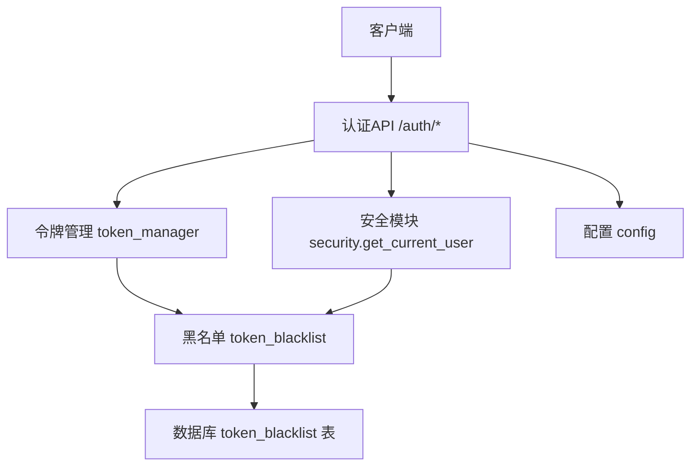
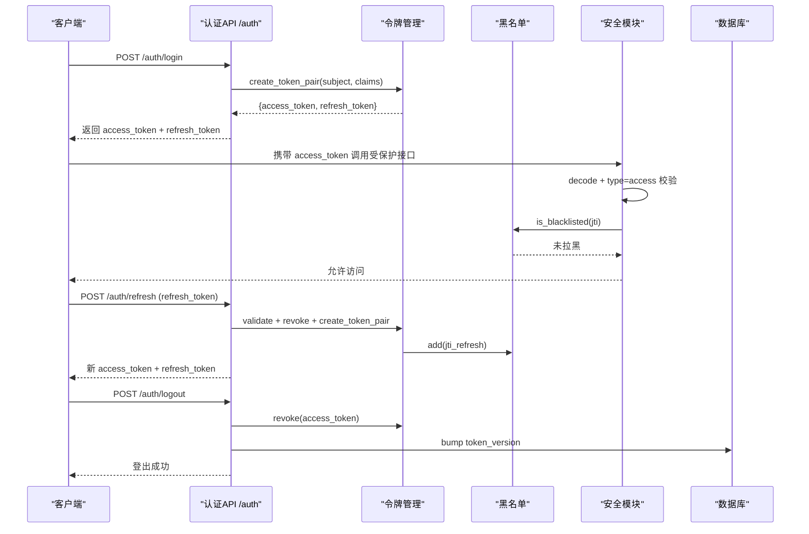
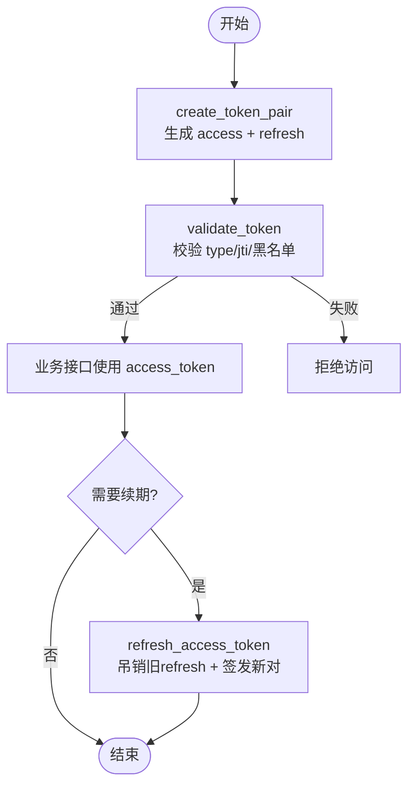
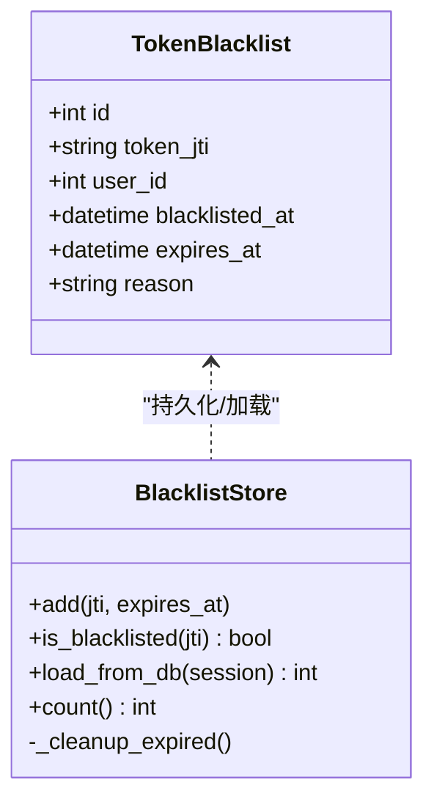
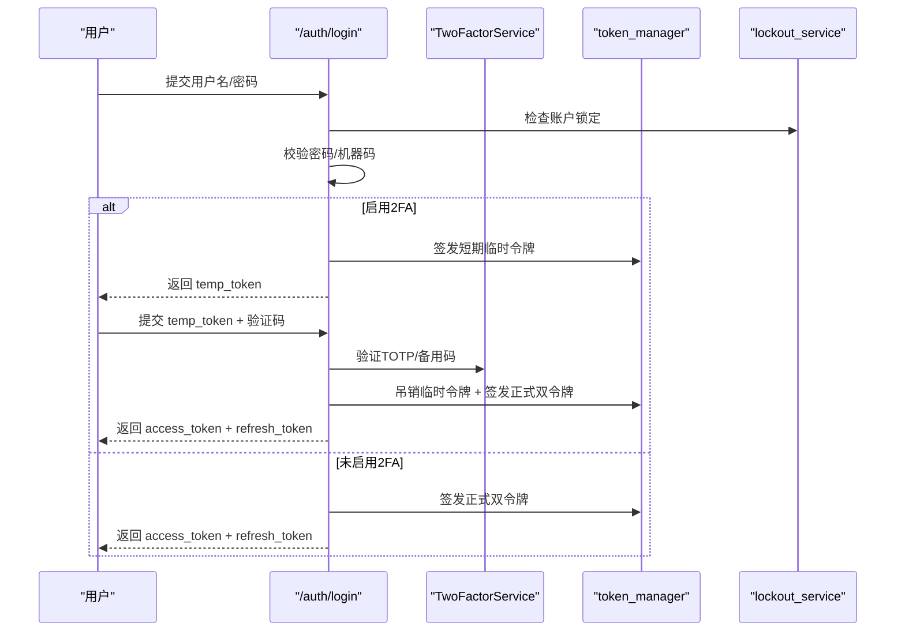
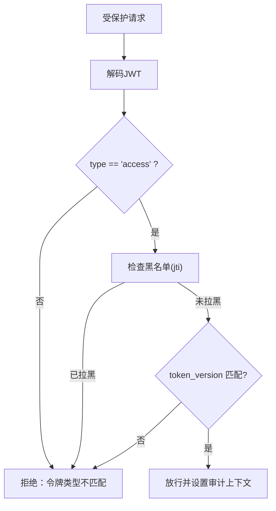
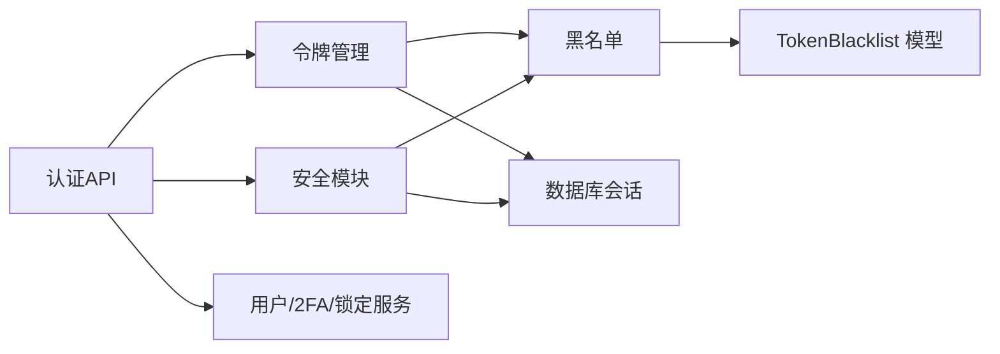

# 会话生命周期管理

<cite>
**本文引用的文件**
- [token_manager.py](file://backend/app/core/token_manager.py)
- [token_blacklist.py](file://backend/app/core/token_blacklist.py)
- [auth.py](file://backend/app/api/v1/auth/auth.py)
- [security.py](file://backend/app/core/security.py)
- [config.py](file://backend/app/core/config.py)
- [token_blacklist_model.py](file://backend/app/models/token_blacklist.py)
- [auth_schemas.py](file://backend/app/schemas/auth.py)
</cite>

## 目录
1. [简介](#简介)
2. [项目结构](#项目结构)
3. [核心组件](#核心组件)
4. [架构总览](#架构总览)
5. [详细组件分析](#详细组件分析)
6. [依赖关系分析](#依赖关系分析)
7. [性能与可扩展性](#性能与可扩展性)
8. [故障排查指南](#故障排查指南)
9. [结论](#结论)
10. [附录：配置与示例](#附录：配置与示例)

## 简介
本技术文档围绕“会话生命周期管理”展开，覆盖从用户登录到登出、令牌刷新、并发控制、超时处理、黑名单吊销以及监控统计等全链路能力。系统采用双令牌（access_token + refresh_token）机制，结合内存+数据库的令牌黑名单实现即时失效；通过 token_version 支持强制下线所有会话；通过速率限制与账户锁定策略抵御暴力破解；并通过中间件与指标接口提供可观测性。

## 项目结构
与会话生命周期相关的核心代码主要分布在以下模块：
- 认证API层：负责登录、2FA验证、刷新、登出等流程编排
- 令牌管理层：封装JWT生成、校验、吊销、刷新
- 黑名单管理：内存缓存+数据库持久化，保证跨进程/重启后的吊销一致性
- 安全与鉴权：统一解码、类型校验、黑名单检查、token_version 校验
- 配置中心：令牌有效期、锁定时长、CORS、CSRF、速率限制开关等

图表来源
- [auth.py:101-287](file://backend/app/api/v1/auth/auth.py#L101-L287)
- [token_manager.py:64-127](file://backend/app/core/token_manager.py#L64-L127)
- [token_blacklist.py:27-70](file://backend/app/core/token_blacklist.py#L27-L70)
- [security.py:243-336](file://backend/app/core/security.py#L243-L336)
- [config.py:126-134](file://backend/app/core/config.py#L126-L134)

章节来源
- [auth.py:101-287](file://backend/app/api/v1/auth/auth.py#L101-L287)
- [token_manager.py:64-127](file://backend/app/core/token_manager.py#L64-L127)
- [token_blacklist.py:27-70](file://backend/app/core/token_blacklist.py#L27-L70)
- [security.py:243-336](file://backend/app/core/security.py#L243-L336)
- [config.py:126-134](file://backend/app/core/config.py#L126-L134)

## 核心组件
- 令牌管理器（TokenManager）：提供创建双令牌、校验、吊销、刷新等原子能力，并集成黑名单检查与持久化。
- 黑名单（TokenBlacklist）：内存集合+数据库持久化，支持过期清理与加载，保障重启后仍有效。
- 认证API（/auth）：登录、2FA、刷新、登出、获取当前用户、CSRF等端点。
- 安全模块（Security）：统一JWT编解码、类型校验、黑名单检查、token_version 校验、速率限制、IP提取。
- 配置（Config）：令牌有效期、密码策略、锁定时长、CORS/CSRF、速率限制开关等。

章节来源
- [token_manager.py:64-283](file://backend/app/core/token_manager.py#L64-L283)
- [token_blacklist.py:27-163](file://backend/app/core/token_blacklist.py#L27-L163)
- [auth.py:101-747](file://backend/app/api/v1/auth/auth.py#L101-L747)
- [security.py:210-336](file://backend/app/core/security.py#L210-L336)
- [config.py:126-159](file://backend/app/core/config.py#L126-L159)

## 架构总览
下图展示了会话生命周期的关键交互：登录签发双令牌、访问时校验、刷新轮换、登出吊销与版本升级、黑名单拦截。

图表来源
- [auth.py:101-287](file://backend/app/api/v1/auth/auth.py#L101-L287)
- [auth.py:594-689](file://backend/app/api/v1/auth/auth.py#L594-L689)
- [auth.py:570-591](file://backend/app/api/v1/auth/auth.py#L570-L591)
- [token_manager.py:64-127](file://backend/app/core/token_manager.py#L64-L127)
- [token_manager.py:176-240](file://backend/app/core/token_manager.py#L176-L240)
- [security.py:243-336](file://backend/app/core/security.py#L243-L336)
- [token_blacklist.py:27-70](file://backend/app/core/token_blacklist.py#L27-L70)

## 详细组件分析

### 令牌管理与JWT生成
- 双令牌签发：access_token 短效用于接口鉴权，refresh_token 长效用于无感续期；两者均包含 jti、type、iat、exp 等声明。
- 令牌校验：decode 后校验 type 必须为 access，并检查黑名单；失败则拒绝。
- 令牌吊销：将 jti 加入内存黑名单，并异步持久化至数据库，确保重启后仍生效。
- 令牌刷新：仅接受 refresh_token，成功后立即吊销旧 refresh_token（轮换），并签发新的 access + refresh 对。

图表来源
- [token_manager.py:64-127](file://backend/app/core/token_manager.py#L64-L127)
- [token_manager.py:135-168](file://backend/app/core/token_manager.py#L135-L168)
- [token_manager.py:176-240](file://backend/app/core/token_manager.py#L176-L240)

章节来源
- [token_manager.py:64-240](file://backend/app/core/token_manager.py#L64-L240)

### 黑名单与持久化
- 内存黑名单：以 jti 为键，存储过期时间戳；每次写入或查询时清理过期项，避免内存泄漏。
- 数据库持久化：登出/吊销时将 jti、原因、原始 exp、user_id 写入表，启动时可加载未过期条目到内存。
- 并发安全：使用线程锁保护读写，防止高并发下状态不一致。

图表来源
- [token_blacklist_model.py:13-61](file://backend/app/models/token_blacklist.py#L13-L61)
- [token_blacklist.py:27-163](file://backend/app/core/token_blacklist.py#L27-L163)

章节来源
- [token_blacklist.py:27-163](file://backend/app/core/token_blacklist.py#L27-L163)
- [token_blacklist_model.py:13-61](file://backend/app/models/token_blacklist.py#L13-L61)

### 认证API流程（登录、2FA、刷新、登出）
- 登录：校验用户名/密码、机器码绑定、账户锁定状态；若启用2FA，返回临时令牌（短TTL），需二次验证换取正式令牌。
- 2FA验证：校验临时令牌与TOTP/备用码，通过后吊销临时令牌并签发正式双令牌。
- 刷新：仅接受 refresh_token，校验后吊销旧令牌并签发新对。
- 登出：吊销请求中的 access_token（及可选 refresh_token），并递增 token_version 使该用户全部现存JWT立即失效。

图表来源
- [auth.py:101-287](file://backend/app/api/v1/auth/auth.py#L101-L287)
- [auth.py:290-444](file://backend/app/api/v1/auth/auth.py#L290-L444)

章节来源
- [auth.py:101-444](file://backend/app/api/v1/auth/auth.py#L101-L444)

### 访问鉴权与token_version
- 统一入口 get_current_user：解码JWT、校验 type=access、检查黑名单、校验 token_version 与用户当前版本一致，否则拒绝。
- 审计归因：解析成功后设置上下文变量，便于后续写操作审计追踪。

图表来源
- [security.py:243-336](file://backend/app/core/security.py#L243-L336)

章节来源
- [security.py:243-336](file://backend/app/core/security.py#L243-L336)

### 会话状态管理：有效期、自动续期、并发登录限制
- 有效期控制：access_token 默认8小时，refresh_token 默认30天，可通过配置调整。
- 自动续期：前端在 access_token 接近过期时调用 /auth/refresh，使用 refresh_token 轮换获得新对。
- 并发登录限制：通过账户锁定策略（连续失败次数阈值与锁定时长）与机器码绑定限制非法并发；登出时通过 token_version 强制下线所有会话。

章节来源
- [config.py:126-134](file://backend/app/core/config.py#L126-L134)
- [auth.py:594-689](file://backend/app/api/v1/auth/auth.py#L594-L689)
- [auth.py:570-591](file://backend/app/api/v1/auth/auth.py#L570-L591)

### 会话超时处理：空闲超时、绝对超时、优雅降级
- 绝对超时：access_token/exp 由JWT自身控制，过期即不可用；refresh_token/exp 同理。
- 空闲超时：当前实现未内置基于请求频率的空闲超时检测；可通过网关或中间件扩展实现。
- 优雅降级：黑名单持久化失败不影响主流程；登出时即使无法解析用户信息也会尽力吊销令牌。

章节来源
- [token_manager.py:135-168](file://backend/app/core/token_manager.py#L135-L168)
- [token_blacklist.py:133-163](file://backend/app/core/token_blacklist.py#L133-L163)
- [auth.py:570-591](file://backend/app/api/v1/auth/auth.py#L570-L591)

### 监控与统计：活跃会话数、性能指标
- 活跃会话数：可通过黑名单计数近似评估被吊销令牌规模；活跃会话数建议结合业务侧会话存储（如Redis）进行统计。
- 性能指标：系统提供 metrics 相关中间件与API，可用于采集QPS、延迟等指标；认证相关日志记录登录/登出事件，便于审计与排障。

章节来源
- [token_blacklist.py:111-114](file://backend/app/core/token_blacklist.py#L111-L114)
- [auth.py:524-537](file://backend/app/api/v1/auth/auth.py#L524-L537)

## 依赖关系分析
- 认证API依赖令牌管理、安全模块、服务层（用户、2FA、锁定）、审计日志。
- 令牌管理依赖安全模块（密钥/算法）、黑名单模块、数据库会话（持久化）。
- 安全模块依赖黑名单、数据库会话（用户查询）、配置（密钥/算法）。
- 黑名单依赖模型（TokenBlacklist）与数据库会话（加载/写入）。

图表来源
- [auth.py:101-747](file://backend/app/api/v1/auth/auth.py#L101-L747)
- [token_manager.py:64-283](file://backend/app/core/token_manager.py#L64-L283)
- [security.py:210-336](file://backend/app/core/security.py#L210-L336)
- [token_blacklist.py:27-163](file://backend/app/core/token_blacklist.py#L27-L163)
- [token_blacklist_model.py:13-61](file://backend/app/models/token_blacklist.py#L13-L61)

章节来源
- [auth.py:101-747](file://backend/app/api/v1/auth/auth.py#L101-L747)
- [token_manager.py:64-283](file://backend/app/core/token_manager.py#L64-L283)
- [security.py:210-336](file://backend/app/core/security.py#L210-L336)
- [token_blacklist.py:27-163](file://backend/app/core/token_blacklist.py#L27-L163)
- [token_blacklist_model.py:13-61](file://backend/app/models/token_blacklist.py#L13-L61)

## 性能与可扩展性
- 黑名单内存结构为哈希表，查找/插入复杂度 O(1)，定期清理过期项避免增长。
- JWT 编解码为 CPU 密集型但开销较小；在高并发场景建议配合连接池与缓存优化。
- 可扩展点：
  - 空闲超时：可在网关或中间件层基于最近访问时间做滑动窗口判断。
  - 活跃会话统计：引入 Redis 维护用户会话映射（user -> sessions），提供实时统计与批量踢人能力。
  - 分布式黑名单：将内存黑名单替换为 Redis Set，支持多实例共享。

[本节为通用指导，无需具体文件引用]

## 故障排查指南
- 令牌无效/过期：检查 access_token/exp、refresh_token/exp；确认未被加入黑名单；核对 token_version 是否匹配。
- 登录频繁失败：查看速率限制与账户锁定策略；确认 IP 限流键是否正确。
- 登出后仍可访问：确认黑名单是否持久化成功；检查 get_current_user 是否执行了黑名单与 token_version 校验。
- 2FA 流程异常：确认临时令牌是否短TTL且已被吊销；验证 TOTP/备用码逻辑。

章节来源
- [security.py:243-336](file://backend/app/core/security.py#L243-L336)
- [token_manager.py:135-240](file://backend/app/core/token_manager.py#L135-L240)
- [auth.py:101-444](file://backend/app/api/v1/auth/auth.py#L101-L444)
- [token_blacklist.py:27-163](file://backend/app/core/token_blacklist.py#L27-L163)

## 结论
本系统通过双令牌机制、黑名单持久化、token_version 强制下线、速率限制与账户锁定，构建了完整的会话生命周期管理能力。结合安全模块的统一鉴权入口与审计日志，实现了高安全、可观测、易运维的认证体系。未来可在空闲超时、活跃会话统计、分布式黑名单等方面进一步增强。

[本节为总结，无需具体文件引用]

## 附录：配置与示例
- 令牌有效期
  - ACCESS_TOKEN_EXPIRE_MINUTES：访问令牌有效期（分钟），默认 480（8小时）
  - REFRESH_TOKEN_EXPIRE_DAYS：刷新令牌有效期（天），默认 30
- 安全策略
  - PASSWORD_EXPIRE_DAYS：密码有效期（天）
  - MAX_FAILED_LOGIN_ATTEMPTS：最大登录失败次数
  - ACCOUNT_LOCKOUT_MINUTES：账户锁定时长（分钟）
- CSRF 与 CORS
  - CSRF_ENABLED：是否启用CSRF保护
  - CORS_ORINS/CORS_ALLOW_HEADERS：跨域白名单与允许头
- 速率限制
  - RATE_LIMIT_ENABLED：是否启用全局速率限制
  - RATE_LIMIT_PER_MINUTE/HOUR：每分钟/每小时上限

章节来源
- [config.py:126-159](file://backend/app/core/config.py#L126-L159)