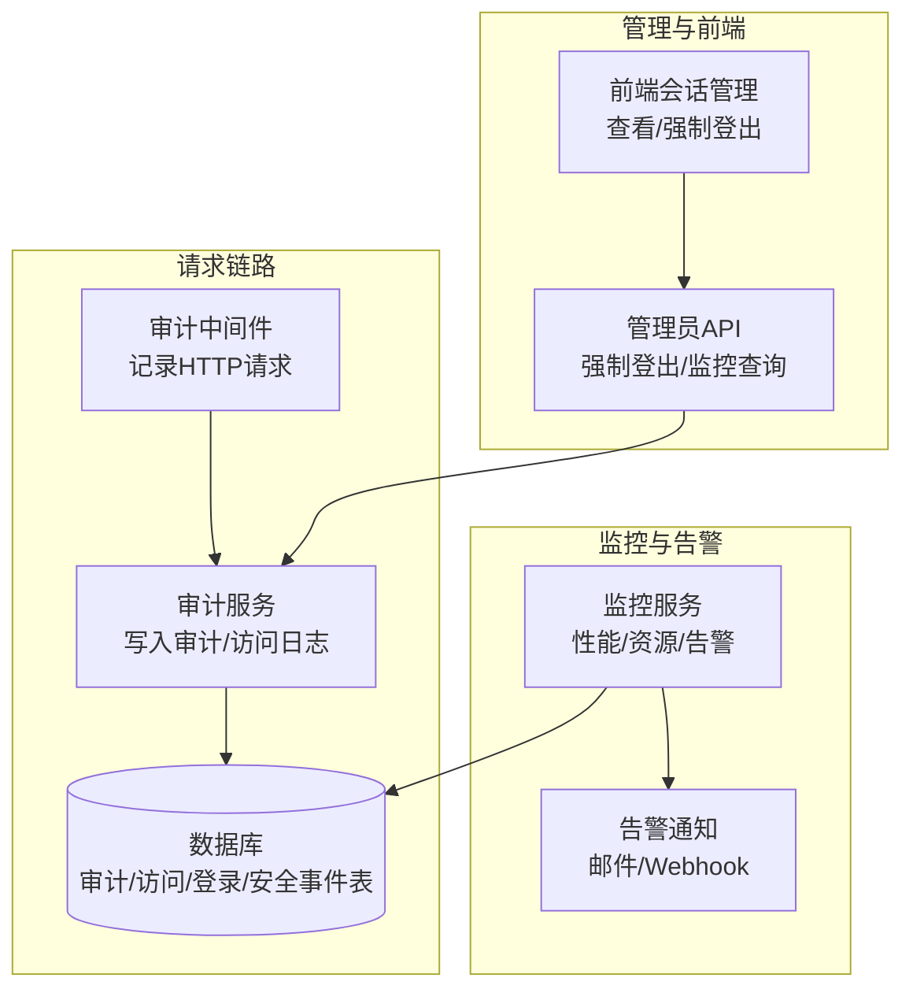
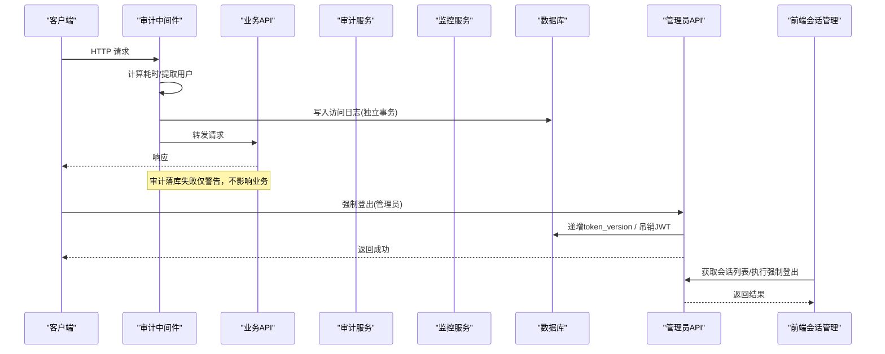
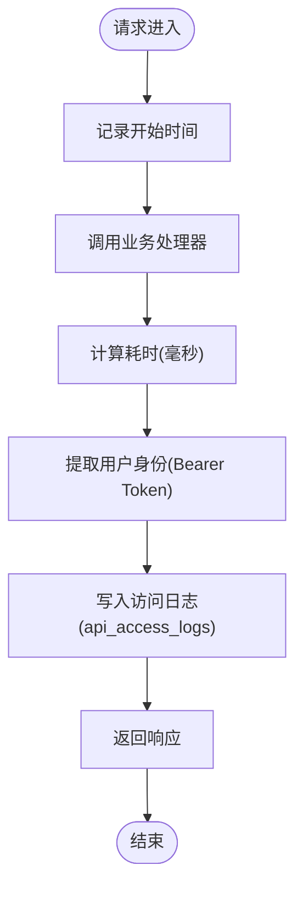
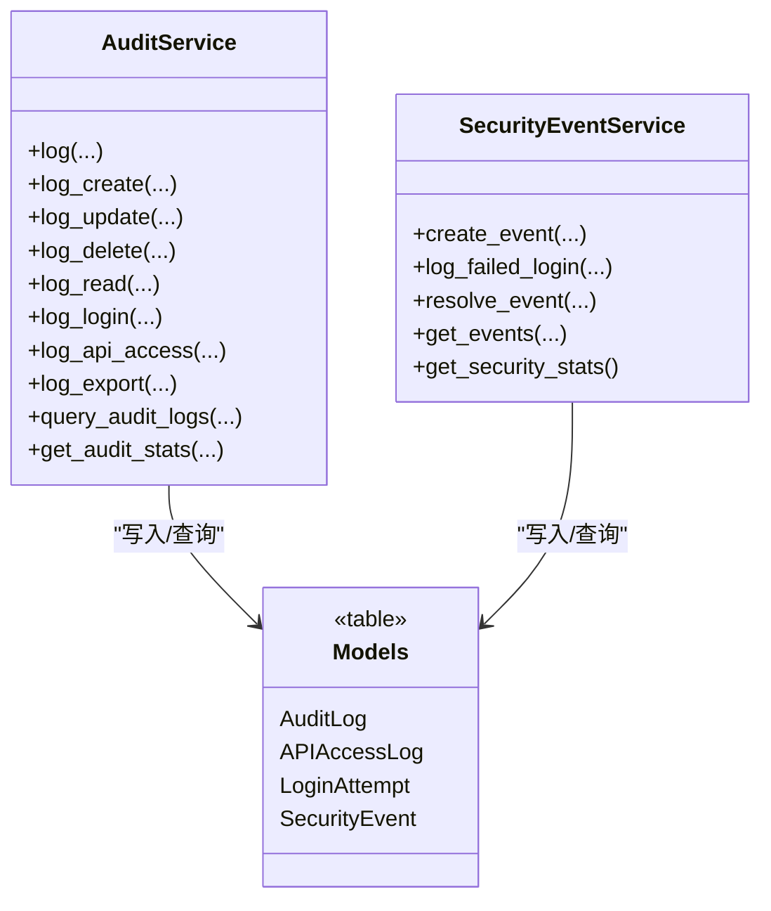
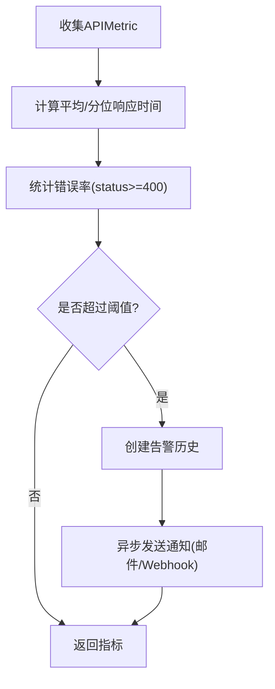
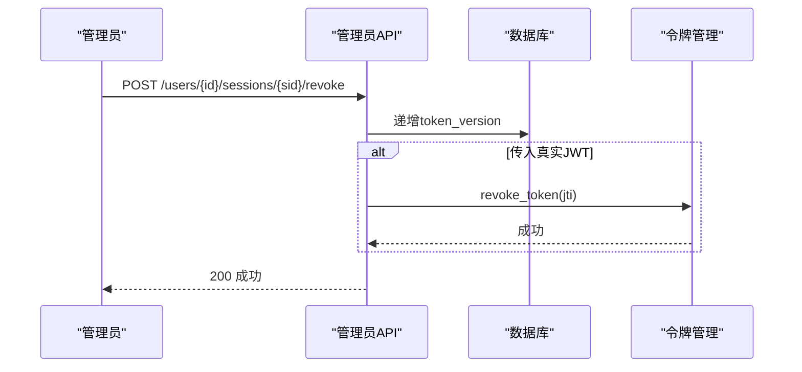
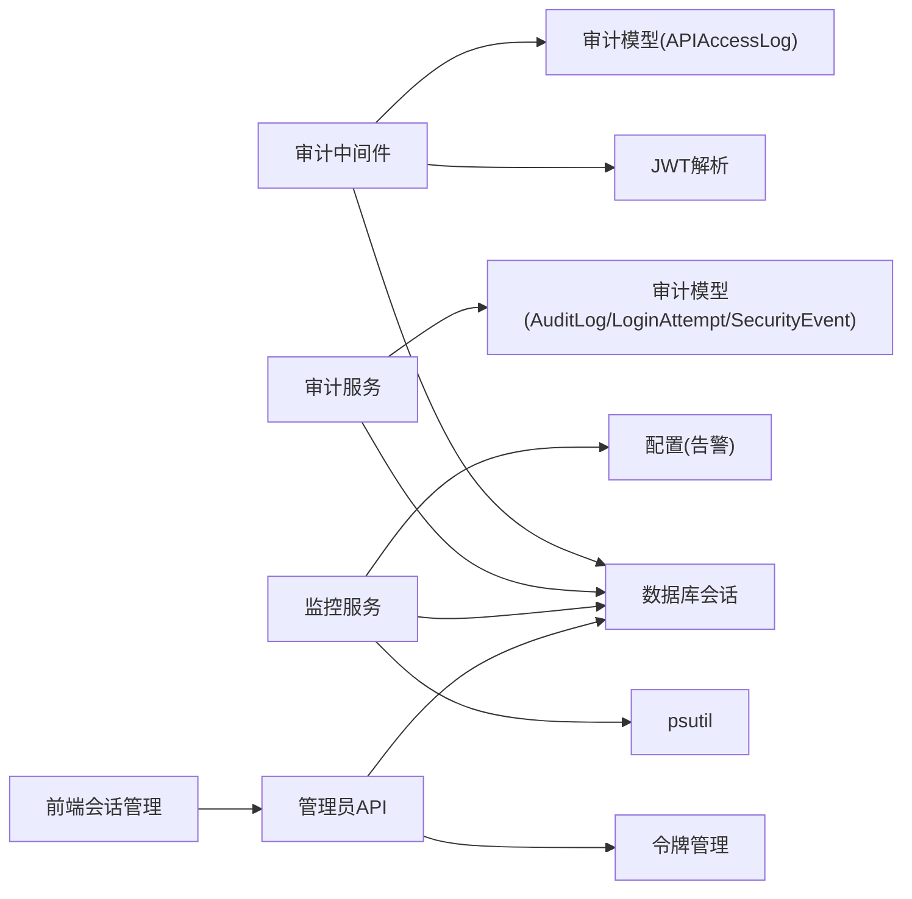

# 会话监控与审计

<cite>
**本文引用的文件**
- [backend/app/core/audit_middleware.py](file://backend/app/core/audit_middleware.py)
- [backend/app/services/audit_service.py](file://backend/app/services/audit_service.py)
- [backend/app/models/audit.py](file://backend/app/models/audit.py)
- [backend/app/services/monitoring_service.py](file://backend/app/services/monitoring_service.py)
- [backend/app/api/v1/system/admin.py](file://backend/app/api/v1/system/admin.py)
- [backend/app/api/v1/monitoring_legacy.py](file://backend/app/api/v1/monitoring_legacy.py)
- [frontend/src/views/system/UserManagement.vue](file://frontend/src/views/system/UserManagement.vue)
</cite>

## 目录
1. [简介](#简介)
2. [项目结构](#项目结构)
3. [核心组件](#核心组件)
4. [架构总览](#架构总览)
5. [详细组件分析](#详细组件分析)
6. [依赖关系分析](#依赖关系分析)
7. [性能考量](#性能考量)
8. [故障排查指南](#故障排查指南)
9. [结论](#结论)
10. [附录](#附录)

## 简介
本运维文档面向“会话监控与审计”能力，覆盖以下方面：
- 会话活动监控：登录事件记录、操作行为追踪、异常行为检测。
- 会话审计日志系统：日志格式规范、存储策略、查询接口。
- 会话性能监控指标：响应时间统计、资源使用监控、错误率分析。
- 会话安全告警机制：暴力破解检测、异常IP识别、可疑行为预警。
- 会话管理工具：在线用户查看、强制下线、批量操作等运维操作。
- 可视化展示与报表：前端面板、后端聚合指标、导出与对接Prometheus。
- 故障排查与优化建议：常见问题定位与性能调优。

## 项目结构
围绕会话监控与审计的关键代码分布在以下模块：
- 中间件层：请求级审计落库、耗时统计、用户身份提取。
- 服务层：审计日志写入、登录尝试与安全事件记录、性能指标聚合、告警规则检查。
- 数据模型层：审计日志、访问日志、登录尝试、安全事件、API指标等表结构。
- API层：管理员权限的监控查询、强制登出等运维接口。
- 前端界面：活跃会话列表展示、强制登出操作、加载与错误提示。

图表来源
- [backend/app/core/audit_middleware.py:11-44](file://backend/app/core/audit_middleware.py#L11-L44)
- [backend/app/services/audit_service.py:62-106](file://backend/app/services/audit_service.py#L62-L106)
- [backend/app/services/monitoring_service.py:26-83](file://backend/app/services/monitoring_service.py#L26-L83)
- [backend/app/api/v1/system/admin.py:441-469](file://backend/app/api/v1/system/admin.py#L441-L469)
- [frontend/src/views/system/UserManagement.vue:304-334](file://frontend/src/views/system/UserManagement.vue#L304-L334)

章节来源
- [backend/app/core/audit_middleware.py:11-44](file://backend/app/core/audit_middleware.py#L11-L44)
- [backend/app/services/audit_service.py:62-106](file://backend/app/services/audit_service.py#L62-L106)
- [backend/app/services/monitoring_service.py:26-83](file://backend/app/services/monitoring_service.py#L26-L83)
- [backend/app/api/v1/system/admin.py:441-469](file://backend/app/api/v1/system/admin.py#L441-L469)
- [frontend/src/views/system/UserManagement.vue:304-334](file://frontend/src/views/system/UserManagement.vue#L304-L334)

## 核心组件
- 审计中间件：在每次HTTP请求后记录方法、路径、状态码、耗时与认证用户，并独立事务落库到访问日志表，失败不破坏业务。
- 审计服务：提供统一审计写入入口，支持登录成功/失败、通用CRUD、导出等动作；同时维护登录尝试与安全事件。
- 监控服务：聚合API性能（平均/分位响应时间、错误率）、端点统计、错误分布、系统资源使用；按规则触发告警并发送通知。
- 管理员API：提供强制登出（递增token版本或吊销具体JWT）与监控指标查询接口。
- 前端会话管理：展示活跃会话信息（会话ID、IP、设备、登录时间），支持一键强制登出。

章节来源
- [backend/app/core/audit_middleware.py:11-44](file://backend/app/core/audit_middleware.py#L11-L44)
- [backend/app/services/audit_service.py:168-229](file://backend/app/services/audit_service.py#L168-L229)
- [backend/app/services/monitoring_service.py:26-83](file://backend/app/services/monitoring_service.py#L26-L83)
- [backend/app/api/v1/system/admin.py:441-469](file://backend/app/api/v1/system/admin.py#L441-L469)
- [frontend/src/views/system/UserManagement.vue:304-334](file://frontend/src/views/system/UserManagement.vue#L304-L334)

## 架构总览
下图展示了从请求进入、审计记录、性能统计到告警触发的完整链路，以及管理员对会话的管控流程。

图表来源
- [backend/app/core/audit_middleware.py:18-44](file://backend/app/core/audit_middleware.py#L18-L44)
- [backend/app/api/v1/system/admin.py:441-469](file://backend/app/api/v1/system/admin.py#L441-L469)
- [frontend/src/views/system/UserManagement.vue:304-334](file://frontend/src/views/system/UserManagement.vue#L304-L334)

## 详细组件分析

### 审计中间件（请求级监控）
- 功能要点
  - 记录请求方法、路径、状态码、耗时（毫秒）。
  - 从Authorization头解析JWT，提取user_id与username用于审计。
  - 将本次请求写入api_access_logs表，使用独立短事务，失败仅写WARNING日志。
- 关键实现位置
  - 请求处理与耗时计算、用户身份提取、持久化落库。

图表来源
- [backend/app/core/audit_middleware.py:18-44](file://backend/app/core/audit_middleware.py#L18-L44)
- [backend/app/core/audit_middleware.py:46-77](file://backend/app/core/audit_middleware.py#L46-L77)
- [backend/app/core/audit_middleware.py:79-108](file://backend/app/core/audit_middleware.py#L79-L108)

章节来源
- [backend/app/core/audit_middleware.py:11-108](file://backend/app/core/audit_middleware.py#L11-L108)

### 审计服务（登录、操作、导出、查询）
- 功能要点
  - 统一审计写入：支持登录成功/失败、CRUD、导出等动作，附带上下文（用户、IP、UA、会话、追踪ID、请求路径与方法）。
  - 登录尝试记录：记录用户名、IP、UA、成功与否及失败原因。
  - 安全事件：记录未授权访问、暴力破解等安全事件，支持严重级别与解决流程。
  - 查询与统计：分页查询审计日志、按动作/状态/级别/时间范围过滤；生成统计卡片（今日操作、活跃用户、失败操作、警告数）。
- 关键实现位置
  - 通用log、登录log、API访问log、导出log、查询与统计、安全事件创建与查询。

图表来源
- [backend/app/services/audit_service.py:23-106](file://backend/app/services/audit_service.py#L23-L106)
- [backend/app/services/audit_service.py:168-229](file://backend/app/services/audit_service.py#L168-L229)
- [backend/app/services/audit_service.py:379-510](file://backend/app/services/audit_service.py#L379-L510)
- [backend/app/models/audit.py:53-205](file://backend/app/models/audit.py#L53-L205)

章节来源
- [backend/app/services/audit_service.py:62-106](file://backend/app/services/audit_service.py#L62-L106)
- [backend/app/services/audit_service.py:168-229](file://backend/app/services/audit_service.py#L168-L229)
- [backend/app/services/audit_service.py:379-510](file://backend/app/services/audit_service.py#L379-L510)
- [backend/app/models/audit.py:53-205](file://backend/app/models/audit.py#L53-L205)

### 监控服务（性能、资源、告警）
- 功能要点
  - API性能统计：总请求数、平均响应时间、P50/P95/P99、错误率。
  - 端点统计：按端点分组统计请求量、平均耗时、错误数与错误率。
  - 错误统计：按状态码分组统计错误数量。
  - 资源监控：CPU、内存、磁盘使用率与容量。
  - 告警规则：基于响应时间、错误率、资源使用率阈值触发告警，记录历史并异步发送通知（邮件/Webhook）。
- 关键实现位置
  - 性能统计、端点统计、错误统计、资源统计、告警检查与触发。

图表来源
- [backend/app/services/monitoring_service.py:26-83](file://backend/app/services/monitoring_service.py#L26-L83)
- [backend/app/services/monitoring_service.py:130-181](file://backend/app/services/monitoring_service.py#L130-L181)
- [backend/app/services/monitoring_service.py:184-312](file://backend/app/services/monitoring_service.py#L184-L312)

章节来源
- [backend/app/services/monitoring_service.py:26-83](file://backend/app/services/monitoring_service.py#L26-L83)
- [backend/app/services/monitoring_service.py:130-181](file://backend/app/services/monitoring_service.py#L130-L181)
- [backend/app/services/monitoring_service.py:184-312](file://backend/app/services/monitoring_service.py#L184-L312)

### 管理员API（会话强制下线与监控查询）
- 功能要点
  - 强制登出：通过递增用户的token_version使所有现存令牌失效；若传入真实JWT则额外按jti吊销。
  - 监控查询：提供API性能、端点统计、错误统计、资源统计等管理员接口（需管理员权限）。
- 关键实现位置
  - 强制登出接口、监控指标查询接口。

图表来源
- [backend/app/api/v1/system/admin.py:441-469](file://backend/app/api/v1/system/admin.py#L441-L469)
- [backend/app/api/v1/monitoring_legacy.py:18-52](file://backend/app/api/v1/monitoring_legacy.py#L18-L52)

章节来源
- [backend/app/api/v1/system/admin.py:441-469](file://backend/app/api/v1/system/admin.py#L441-L469)
- [backend/app/api/v1/monitoring_legacy.py:18-52](file://backend/app/api/v1/monitoring_legacy.py#L18-L52)

### 前端会话管理（在线用户查看与强制下线）
- 功能要点
  - 展示活跃会话：会话ID、IP地址、设备信息、登录时间。
  - 强制登出：点击按钮调用后端接口，成功后刷新列表并提示。
  - 错误处理：网络异常或服务异常时给出友好提示。
- 关键实现位置
  - 会话表格渲染、强制登出按钮与回调、加载与错误提示。

章节来源
- [frontend/src/views/system/UserManagement.vue:304-334](file://frontend/src/views/system/UserManagement.vue#L304-L334)

## 依赖关系分析
- 中间件依赖：JWT解析、数据库会话、审计模型。
- 服务依赖：SQLAlchemy查询、psutil资源监控、异步任务与线程池、配置项（告警收件人、Webhook）。
- API依赖：管理员权限校验、数据库会话、令牌管理服务。
- 前端依赖：Element Plus组件、API调用封装、错误消息提示。

图表来源
- [backend/app/core/audit_middleware.py:46-77](file://backend/app/core/audit_middleware.py#L46-L77)
- [backend/app/services/audit_service.py:62-106](file://backend/app/services/audit_service.py#L62-L106)
- [backend/app/services/monitoring_service.py:157-181](file://backend/app/services/monitoring_service.py#L157-L181)
- [backend/app/api/v1/system/admin.py:441-469](file://backend/app/api/v1/system/admin.py#L441-L469)

章节来源
- [backend/app/core/audit_middleware.py:46-77](file://backend/app/core/audit_middleware.py#L46-L77)
- [backend/app/services/audit_service.py:62-106](file://backend/app/services/audit_service.py#L62-L106)
- [backend/app/services/monitoring_service.py:157-181](file://backend/app/services/monitoring_service.py#L157-L181)
- [backend/app/api/v1/system/admin.py:441-469](file://backend/app/api/v1/system/admin.py#L441-L469)

## 性能考量
- 审计落库隔离：中间件使用独立短事务写入访问日志，避免影响主业务请求。
- 统计聚合优化：监控服务按时间窗口聚合APIMetric，减少全表扫描；必要时增加索引与分区。
- 告警异步化：告警通知通过后台任务或线程池发送，不阻塞主流程。
- 前端交互体验：会话列表加载与操作采用loading与错误提示，提升可观测性与可用性。

[本节为通用指导，无需特定文件引用]

## 故障排查指南
- 审计日志未写入
  - 现象：访问日志缺失或频繁警告。
  - 排查：检查中间件落库异常日志；确认数据库连接与权限；验证APIAccessLog表结构与索引。
  - 参考：中间件落库失败仅记录WARNING，不影响业务。
- 强制登出不生效
  - 现象：用户仍可访问。
  - 排查：确认token_version已递增；如传入了JWT，检查是否按jti吊销；验证鉴权逻辑是否读取最新token_version。
  - 参考：管理员接口递增token_version并可选吊销JWT。
- 告警未触发
  - 现象：阈值超限但未收到通知。
  - 排查：检查告警规则是否启用；确认APIMetric数据是否按时写入；验证邮件/Webhook配置；查看告警历史是否重复抑制。
  - 参考：监控服务规则检查与通知发送。
- 前端会话列表为空或报错
  - 现象：无会话数据或显示错误提示。
  - 排查：检查后端会话接口是否可用；确认当前用户上下文；查看网络请求与错误消息。
  - 参考：前端会话管理组件的错误处理分支。

章节来源
- [backend/app/core/audit_middleware.py:79-108](file://backend/app/core/audit_middleware.py#L79-L108)
- [backend/app/api/v1/system/admin.py:441-469](file://backend/app/api/v1/system/admin.py#L441-L469)
- [backend/app/services/monitoring_service.py:184-312](file://backend/app/services/monitoring_service.py#L184-L312)
- [frontend/src/views/system/UserManagement.vue:304-334](file://frontend/src/views/system/UserManagement.vue#L304-L334)

## 结论
本系统通过中间件与服务层的协同，实现了完整的会话监控与审计能力：
- 请求级审计与访问日志保障可追溯性。
- 登录尝试与安全事件支撑异常行为检测与处置。
- 性能与资源监控结合告警规则，形成闭环的运维保障。
- 管理员API与前端界面提供便捷的会话管理能力。
建议在生产环境持续完善索引、归档策略与告警通道，确保高可用与可观测性。

[本节为总结，无需特定文件引用]

## 附录

### 审计日志格式规范（字段说明）
- 审计日志（AuditLog）
  - 用户标识：user_id、username、user_ip、user_agent
  - 操作信息：action、resource_type、resource_id、old_value、new_value
  - 状态与级别：status、level、error_message
  - 请求上下文：request_path、request_method、response_status、duration_ms
  - 扩展字段：metadata_、session_id、trace_id
  - 时间戳：created_at
- 访问日志（APIAccessLog）
  - 用户标识：user_id、username
  - 请求信息：endpoint、method、request_params、request_body
  - 响应信息：response_status、response_time_ms
  - 客户端信息：ip_address、user_agent
  - 会话标识：session_id
  - 时间戳：created_at
- 登录尝试（LoginAttempt）
  - 用户与客户端：username、ip_address、user_agent
  - 结果：success、failure_reason
  - 时间戳：attempt_time
- 安全事件（SecurityEvent）
  - 事件类型与严重级别：event_type、severity
  - 来源与用户：source_ip、user_id、username
  - 描述与详情：description、details、affected_resources
  - 解决信息：resolved、resolved_at、resolved_by、resolution_notes
  - 时间戳：created_at

章节来源
- [backend/app/models/audit.py:53-205](file://backend/app/models/audit.py#L53-L205)

### 查询接口与统计能力
- 审计日志查询：支持按用户、动作、资源类型、时间范围、状态、级别分页查询。
- 审计统计：按动作/状态/级别聚合，Top用户、最近活动、今日操作、活跃用户、失败操作、警告数。
- 安全事件查询：按严重级别、事件类型、解决状态、时间范围分页查询；提供安全统计（总数、未解决数、按级别分布、最近事件）。
- 性能监控：API性能（总请求、平均/分位响应时间、错误率）、端点统计、错误统计、资源统计。

章节来源
- [backend/app/services/audit_service.py:275-376](file://backend/app/services/audit_service.py#L275-L376)
- [backend/app/services/audit_service.py:455-510](file://backend/app/services/audit_service.py#L455-L510)
- [backend/app/services/monitoring_service.py:26-83](file://backend/app/services/monitoring_service.py#L26-L83)
- [backend/app/services/monitoring_service.py:85-181](file://backend/app/services/monitoring_service.py#L85-L181)

### 会话管理工具（运维操作）
- 在线用户查看：前端会话列表展示会话ID、IP、设备、登录时间。
- 强制下线：管理员调用接口递增token_version或吊销JWT，立即使会话失效。
- 批量操作：可通过脚本或管理界面批量吊销令牌或调整用户token_version。

章节来源
- [frontend/src/views/system/UserManagement.vue:304-334](file://frontend/src/views/system/UserManagement.vue#L304-L334)
- [backend/app/api/v1/system/admin.py:441-469](file://backend/app/api/v1/system/admin.py#L441-L469)