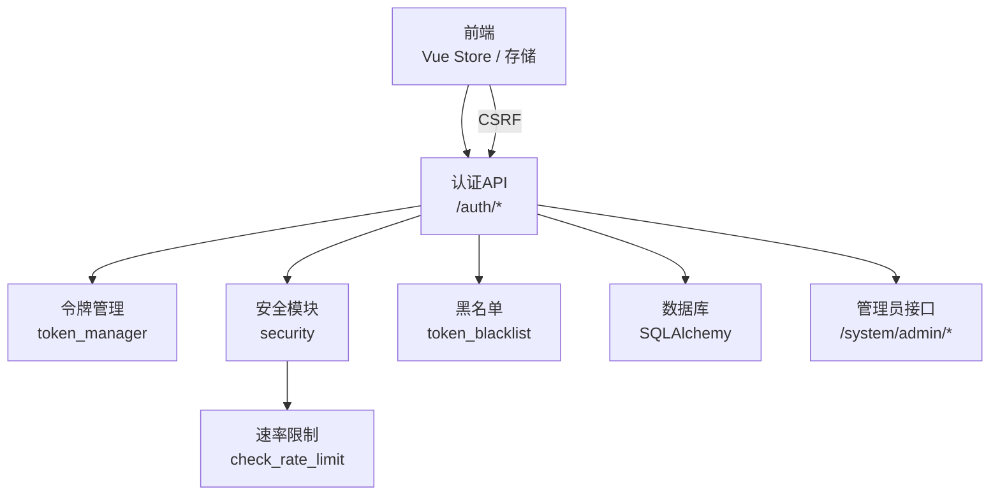
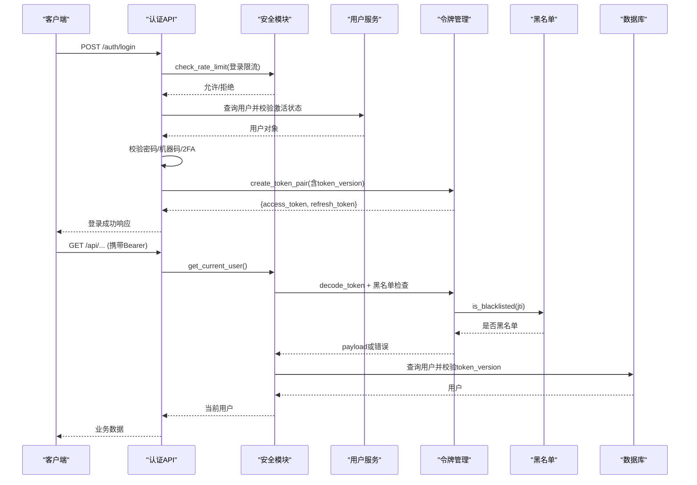
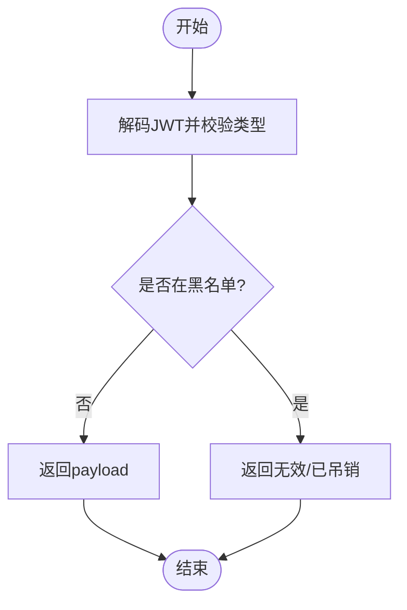
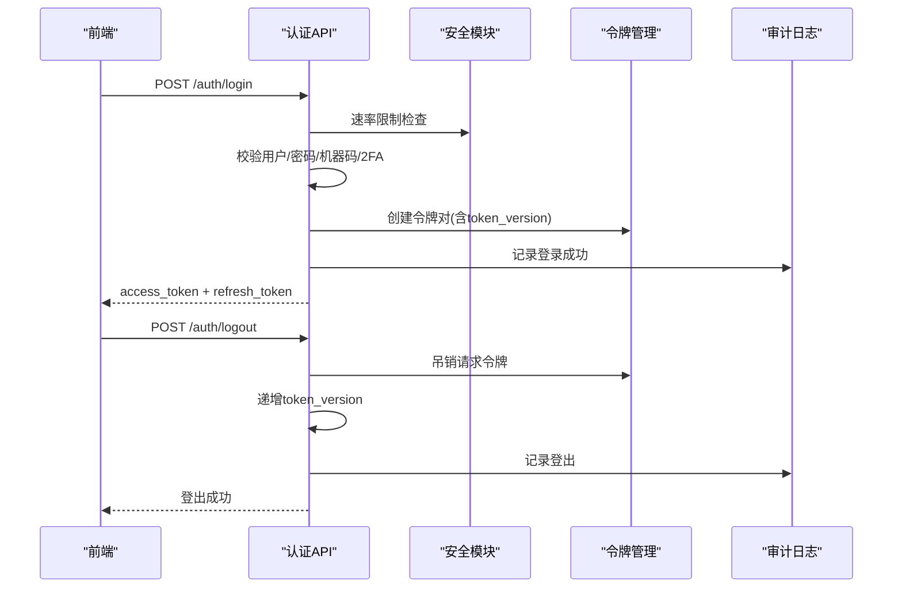
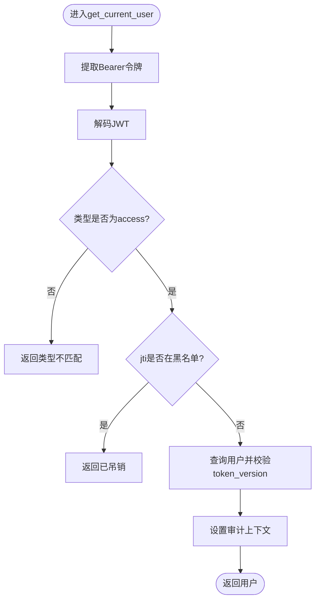
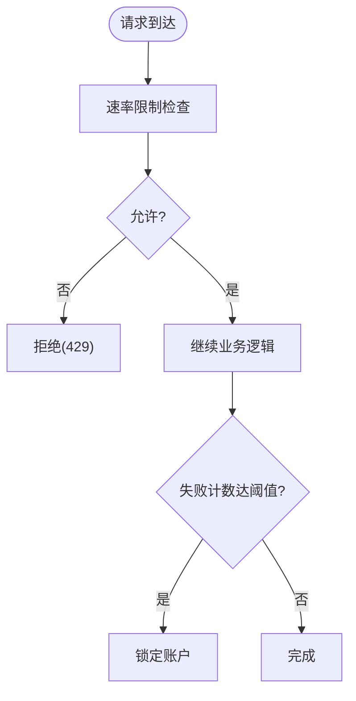
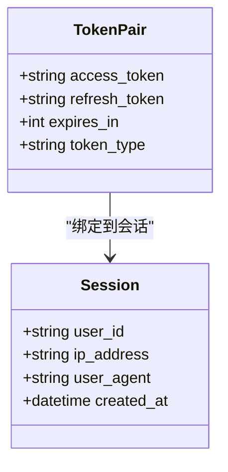
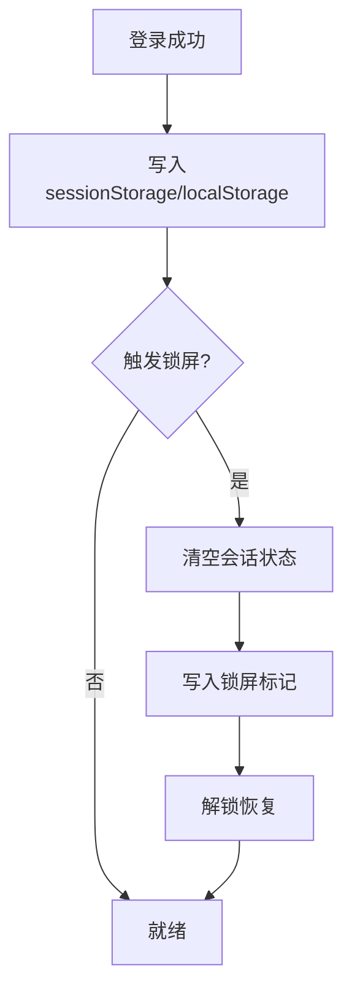
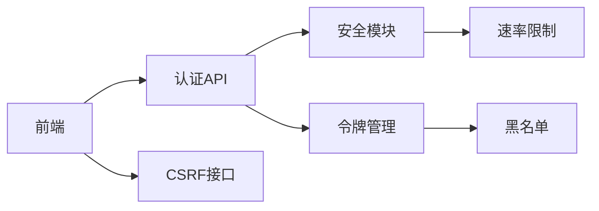

# 会话管理机制

<cite>
**本文引用的文件**
- [token_manager.py](file://backend/app/core/token_manager.py)
- [security.py](file://backend/app/core/security.py)
- [auth.py](file://backend/app/api/v1/auth/auth.py)
- [admin.py](file://backend/app/api/v1/system/admin.py)
- [redis_adapter.py](file://backend/app/core/redis_adapter.py)
- [cache.py](file://backend/app/core/cache.py)
- [token_blacklist.py](file://backend/app/core/token_blacklist.py)
- [authStorage.ts](file://frontend/src/utils/authStorage.ts)
- [auth.ts](file://frontend/src/stores/auth.ts)
- [UserManagement.vue](file://frontend/src/views/system/UserManagement.vue)
</cite>

## 目录
1. [简介](#简介)
2. [项目结构](#项目结构)
3. [核心组件](#核心组件)
4. [架构总览](#架构总览)
5. [详细组件分析](#详细组件分析)
6. [依赖关系分析](#依赖关系分析)
7. [性能考量](#性能考量)
8. [故障排查指南](#故障排查指南)
9. [结论](#结论)
10. [附录](#附录)

## 简介
本文件面向“会话管理机制”的实现与运维，覆盖以下主题：
- 会话的创建、维护与销毁流程（登录、刷新、登出、强制下线）
- 会话状态管理、超时处理与并发控制
- 多设备登录支持（令牌标识、冲突检测、用户体验优化）
- 存储策略对比（内存、Redis、持久化黑名单）
- 安全配置（防劫持、防固定攻击、CSRF、速率限制、账户锁定）
- 监控与审计（登录日志、异常行为检测、管理员会话管理）

## 项目结构
后端采用 FastAPI + SQLAlchemy，认证与会话以 JWT 为核心，配合黑名单机制实现即时失效；前端使用 Vue Store 与本地存储管理访问令牌与用户信息。关键路径如下：
- 认证 API：登录、双因素验证、刷新、登出、获取 CSRF Token
- 令牌管理：生成、校验、吊销、刷新
- 安全中间件：鉴权依赖、速率限制、IP 提取、安全响应头
- 缓存与适配器：内存缓存、离线 Redis 适配器
- 管理员接口：查看用户活跃会话（当前为有限能力）

图表来源
- [auth.py:101-287](file://backend/app/api/v1/auth/auth.py#L101-L287)
- [token_manager.py:64-127](file://backend/app/core/token_manager.py#L64-L127)
- [security.py:243-336](file://backend/app/core/security.py#L243-L336)
- [admin.py:406-438](file://backend/app/api/v1/system/admin.py#L406-L438)

章节来源
- [auth.py:101-287](file://backend/app/api/v1/auth/auth.py#L101-L287)
- [security.py:243-336](file://backend/app/core/security.py#L243-L336)
- [admin.py:406-438](file://backend/app/api/v1/system/admin.py#L406-L438)

## 核心组件
- 令牌管理器：负责 access/refresh 令牌对生成、校验、吊销与刷新轮换
- 安全模块：提供鉴权依赖、密码策略、速率限制、IP 提取与安全头
- 认证 API：封装登录、2FA、刷新、登出等会话生命周期操作
- 黑名单：记录已吊销令牌 JTI，支持内存与数据库持久化
- 缓存与适配器：内存缓存与离线 Redis 适配器，用于统计与健康检查
- 前端存储与状态：统一存取 token、用户信息与刷新令牌，支持锁屏与会话清理

章节来源
- [token_manager.py:64-240](file://backend/app/core/token_manager.py#L64-L240)
- [security.py:243-336](file://backend/app/core/security.py#L243-L336)
- [auth.py:101-690](file://backend/app/api/v1/auth/auth.py#L101-L690)
- [redis_adapter.py:7-43](file://backend/app/core/redis_adapter.py#L7-L43)
- [cache.py:14-137](file://backend/app/core/cache.py#L14-L137)
- [authStorage.ts:54-110](file://frontend/src/utils/authStorage.ts#L54-L110)
- [auth.ts:93-130](file://frontend/src/stores/auth.ts#L93-L130)

## 架构总览
下图展示一次完整登录到资源访问的调用链，包含速率限制、2FA、令牌签发与鉴权依赖中的黑名单检查。

图表来源
- [auth.py:101-287](file://backend/app/api/v1/auth/auth.py#L101-L287)
- [security.py:243-336](file://backend/app/core/security.py#L243-L336)
- [token_manager.py:135-169](file://backend/app/core/token_manager.py#L135-L169)

## 详细组件分析

### 令牌管理与吊销（TokenManager）
- 令牌对创建：生成 access 与 refresh 令牌，附带 jti、type、exp、sub 及可选 extra_claims（如 token_version）
- 令牌校验：解码后检查类型匹配与黑名单，失败返回明确错误
- 令牌吊销：解析 jti 并加入黑名单，同时尝试持久化到数据库，确保重启后仍有效
- 令牌刷新：仅接受 refresh 类型，吊销旧 refresh 并签发新 pair，实现轮换

复杂度与性能
- 校验与吊销涉及 JWT 解码与黑名单查找，时间复杂度 O(1)~O(logN)（取决于黑名单实现）
- 黑名单持久化失败不影响主流程，保证可用性

图表来源
- [token_manager.py:135-169](file://backend/app/core/token_manager.py#L135-L169)
- [token_manager.py:176-210](file://backend/app/core/token_manager.py#L176-L210)

章节来源
- [token_manager.py:64-240](file://backend/app/core/token_manager.py#L64-L240)

### 认证API与会话生命周期
- 登录：速率限制 → 用户校验 → 密码/机器码/2FA → 签发令牌对（含 token_version）→ 审计日志
- 2FA：临时令牌短期有效，验证通过后吊销临时令牌并签发正式令牌对
- 刷新：严格校验 refresh 类型，吊销旧 refresh，签发新 pair
- 登出：尽力吊销请求携带的 access/refresh，递增 token_version 使该用户所有现存令牌立即失效，审计登出

并发与一致性
- 登录失败计数与锁定通过服务层原子更新，避免竞态
- 登出时 token_version 递增，后续鉴权在依赖中比对版本，实现全局会话失效

图表来源
- [auth.py:101-287](file://backend/app/api/v1/auth/auth.py#L101-L287)
- [auth.py:570-591](file://backend/app/api/v1/auth/auth.py#L570-L591)
- [auth.py:594-690](file://backend/app/api/v1/auth/auth.py#L594-L690)

章节来源
- [auth.py:101-690](file://backend/app/api/v1/auth/auth.py#L101-L690)

### 鉴权依赖与黑名单检查
- get_current_user：从 Bearer 提取令牌，解码后校验类型与黑名单，再查库比对 token_version，设置审计上下文
- 失败场景：未提供凭证、无效/过期、黑名单、类型不匹配、用户不存在、版本不匹配

图表来源
- [security.py:243-336](file://backend/app/core/security.py#L243-L336)

章节来源
- [security.py:243-336](file://backend/app/core/security.py#L243-L336)

### 速率限制与账户锁定
- 登录、注册、刷新、CSRF 均受速率限制保护，防止暴力破解与重放
- 登录失败次数达到阈值自动锁定账户，成功后重置计数与锁定状态

图表来源
- [security.py:439-488](file://backend/app/core/security.py#L439-L488)
- [auth.py:124-137](file://backend/app/api/v1/auth/auth.py#L124-L137)
- [auth.py:594-620](file://backend/app/api/v1/auth/auth.py#L594-L620)

章节来源
- [security.py:439-488](file://backend/app/core/security.py#L439-L488)
- [auth.py:124-137](file://backend/app/api/v1/auth/auth.py#L124-L137)
- [auth.py:594-620](file://backend/app/api/v1/auth/auth.py#L594-L620)

### 多设备登录支持与冲突处理
- 多设备：每个会话对应独立令牌对，支持同一用户在多设备同时在线
- 冲突检测：通过 token_version 与黑名单实现“全局失效”与“单令牌失效”
- 用户体验：登出时尽力吊销请求令牌，即使网络失败也清理本地状态；刷新时轮换 refresh 防止重放

图表来源
- [token_manager.py:64-127](file://backend/app/core/token_manager.py#L64-L127)
- [auth.py:228-287](file://backend/app/api/v1/auth/auth.py#L228-L287)

章节来源
- [token_manager.py:64-127](file://backend/app/core/token_manager.py#L64-L127)
- [auth.py:228-287](file://backend/app/api/v1/auth/auth.py#L228-L287)

### 会话数据存储策略
- 内存存储：SimpleCache 提供线程安全、按键 TTL 的内存缓存，适合单机快速读写与统计
- Redis 适配器：离线部署下为内存模拟，生产可替换为真实 Redis，具备 TTL、健康检查与统计
- 持久化存储：黑名单支持内存与数据库持久化，确保重启后吊销仍然生效

优缺点与适用场景
- 内存：低延迟、无外部依赖，但进程重启丢失；适合单机或测试
- Redis：分布式共享、持久化、高可用；适合集群与生产
- 数据库：强一致、可审计；适合黑名单等关键安全数据

章节来源
- [cache.py:14-137](file://backend/app/core/cache.py#L14-L137)
- [redis_adapter.py:7-43](file://backend/app/core/redis_adapter.py#L7-L43)
- [token_manager.py:176-210](file://backend/app/core/token_manager.py#L176-L210)

### 前端会话存储与锁屏
- 存储策略：优先 sessionStorage，回退 localStorage 兼容旧数据；支持“记住登录”持久化
- 锁屏：清空会话状态并写入标记，恢复时读取持久凭据；登出时彻底清除
- 状态同步：Store 在登录成功后预取 CSRF Token，提升首次写请求成功率

图表来源
- [authStorage.ts:54-110](file://frontend/src/utils/authStorage.ts#L54-L110)
- [auth.ts:93-130](file://frontend/src/stores/auth.ts#L93-L130)

章节来源
- [authStorage.ts:54-110](file://frontend/src/utils/authStorage.ts#L54-L110)
- [auth.ts:93-130](file://frontend/src/stores/auth.ts#L93-L130)

### 管理员会话管理
- 当前实现：列出用户活跃会话受限，返回黑名单统计与空列表提示（单机模式）
- 扩展建议：结合 Redis 会话表或数据库会话表，实现精确的会话查询与强制下线

章节来源
- [admin.py:406-438](file://backend/app/api/v1/system/admin.py#L406-L438)
- [UserManagement.vue:304-348](file://frontend/src/views/system/UserManagement.vue#L304-L348)

## 依赖关系分析
- 认证 API 依赖安全模块进行鉴权与限流
- 令牌管理依赖黑名单与数据库持久化
- 前端依赖后端认证 API 与 CSRF 接口
- 缓存与适配器为可选增强，不影响核心流程

图表来源
- [auth.py:101-690](file://backend/app/api/v1/auth/auth.py#L101-L690)
- [security.py:243-488](file://backend/app/core/security.py#L243-L488)
- [token_manager.py:64-240](file://backend/app/core/token_manager.py#L64-L240)

章节来源
- [auth.py:101-690](file://backend/app/api/v1/auth/auth.py#L101-L690)
- [security.py:243-488](file://backend/app/core/security.py#L243-L488)
- [token_manager.py:64-240](file://backend/app/core/token_manager.py#L64-L240)

## 性能考量
- 令牌校验与黑名单查找应尽可能 O(1)，建议使用内存或高性能 KV 存储
- 速率限制使用滑动窗口，定期清理过期键，避免内存泄漏
- 登录/刷新/CSRF 等高频接口需限流，降低被攻击面
- 黑名单持久化失败不应阻塞主流程，保障可用性
- 前端锁屏与持久化分离，减少不必要的全量清理

[本节为通用指导，无需特定文件引用]

## 故障排查指南
- 登录失败频繁：检查速率限制与账户锁定，确认 IP 与用户代理
- 令牌无效/过期：核对算法与密钥配置，检查黑名单与 token_version
- 刷新失败：确认传入的是 refresh 类型，且未被吊销
- 登出不生效：检查黑名单持久化与 token_version 递增逻辑
- 前端锁屏异常：检查 sessionStorage 权限与锁屏标记读写

章节来源
- [security.py:439-488](file://backend/app/core/security.py#L439-L488)
- [token_manager.py:135-210](file://backend/app/core/token_manager.py#L135-L210)
- [auth.py:594-690](file://backend/app/api/v1/auth/auth.py#L594-L690)

## 结论
本系统基于 JWT + 黑名单 + token_version 实现了安全的会话生命周期管理，支持多设备登录、即时失效与轮换刷新。通过速率限制、账户锁定与 CSRF 防护，提升了抗攻击能力。前端采用会话与持久化分离的存储策略，兼顾安全与体验。建议在集群环境引入 Redis 会话表与更丰富的会话管理能力，以满足更细粒度的会话监控与管控需求。

[本节为总结性内容，无需特定文件引用]

## 附录
- 安全配置要点
  - 使用强随机密钥与稳定算法，禁止硬编码
  - 启用安全响应头（X-Content-Type-Options、X-Frame-Options、HSTS 等）
  - 合理配置 ACCESS_TOKEN_EXPIRE_MINUTES 与 REFRESH_TOKEN_EXPIRE_DAYS
  - 在生产环境启用 HTTPS 与 SameSite Cookie 策略
- 监控与审计
  - 登录/登出审计日志，记录 IP、UA、结果与原因
  - 失败登录次数与锁定事件告警
  - 管理员可查看黑名单统计与扩展会话管理

[本节为补充说明，无需特定文件引用]