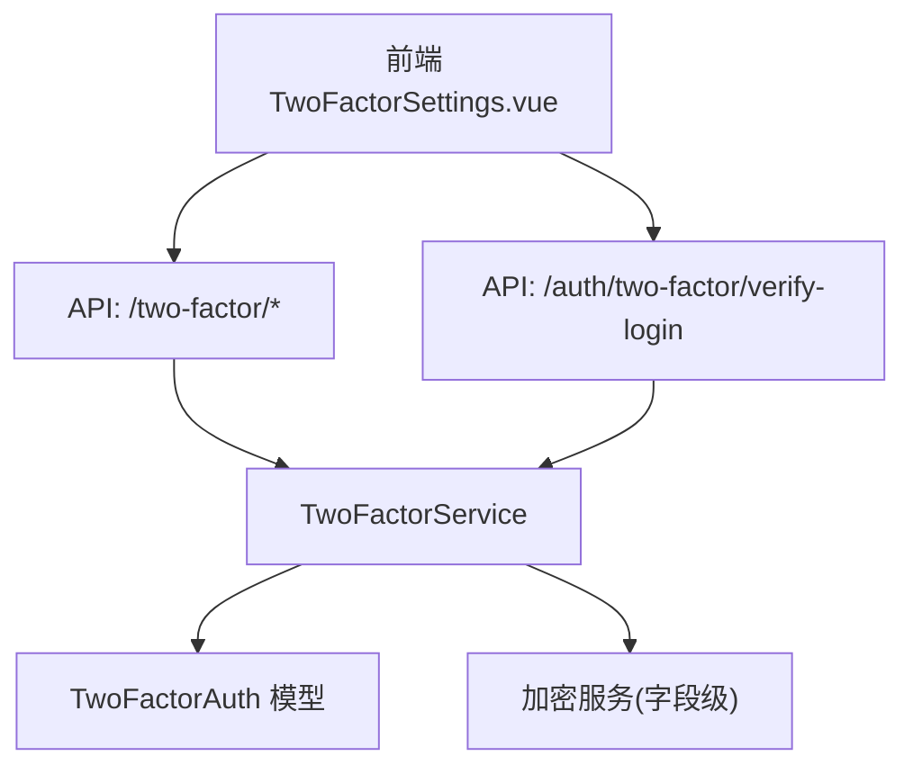
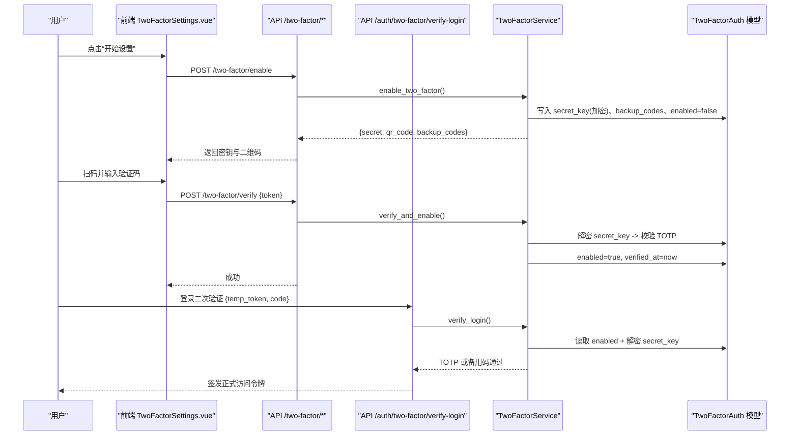
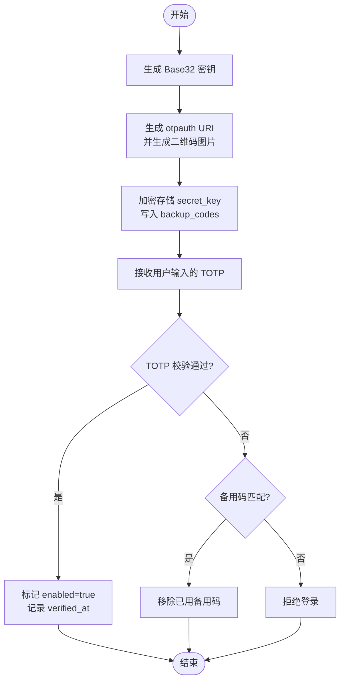
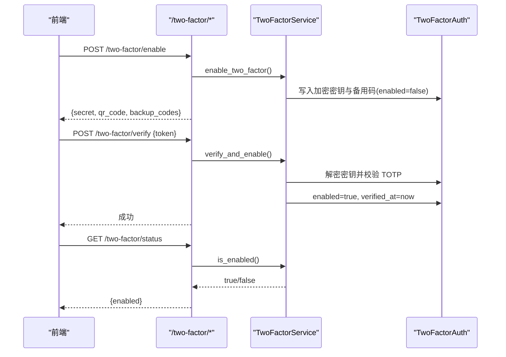
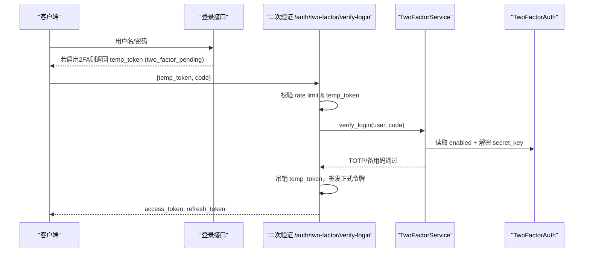
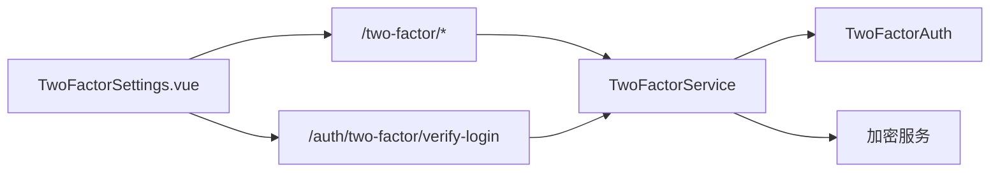

# 双因素认证

<cite>
**本文引用的文件**
- [backend/app/services/two_factor_service.py](file://backend/app/services/two_factor_service.py)
- [backend/app/models/two_factor_auth.py](file://backend/app/models/two_factor_auth.py)
- [backend/app/api/v1/auth/two_factor.py](file://backend/app/api/v1/auth/two_factor.py)
- [backend/app/api/v1/auth/auth.py](file://backend/app/api/v1/auth/auth.py)
- [backend/app/api/v1/system/admin.py](file://backend/app/api/v1/system/admin.py)
- [backend/app/core/config.py](file://backend/app/core/config.py)
- [frontend/src/views/auth/TwoFactorSettings.vue](file://frontend/src/views/auth/TwoFactorSettings.vue)
- [frontend/tests/unit/views/auth/TwoFactorSettings.test.ts](file://frontend/tests/unit/views/auth/TwoFactorSettings.test.ts)
- [frontend/tests/unit/api/twoFactor.test.ts](file://frontend/tests/unit/api/twoFactor.test.ts)
</cite>

## 目录
1. [简介](#简介)
2. [项目结构](#项目结构)
3. [核心组件](#核心组件)
4. [架构总览](#架构总览)
5. [详细组件分析](#详细组件分析)
6. [依赖关系分析](#依赖关系分析)
7. [性能与安全考虑](#性能与安全考虑)
8. [故障排除指南](#故障排除指南)
9. [结论](#结论)
10. [附录：移动端集成与配置](#附录移动端集成与配置)

## 简介
本实现文档围绕系统的双因素认证（2FA）能力，聚焦基于时间的一次性密码（TOTP）算法的实现原理、配置方法与管理流程。内容涵盖启用/禁用/重置、二维码生成、验证码校验、备份码管理、登录二次验证、以及移动端应用（Google Authenticator、Authy 等）集成指导。同时给出安全考量（时间同步、有效期窗口、防重放攻击）与常见问题排查建议。

## 项目结构
后端采用 FastAPI 分层设计：API 路由层负责请求解析与响应封装；服务层 TwoFactorService 封装 TOTP 密钥生成、二维码生成、令牌校验、备份码管理等核心逻辑；数据模型 TwoFactorAuth 持久化用户 2FA 状态与密钥（加密存储）。前端提供设置页面 TwoFactorSettings.vue，引导用户完成扫码绑定、输入验证码、查看并保存备用恢复码等操作。

**图表来源**
- [backend/app/api/v1/auth/two_factor.py:1-88](file://backend/app/api/v1/auth/two_factor.py#L1-L88)
- [backend/app/api/v1/auth/auth.py:290-444](file://backend/app/api/v1/auth/auth.py#L290-L444)
- [backend/app/services/two_factor_service.py:1-251](file://backend/app/services/two_factor_service.py#L1-L251)
- [backend/app/models/two_factor_auth.py:1-40](file://backend/app/models/two_factor_auth.py#L1-L40)

**章节来源**
- [backend/app/api/v1/auth/two_factor.py:1-88](file://backend/app/api/v1/auth/two_factor.py#L1-L88)
- [backend/app/api/v1/auth/auth.py:290-444](file://backend/app/api/v1/auth/auth.py#L290-L444)
- [backend/app/services/two_factor_service.py:1-251](file://backend/app/services/two_factor_service.py#L1-L251)
- [backend/app/models/two_factor_auth.py:1-40](file://backend/app/models/two_factor_auth.py#L1-L40)
- [frontend/src/views/auth/TwoFactorSettings.vue:1-294](file://frontend/src/views/auth/TwoFactorSettings.vue#L1-L294)

## 核心组件
- TwoFactorService：提供 TOTP 密钥生成、二维码生成、令牌验证、启用/禁用/查询状态、登录时校验（含备用码）、以及事务提交封装。
- TwoFactorAuth 模型：存储 user_id、加密后的 secret_key、backup_codes（JSON）、enabled 标志、verified_at 时间戳及审计时间。
- 双因素认证 API：/two-factor/enable、/two-factor/verify、/two-factor/disable、/two-factor/status；登录二次验证 /auth/two-factor/verify-login。
- 管理员重置：/system/users/{user_id}/two-factor/reset。
- 前端设置页：TwoFactorSettings.vue，驱动启用流程、展示二维码与备用码、调用校验接口。

**章节来源**
- [backend/app/services/two_factor_service.py:23-251](file://backend/app/services/two_factor_service.py#L23-L251)
- [backend/app/models/two_factor_auth.py:13-39](file://backend/app/models/two_factor_auth.py#L13-L39)
- [backend/app/api/v1/auth/two_factor.py:15-87](file://backend/app/api/v1/auth/two_factor.py#L15-L87)
- [backend/app/api/v1/auth/auth.py:290-444](file://backend/app/api/v1/auth/auth.py#L290-L444)
- [backend/app/api/v1/system/admin.py:475-500](file://backend/app/api/v1/system/admin.py#L475-L500)
- [frontend/src/views/auth/TwoFactorSettings.vue:120-236](file://frontend/src/views/auth/TwoFactorSettings.vue#L120-L236)

## 架构总览
下图展示了从前端到后端的完整 2FA 工作流：用户在前端触发启用流程，后端生成密钥与二维码；用户扫描后返回验证码进行校验；校验通过后正式启用；登录时若已启用则进入二次验证阶段，支持 TOTP 或备用码；管理员可重置用户的 2FA 配置。

**图表来源**
- [backend/app/api/v1/auth/two_factor.py:31-87](file://backend/app/api/v1/auth/two_factor.py#L31-L87)
- [backend/app/api/v1/auth/auth.py:290-444](file://backend/app/api/v1/auth/auth.py#L290-L444)
- [backend/app/services/two_factor_service.py:103-215](file://backend/app/services/two_factor_service.py#L103-L215)
- [backend/app/models/two_factor_auth.py:13-39](file://backend/app/models/two_factor_auth.py#L13-L39)

## 详细组件分析

### TOTP 算法与密钥管理
- 密钥生成：使用标准 Base32 随机密钥，兼容主流认证应用。
- 二维码生成：构造 otpauth URI（包含发行者与应用名），生成 PNG 并转为 data URL 供前端直接渲染。
- 令牌验证：使用 pyotp.TOTP.verify(token, valid_window=1)，允许前后一个时间步长（默认 30s）的容差，兼顾设备时钟微小偏差。
- 密钥存储：secret_key 以加密形式持久化，读取时再解密，降低泄露风险。

**图表来源**
- [backend/app/services/two_factor_service.py:26-100](file://backend/app/services/two_factor_service.py#L26-L100)
- [backend/app/services/two_factor_service.py:103-215](file://backend/app/services/two_factor_service.py#L103-L215)
- [backend/app/models/two_factor_auth.py:18-23](file://backend/app/models/two_factor_auth.py#L18-L23)

**章节来源**
- [backend/app/services/two_factor_service.py:26-100](file://backend/app/services/two_factor_service.py#L26-L100)
- [backend/app/services/two_factor_service.py:103-215](file://backend/app/services/two_factor_service.py#L103-L215)
- [backend/app/models/two_factor_auth.py:18-23](file://backend/app/models/two_factor_auth.py#L18-L23)

### 启用/禁用/状态查询
- 启用：POST /two-factor/enable，返回密钥、二维码与备用码；此时 enabled 为 false，需后续验证后才开启。
- 验证并启用：POST /two-factor/verify，传入 TOTP 验证码，通过后设置 enabled=true 并记录 verified_at。
- 禁用：POST /two-factor/disable，删除当前 2FA 配置。
- 状态：GET /two-factor/status，返回是否启用。

**图表来源**
- [backend/app/api/v1/auth/two_factor.py:31-87](file://backend/app/api/v1/auth/two_factor.py#L31-L87)
- [backend/app/services/two_factor_service.py:103-251](file://backend/app/services/two_factor_service.py#L103-L251)

**章节来源**
- [backend/app/api/v1/auth/two_factor.py:31-87](file://backend/app/api/v1/auth/two_factor.py#L31-L87)
- [backend/app/services/two_factor_service.py:103-251](file://backend/app/services/two_factor_service.py#L103-L251)

### 登录二次验证（含备用码）
- 首次登录成功后若检测到用户启用了 2FA，将签发临时令牌（携带 two_factor_pending 标识）。
- 客户端使用 temp_token 与 TOTP/备用码调用 /auth/two-factor/verify-login。
- 服务端校验 temp_token、查找用户、执行 TwoFactorService.verify_login（优先 TOTP，其次备用码）。
- 通过后吊销 temp_token，签发正式访问令牌对，并记录登录审计日志。

**图表来源**
- [backend/app/api/v1/auth/auth.py:290-444](file://backend/app/api/v1/auth/auth.py#L290-L444)
- [backend/app/services/two_factor_service.py:180-215](file://backend/app/services/two_factor_service.py#L180-L215)

**章节来源**
- [backend/app/api/v1/auth/auth.py:290-444](file://backend/app/api/v1/auth/auth.py#L290-L444)
- [backend/app/services/two_factor_service.py:180-215](file://backend/app/services/two_factor_service.py#L180-L215)

### 管理员重置
- 仅管理员可调用 /system/users/{user_id}/two-factor/reset。
- 重置时将对应记录的 enabled 置为 false、清空 secret_key 与 backup_codes、清除 verified_at。

**章节来源**
- [backend/app/api/v1/system/admin.py:475-500](file://backend/app/api/v1/system/admin.py#L475-L500)

### 前端设置页交互
- 加载状态：调用 /two-factor/status 判断是否已启用。
- 开始设置：调用 /two-factor/enable，获取 secret、qr_code、backup_codes，并切换到步骤 1。
- 显示二维码与密钥：将 qr_code 作为 data URL 直接渲染；提供复制密钥与备用码功能。
- 验证并启用：调用 /two-factor/verify，成功后提示并刷新状态。
- 禁用：调用 /two-factor/disable。

**章节来源**
- [frontend/src/views/auth/TwoFactorSettings.vue:120-236](file://frontend/src/views/auth/TwoFactorSettings.vue#L120-L236)
- [frontend/tests/unit/views/auth/TwoFactorSettings.test.ts:120-154](file://frontend/tests/unit/views/auth/TwoFactorSettings.test.ts#L120-L154)
- [frontend/tests/unit/api/twoFactor.test.ts:49-75](file://frontend/tests/unit/api/twoFactor.test.ts#L49-L75)

## 依赖关系分析
- 外部库：pyotp（TOTP 计算）、qrcode（二维码生成）、cryptography（字段级加密）。
- 内部依赖：TwoFactorService 依赖 TwoFactorAuth 模型与加密服务；API 路由依赖服务与数据库会话；前端依赖后端 API。

**图表来源**
- [backend/app/services/two_factor_service.py:1-20](file://backend/app/services/two_factor_service.py#L1-L20)
- [backend/app/models/two_factor_auth.py:1-12](file://backend/app/models/two_factor_auth.py#L1-L12)
- [backend/app/api/v1/auth/two_factor.py:1-14](file://backend/app/api/v1/auth/two_factor.py#L1-L14)
- [backend/app/api/v1/auth/auth.py:290-300](file://backend/app/api/v1/auth/auth.py#L290-L300)

**章节来源**
- [backend/app/services/two_factor_service.py:1-20](file://backend/app/services/two_factor_service.py#L1-L20)
- [backend/app/models/two_factor_auth.py:1-12](file://backend/app/models/two_factor_auth.py#L1-L12)
- [backend/app/api/v1/auth/two_factor.py:1-14](file://backend/app/api/v1/auth/two_factor.py#L1-L14)
- [backend/app/api/v1/auth/auth.py:290-300](file://backend/app/api/v1/auth/auth.py#L290-L300)

## 性能与安全考虑
- 时间同步与有效期窗口：
  - TOTP 验证使用 valid_window=1，允许前后一个时间步（约 ±30s）容差，缓解设备时钟偏差。
  - 建议确保客户端设备时间与服务器时间同步（NTP）。
- 验证码有效期：
  - TOTP 每 30s 滚动一次，天然具备短期有效特性。
  - 登录二次验证使用一次性 temp_token，并在成功后立即吊销，防止重放。
- 防重放攻击：
  - temp_token 在二次验证成功后被吊销；正式令牌签发前清理失败计数与锁定状态。
  - 速率限制应用于二次验证入口，避免暴力破解。
- 敏感数据保护：
  - secret_key 以加密形式存储，读取时再解密。
  - 备用码一次性使用，使用后从列表移除。
- 配置项参考：
  - 访问令牌过期时间、刷新令牌天数、最大失败次数、账户锁定时长等可在配置中调整。

**章节来源**
- [backend/app/services/two_factor_service.py:84-100](file://backend/app/services/two_factor_service.py#L84-L100)
- [backend/app/services/two_factor_service.py:180-215](file://backend/app/services/two_factor_service.py#L180-L215)
- [backend/app/api/v1/auth/auth.py:309-383](file://backend/app/api/v1/auth/auth.py#L309-L383)
- [backend/app/core/config.py:126-135](file://backend/app/core/config.py#L126-L135)

## 故障排除指南
- 无法启用 2FA：
  - 检查是否已启用过且未正确关闭；确认后端返回的二维码与备用码是否正确。
  - 参考：[backend/app/api/v1/auth/two_factor.py:31-44](file://backend/app/api/v1/auth/two_factor.py#L31-L44)
- 验证码错误：
  - 确认手机应用与服务器时间同步；尝试重新生成二维码。
  - 参考：[backend/app/services/two_factor_service.py:84-100](file://backend/app/services/two_factor_service.py#L84-L100)
- 登录二次验证失败：
  - 检查 temp_token 是否有效且未被吊销；确认 TOTP 或备用码正确。
  - 参考：[backend/app/api/v1/auth/auth.py:323-373](file://backend/app/api/v1/auth/auth.py#L323-L373)
- 管理员重置无效：
  - 确认操作权限与目标用户存在；检查重置后 enabled 是否为 false。
  - 参考：[backend/app/api/v1/system/admin.py:475-500](file://backend/app/api/v1/system/admin.py#L475-L500)
- 前端显示异常：
  - 检查二维码 data URL 是否有效；备用码复制是否成功。
  - 参考：[frontend/src/views/auth/TwoFactorSettings.vue:149-161](file://frontend/src/views/auth/TwoFactorSettings.vue#L149-L161)

**章节来源**
- [backend/app/api/v1/auth/two_factor.py:31-44](file://backend/app/api/v1/auth/two_factor.py#L31-L44)
- [backend/app/services/two_factor_service.py:84-100](file://backend/app/services/two_factor_service.py#L84-L100)
- [backend/app/api/v1/auth/auth.py:323-373](file://backend/app/api/v1/auth/auth.py#L323-L373)
- [backend/app/api/v1/system/admin.py:475-500](file://backend/app/api/v1/system/admin.py#L475-L500)
- [frontend/src/views/auth/TwoFactorSettings.vue:149-161](file://frontend/src/views/auth/TwoFactorSettings.vue#L149-L161)

## 结论
本系统实现了完整的 TOTP 双因素认证流程，包括密钥与二维码生成、启用/禁用/状态查询、登录二次验证（含备用码）、管理员重置等。通过字段级加密、一次性临时令牌、速率限制与时间窗口容错，兼顾安全性与可用性。前端提供了清晰的引导界面，便于用户完成绑定与验证。建议在部署环境中确保时间同步与合理的策略配置，以获得最佳体验与安全基线。

## 附录：移动端集成与配置
- 支持的认证应用：Google Authenticator、Microsoft Authenticator、Authy 等遵循 TOTP 标准的移动应用均可。
- 配置步骤：
  1) 在系统中点击“开始设置”，获取二维码与备用恢复码。
  2) 打开认证应用，选择“添加账户”或“扫描二维码”。
  3) 扫描系统生成的二维码，或在应用中手动输入密钥（如无法扫码）。
  4) 输入应用生成的 6 位验证码，完成启用。
  5) 妥善保管备用恢复码，用于丢失设备时的紧急登录。
- 注意事项：
  - 确保设备时间与网络时间同步，避免验证码频繁失效。
  - 若多次失败，等待一段时间后再试，避免触发速率限制。
  - 如需更换设备，可使用备用恢复码在新设备上继续验证。

[本节为通用指导，不直接分析具体代码文件]