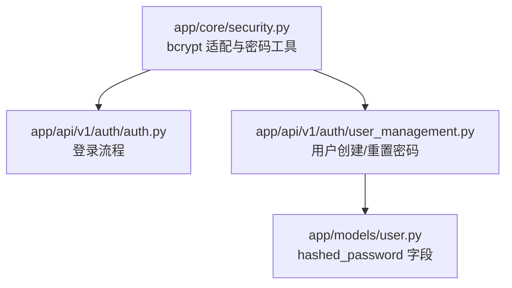
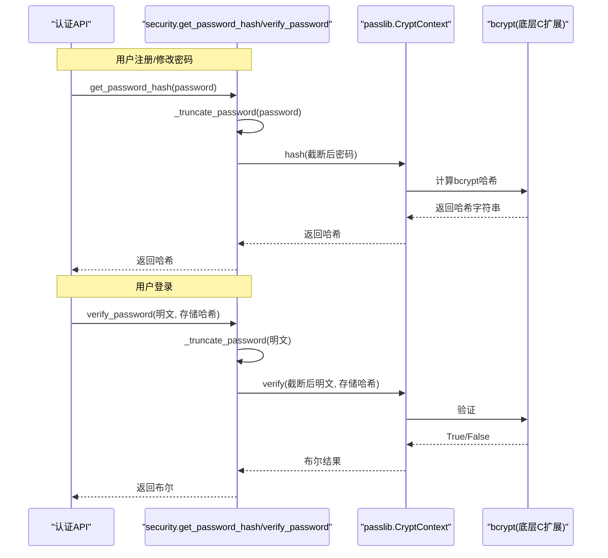
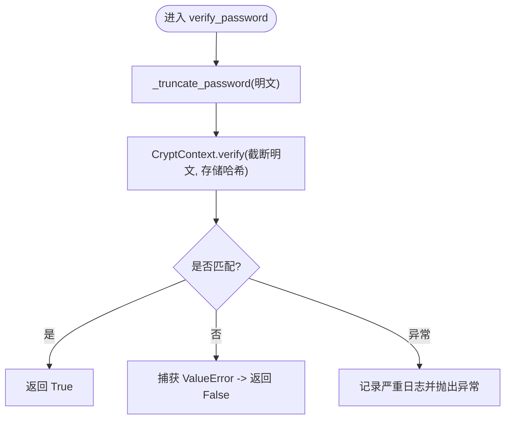
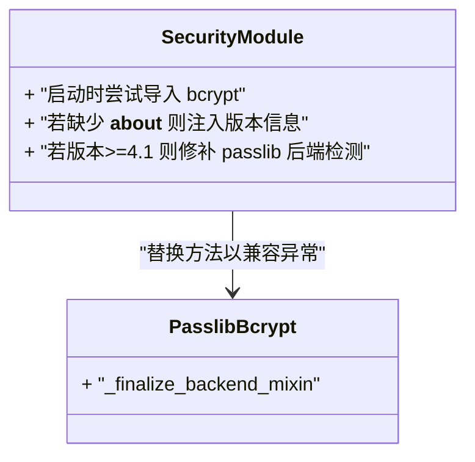
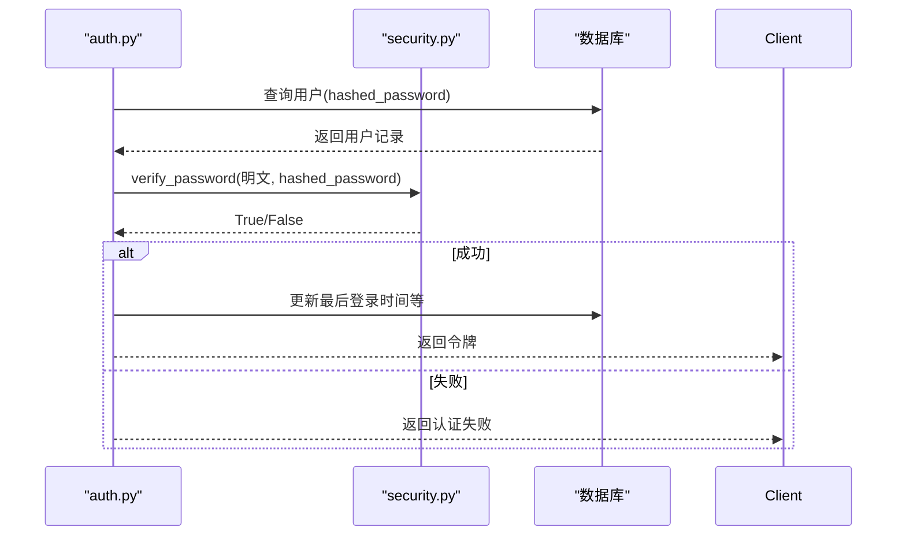
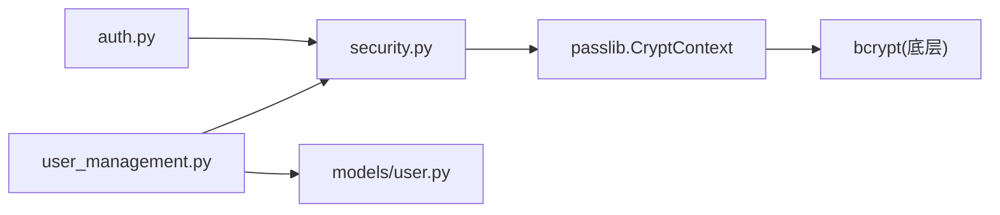

# bcrypt哈希算法实现

<cite>
**本文引用的文件**
- [backend/app/core/security.py](file://backend/app/core/security.py)
- [backend/app/api/v1/auth/auth.py](file://backend/app/api/v1/auth/auth.py)
- [backend/app/api/v1/auth/user_management.py](file://backend/app/api/v1/auth/user_management.py)
- [backend/app/models/user.py](file://backend/app/models/user.py)
- [backend/tests/unit/test_core_security.py](file://backend/tests/unit/test_core_security.py)
</cite>

## 目录
1. [简介](#简介)
2. [项目结构](#项目结构)
3. [核心组件](#核心组件)
4. [架构总览](#架构总览)
5. [详细组件分析](#详细组件分析)
6. [依赖关系分析](#依赖关系分析)
7. [性能考量](#性能考量)
8. [故障排查指南](#故障排查指南)
9. [结论](#结论)
10. [附录：使用示例与最佳实践](#附录使用示例与最佳实践)

## 简介
本技术文档聚焦于系统中基于 bcrypt 的密码哈希与校验实现，覆盖以下要点：
- 选择 bcrypt 的原因与安全优势（自适应成本、盐值内置、抗彩虹表等）
- 密码截断机制以兼容不同版本 bcrypt 的输入限制
- get_password_hash 与 verify_password 的实现细节、错误处理与安全考虑
- passlib + bcrypt 的版本兼容性补丁与性能优化
- 在登录、用户创建/重置等场景中的调用方式与注意事项

## 项目结构
与 bcrypt 相关的核心代码集中在安全模块与认证接口中：
- 安全模块提供密码哈希、验证、passlib/bcrypt 兼容性补丁
- 认证接口在登录流程中调用验证函数；用户管理接口在创建/重置密码时调用哈希函数
- 用户模型存储哈希后的密码字段

图表来源
- [backend/app/core/security.py:107-148](file://backend/app/core/security.py#L107-L148)
- [backend/app/api/v1/auth/auth.py:170-179](file://backend/app/api/v1/auth/auth.py#L170-L179)
- [backend/app/api/v1/auth/user_management.py:220-236](file://backend/app/api/v1/auth/user_management.py#L220-L236)
- [backend/app/models/user.py:37-41](file://backend/app/models/user.py#L37-L41)

章节来源
- [backend/app/core/security.py:107-148](file://backend/app/core/security.py#L107-L148)
- [backend/app/api/v1/auth/auth.py:170-179](file://backend/app/api/v1/auth/auth.py#L170-L179)
- [backend/app/api/v1/auth/user_management.py:220-236](file://backend/app/api/v1/auth/user_management.py#L220-L236)
- [backend/app/models/user.py:37-41](file://backend/app/models/user.py#L37-L41)

## 核心组件
- 密码上下文与哈希/验证
  - 通过 passlib 的 CryptContext 配置 bcrypt 方案，统一封装哈希与验证
  - 对外暴露 get_password_hash、hash_password、verify_password 三个函数
- 密码长度截断
  - 为兼容 bcrypt 5.x 对超过 72 字节输入的异常行为，统一在哈希/验证前进行 UTF-8 编码并截断至 72 字节
- passlib + bcrypt 版本兼容补丁
  - 针对 bcrypt 4.1+ 与 5.x 的行为差异，注入缺失的 __about__ 并修补 passlib 的后端检测逻辑，避免回退到纯 Python 实现导致性能退化

章节来源
- [backend/app/core/security.py:21-51](file://backend/app/core/security.py#L21-L51)
- [backend/app/core/security.py:107-148](file://backend/app/core/security.py#L107-L148)

## 架构总览
下图展示了从业务调用到 bcrypt 实现的完整链路，包括兼容性补丁、密码截断与异常处理。

图表来源
- [backend/app/core/security.py:122-148](file://backend/app/core/security.py#L122-L148)
- [backend/app/api/v1/auth/auth.py:170-179](file://backend/app/api/v1/auth/auth.py#L170-L179)

## 详细组件分析

### 密码哈希与验证（get_password_hash / verify_password）
- 设计要点
  - 所有进入哈希/验证的明文都会先进行 UTF-8 编码并截断至 72 字节，避免 bcrypt 5.x 抛出异常
  - 使用 passlib 的 CryptContext(schemes=["bcrypt"]) 进行统一封装
  - 验证失败时捕获 ValueError 并返回 False，其他异常记录严重日志并向上抛出，确保系统级问题可被观测
- 复杂度与安全性
  - 时间复杂度由 bcrypt 的成本因子决定，属于受控的慢哈希，适合密码存储
  - 空间复杂度主要为哈希字符串与临时缓冲，开销可控
- 错误处理
  - 格式不匹配或密码过长等已知异常被安全降级为 False
  - 未知异常会记录关键日志并抛出，便于运维定位

图表来源
- [backend/app/core/security.py:140-148](file://backend/app/core/security.py#L140-L148)

章节来源
- [backend/app/core/security.py:122-148](file://backend/app/core/security.py#L122-L148)

### 密码截断机制（_truncate_password）
- 目的
  - 兼容 bcrypt 5.x 对超过 72 字节输入抛异常的约束，保证跨版本一致性
- 策略
  - 将密码按 UTF-8 编码后判断字节长度，超过 72 字节则截取前 72 字节再解码
  - 解码时使用忽略非法序列的策略，避免异常中断
- 影响
  - 对于超长密码，哈希仅基于前 72 字节；这是 bcrypt 协议层面的限制，无法绕过
  - 建议前端同时实施合理的密码长度策略，减少超长密码带来的体验与安全风险

章节来源
- [backend/app/core/security.py:113-127](file://backend/app/core/security.py#L113-L127)

### passlib + bcrypt 版本兼容性补丁
- 背景
  - bcrypt 4.1+ 对 >72 字节密码抛出 ValueError，passlib 1.7.4 的检测未完全适配
  - bcrypt 5.x 移除了 __about__ 模块，导致 passlib 无法识别版本而回退到纯 Python 实现，验证耗时显著增加
- 实现
  - 若缺少 __about__，动态注入包含版本的模块对象，使 passlib 正确加载 C 扩展
  - 对 passlib 的后端检测包装方法添加 try/except，跳过导致回退的检测分支，保持高性能路径
- 测试覆盖
  - 单元测试验证了注入 __about__、补丁生效以及导入异常时的容错

图表来源
- [backend/app/core/security.py:21-51](file://backend/app/core/security.py#L21-L51)
- [backend/tests/unit/test_core_security.py:255-286](file://backend/tests/unit/test_core_security.py#L255-L286)

章节来源
- [backend/app/core/security.py:21-51](file://backend/app/core/security.py#L21-L51)
- [backend/tests/unit/test_core_security.py:255-286](file://backend/tests/unit/test_core_security.py#L255-L286)

### 在业务中的使用
- 登录流程
  - 获取用户后，调用 verify_password 比对明文与存储哈希，失败则记录审计并拒绝登录
- 用户创建/重置
  - 使用 get_password_hash 生成哈希后写入数据库 hashed_password 字段
- 数据模型
  - User.hashed_password 用于持久化 bcrypt 哈希字符串

图表来源
- [backend/app/api/v1/auth/auth.py:170-179](file://backend/app/api/v1/auth/auth.py#L170-L179)
- [backend/app/models/user.py:37-41](file://backend/app/models/user.py#L37-L41)

章节来源
- [backend/app/api/v1/auth/auth.py:170-179](file://backend/app/api/v1/auth/auth.py#L170-L179)
- [backend/app/api/v1/auth/user_management.py:220-236](file://backend/app/api/v1/auth/user_management.py#L220-L236)
- [backend/app/models/user.py:37-41](file://backend/app/models/user.py#L37-L41)

## 依赖关系分析
- 内部依赖
  - security.py 依赖 passlib 的 CryptContext 与 bcrypt 底层实现
  - auth.py 与 user_management.py 依赖 security.py 提供的哈希/验证函数
  - user.py 定义 hashed_password 字段用于存储哈希
- 外部依赖
  - passlib.handlers.bcrypt 与 bcrypt 库的版本差异通过运行时补丁解决
- 耦合与内聚
  - 密码相关逻辑集中在 security.py，内聚度高；业务层仅做调用，耦合度低

图表来源
- [backend/app/core/security.py:107-148](file://backend/app/core/security.py#L107-L148)
- [backend/app/api/v1/auth/auth.py:170-179](file://backend/app/api/v1/auth/auth.py#L170-L179)
- [backend/app/api/v1/auth/user_management.py:220-236](file://backend/app/api/v1/auth/user_management.py#L220-L236)
- [backend/app/models/user.py:37-41](file://backend/app/models/user.py#L37-L41)

章节来源
- [backend/app/core/security.py:107-148](file://backend/app/core/security.py#L107-L148)
- [backend/app/api/v1/auth/auth.py:170-179](file://backend/app/api/v1/auth/auth.py#L170-L179)
- [backend/app/api/v1/auth/user_management.py:220-236](file://backend/app/api/v1/auth/user_management.py#L220-L236)
- [backend/app/models/user.py:37-41](file://backend/app/models/user.py#L37-L41)

## 性能考量
- 自适应成本因子
  - 当前通过 passlib 默认配置 bcrypt 方案；如需调整性能与安全的平衡，可在 CryptContext 初始化时显式设置 cost factor（例如 rounds），以控制哈希计算时间
- 版本兼容性对性能的影响
  - 补丁确保 passlib 使用 C 扩展而非回退到纯 Python，避免验证耗时从毫秒级退化到数十秒
- 输入截断
  - 截断操作仅在必要时执行，开销可忽略；但应避免传入超长密码以减少不必要的编解码

[本节为通用性能指导，不直接分析具体文件]

## 故障排查指南
- 常见问题
  - 登录失败且日志中出现“密码验证模块故障”：说明 verify_password 捕获到非预期异常，需检查底层 bcrypt/passlib 状态与环境
  - 验证码耗时异常高：可能由于 passlib 回退到纯 Python 实现，确认补丁是否生效（参考单元测试）
- 定位步骤
  - 检查 security.py 启动阶段的补丁逻辑是否被执行
  - 核对 bcrypt 版本与 passlib 版本组合，确保满足补丁条件
  - 查看应用日志中的关键错误堆栈，定位具体异常类型

章节来源
- [backend/app/core/security.py:140-148](file://backend/app/core/security.py#L140-L148)
- [backend/tests/unit/test_core_security.py:278-286](file://backend/tests/unit/test_core_security.py#L278-L286)

## 结论
本实现通过统一的密码哈希/验证接口、严格的输入截断与完善的 passlib/bcrypt 版本兼容补丁，在保证安全性的同时兼顾了跨版本稳定性与性能。业务侧仅需调用 get_password_hash 与 verify_password，即可在不同环境中获得一致的安全行为。建议在部署时关注 bcrypt 与 passlib 版本，并根据实际负载评估是否需要调整 bcrypt 的成本因子。

[本节为总结性内容，不直接分析具体文件]

## 附录：使用示例与最佳实践
- 推荐用法
  - 用户注册/修改密码：调用 get_password_hash 生成哈希后存入 hashed_password
  - 用户登录：调用 verify_password 比对明文与存储哈希，结合账户锁定与审计策略
- 注意事项
  - 不要自行拼接或比较明文密码
  - 避免在日志中输出敏感信息（如密码、token）
  - 前端应配合实施密码强度与长度策略，减少超长密码带来的风险

章节来源
- [backend/app/api/v1/auth/user_management.py:220-236](file://backend/app/api/v1/auth/user_management.py#L220-L236)
- [backend/app/api/v1/auth/auth.py:170-179](file://backend/app/api/v1/auth/auth.py#L170-L179)
- [backend/app/core/security.py:122-148](file://backend/app/core/security.py#L122-L148)