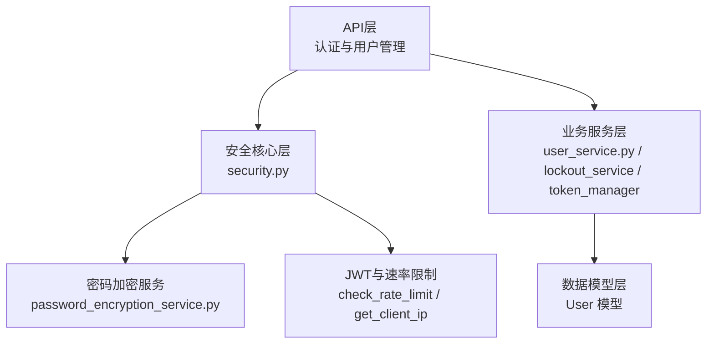
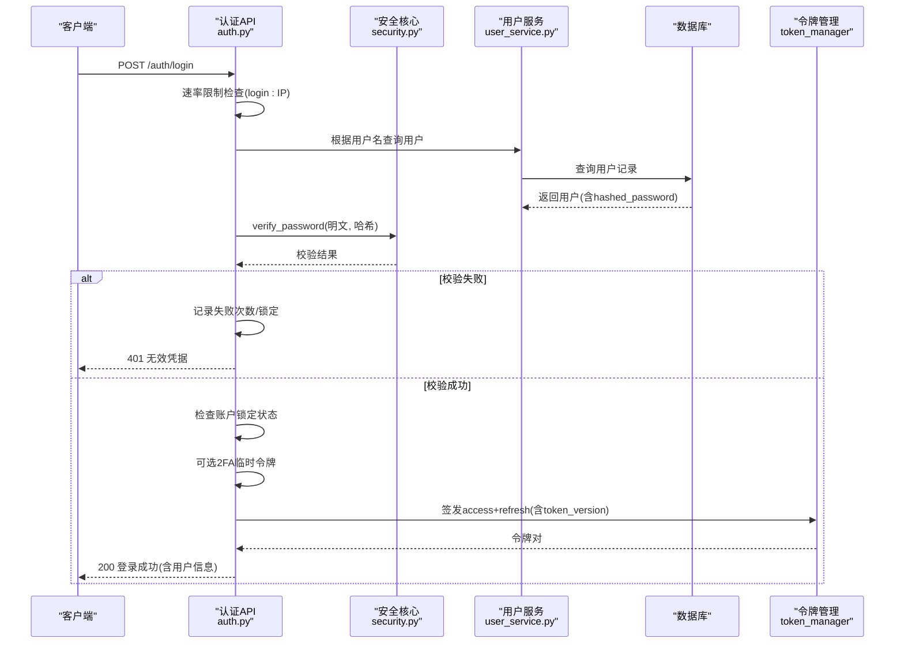
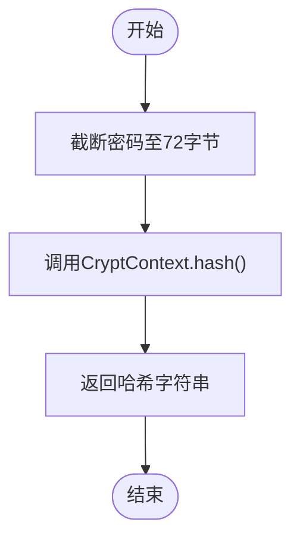
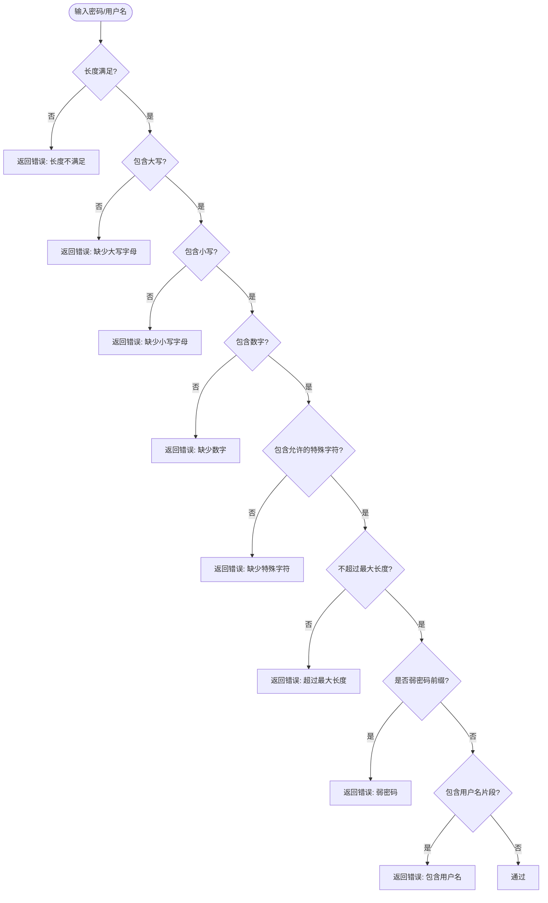
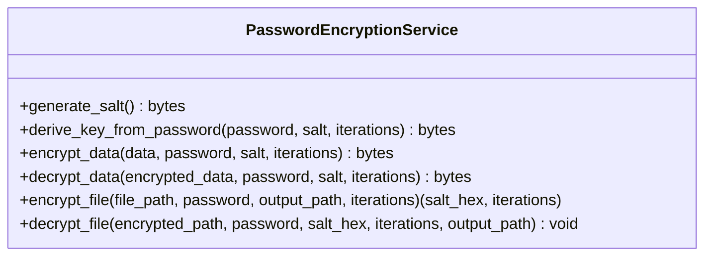
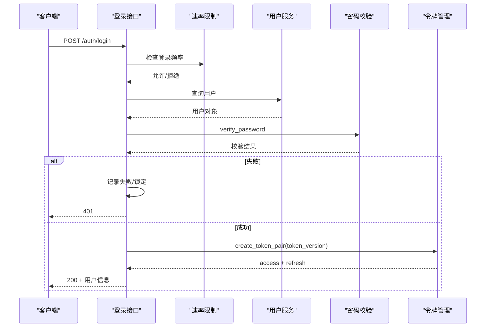
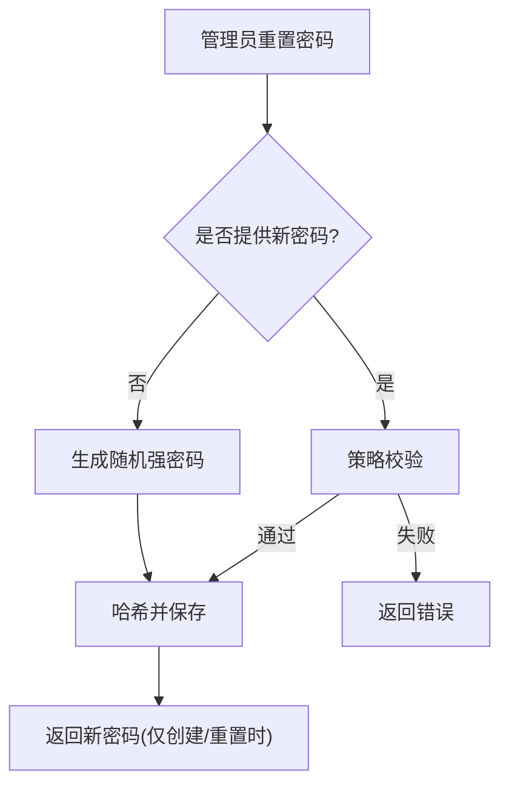
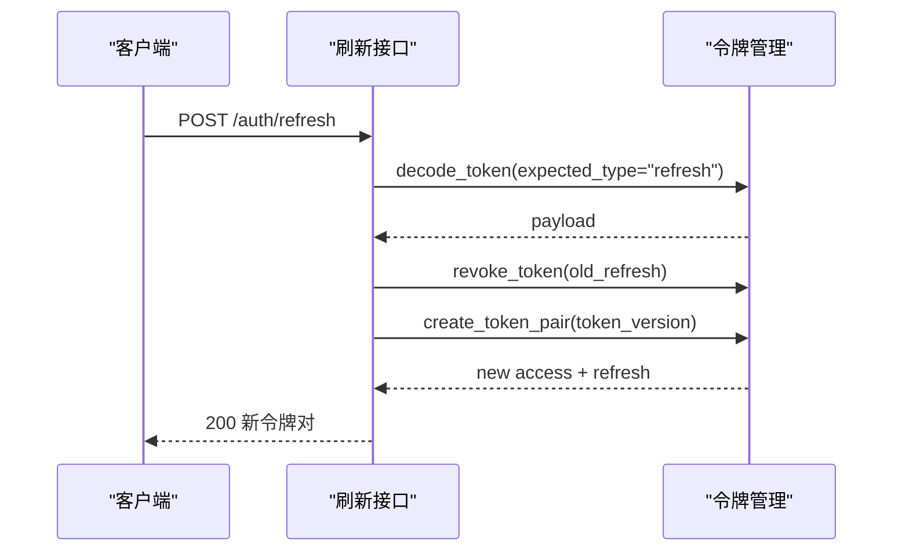
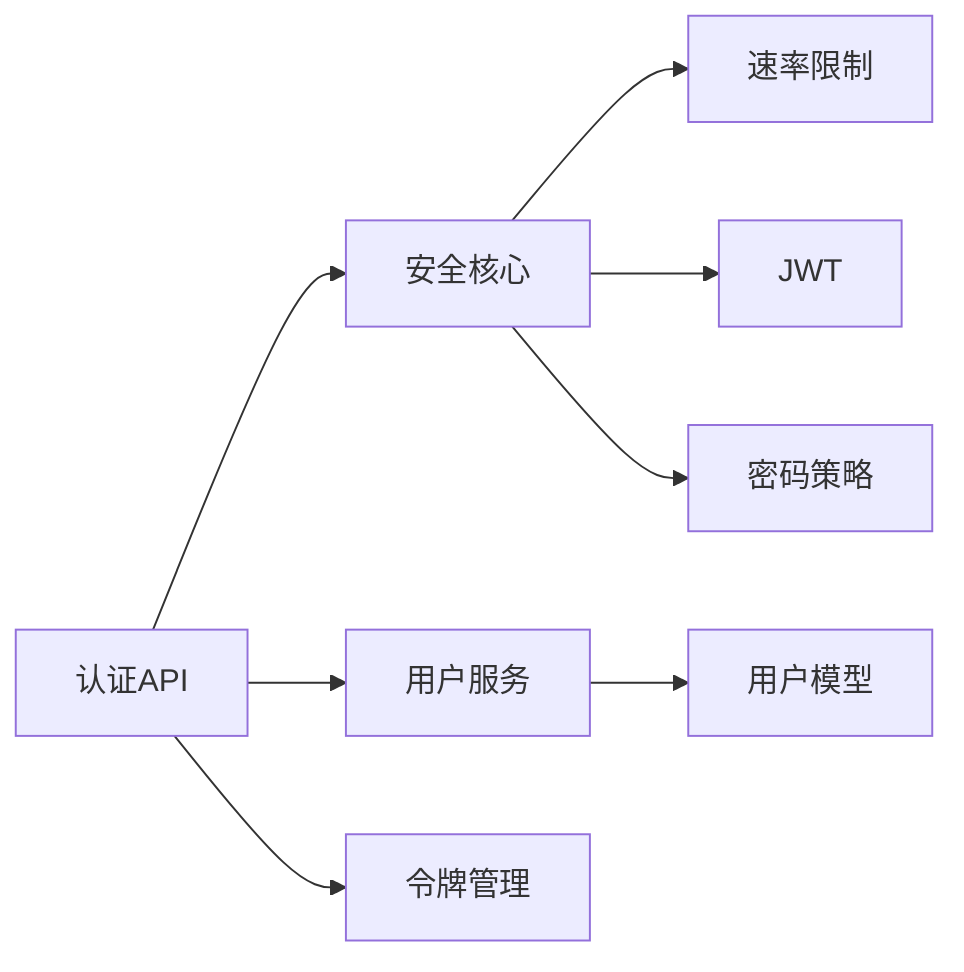

# 密码安全存储

<cite>
**本文引用的文件**
- [backend/app/core/security.py](file://backend/app/core/security.py)
- [backend/app/services/password_encryption_service.py](file://backend/app/services/password_encryption_service.py)
- [backend/app/api/v1/auth/auth.py](file://backend/app/api/v1/auth/auth.py)
- [backend/app/schemas/auth.py](file://backend/app/schemas/auth.py)
- [backend/app/services/user_service.py](file://backend/app/services/user_service.py)
- [backend/app/models/user.py](file://backend/app/models/user.py)
- [backend/app/api/v1/auth/user_management.py](file://backend/app/api/v1/auth/user_management.py)
</cite>

## 目录
1. [简介](#简介)
2. [项目结构](#项目结构)
3. [核心组件](#核心组件)
4. [架构总览](#架构总览)
5. [详细组件分析](#详细组件分析)
6. [依赖关系分析](#依赖关系分析)
7. [性能考量](#性能考量)
8. [故障排查指南](#故障排查指南)
9. [结论](#结论)
10. [附录](#附录)

## 简介
本文件面向“密码安全存储”的安全实现，覆盖以下目标：
- bcrypt 哈希算法的使用与配置（盐值生成、哈希计算、密码验证）
- 密码策略验证系统（长度要求、复杂度检查、弱密码检测）
- 密码加密服务架构（算法选择、密钥管理、性能优化）
- 密码重置、修改、验证业务流程示例
- 密码安全最佳实践（防暴力破解、侧信道攻击等防护）

## 项目结构
本项目在认证与安全方面采用分层设计：
- 安全核心层：提供密码哈希/校验、JWT、速率限制、安全中间件、审计日志等能力
- 业务服务层：用户服务、令牌管理、锁定服务等
- API 层：登录、注册、刷新、登出、用户管理等接口
- 数据模型层：用户模型及敏感字段加密存储

图表来源
- [backend/app/api/v1/auth/auth.py:101-287](file://backend/app/api/v1/auth/auth.py#L101-L287)
- [backend/app/core/security.py:107-148](file://backend/app/core/security.py#L107-L148)
- [backend/app/services/user_service.py:76-95](file://backend/app/services/user_service.py#L76-L95)
- [backend/app/models/user.py:37-85](file://backend/app/models/user.py#L37-L85)
- [backend/app/services/password_encryption_service.py:23-137](file://backend/app/services/password_encryption_service.py#L23-L137)

章节来源
- [backend/app/api/v1/auth/auth.py:101-287](file://backend/app/api/v1/auth/auth.py#L101-L287)
- [backend/app/core/security.py:107-148](file://backend/app/core/security.py#L107-L148)
- [backend/app/services/user_service.py:76-95](file://backend/app/services/user_service.py#L76-L95)
- [backend/app/models/user.py:37-85](file://backend/app/models/user.py#L37-L85)
- [backend/app/services/password_encryption_service.py:23-137](file://backend/app/services/password_encryption_service.py#L23-L137)

## 核心组件
- 密码哈希与校验：基于 passlib + bcrypt，统一封装为 get_password_hash / verify_password，并处理 bcrypt 版本兼容与超长密码截断
- 密码策略：PasswordPolicy 强制最小长度、大小写/数字/特殊字符、弱密码前缀黑名单、用户名包含检查
- 速率限制与账户锁定：登录/注册/刷新等关键路径启用滑动窗口限流；失败次数达到阈值自动锁定
- JWT 令牌：签发 access/refresh 双令牌，支持吊销与 token_version 机制实现即时失效
- 密码加密服务：PBKDF2-HMAC-SHA256 派生密钥 + Fernet 对称加密，用于文件/数据级机密保护
- 审计与脱敏：登录/登出审计日志，敏感字段日志脱敏

章节来源
- [backend/app/core/security.py:107-148](file://backend/app/core/security.py#L107-L148)
- [backend/app/core/security.py:524-569](file://backend/app/core/security.py#L524-L569)
- [backend/app/api/v1/auth/auth.py:124-179](file://backend/app/api/v1/auth/auth.py#L124-L179)
- [backend/app/api/v1/auth/auth.py:594-689](file://backend/app/api/v1/auth/auth.py#L594-L689)
- [backend/app/services/password_encryption_service.py:23-137](file://backend/app/services/password_encryption_service.py#L23-L137)

## 架构总览
下图展示从登录到鉴权的核心调用链，包括速率限制、密码校验、锁定检查、2FA 流程与令牌签发。

图表来源
- [backend/app/api/v1/auth/auth.py:101-287](file://backend/app/api/v1/auth/auth.py#L101-L287)
- [backend/app/core/security.py:140-148](file://backend/app/core/security.py#L140-L148)
- [backend/app/services/user_service.py:26-32](file://backend/app/services/user_service.py#L26-L32)

## 详细组件分析

### 组件A：bcrypt 密码哈希与验证
- 使用 passlib 的 CryptContext 配置 bcrypt 方案
- 提供 get_password_hash / verify_password 统一入口
- 针对 bcrypt 5.x 的 72 字节限制进行截断处理，避免异常
- 捕获并记录底层异常，确保登录链路健壮性

图表来源
- [backend/app/core/security.py:122-148](file://backend/app/core/security.py#L122-L148)

章节来源
- [backend/app/core/security.py:107-148](file://backend/app/core/security.py#L107-L148)

### 组件B：密码策略验证系统
- 最小长度、大小写字母、数字、特殊字符白名单
- 最大长度限制，防止过长输入
- 弱密码前缀黑名单（如 admin/root/123/password/qwerty）
- 禁止密码包含用户名片段
- 用户名格式校验（长度与字符集）

图表来源
- [backend/app/core/security.py:524-569](file://backend/app/core/security.py#L524-L569)

章节来源
- [backend/app/core/security.py:524-569](file://backend/app/core/security.py#L524-L569)

### 组件C：密码加密服务（PBKDF2 + Fernet）
- 使用 PBKDF2-HMAC-SHA256 从密码派生 32 字节密钥
- 将派生密钥转换为 Fernet 所需 base64 格式
- 提供数据/文件的加解密方法，失败时抛出 InvalidPasswordError
- 默认迭代次数遵循 OWASP 建议（至少 100000 次）

图表来源
- [backend/app/services/password_encryption_service.py:23-137](file://backend/app/services/password_encryption_service.py#L23-L137)
- [backend/app/services/password_encryption_service.py:140-206](file://backend/app/services/password_encryption_service.py#L140-L206)

章节来源
- [backend/app/services/password_encryption_service.py:23-206](file://backend/app/services/password_encryption_service.py#L23-L206)

### 组件D：登录与令牌签发流程
- 登录端点实施 IP 级速率限制（每分钟最多 5 次）
- 校验用户存在、激活状态、账户锁定状态
- 密码校验失败时递增失败计数，达到阈值自动锁定
- 成功后签发 access_token 与 refresh_token，携带 token_version 以支持即时吊销
- 支持 2FA 临时令牌流程

图表来源
- [backend/app/api/v1/auth/auth.py:101-287](file://backend/app/api/v1/auth/auth.py#L101-L287)
- [backend/app/core/security.py:140-148](file://backend/app/core/security.py#L140-L148)

章节来源
- [backend/app/api/v1/auth/auth.py:101-287](file://backend/app/api/v1/auth/auth.py#L101-L287)

### 组件E：密码重置与修改
- 管理员可重置用户密码：若显式提供新密码则进行策略校验，否则自动生成强密码
- 创建用户时同样执行策略校验（管理员指定或自动生成）
- 用户修改密码需先验证旧密码，再设置新密码并更新 token_version 使旧令牌失效

图表来源
- [backend/app/api/v1/auth/user_management.py:348-384](file://backend/app/api/v1/auth/user_management.py#L348-L384)
- [backend/app/api/v1/auth/user_management.py:193-249](file://backend/app/api/v1/auth/user_management.py#L193-L249)

章节来源
- [backend/app/api/v1/auth/user_management.py:193-249](file://backend/app/api/v1/auth/user_management.py#L193-L249)
- [backend/app/api/v1/auth/user_management.py:348-384](file://backend/app/api/v1/auth/user_management.py#L348-L384)

### 组件F：令牌刷新与吊销
- 刷新接口仅接受 refresh_token，校验后吊销旧令牌并签发新令牌对（轮换机制）
- 登出接口支持吊销当前请求的 access/refresh 令牌，并递增 token_version 使该用户所有现存令牌立即失效

图表来源
- [backend/app/api/v1/auth/auth.py:594-689](file://backend/app/api/v1/auth/auth.py#L594-L689)

章节来源
- [backend/app/api/v1/auth/auth.py:594-689](file://backend/app/api/v1/auth/auth.py#L594-L689)

## 依赖关系分析
- API 层依赖安全核心（密码哈希、策略、速率限制、JWT）、用户服务、令牌管理
- 用户服务依赖安全核心的哈希函数与事务提交工具
- 数据模型定义用户字段（含 hashed_password、token_version、failed_login_count、locked_until 等）
- 密码加密服务独立于认证流程，用于数据/文件级机密保护

图表来源
- [backend/app/api/v1/auth/auth.py:101-287](file://backend/app/api/v1/auth/auth.py#L101-L287)
- [backend/app/core/security.py:107-148](file://backend/app/core/security.py#L107-L148)
- [backend/app/services/user_service.py:76-95](file://backend/app/services/user_service.py#L76-L95)
- [backend/app/models/user.py:37-85](file://backend/app/models/user.py#L37-L85)

章节来源
- [backend/app/api/v1/auth/auth.py:101-287](file://backend/app/api/v1/auth/auth.py#L101-L287)
- [backend/app/core/security.py:107-148](file://backend/app/core/security.py#L107-L148)
- [backend/app/services/user_service.py:76-95](file://backend/app/services/user_service.py#L76-L95)
- [backend/app/models/user.py:37-85](file://backend/app/models/user.py#L37-L85)

## 性能考量
- bcrypt 哈希成本：默认迭代次数较高，注意在高并发场景下合理控制并发度与超时
- 速率限制：滑动窗口内存实现，定期清理过期键，避免内存泄漏
- 令牌吊销：token_version 机制减少黑名单规模，提升鉴权效率
- 密码加密服务：PBKDF2 迭代次数影响性能，可按业务需求调整；大文件加解密建议分块处理

[本节为通用指导，无需具体文件引用]

## 故障排查指南
- 登录失败频繁触发锁定：检查失败计数与 locked_until 字段，确认速率限制与锁定策略
- 密码校验异常：确认 bcrypt 版本兼容补丁生效，检查超长密码截断逻辑
- 令牌无效或过期：检查 token_version 是否匹配，确认登出时是否已吊销
- 审计日志缺失：检查 AuditLogger 写入是否成功，必要时回滚并记录警告

章节来源
- [backend/app/api/v1/auth/auth.py:77-99](file://backend/app/api/v1/auth/auth.py#L77-L99)
- [backend/app/core/security.py:140-148](file://backend/app/core/security.py#L140-L148)
- [backend/app/core/security.py:644-687](file://backend/app/core/security.py#L644-L687)

## 结论
本项目在密码安全存储方面实现了：
- 基于 bcrypt 的密码哈希与校验，兼容多版本并处理边界情况
- 严格的密码策略与弱密码检测，降低弱口令风险
- 完善的速率限制与账户锁定机制，抵御暴力破解
- 双令牌机制与 token_version 支持即时吊销，增强会话安全
- 独立的密码加密服务，满足数据/文件级机密保护需求
建议在生产环境中持续监控哈希耗时、锁定事件与审计日志，并根据负载调优参数。

[本节为总结，无需具体文件引用]

## 附录
- 登录相关 Schema：LoginRequest、LoginResponse、TwoFactorLoginVerifyRequest、ChangePasswordRequest
- 用户模型关键字段：hashed_password、token_version、failed_login_count、locked_until、password_changed_at

章节来源
- [backend/app/schemas/auth.py:8-77](file://backend/app/schemas/auth.py#L8-L77)
- [backend/app/models/user.py:37-85](file://backend/app/models/user.py#L37-L85)