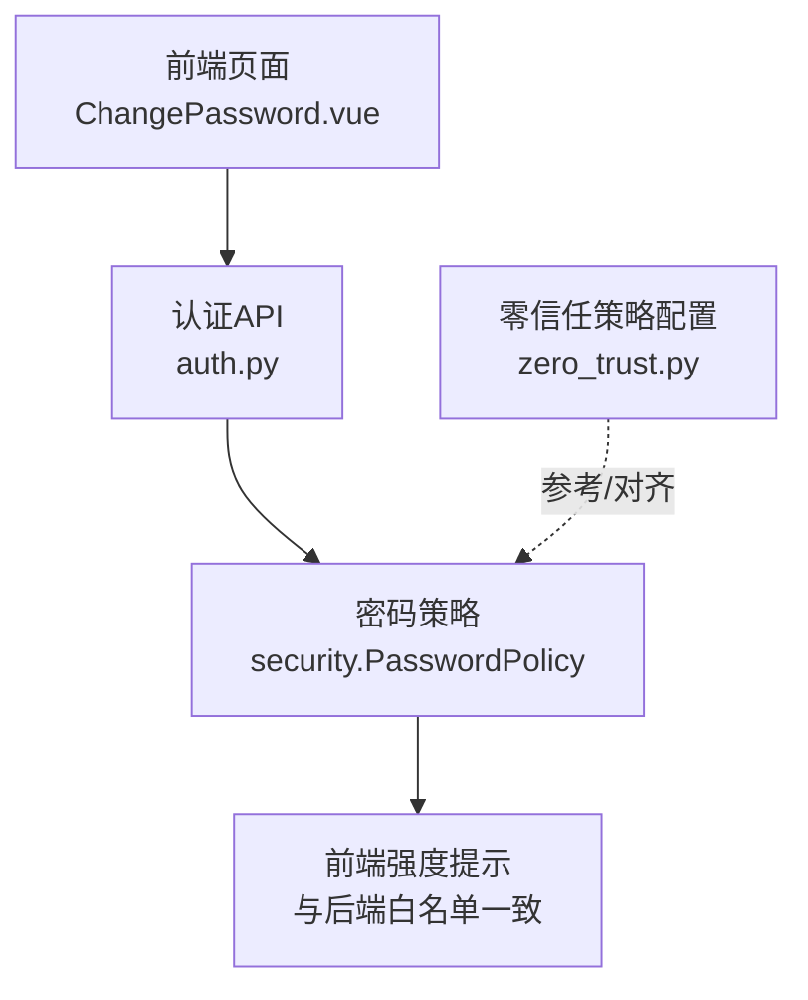
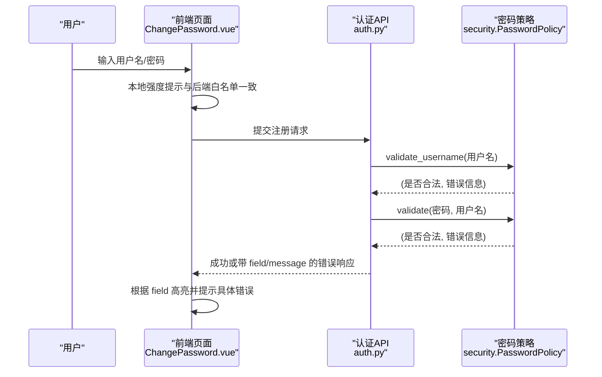
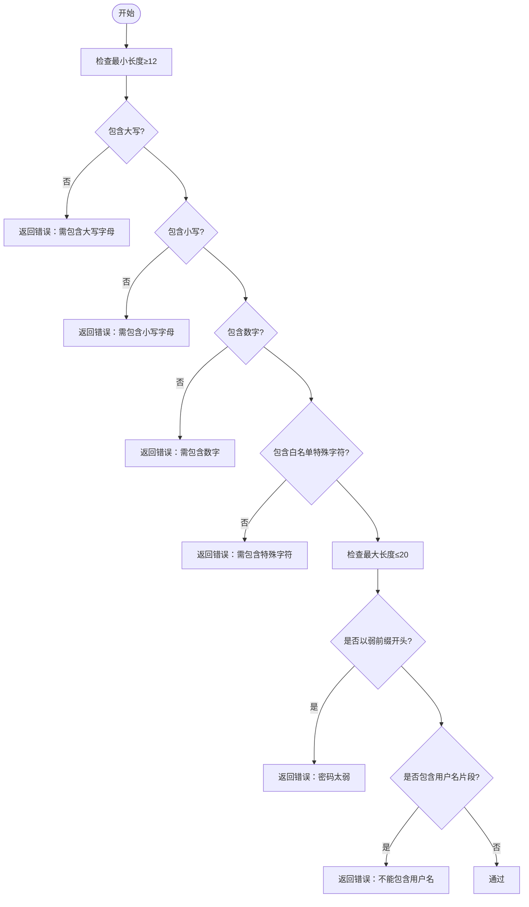
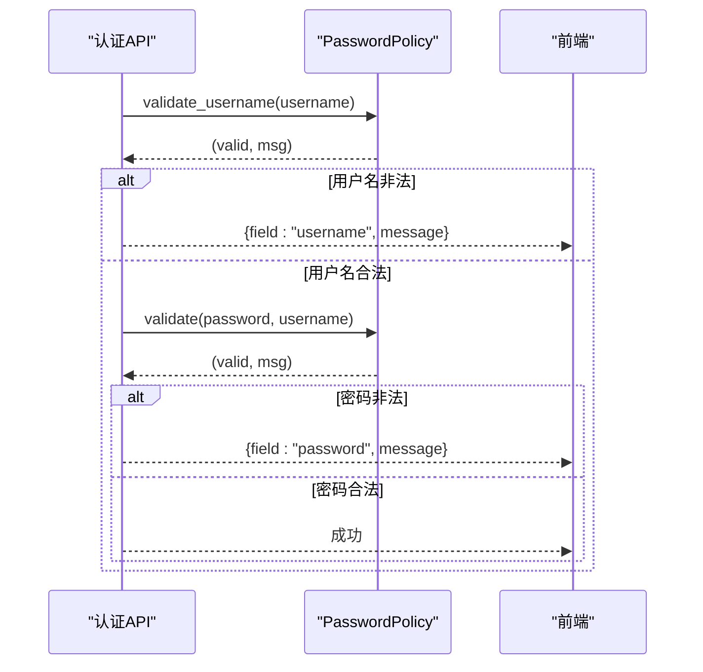
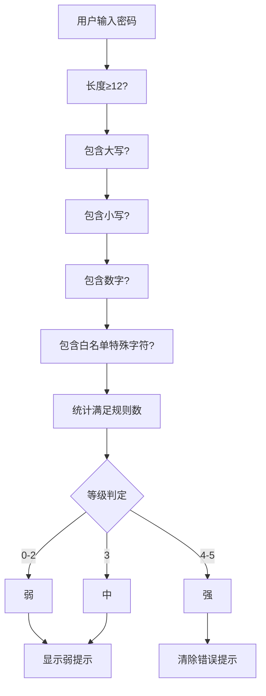
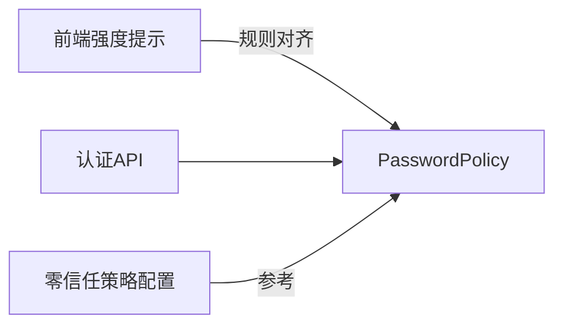

# 密码策略验证系统

<cite>
**本文引用的文件**
- [backend/app/core/security.py](file://backend/app/core/security.py)
- [backend/app/api/v1/auth/auth.py](file://backend/app/api/v1/auth/auth.py)
- [frontend/src/views/auth/ChangePassword.vue](file://frontend/src/views/auth/ChangePassword.vue)
- [frontend/tests/unit/views/auth/ChangePassword.test.ts](file://frontend/tests/unit/views/auth/ChangePassword.test.ts)
- [backend/app/api/v1/system/zero_trust.py](file://backend/app/api/v1/system/zero_trust.py)
</cite>

## 目录
1. [简介](#简介)
2. [项目结构](#项目结构)
3. [核心组件](#核心组件)
4. [架构总览](#架构总览)
5. [详细组件分析](#详细组件分析)
6. [依赖关系分析](#依赖关系分析)
7. [性能考虑](#性能考虑)
8. [故障排查指南](#故障排查指南)
9. [结论](#结论)
10. [附录](#附录)

## 简介
本文件为密码策略验证系统的实现文档，聚焦于后端 PasswordPolicy 类的架构设计与规则实现，覆盖最小长度、复杂度校验、弱密码检测、用户名包含检查等；同时说明前端与后端的策略一致性保障机制、错误消息设计以及用户体验优化。文档还给出可操作的配置示例与扩展方法，帮助团队在保持安全基线的同时灵活定制策略。

## 项目结构
围绕密码策略的关键代码分布在以下位置：
- 后端策略定义与校验逻辑：backend/app/core/security.py
- 注册流程中调用策略校验：backend/app/api/v1/auth/auth.py
- 前端强度提示与规则一致性：frontend/src/views/auth/ChangePassword.vue
- 前端单元测试（强度等级与错误处理）：frontend/tests/unit/views/auth/ChangePassword.test.ts
- 零信任策略中的“密码强度策略”条目（概念性配置）：backend/app/api/v1/system/zero_trust.py

**图表来源**
- [backend/app/core/security.py:524-569](file://backend/app/core/security.py#L524-L569)
- [backend/app/api/v1/auth/auth.py:797-804](file://backend/app/api/v1/auth/auth.py#L797-L804)
- [frontend/src/views/auth/ChangePassword.vue:248-290](file://frontend/src/views/auth/ChangePassword.vue#L248-L290)
- [backend/app/api/v1/system/zero_trust.py:144-156](file://backend/app/api/v1/system/zero_trust.py#L144-L156)

**章节来源**
- [backend/app/core/security.py:524-569](file://backend/app/core/security.py#L524-L569)
- [backend/app/api/v1/auth/auth.py:797-804](file://backend/app/api/v1/auth/auth.py#L797-L804)
- [frontend/src/views/auth/ChangePassword.vue:248-290](file://frontend/src/views/auth/ChangePassword.vue#L248-L290)
- [backend/app/api/v1/system/zero_trust.py:144-156](file://backend/app/api/v1/system/zero_trust.py#L144-L156)

## 核心组件
- PasswordPolicy：集中管理密码策略常量与校验逻辑，提供 validate 与 validate_username 两个静态方法。
- 认证API：在注册流程中对用户名与密码进行策略校验，并将错误以结构化字段返回给前端。
- 前端强度提示：在输入时实时计算并展示密码强度，规则与后端保持一致，提升用户引导体验。
- 零信任策略配置：作为策略治理的参考项，体现对密码强度的强制要求。

**章节来源**
- [backend/app/core/security.py:524-569](file://backend/app/core/security.py#L524-L569)
- [backend/app/api/v1/auth/auth.py:797-804](file://backend/app/api/v1/auth/auth.py#L797-L804)
- [frontend/src/views/auth/ChangePassword.vue:248-290](file://frontend/src/views/auth/ChangePassword.vue#L248-L290)
- [backend/app/api/v1/system/zero_trust.py:144-156](file://backend/app/api/v1/system/zero_trust.py#L144-L156)

## 架构总览
下图展示了从前端输入到后端策略校验的完整流程，包括用户名格式校验、密码复杂度与弱密码检测、以及错误消息的结构化返回。

**图表来源**
- [backend/app/api/v1/auth/auth.py:797-804](file://backend/app/api/v1/auth/auth.py#L797-L804)
- [backend/app/core/security.py:524-569](file://backend/app/core/security.py#L524-L569)
- [frontend/src/views/auth/ChangePassword.vue:248-290](file://frontend/src/views/auth/ChangePassword.vue#L248-L290)

## 详细组件分析

### PasswordPolicy 类分析
- 最小长度：要求至少 12 位。
- 复杂度要求：必须包含大写字母、小写字母、数字和特殊字符。
- 特殊字符白名单：限定为 !@#$%^&*()-_=+[]{}|;:,.<>?，与前端正则保持一致，避免歧义。
- 最大长度：限制不超过 20 位，防止过长输入带来风险。
- 弱密码黑名单：禁止以常见弱前缀开头（如 admin、root、123、password、qwerty）。
- 用户名包含检查：密码不得包含用户名拆分后的任意片段（大小写不敏感）。
- 用户名格式校验：支持字母、数字、下划线、短横线及中文字符，长度 3–20。

**图表来源**
- [backend/app/core/security.py:524-569](file://backend/app/core/security.py#L524-L569)

**章节来源**
- [backend/app/core/security.py:524-569](file://backend/app/core/security.py#L524-L569)

### 认证API集成与错误处理
- 注册流程中先校验用户名格式，再校验密码策略，确保前后端一致的约束。
- 错误以结构化方式返回，包含 field 与 message，便于前端精准定位与提示。
- 当用户名或密码不符合策略时，抛出业务异常，由统一错误处理器转换为标准响应。

**图表来源**
- [backend/app/api/v1/auth/auth.py:797-804](file://backend/app/api/v1/auth/auth.py#L797-L804)
- [backend/app/core/security.py:524-569](file://backend/app/core/security.py#L524-L569)

**章节来源**
- [backend/app/api/v1/auth/auth.py:797-804](file://backend/app/api/v1/auth/auth.py#L797-L804)
- [backend/app/core/security.py:524-569](file://backend/app/core/security.py#L524-L569)

### 前端强度提示与一致性保证
- 实时计算满足的规则数量：长度≥12、大写、小写、数字、特殊字符。
- 特殊字符正则与后端白名单完全一致，避免前后端不一致导致的误判。
- 根据满足规则数设置强度等级（弱/中/强），并在达到一定强度时清除错误提示，提升交互体验。
- 测试用例覆盖了不同强度等级与错误处理分支，确保行为稳定。

**图表来源**
- [frontend/src/views/auth/ChangePassword.vue:248-290](file://frontend/src/views/auth/ChangePassword.vue#L248-L290)
- [frontend/tests/unit/views/auth/ChangePassword.test.ts:155-177](file://frontend/tests/unit/views/auth/ChangePassword.test.ts#L155-L177)

**章节来源**
- [frontend/src/views/auth/ChangePassword.vue:248-290](file://frontend/src/views/auth/ChangePassword.vue#L248-L290)
- [frontend/tests/unit/views/auth/ChangePassword.test.ts:155-177](file://frontend/tests/unit/views/auth/ChangePassword.test.ts#L155-L177)

### 零信任策略中的密码强度策略
- 零信任模块中包含“密码强度策略”的配置项，用于描述强制要求（如最小长度、复杂度等），可作为策略治理的参考。
- 该配置与 PasswordPolicy 的具体实现应保持一致，确保策略在不同层面的一致性。

**章节来源**
- [backend/app/api/v1/system/zero_trust.py:144-156](file://backend/app/api/v1/system/zero_trust.py#L144-L156)

## 依赖关系分析
- PasswordPolicy 被认证API直接调用，形成“前端→API→策略”的单向依赖。
- 前端强度提示独立于后端，但通过共享规则（长度阈值、特殊字符集合）实现一致性。
- 零信任策略配置作为高层策略声明，应与底层实现同步更新。

**图表来源**
- [backend/app/core/security.py:524-569](file://backend/app/core/security.py#L524-L569)
- [backend/app/api/v1/auth/auth.py:797-804](file://backend/app/api/v1/auth/auth.py#L797-L804)
- [frontend/src/views/auth/ChangePassword.vue:248-290](file://frontend/src/views/auth/ChangePassword.vue#L248-L290)
- [backend/app/api/v1/system/zero_trust.py:144-156](file://backend/app/api/v1/system/zero_trust.py#L144-L156)

**章节来源**
- [backend/app/core/security.py:524-569](file://backend/app/core/security.py#L524-L569)
- [backend/app/api/v1/auth/auth.py:797-804](file://backend/app/api/v1/auth/auth.py#L797-L804)
- [frontend/src/views/auth/ChangePassword.vue:248-290](file://frontend/src/views/auth/ChangePassword.vue#L248-L290)
- [backend/app/api/v1/system/zero_trust.py:144-156](file://backend/app/api/v1/system/zero_trust.py#L144-L156)

## 性能考虑
- 复杂度校验使用线性扫描，时间复杂度 O(n)，n 为密码长度，开销极低。
- 特殊字符检查基于集合查找，平均 O(1)，整体性能良好。
- 建议将策略常量集中管理，避免重复计算与多处硬编码带来的维护成本。

[本节为通用指导，无需特定文件引用]

## 故障排查指南
- 前端提示与后端不一致：
  - 检查前端特殊字符正则是否与后端白名单一致。
  - 确认长度阈值与复杂度规则是否同步更新。
- 注册失败且错误不明确：
  - 查看后端返回的 field 与 message，定位具体校验失败点。
  - 若为密码策略错误，优先调整密码复杂度或避免弱前缀。
- 用户名格式问题：
  - 确保用户名仅包含允许的字符集，长度在 3–20 之间。

**章节来源**
- [backend/app/api/v1/auth/auth.py:797-804](file://backend/app/api/v1/auth/auth.py#L797-L804)
- [backend/app/core/security.py:524-569](file://backend/app/core/security.py#L524-L569)
- [frontend/src/views/auth/ChangePassword.vue:248-290](file://frontend/src/views/auth/ChangePassword.vue#L248-L290)

## 结论
PasswordPolicy 提供了清晰、可配置的密码策略实现，涵盖长度、复杂度、弱密码与用户名包含检查等关键安全点。前端通过一致的规则实现即时反馈，提升用户体验。建议在团队内统一维护策略常量，并通过测试用例保障前后端一致性。零信任策略配置可作为策略治理的参考，确保各层策略协同一致。

[本节为总结性内容，无需特定文件引用]

## 附录

### 验证规则配置示例
- 最小长度：12 位
- 复杂度：必须包含大写、小写、数字、特殊字符
- 特殊字符白名单：!@#$%^&*()-_=+[]{}|;:,.<>?
- 最大长度：20 位
- 弱密码前缀：admin、root、123、password、qwerty
- 用户名包含检查：密码不得包含用户名拆分后的片段

**章节来源**
- [backend/app/core/security.py:524-569](file://backend/app/core/security.py#L524-L569)

### 自定义策略扩展方法
- 新增复杂度要求：在 PasswordPolicy 中添加新的布尔标志与方法调用，并在 validate 中按顺序检查。
- 扩展白名单：修改 SPECIAL_WHITELIST 集合，并确保前端正则同步更新。
- 增加弱密码规则：在 WEAK_PASSWORD_PREFIXES 中追加常见弱前缀，或在 validate 中引入更复杂的模式匹配。
- 增强用户名检查：扩展 FORBIDDEN_USERNAME_PARTS 或改进分割逻辑，以支持更多场景。

**章节来源**
- [backend/app/core/security.py:524-569](file://backend/app/core/security.py#L524-L569)
- [frontend/src/views/auth/ChangePassword.vue:248-290](file://frontend/src/views/auth/ChangePassword.vue#L248-L290)

### 错误消息设计与用户体验优化
- 错误消息明确指向失败原因（如长度不足、缺少某类字符、弱密码前缀、包含用户名等）。
- 前端根据 field 精准高亮对应输入框，并显示具体错误信息，减少用户困惑。
- 强度指示器实时反馈，帮助用户快速理解如何提升密码强度。

**章节来源**
- [backend/app/api/v1/auth/auth.py:797-804](file://backend/app/api/v1/auth/auth.py#L797-L804)
- [frontend/src/views/auth/ChangePassword.vue:248-290](file://frontend/src/views/auth/ChangePassword.vue#L248-L290)
- [frontend/tests/unit/views/auth/ChangePassword.test.ts:255-285](file://frontend/tests/unit/views/auth/ChangePassword.test.ts#L255-L285)