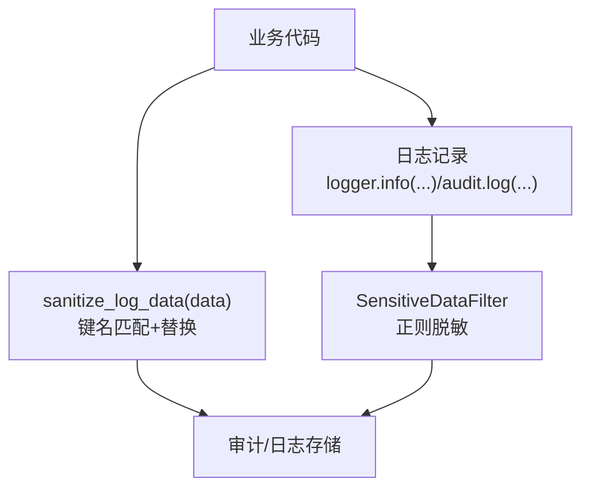
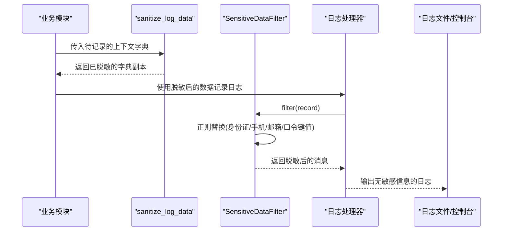
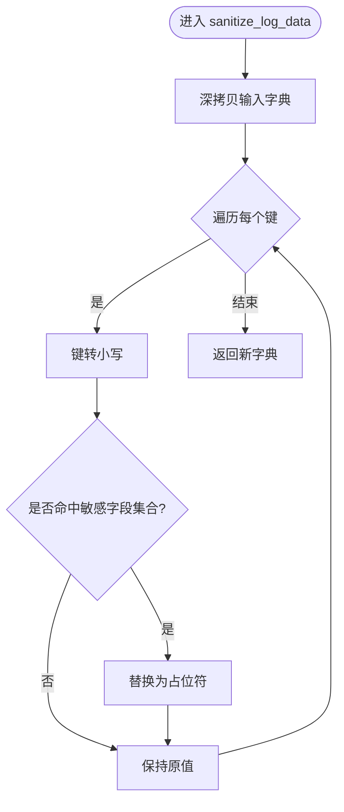
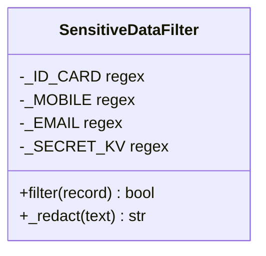
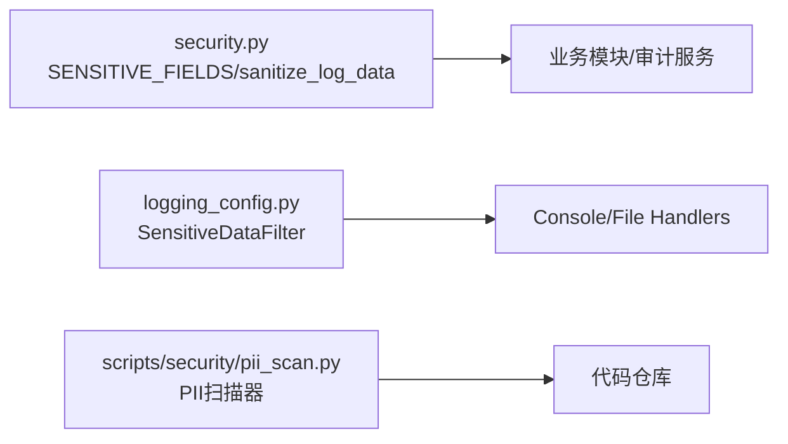

# 敏感数据脱敏处理

<cite>
**本文引用的文件**
- [security.py](file://backend/app/core/security.py)
- [logging_config.py](file://backend/app/core/logging_config.py)
- [logging.py](file://backend/app/core/logging.py)
- [pii_scan.py](file://scripts/security/pii_scan.py)
- [test_logging_redaction_cov.py](file://backend/tests/unit/test_logging_redaction_cov.py)
- [test_logging_config_cov.py](file://backend/tests/unit/test_logging_config_cov.py)
- [config.py](file://backend/app/core/config.py)
</cite>

## 目录
1. [简介](#简介)
2. [项目结构](#项目结构)
3. [核心组件](#核心组件)
4. [架构总览](#架构总览)
5. [详细组件分析](#详细组件分析)
6. [依赖关系分析](#依赖关系分析)
7. [性能考虑](#性能考虑)
8. [故障排查指南](#故障排查指南)
9. [结论](#结论)
10. [附录：配置与扩展](#附录：配置与扩展)

## 简介
本技术文档聚焦于“敏感数据脱敏处理系统”，围绕后端日志与结构化数据的脱敏能力，重点说明 sanitize_log_data 函数的实现机制、敏感字段识别策略、日志层正则脱敏、安全考量、配置方法与扩展方式，以及与其他安全组件的集成实践。目标是帮助开发者在保障可观测性的同时，防止敏感信息泄露到日志系统与外部通道。

## 项目结构
本项目将敏感数据脱敏分为两层：
- 数据结构层：对传入字典进行键名匹配并替换为占位符，避免将敏感键值直接写入日志或审计记录。
- 日志层：通过自定义过滤器对每条日志消息执行正则替换，覆盖身份证号、手机号、邮箱及常见口令/令牌键值对，确保最终落盘或输出的日志不包含明文敏感信息。

图表来源
- [security.py:180-202](file://backend/app/core/security.py#L180-L202)
- [logging_config.py:75-119](file://backend/app/core/logging_config.py#L75-L119)

章节来源
- [security.py:180-202](file://backend/app/core/security.py#L180-L202)
- [logging_config.py:75-119](file://backend/app/core/logging_config.py#L75-L119)

## 核心组件
- sanitize_log_data：对字典型数据进行键名扫描，命中敏感字段则替换为占位符，用于在记录审计或日志前清理上下文数据。
- SensitiveDataFilter：注册到所有日志处理器，对每条日志消息执行正则替换，覆盖身份证、手机、邮箱、常见口令/令牌键值对等。
- PII 扫描器：静态扫描脚本，检查 API 响应、导出、日志通道是否存在未脱敏的敏感字段打印或返回。

章节来源
- [security.py:180-202](file://backend/app/core/security.py#L180-L202)
- [logging_config.py:75-119](file://backend/app/core/logging_config.py#L75-L119)
- [pii_scan.py:27-45](file://scripts/security/pii_scan.py#L27-L45)

## 架构总览
下图展示了从业务调用到最终落盘的完整脱敏路径，包括结构化数据清洗与日志层正则过滤两个阶段。

图表来源
- [security.py:186-202](file://backend/app/core/security.py#L186-L202)
- [logging_config.py:98-119](file://backend/app/core/logging_config.py#L98-L119)

## 详细组件分析

### sanitize_log_data：键名匹配与替换
- 功能要点
  - 输入为字典，内部深拷贝后遍历键名，忽略大小写匹配敏感字段集合。
  - 命中即替换为固定占位符，避免任何明文敏感值进入后续流程。
- 设计原则
  - 基于键名的白名单式保护，适用于请求体、上下文、审计元数据等结构化数据。
  - 不递归处理嵌套结构（当前实现仅对顶层键生效），如需支持嵌套需扩展。
- 复杂度
  - 时间复杂度 O(n)，n 为字典键数；空间复杂度 O(n) 用于深拷贝。
- 可扩展性
  - 可通过扩展 SENSITIVE_FIELDS 增加新敏感键名，如新增 token_version、refresh_token 等。

图表来源
- [security.py:186-202](file://backend/app/core/security.py#L186-L202)

章节来源
- [security.py:180-202](file://backend/app/core/security.py#L180-L202)

### SensitiveDataFilter：日志层正则脱敏
- 功能要点
  - 针对日志消息文本执行正则替换，覆盖：
    - 身份证号：18位数字或末位X/x
    - 手机号：以1开头且第二位为3-9的11位数字
    - 邮箱：标准邮箱格式
    - 键值对形式的口令/令牌：如 password=xxx、token: xxx、api_key=xxx 等，且要求值长度至少4字符以避免误伤短值
  - 若发生异常，不会阻断日志输出，保证可用性优先。
- 设计原则
  - 使用负向后瞻 (?<![a-z0-9]) 而非 \b，解决复合键名（如 access_token=/refresh_token=）漏脱敏问题。
  - 统一替换为 "***"，便于审计与告警识别。
- 复杂度
  - 每行日志进行多次正则替换，时间复杂度近似 O(L)，L 为消息长度；整体开销可控。
- 集成点
  - 在 configure_logging 中创建实例并添加到所有 handler，确保控制台与文件输出均受保护。

图表来源
- [logging_config.py:75-119](file://backend/app/core/logging_config.py#L75-L119)

章节来源
- [logging_config.py:75-119](file://backend/app/core/logging_config.py#L75-L119)
- [test_logging_redaction_cov.py:5-17](file://backend/tests/unit/test_logging_redaction_cov.py#L5-L17)
- [test_logging_config_cov.py:75-108](file://backend/tests/unit/test_logging_config_cov.py#L75-L108)

### PII 扫描器：三通道静态检查
- 功能要点
  - 扫描后端 Python 与前端的 TypeScript/Vue 文件，检测：
    - API 响应通道：是否在 to_dict/response/路由返回中暴露敏感字段而未脱敏
    - Excel 导出通道：导出逻辑是否包含敏感字段且未调用脱敏
    - 日志通道：是否出现明文打印敏感字段的模式
- 判定规则
  - 同文件存在 desensitize/encrypt/mask 标记视为已防护
  - 高危项为零方可发布
- 价值
  - 作为发布门禁，提前发现遗漏的脱敏点，降低生产风险

章节来源
- [pii_scan.py:27-45](file://scripts/security/pii_scan.py#L27-L45)
- [pii_scan.py:51-86](file://scripts/security/pii_scan.py#L51-L86)
- [pii_scan.py:94-113](file://scripts/security/pii_scan.py#L94-L113)

## 依赖关系分析
- sanitize_log_data 依赖 SENSITIVE_FIELDS 常量集合，集中管理敏感键名。
- SensitiveDataFilter 依赖内置 re 模块的正则表达式，独立于业务模块，易于维护。
- logging_config.configure_logging 负责初始化日志系统并将过滤器注入所有处理器。
- PII 扫描器依赖路径遍历与正则匹配，对前后端代码进行静态扫描。

图表来源
- [security.py:180-202](file://backend/app/core/security.py#L180-L202)
- [logging_config.py:161-247](file://backend/app/core/logging_config.py#L161-L247)
- [pii_scan.py:94-113](file://scripts/security/pii_scan.py#L94-L113)

章节来源
- [security.py:180-202](file://backend/app/core/security.py#L180-L202)
- [logging_config.py:161-247](file://backend/app/core/logging_config.py#L161-L247)
- [pii_scan.py:94-113](file://scripts/security/pii_scan.py#L94-L113)

## 性能考虑
- 结构化数据脱敏
  - 每次调用进行深拷贝与键遍历，适合中小规模上下文；对于高频大对象建议缓存或按需脱敏。
- 日志层正则脱敏
  - 每行日志进行多次正则替换，建议在低级别日志（DEBUG）下谨慎开启或限制范围，避免高吞吐场景下的额外开销。
- 轮转与稳定性
  - 日志处理器采用 Windows 安全的轮转实现，避免因句柄占用导致轮转失败；脱敏失败不会中断日志输出，提升鲁棒性。

[本节提供通用指导，无需特定文件引用]

## 故障排查指南
- 脱敏未生效
  - 确认日志系统已通过 init_logging 或 configure_logging 初始化，并确保 SensitiveDataFilter 已添加到所有处理器。
  - 检查日志消息是否为字符串；若为复杂对象，请先转换为字符串或使用 sanitize_log_data 预处理。
- 误伤正常内容
  - 调整 _SECRET_KV 的值长度阈值或键名匹配规则，避免短值被替换。
  - 使用单元测试验证边界情况（如空串、None、异常 getMessage）。
- 审计记录仍含敏感信息
  - 在记录审计前调用 sanitize_log_data 清理上下文字典，确保敏感键被替换。

章节来源
- [logging_config.py:161-247](file://backend/app/core/logging_config.py#L161-L247)
- [test_logging_config_cov.py:75-108](file://backend/tests/unit/test_logging_config_cov.py#L75-L108)

## 结论
本系统通过“结构化数据键名匹配”和“日志层正则替换”双保险，有效防止敏感信息泄露到日志系统与审计记录中。结合 PII 静态扫描器，可在开发阶段提前发现遗漏的脱敏点，满足合规与发布门禁要求。建议在生产环境中持续运行扫描任务，并根据业务演进定期更新敏感字段列表与正则规则。

[本节总结性内容，无需特定文件引用]

## 附录：配置与扩展

### 配置方法
- 日志级别与格式
  - 通过 Settings 中的 LOG_LEVEL、LOG_FORMAT、LOG_FILE、LOG_ROTATION、LOG_MAX_SIZE_MB、LOG_BACKUP_COUNT 控制日志行为。
- 初始化入口
  - 调用 app.core.logging_config.init_logging() 完成统一初始化；旧入口 app.core.logging.init_logging() 会代理到该函数。

章节来源
- [config.py:161-168](file://backend/app/core/config.py#L161-L168)
- [logging.py:16-20](file://backend/app/core/logging.py#L16-L20)
- [logging_config.py:256-274](file://backend/app/core/logging_config.py#L256-L274)

### 自定义规则扩展
- 扩展敏感键名
  - 在 security.py 的 SENSITIVE_FIELDS 中添加新键名（如 refresh_token、client_secret 等），使 sanitize_log_data 自动保护。
- 扩展日志正则
  - 在 logging_config.py 的 SensitiveDataFilter 中添加新的正则模式，例如新增 OAuth 相关键名或第三方 SDK 的敏感头。
- 扩展 PII 扫描器
  - 在 scripts/security/pii_scan.py 的 SENSITIVE 列表中补充新字段，并在 LOG_DANGER_RE 中追加危险模式，以覆盖更多场景。

章节来源
- [security.py:180-183](file://backend/app/core/security.py#L180-L183)
- [logging_config.py:82-96](file://backend/app/core/logging_config.py#L82-L96)
- [pii_scan.py:27-45](file://scripts/security/pii_scan.py#L27-L45)

### 使用示例（路径指引）
- 在业务模块记录审计前，先对上下文字典进行脱敏：
  - 参考路径：[security.py:186-202](file://backend/app/core/security.py#L186-L202)
- 在中间件或请求处理中记录请求信息时，确保日志消息经过脱敏：
  - 参考路径：[logging_config.py:98-119](file://backend/app/core/logging_config.py#L98-L119)
- 在测试中验证脱敏效果：
  - 参考路径：[test_logging_redaction_cov.py:5-17](file://backend/tests/unit/test_logging_redaction_cov.py#L5-L17)
  - 参考路径：[test_logging_config_cov.py:75-108](file://backend/tests/unit/test_logging_config_cov.py#L75-L108)

### 与其他安全组件的集成与最佳实践
- 与认证/鉴权
  - 在 get_current_user 等认证链路中，避免将 token、secret 等敏感字段写入日志；必要时使用 sanitize_log_data 清理上下文。
- 与审计服务
  - 审计记录应使用脱敏后的上下文；审计日志写入失败时应回滚并记录非敏感错误信息。
- 与上传/导出
  - 导出文件与上传文件名需进行安全校验与脱敏；PII 扫描器可辅助发现未脱敏的导出逻辑。
- 最佳实践
  - 默认开启日志层脱敏；在高吞吐场景下评估 DEBUG 级别日志的影响。
  - 将 PII 扫描纳入 CI/CD 门禁，零高危方可发布。
  - 定期评审敏感字段列表与正则规则，确保覆盖新出现的敏感数据形态。

[本节提供通用指导，无需特定文件引用]