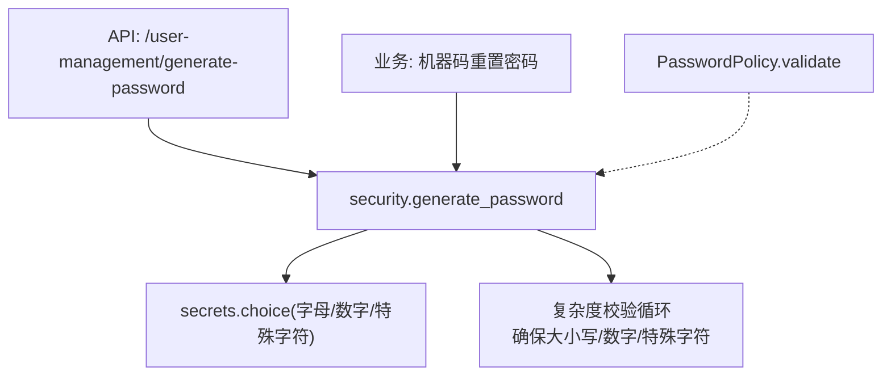
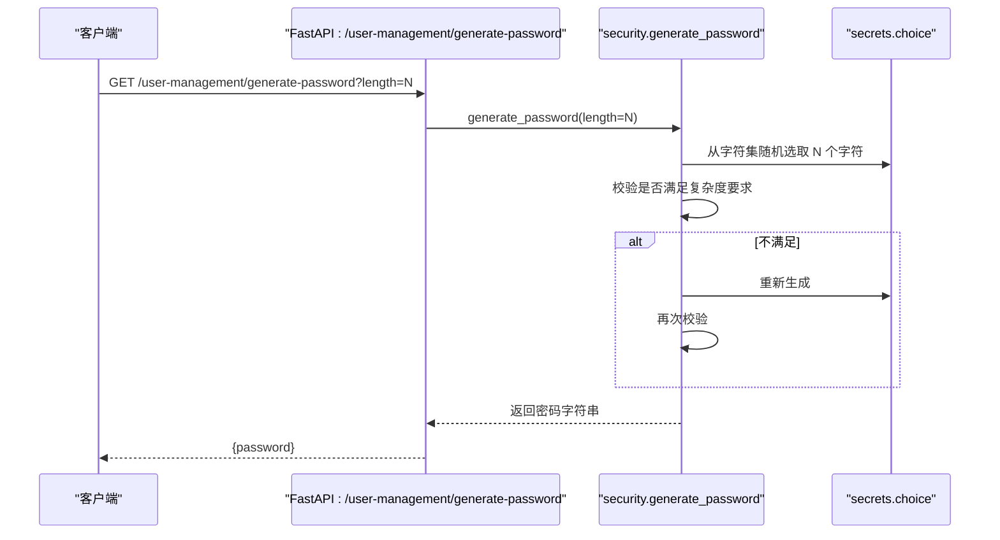
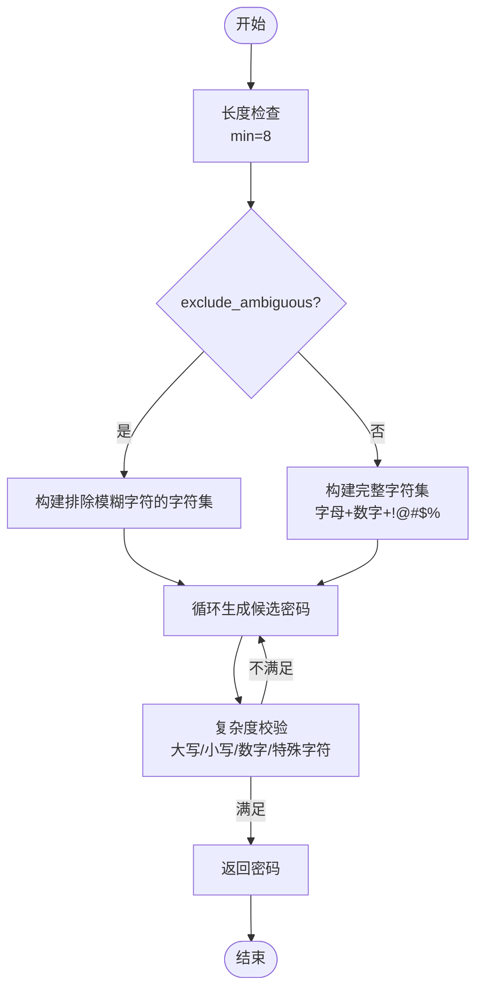
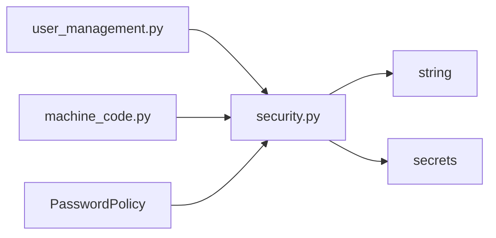

# 随机密码生成器

<cite>
**本文引用的文件**
- [backend/app/core/security.py](file://backend/app/core/security.py)
- [backend/app/api/v1/auth/user_management.py](file://backend/app/api/v1/auth/user_management.py)
- [backend/app/api/v1/machine_code.py](file://backend/app/api/v1/machine_code.py)
- [backend/app/utils/common.py](file://backend/app/utils/common.py)
- [backend/tests/unit/test_core_modules_full.py](file://backend/tests/unit/test_core_modules_full.py)
</cite>

## 目录
1. [简介](#简介)
2. [项目结构](#项目结构)
3. [核心组件](#核心组件)
4. [架构总览](#架构总览)
5. [详细组件分析](#详细组件分析)
6. [依赖关系分析](#依赖关系分析)
7. [性能考虑](#性能考虑)
8. [故障排查指南](#故障排查指南)
9. [结论](#结论)
10. [附录](#附录)

## 简介
本文档面向“随机密码生成器”的使用与实现说明，重点围绕 generate_password 函数展开，涵盖：
- 密码长度控制、字符集选择、复杂度保证机制
- 排除模糊字符选项的作用与适用场景
- 安全考量（基于 secrets 模块的不可预测性）
- 典型使用场景示例（用户注册、密码重置、API 密钥等）
- 批量生成的性能特性与注意事项
- 密码强度评估与后续处理的最佳实践

## 项目结构
与密码生成相关的关键位置如下：
- 核心实现：backend/app/core/security.py（generate_password、PasswordPolicy、敏感字段脱敏等）
- API 暴露：backend/app/api/v1/auth/user_management.py（/user-management/generate-password）
- 业务调用：backend/app/api/v1/machine_code.py（机器码重置密码时生成强密码）
- 工具辅助：backend/app/utils/common.py（secrets 封装工具）
- 测试用例：backend/tests/unit/test_core_modules_full.py（基础功能验证）

图表来源
- [backend/app/api/v1/auth/user_management.py:79-82](file://backend/app/api/v1/auth/user_management.py#L79-L82)
- [backend/app/core/security.py:151-169](file://backend/app/core/security.py#L151-L169)
- [backend/app/api/v1/machine_code.py:453-455](file://backend/app/api/v1/machine_code.py#L453-L455)

章节来源
- [backend/app/core/security.py:151-169](file://backend/app/core/security.py#L151-L169)
- [backend/app/api/v1/auth/user_management.py:79-82](file://backend/app/api/v1/auth/user_management.py#L79-L82)
- [backend/app/api/v1/machine_code.py:453-455](file://backend/app/api/v1/machine_code.py#L453-L455)

## 核心组件
- generate_password(length=12, exclude_ambiguous=False)
  - 长度控制：最小长度为 8；默认 12；可通过参数调整
  - 字符集选择：
    - 不排除模糊字符：ASCII 字母 + 数字 + 特殊字符 !@#$%
    - 排除模糊字符：移除易混淆字符（如 l/1/I、O/0/o 等），并保留一组特殊字符
  - 复杂度保证：通过 while 循环重试，直到同时包含大写、小写、数字和至少一个非字母数字的特殊字符
  - 安全性：使用 secrets.choice 从字符集中选择字符，保证密码不可预测
- PasswordPolicy（策略校验）
  - 最小长度、必须包含大小写/数字/特殊字符、弱口令前缀检查、用户名包含检查等
  - 用于用户输入密码的校验，与自动生成密码形成互补
- 工具与集成
  - API 端点 /user-management/generate-password 可直接获取随机密码
  - 业务中在机器码重置密码时强制使用 exclude_ambiguous=True 提升可读性与可输入性

章节来源
- [backend/app/core/security.py:151-169](file://backend/app/core/security.py#L151-L169)
- [backend/app/core/security.py:524-569](file://backend/app/core/security.py#L524-L569)
- [backend/app/api/v1/auth/user_management.py:79-82](file://backend/app/api/v1/auth/user_management.py#L79-L82)
- [backend/app/api/v1/machine_code.py:453-455](file://backend/app/api/v1/machine_code.py#L453-L455)

## 架构总览
下图展示了密码生成在系统中的调用路径与安全边界：

图表来源
- [backend/app/api/v1/auth/user_management.py:79-82](file://backend/app/api/v1/auth/user_management.py#L79-L82)
- [backend/app/core/security.py:151-169](file://backend/app/core/security.py#L151-L169)

## 详细组件分析

### generate_password 实现原理
- 长度控制
  - 若传入 length < 8，则自动调整为 8，避免过短导致熵不足
  - 默认 length = 12，适合大多数场景
- 字符集选择
  - 不排除模糊字符：使用 ASCII 字母、数字与特殊字符 !@#$%
  - 排除模糊字符：显式剔除易混淆字符（例如 l/1/I、O/0/o 等），保留一组特殊字符，便于人工输入与识别
- 复杂度保证
  - 采用 while 循环不断生成候选密码，直至满足：
    - 至少一个大写字母
    - 至少一个小写字母
    - 至少一个数字
    - 至少一个非字母数字的特殊字符
  - 该机制确保每次返回的密码均满足基本复杂度要求
- 安全性
  - 使用 secrets.choice 进行随机选择，属于密码学安全的随机源，避免使用伪随机数生成器导致的可预测风险

图表来源
- [backend/app/core/security.py:151-169](file://backend/app/core/security.py#L151-L169)

章节来源
- [backend/app/core/security.py:151-169](file://backend/app/core/security.py#L151-L169)

### 排除模糊字符选项的作用与适用场景
- 作用
  - 降低人工输入错误率：去除视觉上易混淆的字符（如 l/1/I、O/0/o 等）
  - 提高可打印性与可复制粘贴的可靠性
- 适用场景
  - 需要用户手动输入或电话沟通的场景（如初始密码下发、临时访问码）
  - 机器码重置密码流程中已强制启用 exclude_ambiguous=True，以提升可用性
- 不适用场景
  - 机器生成且无需人工输入的场合（如内部系统令牌、API Key），可使用默认字符集以获得更高熵

章节来源
- [backend/app/api/v1/machine_code.py:453-455](file://backend/app/api/v1/machine_code.py#L453-L455)
- [backend/app/core/security.py:151-169](file://backend/app/core/security.py#L151-L169)

### 密码生成的安全考虑
- 随机源
  - 使用 Python 标准库 secrets.choice，提供密码学安全的随机性，避免可预测性
- 复杂度约束
  - 强制包含大写、小写、数字、特殊字符，防止弱口令
- 日志与敏感信息
  - 系统内置敏感字段检测与日志脱敏逻辑，避免密码泄露到日志
- 存储与传输
  - 密码不应以明文持久化；应使用哈希存储（见 get_password_hash）
  - 传输过程中建议使用 HTTPS 保护

章节来源
- [backend/app/core/security.py:151-169](file://backend/app/core/security.py#L151-L169)
- [backend/app/core/security.py:180-202](file://backend/app/core/security.py#L180-L202)

### 不同场景下的密码生成示例
- 用户注册
  - 管理员创建用户时，若未提供密码，将自动生成符合复杂度要求的密码
  - 参考：创建用户接口中调用 generate_password()
- 密码重置
  - 管理员重置用户密码时，可选择自定义密码或自动生成
  - 参考：重置密码接口中调用 generate_password()
- 机器码重置密码
  - 通过机器码验证后，强制使用 exclude_ambiguous=True 生成可读性更强的密码
  - 参考：机器码重置密码流程中调用 generate_password(length=16, exclude_ambiguous=True)
- API 密钥生成
  - 对于不需要人工输入的密钥，可使用工具类中的 token_urlsafe/token_hex 方法生成高熵字符串
  - 参考：utils.common 中的 secrets 封装

章节来源
- [backend/app/api/v1/auth/user_management.py:79-82](file://backend/app/api/v1/auth/user_management.py#L79-L82)
- [backend/app/api/v1/auth/user_management.py:210-219](file://backend/app/api/v1/auth/user_management.py#L210-L219)
- [backend/app/api/v1/machine_code.py:453-455](file://backend/app/api/v1/machine_code.py#L453-L455)
- [backend/app/utils/common.py:254-266](file://backend/app/utils/common.py#L254-L266)

### 密码强度评估与后续处理建议
- 强度评估
  - 使用 PasswordPolicy.validate 对用户输入的密码进行强度校验（长度、字符类型、弱口令前缀、用户名包含检查等）
  - 前端与后端保持一致的白名单规则，确保体验一致
- 后续处理
  - 首次登录强制修改密码（must_change_password=True）
  - 记录审计日志，追踪密码变更操作
  - 对异常情况进行限流与告警

章节来源
- [backend/app/core/security.py:524-569](file://backend/app/core/security.py#L524-L569)
- [backend/app/api/v1/machine_code.py:457-485](file://backend/app/api/v1/machine_code.py#L457-L485)

## 依赖关系分析
- 直接依赖
  - generate_password 依赖 Python 标准库 secrets 与 string
  - API 层依赖 security 模块提供的 generate_password
  - 业务层（机器码重置）依赖 security 与哈希函数
- 间接依赖
  - PasswordPolicy 与前端校验规则保持一致，减少交互摩擦
  - 日志与审计服务用于合规与追溯

图表来源
- [backend/app/api/v1/auth/user_management.py:79-82](file://backend/app/api/v1/auth/user_management.py#L79-L82)
- [backend/app/core/security.py:151-169](file://backend/app/core/security.py#L151-L169)
- [backend/app/api/v1/machine_code.py:453-455](file://backend/app/api/v1/machine_code.py#L453-L455)

章节来源
- [backend/app/core/security.py:151-169](file://backend/app/core/security.py#L151-L169)
- [backend/app/api/v1/auth/user_management.py:79-82](file://backend/app/api/v1/auth/user_management.py#L79-L82)
- [backend/app/api/v1/machine_code.py:453-455](file://backend/app/api/v1/machine_code.py#L453-L455)

## 性能考虑
- 单次生成
  - 复杂度校验为常数级检查（遍历一次密码串），开销很小
  - 由于字符集较大且复杂度条件宽松，重试次数通常极少
- 批量生成
  - 建议在后台任务或批处理中执行，避免阻塞请求线程
  - 合理设置并发度，避免短时间内大量调用造成 CPU 压力
  - 如需极高吞吐，可考虑预生成池化策略（注意内存占用与过期策略）
- 长度与熵
  - 长度越大，熵越高，但也会增加传输与存储成本
  - 一般推荐 12-16 位；对外部系统交互时可适当调整

[本节为通用指导，不直接分析具体文件]

## 故障排查指南
- 常见问题
  - 密码不符合复杂度：检查是否满足大小写、数字、特殊字符要求；必要时调整长度
  - 生成失败：确认 secrets 可用；检查字符集配置是否正确
  - 日志中出现明文密码：确认日志脱敏逻辑生效，避免记录敏感字段
- 定位步骤
  - 查看 API 响应与错误码
  - 检查后端日志中的敏感字段脱敏情况
  - 复现问题并抓取调用栈，确认是否在 generate_password 或 PasswordPolicy 阶段失败

章节来源
- [backend/app/core/security.py:180-202](file://backend/app/core/security.py#L180-L202)

## 结论
- generate_password 提供了安全、可控、复杂度保证的随机密码生成能力
- 通过 exclude_ambiguous 选项平衡了安全性与可输入性
- 结合 PasswordPolicy 可实现端到端的密码强度管理
- 在生产环境中应严格遵循安全最佳实践：使用 secrets、限制长度范围、避免明文存储与日志泄露

[本节为总结性内容，不直接分析具体文件]

## 附录
- 快速上手
  - 调用 /user-management/generate-password?length=16 获取随机密码
  - 在业务代码中导入 generate_password 并传入合适参数
- 最佳实践
  - 用户注册/重置：优先使用自动生成密码，并在首次登录强制改密
  - 机器码重置：使用 exclude_ambiguous=True 提升可输入性
  - API 密钥：使用 utils.common 中的 token_urlsafe/token_hex 生成高熵字符串
- 参考测试
  - 单元测试覆盖基础功能，可作为行为参考

章节来源
- [backend/tests/unit/test_core_modules_full.py:75-87](file://backend/tests/unit/test_core_modules_full.py#L75-L87)
- [backend/app/utils/common.py:254-266](file://backend/app/utils/common.py#L254-L266)