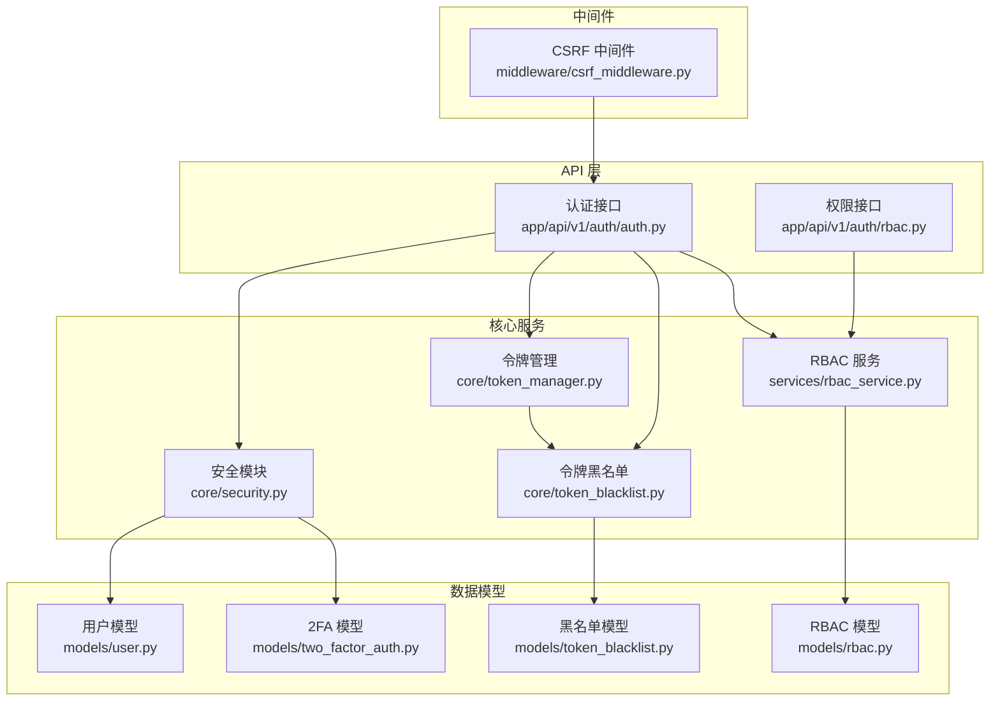
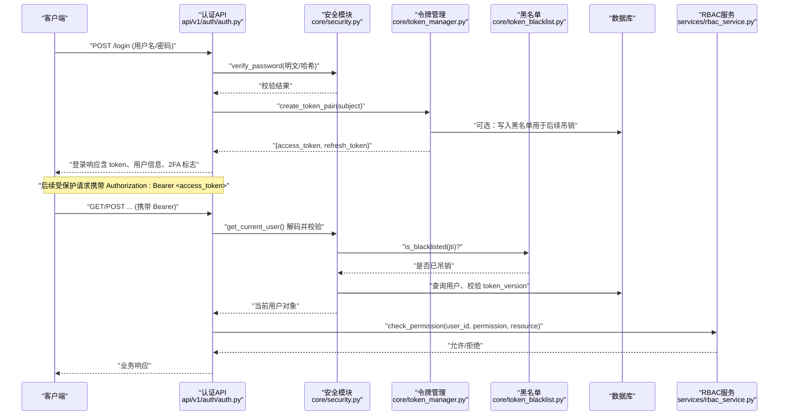
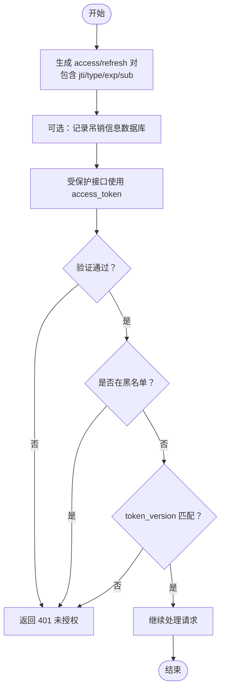
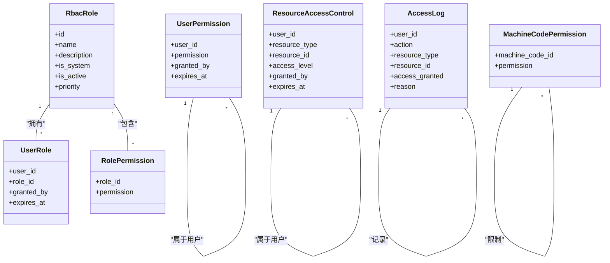
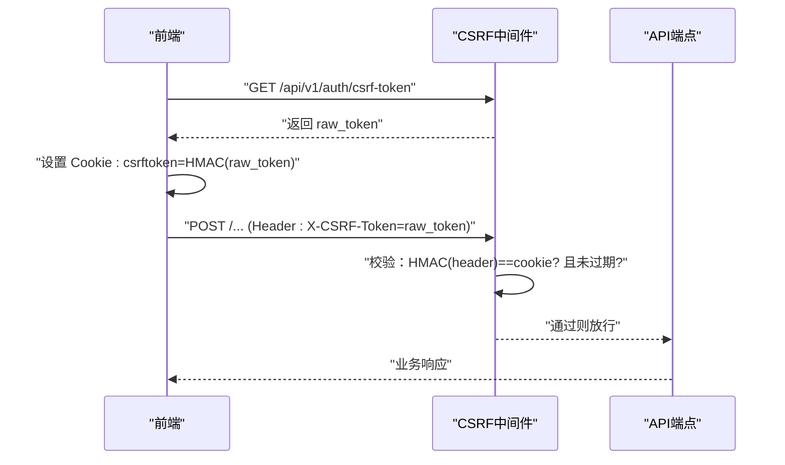
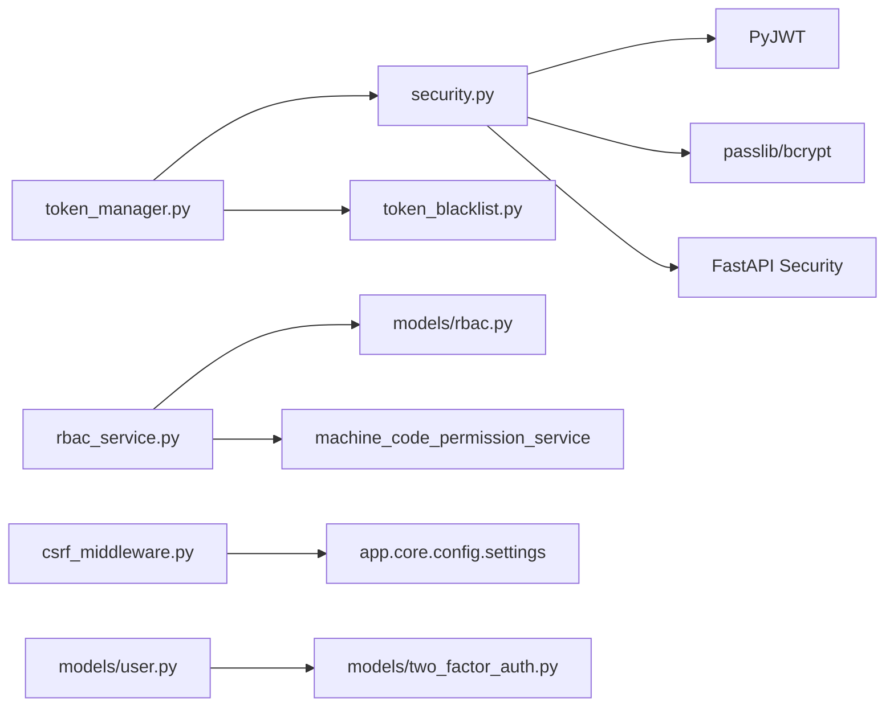

# 认证授权机制

<cite>
**本文引用的文件**
- [security.py](file://backend/app/core/security.py)
- [token_manager.py](file://backend/app/core/token_manager.py)
- [token_blacklist.py](file://backend/app/core/token_blacklist.py)
- [rbac.py](file://backend/app/models/rbac.py)
- [user.py](file://backend/app/models/user.py)
- [two_factor_auth.py](file://backend/app/models/two_factor_auth.py)
- [csrf_middleware.py](file://backend/app/middleware/csrf_middleware.py)
- [auth.py](file://backend/app/api/v1/auth/auth.py)
- [auth_schemas.py](file://backend/app/schemas/auth.py)
</cite>

## 目录
1. [简介](#简介)
2. [项目结构](#项目结构)
3. [核心组件](#核心组件)
4. [架构总览](#架构总览)
5. [详细组件分析](#详细组件分析)
6. [依赖关系分析](#依赖关系分析)
7. [性能与安全考量](#性能与安全考量)
8. [故障排查指南](#故障排查指南)
9. [结论](#结论)
10. [附录：使用模式与最佳实践](#附录使用模式与最佳实践)

## 简介
本文件面向“认证与授权”安全实现，系统性说明以下能力：
- JWT 令牌全生命周期管理：生成、验证、刷新、撤销（含黑名单与版本化强制下线）
- RBAC 角色权限模型：用户-角色-权限层次关系、资源级访问控制、数据隔离策略
- CSRF 防护：HMAC 签名增强、双提交 Cookie、过期校验与豁免路径
- 密码安全存储：bcrypt 哈希、长度兼容与策略校验
- 会话与会话吊销：基于 JTI 的黑名单持久化、token_version 全局失效
- 多因素认证（2FA）：TOTP/备用码流程与临时令牌
- 常见认证场景与最佳实践：登录、刷新、登出、权限检查、数据范围控制

## 项目结构
认证授权相关代码主要分布在后端 core、models、services、middleware 与 api 层：
- core 层提供安全原语（JWT、密码、速率限制、审计）、令牌管理与黑名单
- models 层定义 RBAC 实体、用户、2FA、黑名单等数据模型
- services 层封装 RBAC 业务逻辑（权限计算、分配、撤销、日志）
- middleware 层提供 CSRF 保护中间件
- api 层暴露认证与权限接口（登录、刷新、2FA、RBAC 管理）

**图表来源**
- [security.py:210-336](file://backend/app/core/security.py#L210-L336)
- [token_manager.py:64-240](file://backend/app/core/token_manager.py#L64-L240)
- [token_blacklist.py:27-163](file://backend/app/core/token_blacklist.py#L27-L163)
- [rbac_service.py:133-222](file://backend/app/services/rbac_service.py#L133-L222)
- [user.py:26-152](file://backend/app/models/user.py#L26-L152)
- [rbac.py:31-263](file://backend/app/models/rbac.py#L31-L263)
- [two_factor_auth.py:13-39](file://backend/app/models/two_factor_auth.py#L13-L39)
- [csrf_middleware.py:177-284](file://backend/app/middleware/csrf_middleware.py#L177-L284)

**章节来源**
- [security.py:210-336](file://backend/app/core/security.py#L210-L336)
- [token_manager.py:64-240](file://backend/app/core/token_manager.py#L64-L240)
- [token_blacklist.py:27-163](file://backend/app/core/token_blacklist.py#L27-L163)
- [rbac_service.py:133-222](file://backend/app/services/rbac_service.py#L133-L222)
- [user.py:26-152](file://backend/app/models/user.py#L26-L152)
- [rbac.py:31-263](file://backend/app/models/rbac.py#L31-L263)
- [two_factor_auth.py:13-39](file://backend/app/models/two_factor_auth.py#L13-L39)
- [csrf_middleware.py:177-284](file://backend/app/middleware/csrf_middleware.py#L177-L284)

## 核心组件
- 安全模块（security.py）：JWT 生成/解码、Bearer 认证依赖、密码哈希/校验、速率限制、审计日志、安全头中间件
- 令牌管理（token_manager.py）：统一创建 access/refresh 对、校验、刷新、撤销（JTI 黑名单 + 数据库持久化）
- 令牌黑名单（token_blacklist.py）：内存集合 + 可选数据库持久化，支持过期清理与启动加载
- RBAC 服务（rbac_service.py）：权限计算（管理员直通、直接权限、角色权限、资源权限、机器码限制）、批量授予/撤销、访问日志
- 数据模型（user.py, rbac.py, two_factor_auth.py）：用户、角色、权限、资源访问控制、2FA、黑名单表结构
- CSRF 中间件（csrf_middleware.py）：HMAC 签名增强、双提交 Cookie、过期检测、豁免路径、可信代理 IP 透传

**章节来源**
- [security.py:107-336](file://backend/app/core/security.py#L107-L336)
- [token_manager.py:64-240](file://backend/app/core/token_manager.py#L64-L240)
- [token_blacklist.py:27-163](file://backend/app/core/token_blacklist.py#L27-L163)
- [rbac_service.py:104-222](file://backend/app/services/rbac_service.py#L104-L222)
- [user.py:26-152](file://backend/app/models/user.py#L26-L152)
- [rbac.py:31-263](file://backend/app/models/rbac.py#L31-L263)
- [two_factor_auth.py:13-39](file://backend/app/models/two_factor_auth.py#L13-L39)
- [csrf_middleware.py:177-284](file://backend/app/middleware/csrf_middleware.py#L177-L284)

## 架构总览
下图展示从请求进入 API 到鉴权、授权、数据访问的关键路径。

**图表来源**
- [auth.py](file://backend/app/api/v1/auth/auth.py)
- [security.py:210-336](file://backend/app/core/security.py#L210-L336)
- [token_manager.py:64-240](file://backend/app/core/token_manager.py#L64-L240)
- [token_blacklist.py:27-163](file://backend/app/core/token_blacklist.py#L27-L163)
- [rbac_service.py:133-222](file://backend/app/services/rbac_service.py#L133-L222)

## 详细组件分析

### JWT 令牌管理机制
- 令牌生成
  - 通过 create_access_token/create_refresh_token 或 create_token_pair 生成 access/refresh 对，包含 jti、type、exp、sub 等声明
  - 支持额外 claims 注入（如 token_version），便于全局吊销
- 令牌验证
  - get_current_user 依赖：解析 Bearer，解码后校验类型（仅 access 可用）、黑名单、用户存在性、token_version 一致性
  - token_manager.validate_token 提供通用校验，支持按类型校验与黑名单检查
- 令牌刷新
  - refresh_access_token：校验 refresh token → 撤销旧 refresh（旋转）→ 签发新 pair
- 令牌撤销
  - revoke_token：解码（忽略 exp）→ 提取 jti → 加入内存黑名单 → 持久化至数据库（重启后仍有效）
  - 启动时从数据库加载未过期黑名单条目到内存

**图表来源**
- [security.py:210-336](file://backend/app/core/security.py#L210-L336)
- [token_manager.py:64-240](file://backend/app/core/token_manager.py#L64-L240)
- [token_blacklist.py:27-163](file://backend/app/core/token_blacklist.py#L27-L163)

**章节来源**
- [security.py:210-336](file://backend/app/core/security.py#L210-L336)
- [token_manager.py:64-240](file://backend/app/core/token_manager.py#L64-L240)
- [token_blacklist.py:27-163](file://backend/app/core/token_blacklist.py#L27-L163)

### RBAC 角色权限控制模型
- 数据模型
  - RbacRole：角色（名称、描述、优先级、是否系统内置、是否启用）
  - UserRole：用户-角色关联（可设置过期时间）
  - RolePermission：角色-权限关联
  - UserPermission：用户直接权限（可设置过期时间）
  - ResourceAccessControl：资源级访问控制（read/write/delete，可设置过期时间）
  - AccessLog：访问日志（记录授权决策与原因）
  - MachineCodePermission：机器码功能权限限制
- 权限计算流程
  - 管理员权限优先（admin:all）
  - 直接权限 > 角色权限 > 资源权限
  - 机器码限制会削减最终权限集
  - 支持白名单 allowed_permissions 与菜单可见性 allowed_menus
- 数据隔离策略
  - 用户 data_scope 字段（all/org/org_children/self）配合查询层进行数据范围过滤（由上层服务/查询优化器应用）
  - 资源级访问控制针对具体资源 ID 做细粒度授权

**图表来源**
- [rbac.py:31-263](file://backend/app/models/rbac.py#L31-L263)

**章节来源**
- [rbac.py:31-263](file://backend/app/models/rbac.py#L31-L263)
- [rbac_service.py:133-222](file://backend/app/services/rbac_service.py#L133-L222)
- [user.py:63-78](file://backend/app/models/user.py#L63-L78)

### CSRF 防护机制
- 原理
  - 双提交 Cookie：前端获取 raw_token，服务器设置 csrftoken Cookie = HMAC-SHA256(raw_token)
  - 状态变更请求需携带 X-CSRF-Token = raw_token
  - 服务端验证：HMAC(header_value) == cookie_value（常量时间比较）
  - 过期检测：token 内嵌时间戳，超过 CSRF_TOKEN_EXPIRY（默认 24h）即拒绝
  - 豁免路径：登录、注册、健康检查、文档等无需 CSRF 验证
  - 可信代理：配置 TRUSTED_PROXIES 后可信任 X-Forwarded-For 首段
- 配置方法
  - 启用开关：settings.CSRF_ENABLED
  - 密钥：settings.CSRF_SECRET_KEY 或回退 SECRET_KEY
  - 豁免列表：_CSRF_EXEMPT_PATH_PREFIXES
  - 可信代理：环境变量 TRUSTED_PROXIES

**图表来源**
- [csrf_middleware.py:65-124](file://backend/app/middleware/csrf_middleware.py#L65-L124)
- [csrf_middleware.py:177-284](file://backend/app/middleware/csrf_middleware.py#L177-L284)

**章节来源**
- [csrf_middleware.py:65-124](file://backend/app/middleware/csrf_middleware.py#L65-L124)
- [csrf_middleware.py:177-284](file://backend/app/middleware/csrf_middleware.py#L177-L284)

### 密码安全存储与会话管理
- 密码哈希
  - 使用 bcrypt（passlib CryptContext），兼容 bcrypt 4.1+/5.x 的 72 字节限制
  - 提供 get_password_hash/hash_password/verify_password
  - 密码策略：最小长度、大小写/数字/特殊字符要求、弱口令前缀检查、用户名包含检查
- 会话管理
  - 无状态会话（JWT），通过 JTI 黑名单与 token_version 实现即时吊销与全局失效
  - 登录失败计数与账户锁定（failed_login_count、locked_until）
  - 审计日志：AuditLogService 记录操作、IP、资源与详情

**章节来源**
- [security.py:107-173](file://backend/app/core/security.py#L107-L173)
- [security.py:524-590](file://backend/app/core/security.py#L524-L590)
- [security.py:644-687](file://backend/app/core/security.py#L644-L687)
- [user.py:78-83](file://backend/app/models/user.py#L78-L83)

### 多因素认证（2FA）
- 模型
  - TwoFactorAuth：用户绑定 TOTP secret_key、备用恢复码 backup_codes、启用状态 verified_at
- 流程
  - 登录成功后若用户启用 2FA，返回 temp_token 与 two_factor_required=true
  - 前端使用 temp_token 与验证码/备用码调用 2FA 验证接口换取正式令牌
  - 验证通过后清除 temp_token，完成登录

**章节来源**
- [two_factor_auth.py:13-39](file://backend/app/models/two_factor_auth.py#L13-L39)
- [auth_schemas.py:65-77](file://backend/app/schemas/auth.py#L65-L77)

## 依赖关系分析
- 安全模块依赖 PyJWT、passlib、FastAPI 安全组件；延迟导入避免循环依赖
- 令牌管理依赖安全模块的密钥与算法，以及黑名单模块
- RBAC 服务依赖 ORM 模型与机器码权限服务，使用 ContextVar 缓存请求级权限
- CSRF 中间件依赖 Starlette BaseHTTPMiddleware，读取 settings 配置
- 用户模型与 2FA 模型通过外键关联，支持级联删除

**图表来源**
- [security.py:53-58](file://backend/app/core/security.py#L53-L58)
- [token_manager.py:46-56](file://backend/app/core/token_manager.py#L46-L56)
- [rbac_service.py:18-27](file://backend/app/services/rbac_service.py#L18-L27)
- [csrf_middleware.py:191-195](file://backend/app/middleware/csrf_middleware.py#L191-L195)
- [user.py:18-21](file://backend/app/models/user.py#L18-L21)

**章节来源**
- [security.py:53-58](file://backend/app/core/security.py#L53-L58)
- [token_manager.py:46-56](file://backend/app/core/token_manager.py#L46-L56)
- [rbac_service.py:18-27](file://backend/app/services/rbac_service.py#L18-L27)
- [csrf_middleware.py:191-195](file://backend/app/middleware/csrf_middleware.py#L191-L195)
- [user.py:18-21](file://backend/app/models/user.py#L18-L21)

## 性能与安全考量
- 性能
  - 黑名单内存集合 + 定期清理，减少数据库压力
  - RBAC 权限计算使用 ContextVar 缓存请求级机器码限制，避免重复查询
  - 批量授予/撤销权限采用预查询 + 批量 INSERT/DELETE，降低 IO
  - 速率限制器滑动窗口 + 周期性清理，防止内存泄漏
- 安全
  - 严格 fail-closed：缺失 key/request 时拒绝而非放行
  - 不信任代理头除非显式配置可信代理
  - CSRF 使用 HMAC 签名与常量时间比较，防篡改与侧信道
  - 密码策略与 bcrypt 兼容补丁，避免长密码导致异常
  - token_version 机制确保全局吊销生效，防止旧令牌绕过

[本节为通用指导，不直接分析具体文件]

## 故障排查指南
- 登录失败
  - 检查密码哈希与策略：确认密码长度、复杂度、弱口令前缀
  - 检查账户锁定：failed_login_count 与 locked_until
- 令牌无效/过期
  - 检查 type 是否为 access，jti 是否在黑名单
  - 检查 token_version 是否与用户当前版本一致
- 权限不足
  - 检查是否有 admin:all、直接权限、角色权限、资源权限
  - 检查机器码限制是否移除了所需权限
  - 检查白名单 allowed_permissions 是否缩小了权限集
- CSRF 验证失败
  - 确认前端是否正确获取 raw_token 并设置 Cookie
  - 确认 Header 与 Cookie 是否匹配（HMAC 校验）
  - 检查 token 是否过期（24h 窗口）
  - 检查路径是否在豁免列表中

**章节来源**
- [security.py:130-173](file://backend/app/core/security.py#L130-L173)
- [security.py:243-336](file://backend/app/core/security.py#L243-L336)
- [token_manager.py:135-210](file://backend/app/core/token_manager.py#L135-L210)
- [rbac_service.py:133-222](file://backend/app/services/rbac_service.py#L133-L222)
- [csrf_middleware.py:177-284](file://backend/app/middleware/csrf_middleware.py#L177-L284)

## 结论
本系统实现了以 JWT 为核心的无状态认证、基于 RBAC 的细粒度授权、HMAC 增强的 CSRF 防护、bcrypt 密码存储、令牌黑名单与版本化吊销、以及 2FA 多因素认证。通过内存+数据库的黑名单、请求级权限缓存与批量操作优化，兼顾了安全性与性能。建议在生产环境中严格配置密钥、启用 CSRF、合理设置 token 有效期与吊销策略，并结合审计日志持续监控安全事件。

[本节为总结，不直接分析具体文件]

## 附录：使用模式与最佳实践
- 登录流程
  - 调用登录接口提交用户名/密码，服务端验证后返回 access_token、refresh_token、用户信息与 2FA 标志
  - 若启用 2FA，使用 temp_token 与验证码/备用码完成二次验证换取正式令牌
- 刷新令牌
  - 使用 refresh_token 调用刷新接口，服务端撤销旧 refresh 并签发新 pair
- 登出/强制下线
  - 调用撤销接口将 token 加入黑名单；或提升用户 token_version 使所有旧令牌立即失效
- 权限检查
  - 在业务接口中调用 RBACService.check_permission，传入 user_id、permission、resource_type/resource_id
  - 注意机器码限制可能移除部分权限
- 数据隔离
  - 根据用户 data_scope 在查询层附加组织/下级/自身范围过滤条件
- 安全配置
  - 启用 CSRF，配置 CSRF_SECRET_KEY 与豁免路径
  - 配置 TRUSTED_PROXIES 仅在可信反向代理后启用
  - 定期清理黑名单与审计日志，监控登录失败与权限拒绝事件

**章节来源**
- [auth_schemas.py:8-77](file://backend/app/schemas/auth.py#L8-L77)
- [security.py:210-336](file://backend/app/core/security.py#L210-L336)
- [token_manager.py:64-240](file://backend/app/core/token_manager.py#L64-L240)
- [rbac_service.py:133-222](file://backend/app/services/rbac_service.py#L133-L222)
- [csrf_middleware.py:177-284](file://backend/app/middleware/csrf_middleware.py#L177-L284)