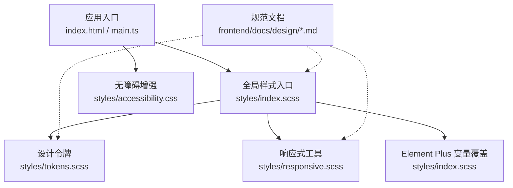
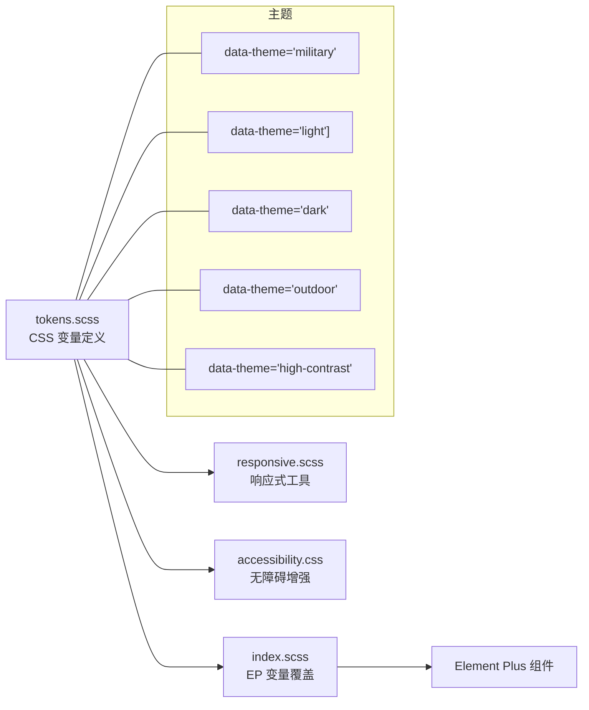
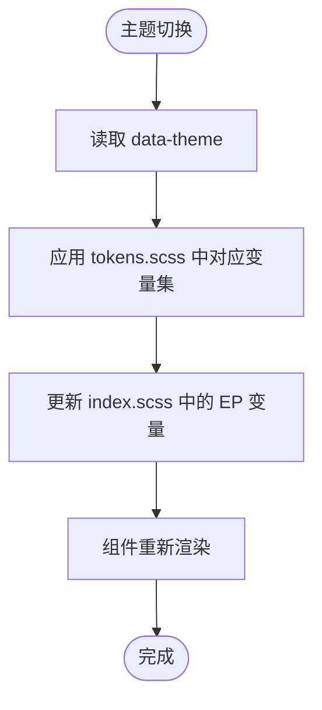
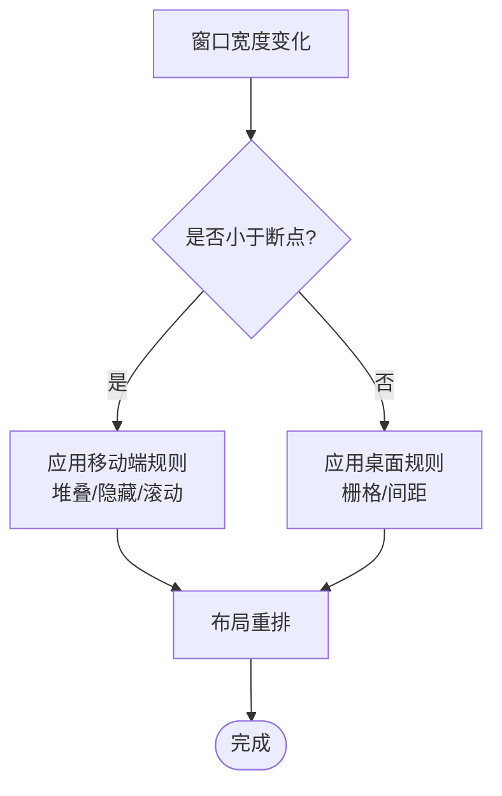
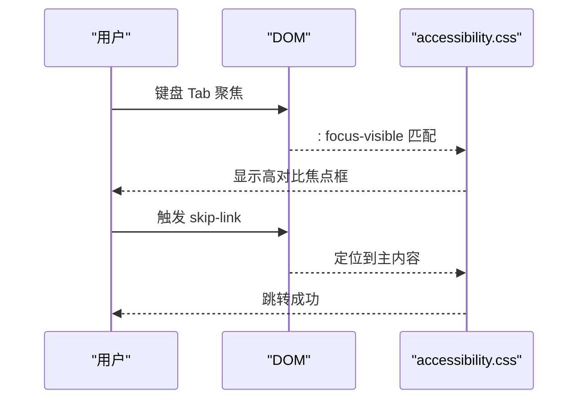
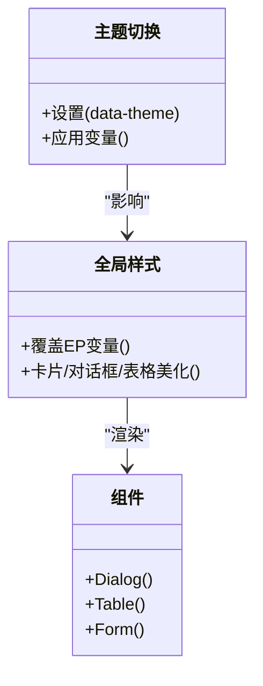
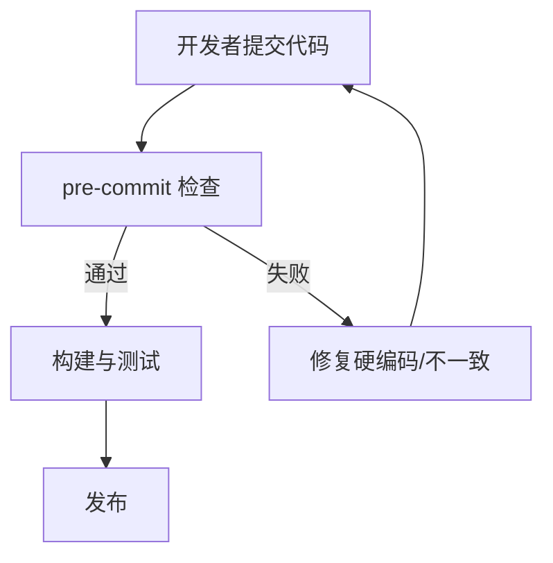
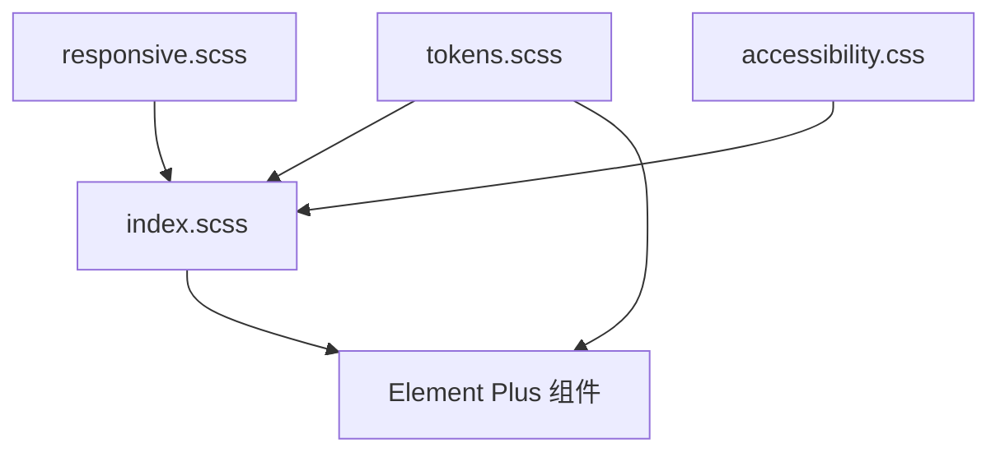

# UI设计规范

<cite>
**本文引用的文件**
- [frontend/src/styles/tokens.scss](file://frontend/src/styles/tokens.scss)
- [frontend/src/styles/index.scss](file://frontend/src/styles/index.scss)
- [frontend/src/styles/responsive.scss](file://frontend/src/styles/responsive.scss)
- [frontend/src/styles/accessibility.css](file://frontend/src/styles/accessibility.css)
- [frontend/docs/design/tokens.md](file://frontend/docs/design/tokens.md)
- [frontend/docs/design/components.md](file://frontend/docs/design/components.md)
- [frontend/docs/design/pages.md](file://frontend/docs/design/pages.md)
- [docs/design/tokens.md](file://docs/design/tokens.md)
</cite>

## 目录
1. [引言](#引言)
2. [项目结构](#项目结构)
3. [核心组件](#核心组件)
4. [架构总览](#架构总览)
5. [详细组件分析](#详细组件分析)
6. [依赖关系分析](#依赖关系分析)
7. [性能考虑](#性能考虑)
8. [故障排查指南](#故障排查指南)
9. [结论](#结论)
10. [附录](#附录)

## 引言
本规范以 Element Plus 设计系统为基础，结合项目自研的 Token 体系与响应式、无障碍策略，统一色彩、字体、间距、图标、密度、弹窗尺寸、主题切换与暗色模式等视觉与交互约定。目标是确保跨页面、跨设备的一致性、可维护性与可访问性，并提供样式定制、令牌管理与一致性检查的实践方法。

## 项目结构
前端样式与规范围绕以下关键文件组织：
- 设计令牌（颜色/字体/间距/圆角/阴影/断点/布局/密度/主题）：tokens.scss
- 全局样式与 Element Plus 变量映射：index.scss
- 响应式工具与栅格：responsive.scss
- 无障碍增强：accessibility.css
- 规范文档：frontend/docs/design/*.md、docs/design/tokens.md

图表来源
- [frontend/src/styles/index.scss:1-10](file://frontend/src/styles/index.scss#L1-L10)
- [frontend/src/styles/tokens.scss:1-10](file://frontend/src/styles/tokens.scss#L1-L10)
- [frontend/src/styles/responsive.scss:1-10](file://frontend/src/styles/responsive.scss#L1-L10)
- [frontend/src/styles/accessibility.css:1-10](file://frontend/src/styles/accessibility.css#L1-L10)

章节来源
- [frontend/src/styles/index.scss:1-459](file://frontend/src/styles/index.scss#L1-L459)
- [frontend/src/styles/tokens.scss:1-660](file://frontend/src/styles/tokens.scss#L1-L660)
- [frontend/src/styles/responsive.scss:1-439](file://frontend/src/styles/responsive.scss#L1-L439)
- [frontend/src/styles/accessibility.css:1-113](file://frontend/src/styles/accessibility.css#L1-L113)
- [frontend/docs/design/tokens.md:1-70](file://frontend/docs/design/tokens.md#L1-L70)
- [frontend/docs/design/components.md:1-75](file://frontend/docs/design/components.md#L1-L75)
- [frontend/docs/design/pages.md:1-58](file://frontend/docs/design/pages.md#L1-L58)
- [docs/design/tokens.md:1-72](file://docs/design/tokens.md#L1-L72)

## 核心组件
本节聚焦与 UI 规范强相关的“设计令牌”和“通用组件模板”，并给出使用约束与最佳实践。

- 设计令牌（Design Tokens）
  - 颜色：主色、语义色、文字色、背景色、边框色、强调色；支持多主题（默认军绿、明亮、深色、军旅、户外、高对比）。
  - 字体：字号阶梯、行高、字重、数字等宽字体。
  - 间距：4pt 网格，统一 xs/sm/md/lg/xl/xxl/xxxl。
  - 圆角与阴影：卡片/控件/标签三档圆角；两级阴影 card/dialog。
  - 密度：表格行高、控件高度、表单标签宽度锚定。
  - 弹窗三档：sm 480 / md 720 / lg 960。
  - 布局：头部高度、侧边栏宽度、内容最大宽度、内边距。
  - 断点：xs/sm/md/lg/xl/xxl。
  - 层级：z-index 分层管理。
  - 过渡与动画：统一时长与缓动，限制入场动画。

- 通用组件模板
  - PageHeader：唯一页头实现，标题+副题+唯一主操作按钮。
  - KpiCard：统计卡，数值千分位、趋势语义、主题变体。
  - Dialog：宽度固定三档，底部按钮右对齐，主操作 loading 态。
  - Table：全局 small 密度，stripe 条件启用，空态统一 EmptyState。
  - Form：label-width 两档，控件宽三档，分组卡片与 sticky 操作条。
  - EmptyState：列表/图表空态统一展示。
  - 动效红线：仅 hover/fade/slide，禁用入场动画。
  - 图标与日期：统一图标库与日期格式工具。

章节来源
- [frontend/docs/design/components.md:1-75](file://frontend/docs/design/components.md#L1-L75)
- [frontend/docs/design/tokens.md:1-70](file://frontend/docs/design/tokens.md#L1-L70)
- [docs/design/tokens.md:1-72](file://docs/design/tokens.md#L1-L72)

## 架构总览
下图展示了从全局样式到 Element Plus 变量的映射关系，以及主题切换对整体 UI 的影响路径。

图表来源
- [frontend/src/styles/tokens.scss:12-129](file://frontend/src/styles/tokens.scss#L12-L129)
- [frontend/src/styles/tokens.scss:331-501](file://frontend/src/styles/tokens.scss#L331-L501)
- [frontend/src/styles/index.scss:103-164](file://frontend/src/styles/index.scss#L103-L164)
- [frontend/src/styles/responsive.scss:14-21](file://frontend/src/styles/responsive.scss#L14-L21)
- [frontend/src/styles/accessibility.css:66-113](file://frontend/src/styles/accessibility.css#L66-L113)

## 详细组件分析

### 设计令牌与主题体系
- 颜色体系
  - 主色与语义色：通过 CSS 变量集中管理，Element Plus 变量直接引用，保证主题一致。
  - 多主题：默认军绿、明亮、深色、军旅、户外、高对比；通过 data-theme 切换。
- 字体与行高
  - 字号阶梯：xs→xxxl，配合 tight/snug/normal/relaxed 行高。
  - 数字等宽：tabular-nums + monospace 字体族。
- 间距与密度
  - 4pt 网格间距；紧凑密度下表格行高与控件高度统一。
- 弹窗三档
  - sm/md/lg 宽度常量，TS 与 SCSS 双端同步。
- 布局与断点
  - 头部/侧边栏/内容区尺寸；响应式断点与容器类。
- 阴影与圆角
  - 卡片与弹层两级阴影；控件/卡片/标签三档圆角。
- 过渡与动画
  - 统一 transition-fast .15s；禁止入场动画。

图表来源
- [frontend/src/styles/tokens.scss:12-129](file://frontend/src/styles/tokens.scss#L12-L129)
- [frontend/src/styles/tokens.scss:331-501](file://frontend/src/styles/tokens.scss#L331-L501)
- [frontend/src/styles/index.scss:103-164](file://frontend/src/styles/index.scss#L103-L164)

章节来源
- [frontend/src/styles/tokens.scss:1-660](file://frontend/src/styles/tokens.scss#L1-L660)
- [frontend/src/styles/index.scss:103-164](file://frontend/src/styles/index.scss#L103-L164)
- [frontend/docs/design/tokens.md:1-70](file://frontend/docs/design/tokens.md#L1-L70)
- [docs/design/tokens.md:1-72](file://docs/design/tokens.md#L1-L72)

### 响应式设计与移动端适配
- 断点与容器
  - 提供 xs/sm/md/lg/xl/xxl 断点；container/container-fluid 自适应。
- 栅格与列
  - 12 栅格，响应式列宽类 col-{bp}-n。
- 显示/隐藏与间距
  - hidden-* / visible-*-only；p-responsive / m-responsive。
- 平板与移动端优化
  - 表格横向滚动、表单堆叠、全宽按钮、底部固定条。
- 对话框与表格的响应式处理
  - 小屏对话框宽度自适应；表格在移动端转为卡片式或横向滚动。

图表来源
- [frontend/src/styles/responsive.scss:14-21](file://frontend/src/styles/responsive.scss#L14-L21)
- [frontend/src/styles/responsive.scss:108-179](file://frontend/src/styles/responsive.scss#L108-L179)
- [frontend/src/styles/responsive.scss:312-394](file://frontend/src/styles/responsive.scss#L312-L394)
- [frontend/src/styles/index.scss:312-419](file://frontend/src/styles/index.scss#L312-L419)

章节来源
- [frontend/src/styles/responsive.scss:1-439](file://frontend/src/styles/responsive.scss#L1-L439)
- [frontend/src/styles/index.scss:312-419](file://frontend/src/styles/index.scss#L312-L419)
- [frontend/docs/design/pages.md:40-58](file://frontend/docs/design/pages.md#L40-L58)

### 无障碍访问支持
- 焦点指示器增强：非输入控件可见焦点框，避免重复外框。
- 跳过导航链接：快速跳转到主内容。
- 屏幕阅读器专用文本：sr-only 类。
- 减少动画：尊重 prefers-reduced-motion。
- 高对比度模式：强制高对比边框与链接下划线。
- 户外/老年模式：增大字体与触控目标，防止 iOS 缩放。
- 表单错误关联：aria-invalid 时边框高亮。

图表来源
- [frontend/src/styles/accessibility.css:11-21](file://frontend/src/styles/accessibility.css#L11-L21)
- [frontend/src/styles/accessibility.css:23-39](file://frontend/src/styles/accessibility.css#L23-L39)
- [frontend/src/styles/accessibility.css:54-64](file://frontend/src/styles/accessibility.css#L54-L64)
- [frontend/src/styles/accessibility.css:66-113](file://frontend/src/styles/accessibility.css#L66-L113)

章节来源
- [frontend/src/styles/accessibility.css:1-113](file://frontend/src/styles/accessibility.css#L1-L113)

### 组件样式定制与主题切换
- 组件精美化
  - 卡片：边框、圆角、hover 阴影。
  - 对话框：flex 布局、body 滚动、footer 常驻。
  - 表格：表头底色与金边、斑马纹背景。
  - 表单：标签权重与颜色。
  - 分页：激活项主题色。
- 主题切换
  - 通过 data-theme 切换不同主题变量集。
  - 仪表盘专属主题：隔离作用域，不破坏全局。
- 密度控制
  - 全局 small 密度，控件高度统一。

图表来源
- [frontend/src/styles/index.scss:230-310](file://frontend/src/styles/index.scss#L230-L310)
- [frontend/src/styles/tokens.scss:331-501](file://frontend/src/styles/tokens.scss#L331-L501)
- [frontend/src/styles/dashboard-theme.scss:1-27](file://frontend/src/styles/dashboard-theme.scss#L1-L27)

章节来源
- [frontend/src/styles/index.scss:230-310](file://frontend/src/styles/index.scss#L230-L310)
- [frontend/src/styles/tokens.scss:331-501](file://frontend/src/styles/tokens.scss#L331-L501)
- [frontend/src/styles/dashboard-theme.scss:1-27](file://frontend/src/styles/dashboard-theme.scss#L1-L27)

### 设计令牌管理与一致性检查
- 单一事实源
  - tokens.scss 为唯一变量定义；SCSS 变量桥接注入。
- 硬编码拦截
  - pre-commit 脚本拦截 hex/rgb 字面量，强制使用 token。
- 迁移映射
  - 高频字面量自动替换（如 #fff → bg-card）。
- 验收清单
  - 每页 8 条通用 checklist，包括栅格、颜色、信息层级、空/加载/错误态、截图验证、缩放、动效、同组一致性。

图表来源
- [frontend/docs/design/tokens.md:1-7](file://frontend/docs/design/tokens.md#L1-L7)
- [frontend/docs/design/pages.md:34-58](file://frontend/docs/design/pages.md#L34-L58)
- [docs/design/tokens.md:55-72](file://docs/design/tokens.md#L55-L72)

章节来源
- [frontend/docs/design/tokens.md:1-70](file://frontend/docs/design/tokens.md#L1-L70)
- [frontend/docs/design/pages.md:34-58](file://frontend/docs/design/pages.md#L34-L58)
- [docs/design/tokens.md:55-72](file://docs/design/tokens.md#L55-L72)

## 依赖关系分析
- 样式依赖
  - index.scss 引入 tokens.scss、responsive.scss 及组件样式，形成全局样式基座。
  - tokens.scss 提供所有主题变量，被 index.scss 映射到 Element Plus 变量。
  - responsive.scss 提供响应式工具，供页面与组件复用。
  - accessibility.css 提供无障碍增强，独立于主题但受主题变量影响。
- 组件依赖
  - 组件样式遵循 tokens 与 index.scss 的统一规范，避免局部覆盖导致不一致。
- 外部依赖
  - Element Plus 组件通过 CSS 变量接入主题体系。

图表来源
- [frontend/src/styles/index.scss:1-10](file://frontend/src/styles/index.scss#L1-L10)
- [frontend/src/styles/tokens.scss:1-10](file://frontend/src/styles/tokens.scss#L1-L10)
- [frontend/src/styles/responsive.scss:1-10](file://frontend/src/styles/responsive.scss#L1-L10)
- [frontend/src/styles/accessibility.css:1-10](file://frontend/src/styles/accessibility.css#L1-L10)

章节来源
- [frontend/src/styles/index.scss:1-459](file://frontend/src/styles/index.scss#L1-L459)
- [frontend/src/styles/tokens.scss:1-660](file://frontend/src/styles/tokens.scss#L1-L660)
- [frontend/src/styles/responsive.scss:1-439](file://frontend/src/styles/responsive.scss#L1-L439)
- [frontend/src/styles/accessibility.css:1-113](file://frontend/src/styles/accessibility.css#L1-L113)

## 性能考虑
- 动画与过渡
  - 仅允许 hover/fade/slide 的 transition-fast .15s；禁用入场动画以降低低配机负担。
- 阴影与圆角
  - 使用两级阴影与有限圆角档位，避免过度绘制。
- 响应式与滚动
  - 表格在移动端横向滚动，避免重排；对话框 body 滚动，footer 常驻。
- 主题切换
  - 通过 CSS 变量切换，避免重建样式树；仪表盘主题隔离作用域。

[本节为通用指导，无需特定文件来源]

## 故障排查指南
- 颜色不一致
  - 检查是否使用了硬编码颜色；通过 pre-commit 脚本与 baseline 文件定位问题。
- 主题未生效
  - 确认 data-theme 是否正确设置；检查 tokens.scss 中对应主题变量是否覆盖。
- 对话框溢出或裁剪
  - 检查 el-dialog 的 overflow/clip-path 配置；确保 popper z-index 足够高。
- 下拉框选项被截断
  - 调整 el-select-dropdown 高度与 z-index；确保文本不换行且可见。
- 无障碍焦点不可见
  - 检查 :focus-visible 规则是否被覆盖；确认非输入控件焦点框存在。
- 移动端布局错乱
  - 检查响应式类与断点；确认表格与表单在小屏下的堆叠与滚动行为。

章节来源
- [frontend/src/styles/index.scss:230-459](file://frontend/src/styles/index.scss#L230-L459)
- [frontend/src/styles/accessibility.css:11-21](file://frontend/src/styles/accessibility.css#L11-L21)
- [frontend/src/styles/responsive.scss:312-394](file://frontend/src/styles/responsive.scss#L312-L394)
- [frontend/docs/design/tokens.md:1-7](file://frontend/docs/design/tokens.md#L1-L7)

## 结论
本规范通过统一的 Token 体系、严格的样式约束与完善的响应式、无障碍策略，确保基于 Element Plus 的前端界面在不同主题、设备与用户偏好下保持一致性与可访问性。建议在新功能开发中严格遵循令牌引用、组件模板与验收清单，并通过自动化检查保障质量。

[本节为总结，无需特定文件来源]

## 附录
- 常用 Token 速查
  - 颜色：--color-primary / --color-success / --color-warning / --color-danger / --color-info
  - 文字：--color-text-primary / --color-text-regular / --color-text-secondary / --color-text-placeholder
  - 背景：--color-bg-page / --color-bg-card / --color-bg-hover
  - 边框：--color-border / --color-border-light / --color-border-lighter
  - 字体：--font-size-* / --line-height-* / --font-weight-*
  - 间距：--spacing-*
  - 圆角：--radius-*
  - 阴影：--shadow-*
  - 密度：--table-row-height / --control-height / --form-label-width
  - 弹窗：--dialog-sm / --dialog-md / --dialog-lg
  - 布局：--layout-header-height / --layout-sidebar-width / --layout-content-max-width / --layout-content-padding
  - 断点：--breakpoint-*
  - 层级：--z-index-*
  - 过渡：--transition-*

章节来源
- [frontend/src/styles/tokens.scss:12-327](file://frontend/src/styles/tokens.scss#L12-L327)
- [frontend/src/styles/tokens.scss:331-501](file://frontend/src/styles/tokens.scss#L331-L501)
- [frontend/docs/design/tokens.md:1-70](file://frontend/docs/design/tokens.md#L1-L70)
- [docs/design/tokens.md:1-72](file://docs/design/tokens.md#L1-L72)