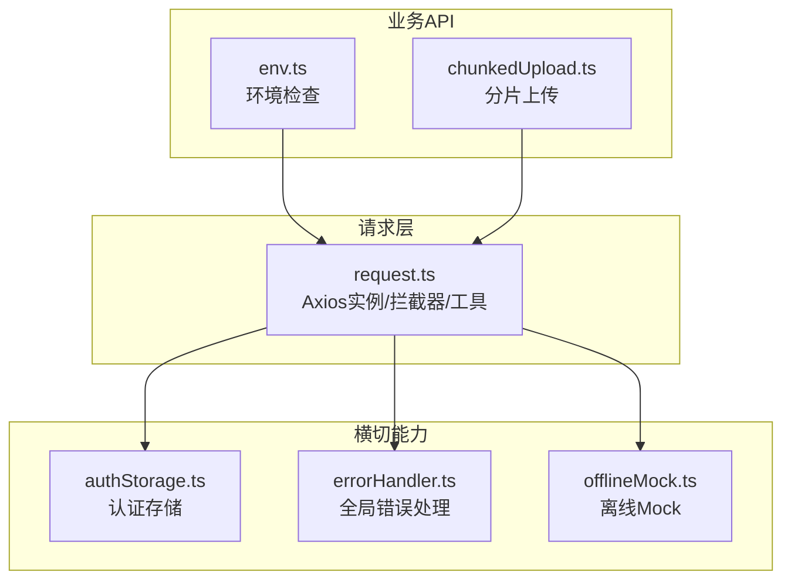
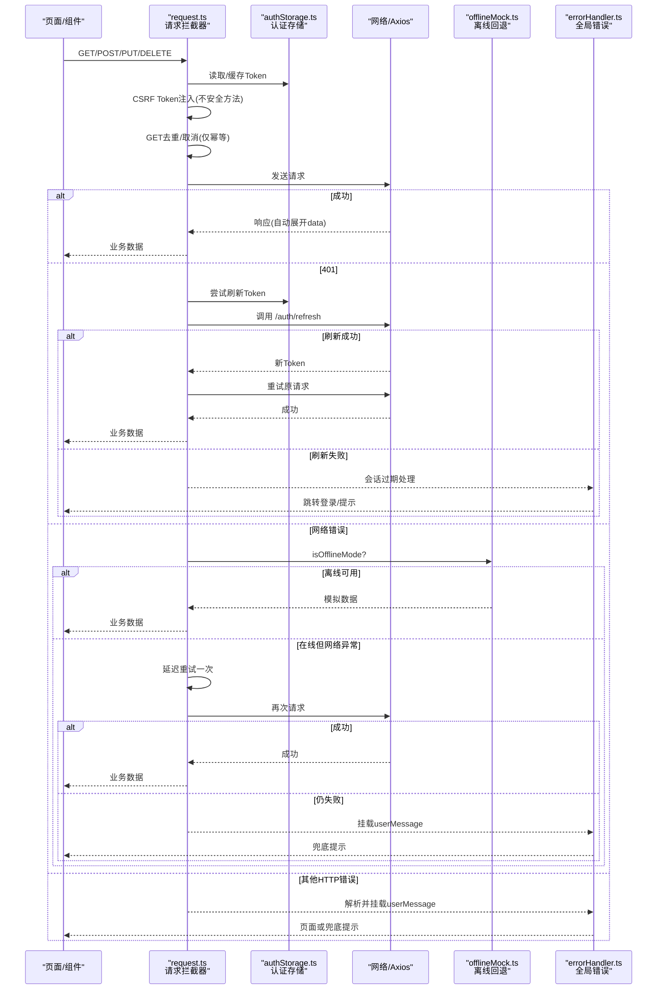
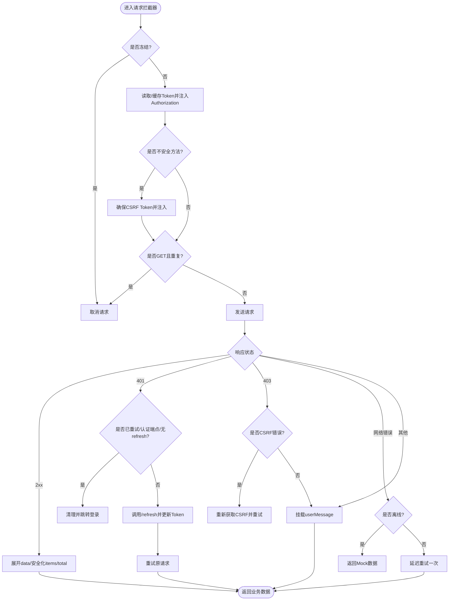
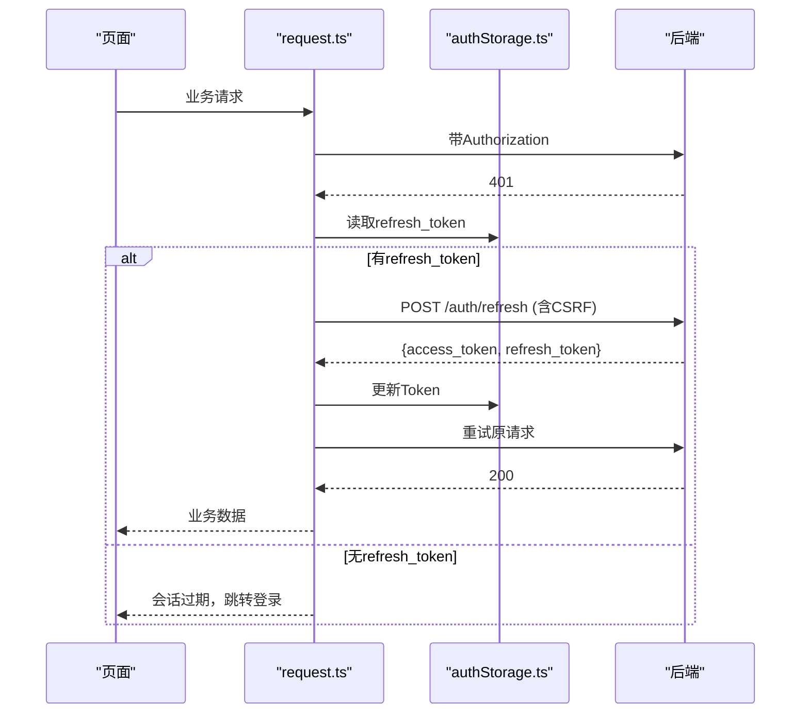
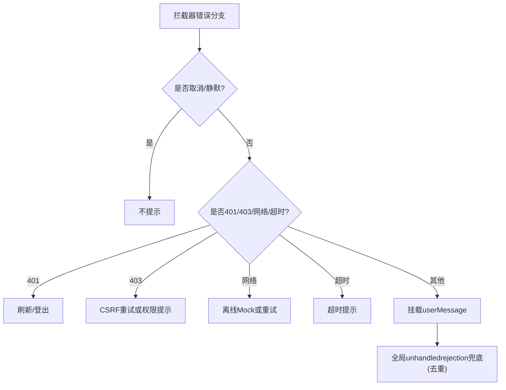
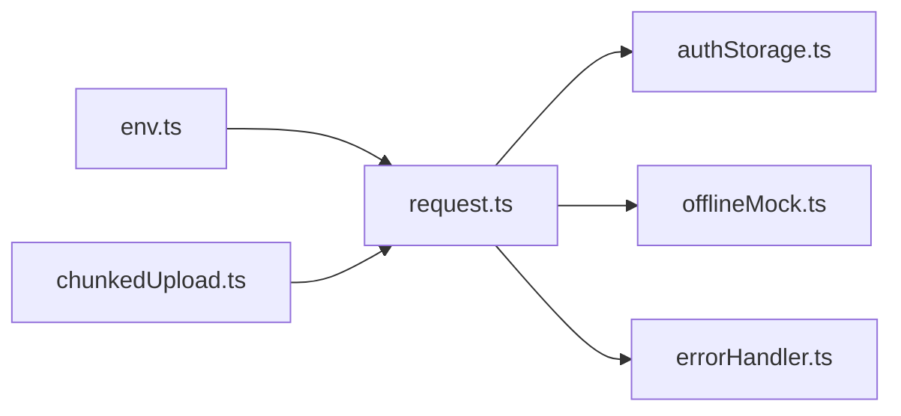

# API集成与封装

<cite>
**本文引用的文件**
- [frontend/src/api/request.ts](file://frontend/src/api/request.ts)
- [frontend/src/utils/offlineMock.ts](file://frontend/src/utils/offlineMock.ts)
- [frontend/src/utils/errorHandler.ts](file://frontend/src/utils/errorHandler.ts)
- [frontend/src/utils/authStorage.ts](file://frontend/src/utils/authStorage.ts)
- [frontend/src/api/chunkedUpload.ts](file://frontend/src/api/chunkedUpload.ts)
- [frontend/src/api/env.ts](file://frontend/src/api/env.ts)
</cite>

## 目录
1. [简介](#简介)
2. [项目结构](#项目结构)
3. [核心组件](#核心组件)
4. [架构总览](#架构总览)
5. [详细组件分析](#详细组件分析)
6. [依赖关系分析](#依赖关系分析)
7. [性能考虑](#性能考虑)
8. [故障排查指南](#故障排查指南)
9. [结论](#结论)
10. [附录](#附录)

## 简介
本文件面向前端API集成与封装，围绕基于Axios的HTTP客户端进行系统化说明。内容涵盖请求/响应拦截器、统一错误处理、请求重试、超时控制、取消请求、RESTful调用规范、文件上传下载、离线Mock支持、认证续期（Refresh Token）、CSRF保护、并发去重与取消、以及错误监控与兜底策略。通过具体业务接口示例展示如何编写健壮的API调用代码。

## 项目结构
前端API层以统一的Axios实例为中心，提供拦截器、工具函数与便捷方法；业务模块按领域拆分（如env、chunkedUpload等），复用统一的请求能力；错误处理与认证存储作为横切关注点被广泛引用；离线模式在请求失败时回退到内置Mock数据，保证无后端时的可用性。

图表来源
- [frontend/src/api/request.ts:1-746](file://frontend/src/api/request.ts#L1-L746)
- [frontend/src/api/env.ts:1-37](file://frontend/src/api/env.ts#L1-L37)
- [frontend/src/api/chunkedUpload.ts:1-92](file://frontend/src/api/chunkedUpload.ts#L1-L92)
- [frontend/src/utils/authStorage.ts:1-283](file://frontend/src/utils/authStorage.ts#L1-L283)
- [frontend/src/utils/errorHandler.ts:1-487](file://frontend/src/utils/errorHandler.ts#L1-L487)
- [frontend/src/utils/offlineMock.ts:1-950](file://frontend/src/utils/offlineMock.ts#L1-L950)

章节来源
- [frontend/src/api/request.ts:1-746](file://frontend/src/api/request.ts#L1-L746)
- [frontend/src/api/env.ts:1-37](file://frontend/src/api/env.ts#L1-L37)
- [frontend/src/api/chunkedUpload.ts:1-92](file://frontend/src/api/chunkedUpload.ts#L1-L92)
- [frontend/src/utils/authStorage.ts:1-283](file://frontend/src/utils/authStorage.ts#L1-L283)
- [frontend/src/utils/errorHandler.ts:1-487](file://frontend/src/utils/errorHandler.ts#L1-L487)
- [frontend/src/utils/offlineMock.ts:1-950](file://frontend/src/utils/offlineMock.ts#L1-L950)

## 核心组件
- Axios实例与拦截器：集中管理baseURL、超时、凭证携带、Authorization头、CSRF Token注入、GET请求去重与取消、响应展开、错误分类与重试、离线回退。
- 认证存储：统一存取token、refresh token、用户信息，支持“记住登录”持久化与迁移。
- 错误处理：统一解析HTTP/网络/业务错误，提供默认策略、事件总线通知、全局未捕获Promise拒绝兜底提示。
- 离线Mock：在后端不可用时为常用路由返回模拟数据，保障UI可运行。
- 分片上传：封装初始化、分片上传、进度查询、合并、取消等流程。
- 环境检查：提供系统运行环境诊断接口。

章节来源
- [frontend/src/api/request.ts:1-746](file://frontend/src/api/request.ts#L1-L746)
- [frontend/src/utils/authStorage.ts:1-283](file://frontend/src/utils/authStorage.ts#L1-L283)
- [frontend/src/utils/errorHandler.ts:1-487](file://frontend/src/utils/errorHandler.ts#L1-L487)
- [frontend/src/utils/offlineMock.ts:1-950](file://frontend/src/utils/offlineMock.ts#L1-L950)
- [frontend/src/api/chunkedUpload.ts:1-92](file://frontend/src/api/chunkedUpload.ts#L1-L92)
- [frontend/src/api/env.ts:1-37](file://frontend/src/api/env.ts#L1-L37)

## 架构总览
下图展示了从页面发起请求到后端响应的完整链路，包括拦截器、认证、CSRF、重试、取消、离线回退与错误兜底。

图表来源
- [frontend/src/api/request.ts:172-510](file://frontend/src/api/request.ts#L172-L510)
- [frontend/src/utils/authStorage.ts:54-177](file://frontend/src/utils/authStorage.ts#L54-L177)
- [frontend/src/utils/offlineMock.ts:13-16](file://frontend/src/utils/offlineMock.ts#L13-L16)
- [frontend/src/utils/errorHandler.ts:393-473](file://frontend/src/utils/errorHandler.ts#L393-L473)

## 详细组件分析

### Axios HTTP客户端封装（请求/响应拦截器）
- 基础配置：baseURL、timeout、Content-Type、withCredentials。
- 请求拦截器：
  - 冻结机制：改密/登出后冻结请求，避免竞态触发401。
  - 认证头：缓存并注入Authorization。
  - CSRF：对不安全方法自动注入X-CSRF-Token，懒加载并去重获取。
  - 并发控制：仅对GET进行去重与取消，防止重复请求与资源浪费。
- 响应拦截器：
  - 自动展开：将后端信封{data}中的对象字段提升到顶层，数组设为items，安全化total/items。
  - 401处理：区分已重试、认证端点、无refresh_token等情况，执行刷新或登出。
  - 403处理：CSRF失败时自动重试一次。
  - 网络错误：离线模式回退到Mock；否则延迟重试一次。
  - 超时/未知错误：挂载userMessage，由页面或全局兜底提示。
- 工具方法：
  - apiRequest/get/post/put/del/patch：统一返回业务数据。
  - cancelRequest/cancelAllRequests/createCancelableRequest：精确或批量取消。
  - requestWithTimeout：带超时的可取消请求。
  - parseContentDisposition/downloadBlob：下载文件名解析与Blob下载。

图表来源
- [frontend/src/api/request.ts:172-510](file://frontend/src/api/request.ts#L172-L510)

章节来源
- [frontend/src/api/request.ts:172-510](file://frontend/src/api/request.ts#L172-L510)

### 认证与令牌续期（Refresh Token）
- 存储：统一使用sessionStorage，支持“记住登录”持久化到localStorage。
- 续期：401时优先尝试用refresh_token换取新access_token，成功后重试原请求；并发401会排队等待。
- 安全：刷新端点需携带CSRF Token；刷新失败则清理认证并跳转登录。

图表来源
- [frontend/src/api/request.ts:345-448](file://frontend/src/api/request.ts#L345-L448)
- [frontend/src/utils/authStorage.ts:54-177](file://frontend/src/utils/authStorage.ts#L54-L177)

章节来源
- [frontend/src/api/request.ts:345-448](file://frontend/src/api/request.ts#L345-L448)
- [frontend/src/utils/authStorage.ts:54-177](file://frontend/src/utils/authStorage.ts#L54-L177)

### CSRF保护与重试
- 注入：对POST/PUT/DELETE/PATCH自动注入X-CSRF-Token，优先从Cookie读取，缺失时懒加载一次。
- 重试：若服务端返回CSRF相关403，自动重新获取CSRF并重试一次，防止无限循环。

章节来源
- [frontend/src/api/request.ts:103-164](file://frontend/src/api/request.ts#L103-L164)
- [frontend/src/api/request.ts:451-469](file://frontend/src/api/request.ts#L451-L469)

### 并发控制与请求取消
- GET去重：相同method+url+params的请求只保留一个，其余直接取消。
- 取消API：cancelRequest按URL段匹配取消；cancelAllRequests取消全部；createCancelableRequest创建可取消请求。
- 冻结：改密/登出后冻结所有请求，避免竞态。

章节来源
- [frontend/src/api/request.ts:166-203](file://frontend/src/api/request.ts#L166-L203)
- [frontend/src/api/request.ts:613-654](file://frontend/src/api/request.ts#L613-L654)
- [frontend/src/api/request.ts:28-37](file://frontend/src/api/request.ts#L28-L37)

### 超时控制
- 实例级超时：默认30秒。
- 请求级超时：requestWithTimeout包装可取消请求，超时主动取消并拒绝。

章节来源
- [frontend/src/api/request.ts:11-18](file://frontend/src/api/request.ts#L11-L18)
- [frontend/src/api/request.ts:656-669](file://frontend/src/api/request.ts#L656-L669)

### 统一错误处理与兜底
- 拦截器：不再对业务错误弹全局提示，统一挂载userMessage；401/403特殊处理；网络错误离线回退或重试。
- 全局兜底：setupGlobalErrorHandler监听unhandledrejection，去重提示，跳过静默与取消错误。
- 类型化：parseError将HTTP/网络/业务错误归类为统一AppError，便于策略化处理。

图表来源
- [frontend/src/api/request.ts:281-510](file://frontend/src/api/request.ts#L281-L510)
- [frontend/src/utils/errorHandler.ts:393-473](file://frontend/src/utils/errorHandler.ts#L393-L473)

章节来源
- [frontend/src/api/request.ts:281-510](file://frontend/src/api/request.ts#L281-L510)
- [frontend/src/utils/errorHandler.ts:145-265](file://frontend/src/utils/errorHandler.ts#L145-L265)
- [frontend/src/utils/errorHandler.ts:393-473](file://frontend/src/utils/errorHandler.ts#L393-L473)

### 离线Mock支持
- 检测：isOfflineMode根据内置token判断。
- 回退：网络错误时尝试从getMockResponse返回模拟数据，覆盖常见路由（工作台、村校项目、审批、工作日志等）。
- 适用场景：开发调试、弱网/断网体验保障。

章节来源
- [frontend/src/utils/offlineMock.ts:13-16](file://frontend/src/utils/offlineMock.ts#L13-L16)
- [frontend/src/utils/offlineMock.ts:577-950](file://frontend/src/utils/offlineMock.ts#L577-L950)
- [frontend/src/api/request.ts:474-486](file://frontend/src/api/request.ts#L474-L486)

### RESTful API调用规范与示例
- 命名与路径：遵循REST风格，如/env/check、/chunked-upload/*等。
- 方法：GET列表/详情、POST创建、PUT更新、PATCH部分更新、DELETE删除。
- 参数：查询参数通过params传递；表单/文件通过FormData。
- 响应：统一展开data，列表项置于items，分页total安全化。

示例（路径引用）
- 环境检查：[env.ts:27-30](file://frontend/src/api/env.ts#L27-L30)
- 分片上传：[chunkedUpload.ts:40-81](file://frontend/src/api/chunkedUpload.ts#L40-L81)

章节来源
- [frontend/src/api/env.ts:27-30](file://frontend/src/api/env.ts#L27-L30)
- [frontend/src/api/chunkedUpload.ts:40-81](file://frontend/src/api/chunkedUpload.ts#L40-L81)

### 文件上传与下载
- 上传：post自动识别FormData并移除Content-Type，交由浏览器设置multipart boundary；分片上传封装了init/upload/progress/merge/cancel。
- 下载：downloadBlob结合parseContentDisposition正确解析RFC 5987文件名，避免UTF-8直显问题。

章节来源
- [frontend/src/api/request.ts:565-599](file://frontend/src/api/request.ts#L565-L599)
- [frontend/src/api/request.ts:676-743](file://frontend/src/api/request.ts#L676-L743)
- [frontend/src/api/chunkedUpload.ts:40-81](file://frontend/src/api/chunkedUpload.ts#L40-L81)

### WebSocket实时通信
- 当前仓库未发现WebSocket实现代码。建议采用以下模式：
  - 连接建立：使用原生WebSocket或库，携带Authorization与必要上下文。
  - 心跳与重连：指数退避重连，记录断线原因。
  - 消息协议：定义统一消息格式（type/payload/id），支持ACK与错误码。
  - 生命周期：页面卸载关闭连接，鉴权失效断开并重定向。
  - 错误与监控：上报断线次数、耗时、消息丢失率。

[本节为概念性指导，不涉及具体源码]

### API版本管理与缓存策略
- 版本管理：baseURL指向/api/v1，升级时可通过路由前缀隔离版本。
- 缓存策略：
  - 请求级：GET去重减少重复请求。
  - 应用级：可按需引入内存/浏览器缓存（如swr/axios-cache-adapter），注意失效与一致性。
  - 响应头：结合后端Cache-Control/ETag实现强缓存或协商缓存。

章节来源
- [frontend/src/api/request.ts:11-18](file://frontend/src/api/request.ts#L11-L18)
- [frontend/src/api/request.ts:191-203](file://frontend/src/api/request.ts#L191-L203)

## 依赖关系分析
- request.ts依赖authStorage.ts（读写Token）、offlineMock.ts（离线回退）、errorHandler.ts（全局错误兜底）。
- 业务API（env、chunkedUpload）依赖request.ts提供的get/post等方法。
- errorHandler.ts提供统一错误解析与全局监听，供上层消费。

图表来源
- [frontend/src/api/request.ts:1-746](file://frontend/src/api/request.ts#L1-L746)
- [frontend/src/api/env.ts:1-37](file://frontend/src/api/env.ts#L1-L37)
- [frontend/src/api/chunkedUpload.ts:1-92](file://frontend/src/api/chunkedUpload.ts#L1-L92)
- [frontend/src/utils/authStorage.ts:1-283](file://frontend/src/utils/authStorage.ts#L1-L283)
- [frontend/src/utils/offlineMock.ts:1-950](file://frontend/src/utils/offlineMock.ts#L1-L950)
- [frontend/src/utils/errorHandler.ts:1-487](file://frontend/src/utils/errorHandler.ts#L1-L487)

章节来源
- [frontend/src/api/request.ts:1-746](file://frontend/src/api/request.ts#L1-L746)
- [frontend/src/api/env.ts:1-37](file://frontend/src/api/env.ts#L1-L37)
- [frontend/src/api/chunkedUpload.ts:1-92](file://frontend/src/api/chunkedUpload.ts#L1-L92)
- [frontend/src/utils/authStorage.ts:1-283](file://frontend/src/utils/authStorage.ts#L1-L283)
- [frontend/src/utils/offlineMock.ts:1-950](file://frontend/src/utils/offlineMock.ts#L1-L950)
- [frontend/src/utils/errorHandler.ts:1-487](file://frontend/src/utils/errorHandler.ts#L1-L487)

## 性能考虑
- 请求去重：仅对GET进行去重，避免重复网络开销。
- 超时控制：实例级默认30s，关键接口可使用requestWithTimeout缩短超时。
- 并发控制：取消重复请求，降低服务器压力。
- 离线回退：在网络不可用时快速返回Mock，提升首屏与交互流畅度。
- 响应展开：减少一层.data访问，简化数据处理逻辑。
- 建议：
  - 对高频读接口启用应用级缓存（如SWR/React Query）。
  - 大文件使用分片上传与断点续传。
  - 合理设置重试次数与退避策略，避免雪崩。

[本节提供通用优化建议，不直接分析具体文件]

## 故障排查指南
- 401频繁出现：检查refresh_token是否存在、/auth/refresh是否携带CSRF、刷新后是否正确重试。
- 403 CSRF失败：确认X-CSRF-Token注入逻辑，必要时手动调用prefetchCsrfToken预热。
- 网络错误：确认isOfflineMode与getMockResponse是否命中；在线环境下观察是否触发一次重试。
- 全局提示过多：确认页面是否自行catch并提示；未被捕获的错误将由全局去重提示。
- 下载文件名异常：使用parseContentDisposition解析filename*，避免UTF-8直显。

章节来源
- [frontend/src/api/request.ts:345-469](file://frontend/src/api/request.ts#L345-L469)
- [frontend/src/api/request.ts:474-510](file://frontend/src/api/request.ts#L474-L510)
- [frontend/src/utils/errorHandler.ts:393-473](file://frontend/src/utils/errorHandler.ts#L393-L473)
- [frontend/src/api/request.ts:676-743](file://frontend/src/api/request.ts#L676-L743)

## 结论
该API封装以Axios为核心，通过拦截器实现了认证、CSRF、重试、取消、离线回退与统一错误处理，配合认证存储与全局错误兜底，形成健壮的前端请求基础设施。业务API按领域拆分，复用统一能力，满足RESTful调用、文件上传下载、离线模式等常见需求。建议在高频读场景引入应用级缓存，并结合后端缓存策略进一步提升性能。

[本节为总结性内容，不涉及具体源码]

## 附录
- 常用工具函数路径参考：
  - 请求封装与工具：[frontend/src/api/request.ts:530-746](file://frontend/src/api/request.ts#L530-L746)
  - 认证存储：[frontend/src/utils/authStorage.ts:54-177](file://frontend/src/utils/authStorage.ts#L54-L177)
  - 错误处理：[frontend/src/utils/errorHandler.ts:145-265](file://frontend/src/utils/errorHandler.ts#L145-L265)
  - 离线Mock：[frontend/src/utils/offlineMock.ts:577-950](file://frontend/src/utils/offlineMock.ts#L577-L950)
  - 分片上传：[frontend/src/api/chunkedUpload.ts:40-81](file://frontend/src/api/chunkedUpload.ts#L40-L81)
  - 环境检查：[frontend/src/api/env.ts:27-30](file://frontend/src/api/env.ts#L27-L30)

[本节为索引性内容，不涉及具体源码分析]