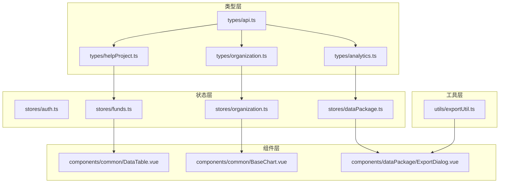
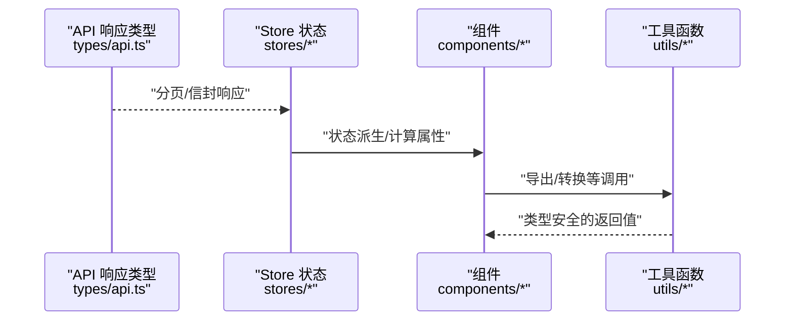
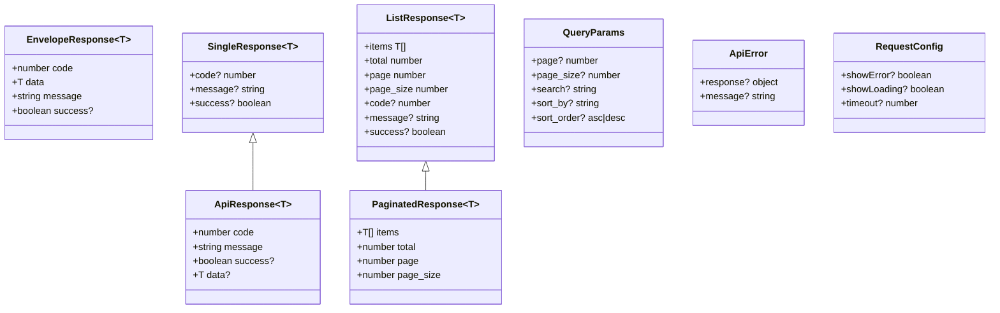
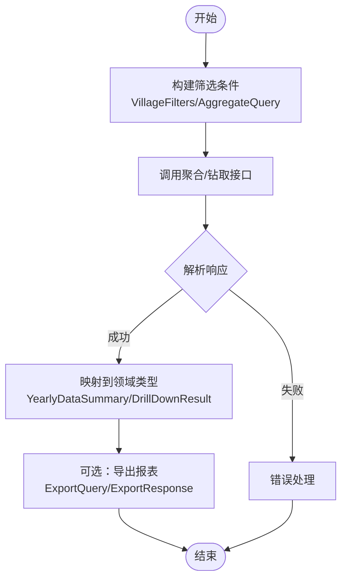
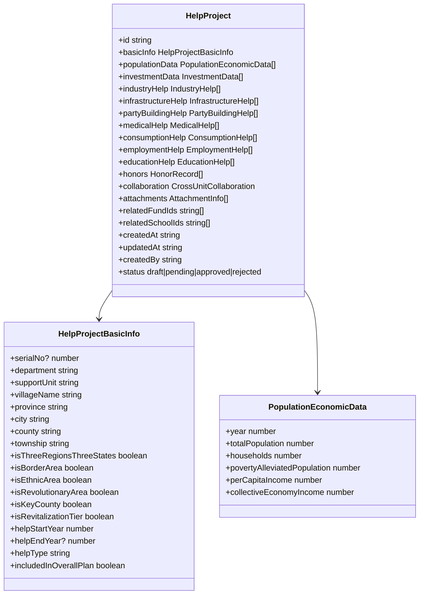
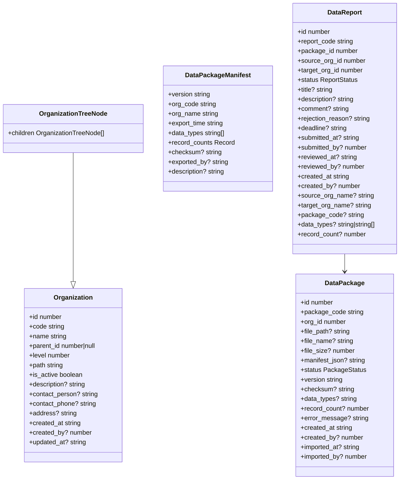
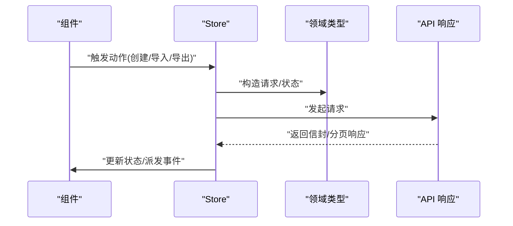
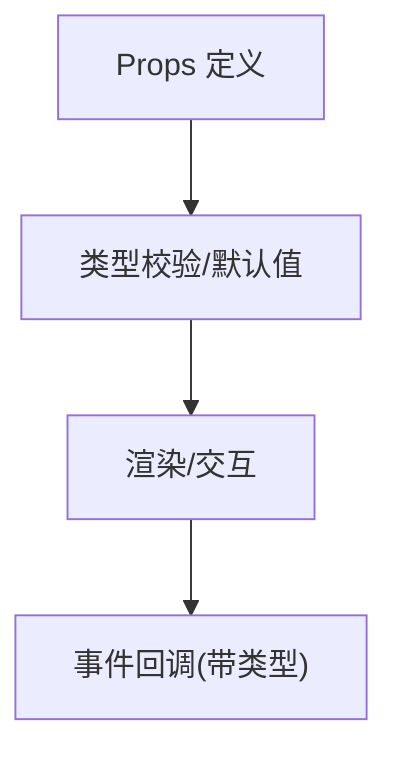
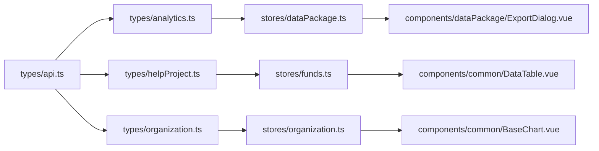

# TypeScript 类型规范

<cite>
**本文引用的文件**
- [frontend/tsconfig.json](file://frontend/tsconfig.json)
- [frontend/src/env.d.ts](file://frontend/src/env.d.ts)
- [frontend/src/types/api.ts](file://frontend/src/types/api.ts)
- [frontend/src/types/analytics.ts](file://frontend/src/types/analytics.ts)
- [frontend/src/types/helpProject.ts](file://frontend/src/types/helpProject.ts)
- [frontend/src/types/organization.ts](file://frontend/src/types/organization.ts)
- [frontend/src/stores/auth.ts](file://frontend/src/stores/auth.ts)
- [frontend/src/stores/dataPackage.ts](file://frontend/src/stores/dataPackage.ts)
- [frontend/src/stores/funds.ts](file://frontend/src/stores/funds.ts)
- [frontend/src/stores/organization.ts](file://frontend/src/stores/organization.ts)
- [frontend/src/components/common/DataTable.vue](file://frontend/src/components/common/DataTable.vue)
- [frontend/src/components/common/BaseChart.vue](file://frontend/src/components/common/BaseChart.vue)
- [frontend/src/components/dataPackage/ExportDialog.vue](file://frontend/src/components/dataPackage/ExportDialog.vue)
- [frontend/src/utils/exportUtil.ts](file://frontend/src/utils/exportUtil.ts)
</cite>

## 目录
1. [简介](#简介)
2. [项目结构](#项目结构)
3. [核心组件](#核心组件)
4. [架构总览](#架构总览)
5. [详细组件分析](#详细组件分析)
6. [依赖关系分析](#依赖关系分析)
7. [性能考量](#性能考量)
8. [故障排查指南](#故障排查指南)
9. [结论](#结论)
10. [附录](#附录)

## 简介
本规范面向前端 TypeScript 工程，系统化说明类型定义的组织方式与最佳实践。内容覆盖接口设计、类型别名、枚举使用；API 响应类型、组件 Props 类型、Store 状态类型、工具函数类型；泛型模式、类型守卫、第三方库类型声明；以及类型检查配置优化与复杂类型推导技巧。通过仓库中的实际类型文件与模块，提供可操作的指导与示例路径，帮助团队编写类型安全、可维护的前端代码。

## 项目结构
前端采用按领域划分的类型组织方式：
- 通用 API 类型集中在 types/api.ts，统一封装后端信封式响应、分页、查询参数等。
- 业务领域类型按功能域拆分：analytics.ts（数据分析与帮扶村）、helpProject.ts（帮扶项目）、organization.ts（组织与数据包/报表）。
- Store 层以领域为维度组织状态类型，并与 API/业务类型解耦。
- 组件 Props 类型优先复用领域类型，避免重复定义。
- 工具函数类型聚焦输入输出契约，便于跨模块复用。

图表来源
- [frontend/src/types/api.ts:1-92](file://frontend/src/types/api.ts#L1-L92)
- [frontend/src/types/analytics.ts:1-595](file://frontend/src/types/analytics.ts#L1-L595)
- [frontend/src/types/helpProject.ts:1-307](file://frontend/src/types/helpProject.ts#L1-L307)
- [frontend/src/types/organization.ts:1-282](file://frontend/src/types/organization.ts#L1-L282)

章节来源
- [frontend/tsconfig.json:1-42](file://frontend/tsconfig.json#L1-L42)

## 核心组件
本节从类型视角梳理关键模块的职责与边界：
- API 响应类型：统一信封格式、分页、错误与请求配置，确保前后端契约一致。
- 领域类型：围绕“帮扶村/年度数据”“帮扶项目”“组织与数据包/报表”三大领域，明确实体、请求、响应、筛选与统计类型。
- Store 状态：将领域类型映射到状态模型，隔离 UI 与数据流。
- 组件 Props：基于领域类型组合出最小必要属性，减少冗余。
- 工具函数：对导出、转换等通用逻辑进行类型化，保证调用方安全。

章节来源
- [frontend/src/types/api.ts:1-92](file://frontend/src/types/api.ts#L1-L92)
- [frontend/src/types/analytics.ts:1-595](file://frontend/src/types/analytics.ts#L1-L595)
- [frontend/src/types/helpProject.ts:1-307](file://frontend/src/types/helpProject.ts#L1-L307)
- [frontend/src/types/organization.ts:1-282](file://frontend/src/types/organization.ts#L1-L282)

## 架构总览
下图展示类型在系统中的流转：API 响应类型被 Store 消费并转换为状态；组件从 Store 或 API 获取数据后，通过 Props 传递给视图；工具函数在导出等场景中被调用，其输入输出均有严格类型约束。

图表来源
- [frontend/src/types/api.ts:1-92](file://frontend/src/types/api.ts#L1-L92)
- [frontend/src/stores/dataPackage.ts](file://frontend/src/stores/dataPackage.ts)
- [frontend/src/stores/funds.ts](file://frontend/src/stores/funds.ts)
- [frontend/src/stores/organization.ts](file://frontend/src/stores/organization.ts)
- [frontend/src/components/dataPackage/ExportDialog.vue](file://frontend/src/components/dataPackage/ExportDialog.vue)
- [frontend/src/utils/exportUtil.ts](file://frontend/src/utils/exportUtil.ts)

## 详细组件分析

### API 响应类型体系
- 基础信封与列表：统一 code/message/success/data 结构，并提供 PaginatedResponse 用于分页列表。
- 单实体与列表增强：SingleResponse/ListResponse 在解包后可直接访问字段，减少样板代码。
- 查询参数与错误：QueryParams 标准化分页、搜索、排序；ApiError 描述网络与业务错误结构。
- 请求配置：RequestConfig 扩展显示控制、超时等。

图表来源
- [frontend/src/types/api.ts:1-92](file://frontend/src/types/api.ts#L1-L92)

章节来源
- [frontend/src/types/api.ts:1-92](file://frontend/src/types/api.ts#L1-L92)

### 数据分析与帮扶村类型（analytics）
- 实体与请求：SupportedVillage/SupportedVillageCreate/Update 覆盖地域属性、振兴梯队、协作与表彰、经费与坐标等。
- 年度数据：人口、收入、投入、产业、基建、党建、医疗、消费、就业、教育等板块的独立接口，并通过 YearlyDataSummary 聚合。
- 查询与筛选：VillageFilters/FilterOptions/AggregateQuery/DrillDownQuery/DrillDownResult 支持多维筛选与钻取。
- 报表导出与订阅：ExportFormat/DataSection/ExportQuery/ExportResponse；ReportType/SubscriptionFrequency/ReportSubscription*。
- 统计与对比：VillageStatistics/PopulationStatistics/IncomeStatistics/InvestmentStatistics/SummaryStatistics；对比结果包含指标与年份维度。
- 分页响应：复用 PaginatedResponse。

图表来源
- [frontend/src/types/analytics.ts:1-595](file://frontend/src/types/analytics.ts#L1-L595)
- [frontend/src/types/api.ts:1-92](file://frontend/src/types/api.ts#L1-L92)

章节来源
- [frontend/src/types/analytics.ts:1-595](file://frontend/src/types/analytics.ts#L1-L595)

### 帮扶项目类型（helpProject）
- 基础信息与时间序列：HelpProjectBasicInfo 与 PopulationEconomicData 描述项目基本信息与多年人口经济数据。
- 多板块数据：投资、产业、基建、党建、医疗、消费、就业、教育等板块各自接口，便于分块录入与校验。
- 汇总实体：HelpProject 聚合所有板块、荣誉、协作、附件、关联 ID、审计字段与状态机。
- 筛选与统计：HelpProjectFilter 支持多维度筛选；HelpProjectSummary 提供统计摘要。
- 导入模板：ImportTemplateType/ImportTemplate 规范导入行为。

图表来源
- [frontend/src/types/helpProject.ts:1-307](file://frontend/src/types/helpProject.ts#L1-L307)

章节来源
- [frontend/src/types/helpProject.ts:1-307](file://frontend/src/types/helpProject.ts#L1-L307)

### 组织与数据包/报表类型（organization）
- 组织树：Organization/OrganizationTreeNode 支持层级结构与活动状态。
- 数据包：DataPackageManifest/DataPackage/DataPackage* 覆盖导出清单、包体、验证、预览、确认与导入结果。
- 数据报表：DataReport/ReviewAction/DataReportReview 描述上报、审核流程与统计。
- 导入导出历史：OperationType/OperationResult/ImportExportHistory 记录操作轨迹。

图表来源
- [frontend/src/types/organization.ts:1-282](file://frontend/src/types/organization.ts#L1-L282)

章节来源
- [frontend/src/types/organization.ts:1-282](file://frontend/src/types/organization.ts#L1-L282)

### Store 状态类型与职责
- auth.ts：管理认证相关状态（如 token、用户信息），通常与 API 登录/刷新流程配合。
- dataPackage.ts：管理数据包的导出/导入生命周期状态，对接 organization.ts 的数据包类型。
- funds.ts：管理资金相关状态，常与 analytics/helpProject 等领域类型交互。
- organization.ts：管理组织树与权限范围，支撑数据包/报表的上下文。

图表来源
- [frontend/src/stores/dataPackage.ts](file://frontend/src/stores/dataPackage.ts)
- [frontend/src/stores/funds.ts](file://frontend/src/stores/funds.ts)
- [frontend/src/stores/organization.ts](file://frontend/src/stores/organization.ts)
- [frontend/src/types/organization.ts:1-282](file://frontend/src/types/organization.ts#L1-L282)
- [frontend/src/types/api.ts:1-92](file://frontend/src/types/api.ts#L1-L92)

章节来源
- [frontend/src/stores/dataPackage.ts](file://frontend/src/stores/dataPackage.ts)
- [frontend/src/stores/funds.ts](file://frontend/src/stores/funds.ts)
- [frontend/src/stores/organization.ts](file://frontend/src/stores/organization.ts)

### 组件 Props 类型与复用
- DataTable.vue：表格组件应接收列定义、数据源、分页、筛选等 Props，建议复用 PaginatedResponse 与 QueryParams。
- BaseChart.vue：图表组件应接收数据集、指标、维度、主题等 Props，结合 analytics 的统计类型。
- ExportDialog.vue：导出对话框应接收导出参数、格式、进度等 Props，复用 ExportQuery/ExportResponse。

图表来源
- [frontend/src/components/common/DataTable.vue](file://frontend/src/components/common/DataTable.vue)
- [frontend/src/components/common/BaseChart.vue](file://frontend/src/components/common/BaseChart.vue)
- [frontend/src/components/dataPackage/ExportDialog.vue](file://frontend/src/components/dataPackage/ExportDialog.vue)
- [frontend/src/types/api.ts:1-92](file://frontend/src/types/api.ts#L1-L92)
- [frontend/src/types/analytics.ts:1-595](file://frontend/src/types/analytics.ts#L1-L595)

章节来源
- [frontend/src/components/common/DataTable.vue](file://frontend/src/components/common/DataTable.vue)
- [frontend/src/components/common/BaseChart.vue](file://frontend/src/components/common/BaseChart.vue)
- [frontend/src/components/dataPackage/ExportDialog.vue](file://frontend/src/components/dataPackage/ExportDialog.vue)

### 工具函数类型
- exportUtil.ts：导出工具函数应明确输入（如数据、格式、文件名）与输出（下载链接/状态），与 ExportQuery/ExportResponse 对齐。

章节来源
- [frontend/src/utils/exportUtil.ts](file://frontend/src/utils/exportUtil.ts)

## 依赖关系分析
- 类型耦合度：types/api.ts 作为基础设施被各业务类型复用；analytics/helpProject/organization 彼此相对独立，降低耦合。
- Store 依赖：Store 仅依赖对应领域的类型与 API 响应，避免跨域强耦合。
- 组件依赖：组件通过 Props 暴露最小契约，内部不感知具体实现细节。

图表来源
- [frontend/src/types/api.ts:1-92](file://frontend/src/types/api.ts#L1-L92)
- [frontend/src/types/analytics.ts:1-595](file://frontend/src/types/analytics.ts#L1-L595)
- [frontend/src/types/helpProject.ts:1-307](file://frontend/src/types/helpProject.ts#L1-L307)
- [frontend/src/types/organization.ts:1-282](file://frontend/src/types/organization.ts#L1-L282)
- [frontend/src/stores/dataPackage.ts](file://frontend/src/stores/dataPackage.ts)
- [frontend/src/stores/funds.ts](file://frontend/src/stores/funds.ts)
- [frontend/src/stores/organization.ts](file://frontend/src/stores/organization.ts)
- [frontend/src/components/dataPackage/ExportDialog.vue](file://frontend/src/components/dataPackage/ExportDialog.vue)
- [frontend/src/components/common/DataTable.vue](file://frontend/src/components/common/DataTable.vue)
- [frontend/src/components/common/BaseChart.vue](file://frontend/src/components/common/BaseChart.vue)

## 性能考量
- 类型编译开销：启用 incremental 与 strict 模式，合理拆分类型文件，避免循环引用。
- 运行时零成本：纯类型定义在编译后被移除，不影响运行性能。
- 大型对象处理：对大数据集（如年度数据）建议使用分页与懒加载，并在类型上体现分页字段。

[本节为通用指导，不直接分析具体文件]

## 故障排查指南
- 常见类型错误
  - 字段缺失或类型不匹配：对照 api.ts 的信封与分页类型，确保响应结构一致。
  - 枚举/字面量联合类型误用：参考 analytics.ts 中的 ReportType/ExportFormat 等字面量联合类型，确保取值合法。
  - 可选字段未判空：严格模式下需显式处理 undefined/null。
- 调试建议
  - 使用 IDE 的类型提示与跳转定位问题。
  - 在 Store 中打印中间状态，核对类型是否按预期变化。
  - 对导出/导入等复杂流程，增加断言与日志，结合 ImportExportHistory 类型追踪。

[本节为通用指导，不直接分析具体文件]

## 结论
本项目通过集中化的 API 类型与领域类型，实现了前后端契约的统一与类型安全。Store 作为状态与类型的桥梁，组件通过 Props 暴露最小契约，工具函数保障通用逻辑的类型正确性。遵循本规范可有效提升代码可读性、可维护性与健壮性。

[本节为总结性内容，不直接分析具体文件]

## 附录

### 类型检查配置优化
- 严格模式：开启 strict、noImplicitAny、strictNullChecks 等，提高类型安全性。
- 模块解析：使用 bundler 模式与路径别名，提升开发体验。
- 增量编译：启用 incremental 与 tsBuildInfoFile，加速构建。
- 排除测试与 node_modules，减少无关扫描。

章节来源
- [frontend/tsconfig.json:1-42](file://frontend/tsconfig.json#L1-L42)

### 第三方库类型声明
- Vue 组件：通过 env.d.ts 声明 *.vue 模块类型为 DefineComponent。
- 文档转换：声明 mammoth 模块的 convertToHtml/extractRawText 方法签名，确保调用安全。

章节来源
- [frontend/src/env.d.ts:1-15](file://frontend/src/env.d.ts#L1-L15)

### 泛型使用模式
- 通用响应：ApiResponse<T>/PaginatedResponse<T> 通过泛型承载任意数据类型，保持类型一致性。
- 组合类型：ListResponse<T> 与 PaginatedResponse<T> 组合，扩展额外字段。
- 领域泛型：在 Store/组件中通过泛型传递数据结构，避免 any。

章节来源
- [frontend/src/types/api.ts:1-92](file://frontend/src/types/api.ts#L1-L92)

### 类型守卫实现建议
- 针对后端返回的可变字段，建议在 Store 或工具函数中实现类型守卫，确保进入下游前完成类型收窄。
- 对可选字段进行存在性检查后再访问，避免运行时错误。

[本节为通用指导，不直接分析具体文件]

### 复杂类型推导技巧
- 利用 keyof 与索引访问类型，动态生成列定义或表单字段。
- 使用条件类型区分不同响应形态（如单实体 vs 列表）。
- 借助映射类型将后端 kebab-case 键名映射为前端 camelCase，保持命名一致性。

[本节为通用指导，不直接分析具体文件]

### 实战示例路径
- API 响应与分页：参见 [frontend/src/types/api.ts:1-92](file://frontend/src/types/api.ts#L1-L92)
- 帮扶村与年度数据：参见 [frontend/src/types/analytics.ts:1-595](file://frontend/src/types/analytics.ts#L1-L595)
- 帮扶项目全量结构：参见 [frontend/src/types/helpProject.ts:1-307](file://frontend/src/types/helpProject.ts#L1-L307)
- 组织与数据包/报表：参见 [frontend/src/types/organization.ts:1-282](file://frontend/src/types/organization.ts#L1-L282)
- 导出对话框与工具：参见 [frontend/src/components/dataPackage/ExportDialog.vue](file://frontend/src/components/dataPackage/ExportDialog.vue)、[frontend/src/utils/exportUtil.ts](file://frontend/src/utils/exportUtil.ts)