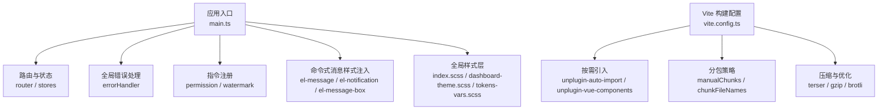
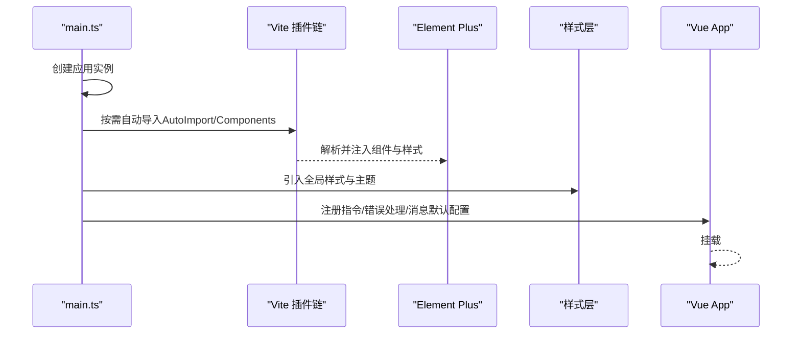
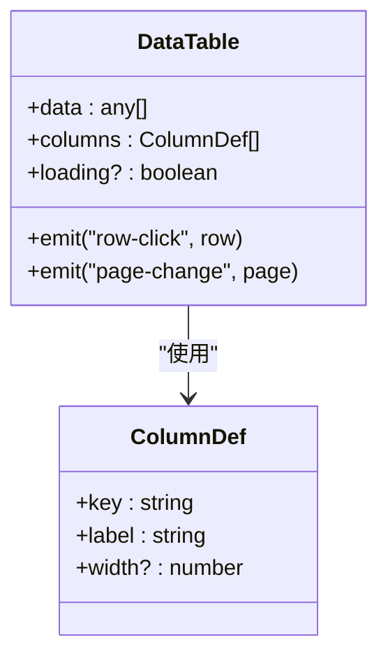
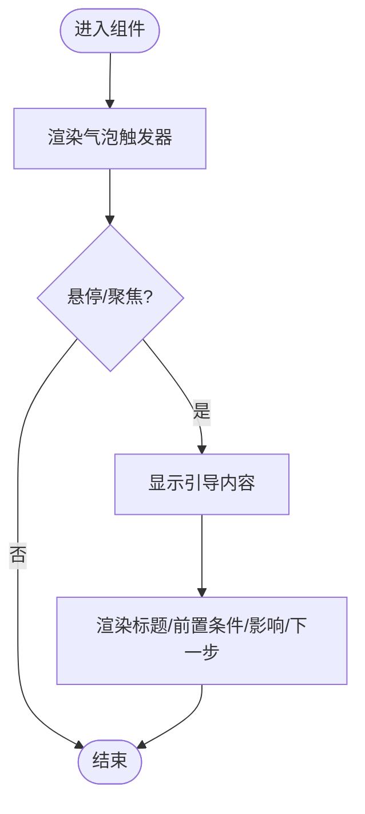
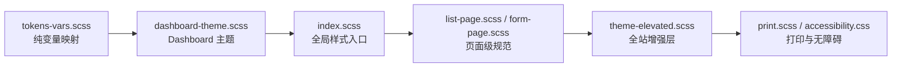
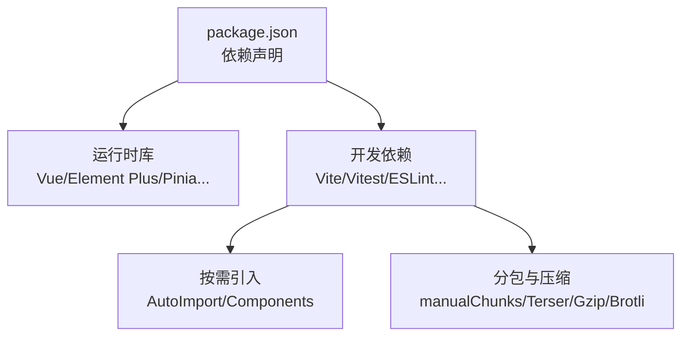

# UI组件开发

<cite>
**本文引用的文件**
- [frontend/package.json](file://frontend/package.json)
- [frontend/src/main.ts](file://frontend/src/main.ts)
- [frontend/vite.config.ts](file://frontend/vite.config.ts)
- [frontend/src/styles/tokens-vars.scss](file://frontend/src/styles/tokens-vars.scss)
- [frontend/src/styles/dashboard-theme.scss](file://frontend/src/styles/dashboard-theme.scss)
- [frontend/src/components/common/DataTable.vue](file://frontend/src/components/common/DataTable.vue)
- [frontend/src/components/business/FundGuidePopover.vue](file://frontend/src/components/business/FundGuidePopover.vue)
</cite>

## 目录
1. [简介](#简介)
2. [项目结构](#项目结构)
3. [核心组件](#核心组件)
4. [架构总览](#架构总览)
5. [详细组件分析](#详细组件分析)
6. [依赖关系分析](#依赖关系分析)
7. [性能考虑](#性能考虑)
8. [故障排查指南](#故障排查指南)
9. [结论](#结论)
10. [附录](#附录)

## 简介
本文件面向基于 Element Plus 的 UI 组件开发，结合本项目前端工程实践，系统阐述基础组件定制与业务组件开发模式。内容覆盖：设计原则、Props/Events 设计、插槽使用、样式隔离、响应式与主题、国际化支持、可复用抽象、测试方法、文档生成、性能优化、无障碍访问与跨浏览器兼容，并通过实际组件示例展示高质量组件的开发流程。

## 项目结构
前端采用 Vue 3 + Vite + TypeScript 技术栈，Element Plus 通过 unplugin-vue-components 按需自动导入；全局样式通过 SCSS 变量与主题层组织，构建期进行代码分割与压缩。

图表来源
- [frontend/src/main.ts:1-69](file://frontend/src/main.ts#L1-L69)
- [frontend/vite.config.ts:101-131](file://frontend/vite.config.ts#L101-L131)
- [frontend/vite.config.ts:211-426](file://frontend/vite.config.ts#L211-L426)

章节来源
- [frontend/package.json:1-73](file://frontend/package.json#L1-L73)
- [frontend/src/main.ts:1-69](file://frontend/src/main.ts#L1-L69)
- [frontend/vite.config.ts:1-472](file://frontend/vite.config.ts#L1-L472)

## 核心组件
- 通用数据表格封装 DataTable：以 Element Plus Table 为基础，提供 data/columns/loading 等 Props，便于在页面中快速渲染列表。
- 业务引导气泡 FundGuidePopover：封装 ElPopover，统一“前置条件/后续影响/下一步”的引导信息呈现，提升操作可理解性。

章节来源
- [frontend/src/components/common/DataTable.vue:1-20](file://frontend/src/components/common/DataTable.vue#L1-L20)
- [frontend/src/components/business/FundGuidePopover.vue:1-55](file://frontend/src/components/business/FundGuidePopover.vue#L1-L55)

## 架构总览
下图展示了从应用启动到组件渲染的关键路径，包括按需引入、主题注入、指令安装与全局错误处理。

图表来源
- [frontend/src/main.ts:1-69](file://frontend/src/main.ts#L1-L69)
- [frontend/vite.config.ts:101-131](file://frontend/vite.config.ts#L101-L131)

## 详细组件分析

### 通用数据表格 DataTable
- 设计目标：将 Element Plus Table 的使用简化为声明式配置，降低重复样板代码。
- Props 设计：data（数组）、columns（列定义数组，含 key/label/width）、loading（可选）。
- 事件扩展建议：分页、排序、筛选、行点击等可通过 defineEmits 暴露，由父组件控制。
- 插槽建议：单元格内容自定义通过具名插槽实现，保持高内聚低耦合。
- 样式隔离：使用 scoped 样式，避免污染全局；必要时通过 CSS 变量与主题对齐。

图表来源
- [frontend/src/components/common/DataTable.vue:1-20](file://frontend/src/components/common/DataTable.vue#L1-L20)

章节来源
- [frontend/src/components/common/DataTable.vue:1-20](file://frontend/src/components/common/DataTable.vue#L1-L20)

### 业务引导气泡 FundGuidePopover
- 设计目标：统一操作指引的视觉与信息结构，减少重复文案与布局。
- Props 设计：title、precondition、impact、nextStep，语义清晰，便于多语言替换。
- 插槽建议：如需更灵活的内容，可增加 default 插槽供上层自由扩展。
- 交互与可访问性：使用 aria-label 标注图标用途；hover 触发适合轻量提示，键盘用户可考虑增加 focus 触发或 Tooltip 替代。
- 样式隔离：scoped 样式配合 CSS 变量，确保与主题一致。

图表来源
- [frontend/src/components/business/FundGuidePopover.vue:1-55](file://frontend/src/components/business/FundGuidePopover.vue#L1-L55)

章节来源
- [frontend/src/components/business/FundGuidePopover.vue:1-55](file://frontend/src/components/business/FundGuidePopover.vue#L1-L55)

### 主题与样式体系
- 变量层：tokens-vars.scss 通过 Vite additionalData 注入每个 SFC，仅包含纯变量映射到 CSS 变量，避免规则重复打包。
- 主题层：dashboard-theme.scss 提供 Dashboard 场景下的卡片、表格、按钮、滚动条等深度美化，并与 tokens 完全兼容。
- 全局样式：main.ts 中按序引入 index.scss、dashboard-theme.scss、list-page.scss、form-page.scss、theme-elevated.scss、print.scss、accessibility.css，形成“规范化 → 增强 → 打印 → 无障碍”的层级。

图表来源
- [frontend/src/styles/tokens-vars.scss:1-149](file://frontend/src/styles/tokens-vars.scss#L1-L149)
- [frontend/src/styles/dashboard-theme.scss:1-614](file://frontend/src/styles/dashboard-theme.scss#L1-L614)
- [frontend/src/main.ts:24-37](file://frontend/src/main.ts#L24-L37)

章节来源
- [frontend/src/styles/tokens-vars.scss:1-149](file://frontend/src/styles/tokens-vars.scss#L1-L149)
- [frontend/src/styles/dashboard-theme.scss:1-614](file://frontend/src/styles/dashboard-theme.scss#L1-L614)
- [frontend/src/main.ts:24-37](file://frontend/src/main.ts#L24-L37)

## 依赖关系分析
- 运行时依赖：Vue 3、Element Plus、Pinia、Vue Router、ECharts、Chart.js、Axios、Dayjs 等。
- 构建期依赖：Vite、TypeScript、ESLint、Prettier、Vitest、Playwright、unplugin-auto-import、unplugin-vue-components。
- 按需引入：Element Plus 通过 ElementPlusResolver 实现组件与样式的按需加载，减小首屏体积。
- 分包策略：手动拆分 vue-core、vue-router、pinia、echarts、chartjs、xlsx、axios、security、vendor 等，避免大依赖预加载。

图表来源
- [frontend/package.json:26-67](file://frontend/package.json#L26-L67)
- [frontend/vite.config.ts:101-131](file://frontend/vite.config.ts#L101-L131)
- [frontend/vite.config.ts:286-410](file://frontend/vite.config.ts#L286-L410)

章节来源
- [frontend/package.json:1-73](file://frontend/package.json#L1-L73)
- [frontend/vite.config.ts:1-472](file://frontend/vite.config.ts#L1-L472)

## 性能考虑
- 按需引入：Element Plus 组件与样式按需加载，避免全量引入带来的体积膨胀。
- 代码分割：对重型依赖（ECharts、Chart.js、xlsx、driver 等）独立分包，按需懒加载，降低首屏压力。
- 压缩与优化：生产环境启用 Terser 压缩、Gzip/Brotli 压缩、CSS 压缩与资源内联阈值控制。
- 预构建优化：optimizeDeps 指定关键依赖预构建，缩短冷启动时间。
- 构建产物：输出目录分类型管理（assets/js/views、assets/js/vendor、assets/images、assets/fonts），便于缓存与 CDN 部署。

章节来源
- [frontend/vite.config.ts:101-131](file://frontend/vite.config.ts#L101-L131)
- [frontend/vite.config.ts:211-426](file://frontend/vite.config.ts#L211-L426)
- [frontend/vite.config.ts:428-439](file://frontend/vite.config.ts#L428-L439)

## 故障排查指南
- 命令式消息样式缺失：若出现 ElMessage/ElMessageBox/ElNotification 无样式问题，需显式引入对应样式文件，或在构建时确保样式被正确注入。
- 主题闪烁（FOUC）：在应用挂载前读取本地存储的主题并立即应用到 DOM，避免首屏闪烁。
- 全局错误处理：通过 setupGlobalErrorHandler 捕获 window.onerror 与 unhandledrejection，集中上报与降级。
- 按需引入失效：确认 AutoImport/Components 插件已启用且 resolver 指向 ElementPlusResolver；检查是否误覆盖了 allowOverrides 或 exclude 规则。
- 构建警告抑制：针对 Rollup 循环依赖与注解相关警告进行定向抑制，不影响功能但减少噪音。

章节来源
- [frontend/src/main.ts:16-22](file://frontend/src/main.ts#L16-L22)
- [frontend/src/main.ts:39-41](file://frontend/src/main.ts#L39-L41)
- [frontend/src/main.ts:57-64](file://frontend/src/main.ts#L57-L64)
- [frontend/vite.config.ts:266-285](file://frontend/vite.config.ts#L266-L285)

## 结论
本项目以 Element Plus 为基础，结合 Vite 按需引入与精细的分包策略，构建了高性能、可维护的前端组件体系。通过统一的变量与主题层、规范的组件封装与样式隔离、完善的错误处理与无障碍支持，实现了从基础组件到业务组件的高质量交付。建议在后续迭代中继续完善组件测试覆盖率、文档自动化与国际化能力，持续提升用户体验与可维护性。

## 附录
- 响应式设计：通过 tokens 与 dashboard-theme.scss 中的媒体查询适配小屏；表单与列表页样式分层保证一致性。
- 主题定制：基于 CSS 变量与 SCSS 变量映射，支持明暗主题切换与品牌色定制。
- 国际化支持：组件 Props 文案建议抽取为 i18n 键值，便于多语言替换；引导类组件（如 FundGuidePopover）天然适合通过 props 传入文案。
- 可复用抽象：将高频 UI 模式（表格、弹窗、表单、空态、统计卡片等）抽象为通用组件，统一交互与样式。
- 组件测试：使用 Vitest + @vue/test-utils 编写单元测试，覆盖 Props、Events、插槽与边界条件；E2E 使用 Playwright 验证关键流程。
- 文档生成：结合组件 Props/Events/Slots 的类型定义与注释，自动生成 API 文档；可在 Storybook 或自研文档站点中展示。
- 无障碍访问：遵循 WCAG 建议，提供 aria-* 属性、焦点管理、键盘导航与对比度校验；引入 accessibility.css 增强焦点环与 reduced-motion 支持。
- 跨浏览器兼容：目标环境 es2020，开启 Safari 10 兼容选项；对现代特性进行 polyfill 与降级处理。