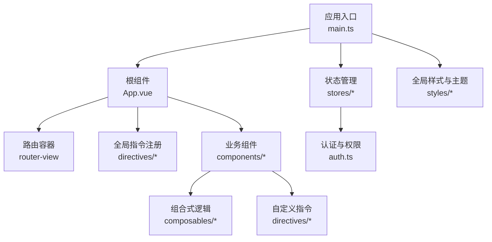
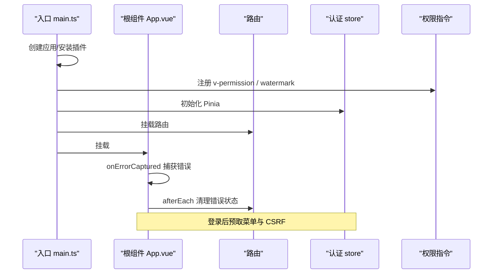
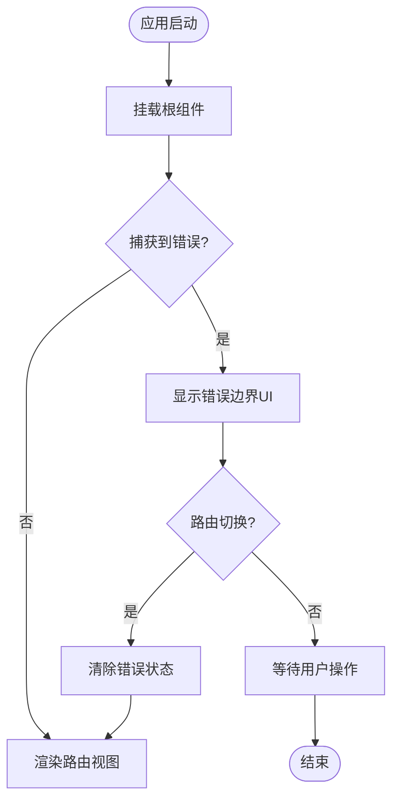
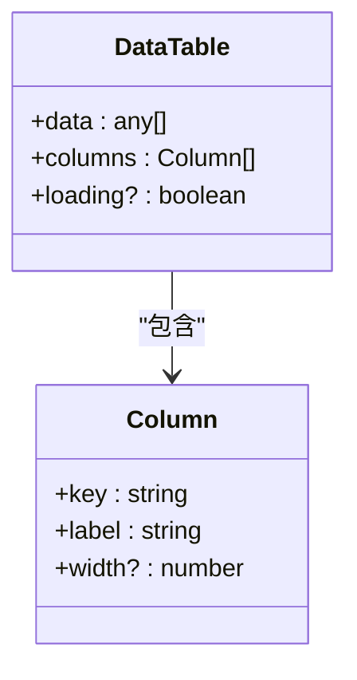
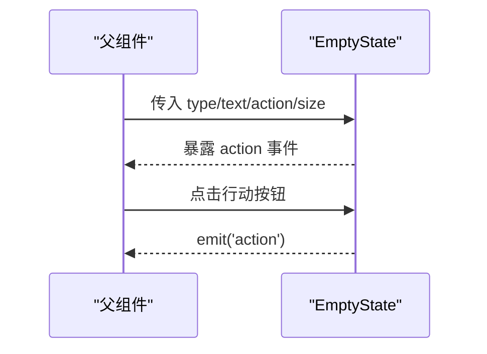
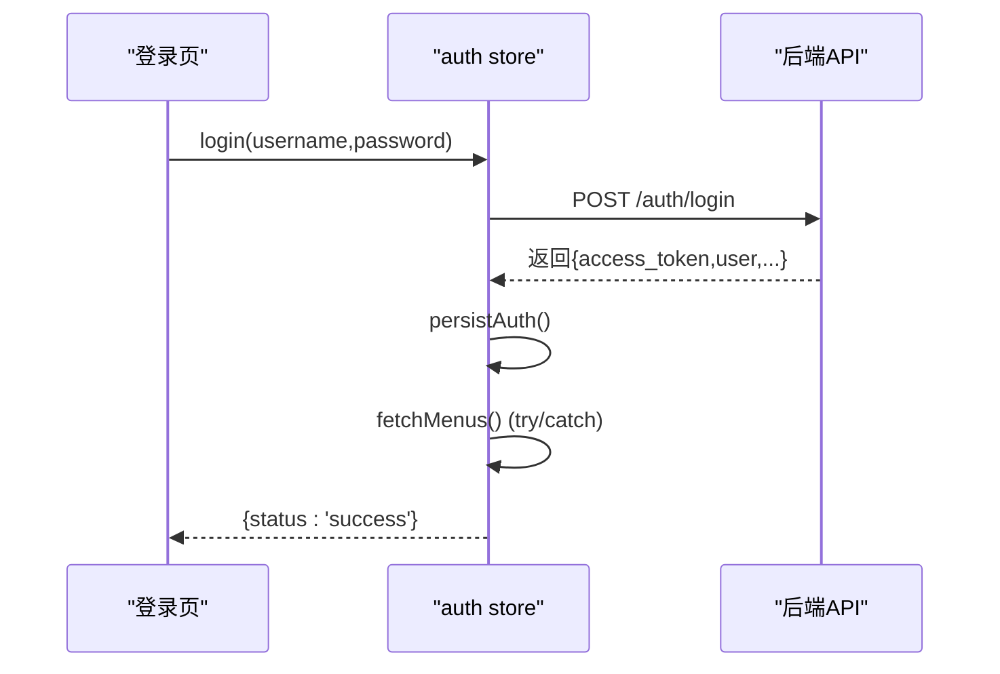
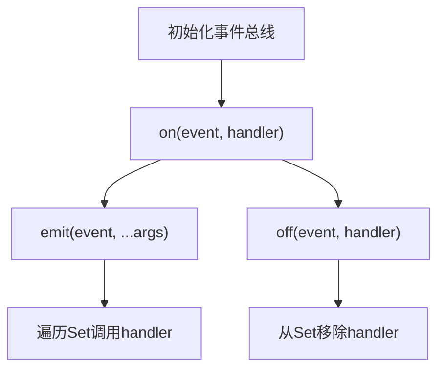
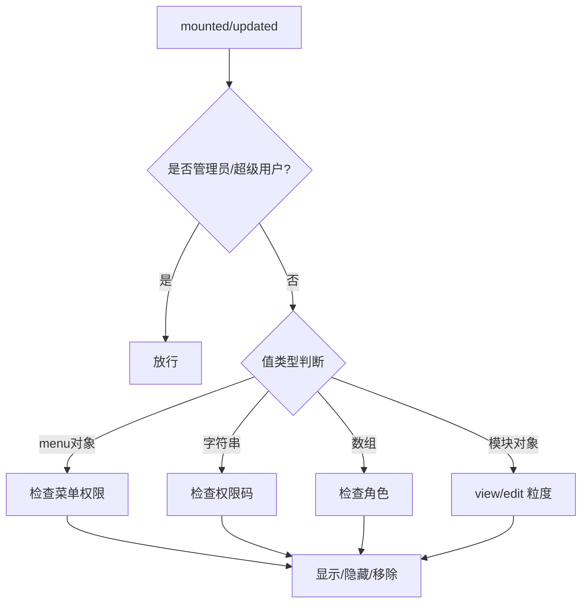
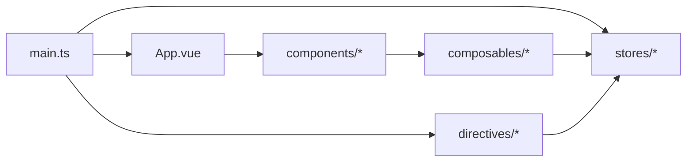

# Vue 3 开发规范

<cite>
**本文引用的文件**
- [frontend/src/main.ts](file://frontend/src/main.ts)
- [frontend/src/App.vue](file://frontend/src/App.vue)
- [frontend/src/composables/useEventBus.ts](file://frontend/src/composables/useEventBus.ts)
- [frontend/src/directives/permission.ts](file://frontend/src/directives/permission.ts)
- [frontend/src/components/common/DataTable.vue](file://frontend/src/components/common/DataTable.vue)
- [frontend/src/components/business/EmptyState/EmptyState.vue](file://frontend/src/components/business/EmptyState/EmptyState.vue)
- [frontend/src/stores/auth.ts](file://frontend/src/stores/auth.ts)
</cite>

## 目录
1. [简介](#简介)
2. [项目结构](#项目结构)
3. [核心组件](#核心组件)
4. [架构总览](#架构总览)
5. [详细组件分析](#详细组件分析)
6. [依赖关系分析](#依赖关系分析)
7. [性能考虑](#性能考虑)
8. [故障排查指南](#故障排查指南)
9. [结论](#结论)
10. [附录](#附录)

## 简介
本规范面向基于 Composition API 的 Vue 3 前端工程，聚焦以下目标：
- 统一使用 <script setup> 语法与响应式数据管理模式
- 明确组件设计原则、Props/Emits 类型定义、插槽使用模式
- 规范自定义指令开发、组合式函数（composables）编写、事件总线模式
- 提供组件复用最佳实践、性能优化技巧与错误处理策略
- 结合仓库现有实现给出可落地的示例路径与常见问题解决方案

## 项目结构
前端采用按功能域划分的目录组织方式，关键目录职责如下：
- src/components：通用业务组件与页面级组件
- src/composables：可复用的组合式逻辑封装
- src/directives：全局自定义指令（权限、水印等）
- src/stores：Pinia 状态管理（认证、菜单、配置等）
- src/api：请求封装与接口定义
- src/utils：工具函数与公共能力
- src/styles：主题与样式体系
- src/router：路由与守卫
- src/views：页面视图

图示来源
- [frontend/src/main.ts:1-69](file://frontend/src/main.ts#L1-L69)
- [frontend/src/App.vue:1-109](file://frontend/src/App.vue#L1-L109)
- [frontend/src/stores/auth.ts:1-295](file://frontend/src/stores/auth.ts#L1-L295)

章节来源
- [frontend/src/main.ts:1-69](file://frontend/src/main.ts#L1-L69)
- [frontend/src/App.vue:1-109](file://frontend/src/App.vue#L1-L109)

## 核心组件
- 根组件 App.vue：提供 Element Plus 全局配置、错误边界、路由容器与版本检查。
- 通用表格 DataTable.vue：以 Props 驱动列与数据的轻量表格封装。
- 空态 EmptyState.vue：统一空态展示与行动按钮，支持多场景文案与尺寸控制。
- 认证 Store auth.ts：登录、登出、锁屏、模块权限映射、2FA 流程等。
- 事件总线 useEventBus.ts：跨组件通信的最小化实现。
- 权限指令 permission.ts：角色/权限码/菜单/模块粒度四种用法。

章节来源
- [frontend/src/App.vue:1-109](file://frontend/src/App.vue#L1-L109)
- [frontend/src/components/common/DataTable.vue:1-20](file://frontend/src/components/common/DataTable.vue#L1-L20)
- [frontend/src/components/business/EmptyState/EmptyState.vue:1-51](file://frontend/src/components/business/EmptyState/EmptyState.vue#L1-L51)
- [frontend/src/stores/auth.ts:1-295](file://frontend/src/stores/auth.ts#L1-L295)
- [frontend/src/composables/useEventBus.ts:1-30](file://frontend/src/composables/useEventBus.ts#L1-L30)
- [frontend/src/directives/permission.ts:1-141](file://frontend/src/directives/permission.ts#L1-L141)

## 架构总览
前端以 main.ts 为入口，初始化应用、安装 Pinia、路由、全局指令与全局错误处理；App.vue 作为根组件承载错误边界与全局 UI 配置；业务组件通过 composables 复用逻辑，通过 stores 共享状态，通过 directives 进行权限控制。

图示来源
- [frontend/src/main.ts:1-69](file://frontend/src/main.ts#L1-L69)
- [frontend/src/App.vue:1-109](file://frontend/src/App.vue#L1-L109)
- [frontend/src/stores/auth.ts:1-295](file://frontend/src/stores/auth.ts#L1-L295)
- [frontend/src/directives/permission.ts:1-141](file://frontend/src/directives/permission.ts#L1-L141)

## 详细组件分析

### 根组件 App.vue（错误边界与全局配置）
- 职责
  - 提供 Element Plus 全局语言与尺寸配置
  - 使用 onErrorCaptured 捕获子树错误并渲染降级界面
  - 路由切换后自动清除错误状态
  - 启动时执行版本检查
- 关键点
  - 错误边界阻止异常冒泡，避免白屏
  - 通过 router.afterEach 在路由切换时重置错误状态
  - 使用 onMounted 触发版本检查

图示来源
- [frontend/src/App.vue:1-109](file://frontend/src/App.vue#L1-L109)

章节来源
- [frontend/src/App.vue:1-109](file://frontend/src/App.vue#L1-L109)

### 通用表格 DataTable.vue（Props 驱动）
- 设计要点
  - 使用 <script setup> 与 defineProps 声明强类型 Props
  - 通过 columns 数组动态生成表格列，减少重复模板
  - loading 透传用于加载态控制
- 建议
  - 对 columns 增加必填校验与默认值
  - 对 data 做分页或虚拟滚动扩展

图示来源
- [frontend/src/components/common/DataTable.vue:1-20](file://frontend/src/components/common/DataTable.vue#L1-L20)

章节来源
- [frontend/src/components/common/DataTable.vue:1-20](file://frontend/src/components/common/DataTable.vue#L1-L20)

### 空态 EmptyState.vue（插槽与事件）
- 设计要点
  - 通过 withDefaults 设置默认 Props
  - 使用 defineEmits 声明 action 事件
  - 根据 type 解析默认文案，支持 text 覆盖
  - 使用插槽注入行动按钮
- 建议
  - 将文案集中到 i18n 或常量表
  - 为不同 type 提供差异化图标与交互

图示来源
- [frontend/src/components/business/EmptyState/EmptyState.vue:1-51](file://frontend/src/components/business/EmptyState/EmptyState.vue#L1-L51)

章节来源
- [frontend/src/components/business/EmptyState/EmptyState.vue:1-51](file://frontend/src/components/business/EmptyState/EmptyState.vue#L1-L51)

### 认证 Store auth.ts（状态与权限）
- 职责
  - 维护 token/user/refreshToken/error 等状态
  - 提供登录、2FA 验证、登出、锁屏/解锁、获取用户信息等方法
  - 计算 isAuthenticated、isAdmin、canViewDeleted、modulePermissions
- 关键点
  - 模块级权限映射：将字符串权限转换为 view/edit 结构供指令使用
  - 登录成功后预取菜单与 CSRF，提升首屏体验
  - 登出时尝试通知服务端吊销，失败不影响本地清理

图示来源
- [frontend/src/stores/auth.ts:1-295](file://frontend/src/stores/auth.ts#L1-L295)

章节来源
- [frontend/src/stores/auth.ts:1-295](file://frontend/src/stores/auth.ts#L1-L295)

### 事件总线 useEventBus.ts（跨组件通信）
- 设计要点
  - 使用 Map/Set 存储事件与处理器，避免内存泄漏
  - 提供 on/off/emit 三件套
  - 导出工厂函数便于按需实例化
- 建议
  - 在组件销毁时调用 off 移除监听
  - 对事件名进行命名规范约束

图示来源
- [frontend/src/composables/useEventBus.ts:1-30](file://frontend/src/composables/useEventBus.ts#L1-L30)

章节来源
- [frontend/src/composables/useEventBus.ts:1-30](file://frontend/src/composables/useEventBus.ts#L1-L30)

### 权限指令 permission.ts（细粒度控制）
- 支持用法
  - 角色数组：v-permission="['admin','manager']"
  - 权限码字符串：v-permission="'project:create'"
  - 菜单 key：v-permission="{ menu: 'system' }"
  - 模块 view/edit：v-permission="{ module: 'village', level: 'edit' }"
- 行为
  - mounted：无权限时直接移除节点
  - updated：无权限时隐藏元素，有权限时恢复
  - 管理员/超级用户始终放行
- 依赖
  - 读取 auth store 的用户信息与模块权限映射
  - 读取 menu store 的菜单访问能力

图示来源
- [frontend/src/directives/permission.ts:1-141](file://frontend/src/directives/permission.ts#L1-L141)

章节来源
- [frontend/src/directives/permission.ts:1-141](file://frontend/src/directives/permission.ts#L1-L141)

## 依赖关系分析
- 入口依赖
  - main.ts 引入 App.vue、路由、Pinia、全局样式、指令与全局错误处理
- 组件依赖
  - App.vue 依赖路由与 composables 的版本检查
  - 业务组件依赖 composables 与 stores
  - 指令依赖 stores 的认证与菜单能力
- 状态依赖
  - auth store 依赖 api/request、两个 factor 接口、roleAccess 工具与 AuthStorage

图示来源
- [frontend/src/main.ts:1-69](file://frontend/src/main.ts#L1-L69)
- [frontend/src/App.vue:1-109](file://frontend/src/App.vue#L1-L109)
- [frontend/src/stores/auth.ts:1-295](file://frontend/src/stores/auth.ts#L1-L295)
- [frontend/src/directives/permission.ts:1-141](file://frontend/src/directives/permission.ts#L1-L141)

章节来源
- [frontend/src/main.ts:1-69](file://frontend/src/main.ts#L1-L69)
- [frontend/src/App.vue:1-109](file://frontend/src/App.vue#L1-L109)
- [frontend/src/stores/auth.ts:1-295](file://frontend/src/stores/auth.ts#L1-L295)
- [frontend/src/directives/permission.ts:1-141](file://frontend/src/directives/permission.ts#L1-L141)

## 性能考虑
- 首屏优化
  - 在 main.ts 中提前应用主题，避免 FOUC
  - 登录后预取菜单与 CSRF，减少后续请求延迟
- 渲染优化
  - 使用 <script setup> 与 defineProps/defineEmits 获得更好的编译期优化
  - 列表使用稳定 key，避免不必要的重渲染
  - 大数据表格考虑分页或虚拟滚动
- 资源优化
  - 按需导入 Element Plus 命令式组件样式，避免冗余
  - 图片与静态资源懒加载与压缩
- 状态优化
  - 合理使用 computed 缓存派生数据
  - 在 composables 中及时移除事件监听，防止内存泄漏

[本节为通用指导，不直接分析具体文件]

## 故障排查指南
- 全局错误处理
  - main.ts 安装全局错误处理，捕获 window.onerror/unhandledrejection
  - App.vue 使用 onErrorCaptured 捕获组件错误并降级展示
- 权限问题
  - 检查 v-permission 的值类型是否符合预期
  - 确认 auth store 中用户权限与模块权限映射是否正确
  - 管理员/超级用户应始终放行
- 登录与鉴权
  - 登录失败时查看 error 字段与网络响应
  - 2FA 流程需正确传递 tempToken 与验证码
  - 登出时注意本地清理与服务端吊销的容错
- 事件总线
  - 确保在组件卸载时调用 off 移除监听
  - 事件名保持唯一且语义清晰

章节来源
- [frontend/src/main.ts:1-69](file://frontend/src/main.ts#L1-L69)
- [frontend/src/App.vue:1-109](file://frontend/src/App.vue#L1-L109)
- [frontend/src/directives/permission.ts:1-141](file://frontend/src/directives/permission.ts#L1-L141)
- [frontend/src/stores/auth.ts:1-295](file://frontend/src/stores/auth.ts#L1-L295)

## 结论
本规范围绕 Composition API 与 <script setup> 构建统一的 Vue 3 开发范式，结合仓库现有实现明确了组件设计、状态管理、指令与组合式函数的最佳实践。通过错误边界、权限指令与事件总线等机制，提升了系统的健壮性与可维护性。建议在团队内推广该规范，并在新增功能时遵循一致的目录结构与类型约定。

[本节为总结性内容，不直接分析具体文件]

## 附录
- 组件复用建议
  - 将通用 UI 抽象为 components/common，业务相关抽象为 components/business
  - 使用 Props 与 Emits 明确契约，避免隐式依赖
  - 复杂逻辑下沉至 composables，保持组件职责单一
- 常见模式参考路径
  - <script setup> 与响应式：见各组件 script 块
  - 事件总线：useEventBus.ts
  - 权限指令：permission.ts
  - 认证流程：auth.ts
  - 空态与插槽：EmptyState.vue
  - 表格封装：DataTable.vue

[本节为补充说明，不直接分析具体文件]