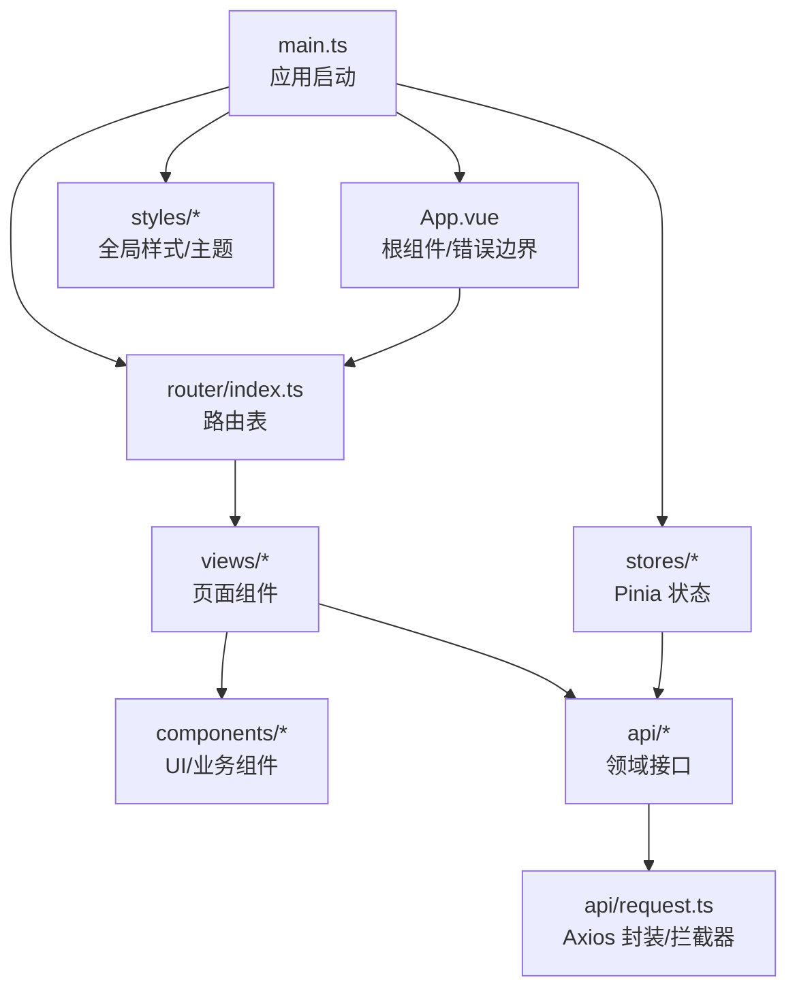
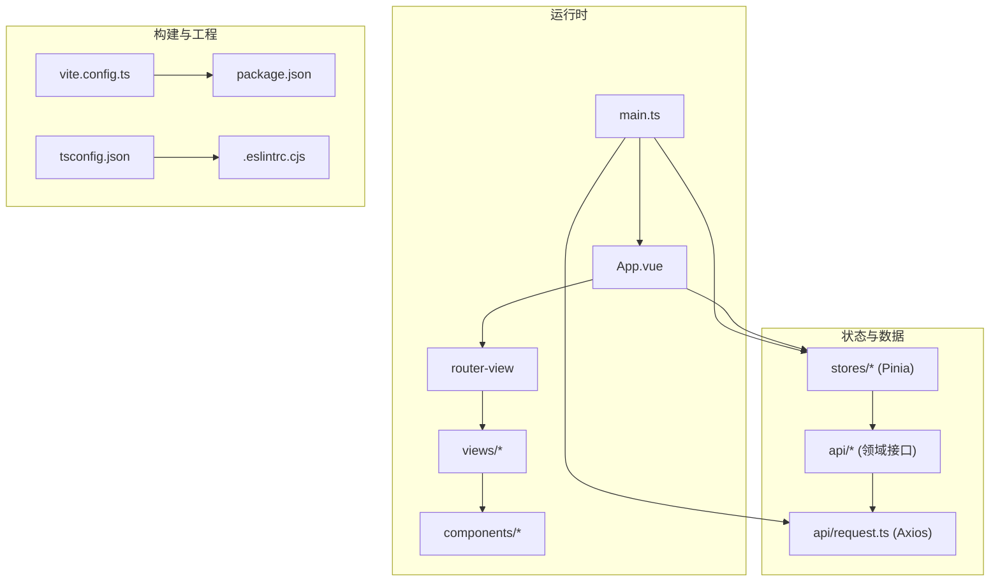
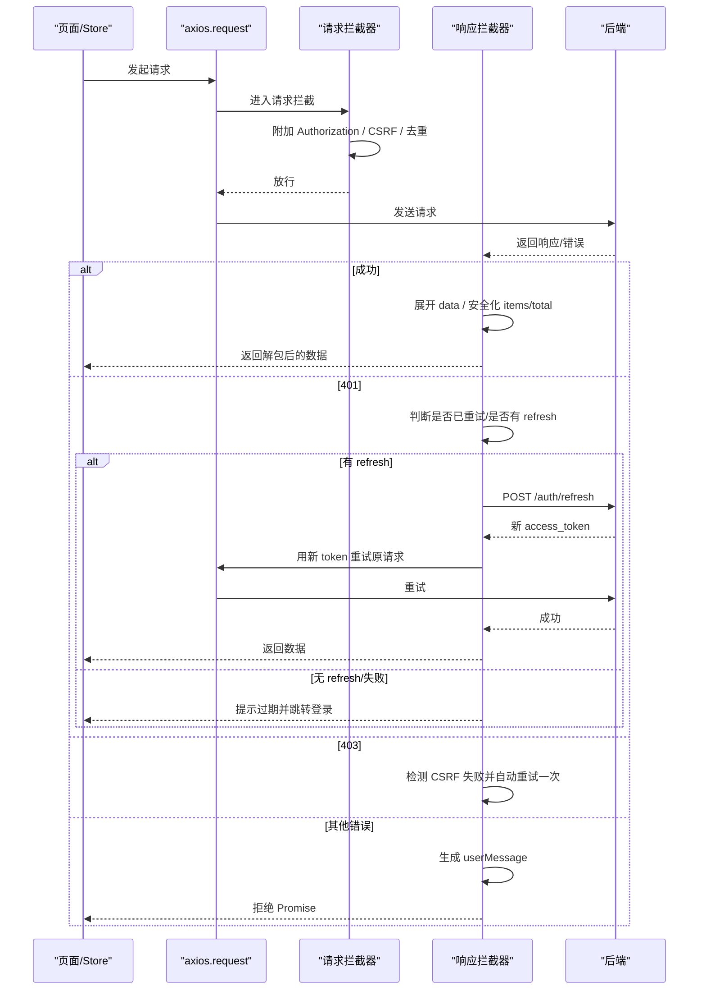
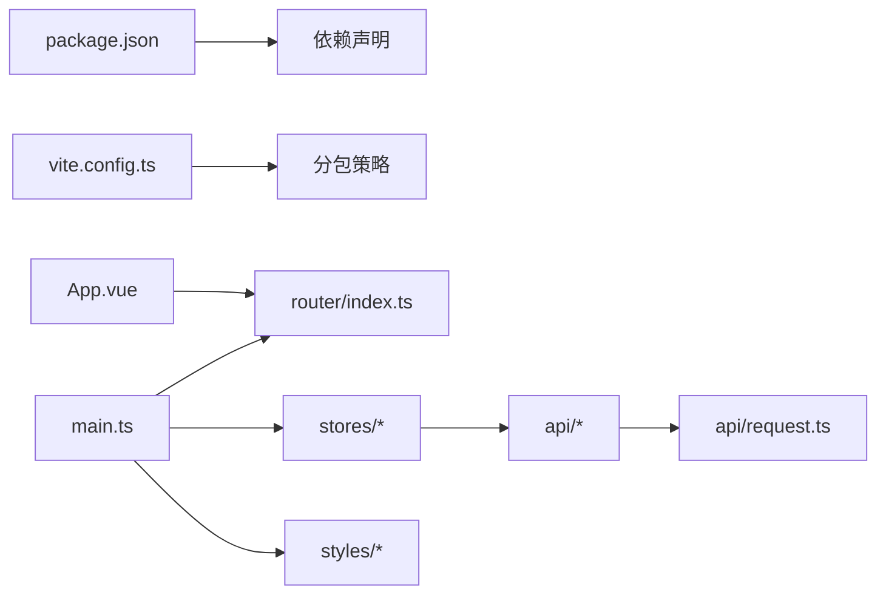

# 前端开发指南

<cite>
**本文引用的文件**
- [frontend/package.json](file://frontend/package.json)
- [frontend/vite.config.ts](file://frontend/vite.config.ts)
- [frontend/tsconfig.json](file://frontend/tsconfig.json)
- [frontend/.eslintrc.cjs](file://frontend/.eslintrc.cjs)
- [frontend/src/main.ts](file://frontend/src/main.ts)
- [frontend/src/App.vue](file://frontend/src/App.vue)
- [frontend/src/router/index.ts](file://frontend/src/router/index.ts)
- [frontend/src/stores/auth.ts](file://frontend/src/stores/auth.ts)
- [frontend/src/api/request.ts](file://frontend/src/api/request.ts)
</cite>

## 目录
1. [简介](#简介)
2. [项目结构](#项目结构)
3. [核心组件](#核心组件)
4. [架构总览](#架构总览)
5. [详细组件分析](#详细组件分析)
6. [依赖关系分析](#依赖关系分析)
7. [性能与构建优化](#性能与构建优化)
8. [测试与质量保障](#测试与质量保障)
9. [调试与错误处理](#调试与错误处理)
10. [部署与运行环境](#部署与运行环境)
11. [结论](#结论)

## 简介
本指南面向使用 Vue 3 + TypeScript 的前端开发者，覆盖开发环境配置、项目结构说明、组件开发模式、状态管理（Pinia）、路由导航、API 调用封装、UI 组件库（Element Plus）使用、类型定义、响应式与可访问性、性能优化、错误处理、测试编写、构建与部署、调试技巧等。目标是帮助团队快速上手并遵循统一的前端开发标准。

## 项目结构
前端采用模块化组织：
- 应用入口与全局装配：main.ts、App.vue
- 路由与守卫：router/index.ts、router/guards.ts
- 状态管理：stores/*（以 Pinia store 为单位）
- API 层：api/*（按业务域拆分），请求封装在 api/request.ts
- 组件：components/*（通用/业务/布局等）
- 视图：views/*（页面级组件）
- 工具与常量：utils/*、constants/*、composables/*
- 样式：styles/*（主题、规范化、打印、无障碍等）
- 构建与工程化：vite.config.ts、tsconfig.json、package.json、.eslintrc.cjs

图表来源
- [frontend/src/main.ts:1-69](file://frontend/src/main.ts#L1-L69)
- [frontend/src/App.vue:1-109](file://frontend/src/App.vue#L1-L109)
- [frontend/src/router/index.ts:1-800](file://frontend/src/router/index.ts#L1-L800)
- [frontend/src/api/request.ts:1-746](file://frontend/src/api/request.ts#L1-L746)

章节来源
- [frontend/package.json:1-73](file://frontend/package.json#L1-L73)
- [frontend/vite.config.ts:1-472](file://frontend/vite.config.ts#L1-L472)
- [frontend/tsconfig.json:1-42](file://frontend/tsconfig.json#L1-L42)
- [frontend/.eslintrc.cjs:1-66](file://frontend/.eslintrc.cjs#L1-L66)

## 核心组件
- 应用入口 main.ts
  - 初始化 Pinia、Router、全局指令（权限/水印）、全局错误处理、命令式消息默认配置、主题预应用与旧 token 迁移。
- 根组件 App.vue
  - 提供 Element Plus 全局配置（语言、尺寸），实现组件级错误边界，路由切换时自动恢复错误状态，并在挂载时检查版本更新。
- 路由 index.ts
  - 集中式路由表，大量页面使用懒加载；公共路由无鉴权；主布局下包含多模块子路由；支持旧路径重定向与菜单元信息。
- 状态管理 stores/auth.ts
  - 登录、登出、锁屏/解锁、2FA 流程、用户信息获取、模块权限映射、记住登录持久化、CSRF 预取等。
- API 封装 api/request.ts
  - Axios 实例、请求/响应拦截器、CSRF Double Submit Cookie、401 刷新令牌、并发去重、离线回退、统一错误提示策略、下载与文件名解析等。

章节来源
- [frontend/src/main.ts:1-69](file://frontend/src/main.ts#L1-L69)
- [frontend/src/App.vue:1-109](file://frontend/src/App.vue#L1-L109)
- [frontend/src/router/index.ts:1-800](file://frontend/src/router/index.ts#L1-L800)
- [frontend/src/stores/auth.ts:1-295](file://frontend/src/stores/auth.ts#L1-L295)
- [frontend/src/api/request.ts:1-746](file://frontend/src/api/request.ts#L1-L746)

## 架构总览
前端基于 Vue 3 组合式 API + TypeScript，通过 Vite 构建，使用 Element Plus 作为 UI 组件库，Pinia 进行状态管理，Vue Router 管理路由，Axios 封装统一网络层。

图表来源
- [frontend/src/main.ts:1-69](file://frontend/src/main.ts#L1-L69)
- [frontend/src/App.vue:1-109](file://frontend/src/App.vue#L1-L109)
- [frontend/src/router/index.ts:1-800](file://frontend/src/router/index.ts#L1-L800)
- [frontend/src/stores/auth.ts:1-295](file://frontend/src/stores/auth.ts#L1-L295)
- [frontend/src/api/request.ts:1-746](file://frontend/src/api/request.ts#L1-L746)
- [frontend/vite.config.ts:1-472](file://frontend/vite.config.ts#L1-L472)
- [frontend/package.json:1-73](file://frontend/package.json#L1-L73)
- [frontend/tsconfig.json:1-42](file://frontend/tsconfig.json#L1-L42)
- [frontend/.eslintrc.cjs:1-66](file://frontend/.eslintrc.cjs#L1-L66)

## 详细组件分析

### 应用启动与全局装配（main.ts）
- 职责：创建应用、安装 Pinia/Router、注册全局指令、注入全局样式、设置 ElMessage 默认行为、应用主题、迁移旧 token、挂载全局错误处理。
- 关键点：
  - 命令式组件样式显式引入，避免按需导入导致的样式缺失。
  - 主题在挂载前应用，避免首屏闪烁。
  - 全局错误处理统一捕获未处理异常。

章节来源
- [frontend/src/main.ts:1-69](file://frontend/src/main.ts#L1-L69)

### 根组件与错误边界（App.vue）
- 职责：提供 Element Plus 全局配置、渲染路由视图、捕获组件错误并展示友好提示、路由切换后重置错误状态、启动版本检查。
- 关键点：
  - 使用 onErrorCaptured 捕获子树错误，阻止白屏。
  - 路由 afterEach 清理错误状态，提升用户体验。

章节来源
- [frontend/src/App.vue:1-109](file://frontend/src/App.vue#L1-L109)

### 路由与导航（router/index.ts）
- 职责：集中定义路由表，划分公共路由与主布局子路由，懒加载页面，统一 meta（标题、菜单键、角色限制）。
- 关键点：
  - 大量使用动态 import 实现代码分割。
  - 旧路径重定向到新入口，保持兼容性。
  - 通过 meta.roles 控制菜单可见性与访问权限。

章节来源
- [frontend/src/router/index.ts:1-800](file://frontend/src/router/index.ts#L1-L800)

### 认证与权限状态（stores/auth.ts）
- 职责：维护登录态、用户信息、模块权限映射、2FA 流程、锁屏/解锁、记住登录、预取 CSRF。
- 关键点：
  - 登录成功后预加载菜单，减少侧边栏闪烁。
  - 模块权限将后端字符串权限转换为结构化查询表，供 v-permission 指令使用。
  - 登出时尝试通知服务端吊销 refresh_token，失败不阻塞本地清理。

章节来源
- [frontend/src/stores/auth.ts:1-295](file://frontend/src/stores/auth.ts#L1-L295)

### HTTP 请求封装与拦截器（api/request.ts）
- 职责：Axios 实例配置、请求/响应拦截、CSRF 管理、401 刷新令牌、并发去重、离线回退、统一错误提示、下载与文件名解析。
- 关键点：
  - 仅 GET 参与去重取消，避免写入操作被误取消。
  - 401 分支：已带 _retry 标记的请求再次 401 直接登出；否则尝试 refresh；无 refresh_token 或失败则跳转登录。
  - 403 分支：检测到 CSRF 失败时自动重试一次。
  - 响应展开：将 {data} 中的对象字段提升到顶层，数组设为 items，保证调用方简化访问。
  - 离线模式：网络失败时尝试返回 Mock 数据。

图表来源
- [frontend/src/api/request.ts:1-746](file://frontend/src/api/request.ts#L1-L746)

章节来源
- [frontend/src/api/request.ts:1-746](file://frontend/src/api/request.ts#L1-L746)

### 构建与工程化（vite.config.ts、tsconfig.json、package.json、.eslintrc.cjs）
- Vite 配置要点：
  - SPA 回退插件确保 history 路由正常。
  - 生产环境启用 Gzip/Brotli 压缩。
  - Element Plus 按需引入与自动导入。
  - 精细的 manualChunks 分包策略（vue-core、pinia、echarts、xlsx、axios 等）。
  - CSS 源码映射、SCSS 变量注入、资源命名规范。
  - 开发代理 /api 与 /uploads 指向后端。
- TypeScript：
  - 严格模式、路径别名、模块解析为 bundler。
- ESLint：
  - 禁止 response.data.success 双重解包，v-html 局部豁免。
- 脚本：
  - dev/build/test/lint/type-check 等常用命令。

章节来源
- [frontend/vite.config.ts:1-472](file://frontend/vite.config.ts#L1-L472)
- [frontend/tsconfig.json:1-42](file://frontend/tsconfig.json#L1-L42)
- [frontend/package.json:1-73](file://frontend/package.json#L1-L73)
- [frontend/.eslintrc.cjs:1-66](file://frontend/.eslintrc.cjs#L1-L66)

## 依赖关系分析
- 运行时依赖：
  - Vue 3、Vue Router、Pinia、Element Plus、Axios、ECharts、Chart.js、Day.js、DOMPurify、SortableJS、XLSX 等。
- 开发依赖：
  - Vite、TypeScript、ESLint、Prettier、Vitest、Playwright、unplugin-auto-import、unplugin-vue-components、sass、terser 等。
- 关键耦合点：
  - main.ts 依赖 router、stores、styles、directives。
  - App.vue 依赖 Element Plus 配置与路由。
  - stores/auth.ts 依赖 api/request.ts 与 AuthStorage。
  - api/request.ts 是各业务 api 模块的统一网络层。

图表来源
- [frontend/package.json:1-73](file://frontend/package.json#L1-L73)
- [frontend/vite.config.ts:1-472](file://frontend/vite.config.ts#L1-L472)
- [frontend/src/main.ts:1-69](file://frontend/src/main.ts#L1-L69)
- [frontend/src/App.vue:1-109](file://frontend/src/App.vue#L1-L109)
- [frontend/src/router/index.ts:1-800](file://frontend/src/router/index.ts#L1-L800)
- [frontend/src/stores/auth.ts:1-295](file://frontend/src/stores/auth.ts#L1-L295)
- [frontend/src/api/request.ts:1-746](file://frontend/src/api/request.ts#L1-L746)

章节来源
- [frontend/package.json:1-73](file://frontend/package.json#L1-L73)
- [frontend/vite.config.ts:1-472](file://frontend/vite.config.ts#L1-L472)

## 性能与构建优化
- 代码分割：
  - 第三方库独立 chunk（vue-core、pinia、echarts、xlsx、axios、security 等），降低首屏体积。
  - 视图与大型库通过动态 import 懒加载。
- 压缩与缓存：
  - 生产环境启用 Gzip/Brotli，CSS 压缩，静态资源哈希命名。
- 预构建与优化：
  - optimizeDeps 预构建高频依赖，esbuild target 提升至 es2020。
- 资源内联阈值：
  - 小资源内联为 base64，减少请求数。
- 警告抑制：
  - 抑制 Element Plus 按需分包循环依赖与 Rollup 注解相关警告。

章节来源
- [frontend/vite.config.ts:133-426](file://frontend/vite.config.ts#L133-L426)

## 测试与质量保障
- 单元测试与覆盖率：
  - Vitest 运行与覆盖率收集，JSDOM 环境。
- 端到端测试：
  - Playwright 配置用于 E2E 场景。
- 代码质量：
  - ESLint + Prettier 统一风格，严格规则（如禁止双重解包）。
  - TypeScript 严格模式与增量编译。
- 建议实践：
  - 对复杂逻辑（如 request 拦截器、auth store）补充单测用例。
  - 对关键页面与交互编写 E2E 用例，覆盖登录、鉴权、数据流。

章节来源
- [frontend/package.json:7-19](file://frontend/package.json#L7-L19)
- [frontend/.eslintrc.cjs:25-41](file://frontend/.eslintrc.cjs#L25-L41)
- [frontend/tsconfig.json:1-42](file://frontend/tsconfig.json#L1-L42)

## 调试与错误处理
- 全局错误处理：
  - main.ts 中安装全局错误处理，捕获 window.onerror 与 unhandledrejection。
- 组件级错误边界：
  - App.vue 使用 onErrorCaptured 捕获子树错误，展示友好提示并支持重试。
- 网络层错误：
  - 401：统一提示并跳转登录，支持 refresh 续期。
  - 403：CSRF 失败自动重试一次。
  - 其他错误：生成 userMessage，由页面或全局兜底提示。
- 调试技巧：
  - 开发环境保留 console/debugger，生产环境移除。
  - 使用 vite preview 预览构建产物。
  - 利用 source map 定位问题（开发开启，生产关闭）。

章节来源
- [frontend/src/main.ts:57-64](file://frontend/src/main.ts#L57-L64)
- [frontend/src/App.vue:44-59](file://frontend/src/App.vue#L44-L59)
- [frontend/src/api/request.ts:85-101](file://frontend/src/api/request.ts#L85-L101)
- [frontend/src/api/request.ts:345-449](file://frontend/src/api/request.ts#L345-L449)
- [frontend/vite.config.ts:211-265](file://frontend/vite.config.ts#L211-L265)

## 部署与运行环境
- 开发服务器：
  - 端口 5173，host 127.0.0.1，自动端口切换。
  - 代理 /api 与 /uploads 到后端（可通过环境变量覆盖）。
- 构建输出：
  - 输出目录 dist，复制 public 静态资源，CSS 代码分割。
- 生产环境：
  - 启用压缩与最小化，移除 console/debugger，禁用 source map。
- Electron 集成：
  - 根目录存在 electron 文件夹，适用于桌面端打包与分发。

章节来源
- [frontend/vite.config.ts:175-206](file://frontend/vite.config.ts#L175-L206)
- [frontend/vite.config.ts:211-265](file://frontend/vite.config.ts#L211-L265)

## 结论
本项目在前端工程化方面具备完善的体系：清晰的目录结构、严格的类型与代码规范、健壮的网络层与错误处理、高效的构建与分包策略、以及完整的测试与质量保障。遵循本指南的开发规范，可显著提升团队协作效率与交付质量。建议在新增功能时优先复用现有模式（Pinia store、api 模块、路由懒加载、Element Plus 按需引入），并持续完善测试与文档。