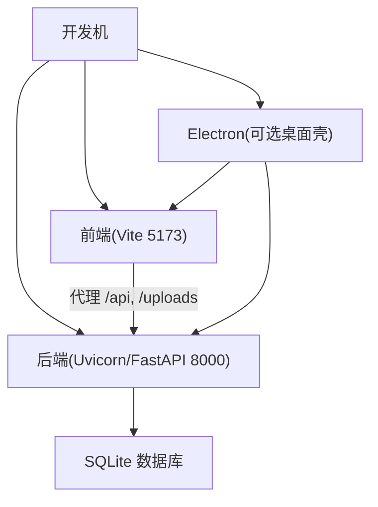
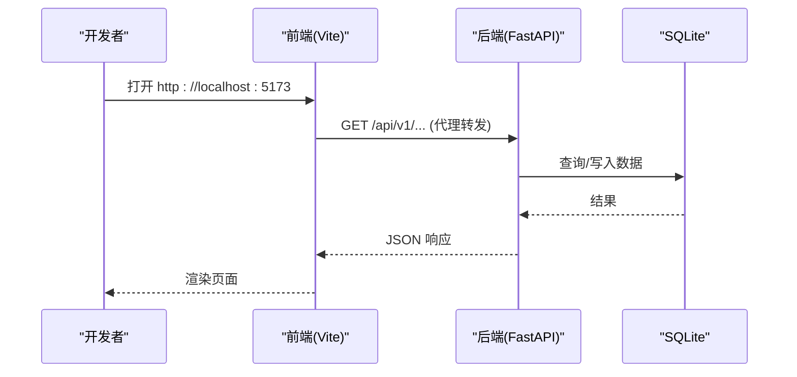

# 开发环境搭建

<cite>
**本文引用的文件**
- [README.md](file://README.md)
- [package.json](file://package.json)
- [backend/pyproject.toml](file://backend/pyproject.toml)
- [frontend/package.json](file://frontend/package.json)
- [scripts/dev-setup.sh](file://scripts/dev-setup.sh)
- [scripts/dev-setup.bat](file://scripts/dev-setup.bat)
- [backend/requirements.txt](file://backend/requirements.txt)
- [backend/.env.example](file://backend/.env.example)
- [frontend/.env.example](file://frontend/.env.example)
- [backend/start.py](file://backend/start.py)
- [scripts/start-all.bat](file://scripts/start-all.bat)
- [docs/01-快速开始/启动指南.md](file://docs/01-快速开始/启动指南.md)
- [backend/requirements-dev.txt](file://backend/requirements-dev.txt)
- [frontend/vite.config.ts](file://frontend/vite.config.ts)
- [Makefile](file://Makefile)
</cite>

## 目录
1. [简介](#简介)
2. [项目结构](#项目结构)
3. [核心组件](#核心组件)
4. [架构总览](#架构总览)
5. [详细组件分析](#详细组件分析)
6. [依赖分析](#依赖分析)
7. [性能考虑](#性能考虑)
8. [故障排除指南](#故障排除指南)
9. [结论](#结论)
10. [附录](#附录)

## 简介
本指南面向首次参与“帮扶管理信息系统（乡村振兴）”项目的开发者，提供从零开始的本地开发环境搭建说明。内容覆盖：
- Node.js 与 Python 环境准备
- 前后端依赖安装与环境变量配置
- Windows、macOS、Linux 的差异化步骤
- IDE（VS Code、WebStorm）推荐设置
- 浏览器扩展建议
- 项目初始化、开发服务器启动、热重载配置
- 常见问题与排障

本项目采用前后端分离架构：后端基于 FastAPI + SQLite，前端基于 Vue 3 + TypeScript + Vite，并提供 Electron 桌面壳与一键脚本辅助开发与打包。

## 项目结构
仓库根目录包含后端、前端、Electron 壳、构建与部署脚本、文档等。关键路径：
- backend：FastAPI 后端服务、数据模型、迁移、脚本
- frontend：Vue 3 + TS + Vite 前端工程
- electron：桌面应用主进程与预加载脚本
- scripts：跨平台初始化与启动脚本
- docs：用户与开发文档
- Makefile：统一测试、构建、打包命令

图表来源
- [frontend/vite.config.ts:175-206](file://frontend/vite.config.ts#L175-L206)
- [backend/start.py:520-559](file://backend/start.py#L520-L559)
- [package.json:34-147](file://package.json#L34-L147)

章节来源
- [README.md:155-180](file://README.md#L155-L180)

## 核心组件
- 后端服务：FastAPI + Uvicorn，默认监听 8000 端口，提供 REST API 与 Swagger 文档
- 前端开发服务器：Vite 默认 5173 端口，内置代理将 /api、/uploads 转发到后端
- 环境变量：前后端分别通过 .env 控制行为（如 CORS、API 地址、调试开关）
- 一键脚本：Windows/Linux 提供 dev-setup 与 start-all 流程，简化初始化与启动

章节来源
- [backend/start.py:520-559](file://backend/start.py#L520-L559)
- [frontend/vite.config.ts:175-206](file://frontend/vite.config.ts#L175-L206)
- [backend/.env.example:20-40](file://backend/.env.example#L20-L40)
- [frontend/.env.example:4-8](file://frontend/.env.example#L4-L8)

## 架构总览
下图展示开发模式下的请求流转：前端通过 Vite 代理访问后端 API；后端读取 .env 配置并连接 SQLite；Electron 作为可选桌面壳集成前后端资源。

图表来源
- [frontend/vite.config.ts:190-206](file://frontend/vite.config.ts#L190-L206)
- [backend/start.py:520-559](file://backend/start.py#L520-L559)

## 详细组件分析

### 环境准备与依赖安装
- 系统要求与版本建议
  - Windows：建议使用 64 位 Python 3.11、Node.js LTS
  - macOS/Linux：Python 3.11+、Node.js LTS
- 使用一键脚本初始化（推荐）
  - Windows：运行 scripts/dev-setup.bat
  - Linux/macOS：bash scripts/dev-setup.sh
  - 脚本会创建 Python 虚拟环境、安装后端依赖、安装前端依赖、安装 pre-commit hooks，并复制 .env 模板
- 手动安装（分步）
  - 后端：cd backend && python -m venv .venv && pip install -r requirements.txt
  - 前端：cd frontend && npm install --legacy-peer-deps
- 依赖清单要点
  - 后端：FastAPI、Uvicorn、SQLAlchemy、Pydantic、Alembic、加密与安全库等
  - 前端：Vue 3、TypeScript、Vite、Element Plus、ECharts、Pinia 等

章节来源
- [scripts/dev-setup.bat:10-32](file://scripts/dev-setup.bat#L10-L32)
- [scripts/dev-setup.sh:13-25](file://scripts/dev-setup.sh#L13-L25)
- [backend/requirements.txt:1-137](file://backend/requirements.txt#L1-L137)
- [frontend/package.json:26-68](file://frontend/package.json#L26-L68)

### 环境变量配置
- 后端 .env（示例见 .env.example）
  - 数据库：DATABASE_URL（默认 SQLite 文件路径）
  - 服务器：HOST、PORT、DEBUG、ENVIRONMENT、API_PREFIX
  - 认证：ACCESS_TOKEN_EXPIRE_MINUTES、BCRYPT_ROUNDS 等
  - CORS：CORS_ORIGINS、CORS_ALLOW_CREDENTIALS、METHODS、HEADERS
  - 日志：LOG_LEVEL、LOG_FILE、ROTATION、RETENTION
  - 缓存/上传/监控等
- 前端 .env（示例见 .env.example）
  - VITE_API_BASE_URL：后端 API 基础地址（开发时留空或指向代理）
  - VITE_WS_BASE_URL：WebSocket 基础地址（可留空由运行时推断）
  - 应用标题、版本、模式（standalone/server）、调试开关、超时、CSRF、离线模式、地图配置等

注意：不要提交 .env 到版本库；生产环境请按需调整密钥与端口。

章节来源
- [backend/.env.example:1-80](file://backend/.env.example#L1-L80)
- [frontend/.env.example:1-51](file://frontend/.env.example#L1-L51)

### 开发服务器启动与热重载
- 后端启动
  - 方式一：python backend/start.py（自动检查端口、创建目录、校验数据库完整性、启动 Uvicorn）
  - 方式二：cd backend && uvicorn app.main:app --host 0.0.0.0 --port 8000 --reload
  - 访问：http://localhost:8000/docs（Swagger 文档）
- 前端启动
  - cd frontend && npm run dev（默认 5173 端口，支持热更新）
  - 代理：/api 与 /uploads 转发至 http://127.0.0.1:8000
- 一键启动
  - Windows：scripts/start-all.bat（清理端口、启动后端、等待就绪、自动打开浏览器）
  - Linux/macOS：参考 docs/01-快速开始/启动指南.md 中的脚本方式

章节来源
- [backend/start.py:520-559](file://backend/start.py#L520-L559)
- [frontend/vite.config.ts:175-206](file://frontend/vite.config.ts#L175-L206)
- [scripts/start-all.bat:13-70](file://scripts/start-all.bat#L13-L70)
- [docs/01-快速开始/启动指南.md:107-179](file://docs/01-快速开始/启动指南.md#L107-L179)

### 热重载与构建优化
- 前端热重载：Vite 开发服务器默认启用 HMR；watch 忽略特定目录避免扫描错误
- 构建优化：生产构建启用 Gzip/Brotli、代码分割、Terser 压缩、CSS 压缩、模块预加载等
- 预览：npm run preview 用于本地预览构建产物

章节来源
- [frontend/vite.config.ts:175-206](file://frontend/vite.config.ts#L175-L206)
- [frontend/vite.config.ts:211-426](file://frontend/vite.config.ts#L211-L426)

### IDE 与编辑器配置（VS Code、WebStorm）
- VS Code
  - 插件建议：ESLint、Prettier、Vue Language Features、Python、Pylance、Docker、GitLens
  - 工作区设置：开启保存时格式化；为 Python 指定 .venv 解释器；为前端启用 ESLint 修复
- WebStorm
  - 配置 Node 与 Python 解释器；启用 ESLint 与 Prettier；设置 Vite 运行配置；开启 Git 集成
- 通用
  - 使用 .editorconfig 保持编码与缩进一致
  - 使用 .prettierrc.json 统一格式规则

[本节为通用实践说明，不直接引用具体代码文件]

### 浏览器扩展建议
- 开发调试：React/Vue DevTools（用于调试前端状态与组件）
- API 调试：Postman 或 Insomnia（便于独立验证后端接口）
- 网络与缓存：禁用缓存以便开发时实时刷新

[本节为通用实践说明，不直接引用具体代码文件]

## 依赖分析
- 后端依赖
  - Web 框架：FastAPI、Uvicorn、Starlette
  - 数据库：SQLAlchemy、Alembic、greenlet、async-timeout
  - 安全：PyJWT、bcrypt、cryptography、pyotp
  - 数据处理：pandas、numpy、scikit-learn、openpyxl、reportlab 等
  - 工具：python-dotenv、click、diskcache、requests 等
- 前端依赖
  - 框架与工具：Vue 3、TypeScript、Vite、Pinia、Element Plus、ECharts
  - 测试与质量：Vitest、Playwright、ESLint、Prettier、vue-tsc
- 构建与打包
  - Electron：electron、electron-builder、NSIS（Windows）
  - 后端打包：PyInstaller（见 Makefile 目标）

章节来源
- [backend/requirements.txt:1-137](file://backend/requirements.txt#L1-L137)
- [frontend/package.json:26-68](file://frontend/package.json#L26-L68)
- [package.json:26-147](file://package.json#L26-L147)
- [Makefile:100-159](file://Makefile#L100-L159)

## 性能考虑
- 开发模式
  - 后端：使用 --reload 实现热重载；确保端口未被占用
  - 前端：HMR 提升编辑体验；必要时关闭不必要的插件或日志
- 构建与分发
  - 前端：启用 Gzip/Brotli、代码分割、懒加载大型库（如 ECharts、xlsx）
  - 后端：合理设置数据库连接池参数；限制上传大小与类型；启用日志轮转
- 资源与内存
  - 避免在开发时同时运行过多重型任务（如全量测试、大数据导入）
  - 关注 CPU 与内存占用，必要时调整并发与超时

[本节为通用指导，不直接引用具体代码文件]

## 故障排除指南
- 端口被占用
  - 现象：Address already in use
  - 处理：修改端口或终止占用进程；Windows 可使用 netstat/taskkill；后端启动脚本已尝试检测并提示
- Python 模块未找到
  - 现象：ModuleNotFoundError
  - 处理：激活 .venv 后重新安装依赖；确认使用正确的 Python 版本（建议 3.11 64 位）
- Node 依赖安装失败
  - 现象：npm install 报错
  - 处理：删除 node_modules 与 lock 文件后重试；使用 --legacy-peer-deps；切换镜像源
- 数据库初始化失败
  - 现象：无法创建或迁移数据库
  - 处理：检查 DATABASE_URL 与权限；必要时删除损坏数据库并重建（谨慎操作）
- CORS 错误
  - 现象：浏览器控制台 CORS 拒绝
  - 处理：在 backend/.env 中配置 CORS_ORIGINS 包含前端地址（如 http://localhost:5173）
- 前端无法连接后端
  - 现象：ERR_CONNECTION_REFUSED
  - 处理：确认后端已启动且端口正确；检查 VITE_API_BASE_URL 或 Vite 代理配置
- 静态资源缺失
  - 现象：页面白屏或资源 404
  - 处理：执行前端构建并将产物同步到后端期望目录；后端启动时会进行静态资源完整性校验

章节来源
- [backend/start.py:126-214](file://backend/start.py#L126-L214)
- [backend/start.py:376-482](file://backend/start.py#L376-L482)
- [docs/01-快速开始/启动指南.md:182-251](file://docs/01-快速开始/启动指南.md#L182-L251)
- [frontend/vite.config.ts:190-206](file://frontend/vite.config.ts#L190-L206)

## 结论
通过本指南，你可以在 Windows、macOS、Linux 上快速搭建前后端开发环境，并使用一键脚本与 IDE 工具链高效开发。遵循环境变量规范、合理使用热重载与构建优化，能有效提升开发效率与稳定性。遇到问题时，优先检查端口、依赖、环境变量与代理配置，并结合日志定位问题。

[本节为总结性内容，不直接引用具体代码文件]

## 附录

### 常用命令速查
- 初始化开发环境
  - Windows：scripts/dev-setup.bat
  - Linux/macOS：bash scripts/dev-setup.sh
- 启动服务
  - 后端：python backend/start.py 或 uvicorn app.main:app --host 0.0.0.0 --port 8000 --reload
  - 前端：cd frontend && npm run dev
  - 一键启动：scripts/start-all.bat
- 测试与覆盖率
  - 后端：cd backend && pytest tests/ -q --tb=short
  - 前端：cd frontend && npm test
  - 全量：make test
- 构建与打包
  - 前端构建：cd frontend && npm run build
  - Electron 打包：npx electron-builder --win --x64
  - Windows 安装包：make win-installer

章节来源
- [scripts/dev-setup.bat:10-68](file://scripts/dev-setup.bat#L10-L68)
- [scripts/dev-setup.sh:13-49](file://scripts/dev-setup.sh#L13-L49)
- [backend/start.py:520-559](file://backend/start.py#L520-L559)
- [frontend/vite.config.ts:175-206](file://frontend/vite.config.ts#L175-L206)
- [scripts/start-all.bat:13-70](file://scripts/start-all.bat#L13-L70)
- [Makefile:80-159](file://Makefile#L80-L159)

### 环境变量参考
- 后端关键字段
  - DATABASE_URL、HOST、PORT、DEBUG、API_PREFIX
  - ACCESS_TOKEN_EXPIRE_MINUTES、BCRYPT_ROUNDS
  - CORS_ORIGINS、CORS_ALLOW_CREDENTIALS、CORS_ALLOW_METHODS、CORS_ALLOW_HEADERS
  - LOG_LEVEL、LOG_FILE、LOG_ROTATION、LOG_RETENTION
  - CACHE_ENABLED、CACHE_DIR、UPLOAD_DIR、EXPORT_DIR、MAX_FILE_SIZE、ALLOWED_FILE_TYPES
- 前端关键字段
  - VITE_API_BASE_URL、VITE_WS_BASE_URL
  - VITE_APP_TITLE、VITE_APP_VERSION、VITE_APP_MODE
  - VITE_DEBUG、VITE_ENABLE_PERFORMANCE_MONITOR、VITE_ENABLE_ERROR_TRACKING
  - VITE_REQUEST_TIMEOUT、VITE_TOKEN_KEY、VITE_REFRESH_TOKEN_KEY、VITE_TOKEN_REFRESH_THRESHOLD
  - VITE_CSRF_ENABLED、VITE_OFFLINE_MODE
  - VITE_MAP_TILE_DIR、VITE_MAP_CENTER、VITE_MAP_ZOOM

章节来源
- [backend/.env.example:5-80](file://backend/.env.example#L5-L80)
- [frontend/.env.example:4-51](file://frontend/.env.example#L4-L51)

### 开发工具链与质量门禁
- 代码检查与格式化
  - 前端：npm run lint、npm run type-check
  - 后端：flake8、bandit、pytest 覆盖率门禁
- Pre-commit 钩子
  - 安装：pip install pre-commit && pre-commit install（后端）；npx lint-staged（前端）
- 覆盖率
  - 后端：pytest --cov=app --cov-report=html
  - 前端：npm run test:coverage

章节来源
- [README.md:128-144](file://README.md#L128-L144)
- [backend/requirements-dev.txt:1-68](file://backend/requirements-dev.txt#L1-L68)
- [frontend/package.json:7-24](file://frontend/package.json#L7-L24)
- [backend/pyproject.toml:1-34](file://backend/pyproject.toml#L1-L34)