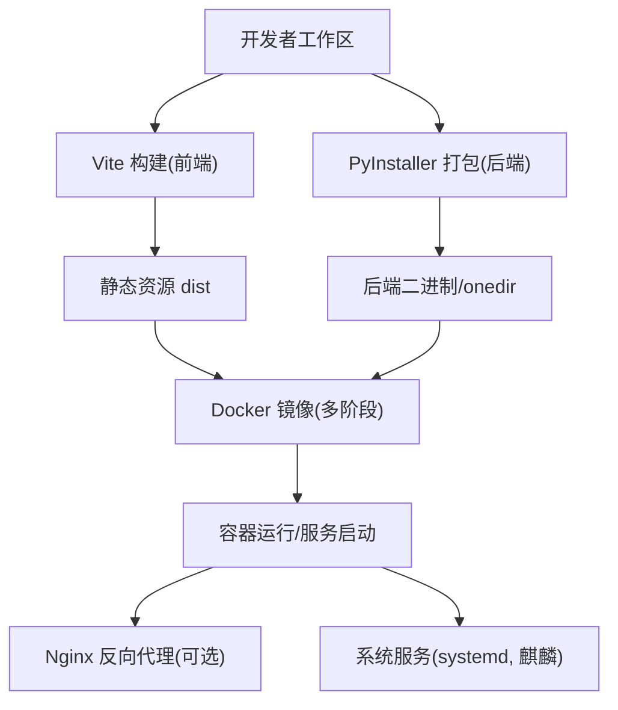
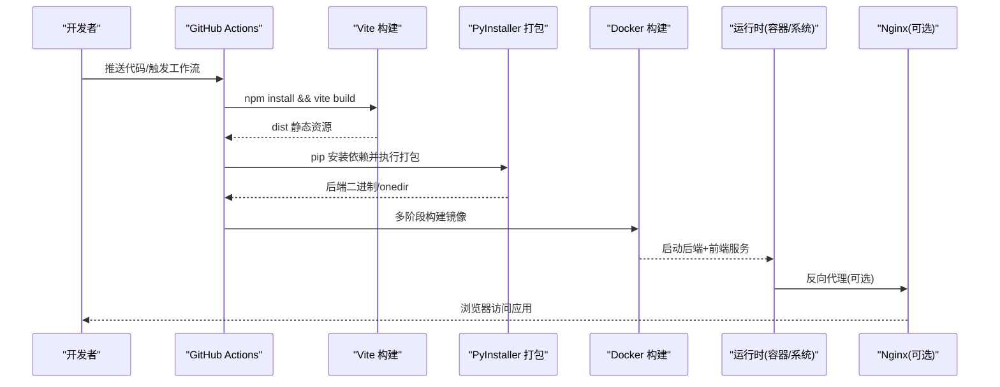
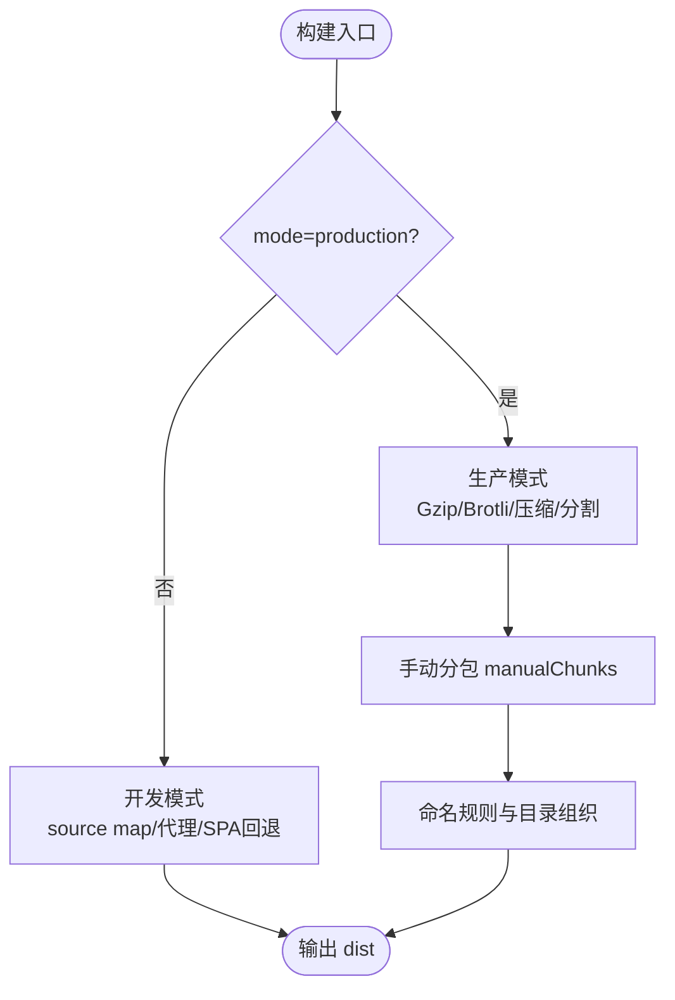
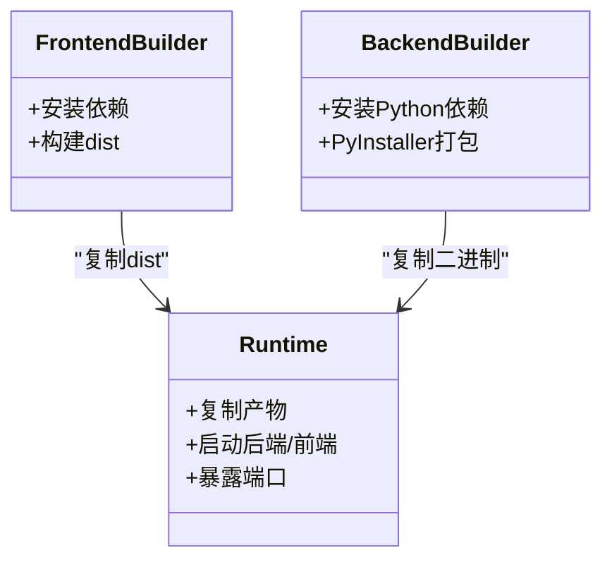
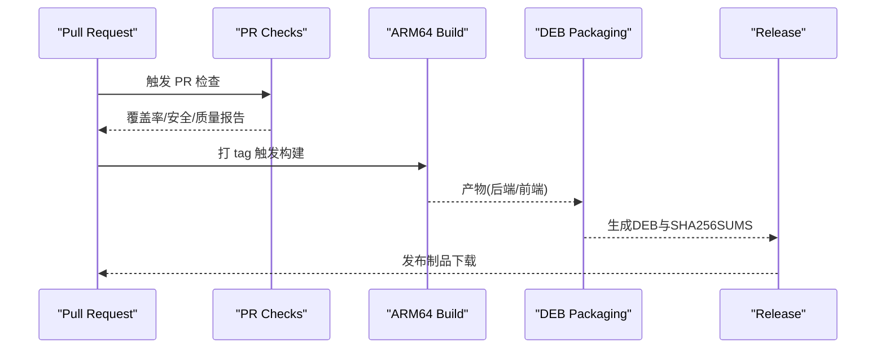
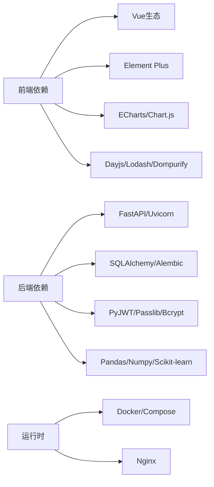

# 构建与部署

<cite>
**本文引用的文件**
- [frontend/vite.config.ts](file://frontend/vite.config.ts)
- [frontend/package.json](file://frontend/package.json)
- [docker/Dockerfile](file://docker/Dockerfile)
- [docker/Dockerfile.kylin-amd64](file://docker/Dockerfile.kylin-amd64)
- [deploy/kylin/config/kylin.env](file://deploy/kylin/config/kylin.env)
- [deploy/kylin/systemd/assistance-management-system.service](file://deploy/kylin/systemd/assistance-management-system.service)
- [backend/app/core/config.py](file://backend/app/core/config.py)
- [backend/requirements.txt](file://backend/requirements.txt)
- [.github/workflows/build-arm64.yml](file:.github/workflows/build-arm64.yml)
- [.github/workflows/pr-checks.yml](file:.github/workflows/pr-checks.yml)
- [nginx/nginx.conf](file://nginx/nginx.conf)
- [docker-compose.yml](file://docker-compose.yml)
</cite>

## 目录
1. [简介](#简介)
2. [项目结构](#项目结构)
3. [核心组件](#核心组件)
4. [架构总览](#架构总览)
5. [详细组件分析](#详细组件分析)
6. [依赖关系分析](#依赖关系分析)
7. [性能考量](#性能考量)
8. [故障排查指南](#故障排查指南)
9. [结论](#结论)
10. [附录](#附录)

## 简介
本章节面向“构建与部署”目标，覆盖 Vite 前端构建、后端打包、容器化镜像、麒麟 V10 适配、CI/CD 流水线与发布回滚策略，并通过实际部署案例串联从开发到生产的完整流程。文档以仓库现有配置为依据，提供可操作的步骤与最佳实践建议。

## 项目结构
本项目采用前后端分离与多形态交付：
- 前端基于 Vue 3 + Vite，生产构建产物为静态资源，支持 Gzip/Brotli 压缩与细粒度代码分割。
- 后端基于 FastAPI，使用 PyInstaller 打包为单文件或 onedir 二进制，便于在多种环境运行。
- 提供 Docker 多阶段构建与 docker-compose 编排；针对麒麟 V10 ARM64 提供专用构建脚本与 DEB 包产出。
- CI/CD 通过 GitHub Actions 完成 PR 检查、ARM64 构建、DEB 打包与 Release 发布。

**图表来源**
- [frontend/vite.config.ts:55-471](file://frontend/vite.config.ts#L55-L471)
- [docker/Dockerfile:7-173](file://docker/Dockerfile#L7-L173)
- [docker/Dockerfile.kylin-amd64:14-234](file://docker/Dockerfile.kylin-amd64#L14-L234)
- [nginx/nginx.conf:1-37](file://nginx/nginx.conf#L1-L37)

**章节来源**
- [frontend/vite.config.ts:55-471](file://frontend/vite.config.ts#L55-L471)
- [docker/Dockerfile:7-173](file://docker/Dockerfile#L7-L173)
- [docker/Dockerfile.kylin-amd64:14-234](file://docker/Dockerfile.kylin-amd64#L14-L234)
- [nginx/nginx.conf:1-37](file://nginx/nginx.conf#L1-L37)

## 核心组件
- Vite 构建配置：开发/生产差异化、插件体系（自动导入、按需引入、压缩）、代码分割策略、资源命名与内联阈值、预览服务器与代理。
- 后端配置与环境变量：Settings 模型、路径动态计算、安全基线（CSRF、CORS、加密密钥）。
- 容器化：多阶段构建（Node/Python/打包/组装）、非 root 用户、端口暴露、健康检查。
- 麒麟 V10 适配：GLIBC 兼容性校验、buster 基础镜像、standalone DEB 构建、systemd 服务与桌面快捷方式。
- CI/CD：PR 门禁（测试覆盖率、lint、安全扫描）、ARM64 构建与 DEB 发布、版本同步与制品清单。

**章节来源**
- [frontend/vite.config.ts:55-471](file://frontend/vite.config.ts#L55-L471)
- [backend/app/core/config.py:54-383](file://backend/app/core/config.py#L54-L383)
- [docker/Dockerfile:7-173](file://docker/Dockerfile#L7-L173)
- [docker/Dockerfile.kylin-amd64:14-234](file://docker/Dockerfile.kylin-amd64#L14-L234)
- [.github/workflows/pr-checks.yml:17-134](file:.github/workflows/pr-checks.yml#L17-L134)
- [.github/workflows/build-arm64.yml:17-385](file:.github/workflows/build-arm64.yml#L17-L385)

## 架构总览
下图展示从源码到可运行服务的整体构建与部署链路，包括前端构建、后端打包、容器镜像、服务编排与反向代理。

**图表来源**
- [.github/workflows/build-arm64.yml:69-199](file:.github/workflows/build-arm64.yml#L69-L199)
- [docker/Dockerfile:7-173](file://docker/Dockerfile#L7-L173)
- [nginx/nginx.conf:11-35](file://nginx/nginx.conf#L11-L35)

## 详细组件分析

### Vite 构建配置（开发与生产）
- 开发模式
  - SPA 回退中间件确保 history 路由正常。
  - 开发服务器监听本地端口，代理 /api 与 /uploads 至后端。
  - 启用 source map，便于调试。
- 生产模式
  - 生成 version.json 用于前端版本指纹校验。
  - 启用 Gzip 与 Brotli 压缩（阈值 10KB），提升传输效率。
  - 精细代码分割：Vue 核心、Router、Pinia、ECharts、Chart.js、xlsx、driver.js、sortablejs、axios、dompurify、lodash、core-js 等独立 chunk，避免首屏过大。
  - 输出命名规范：JS/CSS/图片/字体按类型分目录并带 hash，利于缓存。
  - Terser 优化：移除 console/debugger、死代码、混淆顶级作用域变量名。
  - 模块预加载 polyfill 开启，小资源内联阈值 4KB。
  - 依赖预构建优化：包含常用库，排除按需加载的图表库。

**图表来源**
- [frontend/vite.config.ts:55-471](file://frontend/vite.config.ts#L55-L471)

**章节来源**
- [frontend/vite.config.ts:55-471](file://frontend/vite.config.ts#L55-L471)
- [frontend/package.json:7-19](file://frontend/package.json#L7-L19)

### 静态资源处理与环境变量管理
- 静态资源
  - public 目录复制到 dist，图片/字体/CSS 按扩展名分类输出并加 hash。
  - assetsInlineLimit 控制小资源内联，减少请求数。
- 环境变量
  - 前端通过 Vite 内置机制注入（如 process.env.*），配合构建时生成 version.json。
  - 后端通过 Settings 模型读取 .env 或环境变量，支持加密密钥文件与运行时密钥持久化。
  - 麒麟 standalone 使用 kylin.env 作为 systemd EnvironmentFile，集中管理数据库、日志、前端路径与安全参数。

**章节来源**
- [frontend/vite.config.ts:211-426](file://frontend/vite.config.ts#L211-L426)
- [backend/app/core/config.py:54-383](file://backend/app/core/config.py#L54-L383)
- [deploy/kylin/config/kylin.env:1-49](file://deploy/kylin/config/kylin.env#L1-L49)

### 构建产物分析与优化建议
- 产物结构
  - JS/CSS/图片/字体按类型分目录，chunk 名称体现用途（vue-core、echarts、vendor 等）。
  - 报告压缩后大小，便于评估体积影响。
- 优化建议
  - 对超大页面进一步拆分路由级懒加载。
  - 将第三方大库（如 ECharts）保持按需引入与独立 chunk。
  - 结合 CDN 外部化（通过 rollupOptions.external）降低包体。
  - 监控 chunkSizeWarningLimit，避免单个 chunk 过大。

**章节来源**
- [frontend/vite.config.ts:266-426](file://frontend/vite.config.ts#L266-L426)

### Docker 容器化部署（多阶段构建与镜像优化）
- 多阶段构建
  - 阶段1：Node 22 构建前端静态资源。
  - 阶段2：Python 3.11 安装依赖并使用 PyInstaller 打包后端。
  - 阶段3：最小化运行镜像，仅安装必要运行时依赖，创建非 root 用户，复制产物并启动服务。
- 镜像优化
  - 使用 Alpine/Debian slim 基础镜像。
  - 仅安装运行所需 Python 包与系统库。
  - 通过 serve 托管前端静态资源，暴露 8000/3000 端口。
- 健康检查与资源限制
  - docker-compose 中定义 healthcheck、资源限制与日志轮转。

**图表来源**
- [docker/Dockerfile:7-173](file://docker/Dockerfile#L7-L173)

**章节来源**
- [docker/Dockerfile:7-173](file://docker/Dockerfile#L7-L173)
- [docker-compose.yml:15-80](file://docker-compose.yml#L15-L80)

### 麒麟 V10 特殊适配与部署注意事项
- GLIBC 兼容
  - 使用 buster 基础镜像构建后端，确保 GLIBC 不高于 2.28，满足麒麟 V10 Server/Desktop 要求。
  - 构建过程中验证 libpython 最高 GLIBC 要求，失败即中止。
- 依赖裁剪
  - 生成 requirements-arm64.txt，剔除无 ARM64 wheel 或不需要的包，保证打包成功率。
- 交付物
  - 构建 standalone DEB，内含后端二进制、前端静态资源、systemd 服务、桌面快捷方式与 polkit 规则。
  - 安装后通过 systemd 管理服务，使用 kylin.env 配置运行参数。
- 注意事项
  - 维护脚本必须 LF 行尾，避免 postinst 无法执行。
  - 桌面环境需安装推荐浏览器（firefox-esr/chromium）。

**章节来源**
- [docker/Dockerfile.kylin-amd64:36-135](file://docker/Dockerfile.kylin-amd64#L36-L135)
- [docker/Dockerfile.kylin-amd64:137-234](file://docker/Dockerfile.kylin-amd64#L137-L234)
- [deploy/kylin/systemd/assistance-management-system.service:1-51](file://deploy/kylin/systemd/assistance-management-system.service#L1-L51)
- [deploy/kylin/config/kylin.env:1-49](file://deploy/kylin/config/kylin.env#L1-L49)

### CI/CD 流水线与自动化发布
- PR 检查
  - 后端：pytest 覆盖率门禁（≥98%）、flake8/mypy/bandit 静态检查。
  - 前端：TypeScript 类型检查、ESLint、Vitest 测试与覆盖率。
  - 安全：pip-audit、npm audit 高及以上阻断，SBOM 许可证清单上传。
- 构建与发布
  - ARM64 后端二进制构建（QEMU + Buildx）。
  - 前端构建并上传 artifact。
  - Electron DEB 构建（arm64），注入 postinst 修复权限，生成 SHA256SUMS。
  - Standalone DEB（无 Electron）通过 Dockerfile.kylin-standalone 构建，输出到 dist/deb/output。
  - 打 tag 触发 Release 发布，附带制品与完整性清单。

**图表来源**
- [.github/workflows/pr-checks.yml:17-134](file:.github/workflows/pr-checks.yml#L17-L134)
- [.github/workflows/build-arm64.yml:17-385](file:.github/workflows/build-arm64.yml#L17-L385)

**章节来源**
- [.github/workflows/pr-checks.yml:17-134](file:.github/workflows/pr-checks.yml#L17-L134)
- [.github/workflows/build-arm64.yml:17-385](file:.github/workflows/build-arm64.yml#L17-L385)

### 服务编排与反向代理
- docker-compose
  - 主服务 assistance-system 暴露后端 8000、前端 3000。
  - 可选 PostgreSQL/Redis/Nginx 服务，通过 profiles 控制启用。
  - 数据卷挂载实现持久化，健康检查保障可用性。
- Nginx
  - 全局 gzip 压缩、日志格式、客户端最大请求体限制。
  - 站点配置通过 conf.d/*.conf 引入，便于扩展。

**章节来源**
- [docker-compose.yml:15-214](file://docker-compose.yml#L15-L214)
- [nginx/nginx.conf:1-37](file://nginx/nginx.conf#L1-L37)

## 依赖关系分析
- 前端依赖
  - Vue 生态（vue、vue-router、pinia）、UI（element-plus）、图表（echarts/chart.js）、工具（dayjs/lodash/dompurify）等。
  - 构建工具链（vite、terser、unplugin-auto-import、unplugin-vue-components）。
- 后端依赖
  - Web 框架（fastapi、uvicorn、starlette）、数据库（SQLAlchemy、alembic）、认证安全（PyJWT、passlib、bcrypt、cryptography）、数据处理（pandas/numpy/scikit-learn）、日志监控（python-json-logger/diskcache）等。
- 容器与编排
  - Node 22、Python 3.11、serve、Nginx、PostgreSQL、Redis。

**图表来源**
- [frontend/package.json:26-67](file://frontend/package.json#L26-L67)
- [backend/requirements.txt:1-137](file://backend/requirements.txt#L1-L137)
- [docker-compose.yml:84-188](file://docker-compose.yml#L84-L188)

**章节来源**
- [frontend/package.json:26-67](file://frontend/package.json#L26-L67)
- [backend/requirements.txt:1-137](file://backend/requirements.txt#L1-L137)
- [docker-compose.yml:84-188](file://docker-compose.yml#L84-L188)

## 性能考量
- 前端
  - 代码分割与按需引入减少首屏体积。
  - Gzip/Brotli 压缩与资源缓存策略提升加载速度。
  - 模块预加载 polyfill 与小资源内联降低请求开销。
- 后端
  - SQLite WAL 模式与连接池调优（pool_size/max_overflow）提升并发能力。
  - 日志级别与旋转策略避免磁盘占用过高。
- 容器
  - 多阶段构建减小镜像体积。
  - 非 root 用户与最小化运行时依赖增强安全性与稳定性。

[本节为通用指导，无需特定文件引用]

## 故障排查指南
- 构建失败
  - 前端：检查 npm 安装与构建日志，确认依赖版本与 Node 版本匹配。
  - 后端：确认 PyInstaller 打包环境与 GLIBC 兼容，查看 buster 基础镜像与依赖安装日志。
- 运行异常
  - 环境变量：核对 kylin.env 与后端 Settings 模型字段是否一致。
  - 权限问题：检查 systemd 服务用户与读写路径权限。
  - 网络代理：确认 Nginx 与后端端口映射正确，CORS 配置允许来源。
- 安全与合规
  - CSRF 保护：单机离线场景可按需关闭，但生产环境建议启用。
  - 依赖漏洞：关注 pip-audit 与 npm audit 报告，及时升级依赖。

**章节来源**
- [deploy/kylin/config/kylin.env:1-49](file://deploy/kylin/config/kylin.env#L1-L49)
- [backend/app/core/config.py:126-154](file://backend/app/core/config.py#L126-L154)
- [deploy/kylin/systemd/assistance-management-system.service:7-40](file://deploy/kylin/systemd/assistance-management-system.service#L7-L40)
- [.github/workflows/pr-checks.yml:84-134](file:.github/workflows/pr-checks.yml#L84-L134)

## 结论
本项目提供了完善的前后端构建与部署方案：Vite 精细化构建与优化、后端 PyInstaller 打包、多阶段 Docker 镜像、麒麟 V10 深度适配与 DEB 交付、以及完整的 CI/CD 流水线。通过合理的代码分割、资源优化与安全基线，系统在开发、测试与生产环境均具备良好可维护性与稳定性。建议在持续集成中强化覆盖率与安全检查，在生产环境启用反向代理与健康检查，以实现高可用与易运维。

[本节为总结性内容，无需特定文件引用]

## 附录
- 快速开始
  - 本地开发：启动前端 dev server 与后端服务，使用 Vite 代理访问 API。
  - 容器运行：使用 docker-compose 启动主服务与可选依赖。
  - 麒麟安装：安装 standalone DEB，通过 systemd 管理服务。
- 版本与发布
  - 打 tag 触发 ARM64 构建与 DEB 发布，制品包含 SHA256SUMS 清单。
  - 版本号同步脚本确保各层版本一致。

[本节为补充说明，无需特定文件引用]